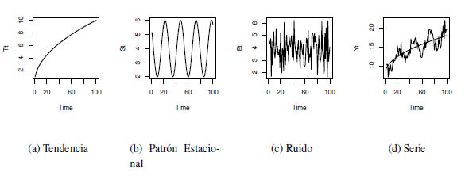

# Introducción

Las series de tiempo ya han desempeñado un papel importante en las primeras ciencias naturales. La astronomía babilónica utilizó series de tiempo de las posiciones relativas de estrellas y planetas para predecir eventos astronómicos. Las observaciones de los movimientos de los planetas formaron la base de las leyes que Johannes Kepler descubrió. El análisis de las series de tiempo ayuda a detectar las regularidades en las observaciones de una variable y a derivar "leyes" de ellas, y/o explotar toda la información incluida en esta variable para predecir mejor los desarrollos futuros. La idea metodológica básica detrás de estos procedimientos, que también eran válidos para los babilonios, es que es posible descomponer series de tiempos en un número finito de componentes independientes pero no directamente observables que se desarrollan regularmente y que por lo tanto pueden ser calculados de antemano. Para este procedimiento es necesario que existan diferentes factores independientes que incidan en la variable.

 A mediados del siglo XIX, este enfoque metodológico de la astronomía fue asumido por los economistas Charles Babbage y William Stanley Jevons. La descomposición en componentes no observados que dependen de diferentes factores causales, como suele emplearse en el análisis clásico de series de tiempo, fue desarrollada por Warren M. Persons (1919). Distinguía cuatro componentes diferentes:

- Desarrollo a largo plazo, tendencia,

- Componente cíclico con períodos de más de un año, el ciclo económico,

- Componente que contiene los altibajos dentro de un año, el ciclo estacional, y

- Componente que contiene todos los movimientos que no pertenecen ni a la tendencia ni al ciclo económico ni al componente estacional, el residual.


Suponiendo que los diferentes factores no observables son independientes, su recubrimiento aditivo genera las series de tiempo que, sin embargo, sólo podemos observar en su conjunto. Para obtener información sobre el proceso de generación de datos, tenemos que hacer suposiciones sobre sus componentes no observados. El análisis clásico de series de tiempo supone que los componentes sistemáticos, es decir, la tendencia, el ciclo económico y el ciclo estacional, no están influenciados por perturbaciones estocásticas y, por lo tanto, pueden representarse mediante funciones determinísticas del tiempo. El impacto estocástico se limita a los residuos, que, por otra parte, no contienen movimientos sistemáticos. Por lo tanto, se modela como una serie de variables aleatorias independientes o no correlacionadas con esperanza cero y varianza constante, es decir, como un proceso aleatorio puro.


Este enfoque cambió desde la presentación de los trabajos de George E. P. Box and Gwilym M. Jenkins, "Time Series Analysis: Forecasting and Control", en los años 70 del siglo XX. Se abandonaron los procedimientos puramente descriptivos del análisis clásico de series de tiempo y, en su lugar, se han utilizado los resultados y métodos de la teoría de la probabilidad y las estadísticas matemáticas. Desde ese entonces, el análisis de series ha tenido un desarrollo creciente. Se han presentado una gran variedad de libros sobre este tópico, cada uno de ellos influenciado principalmente por la orientación de las series que se discuten en sus contenidos. Una gran parte de la literatura está dirigida a exponer los aspectos teóricos alrededor de las series de tiempo, siendo en muchos casos, rigurosamente desarrollados y descritos, sin embargo poco de ellos presentan implementaciones de las técnicas estudiadas y su compresión en ejemplos reales lo que a veces puede dificultar su comprensión en especial para aquellos que no posean una apropiada formación matemática.

Los primeros intentos de estudiar el comportamiento de las series de tiempo financieras fueron realizados por profesionales financieros y periodistas en lugar de por académicos. De hecho, esto parece haberse convertido en una tradición de larga data, ya que, incluso hoy en día, gran parte de la investigación y el desarrollo empíricos todavía se originan en la propia industria financiera. Esto puede explicarse por el carácter práctico de los problemas, la necesidad de datos especializados y las posibles ventajas de dicho análisis. El primer y más conocido ejemplo de la investigación publicada sobre series de tiempo financieras es el legendario Charles Dow, como se expresa en sus editoriales en el Wall Street Times entre 1900 y 1902. Estos escritos formaron la base de la "teoría del Dow" e influyeron en lo que más tarde se conoció como análisis técnico y carisma. Aunque Dow no coleccionó y publicó sus editoriales por separado, esto fue hecho póstumamente por su seguidor Samuel Nelson (Nelson, 1902). Las ideas originales de Dow fueron posteriormente interpretadas y ampliadas por Hamilton (1922) y Rhea (1932). Estas ideas gozaron de cierto reconocimiento entre los académicos de la época: por ejemplo, Hamilton fue elegido miembro de la Royal Statistical Society. 

Aunque Dow y sus seguidores discutieron muchas de las ideas que encontramos en el análisis moderno de finanzas y series de tiempo, incluyendo estacionalidad, eficiencia del mercado, correlación entre rendimiento de activos e índices, diversificación e imprevisibilidad, no hicieron ningún esfuerzo serio para adoptar métodos estadísticos formales. La mayor parte del análisis empírico consistió en la interpretación minuciosa de gráficos detallados de las medias bursátiles sectoriales, formando así los famosos Índices Dow-Jones. Se argumentó que estos índices descuentan toda la información necesaria y proporcionan el mejor pronóstico de eventos futuros. Una idea fundamental, muy relevante para la teoría de los ciclos de Stanley Jevons y la metodología de descomposición de tendencias de la "curva Harvard A-B-C" de Warren Persons, fue que las variaciones de precios del mercado consistían en tres movimientos primarios: diarios, a medio y largo plazo. 

La investigación empírica más temprana que utiliza métodos estadísticos formales se remonta a los documentos de Working (1934), Cowles (1933,1944) y Cowles and Jones (1937). El trabajo centró la atención en una característica previamente señalada de los precios de las materias primas y las acciones: que se asemejan a la acumulación de cambios puramente aleatorios. Alfred Cowles 3rd, analista financiero cuantitativamente entrenado y fundador de Econometric Society and the Cowles Foundation, investigó la habilidad de los analistas de mercado y servicios financieros para predecir los futuros cambios de precios, encontrando que había pocas pruebas de que pudieran hacerlo. Cowles y Jones reportaron evidencia de correlación positiva entre sucesivas variaciones de precios, pero, como posteriormente Cowles (1960) comentó, esto fue probablemente debido a que tomaron promedios mensuales de precios diarios o semanales antes de computar los cambios: un fenómeno de "correlación espuria", analizado por Working (1960).

La previsibilidad de los cambios de precios se ha convertido desde entonces en un tema importante de la investigación financiera, pero, sorprendentemente, poco más se publicó hasta el estudio de Kendall (1953), en el que encontró que los cambios semanales en una amplia variedad de precios financieros no podían predecirse ni a partir de los cambios pasados en las series ni a partir de los cambios pasados en otras series de precios. Este parece haber sido el primer informe explícito de esta propiedad de los precios financieros a menudo citada, aunque la investigación sobre la previsibilidad de los precios sólo se vio impulsada por la publicación de los documentos de Roberts (1959) y Osborne (1959). El primero presenta un argumento en gran medida heurístico sobre por qué las sucesivas variaciones de precios deben ser independientes, mientras que el segundo desarrolla la proposición de que no se trata de cambios absolutos de precios, sino de cambios logarítmicos de precios independientes entre sí. Con la suposición auxiliar de que las propias modificaciones se distribuyen normalmente, esto implica que los precios se generan como movimiento Browniano.

El análisis de series de tiempo desempeña un papel importante en el análisis requerido para el pronóstico de eventos futuros. Existen varias formas o métodos de calcular cual va a ser la tendencia del comportamiento del proceso en estudio.

Un **pronóstico** es una predicción de algún evento o eventos futuros. Como sugirió Neils Bohr, hacer buenas predicciones no siempre es fácil. Los pronósticos famosamente "malos" incluyen lo siguiente del libro *"Malas Predicciones"*:

 

- "La población es de tamaño constante y se mantendrá hasta el fin de la humanidad." La Enciclopedia, 1756.

 

- "1930 será un espléndido año de empleo." Departamento de Trabajo de los EE.UU., pronóstico de Año Nuevo en 1929, justo antes de que el mercado se desplomara el 29 de octubre.

 

- "Las computadoras se multiplican a un ritmo rápido. Para el cambio de siglo habrá 220,000 en los EE.UU." Wall Street Journal, 1966.


Algunos ejemplos donde se puede utilizar y hacer precciones con series de tiempo:
  
1) **Dirección de Operaciones**. Las organizaciones empresariales utilizan habitualmente las previsiones de ventas de productos o la demanda de servicios para programar la producción, controlar los inventarios, gestionar la cadena de suministro, determinar las necesidades de personal y planificar la capacidad. Las previsiones también pueden utilizarse para determinar la combinación de productos o servicios que deben ofrecerse y las ubicaciones en las que deben fabricarse los productos.


2) **Marketing**. La previsión es importante en muchas decisiones de marketing. Las previsiones de respuesta de las ventas a los gastos publicitarios, las nuevas romociones o los cambios en las políticas de precios permiten a las empresas evaluar su eficacia, determinar si se están alcanzando los objetivos y realizar ajustes.


3) **Finanzas y Gestión de Riesgos**. Los inversores en activos financieros están interesados en pronosticar los rendimientos de sus inversiones. Estos activos incluyen, pero no se limitan a acciones, bonos y materias primas; otras decisiones de inversión se pueden tomar en relación con las previsiones de tasas de inter?s, opciones y tipos de cambio. La gestión del riesgo financiero requiere previsiones de la volatilidad de la rentabilidad de los activos para que se puedan evaluar y asegurar los riesgos asociados a las carteras de inversion, y para que los derivados financieros puedan cotizarse adecuadamente.


4) **Economía**. Los gobiernos, las instituciones financieras y las organizaciones de política requieren pronósticos de las principales variables económicas, como el producto interno bruto, el crecimiento demográfico, el desempleo, las tasas de interés, la inflación, el crecimiento del empleo, la producción y el consumo. Estas previsiones son parte integrante de la orientación de la política monetaria y fiscal, así como de los planes y decisiones presupuestarias adoptadas por los gobiernos. también son fundamentales en las decisiones de planificación estratégica tomadas por organizaciones empresariales e instituciones financieras.


5) **Control de Procesos Industriales**. Las previsiones de los valores futuros de las características de calidad crítica de un proceso de producción pueden ayudar a determinar cuándo deben cambiarse las variables controlables importantes del proceso, o si el proceso debe detenerse y revisarse. Los esquemas de retroalimentación y control feedforward son ampliamente utilizados en el monitoreo y ajuste de procesos industriales, y las predicciones de la producción del proceso son una parte integral de estos esquemas. 


6) **Demografía**. Las previsiones de población por país y región se realizan de manera rutinaria, a menudo estratificadas por variables como el género, la edad y la raza. Los demógrafos también pronostican nacimientos, muertes y patrones migratorios de las poblaciones. Los gobiernos utilizan estas previsiones para planificar políticas y acciones de servicio social, como el gasto en atención médica, programas de jubilación y programas de lucha contra la pobreza. Muchas empresas utilizan pronósticos de poblaciones por grupos de edad para hacer planes estratégicos en relación con el desarrollo de nuevas líneas de productos o tipos de servicios que será ofrecido.


## Conceptos financieros básicos

La mayoría de los estudios financieros y econ?micos implican rendimiento, en lugar de precios de los activos. Existen dos buenas razones para ello. Primero, para los inversores medios, el rendimiento de un activo es un resumen completo y libre de escala de la oportunidad de inversión. Segundo, las series de rendimiento son más fáciles de manejar que las series de precios porque las primeras tienen propiedades estadísticas más atractivas. Sin embargo, existen varias definiciones de rendimiento de activos. Sea $P_t$ el precio de un activo en tiempo $t$. Discutiremos algunas definiciones de rendimiento que utilizaremos a lo largo del libro. Supongamos por el momento que el activo no paga dividendos.

```{definition, defi-rendimiento-simple, name="Rendimiento simple de un periodo"}
Mantener el activo fijo durante un periodo a partir de tiempo $t-1$ hasta tiempo $t$ da lugar a una **rentabilidad bruta simple**
\begin{equation}
1+R_t=\frac{P_t}{P_{t-1}}\quad\text{ o }\quad P_t=P_{t-1}(1+R_t)
(\#eq:eq-rentabilidad-bruta-simple)
\end{equation}
El correspondiente **rendimiento neto simple** de un periodo o **rendimiento simple** es 
\begin{equation}
R_t=\frac{P_t}{P_{t-1}}-1=\frac{P_t-P_{t-1}}{P_{t-1}}
(\#eq:eq-rendimiento-neto-simple)
\end{equation}
```  

```{definition, defi-rendimiento-simple-multiperiodo, name="Rendimiento simple multiperiodo"}
Mantener el activo fijo durante $k$ periodos entre los tiempos $t-k$ y $t$ da un **rendimiento bruto simple de periodo $k$**
\begin{eqnarray*}
1+ R_t[k] &=& \frac{P_t}{P_{t-k}} = \frac{P_t}{P_{t-1}}\times\frac{P_{t-1}}{P_{t-2}}\times \cdots \times\frac{P_{t-k+1}}{P_{t-k}} \\
        &=& (1+R_t)(1+R_{t-1})\cdots(1+R_{t-k+1}) \\
        &=& \prod_{j=0}^{k-1}(1+R_{t-j})
\end{eqnarray*}
```

De la definición, se tiene que la rentabilidad bruta simple de periodo $k$ es el producto de las $k$ rentabilidades brutas simples de un periodo. Esto se llama **rendimiento compuesto**. El **rendimiento neto simple de periodo $k$** es $R_t[k]=(P_t-P_{t-k})/P_{t-k}$.

En la práctica, el intervalo de tiempo real es importante para discutir y comparar los rendimientos (por ejemplo, rendimiento mensual o rendimiento anual). Si no se indica el intervalo de tiempo, se asume implícitamente que es de un año. Si el activo se mentuvo durante $k$ años, entonces el rendimiento anualizado se define como

$$\text{Anualizado}\{R_t[k]\} = \left[\prod_{j=0}^{k-1}(1+R_{t-j})\right]^{1/k}-1.$$
Esta es una media geométrica de los $k$ rendimientos brutos simple de un periodo y lo podemos calcular por 

$$\text{Anualizado}\{R_t[k]\} = \exp\left[\frac{1}{k}\sum_{j=0}^{k-1}\ln(1+R_{t-j})\right]-1.$$

Debido a que es más fácil calcular el promedio aritmético que la media geométrica y los rendimientos de un periodo tienden a ser pequeños, podemos utilizar el desarrollo de Taylor de primer orden para aproximar el rendimiento anualizado y obtener

\begin{equation}
\text{Anualizado}\{R_t[k]\} \approx \frac{1}{k}\sum_{j=0}^{k-1}R_{t-j}
(\#eq:eq-rendimiento-anualizado)
\end{equation}

Sin embargo, la exactitud de la aproximación en la ecuación \@ref(eq:eq-rendimiento-anualizado) puede no ser suficiente en algunas aplicaciones.

Otra definición útil es la de **rendimiento compuesto continuo**, pero antes de discutir tales definiciones, discutamos el efecto de la capitalización. Supongamos que la tasa de interés de un depósito bancario es del 10% anual y el depósito inicial es de $\$1,00$. Si el banco paga intereses una vez al año, entonces el valor neto del depósito se convierte en $\$1,00(1+0.10)=\$1,10$ un año después. Si el banco paga intereses semestralmente, el tipo de interés a 6 meses es $10\%/2=5\%$ y el valor del depósito será $\$1,00(1+0.10/2)2=\$1,1025$ después del primer año. En general, si el banco para intereses $m$ veces al año, entonces la tasa de interés para cada pago es $10\%/m$ y el valor neto del depósito se convierte en $\$1.00(1+0.1/m)m$ un año después. La tabla siguiente da los resultados para algunos intervalos de tiempo comúnmente usados. En particular, el valor neto se aproxima a $\$1,1052$, que se obtiene con $\exp(0.1)$ y se refiere al resultado de la capitalización continua.


Tipo        Número de pagos  Tasa de interés por periodo  Valor neto
----------  ---------------  ---------------------------  ----------
Anual           1             0.1                         $1.10000
Semestral       2             0.05                        $1.10250
Trimestral      4             0.025                       $1.10831
Mensual        12             0.0083                      $1.10471
Semanal        52             0.1/52                      $1.10506
Diario        365             0.1/365                     $1.10516
Continuo      Inf.                                        $1.10517

Tabla. Ilustración de los efectos de la combinación. El intervalo de tiempo es de 1 año y la tasa de interés es del 10% anual.


En general, el valor liquidativo $A$ de la capitalización continua es
\begin{equation}
A=C\exp(r\times n)
(\#eq:eq-valor-capitalizacion-continua)
\end{equation}
donde $r$ es el tipo de interés anual, $C$ es el capital inicial y $n$ es el número de años. A partir de la ecuación \@ref(eq:eq-valor-capitalizacion-continua), tenemos 
\begin{equation}
C=A\exp(-r\times n)
(\#eq:eq-valor-presente-activo)
\end{equation}
el cual se refiere como el valor presente de un activo que vale $A$ dolares $n$ años a partir de ahora, asumiendo que la tasa de interés compuesta continua es $r$ por año.

```{definition, defi-rendimiento-compuesto-continuo, name="Rendimiento compuesto continuo"}
El logaritmo natural de rendimiento bruto simple de un activo se denomina **rendimiento compuesto continuo** o **rendimiento logarítmico**
\begin{equation}
r_t=\ln(1+R_t) = \ln\left(\frac{P_t}{P_{t-1}}\right) = p_t-o_{t-1}
(\#eq:eq-rendimiento-compuesto-continuo)
\end{equation}
donde $p_t=\ln(P_t)$.
```

Los rendimientos compuestos continuos deisfrutan de algunas ventajas sobre los rendimientos netos simples $R_t$. En primer lugar, consideremos los rendimientos multiperiodos. Tenemos
\begin{eqnarray*}
r_t[k] &=& \ln(1+R_t[k]) = \ln[(1+R_t)(1+R_{t-1})\cdots(1+R_{t-k+1})]\\
       &=& \ln(1+R_t)+\ln(1+R_{t_1})+\cdots+\ln(1+R_{t-k+1})\\
       &=& r_t+r_{t-1}+\cdots+r_{t-k+1}.
\end{eqnarray*}
Por lo tanto, el rendimiento multiperiodo compuesto continuo es simplemente la suma de los rendimientos compuesto continuo de un periodo involucrados. En segundo lugar, las propiedades estadísticas de los logaritmos de los rendimientos son más manejables.

```{definition, defi-rentabilidad-cartera, name="Rentabilidad de la cartera"}
El rendimiento neto simple de una cartera de inversión compuesta por $N$ activos es una media ponderada de los rendimientos netos simples de los activos en cuestión, en la que la ponderación de cada activo es el porcentaje del valor de la cartera invertido en ese activo. Sea $p$ un portafolio que ponga peso con el activo $i$, entonces el rendimineto simple $p$ en el tiempo $t$ es
$$R_{p,t} = \sum_{i=1}^N\omega_iR_{it}$$
donde $R_{it}$ es el rendimiento simple del activo $i$.
```

Los rendimientos compuestos continuos de una cartera, sin embargo, no tienen la propiedad conveniente anterior. Si los rendimientos simples $R_t$ son todos pequeños en magnitud, entonces tenemos
$$r_{p,t} \approx \sum_{i=1}^N\omega_ir_{it}$$
donde $r_{p,t}$ es el rendimiento compuesto continuo de la cartera en el momento $t$. Esta aproximación se utiliza a menudo para estudiar los rendimientos de las carteras.

```{definition, defi-pago-dividendos, name="Pago de dividendos"}
Si un activo paga dividendos periódicamente, debemos modificar las definiciones de rendimientos de activos.

Sea $D_t$ el pago de dividendos de un activo entre los tiempos $t-1$ y $t$ y sea $P_t$ el precio del activo al final del periodo $t$. Entonces el dividendo no se incluye en $P_t$. Entonces el rendimiento neto simple y el rendimiento compuesto continuo en el tiempo $t$ están dados por
\begin{eqnarray*}
R_t &=& \frac{P_t+D_t}{P_{t-1}}-1 \\
r_t &=& \ln(P_t+D_t) - \ln(P_{t-1})
\end{eqnarray*}
```

```{definition, exceso-rendimiento, name="Exceso de rendimiento"}
El **rendimiento excesivo** de un activo en el momento $t$ es la diferencia entre el rendimiento del activo y el rendimiento de algún activo de referencia.
```

A menudo se considera que el activo de referencia no tiene riesgo, como una devolución de letras del Tesoro de EE.UU. a corto plazo. El exceso de rentabilidad simple y el logaritmo de exceso de rentabilidad de un activo se definen como 
\begin{equation}
Z_t = R_t-R_{0t}; \quad z_t=r_t-r_{0t}
(\#eq:eq-exceso-rentabilidad-simple-log)
\end{equation}
donde $R_{0t}$ y $r_{0t}$ son los rendimientos simples y logarítmicos del activo de referencia, respectivamente.

En la literatura financiera, el exceso de rentabilidad se considera como el pago de una cartera de arbitraje que va larga en un activo y corta en el activo de referencia sin inversión inicial neta.

** Resumen de la relación**

Las relaciones entre el rendimiento simple $R_t$ y el rendimiento compuesto continuo (o logarítmico) $r_t$ son
$$r_t=\ln(1+R_t), \qquad R_t=e^{r_t}-1$$
La agregación temporal de los rendimientos produce
\begin{eqnarray*}
1+R_t[k] &=& (1+R_t)(1+R_{t-1})\cdots(1+R_{t-k+1}) \\
  r_t[k] &=& r_t+r_{t-1}+\cdots+r_{t-k+1}
\end{eqnarray*}
Si el tipo de interés compuesto continuo es por año, entonces la relación entre los valores presentes y futuros de un activo fijo es
$$A = C\exp(r\times n),\qquad C=A\exp(-r\times n).$$

## Conceptos básicos 

Una serie tiempo es una secuencia de observaciones, medidos en determinados momentos del tiempo, ordenados cronológicamente y, espaciados entre sí de manera uniforme, así los datos usualmente son dependientes entre sí. El principal objetivo de una serie de tiempo es su análisis para hacer pronóstico. Formalmente se tiene la siguiente definición.


```{definition, defi-serie-tiempo}
Una **serie de tiempo** es un conjunto de observaciones $x_t$, cada una registrada a un tiempo específico $t$.

```


```{definition, defi-modelo-serie-tiempo}
Un **modelo de series de tiempo** para los datos observados $\{x_t\}$ es una especificación de una distribución conjunta (o posiblemente solo de medias y covarianzas) de una sucesión de variables aleatorias $\{X_t\}$ de las cuales $\{x_t\}$ es una realización.
```

A continuación presentaremos una serie de ejemplos que demuestran la utilidad y lo cotidiano de las series de tiempo, también se mostrarán los códigos en **R** para cargar los archivos de datos y graficar las respectivas series de tiempo.

## Ejemplos 
```{example, ejem-beneficios-acciones, name="Beneficios de acciones"}
Beneficios por acción trimestrales para la compañía Johnson y Johnson. Se tienen 84 trimestres iniciando el primer trimestre de 1960 hasta el último trimestre de 1980. Los métodos para analizar tales datos se verán en el Tema 3 usando técnicas de regresión. El archivo es *"jj.txt"*.

Los comandos en R para cargar el archivo y graficar la serie de tiempo son los siguientes:
```

```{r,fig.align = "center",fig.cap="Beneficios por acción trimestrales para la compañía Johnson y Johnson"}
jj=ts(scan("data/jj.txt"),start=1960,freq=4) 
plot(jj, type="l",ylab="Beneficios por acción trimestrales")
``` 

```{example, reservas-internacionales}
El archivo *"ReservasInternacionales.xlsx"*, contiene el registro mensual de Reservas Internacionales Venezolanas en millones de dólares ($), iniciando en el mes de enero de 1996 hasta el mes de diciembre de 2017
```

```{r,fig.align = "center",fig.cap="Reservas Internacionales de Venezuela (millones $) 1996-2017"}
library(readxl)
reservas <- read_excel("data/ReservasInternacionales.xlsx")
reservas=ts(reservas,start = 1996,frequency = 12)
plot.ts(reservas[,2], xlab="Año",ylab="Monto",
        main="Reservas Internacionales de Venezuela (millones $)")
```


```{example, precio-petroleo}
El archivo *"PreciosPetroleoVzla.xlsx"* contiene el precio promedio mensual de venta para el petróleo venezolano (en dólares) desde enero 2006 hasta noviembre 2017
```

```{r,fig.align = "center",fig.cap="Precio promedio del petróleo venezolano (en dolares $) 2006-2017"}
library(readxl)
petroleo <- read_excel("data/PreciosPetroleoVzla.xlsx")
petroleo=ts(petroleo,start = 2006,frequency = 12)
plot.ts(petroleo[,2], xlab="Año",ylab="Monto",
        main="Precio promedio del petróleo venezolano (en dolares $)")
```


```{example, indice-dow-jones}
El archivo *"IndiceDowJones.xlsx"* contiene los valores histórico del Índice Dow-Jones desde enero de 1930 hasta octubre de 2017. En el archivo podems notar que desde enero de 1930 hasta diciembre de 1994, los registros son el promedio semanal, a partir de enero de 1995, los registros son diarios. La primera columa es la fecha, la segunda columna es el valor de apertura, la tercera columna el valor máximo, la cuarta el valor mínimo, la quinta el último valor del índice o valor de cierre y la sexta columna es el volumen de acciones.
```

```{r,fig.align = "center",fig.cap="Índice Dow-Jones desde enero 1930 hasta octubre 2017"}
DJ=read_excel("data/IndiceDowJones.xlsx")
DJ=ts(DJ)
plot.ts(DJ[,-1], xlab="Días", 
        main="Índice Dow-Jones desde enero 1930 hasta octubre 2017")
```


```{example, Bolsa-Valores-New-York}
La figura siguiente muestra los porcentajes de cambio diario de la Bolsa de Valores de New York desde el 2 de febrero de 1984 hasta el 31 de diciembre de 1991. Como se ve hay una caída fuerte, esta ocurrió el 19 de octubre de 1987 en $t=938$. El archivo de datos es *"nyse.txt"*.
```

```{r,fig.align = "center",fig.cap="Porcentaje de cambio de la bolsa de New York"}
NYSE=ts(scan("data/nyse.txt"))
plot(NYSE,xlab="Tiempo",ylab="Porcentaje de cambio, NYSE")
```

```{example, euribor}
La evolución del EURIBOR es algo que fluctúa a diario. Se entiende por EURIBOR (Euro Interbank Offered Rate) el tipo de interés, promovido por el Instituto Europeo de Mercados Monetarios (EMMI), consistente en la media aritmética simple de los valores diarios con días de mercado para operaciones de depósitos en euros a plazo de uno/tres/seis/doce meses y referido al día quince del mes anterior al comienzo de cada período de interés o al día siguiente hábil si aquel no lo fuese, calculado a partir del ofertado por una muestra de Bancos para operaciones entre entidades de similar calificación.

A continuación mostramos dos series del EURIBOR. La primera es la evolución histórica anual del EURIBOR desde su implantación en 1999 hasta 2018, los datos se corresponden al mes de enero de cada año. La segunda es la evolución mensual desde enero de 2007 hasta marzo de 2018.
```

```{r,fig.align = "center",fig.cap="Evolución anual del EURIBOR (1999-2018)"}
EURIBORa<-read_excel("data/EURIBOR-anual.xlsx")
plot(EURIBORa,type="l", col = "blue", xlab = "Periodo", 
     main="Serie EURIBOR anual (1999-2018)")
grid(col = "gray")
```

```{r,fig.align = "center",fig.cap="Evolución mensual del EURIBOR (2007-2018)"}
EURIBORm<-read_excel("data/EURIBOR-mensual.xlsx")
EURIts<-ts(EURIBORm[,2],start = 2007, frequency = 12)
plot.ts(EURIts,xlab = "Periodo", col = "blue", 
        main="Serie EURIBOR mensual (enero 2007- marzo 2018)")
grid(col = "gray")
```

```{example, cambio-dolar-euro}
El archivo *Cambio-EUR-USD.xlsx* contiene el histórico de la cotización dolar estadounidense versus el euro desde el 01/05/2017 hasta el 26/04/2018. En la primera columna se muestra la fecha, la segunda columna el precio de apertura, la tercera el precio de cierre, la cuarta la diferencia en %, la quinta el precio máximo del día, la sexta el precio mínimo y la utlima el volumen de transacciones. A continuación presentamos los gráficos de apertura, cierre, máximo y mínimo.
```

```{r,fig.align = "center",fig.cap="Histórico de cambio del USD vs. EUR (01/05/2017 al 26/04/2018)"}
Cambio<-read_excel("data/Cambio-EUR-USD.xlsx")
par(mfrow=c(3,2))
plot(Cambio$Fecha,Cambio$Apertura, col="blue", type = "l",
     xlab = "Periodo", ylab = "Cotizacion",
     main = "Apertura")
plot(Cambio$Fecha,Cambio$Cierre, col="blue", type = "l",
     xlab = "Periodo", ylab = "Cotizacion",
     main = "Cierre")
plot(Cambio$Fecha,Cambio$Máximo, col="blue", type = "l",
     xlab = "Periodo", ylab = "Cotizacion",
     main = "Máximo")
plot(Cambio$Fecha,Cambio$Mínimo, col="blue", type = "l",
     xlab = "Periodo", ylab = "Cotizacion",
     main = "Mínimo")
plot(Cambio$Fecha,Cambio$`Dif.%`, col="blue", type = "l",
     xlab = "Periodo", ylab = "Porcentaje",
     main = "Diferencia (apetura-cierre) %")
plot(Cambio$Fecha,Cambio$Volumen, col="blue", type = "l",
     xlab = "Periodo", ylab = "Monto",
     main = "Volumen")
```


### Clasificación de las series de tiempo

Como se ha mostrado en los ejemplos anteriores, hay una amplia variedad de series de tiempo que pueden clasificarse en varias categorías desde varios puntos de vista. 


- **Series de tiempo continuas y discretas**. 
Los datos registrados continuamente, por ejemplo, por un dispositivo analógico, se denominan series de tiempo continuas. Por otra parte, los datos observados en ciertos intervalos de tiempo, como la presión atmosférica medida cada hora, se denominan series de tiempo discretas. Existen dos tipos de series de tiempo discretas: una en la que las observaciones de los datos se realizan a intervalos de igual espaciamiento y otra en la que las observaciones de los datos se realizan a intervalos de espaciamiento desigual. Aunque las series de tiempo mostradas en los ejemplos anteriores están conectadas continuamente por líneas sólidas, todas ellas son series de tiempo discretas. A partir de ahora en este libro, consideramos sólo series de tiempo discretas registradas a intervalos igualmente espaciados, porque las series de tiempo que analizamos en ordenadores digitales son generalmente series de tiempo discretas.


- **Series de tiempo univariadas y multivariadas**. Las series de tiempo que consisten en una sola observación en cada punto temporal, como se muestran en los ejemplos 1.1, 1.2, 1.3 y 1.5, se denominan series de tiempo univariadas. Por otra parte, las series de tiempo que se obtienen grabando simultáneamente 
dos o más fenómenos como los ilustrados en el ejemplo 1.4 se denominan series de tiempo multivariadas. Sin embargo, puede ser difícil distinguir entre series de tiempo univariadas y multivariadas desde su naturaleza; más bien, la distinción se hace desde el punto de vista del analista y por varios otros factores, como la restricción de la medición y los conocimientos empíricos o teóricos sobre el tema. Desde el punto de vista del modelado estadístico, la selección de variables en sí misma es un problema importante en el análisis de series de tiempo.


- **Series de tiempo estacionarias y no estacionarias**. Una serie de tiempo es un registro de un fenómeno que varía irregularmente con el tiempo. En el análisis de series de tiempo, las series de tiempo de variación irregular se expresan generalmente mediante modelos estocásticos. En algunos casos, un fenómeno aleatorio puede ser considerado como la realización de un modelo estocástico con una estructura de variación temporal. Estas series de tiempo se denominan series de tiempo estacinarias. El ejemplo 1.5 es un ejemplo típico de una serie de tiempo estacionaria. Por otra parte, si la estructura estoc?stica de una serie de tiempo cambia con el tiempo, se denomina serie de tiempo no estacionaria. Como ejemplos típicos de series de tiempo no estacionarias, considere la serie en los ejemplos 1.1 a 1.4 . Se puede observar que los valores medios cambian a lo largo del tiempo.


- **Series de tiempo gaussianas y no gaussianas**. Cuando una distribución de una serie de tiempo sigue una distribución normal, la serie de tiempo se denomina serie de tiempo gaussiana; de lo contrario, se denomina serie de tiempo no gausiana. La mayoría de los modelos considerados en este libro son modelos gaussianos, asumiendo que las series de tiempo siguen distribuciones gaussianas. Al igual que en el caso del ejemplo 1.3, el patrón de las series de tiempo es a veces asimétrico, de modo que la distribución marginal no puede considerarse gaussiana. Incluso en tal situación, podemos obtener una serie de tiempo gaussiana aproximada mediante una transformación de datos apropiada. 


- **Series de tiempo lineales y no lineales**. Una serie de tiempo expresable como la salida de un modelo lineal se denomina serie de tiempo lineal. Por el contrario, la salida de un modelo no lineal se denomina serie de tiempo no lineal.


- **Datos faltantes y valores atípicos**. En el modelado de series de tiempo de problemas del mundo real, a veces necesitamos tratar con observaciones faltante y valores atípicos. Algunos valores de las series de tiempo que no se han registrado por algunas razones se denominan observaciones que faltan en las series de tiempo. Los valores atípicos (observaciones exteriores) pueden ocurrir debido al comportamiento extraordinario del objeto, mal funcionamiento del dispositivo de observación o errores en el registro. En los datos de los ejemplos 1.4 y 1.5 se pueden observar datos atípicos. En el ejemplo 1.4 podemos notar caídas en los índices del DowJones y en el ejemplo 1.4 podemos notar una fuerte caída en el porcentaje de cambio de diario ocurrido el 19 de octubre de 1987.

## Componentes de una serie de tiempo

El análisis clásico de las series de tiempo se basa en la suposición de que los valores que toma la variable de observación es la consecuencia de tres componentes, cuya actuación conjunta da como resultado los valores medidos, estos componentes son:

1) **Componente de tendencia**. Se puede definir como un cambio a largo plazo que se produce en la relación al nivel medio, o el cambio a largo plazo de la media. La tendencia se identifica con un movimiento suave de la serie a largo plazo.

2) **Componente estacional**. Muchas series de tiempo presentan cierta periodicidad o dicho de otro modo, variación de cierto período (semestral, mensual, etc.). Por ejemplo las Ventas al Detalle en Puerto Rico aumentan por los meses de noviembre y diciembre por las festividades navideñas. Estos efectos son fáciles de entender y se pueden medir explícitamente o incluso se pueden eliminar de la serie de datos, a este proceso se le llama desestacionalización de la serie.

3) **Componente aleatoria**. Esta componente no responde a ningún patrón de comportamiento, sino que es el resultado de factores fortuitos o aleatorios que inciden de forma aislada en una serie de tiempo.


De los tres componentes anteriores los dos primeros son componentes determinísticos, mientras que la última es aleatoria. 

Los modelos que se utilizan con más frecuencia son:

- **Modelo aditivo**: $X_t=T_t+E_t+\epsilon_t$

- **Modelos multiplicativos**:

    - *Puro*: $X_t = T_t\times E_t\times\epsilon_t$
  
    - *Mixto*: $X_t = T_t\times E_t+\epsilon_t$ 

La elección de uno de estos modelos se hará de manera que el modelo seleccionado sea capaz de agrupar las principales características observadas en el gráfico de la serie en estudio.

### El Modelo Aditivo de Componentes de Series de Tiempo

Dada una serie $X_t, t=1,\ldots,n$, el *Modelo Aditivo de Componentes* consiste en asumir que $X_t$ se puede descomponer en tres componentes:
\begin{equation}
X_t = T_t+E_t+\epsilon_t
(\#eq:eq-modelo-aditivo)
\end{equation}

donde $T_t$ es la componente de tendencia, $E_t$ es la componente estacional y $\epsilon_t$ es la componente aleatoria o de errores. Las componentes $T_t$ y $E_t$ son funciones de $t$ determinísticas. Su evolución es perfectamente predecible.

Este modelo es apropiado cuando la magnitud de la fluctuaciones estacionales de la serie no varía al hacerlo la tendencia.

La componente $T_t$ en algunos casos también puede ser una componente estacional, pero de baja frecuencia, o, equivalentemente, una componente con período muy grande. Por ejemplo, en una serie diaria, $E_t$ puede tener período 30 días, y $T_t$ período 360 días.

En la Figura \ref{grafica-tema3-modelo-aditivo} se muestra la idea de la descomposición. Al superponer las series en los gráficos (a), (b) y (c) se obtiene la serie en el gráfico (d).


```{r echo=FALSE, fig.align = "center",fig.cap="Modelo aditivo de series de tiempo"}

```

Asumiendo el modelo aditivo, el análisis de series de tiempo consiste en modelar y estimar $T_t$ y $E_t$ y luego extraerlas de $X_t$ para obtener $\hat{\epsilon}_t = X_t - \hat{T}_t - \hat{E}_t$. La serie $\hat{\epsilon}_t$ se modela y estima para finalmente reconstruir $X_t$, $\hat{X}_t = \hat{T}_t+\hat{E}_t+\hat{\epsilon}_t$, y poder realizar el pronóstico $\hat{X}_{t+h}=\hat{T}_{t+h}+\hat{E}_{t+h}+\hat{\epsilon}_{t+h}$, utilizando la información disponible $X_t,\ldots,X_n$ con $h=1,2,\ldots,m$. Sin embargo, puede suceder que la serie $\hat{\epsilon}_t$ sea incorrelacionada, es decir, $Corr(\hat{\epsilon}_t,\hat{\epsilon}_{t+s}) = 0$, para $s\neq0$. En este caso $\hat{\epsilon}_{t+h}=0$ para todo $h>0$.

En **R** podemos descomponer una serie de tiempo usando la función *stl()* o la función *decompose()*. Retomando la serie de beneficios trimestrales de las acciones de Johnson y Johnson (Ejemplo \@ref(exm:ejem-beneficios-acciones)) podemos observar la descomposición de la misma. En la parte superior de la gráfica se observa la serie original, en el gráfico siguiente la estacionalidad, en el tercero la tendencia y en el gráfico inferior los residuales.

```{R, fig.align = "center",fig.cap="Descomposición aditiva de la serie Johnson y Johnson"}
plot(decompose(jj, type = "additive", filter = NULL))
```

La función *stl()* es más sofisticada que *decompose()*, la misma usa la descomposición de estacionalidad y tendencia de Loess (Seasonal and Trend decomposition using Loess) el cual es un método robusto y versátil para la descomposición de series de tiempo. El método STL fue desarrollado por Cleveland et al. (1990). A continuación mostramos la misma serie de beneficios de acciones de Johnson y Johnson usando esta función.

```{R, fig.align = "center",fig.cap="Descomposición de la serie Johnson y Johnson usando la descomposición de Loess (STL)"}
plot(stl(jj,s.window="periodic"), col="blue",
     main="Descomposicion de la serie Johnson y Johnson")
```

### El Modelo Multiplicativo de Componentes de Series de Tiempo

Dada una serie de tiempo $X_t,t=1,\ldots,n$, el *Modelo Multiplicativo de Componentes* consiste en asumir que $X_t$ se puede descomponer de una de las siguientes maneras:

- *Puro*:
\begin{equation}
X_t = T_t\times E_t\times\epsilon_t
(\#eq:eq-modelo-multiplicativo-puro)
\end{equation}

- *Mixto*:
\begin{equation}
X_t = T_t\times E_t+\epsilon_t
(\#eq:eq-modelo-multiplicativo-mixto)
\end{equation}

donde $T_t$ es la componente de tendencia, $E_t$ es la componente estacional y $\epsilon_t$ es la componente aleatoria o de errores. Estos modelos son apropiados cuando la magnitud de las fluctuaciones estacionales de la serie crece y decrece proporcionalmente con los crecimientos y decrecimientos de la tendencia respectivamente.

Usamos la misma función *decompose()* para realizar la descomposición multiplicativa de la serie de tiempo, para ello en 'type' cambiamos "additive" por "multiplicative"

```{R, fig.align = "center",fig.cap="Descomposición multiplicativa de la serie Johnson y Johnson"}
plot(decompose(jj, type = "multiplicative", filter = NULL))
```

