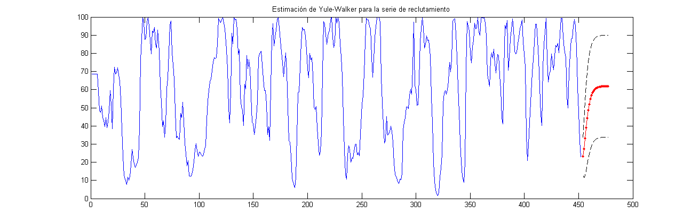

#  Modelos ARMA

En el capítulo 2, introdujimos las funciones de autocorrelación y correlación cruzada (ACFs y CCFs) como herramientas para clarificar las relaciones que pueden ocurrir dentro y entre las series de tiempo en varios rezagos. Además, explicamos cómo construir modelos lineales basado en la teoría clásica de regresión para la explotación de las asociaciones indicadas por los valores grandes de la ACF o CCF. Los métodos de este capítulo, en dominio del tiempo, o de regresión, son apropiados cuando se trata de posiblemente no estacionaridad con series de tiempo cortas; estas series son la regla y no la excepción en muchas aplicaciones. 

La regresión clásica es a menudo insuficiente para explicar todas las dinámicas interesantes de una serie de tiempo. Por ejemplo, la ACF de los residuos del ajuste de regresión lineal simple a los datos globales de la temperatura (véase el Ejemplo \@ref(exm:ejem-temperatura-global) del capítulo 2, Sección 2.3.1) revela una estructura adicional en los datos que la regresión no captura. En lugar de ello, la introducción de correlación como un fenómeno que se puede generar a través de relaciones lineales retardadas lleva a proponer los modelos autorregresivo (AR) y autorregresivo de promedio móvil (ARMA). Añadiendo modelos no estacionarios a la combinación conduce al modelo autorregresivo integrado de media móvil (ARIMA) popularizado en el destacado trabajo de Box y Jenkins (1970). El método de Box-Jenkins para la identificación de un posible modelo ARIMA se da en el siguiente capítulo junto con técnicas para la estimación de parámetros y la previsión para estos modelos.

El modelo de regresión clásico del Capítulo 3 fue desarrollado para el caso estático, es decir, que sólo permite que la variable dependiente sea influenciada por los valores actuales de las variables independientes. En el caso de series de tiempo, es deseable permitir que la variable dependiente sea influenciada por los valores pasados de las variables independientes y posiblemente por sus propios valores pasados. Si el presente puede ser modelado plausiblemente en términos de sólo los valores pasados de las entradas independientes, tenemos la atractiva posibilidad de que la predicción será posible.

Ahora procederemos con un desarrollo más general de modelos autoregresivos, de promedio móvil y mezcla de ambos modelos para series de tiempo estacionarias.

```{definition, defi-modelo-ARMA}
Una serie de tiempo $\{x_t; t=0,\pm1,\pm2,\ldots\}$ es un *proceso autoregresivo de promedio móvil*, denotado $ARMA(p,q)$, si es estacionario y

\begin{equation}
    x_t=\phi_1x_{t-1}+\cdots+\phi_px_{t-p}+w_t+\theta_1w_{t-1}+\cdots+\theta_qw_{t-q}
(\#eq:eq-modelo-ARMA)
\end{equation}

con $\phi_p\neq0,\theta_q\neq0$ y $\sigma_w^2>0$. Los parámetros $p$ y $q$ son llamados ordenes autoregresivos y de promedio móvil respectivamente. Si $x_t$ tiene media $\mu$ distinto de cero, hacemos $\alpha=\mu(1-\phi_1-\cdots-\phi_p)$ y escribimos el modelo como

\begin{equation}
    x_t=\alpha+\phi_1x_{t-1}+\cdots+\phi_px_{t-p}+w_t+\theta_1w_{t-1}+\cdots+\theta_qw_{t-q}
(\#eq:eq-modelo-ARMA-media-no-cero)
\end{equation}

A menos que se declare lo contrario, $\{w_t;t=0,\pm1,\pm2,\ldots\}$ es una sucesión de ruido blanco gaussiano.
```

----

Como se observó previamente, cuando $q=0$, el modelo es llamado modelo autoregresivo de orden $p$, AR(p), y cuando $p=0$ el modelo es llamado modelo de promedio móvil de orden $q$ MA(q). Como ayuda en la investigación de los modelos ARMA, será útil escribir estos usando el operador AR \@ref(eq:eq-operador-autoregresivo) y el operador MA \@ref(eq:eq-operador-promedio-movil). En particular el modelo ARMA(p,q) en \@ref(eq:eq-modelo-ARMA) se puede escribir en forma concisa como

\begin{equation}
    \phi(B)x_t=\theta(B)w_t
(\#eq:eq-modelo-ARMA-conciso)
\end{equation}

Antes de discutir las condiciones bajo la cual \@ref(eq:eq-modelo-ARMA) es causal e invertible, veamos un potencial problema con el modelo ARMA.

```{example, ejem-modelo-econometria}
En econometría, es usual considerar modelos dinámicos del siguiente tipo; llamemos $x_1,\ldots,x_r$ a la característica numérica de interés en un sector económico arbitrario dado (precios, nivel de producción, ingresos, inversiones, etc.), asumiendo por ejemplo que las observaciones son anuales. Para el año $n$ existe un vector asociado $X(n)$ con coordenadas $x_1(n),\ldots,x_r(n)$. Asumimos que $X(n)$ verifica la recursión lineal del tipo
$$X(n) = A_0X(n)+A_1X(n-1)+\cdots+A_jX(n-j)$$
donde $A_0,\ldots,A_j$ son matrices, pero esa relación \emph{ideal} es perturbada por un efecto aleatorio $w(n)$ con media cero, no correlacionado para diferentes años. Entonces $X(n)$ llega a ser un vector aleatorio que verifica

\begin{equation}
X(n) = \sum_{k=0}^jA_kX(n-k) + w(n).
(\#eq:eq-vector-aleatorio-ejemplo-econometria)
\end{equation}

Se puede demostrar, con unas pocas restricciones sobre los $A_k$, que si $w(n)$ es un ruido blanco, entonces existe un proceso estacionario $X(n)$ que satisface \@ref(eq:eq-vector-aleatorio-ejemplo-econometria) tal que para cada $i=1,\ldots,r$, $x_i(n)$ es un proceso ARMA.

```


```{example, name="Redundancia de Parámetro", ejem-redundancia-parametro}
Considere un proceso de ruido blanco $x_t=w_t$. Equivalentemente podemos escribir este como $0.5x_{t-1}=0.5w_{t-1}$ utilizando el operador de cambio una vez y multiplicando por 0.5. Ahora, restamos las dos representaciones para obtener

\begin{equation}
    x_t-0.5x_{t-1}=w_t-0.5w_{t-1}\text{ ó }x_t=0.5x_{t-1}-0.5w_{t-1}+w_t
(\#eq:eq-redundancia-parametro-ARMA11)
\end{equation}

el cual luce como un modelo ARMA(1,1). De hecho, $x_t$ es todavía un ruido blanco; nada ha cambiado en esta consideración [esto es, $x_t=w_t$ es la solución de \@ref(eq:eq-redundancia-parametro-ARMA11), pero hemos escondido el hecho de que $x_t$ es un ruido blanco debido al parámetro de redundancia o sobre-parametrización.

Escribiendo el parámetro de redundancia en la forma de operador como $\phi(B)x_t=\theta(B)w_t$ o
$$(1-0.5B)x_t=(1-0.5B)w_t$$
Aplicando el operador $\phi(B)^{-1}=(1-0.5B)^{-1}$ a ambos lados de la igualdad, obtenemos
$$x_t=(1-0.5B)^{-1}(1-0.5B)x_t=(1-0.5B)^{-1}(1-0.5B)w_t=w_t$$
el cual es el modelo original.

Podemos fácilmente detectar el problema de sobre-parametrización con el uso de los operadores o sus polinomios asociados. Esto es, escribimos el polinomio AR $\phi(z)=(1-0.5z)$, el polinomio MA $\theta(z)=(1-0.5z)$ y note que ambos polinomios tienen un factor común, este es $(1-0.5z)$. Este factor común identifica los parámetros de redundancia de inmediato. Descartando el factor en cada uno, nos queda $\phi(z)=1$ y $\theta(z)=1$ de donde se concluye que $\phi(B)=1$ y $\theta(B)=1$, y deducimos que el modelo es un ruido blanco. La consideración de parámetros de redundancia será crucial cuando discutamos la estimación de modelo ARMA en general. Como apuntó este ejemplo, podemos fijar un modelo ARMA(1,1) a un ruido blanco y conseguir que los parámetros estimados sean significativos. Si no fuéramos conscientes de la redundancia de parámetros, se podría alegar que los datos están correlacionados, cuando en realidad no lo son.

```

----

Los ejemplos \@ref(exm:ejem-modelo-AR-explosivo-causal), \@ref(exm:ejem-no-unicidad-MA) y \@ref(exm:ejem-redundancia-parametro) señalan un número de problemas con la definición general de los modelos ARMA(p,q) dados por \@ref(eq:eq-modelo-ARMA) o equivalentemente por \@ref(eq:eq-modelo-ARMA-conciso). En resumen, tenemos los siguientes problemas:

1) Modelos de parámetros redundantes,

2) Modelos AR estacionarios que dependen del futuro, y

3) Modelos MA que no son únicos.


Para resolver estos problemas, requeriremos algunas restricciones adicionales sobre los parámetros de los modelos, pero primero, daremos las siguientes definiciones:

```{definition, defi-polinomios-AR-MA}
Los *Polinomios AR y MA* se definen como

\begin{equation}
    \phi(z)=1-\phi_1z-\cdots-\phi_pz^p\text{, }\phi_p\neq0
(\#eq:eq-polinomio-AR)
\end{equation}

y

\begin{equation}
    \theta(z)=1+\theta_1z+\cdots+\theta_qz^q\text{, }\theta_q\neq0
(\#eq:eq-polinomio-MA)
\end{equation}

respectivamente, donde $z$ es un número complejo.
```

----

Para abordar el primer problema (Modelos de parámetros redundantes), de ahora en adelante nos referiremos a un modelo $ARMA(p,q)$ el sentido de su forma más simple. Esto es, además de la definición original dada en la ecuación \@ref(eq:eq-modelo-ARMA), requeriremos también que $\phi(z)$ y $\theta(z)$ no tengan factores comunes. Así, el proceso $x_t=0.5x_{t-1}-0.5w_{t-1}+w_t$ discutido en el ejemplo \@ref(exm:ejem-redundancia-parametro) no se refiere a un proceso ARMA(1,1) porque en su forma reducida $x_t$ es un ruido blanco.

Para resolver el problema del modelo con dependencia del futuro, introduciremos formalmente el concepto de causalidad.

```{definition, defi-causalidad}
Un modelo ARMA(p,q), $\phi(B)x_t=\theta(B)w_t$, se dice que es *causal* si la serie de tiempo $\{x_t:t=0,\pm1,\pm2,\ldots\}$ se puede escribir como un proceso lineal de un lado, esto es

\begin{equation}
    x_t=\sum_{j=0}^{\infty}\psi_jw_{t-j}=\psi(B)w_t
(\#eq:eq-modelo-causal)
\end{equation}

donde $\psi(B)=\sum_{j=0}^{\infty}\psi_jB^j$ y $\sum_{j=0}^{\infty}|\psi_j|<\infty$; haciendo $\psi_0=1$
```

----

En el ejemplo \@ref(exm:ejem-modelo-AR-explosivo-causal) el proceso $AR(1)$ $x_t=\phi z_{t-1}+w_t$ es causal solo cuando $|\phi|<1$. Equivalentemente, el proceso es causal sólo cuando la raíz de $\phi(z)=1-\phi z$ es mayor que uno en valor absoluto. Esto es, la raíz $z_0$ de $\phi(z)$ es $z_0=1/\phi$ (porque $\phi(z_0)=0$) y $|z_0|>1$, porque $|\phi|<1$.


```{definition, defi-modelo-invertible}
Un modelo ARMA(p,q) $\phi(B)x_t=\theta(B)w_t$ se dice *invertible* si la serie de tiempo $\{x_t:t=0,\pm1,\pm2,\ldots\}$ se puede escribir como
\begin{equation}
    \pi(B)x_t=\sum_{j=0}^{\infty}\pi_jx_{t-j}=w_t
(\#eq:eq-modelo-invertible)
\end{equation}

donde $\pi(B)=\sum_{j=0}^{\infty}\pi_jB^j$ y $\sum_{j=0}^{\infty}|\pi_j|<\infty$; hacemos $\pi_0=1$
```

## Propiedades de los modelos ARMA(p,q)

```{proposition, name="Propiedad 1: Causalidad", propiedad-causalidad-ARMApq}
Un modelo ARMA(p,q) es causal si y solo si $\phi(z)\neq0$ para $|z|\leq1$. El coeficiente del proceso lineal dado en \@ref(eq:eq-modelo-causal) se puede determinar resolviendo

$$\psi(z)=\sum_{j=0}^{\infty}\psi_jz^j=\frac{\theta(z)}{\phi(z)}\text{, }|z|<1.$$

Otra manera de ver la propiedad 1, es que un *modelo ARMA es causal sólo cuando las raíces de $\phi(z)$ están fuera del círculo unitario*, esto es $\phi(z)=0$ sólo cuando $|z|>1$.
```

---- 

```{proof}
Supongamos primero que las raíces de $\phi(z)$, digamos $z_1,\ldots,z_p$, están fuera del círculo unitario. Escribimos las raíces en el siguiente orden $1<|<_1|\leq|z_2|\leq\ldots\leq|z_p|$, note que $z_1,\ldots,z_p$ no son necesariamente únicas, y hacemos $|z_1|=1+\epsilon$, para algún $\epsilon>0$. Entonces, $\phi(z)\neq0$ siempre que $|z|<|z_1|=1+\epsilon$ y por consiguiente, $\phi^{-1}(z)$ existe y tiene un desarrollo en serie de potencias

$$\frac{1}{\phi(z)} = \sum_{j=0}^{\infty}a_jz^j,\quad |z|<1+\epsilon.$$

Ahora, elegimos un valor de $\delta$ tal que $0<\delta<\epsilon$, y hacemos $z=1+\delta$, el cual está dentro del radio de convergencia. Se sigue entonces que
      
\begin{equation}
  \phi^{-1}(1+\delta) = \sum_{j=0}^{\infty}a_j(1+\delta)^j<\infty.
(\#eq:eq-convergencia-phi)
\end{equation}
      
Así, podemos cada término de la suma en \@ref(eq:eq-convergencia-phi) por una constante, sea esta $|a_j(1+\delta)^j|<c$, para $c>0$. Por consiguiente, $|a_j|<c(1+\delta)^{-j}$, de donde se sigue que
      
\begin{equation}
  \sum_{j=0}^{\infty}|a_j|<\infty.
(\#eq:eq-convergencia-aj)
\end{equation}
      
En consecuencia, $\phi^{-1}(B)$ existe y podemos aplicar este a ambos lados del modelo ARMA, $\phi(B)x_t=\theta(B)w_t$, para obtener
      
$$x_t = \phi^{-1}(B)\phi(B)x_t = \phi^{-1}(B)\theta(B)w_t.$$
      
Entonces, haciendo $\psi(B)=\phi^{-1}(B)\theta(B)$, tenemos
      
$$x_t = \psi(B)w_t = \sum_{j=0}^{\infty}\psi_jw_{t-j},$$
      
donde los $\psi$-pesos, los cuales son absolutamente sumables, pueden ser evaluados por medio de $\psi(z) = \phi^{-1}(z)\theta(z)$ para $|z|\leq1$.

Ahora, supongamos que $x_t$ es un proceso causal, esto es, el proceso tiene la representación

$$x_t = \sum_{j=0}^{\infty}\psi_jw_{t-j},\quad\text{con}\quad \sum_{j=0}^{\infty}|\psi_j|<\infty.$$

En este caso, escribimos

$$x_t = \psi(B)w_t,$$

y multiplicando a ambos lados por $\phi(B)$ nos queda

\begin{equation}
  \phi(B)x_t = \phi(B)\psi(B)w_t.
(\#eq:eq-modelo-causal-conciso)
\end{equation}

Además de \@ref(eq:eq-modelo-causal-conciso), el modelo ARMA se puede escribir como

\begin{equation}
  \phi(B)x_t = \theta(B)w_t.
(\#eq:eq-modelo-ARMA-conciso2)
\end{equation}

De \@ref(eq:eq-modelo-causal-conciso) y \@ref(eq:eq-modelo-ARMA-conciso2), notamos que

\begin{equation}
  \phi(B)\psi(B)w_t = \theta(B)w_t.
(\#eq:eq-B15)
\end{equation}

Ahora, sea
$$a(z) = \phi(z)\psi(z) = \sum_{j=0}^{\infty}a_jz^j,\quad |z|\leq1$$
y, por consiguiente, podemos escribir \@ref(eq:eq-B15) como

\begin{equation}
  \sum_{j=0}^{\infty}a_jw_{t-j} = \sum_{j=0}^{q}\theta_jw_{t-j}.
(\#eq:eq-B16)
\end{equation}

A continuación, multiplicamos ambos lados de \@ref(eq:eq-B16) por $w_{t-h}$, para $h=0,1,2,\ldots$, y tomamos esperanza. Haciendo esto, obtenemos

\begin{eqnarray}
  a_h &=& \theta_h,\quad h=0,1,\ldots,q \nonumber \\
  a_h &=& 0, \quad h>q. (\#eq:eq-B17)
\end{eqnarray}

De \@ref(eq:eq-B17) concluimos que

\begin{equation}
  \phi(z)\psi(z) = a(z) = \theta(z),\quad |z|\leq1.
(\#eq:eq-igualdad-phi-psi-theta)
\end{equation}

Si existe un número en el círculo unitario, digamos $z_0$, para el cual $\phi(z_0)=0$, entonces por \@ref(eq:eq-igualdad-phi-psi-theta), $\theta(z_0)=0$. Pero, si existe tal $z_0$ entonces $\phi(z)$ y $\theta(z)$ tienen un factor común lo cual no es posible. En consecuencia, podemos escribir $\psi(z) = \theta(z)/\phi(z)$. Además, por hipótesis, tenemos que $|\psi(z)|<\infty$ para $|z|\leq1$, y por lo tanto

\begin{equation}
  |\psi(z)| = \left|\frac{\theta(z)}{\phi(z)}\right|<\infty,\text{ para }|z|\leq1.
(\#eq:eq-B19)
\end{equation}

Finalmente, la ecuación \@ref(eq:eq-B19) implica que $\phi(z)\neq0$ para $|z|\leq1$; esto es, las raíces de $\phi(z)$ están fuera del círculo unitario.
```

----

```{proposition, name="Propiedad 2: Invertibilidad", propiedad-invertibilidad-ARMApq}
Un modelo ARMA(p,q) es *invertible* si y solo si $\theta(z)\neq0$ para $|z|\leq1$. El coeficiente $\pi_j$ de $\pi(B)$ dado en \@ref(eq:eq-modelo-invertible) se puede determinar al resolver

$$\pi(z)=\sum_{j=0}^{\infty}\pi_jz^j=\frac{\phi(z)}{\theta(z)}\text{, }|z|\leq1.$$

  Otra manera de escribir la propiedad 2, es que un *proceso ARMA es invertible solo cuando las raíces de $\theta(z)$ están fuera del círculo unitario*; esto es, $\theta(z)=0$ sólo cuando $|z|>1$.
```

----

```{proof}
La demostración de esta propiedad es similar a la propiedad 1, y se deja como ejercicio.
```

----

```{example, name="Redundancia de Parámetros, Causalidad e Invertibilidad",ejem-redundancia-causalidad-invertibilidad}


Considere el proceso

$$x_t=0.4x_{t-1}+0.45x_{t-2}+w_t+w_{t-1}+0.25w_{t-2}$$

o, en la forma operador

$$(1-0.4B-0.45B^2)x_t=(1+B+0.25B^2)w_t$$

A primera vista $x_t$ parece ser un proceso ARMA(2,2). Pero, los polinomios asociados

\begin{eqnarray*}
\phi(z) &=& 1-0.4z-0.45z^2=(1+0.5z)(1-0.9z)
\theta(z) &=& (1+z+0.25z^2)=(1+0.5z)^2
\end{eqnarray*}

tienen un factor común que se puede cancelar.

Después de cancelar los factores comunes, los polinomios quedan $\phi(z)=(1-0.9z)$ y $\theta(z)=(1+0.5z)$, de modo que el modelo es un proceso ARMA(1,1) $(1-0.9B)x_t=(1+0.5B)w_t$ o

\begin{equation}
  x_t=0.9x_{t-1}+0.5w_{t-1}+w_t
(\#eq:eq-ejemplo-ARMA11)
\end{equation}

El modelo es causal, porque $\phi(z)=(1-0.9z)=0$ cuando $z=10/9$ que está fuera del círculo unitario. El modelo también es invertible porque la raíz de $\theta(z)=(1+0.5z)$ es $z=-2$ que también está fuera del circulo unitario.

Para escribir el modelo como un proceso lineal, podemos obtener los $\psi$-pesos usando la proposición \@ref(prp:propiedad-causalidad-ARMApq):

\begin{eqnarray*}
\psi(z) &=& \frac{\theta(z)}{\phi(z)}=\frac{(1+0.5z)}{(1-0.9z)} \\
        &=& (1+0.5z)(1+0.9z+0.9^2z^2+0.9^3z^3+\cdots)\text{ }|z|\leq1
\end{eqnarray*}

El coeficiente de $z^j$ en $\psi(z)$ es $\psi_j=(0.5+0.9)0.9^{j-1}$, para $j\geq1$, así, podemos escribir (\ref{eq-ejemplo-ARMA11}) como

$$x_t=w_t+1.4\sum_{j=0}^{\infty}0.9^{j-1}w_{t-j}$$

Similarmente, para hallar la representación invertible usando la proposición \@ref(prp:propiedad-invertibilidad-ARMApq):
  
$$\pi(z)=\frac{\phi(z)}{\theta(z)}=(1-0.9z)(1-0.5z+0.5^2z^2-0.5^3z^3+\cdots)\text{ }|z|\leq1.$$

En este caso, los $\pi$-pesos están dados por  $\pi_j=(-1)^j(0.9+0.5)0.5^{j-1}$ para $j\geq1$ y por lo tanto, podemos escribir \@ref(eq:eq-ejemplo-ARMA11) como

$$x_t=1.4\sum_{j=0}^{\infty}(-0.5)^{j-1}x_{t-j}+w_t$$
```

----

La PACF para los modelos $MA$ se comporta como el ACF para los modelos $AR$. También, la PACF para modelos $AR$ se comporta como la ACF para modelos $MA$. Debido a que un modelo ARMA invertible tiene una representación $AR$ infinita, la PACF no tendrá corte. Resumimos estos resultados en la tabla siguiente


|   | AR(p)  |  MA(q) | ARMA(p,q)  |
|---|:-:|:-:|:-:|
| ACF   | Disminución  |  Corte después | Disminución  |
|   | gradual  | de paso $q$  | gradual  |
| PACF  | Corte después  | Disminución  | Disminución  |
|   | de paso $q$  | gradual  | gradual  |


## Ecuaciones en Diferencias

El estudio del comportamiento de los procesos ARMA es mucho mejor si se tiene un conocimiento básico de ecuaciones en diferencias, simplemente porque los procesos ARMA son ecuaciones en diferencias. Este tópico será también muy útil para el estudio de los modelos en dominio del tiempo y procesos estocásticos en general. Vamos a dar una breve y heurística reseña del tema junto con algunos ejemplos de la utilidad de la teoría.

Supongamos que tenemos una sucesión de números $u_0,u_1,u_2,\ldots$ tal que

\begin{equation}
    u_n-\alpha u_{n-1}=0\text{, }\alpha\neq0\text{, }n=1,2,\ldots
(\#eq:eq-sucesion-u-n)
\end{equation}

Por ejemplo, recuerde \@ref(eq:eq-ACF-AR1), en la cual mostramos que la ACF de un proceso AR(1) es una sucesión $\rho(h)$ que satisface

$$\rho(h)=\phi\rho(h-1)=0\text{, para }h=1,2\ldots$$
La ecuación \@ref(eq:eq-sucesion-u-n) representa un ecuación en diferencias homogénea de orden 1. Para resolver la ecuación, escribimos

\begin{eqnarray*}
  u_1 &=& \alpha u_0 \\
  u_2 &=& \alpha u_1 = \alpha^2u_0 \\
      &\vdots&  \\
  u_n &=& \alpha u_{n-1} = \alpha^nu_0.
\end{eqnarray*}

Dando una condición inicial $u_0=c$ podemos resolver \@ref(eq:eq-sucesion-u-n), sea esta $u_n=\alpha^nc$.

En la notación de operador, \@ref(eq:eq-sucesion-u-n) se puede escribir como $(1-\alpha B)u_n=0$. El polinomio asociado a \@ref(eq:eq-sucesion-u-n) es $\alpha(z)=1-\alpha z$, y las raíz $z_0$ del polinomio es $z_0=1/\alpha$, esto es $\alpha(z_0)=0$.

Conocemos la solución de \@ref(eq:eq-sucesion-u-n) con condición inicial $u_0=c$, esta es

$$u_n=\alpha^nc=(z_0^{-1})^nc.$$

Esto es, la solución de la ecuación en diferencias \@ref(eq:eq-sucesion-u-n) solo depende de la condición inicial y de la inversa de la raíz del polinomio asociado $\alpha(z)$.

Supóngase ahora que la sucesión satisface

\begin{equation}
    u_n-\alpha_1u_{n-1}-\alpha_2u_{n-2}=0\text{, }\alpha_2\neq0\text{, }n=2,3,\ldots
(\#eq:eq-sucesion-u-n-2)
\end{equation}

Esta ecuación es una ecuación en diferencias homogénea de orden 2. El correspondiente polinomio es

$$\alpha(z)=1-\alpha_1z-\alpha_2z^2$$
el cual tiene dos raíces $z_1$ y $z_2$, tal que $\alpha(z_1)=\alpha(z_2)=0$.

Consideremos dos casos:

- **Caso 1:** $z_1\neq z_2$.} La solución general en este caso es
    \begin{equation}
        u_n=c_1z_1^{-n}+c_2z_2^{-n}
    (\#eq:eq-solucio-u-n-raices-distintas)
    \end{equation}
    donde $c_1$ y $c_2$ dependen de las condiciones iniciales. Esta afirmación puede ser verificada por la sustitución directa de \@ref(eq:eq-solucio-u-n-raices-distintas) en \@ref(eq:eq-sucesion-u-n-2):
    \begin{eqnarray*}
    c_1z_1^{-n}+c_2z_2^{-n} &-& \alpha_1\left(c_1z_1^{-(n-1)}+c_2z_2^{-(n-1)}\right)-\alpha_2\left(c_1z_1^{-(n-2)}+c_2z_2^{-(n-2)}\right) \\
         &=& c_1z_1^{-n}(1-\alpha_1z_1-\alpha_2z_1^2)+c_2z_2^{-n}((1-\alpha_1z_2-\alpha_2z_2^2) \\
         &=& c_1z_1^{-n}\alpha(z_1)+c_2z_2^{-n}\alpha(z_2) \\
         &=& 0.
    \end{eqnarray*}
    Dando dos condiciones iniciales $u_0$ y $u_1$ podemos resolver para $c_1$ y $c_2$:
    \begin{eqnarray*}
        u_0 &=& c_1+c_2 \\
        u_1 &=& c_1z_1^{-1}+c_2z_2^{-1}
    \end{eqnarray*}
    donde $z_1$ y $z_2$ se pueden resolver en términos de $\alpha_1$ y $\alpha_2$ usando la fórmula cuadrática por ejemplo.

- **Caso 2:** $z_1=z_2 (=z_0)$. En este caso la solución general de \@ref(eq:eq-sucesion-u-n-2) es
    \begin{equation}
        u_n=z_0^{-n}(c_1+c_2n)
        (\#eq:eq-solucio-u-n-raices-iguales)
    \end{equation}
    Esta afirmación se puede verificar por sustitución directa de \@ref(eq:eq-solucio-u-n-raices-iguales) en \@ref(eq:eq-sucesion-u-n-2):
    \begin{eqnarray*}
    z_0^{-n}(c_1+c_2n) &-& \alpha_1\left(z_0^{-(n-1)}[c_1+c_2(n-1)]\right)-\alpha_2\left(z_0^{-(n-2)}[c_1+c_2(n-2)]\right) \\
         &=& z_0^{-n}(c_1+c_2n)(1-\alpha_1z_0-\alpha_2z_0^2)+c_2z_0^{-n+1}(\alpha_1+2\alpha_2z_0) \\
         &=& c_2z_0^{-n+1}(\alpha_1+2\alpha_2z_0).
    \end{eqnarray*}
    Para demostrar que $(\alpha_1+2\alpha_2z_0)=0$, escribimos $1-\alpha_1z-\alpha_2z^2=(1-z_0^{-1}z)^2$ y derivamos respecto de $z$ en ambos lados de la ecuación para obtener $(\alpha_1+2\alpha_2z)=2z_0^{-1}(1-z_0^{-1}z)$. Entonces $(\alpha_1+2\alpha_2z_0)=2z_0^{-1}(1-z_0^{-1}z_0)=0$.
    Finalmente, dando dos condiciones iniciales $u_0$ y $u_1$ podemos resolver para $c_1$ y $c_2$;
    \begin{eqnarray*}
        u_0 &=& c_1 \\
        u_1 &=& (c_1+c_2)z_0^{-1}
    \end{eqnarray*}


Resumiendo:

En el caso de raíces distintas, la solución de la ecuación en diferencias homogénea de grado 2 es
\begin{eqnarray*}
  u_n &=& z_1^{-n}\times(\text{un polinomio en } n \text{ de grado }m_1-1) \\
      &+& z_2^{-n}\times(\text{un polinomio en } n \text{ de grado }m_2-1)
\end{eqnarray*}
donde $m_1$ es la multiplicidad de la raíz $z_1$ y $m_2$ es la multiplicidad de la raíz $z_2$. En este ejemplo, se tiene $m_1=m_2=1$ y decimos que $c_1$ y $c_2 $ son polinomios de grado cero respectivamente.

En el caso de raíces repetidas, la solución es
$$u_n=z_0^{-n}\times(\text{un polinomio en } n \text{ de grado }m_0-1),$$
donde $m_0$ es la multiplicidad de la raíz $z_0$; esto es $m_0=2$. En este caso, escribimos el polinomio de grado uno como $c_1+c_2n$. En ambos casos, resolvimos $c_1$ y $c_2$ dando dos condiciones iniciales $u_0$ y $u_1$.

Veamos a continuacion algunos ejemplos de uso de las ecuaciones en diferencias, los dos primeros veremos la aplicación a procesos $AR(2)$, y posteriormente daremos un ejemplo de uso para modelos ARMA.

```{example, name="La ACF de un proceso AR(2)", ejem-ACF-AR2}

Supóngase que $x_t=\phi_1x_{t-1}+\phi_2x_{t-2}+w_t$ es un proceso $AR(2)$ causal. Multiplicando ambos lados del modelo por $x_{t-h}$ para $h>0$, tomando esperanza:

$$\mathbb{E}(x_tx_{t-h})=\phi_1\mathbb{E}(x_{t-1}x_{t-h})+\phi_2\mathbb{E}(x_{t-2}x_{t-h})+\mathbb{E}(w_tx_{t-h})$$

El resultado es

\begin{equation}
    \gamma(h)=\phi_1\gamma(h-1)+\phi_2\gamma(h-2)\text{, para }h=1,2,\ldots
(\#eq:eq-autocovarianza-AR2)
\end{equation}

En \@ref(eq:eq-autocovarianza-AR2) estamos usando el hecho de que $\mathbb{E}(x_t)=0$ y para $h>0$,

$$\mathbb{E}(w_tx_{t-h})=\mathbb{E}\left(w_t\sum_{j=0}^{\infty}\psi_jw_{t-h-j}\right)=0.$$

Dividimos \@ref(eq:eq-autocovarianza-AR2) por $\gamma(0)$ para obtener la ecuación en diferencia de la ACF del proceso:

\begin{equation}
  \rho(h)-\phi_1\rho(h-1)-\phi_2\rho(h-2)=0\text{, con }h=1,2,\ldots.
(\#eq:eq-ACF-AR2)
\end{equation}

Las condiciones iniciales son $\rho(0)=1$ y $\rho(-1)=\phi_1/(1-\phi_2)$, lo cual se obtiene evaluando $h=1$ en \@ref(eq:eq-ACF-AR2) y observando que $\rho(1)=\rho(-1)$.

Usando los resultados para la ecuación en diferencias homogénea de orden dos, sean $z_1$ y $z_2$ las raíces del polinomio asociado $\phi(z)=1-\phi_1z-\phi_2z^2$. Como el modelo es causal sabemos que las raíces están fuera del círculo unitario: $|z_1|>1$ y $|z_2|>1$. Ahora consideremos la solución para los tres casos:

- **Caso 1:** Cuando $z_1$ y $z_2$ son reales y distintos, entonces $$\rho(h)=c_1z_1^{-h}+c_2z_2^{-h},$$ de modo que $\rho(h)\to0$ exponencialmente cuando $h\to\infty$.

- **Caso 2:** Cuando $z_1=z_2(=z_0)$ son reales e iguales, entonces $$\rho(h)=z_0^{-h}(c_1+c_2h),$$ de modo que $\rho(h)\to0$ exponencialmente cuando $h\to\infty$.

- **Caso 3:** Cuando $z_1=\bar{z}_2$ son complejas conjugadas, entonces $c_2=\bar{c}_1$ (porque $\rho(h)$ es real) y $$\rho(h)=c_1z_1^{-h}+\bar{c}_1\bar{z}_1^{-h}.$$
  Escribiendo $c_1$ y $z_1$ en coordenadas polares, por ejemplo $z_1=|z_1|e^{i\theta}$ donde $\theta$ es el ángulo cuya tangente es el radio de la parte imaginaria y la parte real de $z_1$; el rango de $\theta$ es $[-\pi,\pi]$. Entonces, usando el hecho de que $e^{i\alpha}+e^{-i\alpha}=2\cos(\alpha)$ la solución tiene la forma
  $$\rho(h)=a|z_1|^{-h}\cos(h\theta+b),$$
  donde $a$ y $b$ se determinan de las condiciones iniciales. De nuevo $\rho(h)$ tiende a cero exponencialmente cuando $h\to\infty$ pero en forma senosoidal.
```

----

```{example, name="Camino muestral de un proceso AR(2) con raíces complejas", ejem-camino-muestral-AR2}

La Figura \@ref(fig:grafico-AR2-simulado) muestra $n=144$ observaciones de un modelo AR(2)
$$x_t=1.5x_{t-1}-0.75x_{t-2}+w_t$$
con $\sigma_w^2=1$ y con raíces complejas, así el proceso exhibe un comportamiento pseudo-cíclico con  una frecuencia de un ciclo cada 12 puntos de tiempo. El polinomio autoregresivo para este modelo es $\phi(z)=1-1.5z+0.75z^2$. Las raíces de $\phi(z)$ son $1\pm i/\sqrt{3}$ y $\theta=\tan^{-1}(1/\sqrt{3})=2\pi/12$ radianes por unidad de tiempo. Para convertir el ángulo a ciclos por unidad de tiempo, dividimos por $2\pi$ para obtener $1/12$ ciclos por unidad de tiempo. La ACF para este modelo se muestra en la parte inferior de la Figura \@ref(fig:grafico-AR2-simulado).
```
```{r, fig.cap="Modelo AR(2) simulado, n=144, con phi_1=1.5,  phi_2=-0.75 (parte superior) y la función de autocovarianza (parte inferior)", grafico-AR2-simulado}
# Simulación del proceso AR(2)
set.seed(5)
ar2=arima.sim(list(order=c(2,0,0), ar=c(1.5,-0.75)), n=144)
# Gráfico del proceso AR(2)
par(mfrow=c(2,1))
plot(1:144/12,ar2,type="l",xlab="Tiempo (una unidad=12ptos)",ylab="AR(2)")
abline(v=0:12,lty="dotted")
# Raices del polinomio asociado
Arg(polyroot(c(1,-1.5,0.75))[1])/(2*pi)
# Cálculo de la ACF
ACF = ARMAacf(ar=c(1.5,0.75),ma=0,50)
# Gráfico de la ACF
plot(ACF,type="h",xlab="LAG")
abline(h=0)
```

----

Ahora, daremos la solución para una ecuación en diferencias homogénea general de orden $p$:

\begin{equation}
  u_n-\alpha_1u_{n-1}-\cdots-\alpha_pu_{n-p}=0\text{, con } \alpha_p\neq0\text{, }n=p,p+1,\ldots
(\#eq:eq-sucesion-u-n-p)
\end{equation}

El polinomio asociado es

$$\alpha(z)=1-\alpha_1z-\alpha_2z^2-\cdots-\alpha_pz^p.$$

Suponga que $\alpha(z)$ tiene $r$ raíces distintas, $z_1$ con multiplicidad $m_1$, $z_2$ con multiplicidad $m_2,\ldots,$ y $z_r$ con multiplicidad $m_r$, tal que $m_1+m_2+\cdots+m_r=p$. La solución general para la ecuación \@ref(eq:eq-sucesion-u-n-p) es

\begin{equation}
  u_n=z_1^{-n}P_1(n)+z_2^{-n}P_2(n)+\cdots+z_r^{-n}P_r(n),
(\#eq:eq-solucion-general-u-n)
\end{equation}

donde $P_j(n)$ para $j=1,2,\ldots,r$ es un polinomio en $n$ de grado $m_j-1$. Dadas las condiciones iniciales $u_0,u_1,\ldots,u_{p-1}$ podemos resolver $P_j(n)$ explícitamente para $j=1,2,\ldots,r$

```{example, name="Determinación de los psi-pesos de un proceso ARMA(p,q) causal", ejem-pesos-ARMA-causal}

Para un modelo ARMA(p,q) causal $\phi(B)x_t=\theta(B)w_t$ donde los ceros de $\phi(z)$ están fuera del círculo unitario, recordemos que podemos escribir este como

$$x_t=\sum_{j=0}^{\infty}\psi_jw_{t-j}$$

donde los $\psi$-pesos se determinan usando la propiedad 1. (Proposición \@ref(prp:propiedad-causalidad-ARMApq))

Para un modelo $MA(q)$ puro $\psi_0=1,\psi_j=\theta_j$ para $j=1,2,\ldots,q$ y $\psi_j=0$ en otro caso.

Para el caso general de un modelo ARMA(p,q) la tarea de resolver los $\psi$-pesos es más complicada, como se demostró en el ejemplo \@ref(exm:ejem-redundancia-causalidad-invertibilidad).

La teoría de ecuaciones en diferencias homogénea será útil para resolver este problema.

Para resolver los $\psi$-pesos en general, debemos igualar los coeficientes en $\psi(z)\phi(z)=\theta(z)$

$$(\psi_0+\psi_1z+\psi_2z^2+\cdots)(1-\phi_1z-\phi_2z^2-\cdots)=(1+\theta_1z+\theta_2z^2+\cdots)$$

Los primeros valores serán

\begin{eqnarray*}
  \psi_0 &=& 1 \\
  \psi_1-\phi_1\psi_0 &=& \theta_1 \\
  \psi_2-\phi_1\psi_1-\phi_2\psi_0 &=& \theta_2 \\
  \psi_3-\phi_1\psi_2-\phi_2\psi_1-\phi_3\psi_0 &=& \theta_3 \\
   &\vdots &
\end{eqnarray*}

donde podemos tomar $\phi_j=0$ para $j>p$ y $\theta_j=0$ para $j>q$.

Los $\psi$-pesos satisfacen la ecuación en diferencias homogénea dada por

\begin{equation}
  \psi_j-\sum_{k=1}^{p}\phi_k\psi_{j-k}=0\text{, con }j\geq\max(p,q+1)
(\#eq:eq-diferencias-homogeneas-pesos)
\end{equation}

con condiciones iniciales

\begin{equation}
    \psi_j-\sum_{k=1}^{j}\phi_k\psi_{j-k}=\theta_j\text{, con }0\leq j<\max(p,q+1).
(\#eq:eq-condicion-inicial-pesos)
\end{equation}

La solución general depende de las raíces del polinomio AR $\phi(z)=1-\phi_1z-\cdots-\phi_pz^p$ como se ve de \@ref(eq:eq-diferencias-homogeneas-pesos). La solución particular de hecho dependerá de las condiciones iniciales.

Considere el proceso ARMA dado en \@ref(eq:eq-ejemplo-ARMA11) $x_t=0.9x_{t-1}+0.5w_{t-1}+w_t$.

Dado que $\max(p,q+1)=2$, usando \@ref(eq:eq-condicion-inicial-pesos), tenemos que $\psi_0=1$ y $\psi_1=0.9+0.5=1.4$. De \@ref(eq:eq-diferencias-homogeneas-pesos) para $j=2,3,\ldots,$ los $\psi$-pesos satisfacen $\psi_j-0.9\psi_{j-1}=0$. La solución general es $\psi_j=c0.9^j$.

Para hallar la solución particular, usamos la condición inicial $\psi=1.4$, de modo que $1.4=c0.9$ ó $c=1.4/0.9$. Finalmente $\psi_j=1.4(0.9)^{j-1}$ para $j\geq1$ como vimos en el ejemplo \@ref(exm:ejem-redundancia-causalidad-invertibilidad).

Para ver los primeros 50 $\psi$-pesos, usamos las siguientes instrucciones en R:
```

```{r, fig.cap="psi-pesos para el modelo ARMA,  x_t=0.9x_{t-1}+0.5w_{t-1}+w_t"}
ARMAtoMA(ar=0.9,ma=0.5, 50)
plot(ARMAtoMA(ar=0.9,ma=0.5,50))
```

----


### Función de Autocorrelación (ACF) para modelos ARMA

Iniciemos mostrando la ACF de un proceso MA(q) $x_t=\theta(B)w_t$, donde $\theta(B)=1+\theta_1B+\cdots+\theta_qB^q$. Dado que $x_t$ es una combinación lineal de términos de ruido blanco, el proceso es estacionario con media

$$\mathbb{E}(x_t)=\sum_{j=0}^{q}\theta_j\mathbb{E}(w_{t-j})=0,$$

donde podemos escribir $\theta_0=1$, y la función de autocovarianza es

\begin{eqnarray}
  \gamma(h)=\text{cov}(x_{t+h},x_t) &=& \mathbb{E}\left[\left(\sum_{j=0}^{q}\theta_jw_{t+h-j}\right)\left(\sum_{k=0}^{q}\theta_kw_{t-k}\right)\right] \nonumber \\
   &=& \begin{cases}\sigma_w^2\sum_{j=0}^{q-h}\theta_j\theta_{j+h},&\text{ si }0\leq h\leq q\\
                    0,&\text{ si }h>q\end{cases}(\#eq:eq-autocovarianza-MA-q)
\end{eqnarray}

Recuerde que $\gamma(h)=\gamma(-h)$, por eso solo mostramos $\gamma(h)$ para $h\geq0$.

El corte de $\gamma(h)$ después de $q$ saltos es la firma del modelo MA(q). Dividiendo (\ref{eq-autocovarianza-MA-q}) por $\gamma(0)$ conseguimos la ACF de un MA(q):

\begin{equation}
  \rho(h)=\begin{cases}\frac{\sum_{j=0}^{q-h}\theta_j\theta_{j+h}}{1+\theta_1^2+\cdots+\theta_q^2},&\text{ si }1\leq h\leq q\\
                0,\text{ si }h>q\end{cases}
(\#eq:eq-ACF-MA-q)
\end{equation}

Para un modelo ARMA(p,q) causal $\phi(B)x_t=\theta(B)w_t$, donde los ceros de $\phi(z)$ están fuera del círculo unitario, podemos escribir

$$x_t=\sum_{j=0}^{\infty}\psi_jw_{t-j}$$

Se sigue inmediatamente que $\mathbb{E}(x_t)=0$. También, la función de autocovarianza de $x_t$ se puede escribir como

\begin{equation}
  \gamma(h)=\text{cov}(x_{t-h},x_t)=\sigma_w^2\sum_{j=0}^{\infty}\psi_j\psi_{j+h}\text{, }h\geq0
(\#eq:eq-autocovarianza-ARMA)
\end{equation}


Podemos entonces usar \@ref(eq:eq-diferencias-homogeneas-pesos) y \@ref(eq:eq-condicion-inicial-pesos) para resolver los $\psi$-pesos. A su vez, podemos resolver para $\gamma(h)$ y la ACF $\rho(h)=\gamma(h)/\gamma(0)$. Como en el ejemplo \@ref(exm:ejem-ACF-AR2), también es posible obtener una ecuación en diferencias homogénea directamente en términos de $\gamma(h)$. Primero, escribimos

\begin{eqnarray}
  \gamma(h) &=& \text{cov}(x_{t+h},x_t)=\mathbb{E}\left[\left(\sum_{j=1}^{p}\phi_jx_{t+h-j}+\sum_{j=0}^{q}\theta_jw_{t+h-j}\right)x_t\right]\nonumber \\
    &=& \sum_{j=1}^{p}\phi_j\gamma(h-j)+\sigma_w^2\sum_{j=h}^{q}\theta_j\psi_{j-h}\text{, }h\geq0 (\#eq:eq-autocovarianza-ARMA-2)
\end{eqnarray}

donde hemos usado el hecho de que $x_t=\sum_{k=0}^{\infty}\psi_jw_{t-k}$ y para $h\geq0$,

$$\mathbb{E}(w_{t+h-j}x_t)=\mathbb{E}\left[w_{t+h-j}\left(\sum_{k=0}^{\infty}\psi_kw_{t-k}\right)\right]=\psi_{j-h}\sigma_w^2.$$


De \@ref(eq:eq-autocovarianza-ARMA-2) podemos escribir una ecuación general homogénea para la ACF de un proceso ARMA causal:

\begin{equation}
  \gamma(h)-\phi_1\gamma(h-1)-\cdots-\phi_p\gamma(h-p)=0\text{, }h\geq\max(p,q+1)
(\#eq:eq-ACF-ARMA-causal)
\end{equation}

con condiciones iniciales

\begin{equation}
  \gamma(h)-\sum_{j=1}^{p}\phi_j\gamma(h-j)=\sigma_w^2\sum_{j=h}^{q}\theta_j\psi_{j-h}\text{, }0\leq h<\max(p,q+1).
(\#eq:eq-condicion-inicial-ACF-ARMA-causal)
\end{equation}

Dividiendo \@ref(eq:eq-ACF-ARMA-causal) y \@ref(eq:eq-condicion-inicial-ACF-ARMA-causal) por $\gamma(0)$ nos permite resolver la ACF $\rho(h)=\gamma(h)/\gamma(0)$.


```{example, name="La ACF de un proceso ARMA(1,1)", ejem-ACF-ARMA11}

Consideremos el proceso ARMA(1,1) causal $x_t=\phi x_{t-1}+\theta w_{t-1}+w_t$ donde $|\phi|<1$. Basándonos en \@ref(eq:eq-ACF-ARMA-causal) la función de autocovarianza satisface

$$\gamma(h)-\phi\gamma(h-1)=0\text{, }h=2,3,\ldots,$$

así, la solución general es $\gamma(h)=c\phi^h$ para $h=1,2,\ldots$. Para obtener las condiciones iniciales, usamos \@ref(eq:eq-condicion-inicial-ACF-ARMA-causal):

\begin{eqnarray*}
  \gamma(0) &=& \phi\gamma(1)+\sigma_w^2[1+\theta\phi+\theta^2] \\
  \gamma(1) &=& \phi\gamma(0)+\sigma_w^2\theta
\end{eqnarray*}

Resolviendo para $\gamma(0)$ y $\gamma(1)$, obtenemos

\begin{eqnarray*}
  \gamma(0) &=& \sigma_w^2\frac{1+2\theta\phi+\theta^2}{1-\phi^2} \\
  \gamma(1) &=& \sigma_w^2\frac{(1+\theta\phi)(\phi+\theta)}{1-\phi^2}
\end{eqnarray*}

Para resolver $c$, note que $\gamma(1)=c\phi$, en cuyo caso $c=\gamma(1)/\phi$. Por consiguiente, la solución particular es

$$\gamma(h)=\sigma_w^2\frac{(1+\theta\phi)(\phi+\theta)}{1-\phi^2}\phi^{h-1}$$

Finalmente, dividiendo por $\gamma(0)$ nos da la ACF

\begin{equation}
  \rho(h)=\frac{(1+\theta\phi)(\phi+\theta)}{1+2\theta\phi+\theta^2}\phi^{h-1}\text{, }h\geq1
(\#eq:eq-ACF-ARMA11)
\end{equation}
```

----


## Pronósticos

El objetivo en el pronóstico, es predecir los valores futuros de una serie de tiempo $x_{n+m}, m=1,2,\ldots$ basado en los valores de la serie observados hasta el tiempo actual $\mathbf{x}=\{x_n,x_{n-1},\ldots,x_1\}$. En esta sección asumiremos que $x_t$ es estacionario y que los parámetros del modelo son conocidos. El problema de hacer pronósticos cuando los parámetros del modelo son desconocidos se analizará en la siguiente sección. En los capítulos para modelos AR y modelos MA, vimos como realizar los pronósticos o predicciones para los mismos. A continuación daremos métodos más generales de predicción y que se pueden utilizar para los modelos AR, MA y ARMA.

El mínimo del error cuadrático medio del predictor $x_{n+m}$ es
$$x_{n+m}^n=\mathbb{E}(x_{n+m}|x_n,x_{n-1},\ldots,x_1)$$
porque el valor esperado condicional minimiza el error cuadrático medio

\begin{equation}
  \mathbb{E}[x_{n+m}-g(\mathbf{x})]^2
(\#eq:eq-esperanza-error-cuadratico-medio)
\end{equation}

donde $g(\mathbf{x})$ es una función de las observaciones $\mathbf{x}$.

Primero, nos restringiremos a los predictores que son función lineal de los datos, esto es, predictores de la forma

\begin{equation}
  x_{n+m}^n=\alpha_0+\sum_{k=1}^{n}\alpha_kx_k
(\#eq:eq-predictores)
\end{equation}

donde $\alpha_0,\alpha_1,\ldots,\alpha_n$ son números reales. Los predictores lineales de la forma (\ref{eq-predictores}) que minimizan el error cuadrático medio del predictor \@ref(eq:eq-esperanza-error-cuadratico-medio) son llamados el **mejor predictor lineal (BLP's)**. Como demostraremos luego, los predictores lineales dependen solo del segundo momento del proceso, lo cual es fácil de estimar a partir de los datos.

A continuación daremos algunas propiedades y ejemplos.

```{proposition, name="Mejor Predictor Lineal para Procesos Estacionarios", propiedad-mejor-predictor-lineal}

Dada las observaciones $x_1,x_2,\ldots,x_n$, el mejor predictor lineal $x_{n+m}^n=\alpha_0+\sum_{k=1}^{n}\alpha_kx_k$, de $x_{n+m}$ para $m\geq1$, se halla resolviendo

\begin{equation}
  \mathbb{E}\left[(x_{n+m}-x_{n+m}^n)x_k\right]=0\text{, para } k=0,1,2,\ldots
(\#eq:eq-mejor-predictor-lineal)
\end{equation}

donde $x_0=1$.
```

----

Las ecuaciones especificadas en \@ref(eq:eq-mejor-predictor-lineal) son llamadas ecuaciones de predicción, y son usadas para resolver los coeficientes $\{\alpha_0,\alpha_1,\ldots,\alpha_n\}$. Si $\mathbb{E}(x_t)=\mu$, la primera ecuación ($k=0$) de \@ref(eq:eq-mejor-predictor-lineal) implica

$$\mathbb{E}(x_{n+m}^n)=\mathbb{E}(x_{m+n})=\mu.$$

Entonces, tomando valor esperado en \@ref(eq:eq-predictores), tenemos

$$\mu=\alpha_0+\sum_{k=1}^{n}\alpha_k\mu\text{  o   }\alpha_0=\mu\left(1-\sum_{k=1}^{n}\alpha_k\right).$$

Por lo tanto, la forma del BLP es
$$x_{n+m}^n=\mu+\sum_{k=1}^{n}\alpha_k(x_k-\mu).$$


Sin perdida de generalidad, podemos considerar el caso $\mu=0$ en cuyo caso, $\alpha_0=0$

Consideremos primero la predicción de un paso. Esto es, dado $\{x_1,x_2,\ldots,x_n\}$, queremos predecir el valor la serie temporal en tiempo $t=n+1$, o sea $x_{n+1}$. El BLP de $x_{n+1}$ es

\begin{equation}
  x_{n+1}^n=\phi_{n1}x_n+\phi_{n2}x_{n-1}+\cdots+\phi_{nn}x_1
(\#eq:eq-BLP-1-paso)
\end{equation}

donde, $\alpha_k$ en \@ref(eq:eq-predictores) lo escribiremos como $\phi_{n,n+1-k}$ en \@ref(eq:eq-BLP-1-paso), para $k=1,2,\ldots,n$. Usando la proposición \@ref(prp:propiedad-mejor-predictor-lineal), los coeficientes $\{\phi_{n1},\phi_{n2},\ldots,\phi_{nn}\}$ satisfacen

$$\mathbb{E}\left[\left(x_{n+1}-\sum_{j=1}^{n}\phi_{nj}x_{n+1-j}\right)x_{n+1-k}\right]=0\text{, para }k=1,2,\ldots,n$$

o

\begin{equation}
  \sum_{j=1}^{n}\phi_{nj}\gamma(k-j)=\gamma(k)\text{, }k=1,2,\ldots,n
(\#eq:eq-coeficientes-BLP)
\end{equation}


Las ecuaciones de predicción \@ref(eq:eq-coeficientes-BLP) se pueden escribir en forma matricial como

\begin{equation}
  \Gamma_n\vec{\phi}_n=\vec{\gamma}_n
(\#eq:eq-prediccion-BLP-matricial)
\end{equation}

donde $\Gamma_n=\{\gamma(k-j)\}_{j,k=1}^n$ es una matriz $n\times n$, $\vec{\phi}_n=(\phi_{n1},\phi_{n2},\ldots,\phi_{nn})^t$ es un vector $n\times1$ y $\vec{\gamma}_n=(\gamma(1),\gamma(2),\ldots,\gamma(n))^t$ es un vector $n\times1$.

La matriz $\Gamma_n$ es no-negativa definida. Si $\Gamma_n$ es singular, existen muchas soluciones de \@ref(eq:eq-prediccion-BLP-matricial), pero por el Teorema de Proyección (véase Cramer \& Leadbetter (1967)) $x_{n+1}^n$ es único. Si $\Gamma_n$ es no singular, los elementos de $\vec{\phi}_n$ son únicos, y están dados por

\begin{equation}
  \vec{\phi}_n=\Gamma_n^{-1}\vec{\gamma}_n.
(\#eq:eq-elementos-matriz-phi-n)
\end{equation}

Para un modelo ARMA, el hecho de que $\sigma_w^2>0$ y $\gamma(h)\to0$ cuando $h\to\infty$ es suficiente para asegurar que $\Gamma_n$ es positiva definida.

A veces es conveniente escribir el pronóstico de un paso en forma vectorial

\begin{equation} 
  x_{n+1}^n=\vec{\phi}^t_n\mathbf{x}
(\#eq:eq-BLP-1-paso-matricial)
\end{equation}

donde $\mathbf{x}=(x_1,x_2,\ldots,x_n)^t$. El error cuadrático medio de la predicción de un paso es

\begin{equation}
  P_{n+1}^n=\mathbb{E}(x_{n+1}-x_{n+1}^n)^2=\gamma(0)-\vec{\gamma}^t_n\Gamma_n^{-1}\vec{\gamma}_n.
(\#eq:eq-ecm-prediccion-1-paso)
\end{equation}

Para verificar \@ref(eq:eq-ecm-prediccion-1-paso), usemos \@ref(eq:eq-elementos-matriz-phi-n) y \@ref(eq:eq-BLP-1-paso-matricial)

\begin{eqnarray*}
  \mathbb{E}(x_{n+1}-x_{n+1}^n)^2 &=& \mathbb{E}(x_{n+1}-\vec{\phi}^t_n\mathbf{x})^2=\mathbb{E}(x_{n+1}-\vec{\gamma}^t_n\Gamma_n^{-1}\mathbf{x})^2 \\
         &=& \mathbb{E}(x_{n+1}^2-2\vec{\gamma}^t_n\Gamma_n^{-1}\mathbf{x}x_{n+1}+\vec{\gamma}^t_n\Gamma_n^{-1}\mathbf{xx^t}\Gamma_n^{-1}\vec{\gamma}_n) \\
         &=& \gamma(0)-2\vec{\gamma}^t_n\Gamma_n^{-1}\vec{\gamma}_n+\vec{\gamma}^t_n\Gamma_n^{-1}\Gamma_n\Gamma_n^{-1}\vec{\gamma}_n \\
         &=& \gamma(0)-\vec{\gamma}^t_n\Gamma_n^{-1}\vec{\gamma}^t_n.
\end{eqnarray*}


```{example, name="Predicción para un AR(2)", ejem-prediccion-AR2}

Suponga que tenemos un proceso AR(2) causal $x_t=\phi_1x_{t-1}+\phi_2x_{t-2}+w_t$, y una observación $x_1$. Entonces, usando la ecuación \@ref(eq:eq-elementos-matriz-phi-n), la predicción de $x_2$ basada en $x_1$ es
$$x_2^1=\phi_{11}x_1=\frac{\gamma(1)}{\gamma(0)}x_1=\rho(1)x_1$$
Ahora, supóngase que deseamos la predicción de $x_3$ basado en dos observaciones $x_1$ y $x_2$. Podemos usar \@ref(eq:eq-elementos-matriz-phi-n) de nuevo y resolver

$$x_3^2=\phi_{21}x_2+\phi_{22}x_1=(\gamma(1),\gamma(2))\left(
                                                         \begin{array}{cc}
                                                           \gamma(0) & \gamma(1) \\
                                                           \gamma(1) & \gamma(0) \\
                                                         \end{array}
                                                       \right)^{-1}\left(
                                                                     \begin{array}{c}
                                                                       x_2 \\
                                                                       x_1 \\
                                                                     \end{array}
                                                                   \right)
$$

pero, debe quedar claro a partir del modelo que $x_3^2=\phi_1x_2+\phi_2x_1$.

Dado que $\phi_1x_2+\phi_2x_1$ satisface las ecuaciones de predicción \@ref(eq:eq-mejor-predictor-lineal)

\begin{eqnarray*}
  \mathbb{E}\{[x_3-(\phi_1x_2+\phi_2x_1)]x_1\} &=& \mathbb{E}(w_3x_1)=0 \\
  \mathbb{E}\{[x_3-(\phi_1x_2+\phi_2x_1)]x_2\} &=& \mathbb{E}(w_3x_2)=0
\end{eqnarray*}

De ello se deduce que, de hecho $x_3^2=\phi_1x_2+\phi_2x_1$, y por la unicidad de los coeficientes en este caso, que $\phi_{21}=\phi_1$ y $\phi_{22}=\phi_2$. Continuando de esta misma manera, es fácil verificar que para $n\geq2$

$$x_{n+1}^n=\phi_1x_n+\phi_2x_{n-1}$$

Esto es, $\phi_{n1}=\phi_1$, $\phi_{n2}=\phi_2$ y $\phi_{nj}=0$ para $j=3,4,\ldots,n$
```

----

Del ejemplo \@ref(exm:ejem-prediccion-AR2), es claro que si la serie de tiempo es un proceso AR(p) causal, entonces para $n\geq p$

\begin{equation}
  x_{n+1}^n=\phi_1x_n+\phi_2x_{n-1}+\cdots+\phi_px_{n-p+1}.
(\#eq:eq-predictor-ARp)
\end{equation}

Para modelos ARMA en general, las ecuaciones de predicción no serán tan simple como en el caso AR puro. Además, para $n$ grande, el uso de \@ref(eq:eq-elementos-matriz-phi-n) es prohibitivo, ya que requiere la inversión de una matriz grande. Sin embargo, existen soluciones iterativas que no requieren ninguna inversión de matriz. En particular, utilizaremos la solución recursiva de Levinson (1947) y Durbin (1960).


```{proposition, name= "Algoritmo de Durbin-Levinson", propiedad-algoritmo-durbin-levinson}

Las ecuaciones \@ref(eq:eq-elementos-matriz-phi-n) y \@ref(eq:eq-ecm-prediccion-1-paso) se pueden resolver iterativamente como sigue:

\begin{equation}
  \phi_{00}=0\text{, } P_1^0=\gamma(0)
(\#eq:eq-phi00-P10)
\end{equation}

Para $n\geq1$
  
\begin{equation}
  \phi_{nn}=\frac{\rho(n)-\sum_{k=1}^{n-1}\phi_{n-1,k}\rho(n-k)}{1-\sum_{k=1}^{n-1}\phi_{n-1,k}\rho(k)}\text{, con }P_{n+1}^n=P_n^{n-1}(1-\phi_{nn}^2)
(\#eq:eq-phi-nn-P-n)
\end{equation}

donde, para $n\geq2$

\begin{equation}
  \phi_{nk}=\phi_{n-1,k}-\phi_{nn}\phi_{n-1,k-1}\text{, para }k=1,2,\ldots,n-1
(\#eq:eq-coeficientes-phi-durbin-levinson)
\end{equation}
```

----

```{example, name = "Uso del Algoritmo Durbin-Levinson",   ejem-algoritmo-durbin-levinson}

Para usar el algoritmo, iniciemos con $\phi_{00}=0, P_1^0=\gamma(0)$. Entonces, para $n=1$,

$$\phi_{11}=\rho(1)\text{ y }P_2^1=\gamma(0)[1-\phi_{11}^2].$$

Para $n=2$

\begin{eqnarray*}
  \phi_{22} &=& \frac{\rho(2)-\phi_{11}\rho(1)}{1-\phi_{11}\rho(1)}=\frac{\rho(2)-\rho(1)^2}{1-\rho(1)^2} \\
  \phi_{21} &=& \phi_{11}-\phi_{22}\phi_{11}=\rho(1)[1-\phi_{22}] \\
  P_3^2 &=& \gamma(0)[1-\phi_{11}^2][1-\phi_{22}^2]
\end{eqnarray*}

Para $n=3$

$$\phi_{33}=\frac{\rho(3)-\phi_{21}\rho(2)-\phi_{22}\rho(1)}{1-\phi_{21}\rho(1)-\phi_{22}\rho(2)}$$

y así sucesivamente.
```

----

Una consecuencia importante del algoritmo de Durbin-Levinson es la siguiente propiedad.

```{proposition, name = "Solución Iterativa para la PACF", propiedad-solucion-iterativa-PACF}

La PACF de un proceso estacionario $x_t$, se puede obtener via iteración de $$\phi_{nn}=\frac{\rho(n)-\sum_{k=1}^{n-1}\phi_{n-1,k}\rho(n-k)}{1-\sum_{k=1}^{n-1}\phi_{n-1,k}\rho(k)}\text{, con }P_{n+1}^n=P_n^{n-1}(1-\phi_{nn}^2)$$ como $\phi_{nn}$, para $n=1,2,\ldots$
```

----

```{example, name= "La PACF de un AR(2)", ejem-PACF-AR2}

Del ejemplo \@ref(exm:ejem-PACF-ARp-causal), sabemos que para un AR(2), $\phi_{hh}=0$ para $h>2$, pero usaremos los resultados del ejemplo \@ref(exm:ejem-prediccion-AR2) y la proposición \@ref(prp:propiedad-solucion-iterativa-PACF) para calcular los primeros tres valores de la PACF. Recuerde (Ejemplo \@ref(exm:ejem-ACF-AR2)) que para un AR(2), $\rho(1)=\phi_1/(1-\phi_2)$ y en general $\rho(h)-\phi_1\rho(h-1)-\phi_2\rho(h-2)=0$ para $h\geq2$. Entonces

\begin{eqnarray*}
  \phi_{11} &=& \rho(1)=\frac{\phi_1}{1-\phi_2} \\
  \phi_{22} &=& \frac{\rho(2)-\rho(1)^2}{1-\rho(1)^2}=\frac{\left[\phi_1\left(\frac{\phi_1}{1-\phi_2}\right)+\phi_2\right]-\left(\frac{\phi_1}{1-\phi_2}\right)^2}{1-\left(\frac{\phi_1}{1-\phi_2}\right)^2}=\phi_2 \\
  \phi_{21} &=& \phi_1 \\
  \phi_{33} &=& \frac{\rho(3)-\phi_1\rho(2)-\phi_2\rho(1)}{1-\phi_1\rho(1)-\phi_2\rho(2)}=0.
\end{eqnarray*}
```

----

Hasta ahora nos hemos concentrado en la predicción de un paso, pero la proposición \@ref(prp:propiedad-mejor-predictor-lineal) nos permite calcular el BLP de $x_{n+m}$ para cada $m\geq1$. Dado los datos $\{x_1,x_2,\ldots,x_n\}$ el predictor de $m$ pasos es

\begin{equation}
  x_{n+m}^n=\phi_{n1}^{(m)}x_n+\phi_{n2}^{(m)}x_{n-1}+\cdots+\phi_{nn}^{(m)}x_1
(\#eq:eq-predictor-m-pasos)
\end{equation}

donde $\{\phi_{n1}^{(m)},\phi_{n2}^{(m)},\ldots,\phi_{nn}^{(m)}\}$ satisfacen las ecuaciones de predicción

$$\sum_{j=1}^{n}\phi_{nj}^{(m)}\mathbb{E}(x_{n+1-j}x_{n+1-k})=\mathbb{E}(x_{n+m}x_{n+1-k})\text{, }k=1,2,\ldots,n$$

o

\begin{equation}
  \sum_{j=1}^{n}\phi_{nj}^{(m)}\gamma(k-j)=\gamma(m+k-1)\text{, }k=1,2,\ldots,n
(\#eq:eq-prediccion-m-pasos)
\end{equation}

Las ecuaciones de predicción se pueden escribir nuevamente en forma matricial como

\begin{equation}
  \Gamma_n\vec{\phi}_n^{(m)}=\vec{\gamma}_n^{(m)}
(\#eq:eq-prediccion-m-pasos-matricial)
\end{equation}

donde $\vec{\gamma}_n^{(m)}=(\gamma(m),\ldots,\gamma(m+n-1))^t$ y $\vec{\phi}_n^{(m)}=(\phi_{n1}^{(m)},\phi_{n2}^{(m)},\ldots,\phi_{nn}^{(m)})^t$ son vectores $n\times1$.

El error cuadrático medio del predictor de $m$ pasos es

\begin{equation}
  P_{n+m}^n=\mathbb{E}(x_{n+m}-x_{n+m}^n)^2=\gamma(0)-(\vec{\gamma}_n^{(m)})^t\Gamma_n^{-1}\vec{\gamma}_n^{(m)}
(\#eq:eq-ecm-prediccion-m-pasos)
\end{equation}

Otro algoritmo útil para calcular pronósticos es dado por Brockwell \& Davis (1996)[\ref{brockwell:davis}]. Este algoritmo se obtiene por aplicación directa del Teorema de Proyección a $x_t-x_t^{t-1}$ para $t=1,2,\ldots,n$ usando el hecho de que $x_t-x_t^{t-1}$ y $x_s-x_s^{s-1}$ son no-correlacionados para $s\neq t$. Presentamos el caso en el cual $x_t$ es una serie de tiempo estacionaria de media cero.


```{proposition, name = "Algoritmo de Innovaciones", propiedad-algoritmo-innovaciones}

Los predictores $x_{t+1}^t$ y sus errores cuadráticos medios $P_{t+1}^t$ se pueden calcular iterativamente como

$$x_1^0=0\text{, }P_1^0=\gamma(0)$$

\begin{equation}\label{}
  x_{t+1}^t=\sum_{j=1}^{t}\theta_{tj}(x_{t+1-j}-x_{t+1-j}^{t-j})\text{, } t=1,2,\ldots
(\#eq:eq-interactiva-predictor-x)
\end{equation}

\begin{equation}
    P_{t+1}^t=\gamma(0)-\sum_{j=0}^{t-1}\theta_{t,t-j}^2P_{j+1}^j\text{, }t=1,2,\ldots
(\#eq:eq-interactiva-ecm-x)
\end{equation}

donde, para $j=0,1,\ldots,t-1$,

\begin{equation}
  \theta_{t,t-j}=\left(\gamma(t-j)-\sum_{k=0}^{j-1}\theta_{j,j-k}\theta_{t,t-k}P_{k+1}^k\right)\left(P_{j+1}^j\right)^{-1}
(\#eq:eq-coeficiente-innovacion)
\end{equation}
```

----

Dado los datos $x_1,x_2,\ldots,x_n$ el algoritmo de innovación se puede calcular sucesivamente para $t=1$, luego $t=2$ y así hasta $t=n$, en cuyo caso obtenemos el predictor $x_{n+1}^n$ y el error cuadrático medio $P_{n+1}^n$. El predictor de $m$ pasos y el error cuadrático medio basado en el algoritmo de innovación son dados por

\begin{eqnarray}
  x_{n+m}^n &=& \sum_{j=m}^{n+m-1}\theta_{n+m-1,j}(x_{n+m-j}-x_{n+m-j}^{n+m-j-1})(\#eq:eq-interactiva-predictor-x-m-pasos) \\
  P_{n+m}^n &=& \gamma(0)-\sum_{j=m}^{n+m-1}\theta_{n+m-1,j}^2P_{n+m-j}^{n+m-j-1}(\#eq:eq-interactiva-ecm-x-m-pasos)
\end{eqnarray}

donde los $\theta_{n+m-1,j}$ se obtienen por iteración continua de \@ref(eq:eq-coeficiente-innovacion).


```{example, name = "Predicción de un MA(1)", ejem-prediccion-MA1}

El algoritmo de innovación nos da un buen predictor para un proceso de promedio móvil. Considere un modelo MA(1), $x_t=w_t+\theta x_{t-1}$. Recuerde que $\gamma(0)=(1+\theta^2)\sigma_w^2, \gamma(1)=\theta\sigma_w^2$ y $\gamma(h)=0$ para $h>1$. Entonces, usando la proposición \@ref(prp:propiedad-algoritmo-innovaciones), tenemos,

\begin{eqnarray*}
  \theta_{n1} &=& \theta\sigma_w^2/P_n^{n-1} \\
  \theta_{nj} &=& 0\text{, para }j=2,3,\ldots,n \\
  P_1^0 &=& (1+\theta^2)\sigma_w^2 \\
  P_{n+1}^n &=& (1+\theta^2-\theta\theta_{n1})\sigma_w^2
\end{eqnarray*}

Finalmente, de \@ref(eq:eq-interactiva-predictor-x) el predictor de un paso es

$$x_{n+1}^n=\theta(x_n-x_n^{n-1})\sigma_w^2/P_n^{n-1}$$
```
  

### Pronósticos para procesos ARMA

Las ecuaciones de predicción general \@ref(eq:eq-mejor-predictor-lineal) nos dan una pequeña intuición en el pronóstico de los modelos ARMA en general. Hay diferentes maneras de expresar estos pronósticos, y cada uno ayuda a entender la estructura especial de la predicción ARMA. A través de toda esta sección asumiremos que $x_t$ es un proceso ARMA(p,q) causal e invertible $\phi(B)x_t=\theta(B)w_t$ donde $w_t\sim\text{iid}N(0,\sigma_w^2)$. En el caso de media distinto de cero, $\mathbb{E}(x_t)=\mu$, reemplazamos $x_t$ por $x_t-\mu$ en el modelo.

Primero consideraremos dos tipos de pronósticos. Escribiremos el mínimo del error cuadrático medio del predictor $x_{n+m}$ como $x_{n+m}^n$ basado en los datos $\{x_n,x_{n-1},\ldots,x_1\}$, esto es

$$x_{n+m}^n=\mathbb{E}(x_{n+m}|x_n,x_{n-1},\ldots,x_1).$$

Para un modelo ARMA, es fácil  calcular el predictor de $x_{n+m}$ asumiendo que tenemos el historial completo del proceso $\{x_n,x_{n-1},\ldots\}$. Denotaremos el predictor de $x_{n+m}$ basado en *infinitos valores pasados* como

$$\tilde{x}_{n+m}=\mathbb{E}(x_{n+m}|x_n,x_{n-1},\ldots).$$

La idea aquí, es que para muestra grandes $\tilde{x}_{n+m}$ proveerá una buena aproximación de $x_{n+m}^n$.

Ahora, escribamos $x_{n+m}$ en sus formas causal e invertible

\begin{eqnarray}
  x_{n+m} &=& \sum_{j=0}^{\infty}\psi_jw_{n+m-j}\text{, }\psi_0=1 (\#eq:eq-predictor-forma-causal) \\
  w_{n+m} &=& \sum_{j=0}^{\infty}\pi_jx_{n+m-j}\text{, }\pi_0=1 (\#eq:eq-predictor-forma-invertible)
\end{eqnarray}

Entonces, tomando esperanza condicional en \@ref(eq:eq-predictor-forma-causal), tenemos

\begin{equation}
  \tilde{x}_{n+m}=\sum_{j=0}^{\infty}\psi_j\tilde{w}_{n+m-j}=\sum_{j=m}^{\infty}\psi_jw_{n+m-j}
(\#eq:eq-esperanza-predictor-causal)
\end{equation}

ya que  por \@ref(eq:eq-predictor-forma-invertible)

$$\tilde{w}_t\equiv\mathbb{E}(w_t|x_n,x_{n-1},\ldots)=\begin{cases}
                    0,& t>n\\
                    w_t,& t\leq n
                \end{cases}$$


Similarmente, tomando esperanza condicional en \@ref(eq:eq-predictor-forma-invertible), se tiene

$$0=\tilde{x}_{n+m}+\sum_{j=1}^{\infty}\pi_j\tilde{x}_{n+m-j}$$

o

\begin{equation}
  \tilde{x}_{n+m}=-\sum_{j=1}^{m-1}\pi_j\tilde{x}_{n+m-j}-\sum_{j=m}^{\infty}\pi_jx_{n+m-j}
(\#eq:eq-esperanza-predictor-invertible)
\end{equation}

usando el hecho de que $\mathbb{E}(x_t|x_n,x_{n-1},\ldots)=x_t$ para $t\leq n$.

La predicción se consigue recursivamente usando \@ref(eq:eq-esperanza-predictor-invertible) iniciando con un predictor de un paso $m=1$ y continuando para $m=2,3,\ldots$. Usando \@ref(eq:eq-esperanza-predictor-invertible) podemos escribir

$$x_{n+m}-\tilde{x}_{n+m}=\sum_{j=0}^{m-1}\psi_jw_{n+m-j}$$

de modo que el error cuadrático medio de predicción se puede escribir como

\begin{equation}
  P_{n+m}^n=\mathbb{E}(x_{n+m}-\tilde{x}_{n+m})^2=\sigma_w^2\sum_{j=0}^{m-1}\psi_j^2
(\#eq:eq-ecm-prediccion)
\end{equation}

También, observe que para una muestra fija de tamaño $n$ los errores de predicción están correlacionados. Esto es, para $k\geq1$,

\begin{equation}
  \mathbb{E}[(x_{n+m}-\tilde{x}_{n+m})(x_{n+m+k}-\tilde{x}_{n+m+k})]=\sigma_w^2\sum_{j=0}^{m-1}\psi_j\psi_{j+k}
(\#eq:eq-correlacion-ecm-prediccion)
\end{equation}


```{example, name = "Pronóstico a largo plazo", ejem-pronostico-largo-plazo}

Consideremos el pronóstico para un proceso ARMA de media $\mu$. Del caso de media cero en \@ref(eq:eq-esperanza-predictor-causal) podemos deducir que el pronóstico de $m$ pasos se puede escribir como

\begin{equation}
    \tilde{x}_{n+m}=\mu+\sum_{j=m}^{\infty}\psi_jw_{n+m-j}
(\#eq:eq-pronostico-m-pasos)
\end{equation}

Note que los $\psi$ pesos decrece a cero de forma exponencial, es claro entonces que

$$\tilde{x}_{n+m}\to\mu$$

exponencialmente (en el sentido de media cuadrado) cuando $m\to\infty$. Más aún, por \@ref(eq:eq-ecm-prediccion) el error cuadrático medio de predicción

\begin{equation}
  P_{n+m}^n\to\sigma_w^2\sum_{j=0}^{\infty}\psi_j^2,
(\#eq:eq-convergencia-ecm-prediccion)
\end{equation}

exponencialmente cuando $m\to\infty$.

Es claro de \@ref(eq:eq-pronostico-m-pasos) y \@ref(eq:eq-convergencia-ecm-prediccion) que el pronóstico de un proceso ARMA rápidamente se estabiliza a la media con un error de predicción constante a medida que el periodo de pronóstico  $m$ crece. 
```

----

Cuando $n$ es pequeño, las ecuaciones generales de predicción \@ref(eq:eq-mejor-predictor-lineal) se puede usar fácilmente. Cuando $n$ es grande, usaremos \@ref(eq:eq-esperanza-predictor-causal) por truncamiento, porque solo tenemos disponibles las observaciones $x_1,x_2,\ldots,x_n$. En este caso truncamos \@ref(eq:eq-esperanza-predictor-causal) haciendo

$$\sum_{j=n+m}^{\infty}\pi_jx_{n+m-j}=0$$

El predictor truncado se escribe entonces como

\begin{equation}
  \tilde{x}_{n+m}^n=-\sum_{j=1}^{m-1}\pi_j\tilde{x}_{n+m-j}^n-\sum_{j=m}^{n+m-1}\pi_jx_{n+m-j}
(\#eq:eq-predictor-truncado)
\end{equation}

el cual es también calculado recursivamente para $m=1,2,\ldots$. El error cuadrático medio de predicción, en este caso, se aproxima por \@ref(eq:eq-ecm-prediccion).


Para un modelo AR(p) y cuando $n>p$ la ecuación \@ref(eq:eq-predictor-ARp) nos da el predictor exacto $x_{n+m}^n$ de $x_{n+m}$ y no hay necesidad de aproximación. Esto es, para $n>p$, $\tilde{x}_{n+m}^n=\tilde{x}_{n+m}=x_{n+m}^n$.


También, en este caso, el error de predicción de un paso es $\mathbb{E}(x_{n+1}-x_{n+1}^n)^2=\sigma_w^2$. Para un modelo ARMA(p,q) en general, los predictores truncados para $m=1,2,\ldots$, son

\begin{equation}
  \tilde{x}_{n+m}^n=\phi_1\tilde{x}_{n+m}^n+\cdots+\phi_p\tilde{x}_{n+m-p}^n+\theta_1\tilde{w}_{n+m-1}^n+\cdots+\theta_q\tilde{w}_{n+m-q}^n
(\#eq:eq-predictor-truncado-ARMApq)
\end{equation}

donde $\tilde{x}_t^n=x_t$ para $1\leq t\leq n$ y $\tilde{x}_t^n=0$ para $t\leq0$. Los errores de predicción truncados están dados por:

\begin{equation*}
  \begin{cases}
  \tilde{w}_t^n=0&\text{ para }t\leq0\text{ ó }t>n\\
  \tilde{w}_t^n=\phi(B)\tilde{x}_t^n-\theta_1\tilde{w}_{t-1}^n-\cdots-\theta_q\tilde{w}_{t-q}^n&\text{ para }1\leq t\leq n.
  \end{cases}
\end{equation*}


```{example, name = "Pronóstico para una serie ARMA(1,1)", ejem-pronostico-ARMA11}

Dado los datos $x_1,x_2,\ldots,x_n$ para propósito de pronósticos, escribiremos el modelo como

$$x_{n+1}=\phi x_n+w_{n+1}+\theta w_n.$$

Entonces, basado en \@ref(eq:eq-predictor-truncado-ARMApq), el pronóstico truncado de un paso es

$$\tilde{x}_{n+1}^n=\phi x_n+0+\theta\tilde{w}_n^n.$$

Para $m\geq2$, tenemos

$$\tilde{x}_{n+m}^n=\phi\tilde{x}_{n+m-1}^n,$$

el cual puede ser calculado recursivamente para $m=1,2,\ldots$.


Para calcular $\tilde{w}_n^n$, que se necesitará para iniciar los pronósticos sucesivos, podemos escribir el modelo como $w_t=x_t-\phi x_{t-1}-\theta w_{t-1}$ para $t=1,2,\ldots,n$. Para el pronóstico truncado, usando \@ref(eq:eq-predictor-truncado-ARMApq) hacemos $\tilde{w}_0^n=0, \tilde{w}_1^n=x_1$ y entonces iteramos el error

$$\tilde{w}_t^n=x_t-\phi x_{t-1}-\theta\tilde{w}_{t-1}^n\text{, }t=2,3,\ldots,n.$$

La varianza aproximada del pronóstico se calcula de \@ref(eq:eq-ecm-prediccion) usando los $\psi$ pesos determinados como en el ejemplo \@ref(exm:ejem-pesos-ARMA-causal). En particular, los $\psi$ pesos satisfacen $\psi_j=(\phi+\theta)\phi^{j-1}$ para $j\geq1$. Este resultado nos da

\begin{eqnarray*}
  P_{n+m}^n &=& \sigma_w^2\left[1+(\phi+\theta)^2\sum_{j=1}^{m-1}\phi^{2(j-1)}\right] \\
            &=& \sigma_w^2\left[1+\frac{(\phi+\theta)^2(1-\phi^{2(m-1)})}{(1-\phi^2)}\right]
\end{eqnarray*}

```

----

Para evaluar la precisión de los pronósticos, se calculan los intervalos de predicción junto con el pronóstico. En general, los $(1-\alpha)$ intervalos de predicción son de la forma

\begin{equation}
  x_{n+m}^n\pm c_{\frac{\alpha}{2}}\sqrt{P_{n+m}^n}
(\#eq:eq-intervalos-prediccion)
\end{equation}

donde $c_{\alpha/2}$ se elige de manera de obtener el grado deseado de confidencia. Por ejemplo, si el proceso es gaussiano, entonces elegimos $c_{\alpha/2}=2$ los cual nos da un intervalo de predicción de aproximadamente 95\% para $x_{n+m}$. Si estamos interesados en establecer un intervalos de predicción sobre más de un periodo de tiempo, entonces $c_{\alpha/2}$ se ajustará apropiadamente, por ejemplo, usando la desigualdad de Bonferroni. (véase Shumway (2006), Capítulo 4)


```{example, name = "Pronóstico para la serie de nuevos peces", ejem-pronostico-serie-reclutamiento}

Usando los parámetros estimados como los valores actuales de los parámetros, la figura \@ref(fig:grafico-pronostico-serie-reclutamiento) muestra los resultados de la serie de nuevos peces dada en el ejemplo \@ref(exm:ejem-serie-nuevos-peces-AR2), sobre un periodo de 24 meses $m=1,2,\ldots,24$.

Los pronósticos actuales se calculan como

$$x_{n+m}^n=6.74+1.35x_{n+m-1}^n-0.46x_{n+m-2}^n$$

para $n=453$ y $m=1,2,\ldots,12$. Recuerde que $x_t^s=x_t$ cuando $t\leq s$. Los errores de pronóstico $P_{n+m}^n$ se calculan usando \@ref(eq:eq-ecm-prediccion). Recuerde que $\hat{\sigma}_w^2=90.31$, y usando \@ref(eq:eq-diferencias-homogeneas-pesos) del ejemplo \@ref(exm:ejem-serie-nuevos-peces-AR2) tenemos $\psi_j=1.35\psi_{j-1}-0.46\psi_{j-2}$ para $j\geq2$, donde $\psi_0=1$ y $\psi_1=1.35$. Entonces para $n=453$

\begin{eqnarray*}
  P_{n+1}^n &=& 90.31 \\
  P_{n+2}^n &=& 90.31(1+1.35^2) \\
  P_{n+3}^n &=& 90.31(1+1.35^2+[1.35^2-0.46^2])
\end{eqnarray*}

y así sucesivamente.

Note como el pronóstico se nivela rápidamente y los intervalos de predicción son amplios, aún cuando en este caso los límites están basados en un solo error estándar; esto es, $x_{n+m}^n\pm\sqrt{P_{n+m}^n}$.

```


```{r echo=FALSE, fig.align = "center",fig.cap="24 meses de pronósticos para la serie de reclutamientos (nuevos peces)", grafico-pronostico-serie-reclutamiento}

```

----

Completaremos está sección con una breve discusión de retroproyección. En retroproyección deseamos predecir $x_{1-m}$, $m=1,2,\ldots$, basado en los datos $\{x_1,x_2,\ldots,x_n\}$.

Escribamos la retroproyección como

\begin{equation}
  x_{1-m}^n=\sum_{j=1}^{n}\alpha_jx_j
(\#eq:eq-retroproyeccion)
\end{equation}

Análogamente a \@ref(eq:eq-prediccion-m-pasos), las ecuaciones de predicción (asumiendo $\mu=0$) son

\begin{eqnarray}
  \sum_{j=1}^{n}\alpha_j\mathbb{E}(x_jx_k) &=& \mathbb{E}(x_{1-m}x_k)\text{, }k=1,\ldots,n\text{ ó } (\#eq:eq-retroproyeccion-m-pasos-1) \\
  \sum_{j=1}^{n}\alpha_j\gamma(k-j) &=& \gamma(m+k-1)\text{, }k=1,\ldots,n (\#eq:eq-retroproyeccion-m-pasos-2)
\end{eqnarray}

Estas ecuaciones son precisamente las ecuaciones de predicción para predicción a futuro. Estos es, $\alpha_j\equiv\phi_{nj}^{(m)}$ para $j=1,\ldots,n$ donde los $\phi_{nj}^{(m)}$ están dados por \@ref(eq:eq-prediccion-m-pasos-matricial). Finalmente las retroproyecciones están dadas por

\begin{equation}
  x_{1-m}^n=\phi_{nj}^{(m)}x_1+\ldots+\phi_{nn}^{(m)}x_n\text{, con }m=1,2,\ldots
(\#eq:eq-retroproyeccion-final)
\end{equation}


```{example, name = "Retroproyección de un proceso ARMA(1,1)", ejem-retroproyeccion-ARMA11}

Considere un proceso ARMA(1,1) causal e invertible $x_t=\phi x_{t-1}+\theta w_{t-1}+w_t$, llamaremos a este, modelo hacia adelante.  Hemos visto que el mejor predictor lineal hacia atrás en el tiempo es el mismo predictor lineal hacia adelante en el tiempo para procesos estacionarios. Dado que estamos suponiendo que el modelo ARMA es gaussiano, tenemos que el mínimo error cuadrático medio de predicción hacia atrás es el mismo que hacia adelante para modelos ARMA. Entonces, el proceso se puede generar equivalentemente por un modelo hacia atrás $x_t=\phi x_{t+1}+\theta v_{t+1}+v_t$ donde $\{v_t\}$ es un ruido blanco gaussiano con varianza $\sigma_w^2$. [^nota8] 

[^nota8:] En el caso estacionario gaussiano (a) la distribución de $\{x_{n+1},x_n,\ldots,x_1\}$ es la misma que (b) la distribución de $\{x_0,x_1,\ldots,x_n\}$. En pronóstico usamos (a) para obtener $\mathbb{E}(x_{n+1}|x_n,\ldots,x_1)$; en retroproyección usamos (b) para obtener $\mathbb{E}(x_0|x_1,\ldots,x_n)$. Dado que (a) y (b) son iguales, los dos problemas son equivalentes.

Escribiremos $x_t=\sum_{j=0}^{\infty}\psi_jv_{t+j}$ donde $\psi_0=1$; esto significa que $x_t$ es no-correlacionado con $\{v_{t-1},v_{t-2},\ldots\}$, en analogía con el modelo a futuro.

Dado los datos $\{x_1,x_2,\ldots,x_n\}$, truncamos $v_t=\mathbb{E}(v_n|x_1,\ldots,x_n)$ a cero. Esto es, hacemos $\tilde{v}_n^n=0$, como aproximación inicial, y entonces generamos los errores

$$\tilde{v}_t^n=x_t-\phi x_{t+1}+\theta\tilde{v}_{t+1}^n\text{, con }t=(n-1),(n-2),\ldots,1.$$

Entonces

$$\tilde{x}_0^n=\phi x_1+\theta\tilde{v}_1^n+\tilde{v}_0^n=\phi x_1+\theta\tilde{v}_1^n.$$

porque $\tilde{v}_t^n=0$ para $t\leq0$. Continuando, las retroproyecciones truncadas general están dadas por

$$\tilde{x}_{1-m}^n=\phi\tilde{x}_{2-m}^n\text{, para }m=2,3,\ldots$$

```

