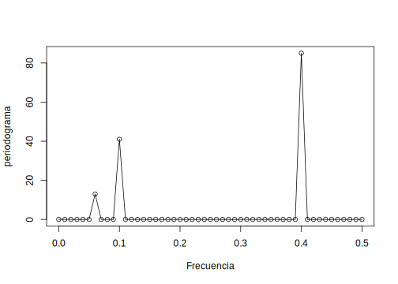
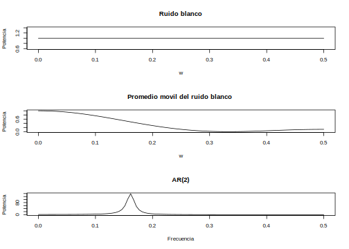
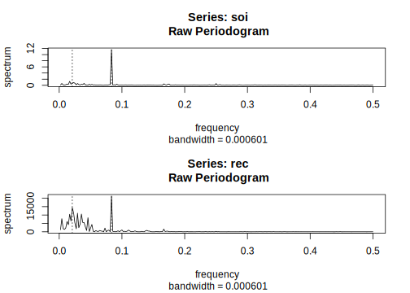
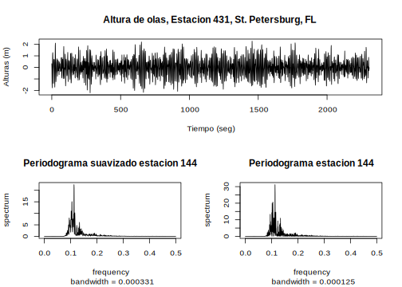
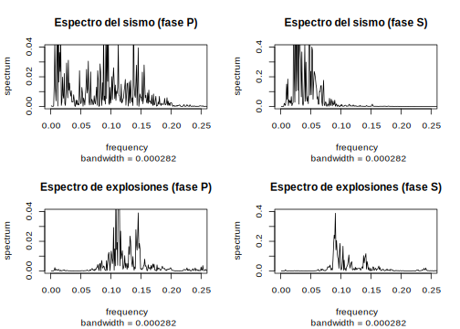

--- 
title: "Series de Tiempo en R"
subtitle: "Ciencia de los Datos Financieros"
author: "Synergy Vision"
date: "2018-10-08"
knit: "bookdown::render_book"
documentclass: krantz
bibliography: [book.bib, packages.bib]
biblio-style: apalike
link-citations: yes
colorlinks: yes
lot: yes
lof: yes
fontsize: 12pt
monofontoptions: "Scale=0.8"
keep_md: yes
site: bookdown::bookdown_site
description: ""
url: 'http\://synergy.vision/Series-de-Tiempo-en-R/'
github-repo: synergyvision/Series-de-Tiempo-en-R/
cover-image: images/cover.png
---

# Prefacio {-}

Placeholder


## ¿Por qué  leer este libro? {-}
## Estructura del libro {-}
## Información sobre los programas y convenciones {-}
## Prácticas interactivas con R {-}
## Agradecimientos {-}

<!--chapter:end:index.Rmd-->


# Acerca del Autor {-}

Este material es un esfuerzo de equipo en Synergy Vision, (<http://synergy.vision/nosotros/>).		 

El propósito de este material es ofrecer una experiencia de aprendizaje distinta y enfocada en el estudiante. El propósito es que realmente aprenda y practique con mucha intensidad. La idea es cambiar el modelo de clases magistrales y ofrecer una experiencia más centrada en el estudiante y menos centrado en el profesor. Para los temas más técnicos y avanzados es necesario trabajar de la mano con el estudiante y asistirlo en el proceso de aprendizaje con prácticas guiadas, material en línea e interactivo, videos, evaluación contínua de brechas y entendimiento, entre otros, para procurar el dominio de la materia.
  		  
Nuestro foco es la Ciencia de los Datos Financieros y para ello se desarrollará material sobre: **Probabilidad y Estadística Matemática en R**, **Programación Científica en R**, **Mercados**, **Inversiones y Trading**, **Datos y Modelos Financieros en R**, **Renta Fija**, **Inmunización de Carteras de Renta Fija**, **Teoría de Riesgo en R**, **Finanzas Cuantitativas**, **Ingeniería Financiera**, **Procesos Estocásticos en R**, **Series de Tiempo en R**, **Ciencia de los Datos**, **Ciencia de los Datos Financieros**, **Simulación en R**, **Desarrollo de Aplicaciones Interactivas en R**, **Minería de Datos**, **Aprendizaje Estadístico**, **Estadística Multivariante**, **Riesgo de Crédito**, **Riesgo de Liquidez**, **Riesgo de Mercado**, **Riesgo Operacional**, **Riesgo de Cambio**, **Análisis Técnico**, **Inversión Visual**, **Finanzas**, **Finanzas Corporativas**, **Valoración**, **Teoría de Portafolio**, entre otros.

Nuestra cuenta de Twitter es (https://twitter.com/bysynergyvision) y nuestros repositorios están en GitHub (https://github.com/synergyvision).
  		  
 **Somos Científicos de Datos Financieros**

<!--chapter:end:000-author.Rmd-->


# Introducción

Placeholder


## Conceptos financieros básicos
## Conceptos básicos 
## Ejemplos 
### Clasificación de las series de tiempo
## Componentes de una serie de tiempo
### El Modelo Aditivo de Componentes de Series de Tiempo
### El Modelo Multiplicativo de Componentes de Series de Tiempo

<!--chapter:end:100-introduction.Rmd-->


# Características de series de tiempo

Placeholder


## Medidas de dependencia para series de tiempo
## Estimación de la Tendencia
### Estimación de la tendencia en ausencia de estacionalidad
### Estimación de la tendencia y la estacionalidad
## Estimación de la tendencia por regresión clásica
### Regresión Clásica

<!--chapter:end:200-caracterisitcas-series-tiempo.Rmd-->


# Modelos de series de tiempo

Placeholder


## Modelos Estocásticos
### Procesos Estocásticos
### Momentos, Varianza, Covarianza y Correlación
### Variación de un proceso
### Martingalas
### Propiedad de Markov
## Modelos lineales
### Proceso de Ruido Blanco

<!--chapter:end:300-modelos-series-tiempo.Rmd-->


# Modelos AR

Placeholder


## Modelo AR(1)
## Modelo AR(2)
## Procesos AR(p)
## Función de Autocorrelación Parcial
## Criterios de Información
## Estimación de Parámetros.
## Predicciones con modelos AR
### Predicción de un paso
### Predicción de dos pasos
### Predicción de múltiples pasos

<!--chapter:end:301-modelos-AR.Rmd-->


# Modelos MA

Placeholder


## Propiedades de los modelos MA
### Estacionaridad
### Función de autocorrelación (ACF)
## Identificación del orden de un MA
## Estimación
## Predicciones usando modelos MA

<!--chapter:end:302-modelos-MA.Rmd-->


#  Modelos ARMA

Placeholder


## Propiedades de los modelos ARMA(p,q)
## Ecuaciones en Diferencias
### Función de Autocorrelación (ACF) para modelos ARMA
## Pronósticos
### Pronósticos para procesos ARMA

<!--chapter:end:303-modelos-ARMA.Rmd-->


# Estimación de parámetros

Placeholder


## Estimación
## Estimación por Máxima Verosimilitud y Mínimos Cuadrados {#sect-EMV}
## Estimación de mínimos cuadrados para modelos ARMA(p,q)

<!--chapter:end:304-estimacion-de-parametros.Rmd-->


# Modelos ARIMA

Placeholder


## Construcción de modelos ARIMA
## Modelos SARIMA

<!--chapter:end:305-modelos-ARIMA.Rmd-->


# Modelos ARCH y GARCH

Placeholder


## Estructura de los Modelos
## Modelos ARCH
### Estimación de un Modelo ARCH(p)
### Predicción con modelos ARCH
## Modelos GARCH
### Estimación de un Modelo GARCH
### Predicción con modelos GARCH

<!--chapter:end:306-Modelos-ARCH-GARCH.Rmd-->

# Análisis Espectral

La representación espectral de un proceso estacionario $x_t$ esencialmente descompone $x_t$ en suma de componentes senosoidales con coeficientes no correlacionados. En relación con esta descomposición existe una correspondiente descomposición en senosoidales de la función de autocovarianza de $x_t$. La descomposición espectral es así una analogía para procesos estocásticos estacionarios de la conocida representación de Fourier para funciones determinísticas. El análisis de procesos estacionarios por medio de su representación espectral es usualmente referido como el análisis en el *dominio de frecuencias* de la serie de tiempo. Este es equivalente al análisis en el *dominio de tiempo* basado en la función de autocovarianza, pero provee una manera alternativa de ver el proceso para el cual en algunas aplicaciones puede ser más significativo. Por ejemplo en el diseño de una estructura sujeta a una fluctuación de carga aleatoria es importante tener cuidado con la presencia en la fuerza de carga de una gran armónica con frecuencia particular para asegurar que la frecuencia en cuestión no sea una frecuencia resonante de la estructura. El punto de vista espectral es particularmente ventajoso en el análisis de procesos estacionarios multivariantes y en el análisis de conjuntos de datos grandes, para los cuales los cálculos numéricos se pueden realizar rápidamente usando la *Transformada Rápida de Fourier (FFT)*.

## Comportamiento Cíclico y Periodicidad

Ya hemos visto la noción de periodicidad en varios ejemplos de los capítulos anteriores. La noción general de periodicidad se puede hacer con más precisión introduciendo algunas terminologías. De interés descriptivo es el período de una serie temporal, definido como el número de puntos en un ciclo, es decir,

\begin{equation}
    T=\frac{1}{\omega}.
(\#eq:eq-periodo-serie-tiempo)
\end{equation}

De manera de definir la tasa de cambio a la cual una serie oscila, primero definiremos un ciclo como un periodo completo de una función seno o de coseno sobre un intervalo de tiempo de longitud $2\pi$. Consideremos el siguiente proceso periódico

\begin{equation}
x_t=A\cos(2\pi\omega t+\phi)
(\#eq:eq-proceso-periodico)
\end{equation}

para $t=0,\pm1,\pm2,\ldots$, donde $\omega$ es un índice de frecuencias, definida en ciclos por unidad de tiempo con $A$ la altura o **amplitud** de la función y $\phi$ la **fase** la cual determina el punto de inicio de la función coseno. Podemos introducir una variación aleatoria en esta serie de tiempo haciendo que la *amplitud* o la *fase* varíen aleatoriamente. De esta manera es fácil usar identidad trigonométrica [^nota10] y escribir \@ref(eq:eq-proceso-periodico) como

[^nota10]: $\cos(\alpha\pm\beta)=\cos(\alpha)\cos(\beta)\mp\sin(\alpha)\sin(\beta)$


\begin{equation}
    x_t=U_1\cos(2\pi\omega t)+U_2\sin(2\pi\omega t)
(\#eq:eq-proceso-periodico-2)
\end{equation}

donde $U_1=A\cos\phi$ y $U_2=-A\sin\phi$ son en general tomados de manera que sean variables aleatorias normalmente distribuidas. En este caso la amplitud es $A=\sqrt{U_1^2+U_2^2}$ y la fase es $\phi=\arctan(-U_2/U_1)$. De este hecho se puede demostrar que si y solo si, en \@ref(eq:eq-proceso-periodico), $A$ y $\phi$ son variables aleatorias independientes, donde $A^2$ es una chi-cuadrado con 2 grados de libertad, y $\phi$ es uniforme en $(-\pi,\pi)$, entonces $U_1$ y $U_2$ son variables aleatorias normal estándar independientes.

Considere una generalización de \@ref(eq:eq-proceso-periodico-2) que nos permita mezclas de series periódicas con multiples frecuencias y amplitudes

\begin{equation}
    x_t=\sum_{k=1}^{q}\left[U_{k1}\cos(2\pi\omega_kt)+U_{k2}\sin(2\pi\omega_kt)\right]
(\#eq:eq-proceso-periodico-general)
\end{equation}

donde $U_{k1},U_{k2}$ para $k=1,2,\ldots,q$, son variables aleatorias independientes con media cero y varianza $\sigma_k^2$ y las $\omega_k$ son distintas frecuencias. Note que \@ref(eq:eq-proceso-periodico-general) muestra el proceso como una suma de componentes independientes, con varianza $\sigma_k^2$ para frecuencia $\omega_k$. Usando la independencia de $Us$ e identidad trigonométrica, es fácil demostrar que la función de autocovarianza del proceso es

\begin{equation}
 \gamma(h)=\sum_{k=1}^{q}\sigma_k^2\cos(2\pi\omega_kh)
(\#eq:eq-funcion-covarianza-proceso-periodico)
\end{equation}


Note que la función de autocovarianza es la suma de componentes periódicas con pesos proporcionales a la varianza $\sigma_k^2$. Por consiguiente, $x_t$ es un proceso estacionario de media cero con varianza

\begin{equation}
    \gamma(0)=\mathbb{E}(x_t^2)=\sum_{k=1}^{q}\sigma_k^2
(\#eq:eq-varianza-proceso-periodico)
\end{equation}

que muestra la variación total como la suma de las varianzas de cada una de las componentes.


\BeginKnitrBlock{example}\iffalse{-91-85-110-97-32-115-101-114-105-101-32-112-101-114-105-243-100-105-99-97-93-}\fi{}<div class="example"><span class="example" id="exm:ejem-serie-periodica"><strong>(\#exm:ejem-serie-periodica)  \iffalse (Una serie periódica) \fi{} </strong></span>
La Figura \@ref(fig:fig-componentes-periodicas) muestra un ejemplo de mezcla \@ref(eq:eq-proceso-periodico-general) con $q=3$ construido de la siguiente manera. Primero para $t=1,\ldots,100$ generamos tres series

\begin{eqnarray*}
  x_{t1} &=& 2\cos(2\pi t6/100)+3\sin(2\pi t6/100) \\
  x_{t2} &=& 4\cos(2\pi t10/100)+5\sin(2\pi t10/100) \\
  x_{t3} &=& 6\cos(2\pi t40/100)+7\sin(2\pi t40/100)
\end{eqnarray*}

Estas tres series se muestran en la Figura \@ref(fig:fig-componentes-periodicas) junto con las correspondientes frecuencias y amplitudes cuadrada. Por ejemplo, la amplitud cuadrada de $x_{t1}$ es $2^3+3^2=13$. Por consiguiente, los valores máximos y mínimos de la serie $x_{t1}$ están restringidos a $\pm\sqrt{13}=\pm3.61$. Finalmente construimos la serie
$$x_t=x_{t1}+x_{t2}+x_{t3}$$
esta serie también se muestra en la Figura \@ref(fig:fig-componentes-periodicas). Note que la serie $x_t$ parece tener el comportamiento de alguna de las series periódicas vistas en los Capítulos [Características de series de tiempo] y [Modelos de series de tiempo]. La clasificación sistemática de los componentes esenciales de frecuencia en una serie de tiempo, incluyendo sus contribuciones relativas, constituye uno de los principales objetivos del análisis espectral.</div>\EndKnitrBlock{example}


```r
x1=2*cos(2*pi*1:100*6/100)+3*sin(2*pi*1:100*6/100) 
x2=4*cos(2*pi*1:100*10/100)+5*sin(2*pi*1:100*10/100)
x3=6*cos(2*pi*1:100*40/100)+7*sin(2*pi*1:100*40/100)
xt=x1+x2+x3   
par(mfrow=c(2,2))   
plot.ts(x1, ylim=c(-10,10),
        main=expression(omega==6/100~~~A^2==13))
plot.ts(x2, ylim=c(-10,10),
        main=expression(omega==10/100~~~A^2==41))
plot.ts(x3, ylim=c(-10,10),
        main=expression(omega==40/100~~~A^2==85))
plot.ts(xt, ylim=c(-10,10), main="suma")
```

<div class="figure">

<p class="caption">(\#fig:fig-componentes-periodicas)Componentes periódicas y su suma como se describe en el Ejemplo</p>
</div>

---

\BeginKnitrBlock{example}\iffalse{-91-80-101-114-105-111-100-111-103-114-97-109-97-32-101-115-99-97-108-97-100-111-32-112-97-114-97-32-101-108-32-101-106-101-109-112-108-111-32-97-110-116-101-114-105-111-114-93-}\fi{}<div class="example"><span class="example" id="exm:ejem-periodograma-escalado"><strong>(\#exm:ejem-periodograma-escalado)  \iffalse (Periodograma escalado para el ejemplo anterior) \fi{} </strong></span>
En el Ejemplo \@ref(exm:ejem-regresion-senal-ruido) introdujimos el periodograma como una manera de descubrir las componentes periódicas de una serie de tiempo. Recuerde que el periodograma escalado está dado por

\begin{equation}
    P(j/n)=\left(\frac{2}{n}\sum_{t=1}^{n}x_t\cos(2\pi tj/n)\right)^2+\left(\frac{2}{n}\sum_{t=1}^{n}x_t\sin(2\pi tj/n)\right)^2
(\#eq:eq-periodograma-escalado)
\end{equation}

y se podia considerar como una medida de la correlación cuadrada de los datos con las oscilaciones senosoidales a frecuencia $\omega_j=j/n$ o $j$ ciclos en $n$ puntos de tiempo.

El periodograma escalado de los datos $x_t$ simulados en el Ejemplo \@ref(exm:ejem-serie-periodica) se muestran en la Figura \@ref(fig:fig-periodograma-escalado) y claramente se identifican las tres componentes $x_{t1},x_{t2}$ y $x_{t3}$ de $x_t$. Más aún, los pesos del periodograma escalado mostrados en la Figura \@ref(fig:fig-periodograma-escalado) son

$$P(6/100)=13\text{, }P(10/100)=41\text{, }P(40/100)=85\text{ y } P(j/n)=0 \text{ en otro caso.}$$

Estos son exactamente las amplitudes al cuadrado de las componentes generadas en el Ejemplo \@ref(exm:ejem-serie-periodica). Este resultado sugiere que el periodograma puede proporcionar una idea de la varianza de los componentes, \@ref(eq:eq-varianza-proceso-periodico), de un conjunto real de los datos.

Las instrucciones en R para calcular el Periodograma y graficarlo son:</div>\EndKnitrBlock{example}


```r
P=abs(2*fft(xt)/100)^2
f=0:50/100
plot(f,P[1:51], type="o", xlab="Frecuencia", ylab="periodograma") 
```

<div class="figure">

<p class="caption">(\#fig:fig-periodograma-escalado)Periodograma de los datos generados en el Ejemplo ...</p>
</div>

---

Si consideramos los datos $x_t$ en el Ejemplo \@ref(exm:ejem-serie-periodica) como un color (forma de onda) hecho con colores primarios $x_{t1},x_{t2},x_{t3}$ en varias intensidades (amplitudes), entonces podemos considerar el periodograma como un prisma que descompone el color $x_t$ en sus colores primarios (espectro). Por consiguiente el término **análisis espectral**.

Otro hecho que podemos usar para entender el concepto de periodograma es que para cada muestra $x_1,\ldots,x_n$ de una serie temporal donde $n$ es impar, podemos escribir, exactamente

\begin{equation}
x_t=a_0 + \sum_{j=1}^{(n-1)/2}\left[a_j\cos(2\pi tj/n) + b_j\sin(2\pi tj/n)\right],
(\#eq:eq-serie-periodograma-impar)
\end{equation}

para $t=1,\ldots,n$ y coeficientes convenientemente elegidos. Si $n$ es par, la representación (\ref{eq-serie-periodograma-impar}) se puede modificar sumando hasta $(n/2-1)$ y añadiendo una componente adicional dada por $a_{n/2}\cos(2\pi t1/2)=a_{n/2}(-1)^t$. El punto crucial aquí es que \@ref(eq:eq-serie-periodograma-impar) es exacto para cada muestra. Dado que \@ref(eq:eq-proceso-periodico-general) se puede pensar como una aproximación de \@ref(eq:eq-serie-periodograma-impar), la idea es que muchos de los coeficientes en \@ref(eq:eq-serie-periodograma-impar) pueden estar cerca de cero. Recuerde del Ejemplo 3.4.5 que

\begin{equation}
P(j/n) = a_j^2+b_j^2
(\#eq:eq-periodograma-simple)
\end{equation}

de modo que el periodograma escalado indica cuales componentes periódicas en \@ref(eq:eq-serie-periodograma-impar) son grandes y cuales componentes son pequeñas.


## La Densidad Espectral

La idea de que una serie de tiempo está formada por componentes periódicos, apareciendo en proporción a sus varianzas subyacentes es fundamental en la representación espectral dada por los siguientes Teoremas:

\BeginKnitrBlock{theorem}<div class="theorem"><span class="theorem" id="thm:teo-funcion-hermitiana-no-negativa"><strong>(\#thm:teo-funcion-hermitiana-no-negativa) </strong></span>Una función $\gamma(h)$ para $h=0,\pm1,\pm2,\dots$ es Hermitiana no-negativa definida si y solo si se puede expresar como

\begin{equation}
    \gamma(h)=\int_{-1/2}^{1/2}\exp(2\pi i\omega h)dF(\omega)
(\#eq:eq-funcion-hermitiana)
\end{equation}

donde $F(\cdot)$ es monótona no-decreciente. La función $F(\cdot)$ es continua a la derecha, acotada en $[-1/2,1/2]$ y únicamente determinada por las condiciones $F(-1/2)=0,F(1/2)=\gamma(0)$.</div>\EndKnitrBlock{theorem}

\BeginKnitrBlock{proof}<div class="proof">\iffalse{} <span class="proof"><em>Demostración. </em></span>  \fi{}Para demostrar el resultado, note primero que si $\gamma(h)$ tiene la representación de arriba

\begin{eqnarray*}
  \sum_{s=1}^{n}\sum_{t=1}^{n}\bar{a}_s\gamma(s-t)a_t &=& \int_{-1/2}^{1/2}\bar{a}_s\gamma(s-t)a_te^{2\pi i\omega(s-t)}dF(\omega) \\
        &=& \int_{-1/2}^{1/2}\left|\sum_{s=1}^{n}a_se^{-2\pi i\omega s}\right|^2dF(\omega) \\
        &=& \geq 0
\end{eqnarray*}

y $\gamma(h)$ es no-negativa definida. Recíprocamente, suponga que $\gamma(h)$ es una función no-negativa definida, y definamos la función no-negativa

\begin{eqnarray}
  f_n(\omega) &=& \frac{1}{n}\sum_{s=1}^{n}\sum_{t=1}^{n}e^{-2\pi i\omega s}\gamma(s-t)e^{2\pi i\omega t} \nonumber\\
         &=& \frac{1}{n}\sum_{u=-(n-1)}^{(n-1)}(n-|u|)e^{-2\pi i\omega u}\gamma(u) (\#eq:eq-funcion-no-negativa) \\
         &=& \geq 0. \nonumber
\end{eqnarray}

Ahora, sea $F_n(\omega)$ la función de distribución correspondiente a $f_n(\omega)I_{(-1/2,1/2]}$ donde $I_{(\cdot)}$ denota la función indicatriz del intervalo en el subíndice. Note que $F_n(\omega)=0, \omega\leq-1/2$ y $F_n(\omega)=F_n(1/2)$ para $\omega\geq1/2$. Entonces

\begin{eqnarray*}
  \int_{-1/2}^{1/2}e^{2\pi i\omega u}dF_n(\omega) &=& \int_{-1/2}^{1/2}e^{2\pi i\omega u}f_n(\omega)d\omega \\
         &=& \begin{cases}
         (1-|u|/n)\gamma(u)&\text{, }|u|<n\\
         0&\text{, en otro caso}
         \end{cases}
\end{eqnarray*}

También tenemos

\begin{eqnarray*}
  F_n(1/2) &=& \int_{-1/2}^{1/2}f_n(\omega)d\omega \\
         &=& \int_{-1/2}^{1/2}\sum_{|u|<n}(1-|u|/n)\gamma(u)e^{-2\pi i\omega u}d\omega \\
         &=& \gamma(0).
\end{eqnarray*}

Ahora, por el primer teorema de convergencia de Helly [^nota11], existe una subsucesión $F_{n_k}$ convergente a $F$ y por el lema de Helly-Bray, esto implica que

$$\int_{-1/2}^{1/2}e^{2\pi i\omega u}dF_{n_k}(\omega)\to\int_{-1/2}^{1/2}e^{2\pi i\omega u}dF(\omega)$$

y del lado derecho de la ecuación anterior

$$(1-|u|/n_k)\gamma(u)\to\gamma(u)$$

cuando $n_k\to\infty$, y se obtiene el resultado requerido.</div>\EndKnitrBlock{proof}

---

[^nota11]: Véase Bhat, R.R. (1985). *Modern Probability Theory, 2nd ed.*  New York, Wiley, pag157.

Ahora presentamos una versión del Teorema de Representación Espectral en términos de un proceso estacionario de media cero $x_t$. Esta versión nos permite pensar en un proceso estacionario como un proceso generado (aproximadamente) por sumas aleatorias de senos y cosenos tal como se describe en \@ref(eq:eq-proceso-periodico-general).

\BeginKnitrBlock{theorem}<div class="theorem"><span class="theorem" id="thm:teo-representacion-espectral-proceso-estacionario"><strong>(\#thm:teo-representacion-espectral-proceso-estacionario) </strong></span>Si $x_t$ es un proceso estacionario de media cero, con distribución espectral $F(\omega)$ como la dada en el Teorema \@ref(thm:teo-funcion-hermitiana-no-negativa), entonces existe un proceso estocástico a valores complejos $z(\omega)$ en el intervalo $\omega\in[-1/2,1/2]$ con incrementos estacionarios no-correlacionados, tal que $x_t$ se puede escribir como la integral estocástica
$$x_t=\int_{-1/2}^{1/2}\exp(-2\pi it\omega)dz(\omega)$$
donde, para $-1/2\leq\omega_1\leq\omega_2\leq1/2$
$$\text{var}\{z(\omega_2)-z(\omega_1)\}=F(\omega_2)-F(\omega_1).$$</div>\EndKnitrBlock{theorem}

---

Este resultado es muy técnico porque envuelve integración estocástica; es decir, integración respecto a un proceso estocástico. En términos no técnico, el Teorema \@ref(thm:teo-representacion-espectral-proceso-estacionario) dice que \@ref(eq:eq-proceso-periodico-general) es aproximadamente verdadero para cada serie de tiempo estacionaria. En otras palabras,  *cada serie de tiempo estacionaria se puede pensar, aproximadamente, como una superposición aleatoria de senos y cosenos oscilando a distintas frecuencias.*

Dado que \@ref(eq:eq-proceso-periodico-general) es aproximadamente cierta para toda serie de tiempo estacionaria, la siguiente pregunta es si una representación significativa para la función de autocovarianza, como la dada por \@ref(eq:eq-funcion-covarianza-proceso-periodico), también existirá. La respuesta es sí, y su representación es dada por el Teorema \@ref(thm:teo-funcion-hermitiana-no-negativa). El siguiente ejemplo, nos ayudará a explicar estos resultados.

\BeginKnitrBlock{example}\iffalse{-91-85-110-32-112-114-111-99-101-115-111-32-101-115-116-97-99-105-111-110-97-114-105-111-32-112-101-114-105-243-100-105-99-111-93-}\fi{}<div class="example"><span class="example" id="exm:ejem-proceso-estacionario-periodico"><strong>(\#exm:ejem-proceso-estacionario-periodico)  \iffalse (Un proceso estacionario periódico) \fi{} </strong></span>Considere un proceso aleatorio estacionario periódico dado por \@ref(eq:eq-proceso-periodico-2), con frecuencia fija $\omega_0$

$$x_t=U_1\cos(2\pi\omega_0t)+U_2\sin(2\pi\omega_0t)$$

donde $U_1$ y $U_2$ son variables aleatorias independientes de media cero y varianza igual $\sigma^2$. El número de periodos de tiempo necesario para que la serie de arriba complete un ciclo es exactamente $1/\omega_0$, y el proceso hace exactamente $\omega_0$ ciclos por puntos para $t=0,\pm1,\pm2,\ldots$. Es fácil demostrar que
[^nota12]

\begin{eqnarray*}
  \gamma(h) &=& \sigma^2\cos(2\pi\omega_0h)=\frac{\sigma^2}{2}e^{-2\pi i\omega_0h}+\frac{\sigma^2}{2}e^{2\pi i\omega_0h} \\
         &=& \int_{-1/2}^{1/2}e^{2\pi i\omega h}dF(\omega)
\end{eqnarray*}

usando la integración de Riemann-Stieltjes, donde $F(\omega)$ es la función definida por

$$F(\omega)=\begin{cases}
0,&\omega<-\omega_0\\
\sigma^2/2,&-\omega_0\leq\omega<\omega_0\\
\sigma^2,&\omega\geq\omega_0
\end{cases}.$$

La función $F(\omega)$ se comporta como una función de distribución acumulada para una variable aleatoria discreta, excepto que $F(\infty)=\sigma^2=\gamma_x(0)$ en vez de uno. De hecho, $F(\omega)$ es una función de distribución acumulada, no una probabilidad, sino más bien de varianza asociada con la frecuencia $\omega_0$ en un análisis de varianza, siendo $F(\infty)$ la varianza total del proceso $x_t$. Por lo tanto, llamamos a $F(\omega)$ la *función de distribución espectral*.</div>\EndKnitrBlock{example}

---

[^nota12]:Algunas identidades que pueden ayudar aquí: $e^{i\alpha}=\cos(\alpha)+i\sin(\alpha)$, así $\cos(\alpha)=(e^{i\alpha}+e^{-i\alpha})/2$ y $\sin(\alpha)=(e^{i\alpha}-e^{-i\alpha})/2i$.

El Teorema \@ref(thm:teo-funcion-hermitiana-no-negativa) establece que una representación como la dada en el Ejemplo \@ref(exm:ejem-proceso-estacionario-periodico) siempre existirá para un proceso estacionario. En particular, si $x_t$ es estacionario con autocovarianza $\gamma(h)=\mathbb{E}[(x_{t+h}-\mu)(x_t-\mu)]$, entonces existe una única función monótona creciente $F(\omega)$, llamada la **función de distribución espectral**, que es acotada, con $F(-\infty)=F(-1/2)=0$ y $F(\infty)=F(1/2)=\gamma(0)$ tal que

\begin{equation}
  \gamma(h)=\int_{-1/2}^{1/2}e^{2\pi i\omega h}dF(\omega).
(\#eq:eq-funcion-distribucion-espectral)
\end{equation}

Una situación más importante que usaremos repetidamente es cubierta por el Teorema \@ref(thm:teo-densidad-espectral), donde se muestra que, sujeto a la sumabilidad absoluta de la autocovarianza, la función de distribución espectral es absolutamente continua con $dF(\omega)=f(\omega)d\omega$ y la representación \@ref(eq:eq-funcion-distribucion-espectral) motiva la propiedad que sigue.

\BeginKnitrBlock{theorem}<div class="theorem"><span class="theorem" id="thm:teo-densidad-espectral"><strong>(\#thm:teo-densidad-espectral) </strong></span>Si $\gamma(h)$ es la función de autocovarianza de un proceso estacionario $x_t$ con

\begin{equation}
  \sum_{h=-\infty}^{\infty}|\gamma(h)|<\infty
(\#eq:eq-covarianza-convergente)
\end{equation}

entonces la densidad espectral de $x_t$ está dada por

\begin{equation}
  f(\omega)=\sum_{h=-\infty}^{\infty}\gamma(h)e^{-2\pi i\omega h}.
(\#eq:eq-densidad-espectral)
\end{equation}</div>\EndKnitrBlock{theorem}


\BeginKnitrBlock{proposition}\iffalse{-91-76-97-32-68-101-110-115-105-100-97-100-32-69-115-112-101-99-116-114-97-108-93-}\fi{}<div class="proposition"><span class="proposition" id="prp:propie-densidad-espectral"><strong>(\#prp:propie-densidad-espectral)  \iffalse (La Densidad Espectral) \fi{} </strong></span>Si la función de autocovarianza $\gamma(h)$ de un proceso estacionario satisface

\begin{equation}
  \sum_{h=-\infty}^{\infty}|\gamma(h)|<\infty
(\#eq:eq-covarianza-finita)
\end{equation}

entonces esta tiene representación espectral

\begin{equation}
  \gamma(h)=\int_{-1/2}^{1/2}e^{2\pi i\omega h}f(\omega)d\omega\text{ para }h=0,\pm1,\pm2,\ldots
(\#eq:eq-representacion-covarianza)
\end{equation}

como la transformación inversa de la densidad espectral, la cual tiene la representación

\begin{equation}
  f(\omega)=\sum_{h=-\infty}^{\infty}\gamma(h)e^{-2\pi i\omega h}\text{ con }-1/2\leq\omega\leq1/2.
(\#eq:eq-densidad-espectral-covarianza)
\end{equation}</div>\EndKnitrBlock{proposition}

La densidad espectral definida en la Proposición \@ref(prp:propie-densidad-espectral) es análoga a la función de densidad de probabilidad; el hecho de que $\gamma(h)$ es no negativa definida asegura que

$$f(\omega)\geq0$$

para todo $\omega$. Se sigue inmediatamente de \@ref(eq:eq-representacion-covarianza) y \@ref(eq:eq-densidad-espectral-covarianza) que

$$f(\omega)=f(-\omega)$$

y

$$f(\omega+1)=f(\omega)$$

verificando que la densidad espectral es una función par de periodo uno. Debido a que $f(\omega)$ es una función par, normalmente se graficará solo $f(\omega)$ para $\omega\geq0$.

Adicionalmente, haciendo $h=0$ en \@ref(eq:eq-representacion-covarianza) se obtiene

$$\gamma(0)=\text{var}(x_t)=\int_{-1/2}^{1/2}f(\omega)d\omega$$

lo cual expresa la varianza total como la integral de la densidad espectral sobre todas las frecuencias. Demostraremos luego, que un filtro lineal puede aislar la varianza en ciertos intervalos de frecuencias o bandas.

Análogo a la teoría de probabilidades, $\gamma(h)$ en \@ref(eq:eq-representacion-covarianza) es la función característica de la densidad espectral $f(\omega)$ en \@ref(eq:eq-densidad-espectral-covarianza). Estos hechos deben dejar claro que, cuando la condición de la Proposición \@ref(prp:propie-densidad-espectral) es satisfecha, la función de autocovarianza $\gamma(h)$ y la función de densidad espectral $f(\omega)$ contienen la misma información. Esta información, sin embargo, es expresada de distintas maneras. La función de autocovarianza expresa la información en términos de pasos o saltos, mientras que la densidad espectral expresa la misma información en término de ciclos. Algunos de los problemas son más fáciles de trabajar cuando consideramos la información de pasos o saltos y tendemos a manejar los problemas en el dominio del tiempo. Sin embargo, otros problemas son más fáciles de trabajar teniendo en cuenta la información periódica y tendemos a manejar los problemas en el dominio espectral o de frecuencias.

También debemos mencionar, que hasta ahora nos hemos enfocado en la frecuencia $\omega$ expresada en ciclos por puntos de tiempo, en lugar de la más común (en estadística) alternativa $\lambda=2\pi\omega$ que nos da radianes por puntos. Finalmente, la condición de sumabilidad absoluta \@ref(eq:eq-covarianza-finita) no es satisfecha por \@ref(eq:eq-funcion-covarianza-proceso-periodico), el ejemplo que introdujimos para dar las ideas de representación espectral. La condición, sin embargo, es satisfecha para modelos ARMA.

Note que la función de autocovarianza $\gamma(h)$ en \@ref(eq:eq-representacion-covarianza) y la densidad espectral $f(\omega)$ en \@ref(eq:eq-densidad-espectral-covarianza) son pares de transformadas de Fourier. En general, tenemos la siguiente definición:

\BeginKnitrBlock{definition}<div class="definition"><span class="definition" id="def:defi-par-transformadas-fourier"><strong>(\#def:defi-par-transformadas-fourier) </strong></span>Para una función  general $\{a_t;t=0,\pm1,\pm2,\ldots\}$ que satisface la condición de sumabilidad absoluta

\begin{equation}
  \sum_{t=-\infty}^{\infty}|a_t|<\infty,
(\#eq:eq-cond-sumabilidad-absoluta)
\end{equation}

definimos el **par de transformadas de Fourier** de la forma

\begin{equation}\label{}
  A(\omega)=\sum_{t=-\infty}^{\infty}a_te^{-2\pi i\omega t}
(\#eq:eq-transformada-fourier-A)
\end{equation}

y

\begin{equation}\label{}
  a_t=\int_{-1/2}^{1/2}A(\omega)e^{2\pi i\omega t}d\omega
(\#eq:eq-transformada-fourier-a)
\end{equation}</div>\EndKnitrBlock{definition}

El uso de \@ref(eq:eq-representacion-covarianza) y \@ref(eq:eq-densidad-espectral-covarianza) como par de transformadas de Fourier es fundamental en el estudio de procesos estacionarios a tiempo discreto. Bajo la condición de sumabilidad, el par de transformadas de Fourier \@ref(eq:eq-representacion-covarianza) y \@ref(eq:eq-densidad-espectral-covarianza) existirá y esta relación es única.


Si $f(\omega)$ y $g(\omega)$ son dos densidades espectrales para lo cual

\begin{equation}
\int_{-1/2}^{1/2}f(\omega)e^{2\pi i\omega h}d\omega=\int_{-1/2}^{1/2}g(\omega)e^{2\pi i\omega h}d\omega
(\#eq:eq-igualdad-densidades-f-g)
\end{equation}

para todo $h=0,\pm1,\pm2,\ldots$, entonces

\begin{equation}
f(\omega)=g(\omega)
(\#eq:eq-igualdad-densidades-f-g-cs)
\end{equation}

casi siempre.


\BeginKnitrBlock{example}\iffalse{-91-83-101-114-105-101-32-100-101-32-114-117-105-100-111-32-98-108-97-110-99-111-93-}\fi{}<div class="example"><span class="example" id="exm:ejem-espectro-serie-ruido-blanco"><strong>(\#exm:ejem-espectro-serie-ruido-blanco)  \iffalse (Serie de ruido blanco) \fi{} </strong></span>
Como un ejemplo sencillo, consideremos el espectro de potencias teórica de una sucesión de variables aleatorias no correlacionadas $w_t$ con varianza $\sigma_w^2$. Dado que la función de autocovarianza fue calculada en \@ref(eq:eq-funcion-autocovarianza-ruido-blanco) como $\gamma_w(h)=\sigma_w^2$ para $h=0$ y cero en cualquier otro caso, se sigue de \@ref(eq:eq-densidad-espectral-covarianza) que

$$f_w(\omega)=\sigma_w^2$$

para $-1/2\leq\omega\leq1/2$ con la misma potencia para todas las frecuencias. Esta propiedad se ve en la realización, el cual parece contener todas las diferentes frecuencias en proporciones similares. La figura \@ref(fig:fig-espectros-teoricos) (parte superior) muestra la gráfica del espectro de un ruido blanco con $\sigma_w^2=1$.
</div>\EndKnitrBlock{example}


\BeginKnitrBlock{example}\iffalse{-91-85-110-32-112-114-111-109-101-100-105-111-32-109-243-118-105-108-32-115-105-109-112-108-101-93-}\fi{}<div class="example"><span class="example" id="exm:ejem-espectro-promedio-movil-simple"><strong>(\#exm:ejem-espectro-promedio-movil-simple)  \iffalse (Un promedio móvil simple) \fi{} </strong></span>
Una serie que no tiene una proporción igual de frecuencias es la serie de ruido blanco suavizada que se muestra en la parte inferior de la primera Figura del Ejemplo \@ref(exm:ejem-promedio-movil-ruido-blanco). Específicamente construimos una serie de promedio móvil de tres puntos definida por

$$v_t=\frac{1}{3}(w_{t-1}+w_t+w_{t+1}).$$

Es claro de la realización del ejemplo que la serie tiene menos frecuencias altas, calculando su espectro de potencias se verifica este hecho. En el Ejemplo \@ref(exm:ejem-ACF-MA) calculamos su función de autocovarianza, obteniendo

$$\gamma_v(h)=\frac{\sigma_w^2}{9}(3-|h|)$$

para $|h|\leq2$ y $\gamma_v(h)=0$ para $|h|>2$.

Entonces, usando \@ref(eq:eq-densidad-espectral-covarianza) nos da

\begin{eqnarray*}
f_v(\omega) &=& \sum_{h=-2}^{2}\gamma_v(h)e^{-2\pi i\omega h} \\
         &=& \frac{\sigma_w^2}{9}(e^{-4\pi i\omega}+e^{4\pi i\omega})+\frac{2\sigma_w^2}{9}(e^{-2\pi i\omega}+e^{2\pi\omega})+\frac{3\sigma_w^2}{9} \\
         &=& \frac{\sigma_w^2}{9}[3+4\cos(2\pi\omega)+2\cos(4\pi\omega)]
\end{eqnarray*}

Graficando el espectro para $\sigma_w^2=1$, como en la Figura \@ref(fig:fig-espectros-teoricos), se muestra que las frecuencias cercanas a cero tiene mayor potencia y las energías más grandes, $\omega>0.2$ tienen menor potencia.
</div>\EndKnitrBlock{example}


\BeginKnitrBlock{example}\iffalse{-91-85-110-97-32-115-101-114-105-101-32-97-117-116-111-114-101-103-114-101-115-105-118-97-32-100-101-32-115-101-103-117-110-100-111-32-111-114-100-101-110-93-}\fi{}<div class="example"><span class="example" id="exm:ejem-espectro-AR2"><strong>(\#exm:ejem-espectro-AR2)  \iffalse (Una serie autoregresiva de segundo orden) \fi{} </strong></span>
Consideremos el espectro de una serie AR(2) de la forma

$$x_t-\phi_1x_{t-1}-\phi_2x_{t-2}=w_t$$

para el caso especial $\phi_1=1$ y $\phi_2=-0.9$. Recuerde el Ejemplo \@ref(exm:ejem-ACF-MA) el cual muestra una realización de este proceso con $\sigma_w^2=1$. Note que los datos exhiben una fuerte componente periódica de un ciclo cada seis puntos. Primero, calculemos la función de autocovarianza del lado derecho e igualemos este a la autocovarianza de la parte izquierda

\begin{eqnarray*}
  \gamma_w(h) &=& \mathbb{E}[(x_{t+h}-\phi_1x_{t+h-1}-\phi_2x_{t+h-2})(x_t-\phi_1x_{t-1}-\phi_2x_{t-2})] \\
         &=& [1+\phi_1^2+\phi_2^2]\gamma_x(h)+(\phi_1\phi_2-\phi_1)[\gamma_x(h+1)+\gamma_x(h-1)]-\phi_2[\gamma_x(h+2)+\gamma_x(h-2)] \\
         &=& 2.81\gamma_x(h)-1.9[\gamma_x(h+1)+\gamma_x(h-1)]+0.9[\gamma_x(h+2)+\gamma_x(h-2)],
\end{eqnarray*}

hemos sustituido los valores de $\phi_1=1$ y $\phi_2=-0.9$ en la ecuación.

Ahora, sustituyendo la representación espectral para $\gamma_x(h)$ en la ecuación anterior, se tiene

\begin{eqnarray*}
  \gamma_w(h) &=& \int_{-1/2}^{1/2}[2.81-1.90(e^{2\pi i\omega}+e^{-2\pi i\omega})+0.90(e^{4\pi i\omega}+e^{-4\pi i\omega})]e^{2\pi i\omega h}f_x(\omega)d\omega \\
         &=& \int_{-1/2}^{1/2}[2.81-3.80\cos(2\pi\omega)+1.80\cos(4\pi\omega)]e^{2\pi i\omega h}f_x(\omega)d\omega.
\end{eqnarray*}

Si el espectro del proceso de ruido blanco es $g_w(\omega)$, la unicidad de la transformada de Fourier nos permite identificar
$$g_w(\omega)=[2.81-3.80\cos(2\pi\omega)+1.80\cos(4\pi\omega)]f_x(\omega).$$

Pero, como ya hemos visto, $g_w(\omega)=\sigma_w^2$ de donde se deduce que

$$f_x(\omega)=\frac{\sigma_w^2}{2.81-3.80\cos(2\pi\omega)+1.80\cos(4\pi\omega)}$$

es el espectro de la serie autoregresiva. Haciendo $\sigma_w^2=1$ se tiene el espectro $f_x(\omega)$ mostrado en la Figura \@ref(fig:fig-espectros-teoricos), y donde muestra una componente de potencia fuerte alrededor de $\omega=0.16$ ciclos por puntos o un periodo entre seis y siete ciclos por puntos y potencias muy pequeñas en las otras frecuencias. En este caso, modificando la serie de ruido blanco aplicando un operador AR de orden dos ha concentrado la potencia o varianza de la serie resultante en una banda de frecuencia bastante estrecha.
</div>\EndKnitrBlock{example}

\begin{figure}[h!]
\centering
  \includegraphics[width=16cm]{Densidades-espectrales.png}\\
  \caption{Espectros teóricos de un ruido blanco (superior), promedio móvil de ruido blanco (medio) y proceso AR(2) (inferior)}
  \label{grafico-espectros-teoricos}
\end{figure}


```r
n=100
sigma2=1
w=seq(0,0.5,length=n)
# Calculo de las densidades espectrales
fw=numeric(n)
fv=numeric(n)
fx=numeric(n)
for (i in 1:n){
  fw[i]=sigma2
  fv[i]=(sigma2/9)*(3+4*cos(2*pi*w[i])+2*cos(4*pi*w[i]))
  fx[i]=sigma2/(2.81-3.80*cos(2*pi*w[i])+1.80*cos(4*pi*w[i]))
}
# Graficos
par(mfrow=c(3,1))
plot(w,fw,type="l", main="Ruido blanco", ylab="Potencia")
plot(w,fv,type="l", main="Promedio movil del ruido blanco", ylab="Potencia")
plot(w,fx,type="l", main="AR(2)", ylab="Potencia", xlab="Frecuencia")
```

<div class="figure">

<p class="caption">(\#fig:fig-espectros-teoricos)Espectros teóricos de un ruido blanco (superior), promedio móvil de ruido blanco (medio) y proceso AR(2) (inferior)</p>
</div>

---

Los ejemplos anteriores han sido dados para motivar el uso de los espectros de potencias para describir las fluctuaciones de la varianza teórica de una serie estacionaria. Es más, la interpretación de la función de densidad espectral como la varianza de la serie de tiempo sobre una banda de frecuencia dada nos da una explicación intuitiva del significado físico. La gráfica de la función $f(\omega)$sobre el argumento de frecuencia $\omega$ puede ser pensado como un análisis de varianza, en el cual las columnas o bloques efectivos son las frecuencias indexadas por $\omega$.


## Periodograma y Transformada Discreta de Fourier

Ahora estamos listos para unir el periodograma, que es el concepto basada en la muestra presentado en la sección [Comportamiento Cíclico y Periodicidad], con la densidad espectral, que es el concepto basado en la población descrito en la sección [La Densidad Espectral].

\BeginKnitrBlock{definition}<div class="definition"><span class="definition" id="def:defi-TDF"><strong>(\#def:defi-TDF) </strong></span>Dado los datos $x_1,x_2,\ldots,x_n$, definimos la **Transformada Discreta de Fourier (TDF)** como

\begin{equation}
  d(\omega_j)=n^{-1/2}\sum_{t=1}^{n}x_te^{-2\pi i\omega_jt}
(\#eq:eq-TDF)
\end{equation}

para $j=0,1,\ldots,n-1$, donde las frecuencias $\omega_j=j/n$ son llamadas las *frecuencias de Fourier* o *frecuencias fundamentales*.</div>\EndKnitrBlock{definition}

---

Si $n$ es un número altamente compuesto (i.e., tiene muchos factores), la TDF se puede calcular usando la Transformada Rápida de Fourier (FFT). A veces es útil explotar el resultado de inversión para TDF que muestra que la transformación lineal es de uno a uno. Para la inversa de TDF, tenemos

\begin{equation}
  x_t=n^{-1/2}\sum_{j=0}^{n-1}d(\omega_j)e^{2\pi i\omega_jt}
(\#eq:eq-inversa-TDF)
\end{equation}

para $t=1,2,\ldots,n$.

\BeginKnitrBlock{definition}<div class="definition"><span class="definition" id="def:defi-periodograma"><strong>(\#def:defi-periodograma) </strong></span>Dados los datos $x_1,x_2,\ldots,x_n$ definimos el **periodograma** como

\begin{equation}
  I(\omega_j)=|d(\omega_j)|^2
(\#eq:eq-periodograma-datos)
\end{equation}

para $j=0,1,2,\ldots,n-1$.\footnote{Si $z=a+ib$ es un número complejo, entonces $\bar{z}=a-ib$ y $|z|^2=z\bar{z}=a^2+b^2$.}</div>\EndKnitrBlock{definition}

---

Note que $I(0)=n\bar{x}^2$, donde $\bar{x}$ es la media muestral. Además, dado que $\sum_{t=1}^{n}\exp(-2\pi i\omega_jt)=0$ para $j\neq0$, [^nota13]  podemos escribir la TDF como

\begin{equation}
  d(\omega_j)=n^{-1/2}\sum_{t=1}^{n}(x_t-\bar{x})e^{-2\pi i\omega_jt}
(\#eq:eq-TDF-2)
\end{equation}

para $j\neq0$.

[^nota13]: Note que $\sum_{t=1}^{n}z^t=z\frac{1-z^n}{1-z}$ para $z\neq1$.

Entonces, para $j\neq0$,

\begin{eqnarray}
  I(\omega_j)=|d(\omega_j)|^2 &=& n^{-1}\sum_{t=1}^{n}\sum_{s=1}^{n}(x_t-\bar{x})(x_s-\bar{x})e^{-2\pi i\omega_j(t-s)} \nonumber\\
         &=& n^{-1}\sum_{t=1}^{n}\sum_{s=1}^{n}(x_{t+|h|}-\bar{x})(x_t-\bar{x})e^{-2\pi i\omega_jh} \nonumber \\
         &=& \sum_{h=-(n-1)}^{n-1}\hat{\gamma}(h)e^{-2\pi i\omega_jh} (\#eq:eq-periodograma-acf)
\end{eqnarray}

donde hemos hecho $h=t-s$ con $\hat{\gamma}(h)$ [^nota22]. Recuerde que $P(\omega_j)=(4/n)I(\omega_j)$ donde $P(\omega_j)$ es el periodograma escalado definido en \@ref(eq:eq-periodograma-escalado). Por consiguiente, trabajaremos con $I(\omega_j)$ en vez de $P(\omega_j)$.

[^nota22]: Aquí usamos la *función de autocovarianza muestral*  definida como $$
\hat{\gamma}(h)=n^{-1}\sum_{t=1}^{n-h}(x_{t+h}-\bar{x})(x_t-\bar{x})
$$ con $\hat{\gamma}(-h)=\hat{\gamma}(h)$ para $h=0,1,\ldots,n-1$.

A veces es útil trabajar con las partes real e imaginarias de la TDF individualmente, de donde tenemos la siguiente definición:

\BeginKnitrBlock{definition}<div class="definition"><span class="definition" id="def:defi-transformadas-seno-coseno"><strong>(\#def:defi-transformadas-seno-coseno) </strong></span>Dados las datos $x_1,x_2,\ldots,x_n$ definimos la **transformada de cosenos** como

\begin{equation}
  d_c(\omega_j)=n^{-1/2}\sum_{t=1}^{n}x_t\cos(2\pi\omega_jt)
(\#eq:eq-transformada-coseno)
\end{equation}

y la **transformada de senos** como

\begin{equation}
  d_s(\omega_j)=n^{-1/2}\sum_{t=1}^{n}x_t\sin(2\pi\omega_jt)
(\#eq:eq-transformada-seno)
\end{equation}

donde $\omega_j=j/n$ para $j=0,1,2,\ldots,n-1$.</div>\EndKnitrBlock{definition}

---

Note que $d(\omega_j)=d_c(\omega_j)-id_s(\omega_j)$ y por lo tanto

\begin{equation}
  I(\omega_j)=d_c^2(\omega_j)+d_s^2(\omega_j)
(\#eq:eq-periodograma-transf-seno-coseno)
\end{equation}

\BeginKnitrBlock{example}\iffalse{-91-65-78-79-86-65-32-101-115-112-101-99-116-114-97-108-93-}\fi{}<div class="example"><span class="example" id="exm:ejem-ANOVA-espectral"><strong>(\#exm:ejem-ANOVA-espectral)  \iffalse (ANOVA espectral) \fi{} </strong></span>Sea $x_1,x_2,\ldots,x_n$ una muestra de tamaño $n$, donde para simplificar $n$ es impar. Entonces, recordando el Ejemplo \@ref(exm:ejem-periodograma-escalado), se tiene

\begin{equation}
  x_t=a_0+\sum_{j=1}^{m}[a_j\cos(2\pi\omega_jt)+b_j\sin(2\pi\omega_jt)]
(\#eq:eq-e4p27)
\end{equation}

donde $m=(n-1)/2$ es exacto para $t=1,2,\ldots,n$. En particular, usando la fórmula de regresión multiples, tenemos $a_0=\bar{x}$

\begin{eqnarray*}
  a_j &=& \frac{2}{n}\sum_{t=1}^{n}x_t\cos(2\pi\omega_jt)=\frac{2}{\sqrt{n}}d_c(\omega_j) \\
  b_j &=& \frac{2}{n}\sum_{t=1}^{n}x_t\sin(2\pi\omega_jt)=\frac{2}{\sqrt{n}}d_s(\omega_j)
\end{eqnarray*}

Por consiguiente, podemos escribir

$$(x_t\bar{x})=\frac{2}{\sqrt{n}}\sum_{j=1}^{m}[d_c(\omega_j)\cos(2\pi\omega_jt)+d_s(\omega_j)\sin(2\pi\omega_jt)]$$

para $t=1,2,\ldots,n$. Elevando al cuadrado ambos miembros y sumando tenemos [^nota14]

$$\sum_{t=1}^{n}(x_t-\bar{x})^2=2\sum_{j=1}^{m}\left[d_c^2(\omega_j)+d_s^2(\omega_j)\right]=2\sum_{j=1}^{m}I(\omega_j)$$

En consecuencia, hemos particionado la suma de cuadrados en componentes armónicas representadas por las frecuencias $\omega_j$ con el periodograma $I(\omega_j)$ siendo la regresión cuadrada media.

[^nota14]: Recuerde que $\sum_{t=1}^{n}\cos^2(2\pi\omega_jt)=\sum_{t=1}^{n}\sin^2(2\pi\omega_jt)=n/2$ para $j\neq0$ o un múltiplo de $n$. También $\sum_{t=1}^{n}\cos(2\pi\omega_jt)\sin(2\pi\omega_kt)=0$ para cada $j$ y $k$.

Esto nos lleva a la tabla ANOVA

| Fuente  | g.l.  | SC  | MS  |
|:-:|:-:|:-:|:-:|
| $\omega_1$  |  2 | $2I(\omega_1)$  |  $I(\omega_1)$ |
| $\omega_2$  |  2 | $2I(\omega_2)$  |  $I(\omega_2)$ |
| $\vdots$  | $\vdots$  | $\vdots$  | $\vdots$  |
| $\omega_m$  |  2 | $2I(\omega_m)$  |  $I(\omega_m)$ |
|Total | $n-1$ | $\sum_{t=1}^{n}(x_t-\bar{x})^2$ | |


Esta descomposición significa que si los datos contienen alguna componente periódica fuerte, entonces los valores del periodograma correspondientes a estas frecuencias (o cercano a estas frecuencias) serán grandes. Por otra parte, los valores del periodograma serán pequeños para componentes periódicas no presentes en los datos.
</div>\EndKnitrBlock{example}

---

Ahora estamos listos para presentar algunas propiedades de muestras grandes del periodograma. Primero, sea $\mu$ la media de un proceso estacionario $x_t$ con función de autocovarianza absolutamente sumable $\gamma(h)$ y densidad espectral $f(\omega)$. Podemos usar el mismo argumento como en \@ref(eq:eq-periodograma-acf) reemplazando $\bar{x}$ por $\mu$ en \@ref(eq:eq-TDF-2) para escribir

\begin{equation}
  I(\omega_j)=n^{-1}\sum_{h=-(n-1)}^{n-1}\sum_{t=1}^{n-|h|}(x_{t+|h|}-\mu)(x_t-\mu)e^{-2\pi i\omega_jh}
(\#eq:eq-periodograma-dobe-suma)
\end{equation}

donde $\omega_j$ es una frecuencia fundamental no cero. Tomando esperanza en \@ref(eq:eq-periodograma-dobe-suma) obtenemos

\begin{equation}
  \mathbb{E}[I(\omega_j)]=\sum_{h=-(n-1)}^{n-1}\left(\frac{n-|h|}{n}\right)\gamma(h)e^{-2\pi i\omega_jh}.
(\#eq:eq-esperanza-periodograma)
\end{equation}

Para cada $\omega\neq0$ dado, elegimos una frecuencia fundamental $\omega_{j:n}\to\omega$ cuando $n\to\infty$ [^nota15] de lo cual se sigue por \@ref(eq:eq-esperanza-periodograma) que

[^nota15]: Esto significa que $\omega_{j:n}$ es una frecuencia de la forma $j_n/n$ donde $\{j_n\}$ es una sucesión de enteros elegidos de modo que $j_n/n\to\omega$ cuando $n\to\infty$.

\begin{equation}
  \mathbb{E}(I(\omega_{j:n})]\to f(\omega)=\sum_{h=-\infty}^{\infty}\gamma(h)e^{-2\pi  ih\omega}
(\#eq:eq-convergencia-esperanza-periodograma-densidad)
\end{equation}

cuando $n\to\infty$. [^nota16]  En otras palabras, bajo la sumabilidad absoluta de $\gamma(h)$, la densidad espectral es la media a largo plazo del periodograma.

[^nota16]: De la definición \@ref(def:defi-periodograma) tenemos que $I(0)=n\bar{x}^2$, así, el resultado análogo para el caso $\omega=0$ es $\mathbb{E}[I(0)]-n\mu^2=n\text{var}(\bar{x})\to f(0)$ cuando $n\to\infty$.

Para examinar la distribución asintótica del periodograma, note que si $x_t$ es una serie de tiempo normal, las transformadas de senos y cosenos serán conjuntamente normal, porque sus combinaciones lineales son variables aleatorias conjuntamente normal $x_1,x_2,\ldots,x_n$. En este caso, la suposición de que la función de covarianza satisface la condición

\begin{equation}
  \theta=\sum_{h=-\infty}^{\infty}|h||\gamma(h)|<\infty
(\#eq:eq-conv-absoluta-covarianza)
\end{equation}

es suficiente para obtener aproximaciones de muestras grandes simples de la varianza y la covarianza.

Usando el mismo argumento para desarrollar \@ref(eq:eq-esperanza-periodograma) tenemos

\begin{eqnarray}
  \text{cov}[d_c(\omega_j),d_c(\omega_k)] &=& n^{-1}\sum_{s=1}^{n}\sum_{t=1}^{n}\gamma(s-t)\cos(2\pi\omega_js)\cos(2\pi\omega_kt) (\#eq:eq-covarianza-coseno-coseno) \\
  \text{cov}[d_c(\omega_j),d_s(\omega_k)] &=& n^{-1}\sum_{s=1}^{n}\sum_{t=1}^{n}\gamma(s-t)\cos(2\pi\omega_js)\sin(2\pi\omega_kt) (\#eq:eq-covarianza-coseno-seno) \\
  \text{cov}[d_s(\omega_j),d_s(\omega_k)] &=& n^{-1}\sum_{s=1}^{n}\sum_{t=1}^{n}\gamma(s-t)\sin(2\pi\omega_js)\sin(2\pi\omega_kt) (\#eq:eq-covarianza-seno-seno)
\end{eqnarray}

donde los términos de la varianza se obtienen haciendo $\omega_j=\omega_k$ en \@ref(eq:eq-covarianza-coseno-coseno) y \@ref(eq:eq-covarianza-seno-seno).

Se puede demostrar que los términos en \@ref(eq:eq-covarianza-coseno-coseno) y \@ref(eq:eq-covarianza-seno-seno) tienen propiedades interesantes bajo la suposición \@ref(eq:eq-conv-absoluta-covarianza), por ejemplo, para $\omega_j,\omega_k\neq0$ o 1/2.

\begin{eqnarray}
  \text{cov}[d_c(\omega_j),d_c(\omega_k)] &=& \begin{cases}f(\omega_j)/2+\epsilon_n, & \omega_j=\omega_k\\
                                                            \epsilon_n,& \omega_j\neq\omega_k \end{cases} (\#eq:eq-cov-coseno-coseno-2) \\
  \text{cov}[d_s(\omega_j),d_s(\omega_k)] &=& \begin{cases}f(\omega_j)/2+\epsilon_n, & \omega_j=\omega_k\\
                                                            \epsilon_n,& \omega_j\neq\omega_k \end{cases} (\#eq:eq-cov-seno-seno-2)
\end{eqnarray}

y

\begin{equation}
  \text{cov}[d_c(\omega_j),d_s(\omega_k)] = \epsilon_n
(\#eq:eq-cov-coseno-seno-2)
\end{equation}

donde el término de error $\epsilon_n$ en la aproximación se puede acotar por

\begin{equation}
  |\epsilon_n|\leq\theta/n
(\#eq:eq-cota-epsilon-n)
\end{equation}

y $\theta$ está dado por \@ref(eq:eq-conv-absoluta-covarianza). Si $\omega_j=\omega_k=0$ o 1/2 en \@ref(eq:eq-cov-coseno-coseno-2) el múltiplo 1/2 desaparece; note que $d_s(0)=d_s(1/2)=0$, de modo que \@ref(eq:eq-cov-seno-seno-2) no aplica.


\BeginKnitrBlock{example}\iffalse{-91-67-111-118-97-114-105-97-110-122-97-115-32-100-101-32-115-101-110-111-115-32-121-32-99-111-115-101-110-111-115-32-112-97-114-97-32-117-110-32-112-114-111-99-101-115-111-32-77-65-93-}\fi{}<div class="example"><span class="example" id="exm:ejem-cov-seno-coseno-MA"><strong>(\#exm:ejem-cov-seno-coseno-MA)  \iffalse (Covarianzas de senos y cosenos para un proceso MA) \fi{} </strong></span>Para la serie de promedio móvil de tres puntos del Ejemplo \@ref(exm:ejem-espectro-promedio-movil-simple), el espectro teórico se mostraba en la Figura \@ref(fig:fig-espectros-teoricos). Para $n=256$ puntos, la matriz de covarianza teórica del vector

$$\textbf{d}=(d_c(\omega_{26}),d_s(\omega_{26}),d_c(\omega_{27}),d_s(\omega_{27}))^t$$

es

$$\text{cov}(\textbf{d})=\left(
                         \begin{array}{cccc}
                            0.3752 & -0.0009 & -0.0022 & -0.0010 \\
                           -0.0009 &  0.3777 & -0.0009 &  0.0003 \\
                           -0.0022 & -0.0009 &  0.3667 & -0.0010 \\
                           -0.0010 &  0.0003 & -0.0010 &  0.3692 \\
                         \end{array}
                       \right)$$

Los elementos de la diagonal se pueden comparar con los valores del espectro teórico de 0,7548 para el espectro en frecuencia $\omega_{26}=0.102$ y de 0,7378 para el espectro en $\omega_{27}=0.105$.

Por consiguiente, las transformadas de senos y cosenos produce variables casi no correlacionadas con varianzas aproximadamente igual a un medio del espectro teórico. Para este caso particular, la cota uniforme es determinada por $\theta=8/9$ obteniéndose $|\epsilon_{256}|\leq0.0035$ para la cota del error de aproximación.
</div>\EndKnitrBlock{example}

---

Si $x_t\sim\text{iid}(0,\sigma^2)$, entonces se sigue de \@ref(eq:eq-conv-absoluta-covarianza) a \@ref(eq:eq-cov-coseno-seno-2) y del Teorema Central del Límite [^nota17]  que

\begin{equation}
  d_c(\omega_{j:n})\sim AN(0,\sigma^2/2)\text{   y   }d_s(\omega_{j:n})\sim AN(0,\sigma^2/2)
(\#eq:eq-convergencia-AN-transf-seno-coseno)
\end{equation}

conjunta e independientemente, e independiente de $d_c(\omega_{k:n})$ y $d_s(\omega_{k:n})$ siempre que $\omega_{j:n}\to\omega_1$ y $\omega_{k:n}\to\omega_2$ donde $0<\omega_1\neq\omega_2<1/2$. Note que en este caso $f(\omega)=\sigma^2$. En vista de \@ref(eq:eq-convergencia-AN-transf-seno-coseno) se sigue inmediatamente que cuando $n\to\infty$

\begin{equation}
  \frac{2I(\omega_{j:n})}{\sigma^2}\overset{d}{\to}\chi_2^2\text{   y   }\frac{2I(\omega_{k:n})}{\sigma^2}\overset{d}{\to}\chi_2^2
(\#eq:eq-conv-distribucion-periodograma)
\end{equation}

con $I(\omega_{j:n})$ e $I(\omega_{k:n})$ siendo asintóticamente independientes, donde $\chi^2_{\nu}$ denota una variable aleatoria chi-cuadrado con $\nu$ grados de libertad. Usando el Teorema Central del Límite es bastante fácil extender los resultados del caso iid al caso de procesos lineales.

[^nota17]: Si $Y_j\sim\text{iid}(0,\sigma^2)$ y $\{a_j\}$ son constantes para las cuales $\sum_{j=1}^{n}a_j^2/\max_{1\leq j\leq n}a_j^2\to\infty$ cuando $n\to\infty$, entonces $\sum_{j=1}^{n}a_jY_j\sim AN\left(0,\sigma^2\sum_{j=1}^{n}a_j^2\right)$; la notación $AN$ significa asintóticamente normal.

\BeginKnitrBlock{proposition}\iffalse{-91-68-105-115-116-114-105-98-117-99-105-243-110-32-100-101-32-108-97-115-32-79-114-100-101-110-97-100-97-115-32-100-101-32-117-110-32-80-101-114-105-111-100-111-103-114-97-109-97-93-}\fi{}<div class="proposition"><span class="proposition" id="prp:propie-distrib-ordenadas-periodograma"><strong>(\#prp:propie-distrib-ordenadas-periodograma)  \iffalse (Distribución de las Ordenadas de un Periodograma) \fi{} </strong></span>Si

\begin{equation}
  x_t=\sum_{j=-\infty}^{\infty}\psi_jw_{t-j}\text{,  }\sum_{j=-\infty}^{\infty}|\psi_j|<\infty
(\#eq:eq-condicion-proceso-MA)
\end{equation}

donde $w_t\sim\text{iid}(0,\sigma_w^2)$ y \@ref(eq:eq-conv-absoluta-covarianza) vale, entonces para cada sucesión de $m$ frecuencias distintas $\omega_j$ con $\omega_{j:n}\to\omega_j$
  
\begin{equation}
  \frac{2I(\omega_{j:n})}{f(\omega_j)}\overset{d}{\to}\text{iid}\chi^2_2
(\#eq:eq-distrib-ordenadas-periodograma)
\end{equation}

siempre que $f(\omega_j)>0$ para $j=1,2,\ldots,m$.</div>\EndKnitrBlock{proposition}

---

La distribución resultante en \@ref(eq:eq-distrib-ordenadas-periodograma) se puede usar para obtener un intervalo de confianza aproximado para el espectro en la manera usual. Sea $\chi^2_{\nu}(\alpha)$ la probabilidad $\alpha$ de cola inferior para la distribución chi-cuadrado con $\nu$ grados de libertad, esto es,

\begin{equation}
  P\{\chi^2_{\nu}\leq\chi^2_{\nu}(\alpha)\}=\alpha.
(\#eq:eq-probabilidad-chi-2-cola-inferior)
\end{equation}

Entonces, un intervalo de confianza aproximado del $100(1-\alpha)\%$ para la función de densidad espectral es de la forma

\begin{equation}
  \frac{2I(\omega_{j:n})}{\chi^2_2(1-\alpha/2)}\leq f(\omega)\leq\frac{2I(\omega_{j:n})}{\chi^2_2(\alpha/2)}
(\#eq:eq-intervalo-confianza-densidad-espectral)
\end{equation}


\BeginKnitrBlock{example}\iffalse{-91-80-101-114-105-111-100-111-103-114-97-109-97-32-100-101-32-83-79-73-32-121-32-115-101-114-105-101-32-100-101-32-114-101-99-108-117-116-97-109-105-101-110-116-111-32-40-110-117-101-118-111-115-32-112-101-99-101-115-41-93-}\fi{}<div class="example"><span class="example" id="exm:ejem-periodograma-SOI"><strong>(\#exm:ejem-periodograma-SOI)  \iffalse (Periodograma de SOI y serie de reclutamiento (nuevos peces)) \fi{} </strong></span>La Figura \@ref(fig:fig-periodograma-SOI) muestra el periodograma de las series SOI y nuevos peces.

Note que $\chi^2_2(0.025)=0.0506$ y $\chi^2_2(0.975)=7.3778$, de allí podemos obtener un intervalo de confianza aproximado del 95% para las frecuencias de interés, en este caso $\omega_j=1/12$. 
Para este valor, se tiene $I_S(1/12)=2.6084$, luego un intervalo de confianza aproximado del 95% para el espectro $f_S(1/12)$ es

$$[2(2.6084)/7.3778; 2(2.6084)/0.0506]=[0.7071;103.0254]$$

lo cual es muy amplio para que sea de utilidad, sin embargo ese valor es mayor que cualquier otro valor de la ordenada del periodograma, así podemos decir que este valor es significativo. Por otra parte un intervalo de confianza aproximado del 95% para la otra frecuencia de interés ($\omega_j=1/48$) para $f_S(1/48)$ es de la forma

$$[2(0.3804)/7.3778; 2(0.3804)/0.0506]=[0.1031; 15.0355]$$

el cual también es bastante amplio, pero en este caso no es posible establecer una significancia para el pico espectral.

Los comandos en R para calcular los periodogramas y generar los gráficos son los siguientes:</div>\EndKnitrBlock{example}


```r
soi=scan('data/soi.txt')
rec=scan('data/recruit.txt')
par(mfrow=c(2,1)) 
soi.per=spec.pgram(soi,taper=0,log='no')
abline(v=1/12,lty='dotted') 
abline(v=1/48,lty='dotted') 
rec.per=spec.pgram(rec,taper=0,log='no') 
abline(v=1/12,lty='dotted') 
abline(v=1/48,lty='dotted')
```

<div class="figure">

<p class="caption">(\#fig:fig-periodograma-SOI)Periodograma de SOI y Reclutamiento (nuevos peces)</p>
</div>

Los intervalos de confianza de la serie SOI para el ciclo anual $w=1/12=40/480$ y los posibles ciclos de cuatro años de El Niño con $w=1/48=10/480$ se pueden calcular en Matlab y R con los siguientes comandos:


```r
li=qchisq(0.975,2) 
ls=qchisq(0.025,2) 
2*soi.per$spec[10]/li
```

```
## [1] 0.1747835
```

```r
2*soi.per$spec[10]/ls
```

```
## [1] 25.46648
```

```r
2*soi.per$spec[40]/li 
```

```
## [1] 3.162688
```

```r
2*soi.per$spec[40]/ls
```

```
## [1] 460.813
```

---

## Estimación Espectral No-paramétrica

Definamos una banda de frecuencia $\mathcal{B}$ de $L\ll n$ frecuencias fundamentales contiguas centradas alrededor $\omega_j=j/n$ que estén cercanas a la frecuencia de interés $\omega$ como

\begin{equation}
  \mathcal{B}=\left\{\omega:\omega_j\frac{m}{n}\leq\omega\leq\omega_j+\frac{m}{n}\right\}
(\#eq:eq-banda-frecuencia)
\end{equation}

donde

\begin{equation}
  L=2m+1
(\#eq:eq-frecuencias-fundamentales)
\end{equation}

es un número impar, elegido tal que los valores espectrales en el intervalo $\mathcal{B}$

$$f(\omega_j+k/n)\text{, }k=-m,\ldots,0,\ldots,m$$

son aproximadamente igual a $f(\omega)$. Esta estructura se puede desarrollar para un muestra grande. Los valores del espectro en esta banda de frecuencia serán relativamente constantes, así también será un buen estimador para el espectro suavizado que definimos a continuación.

Usando la banda anterior, podemos definir un periodograma suavizado o de media como el promedio de los valores del periodograma, esto es,

\begin{equation}
  \bar{f}(\omega)=\frac{1}{L}\sum_{k=-m}^{m}I(\omega_j+k/n)
(\#eq:eq-periodograma-suavizado)
\end{equation}

como el promedio sobre la banda $\mathcal{B}$.

Bajo la suposición que la densidad espectral es casi constante en la banda $\mathcal{B}$ y en vista de \@ref(eq:eq-distrib-ordenadas-periodograma) podemos demostrar que bajo condiciones apropiadas, [^nota18] para $n$ grande, los periodogramas en \@ref(eq:eq-periodograma-suavizado) son variables aleatorias distribuidas aproximadamente como variables $f(\omega)\chi^2_2/2$ independientes, para $0<\omega<1/2$, siempre y cuando mantengamos $L$ bastante pequeño con relación a $n$. Por consiguiente, bajo estas condiciones, $L\bar{f}(\omega)$ es la suma de $L$ variables aleatorias $f(\omega)\chi^2_2/2$ aproximadamente independientes.

[^nota18]: Las condiciones, las cuales son suficientes, son que $x_t$ es un proceso lineal, como el descrito en la Proposición \@ref(prp:propie-distrib-ordenadas-periodograma), con $\sum_{j>0}\sqrt{j}|\psi_j|<\infty$, y $w_t$ tiene momento finito de orden cuarto.

Se sigue que para $n$ grande

\begin{equation}
  \frac{2L\bar{f}(\omega)}{f(\omega)}\overset{\cdot}{\sim}\chi^2_{2L}
(\#eq:eq-distrib-periodograma-suavizado)
\end{equation}

donde $\overset{\cdot}{\sim}$ significa *aproximadamente distribuida como*.

De esta manera, es razonable llamar a la longitud del intervalo definido por \@ref(eq:eq-banda-frecuencia)

\begin{equation}
  B_w=\frac{L}{n}
(\#eq:eq-ancho-banda)
\end{equation}

el *ancho de banda*. El ancho de banda en este caso, se refiere al ancho de la banda de frecuencia usada para suavizar el periodograma. El concepto de ancho de banda, sin embargo, se hace más complicado con la introducción de los estimadores espectrales que suavizan con pesos desiguales. Note que \@ref(eq:eq-ancho-banda) implica que los grados de libertad los podemos expresar como

\begin{equation}
  2L=2B_wn
(\#eq:eq-grados-libertad)
\end{equation}

o dos veces el producto del ancho de banda por tiempo. El resultado \@ref(eq:eq-distrib-periodograma-suavizado) se puede reordenar para obtener un intervalo de confianza aproximado del $100(1-\alpha)\%$ de la forma

\begin{equation}
  \frac{2L\bar{f}(\omega)}{\chi^2_{2L}(1-\alpha/2)}\leq f(\omega)\leq\frac{2L\bar{f}(\omega)}{\chi^2_{2L}(\alpha/2)}
(\#eq:eq-intervalo-confianza-espectro)
\end{equation}

para el espectro verdadero $f(\omega)$.

Muchas veces el impacto visual del gráfico de la densidad espectral se puede mejorar, graficando el logaritmo del espectro en vez del espectro. [^nota20]
Este fenómeno puede ocurrir cuando en algunas regiones del espectro existen picos de interés mucho más pequeños que los de las componentes principales. Para el logaritmo del espectro obtenemos un intervalo de confianza de la forma

\begin{equation}
  \left[\ln\bar{f}(\omega)+\ln2L-\ln\chi^2_{2L}(1-\alpha/2),\ln\bar{f}(\omega)+\ln2L-\ln\chi^2_{2L}(\alpha/2)\right].
(\#eq:eq-intervalo-confianza-log-espectro)
\end{equation}

Podemos realizar también una prueba de hipótesis relativa a la igualdad del espectro usando el hecho de que la distribución resultante \@ref(eq:eq-distrib-periodograma-suavizado) implica que el radio del espectro basado en una muestra aproximadamente independiente tiene distribución aproximada $F_{2L}^{2L}$.

[^nota20]: La transformación logarítmica  es la transformación de estabilización de la varianza en este caso.


\BeginKnitrBlock{example}\iffalse{-91-80-101-114-105-111-100-111-103-114-97-109-97-32-115-117-97-118-105-122-97-100-111-32-100-101-32-108-97-115-32-115-101-114-105-101-115-32-83-79-73-32-121-32-114-101-99-108-117-116-97-109-105-101-110-116-111-32-40-110-117-101-118-111-115-32-112-101-99-101-115-41-93-}\fi{}<div class="example"><span class="example" id="exm:ejem-periodograma-suavizado-SOI"><strong>(\#exm:ejem-periodograma-suavizado-SOI)  \iffalse (Periodograma suavizado de las series SOI y reclutamiento (nuevos peces)) \fi{} </strong></span>En la Figura \@ref(fig:fig-periodograma-SOI) graficamos los periodogramas para las series SOI y Reclutamiento (nuevos peces). En la gráfica se puede notar una frecuencia baja en el efecto El Niño, lo que sugiere que un suavizado nos permitirá identificar las frecuencias dominantes sobre todos los periodos. La elección del valor de $L=9$ luce razonable para el suavizado. El ancho de banda en este caso es $B_w=9/480=0.01875$ ciclos por meses para el espectro estimado. La Figura \@ref(fig:fig-periodograma-suavizado-SOI) muestra los periodogramas suavizados de ambas series. Allí se puede notar, (líneas punteadas) las cuatro frecuencias dominantes, estas son $\omega_j=1/12,2/12,3/12$ y $1/48$. También puede observar el ancho de banda que es $B_w=0.00541$.</div>\EndKnitrBlock{example}

<div class="figure" style="text-align: center">

<p class="caption">(\#fig:fig-periodograma-suavizado-SOI)Periodograma suavizado de las series SOI y Reclutamiento</p>
</div>

---

\BeginKnitrBlock{example}\iffalse{-91-83-101-114-105-101-32-100-101-32-65-108-116-117-114-97-115-32-100-101-32-79-108-97-115-46-32-69-115-116-97-99-105-243-110-32-49-52-52-46-32-83-84-46-32-80-69-84-69-82-83-66-85-82-71-93-}\fi{}<div class="example"><span class="example" id="exm:ejem-espectro-altura-olas"><strong>(\#exm:ejem-espectro-altura-olas)  \iffalse (Serie de Alturas de Olas. Estación 144. ST. PETERSBURG) \fi{} </strong></span>La Figura \@ref(fig:fig-periodograma-altura-olas) muestra el registro de alturas de olas y el correspondiente periodograma. Las alturas de olas fueron registrados por una boya ubicada en el Golfo de México, cercana a las costa de St. Petersburg, Florida, EE.UU, tomadas el 1ro. enero de 2009 con una frecuencia de muestreo de 1.28Hz. Los comandos en R son: </div>\EndKnitrBlock{example}


```r
SP=matrix(scan("data/station14401.txt"), byrow=TRUE, ncol=2)
m<-matrix(c(1,1:3),2,2,byrow=TRUE)
layout(m)
plot(SP[,1]/0.78,SP[,2],type="l", xlab="Tiempo (seg)",ylab="Alturas (m)", main="Altura de olas, Estacion 431, St. Petersburg, FL")
I1=spectrum(SP[,2],spans=3,log="no", main="Periodograma suavizado estacion 144")
I2=spectrum(SP[,2],log="no", main="Periodograma estacion 144")
```

<div class="figure">

<p class="caption">(\#fig:fig-periodograma-altura-olas)Periodograma para las alturas de olas, Estación 144, St. Petersburg, FL.</p>
</div>

---

\BeginKnitrBlock{example}\iffalse{-91-80-101-114-105-111-100-111-103-114-97-109-97-115-32-112-97-114-97-32-108-97-115-32-115-101-114-105-101-115-32-100-101-32-84-101-114-114-101-109-111-116-111-115-32-121-32-69-120-112-108-111-115-105-111-110-101-115-93-}\fi{}<div class="example"><span class="example" id="exm:ejem-periodograma-terremoto-explosiones"><strong>(\#exm:ejem-periodograma-terremoto-explosiones)  \iffalse (Periodogramas para las series de Terremotos y Explosiones) \fi{} </strong></span>La Figura \@ref(fig:fig-periodograma-terremoto-explosiones) muestra el espectro calculado por separado de las dos fases del terremoto y explosión en la Figura 2.7 del capítulo 2.</div>\EndKnitrBlock{example}


```r
x=matrix(scan("data/eq5exp6.txt"),ncol=2)
eqP=x[1:1024,1]; eqS=x[1025:2048,1]
exP=x[1:1024,2]; exS=x[1025:2048,2]
par(mfrow=c(2,2))
eqPs=spectrum(eqP, main="Espectro del sismo (fase P)", log="no", xlim=c(0,0.25), ylim=c(0,0.04))
eqSs=spectrum(eqS, main="Espectro del sismo (fase S)", log="no", xlim=c(0,0.25), ylim=c(0,0.4))
exPs=spectrum(exP, main="Espectro de explosiones (fase P)", log="no", xlim=c(0,0.25), ylim=c(0,0.04))
exSs=spectrum(exS, main="Espectro de explosiones (fase S)", log="no", xlim=c(0,0.25), ylim=c(0,0.4))
```

<div class="figure">

<p class="caption">(\#fig:fig-periodograma-terremoto-explosiones)Periodogramas para las series de Terremotos y Explosiones</p>
</div>

---

## Procesos de Incremento Ortogonal sobre $[-\pi,\pi]$

Con el fin de dar un significado preciso a la representación espectral \@ref(eq:eq-funcion-distribucion-espectral) mencionada anteriormente, es necesario introducir el concepto de integración estocástica de una función no-aleatoria con respecto a un proceso de incremento ortogonal $\{Z(\lambda)\}$ .

\BeginKnitrBlock{definition}<div class="definition"><span class="definition" id="def:defi-proceso-estacionario-complejo"><strong>(\#def:defi-proceso-estacionario-complejo) </strong></span>Un proceso $\{x_t\}$ es un *proceso estacionario a valores complejos* si $\mathbb{E}|x_t^2|<\infty$, $\mathbb{E}(X_t)$ es independiente de $t$ y $\mathbb{E}(x_{t+h}\bar{x}_t)$ es independiente de $t$</div>\EndKnitrBlock{definition}

---

\BeginKnitrBlock{definition}<div class="definition"><span class="definition" id="def:defi-autocovarianza-proceso-complejo"><strong>(\#def:defi-autocovarianza-proceso-complejo) </strong></span>La función de autocovarianza $\gamma(\cdot)$ de un proceso estacionario a valores complejos $\{x_t\}$ es

\begin{equation}
\gamma(h) = \mathbb{E}(x_{t+h}\bar{x}_t) - \mathbb{E}(x_{t+h})\mathbb{E}(\bar{x}_t).
(\#eq:eq-autocovarianza-proceso-complejo)
\end{equation}</div>\EndKnitrBlock{definition}

---

\BeginKnitrBlock{theorem}<div class="theorem"><span class="theorem" id="thm:teo-autocovarianza-hermitiana"><strong>(\#thm:teo-autocovarianza-hermitiana) </strong></span>Una función $K(\cdot)$ definida sobre los enteros en la función de autocovarianza de una serie estacionaria (posiblemente a valores complejos) si y solo si $K(\cdot)$ es Hermitiana y no-negativa definida, esto es, si y solo si $K(n)=\overline{K(-n)}$ y

\begin{equation}
\sum_{i,j=1}^na_iK(i-j)\bar{a}_j\geq0,
(\#eq:eq-k-no-negativa-definida)
\end{equation}

para todo entero positivo $n$ y todo vector $\mathbf{a}=(a_1,\ldots,a_n)^t\in\mathbb{C}^n$.</div>\EndKnitrBlock{theorem}

---

El Teorema \@ref(thm:teo-autocovarianza-hermitiana) caracteriza la función de autocovarianza a valores complejos sobre los enteros como aquellas funciones que son Hermitianas y no-negativa definida. El Teorema de Herglotz, el cual presentaremos a continuación, caracteriza estas como las funciones que pueden ser escritas en la forma \@ref(eq:eq-funcion-distribucion-espectral) para alguna función de distribución acotada $F$ con masa concentrada en $(-\pi,\pi]$.

\BeginKnitrBlock{theorem}\iffalse{-91-84-101-111-114-101-109-97-32-100-101-32-72-101-114-103-108-111-116-122-93-}\fi{}<div class="theorem"><span class="theorem" id="thm:teo-Herglotz"><strong>(\#thm:teo-Herglotz)  \iffalse (Teorema de Herglotz) \fi{} </strong></span>Una función a valores complejos $\gamma(\cdot)$ definida sobre los enteros es no-negativa definida si y solo si

\begin{equation}
\gamma(h) = \int_{-\pi}^{\pi}e^{ihv}dF(v)\text{ para todo }h=0,\pm1,\pm2,\ldots,
(\#eq:eq-no-negativa-definida-Herglotz)
\end{equation}

donde $F(\cdot)$ es una función acotada en $[-\pi,\pi]$ continua a la derecha, no decreciente y $F(-\pi)=0$.</div>\EndKnitrBlock{theorem}

---

\BeginKnitrBlock{definition}<div class="definition"><span class="definition" id="def:defi-proceso-incremento-ortogonal"><strong>(\#def:defi-proceso-incremento-ortogonal) </strong></span>Un *proceso de incremento ortogonal sobre $[-\pi,\pi]$* es un proceso estocástico a valores complejos $\{Z(\lambda),-\pi\leq\lambda\leq\pi\}$ tal que

\begin{eqnarray}
\langle Z(\lambda),Z(\lambda)\rangle &<& \infty\text{, con }-\pi\leq\lambda\leq\pi (\#eq:eq-e4p6p1)  \\
\langle Z(\lambda),1\rangle &=& 0 \text{, con }-\pi\leq\lambda\leq\pi (\#eq:eq-e4p6p2)
\end{eqnarray}

y

\begin{equation}
\langle Z(\lambda_4)-Z(\lambda_3),Z(\lambda_2)-Z(\lambda_1)\rangle=0\text{, si }(\lambda_1,\lambda_2]\cap(\lambda_3,\lambda_4]=\emptyset
(\#eq:eq-e4p6p3)
\end{equation}

donde el producto interno se define como $\langle X,Y\rangle=\mathbb{E}(X\bar{Y})$.</div>\EndKnitrBlock{definition}

---

El proceso $\{Z(\lambda),-\pi\leq\lambda\leq\pi\}$ se llamará **continuo a la derecha** si para todo $\lambda\in[-\pi,\pi)$

$$\|Z(\lambda+\delta)-Z(\lambda)\|^2=\mathbb{E}|Z(\lambda+\delta)-Z(\lambda)|^2\to0\text{ cuando }\delta\downarrow0.$$

\BeginKnitrBlock{proposition}<div class="proposition"><span class="proposition" id="prp:prop-incremento-ortogonal-distrib-unica"><strong>(\#prp:prop-incremento-ortogonal-distrib-unica) </strong></span>Si $\{Z(\lambda),-\pi\leq\lambda\leq\pi\}$ es un proceso de incremento ortogonal, entonces existe una única función de distribución $F$ (es decir, una única función continua a derecha no decreciente) tal que

\begin{equation}
\begin{array}{lclc}
F(\lambda) &=&0, &   \lambda\leq-\pi  \\
F(\lambda) &=& F(\pi), &  \lambda\geq\pi  \\
F(\mu)-F(\lambda) &=& \|Z(\mu)-Z(\lambda)\|^2, &   -\pi\leq\lambda\leq\mu\leq\pi\\
\end{array}
(\#eq:eq-e4p6p4)
\end{equation}</div>\EndKnitrBlock{proposition}

\BeginKnitrBlock{proof}<div class="proof">\iffalse{} <span class="proof"><em>Demostración. </em></span>  \fi{}Para $F$ satisfaciendo las condiciones prescritas es claro, haciendo $\lambda=-\pi$ que

\begin{equation}
  F(\mu)=\|Z(\mu)-Z(-\pi)\|^2\text{, }-\pi\leq\mu\leq\pi
(\#eq:eq-e4p6p5)
\end{equation}

Para verificar que la función así definida es no decreciente, usamos la ortogonalidad de $Z(\mu)-Z(\lambda)$ y $Z(\lambda)-Z(-\pi), -\pi\leq\lambda\leq\mu\leq\pi$ para escribir

\begin{eqnarray*}
  F(\mu) &=& \|Z(\mu)-Z(\lambda)+Z(\lambda)-Z(-\pi)\|^2 \\
         &=& \|Z(\mu)-Z(\lambda)\|^2+\|Z(\lambda)-Z(-\pi)\|^2 \\
         &\geq& F(\lambda)
\end{eqnarray*}

El mismo procedimiento nos da para $-\pi\leq\mu\leq\mu+\delta\leq\pi$

$$F(\mu+\delta)-F(\mu)=\|Z(\mu+\delta)-Z(\mu)\|^2\to0\text{, cuando }\delta\downarrow0,$$

por la suposición de continuidad a derecha de $\{Z(\lambda)\}$</div>\EndKnitrBlock{proof}

---

\BeginKnitrBlock{remark}<div class="remark">\iffalse{} <span class="remark"><em>Nota. </em></span>  \fi{}La función de distribución $F$ de la Proposición \@ref(prp:prop-incremento-ortogonal-distrib-unica), definida en $[-\pi,\pi]$ por \@ref(eq:eq-e4p6p5) será referida como la función de distribución asociada con el proceso de incremento ortogonal $\{Z(\lambda),-\pi\leq\lambda\leq\pi\}$. Es común en la práctica en el análisis de series de tiempo usar la notación corta

$$\mathbb{E}(dZ(\lambda),d\bar{Z(\mu)})=\delta_{\lambda,\mu}dF(\lambda)$$

para las ecuaciones \@ref(eq:eq-e4p6p3) y \@ref(eq:eq-e4p6p4).</div>\EndKnitrBlock{remark}

---

\BeginKnitrBlock{definition}<div class="definition"><span class="definition" id="def:defi-movimiento-browniano"><strong>(\#def:defi-movimiento-browniano) </strong></span>Un **Movimiento Browniano Estándar** iniciando en nivel cero es un proceso $\{B(t),t\geq0\}$ que satisface las siguientes condiciones:

* $B(0)=0$,

* $B(t_2)-B(t_1),B(t_3)-B(t_2),\ldots,B(t_n)-B(t_{n-1})$ son independientes para cada $n\in\{3,4,\ldots\}$ y cada $t=(t_1,\ldots,t_n)^t$ tal que $0\leq t_1<t_2<\ldots<t_n$,

* $B(t)-B(s)\sim N(0,t-s)$ para $t\geq s$.</div>\EndKnitrBlock{definition}

---

\BeginKnitrBlock{example}<div class="example"><span class="example" id="exm:ejem-movimiento-browniano"><strong>(\#exm:ejem-movimiento-browniano) </strong></span>Un movimiento browniano $\{B(\lambda),-\pi\leq\lambda\leq\pi\}$ con $\mathbb{E}B(\lambda)=0$ y $\text{var}(B(\lambda))=\sigma^2(\lambda+\pi)/2\pi\text{, }-\pi\leq\lambda\leq\pi$, es un proceso de incremento ortogonal sobre $[-\pi,\pi]$. La función de distribución asociada satisface $F(\lambda)=0\text{, para }\lambda\leq-\pi, F(\lambda)=\sigma^2\text{, para }\lambda\geq\pi$ y

$$F(\lambda)=\sigma^2(\lambda+\pi)/2\pi\text{, para }-\pi\leq\lambda\leq\pi.$$</div>\EndKnitrBlock{example}

---

\BeginKnitrBlock{definition}<div class="definition"><span class="definition" id="def:defi-proceso-poisson"><strong>(\#def:defi-proceso-poisson) </strong></span>Un **Proceso de Poisson con media $\lambda>0$** es un proceso $\{N(t),t\geq0\}$ que satisface:
  
* $N(0)=0$,

* $N(t_2)-N(t_1),N(t_3)-N(t_2),\ldots,N(t_n)-N(t_{n-1})$ son independientes para cada $n\in\{3,4,\ldots\}$ y cada $t=(t_1,\ldots,t_n)$ tal que $0\leq t_1<t_2<\ldots<t_n$,

* $N(t)-N(s)$ tiene distribución de Poisson con media $\lambda(t-s)$ para $t\geq s$.</div>\EndKnitrBlock{definition}

---

\BeginKnitrBlock{example}<div class="example"><span class="example" id="exm:ejem-proceso-poison"><strong>(\#exm:ejem-proceso-poison) </strong></span>Si $\{N(\lambda),-\pi\leq\lambda\leq\pi\}$ es un proceso de Poisson sobre $[-\pi,\pi]$ con intensidad constante $c$ entonces el proceso $Z(\lambda)=N(\lambda)-\mathbb{E}N(\lambda)\text{, }-\pi\leq\lambda\leq\pi$, es un proceso de incremento ortogonal con función de distribución asociada 

$$F(\lambda)=\begin{cases}
   0&\text{, para }\lambda\leq-\pi\\
   2\pi c&\text{, para }\lambda\geq\pi\\
   c(\lambda+\pi)&\text{, para }-\pi\leq\lambda\leq\pi
\end{cases}
$$

Si escogemos $c$ como $\sigma^2/2\pi$ entonces $\{Z(\lambda)\}$ tiene exactamente la misma función de distribución asociada como la de $\{B(\lambda)\}$ del Ejemplo \@ref(exm:ejem-movimiento-browniano).</div>\EndKnitrBlock{example}

---

## Integración con Respecto a un Proceso de Incremento Ortogonal

En esta sección demostraremos como definir la integral estocástica

$$I(f)=\int_{(-\pi,\pi]}f(v)dZ(v)$$

donde $\{Z(\lambda)\text{, }-\pi\leq\lambda\leq\pi\}$ es un proceso de incremento ortogonal definido sobre el espacio de probabilidad $(\Omega,\mathcal{F},P)$ y $f$ es cada función en $[-\pi,\pi]$ cuadrado integrable con respecto a la función de distribución $F$ asociada con $Z(\lambda)$. Procederemos paso por paso, primero definiremos $I(f)$ para cada función $f$ de la forma

\begin{equation}
  f(\lambda)=\sum_{i=0}^{n}f_iI_{(\lambda_i,\lambda_{i+1}]}(\lambda)\text{,    }-\pi=\lambda_0<\lambda_1<\cdots<\lambda_{n+1}=\pi
(\#eq:eq-e4p7p1)
\end{equation}

como

\begin{equation}
    I(f)=\sum_{i=0}^{n}f_i[Z(\lambda_{i+1})-Z(\lambda_i)]
(\#eq:eq-e4p7p2)
\end{equation}

Entonces, extendemos la aplicación $I$ a un isomorfismo de $L^2([-\pi,\pi],\mathcal{B},F)\equiv L^2(F)$ a un subespacio de $L^2(\Omega,\mathcal{F},P)$.

Sea $\mathcal{D}$ la clase de todas las funciones que tiene la forma \@ref(eq:eq-e4p7p1) para algún $n\in\{0,1,2,\ldots\}$. Entonces la definición \@ref(eq:eq-e4p7p2) es consistente en $\mathcal{D}$ dado que para cada $f\in\mathcal{D}$ existe una *única* representación de $f$,

$$f(\lambda)=\sum_{i=0}^{n}r_iI_{(v_i,v_{i+1}]}(\lambda)\text{,    }-\pi=v_0<v_1<\cdots<v_{m+1}=\pi,$$

en la cual $r_i\neq r_{i+1}, 0\leq i<m$. Todas las otras representaciones de $f$ que tienen la forma \@ref(eq:eq-e4p7p1) son obtenidas por medio de reexpresar una o más funciones indicatrices $I_{(v_i,v_{i+1}]}$ como una suma de funciones indicatrices de intervalos adjuntos. Sin embargo, esto no hace ninguna diferencia en el valor de $I(f)$, y por consiguiente la definición \@ref(eq:eq-e4p7p2) es la misma para todas las representaciones \@ref(eq:eq-e4p7p1) de $f$. Es claro que \@ref(eq:eq-e4p7p2) define $I$ como una aplicación lineal sobre $\mathcal{D}$.


Más aún, la aplicación preserva el producto interno ya que si $f\in\mathcal{D}$ y $g\in\mathcal{D}$ entonces existen representaciones

$$f(\lambda)=\sum_{i=0}^{n}f_iI_{(\lambda_i,\lambda_{i+1}]}(\lambda)$$

$$g(\lambda)=\sum_{i=0}^{n}g_iI_{(\lambda_i,\lambda_{i+1}]}(\lambda)$$

en términos de una partición simple $-\pi=\lambda_0<\lambda_1<\cdots<\lambda_{n+1}=\pi$. Por lo tanto, el producto interno de $I(f)$ e $I(g)$ en $L^2(\Omega,\mathcal{F},P)$ es

\begin{eqnarray*}
  \langle I(f),I(g)\rangle &=& \left\langle\sum_{i=0}^{n}f_i[Z(\lambda_{i+1})-Z(\lambda_i)],\sum_{i=0}^{n}g_i[Z(\lambda_{i+1})-Z(\lambda_i)\right\rangle \\
         &=& \sum_{i=0}^{n}f_i\bar{g}_i(F(\lambda_{i+1})-F(\lambda_i))
\end{eqnarray*}

por la ortogonalidad de los incrementos de $\{Z(\lambda)\}$ y la Proposición \@ref(prp:prop-incremento-ortogonal-distrib-unica).

La última expresión la podemos escribir como

$$\int_{(-\pi,\pi]}f(v)\bar{g}(v)dF(v)=\langle f,g\rangle_{L^2(F)}$$

el producto interno en $L^2(F)$ de $f$ y $g$. Por lo tanto la aplicación I sobre $\mathcal{D}$ preserva los productos internos.

Ahora, denotemos $\bar{\mathcal{D}}$ la clausura en $L^2(F)$ del conjunto $\mathcal{D}$. Si $f\in\bar{\mathcal{D}}$ entonces existe una sucesión $\{f_n\}$ de elementos de $\mathcal{D}$ tal que $\|f_n-f\|_{L^2(f)}\to0$. Por lo tanto definimos $I(f)$ como el límite en media cuadrado

\begin{equation}
    I(f)=\underset{n\to\infty}{m.s.\lim}I(f_n)
(\#eq:eq-e4p7p3)
\end{equation}

Primero comprobemos (a) que el límite existe y (b) que el límite es el mismo para todas las sucesiones $\{f_n\}$ tal que $\|f_n-f\|_{L^2(F)}\to0$.


Para comprobar (a) simplemente observe que para $f_m,f_n\in\mathcal{D}$,

\begin{eqnarray*}
\|I(f_n)-I(f_m)\| &=& \|I(f_n-f_m)\| \\
                  &=& \|f_n-f_m\|_{L^2(F)},
\end{eqnarray*}

de modo que si $\|f_n-f_m\|_{L^2(F)}\to0$, la sucesión $\{I(f_n)\}$ es una sucesión de Cauchy y por lo tanto converge en $L^2(\Omega,\mathcal{F},P)$.


Para comprobar (b), supóngase que $\|f_n-f\|_{L^2(F)}\to0$ y $\|g_n-f\|_{L^2(F)}\to0$ donde $f_n,g_n\in\mathcal{D}$. Entonces la sucesión $f_1,g_1,f_2,g_2,\ldots$, debe converger en norma y por lo tanto la sucesión $I(f_1), I(g_1)$, $I(f_2), I(g_2), \ldots$, debe converger en $L^2(\Omega,\mathcal{D},P)$. Sin embargo, esto no es posible a menos que las subsucesiones $I(f_n)$ e $I(g_n)$ tengan el mismo límite en media cuadrado. Esto completa la prueba de que la definición \@ref(eq:eq-e4p7p3) es válida y consistente para $f\in\bar{\mathcal{D}}$.


La aplicación $I$ sobre $\bar{\mathcal{D}}$ es lineal y preserva el producto interno ya que si $f^{(i)}\in\bar{\mathcal{D}}$ y \\ $\|f_n^{(i)}-f^{(i)}\|_{L^2(F)}\to0, f_n^{(i)}\in\mathcal{D},i=1,2$, entonces por linealidad de $I$ en $\mathcal{D}$

\begin{eqnarray*}
I(a_1f^{(1)}+a_2f^{(2)}) &=& \lim_{n\to\infty}I(a_1f_n^{(1)}+a_2f_n^{(2)}) \\
     &=& \lim_{n\to\infty}(a_1I(f_n^{(1)})+a_2I(f_n^{(2)})) \\
     &=& a_1I(f^{(1)})+a_2I(f^{(2)})
\end{eqnarray*}

y por continuidad del producto interno

\begin{eqnarray*}
  \langle I(f^{(1)},I(f^{(2)}\rangle &=& \lim_{n\to\infty}\langle I(f_n^{(1)}),I(f_n^{(2)})\rangle \\
         &=& \lim_{n\to\infty}\langle f_n^{(1)},f_n^{(2)}\rangle_{L^2(F)} \\
         &=& \langle f^{(1)},f^{(2)}\rangle_{L^2(F)}\rangle.
\end{eqnarray*}

Falta solo demostrar que $\bar{\mathcal{D}}=L^2(F)$. Para hacer esto primero observe que las funciones continuas en $[-\pi,\pi]$ son densas en $L^2(F)$ ya que $F$ es una función de distribución acotada. Más aún $\mathcal{D}$ es un subconjunto denso (en el sentido $L^2(F)$) del conjunto de funciones continuas sobre $[-\pi,\pi]$. Por consiguiente $\bar{\mathcal{D}}=L^2(F)$.

Las ecuaciones \@ref(eq:eq-e4p7p2) y \@ref(eq:eq-e4p7p3) entonces definen $I$ como una aplicación lineal que preserva el producto interno sobre $\bar{\mathcal{D}}=L^2(F)$ en $L^2(\Omega,\mathcal{F},P)$. La imagen $I(\bar{\mathcal{D}})$ de $\bar{\mathcal{D}}$ es claramente un subespacio lineal cerrado de $L^2(\Omega,\mathcal{F},P)$ y la aplicación $I$ es un isomorfismo de $\bar{\mathcal{D}}$ en $I(\bar{\mathcal{D}})$. La aplicación $I$ que nos proporciona la definición necesita de la integral estocástica.

\BeginKnitrBlock{definition}<div class="definition"><span class="definition" id="def:defi-integral-estocastica"><strong>(\#def:defi-integral-estocastica) </strong></span>Si $\{Z(\lambda)\}$ es un proceso de incremento ortogonal sobre $[-\pi,\pi]$ con función de distribución asociada $F$ y si $f\in L^2(F)$, entonces \textbf{la integral estocástica} $\int_{(-\pi,\pi]}f(\lambda)dZ(\lambda)$ se define como la variable aleatoria $I(f)$ construida arriba, esto es,

\begin{equation}
\int_{(-\pi,\pi]}f(v)dZ(v):=I(f).
(\#eq:eq-integral-estocastica)
\end{equation}</div>\EndKnitrBlock{definition}

---

### Propiedades de la Integral Estocástica

Para cada par de funciones $f$ y $g$ en $L^2(F)$ hemos establecidos las propiedades

\begin{eqnarray}
  I(a_1f+a_2g) &=& a_1I(f)+a_2I(g)\text{, }a_1,a_2\in\mathbb{C} (\#eq:eq-e4p7p4)\\
  \mathbb{E}(I(f)\bar{I(g)}) &=& \int_{(-\pi,\pi]}f(v)\bar{g(v)}dF(v) (\#eq:eq-e4p7p5)
\end{eqnarray}

Más aún, si $\{f_n\}$ y $\{g_n\}$ son sucesiones en $L^2(F)$ tal que $\|f_n-f\|_{L^2(F)}\to0$ y $\|g_n-g\|_{L^2(F)}\to0$, entonces por continuidad del producto interno

\begin{equation}
  \mathbb{E}(I(f_n)\bar{I(g_n)})\to\mathbb{E}(I(f)\bar{I(g)})=\int_{(-\pi,\pi]}f(v)\bar{g(v)}dF(v)
(\#eq:eq-e4p7p6)
\end{equation}

De \@ref(eq:eq-e4p7p2) es claro que

\begin{equation}
    \mathbb{E}(I(f))=0
(\#eq:eq-e4p7p7)
\end{equation}

para todo $f\in\mathcal{D}$; si $f\in\bar{\mathcal{D}}$ entonces existe una sucesión $\{f_n\}, f_n\in\mathcal{D}$ tal que $f_n\overset{L^2(F)}{\longrightarrow}f$ y $I(f_n)\overset{m.s.}{\longrightarrow}I(f)$, de modo que $\mathbb{E}(I(f))=\lim_{n\to\infty}\mathbb{E}(I(f_n))$ y \@ref(eq:eq-e4p7p7) sigue siendo válido. Este argumento es frecuentemente usado para establecer las propiedades de integral estocástica.


Finalmente notamos de \@ref(eq:eq-e4p7p5) y \@ref(eq:eq-e4p7p7) que si $\{Z(\lambda)\}$ es cada proceso de incremento ortogonal sobre $[-\pi,\pi]$ con función de distribución asociada $F$, entonces

\begin{equation}
  X_t=I(e^{it})=\int_{(-\pi,\pi]}e^{itv}dZ(v)\text{,  }t\in\mathbb{Z},
(\#eq:eq-e4p7p8)
\end{equation}

es un proceso estacionario con media cero y función de autocovarianza

\begin{equation}
  \mathbb{E}(X_{t+h}\bar{X}_t)=\int_{(-\pi,\pi]}e^{ivh}dF(v).
(\#eq:eq-e4p7p9)
\end{equation}


## La Representación Espectral


Sea $\{X_t\}$ un proceso estacionario de media cero con función de distribución espectral $F$. Para establecer la representación espectral

\begin{equation}
X_t=\int_{(-\pi,\pi]}e^{itv}dZ(v)
(\#eq:eq-e4p2p5)
\end{equation}

del proceso $\{X_t\}$ necesitamos primero identificar un proceso de incremento ortogonal apropiado $\{Z(\lambda),\lambda\in[-\pi,\pi]\}$. La identificación de $\{Z(\lambda)\}$ y la demostración de la representación se logrará mediante la definición de un isomorfismo entre ciertos subespacios $\overline{\mathcal{H}}=\overline{sp}\{X_t,t\in\mathbb{Z}\}$ de $L^2(\Omega,\mathfrak{F},P)$ y $\overline{\mathcal{K}}=\overline{sp}\{e^{it},t\in\mathbb{Z}\}$ [^nota21] de $L^2(F)$. Este isomorfismo proporcionará un vínculo entre las variables aleatorias en el *dominio del tiempo* y las funciones sobre $[-\pi, \pi]$ en el *dominio de la frecuencia*.

[^nota21]:El espacio cerrado $\overline{sp}\{x_t,t\in T\}$ de cada subconjunto $\{x_t,t\in T\}$ de un espacio de Hilbert $\mathcal{H}$ se define como el subespacio cerrado más pequeño de $\mathcal{H}$ el cual contiene todos los elementos $x_t, t\in T$.

Sean $\mathcal{H}=\{X_t,t\in\mathbb{Z}\}$ y $\mathcal{K}=sp\{e^{it},t\in\mathbb{Z}\}$ subespacios (no necesariamente cerrados) de $\mathcal{H}\subset L^2(\Omega,\mathfrak{F},P)$ y $\mathcal{K}\subset L^2(F)$ consistentes de combinaciones lineales finitas de $X_t,t\in\mathbb{Z}$ y $e^{it},t\in\mathbb{Z}$, respectivamente. Demostraremos primero que la aplicación

\begin{equation}
  T\left(\sum_{j=1}^{n}a_jX_{t_j}\right)=\sum_{j=1}^{n}a_je^{it_j}
(\#eq:eq-e4p8p1)
\end{equation}

define un isomorfismo entre $\mathcal{H}$ y $\mathcal{K}$.

Para verificar que $T$ está bien definida, supóngase que $\|\sum_{j=1}^{n}a_jX_{t_j}-\sum_{k=1}^{m}b_kX_{t_k}\|=0$. Entonces por definición de la norma $L^2(F)$ y el teorema de Herglotz (Teorema \@ref(thm:teo-Herglotz))

\begin{eqnarray*}
  \left\|T\left(\sum_{j=1}^{n}a_jX_{t_j}\right)-T\left(\sum_{k=1}^{m}b_kX_{t_k}\right)\right\|^2_{L^2(F)}&=&\int_{(-\pi,\pi]}\left|\sum_{j=1}^{n}a_je^{it_jv}-\sum_{k=1}^{m}b_ke^{it_kv}\right|^2dF(v)\\
            &=&\mathbb{E}\left|\sum_{j=1}^{n}a_jX_{t_j}-\sum_{k=1}^{m}b_kX_{t_k}\right|^2=0,
\end{eqnarray*}

muestra que \@ref(eq:eq-e4p8p1) define $T$ consistentemente en $\mathcal{H}$. La linealidad de $T$ se sigue de este hecho.

Adicionalmente

\begin{eqnarray*}
  \left\langle T\left(\sum_{j=1}^{n}a_jX_{t_j}\right),T\left(\sum_{k=1}^{m}b_kX_{s_k}\right)\right\rangle &=& \sum_{j=1}^{n}\sum_{k=1}^{m}a_j\bar{b}_k\langle e^{it_j},e^{is_k}\rangle_{L^2(F)} \\
   &=& \sum_{j=1}^{n}\sum_{k=1}^{m}a_j\bar{b}_k\int_{(-\pi,\pi]}e^{i(t_j-s_k)v}dF(v) \\
   &=& \sum_{j=1}^{n}\sum_{k=1}^{m}a_j\bar{b}_k\langle X_{t_j},X_{s_k}\rangle \\
   &=& \left\langle\sum_{j=1}^{n}a_jX_{t_j},\sum_{k=1}^{m}b_kX_{s_k}\right\rangle
\end{eqnarray*}

mostrando que $T$ de hecho define un isomorfismo entre $\mathcal{H}$ y $\mathcal{K}$.

Demostraremos ahora que la aplicación $T$ se puede extender de manera única a un isomorfismo de $\overline{\mathcal{H}}$ en $\overline{\mathcal{K}}$. Si $Y\in\overline{\mathcal{H}}$ entones existe una sucesión $Y_n\in\mathcal{H}$ tal que $\|Y_n-Y\|\to0$. Esto implica que $\{Y_n\}$ es una sucesión de Cauchy y por consiguiente, dado que $T$ preserva la norma, la sucesión $\{TY_n\}$ es Cauchy en $L^2(F)$. La sucesión $\{TY_n\}$ por lo tanto converge en norma a un elemento de $\overline{\mathcal{K}}$. Si $T$ preserva la norma sobre $\overline{\mathcal{H}}$ definimos

$$TY=m.s.\lim_{n\to\infty}TY_n.$$

Esta es una definición consistente de $T$ en $\overline{\mathcal{H}}$ ya que si $\|\tilde{Y}_n-Y\|\to0$ entonces la sucesión $TY_1,T\tilde{Y}_1$, $TY_2,T\tilde{Y}_2,\ldots$ es convergente, lo que implica que las subsucesiones $\{TY_n\}$ y $\{T\tilde{Y}_n\}$ tienen el mismo límite, llamémoslo $TY$. Más aún, usando el mismo argumento dado en la sección [Integración con Respecto a un Proceso de Incremento Ortogonal] es fácil demostrar que la aplicación $T$ extendida a $\overline{\mathcal{H}}$ es lineal y preserva el producto interno.

Finalmente, del teorema siguiente se tiene que $\mathcal{K}$ es uniformemente denso en el espacio de funciones continuas $\phi$ en $[-\pi,\pi]$ con $\phi(\pi)=\phi(-\pi)$, que a su vez es denso en $L^2(F)$. Por consiguiente $\overline{\mathcal{K}}=L^2(F)$.

\BeginKnitrBlock{theorem}<div class="theorem"><span class="theorem" id="thm:teo-t2p11p1"><strong>(\#thm:teo-t2p11p1) </strong></span>Sea $f$ una función continua en $[-\pi,\pi]$ tal que $f(\pi)=f(-\pi)$. Entonces

\begin{equation}
  n^{-1}(S_0f+S_1f+\cdots+S_{n-1}f)\to f
(\#eq:eq-e2p11p1)
\end{equation}

uniformemente en $[-\pi,\pi]$ cuando $n\to\infty$.\footnote{$S_i$ es la $i$-ésima aproximación de Fourier de $f$.}</div>\EndKnitrBlock{theorem}

---

De los hechos anteriores, se tiene el siguiente teorema

\BeginKnitrBlock{theorem}<div class="theorem"><span class="theorem" id="thm:teo-t4p8p1"><strong>(\#thm:teo-t4p8p1) </strong></span>Si $F$ es la función de distribución espectral del proceso estacionario $\{X_t,t\in\mathbb{Z}\}$, entonces existe un único isomorfismo $T$ de $\overline{sp}\{X_t,t\in\mathbb{Z}\}$ en $L^2(F)$ tal que

$$TX_t=e^{it}\text{,   }t\in\mathbb{Z}.$$</div>\EndKnitrBlock{theorem}

---

El Teorema \@ref(thm:teo-t4p8p1) es particularmente útil en la teoría de predicción lineal. También es la clave para la identificación de los procesos de incremento ortogonal $\{Z(\lambda),-\pi\leq\lambda\leq\pi\}$ que aparecen en la representación espectral \@ref(eq:eq-e4p2p5). Introducimos el proceso $\{Z(\lambda)\}$ en la siguiente proposición.

\BeginKnitrBlock{proposition}<div class="proposition"><span class="proposition" id="prp:propo-p4p8p1"><strong>(\#prp:propo-p4p8p1) </strong></span>Si $T$ es definimos como en el Teorema \@ref(thm:teo-t4p8p1) entonces el proceso $\{Z(\lambda),-\pi\leq\lambda\leq\pi\}$ definido por

$$Z(\lambda)=T^{-1}(I_{(-\pi,\lambda]}(\cdot))\text{, }-\pi\leq\lambda\leq\pi,$$

es un proceso de incremento ortogonal. Más aún, la función de distribución asociada con $\{Z(\lambda)\}$ es exactamente la función de distribución espectral $F$ de $\{X_t\}$.</div>\EndKnitrBlock{proposition}

\BeginKnitrBlock{proof}<div class="proof">\iffalse{} <span class="proof"><em>Demostración. </em></span>  \fi{}Para cada $\lambda\in[-\pi,\pi]$, $Z(\lambda)$ es un elemento bien definido de $\overline{sp}\{X_t,t\in\mathbb{Z}\}$ por el Teorema \@ref(thm:teo-t4p8p1). Por lo tanto $\langle Z(\lambda),Z(\lambda)\rangle<\infty$. Dado que $Z(\lambda)\in\overline{sp}\{X_t,t\in\mathbb{Z}\}$ existe una sucesión $\{Y_n\}$ de elementos de $\overline{sp}\{X_t,t\in\mathbb{Z}\}$ tal que $\|Y_n-Z(\lambda)\|\to0$ cuando $n\to\infty$. Por la continuidad del producto interior tenemos

$$\langle Z(\lambda),1\rangle=\lim_{n\to\infty}\langle Y_n,1\rangle=0$$

ya que cada $X_t$, y por consiguiente cada $Y_t$ tiene media cero. Finalmente, si $-\pi\leq\lambda_1\leq\lambda_2\leq\lambda_3\leq\lambda_4\leq\pi$,

\begin{eqnarray*}
  \langle Z(\lambda_4)-Z(\lambda_3),Z(\lambda_2)-Z(\lambda_1)\rangle &=& \langle TZ(\lambda_4)-TZ(\lambda_3),TZ(\lambda_2)-TZ(\lambda_1)\rangle \\
     &=& \langle I_{(\lambda_3,\lambda_4]}(\cdot),I_{(\lambda_1,\lambda_2]}(\cdot)\rangle_{L^2(F)} \\
     &=& \int_{(-\pi,\pi]}I_{(\lambda_3,\lambda_4]}(v)I_{(\lambda_1,\lambda_2]}(v)dF(v)=0
\end{eqnarray*}

completando la demostración de que $\{Z(\lambda)\}$ tiene incrementos ortogonales. Un cálculo casi idéntico a los cálculos previos nos da

$$\langle Z(\mu)-Z(\lambda),Z(\mu)-Z(\mu)\rangle=F(\mu_-F(\lambda),$$

demostrando que $\{Z(\lambda)\}$ es continua a derecha con función de distribución asociada $F$ como afirma la proposición</div>\EndKnitrBlock{proof}

---

Ahora es fácil establecer la representación espectral \@ref(eq:eq-e4p2p5).

\BeginKnitrBlock{theorem}\iffalse{-91-69-108-32-84-101-111-114-101-109-97-32-100-101-32-82-101-112-114-101-115-101-110-116-97-99-105-243-110-32-69-115-112-101-99-116-114-97-108-93-}\fi{}<div class="theorem"><span class="theorem" id="thm:teo-representacion-espectral"><strong>(\#thm:teo-representacion-espectral)  \iffalse (El Teorema de Representación Espectral) \fi{} </strong></span>Si $\{X_t\}$ es una sucesión estacionaria con media cero y función de distribución espectral $F$, entonces existe un proceso de incremento ortogonal continua a la derecha $\{Z(\lambda),-\pi\leq\lambda\leq\pi\}$ tal que

$$\text{(i) }\mathbb{E}|Z(\lambda)-Z(-\pi)|^2=F(\lambda)\text{, }-\pi\leq\lambda\leq\pi,$$

y

$$\text{(ii) }X_t=\int_{(-\pi,\pi]}E^{itv}dZ(v)\text{ con probabilidad uno.}$$</div>\EndKnitrBlock{theorem}

\BeginKnitrBlock{proof}<div class="proof">\iffalse{} <span class="proof"><em>Demostración. </em></span>  \fi{}Sea $\{Z(\lambda)\}$ el proceso definido en la Proposición \@ref(prp:propo-p4p8p1) y sea $I$ el isomorfismo

$$I(f)=\int_{(-\pi,\pi]}f(v)dZ(v),$$

de $\overline{\mathcal{D}}=L^2(F)$ en $I(\overline{\mathcal{D}}\subseteq L^2(\Omega,\mathfrak{F},P)$ discutido en la Sección [Integración con Respecto a un Proceso de Incremento Ortogonal]. Si $f\in\mathcal{D}$ tiene la representación \@ref(eq:eq-e4p7p1) entonces

\begin{eqnarray*}
  I(f) &=& \sum_{i=0}^{n}f_i(Z(\lambda_{i+1})-Z(\lambda_i)) \\
       &=& T^{-1}(f).
\end{eqnarray*}

Esta relación se mantiene válida para toda $f\in\overline{\mathcal{D}}=L^2(F)$ ya que tanto $I$ como $T^{-1}$ son isomorfismos.

Por lo tanto tenemos que $I=T^{-1}$ (i.e. $TI(f)=f$ para todo $f\in L^2(F)$) y por consiguiente del Teorema \@ref(thm:teo-t4p8p1)

$$X_t=I(e^{it\cdot})=\int_{(-\pi,\pi]}e^{itv}dZ(v),$$

dando la representación requerida para $\{X_t\}$. La primera afirmación del Teorema es una consecuencia inmediata de la Proposición \@ref(prp:propo-p4p8p1).</div>\EndKnitrBlock{proof}

---

\BeginKnitrBlock{corollary}<div class="corollary"><span class="corollary" id="cor:cor-c4p8p1"><strong>(\#cor:cor-c4p8p1) </strong></span>Si $\{X_t\}$ es una sucesión estacionaria de media cero entonces existe un proceso de incremento ortogonal continuo a la derecha $\{Z(\lambda),-\pi\leq\lambda\leq\pi\}$ tal que $Z(-\pi)=0$ y

$$X_t=\int_{(-\pi,\pi]}e^{itv}dZ(v)\text{ con probabilidad uno.}$$

Si $\{Y(\lambda)\}$ y $\{Z(\lambda)\}$ son dos de tales procesos entonces

$$P(Y(\lambda)=Z(\lambda))=1\text{ para cada}\lambda\in[-\pi,\pi].$$</div>\EndKnitrBlock{corollary}

\BeginKnitrBlock{proof}<div class="proof">\iffalse{} <span class="proof"><em>Demostración. </em></span>  \fi{}Si denotamos por $\{Z^{\star}(\lambda)\}$ el proceso de incremento ortogonal definido por la Proposición \@ref(prp:propo-p4p8p1), entonces el proceso

$$Z(\lambda)=Z^{\star}(\lambda)-Z^{\star}(-\pi)\text{, }-\pi\leq\lambda\leq\pi,$$

no solo satisface $Z(-\pi)=0$, sino también tiene exactamente el mismo incremento que $\{Z^{\star}(\lambda)\}$. Por consiguiente

$$X_t=\int_{(-\pi,\pi]}e^{itv}dZ^{\star}(v)=\int_{(-\pi,\pi]}e^{itv}dZ(v).$$

Supóngase ahora que $\{Y(\lambda)\}$ es otro proceso de incremento ortogonal tal que $Y(-\pi)=0$ y

\begin{equation}
  X_t=\int_{(-\pi,\pi]}e^{itv}dY(v)=\int_{(-\pi,\pi]}e^{itv}dZ(v)\text{ con probabilidad uno.}
(\#eq:eq-e4p8p2)
\end{equation}

Si definimos para $f\in L^2(F)$

$$I_Y(f)=\int_{(-\pi,\pi]}f(v)dY(v)$$

e

$$I_Z(f)=\int_{(-\pi,\pi]}f(v)dZ(v)$$

entonces tenemos de \@ref(eq:eq-e4p8p2)

\begin{equation}
  I_y(e^{it\cdot})=I_z(e^{it\cdot})\text{ para todo }t\in\mathbb{Z}.
(\#eq:eq-e4p8p3)
\end{equation}

Dado que $I_Y$ e $I_Z$ son iguales en $sp\{e^{it\cdot},t\in\mathbb{Z}\}$ el cual es denso en $L^2(F)$, se sigue que $I_Y(f)=I_Z(f)$ para todo $f\in L^2(F)$. Eligiendo $f(v)=I_{(-\pi,\lambda]}(v)$ obtenemos (con probabilidad uno)

$$Y(\lambda)=\int_{(-\pi,\pi]}f(v)dZ(v)=Z(\lambda)\text{,  }-\pi\leq\lambda\leq\pi$$</div>\EndKnitrBlock{proof}

- **Observación 1.** En el transcurso de la demostración del Teorema \@ref(thm:teo-representacion-espectral) se estableció el siguiente resultado: $Y\in\overline{sp}\{X_t,t\in\mathbb{Z}\}$ si y solo si existe una función $f\in L^2(F)$ tal que $Y=I(f)=\int_{(-\pi,\pi]}f(v)dZ(v)$. Esto significa que $I$ es un isomorfismo de $L^2(F)$ en $\overline{sp}\{X_t,t\in\mathbb{Z}\}$ (con la propiedad de que $I(e^{it\cdot})=X_t$).

- **Observación 2.** Los argumentos aportados por el Teorema \@ref(thm:teo-representacion-espectral) es una prueba de existencia que no revela de manera explícita cómo se construye $\{Z(\lambda)\}$.

- **Observación 3.** El corolario establece que el proceso de incremento ortogonal en la representación espectral es único si usamos la normalización de $Z(-\pi)=0$. Dos proceso estacionarios diferentes pueden tener la misma función de distribución espectral, por ejemplo los procesos $X_t=\int_{(-\pi,\pi]}e^{it\lambda}dB(\lambda)$ e $Y_t=\int_{(-\pi,\pi]}e^{it\lambda}dN(\lambda)$ con $\{B(\lambda)\}$ y $\{N(\lambda)\}$ definidos como en los Ejemplos \@ref(exm:ejem-movimiento-browniano) y \@ref(exm:ejem-proceso-poison). En tales casos los procesos deben de hecho tener la misma función de autocovarianza.


\BeginKnitrBlock{example}\iffalse{-91-82-101-112-114-101-115-101-110-116-97-99-105-243-110-32-101-115-112-101-99-116-114-97-108-32-100-101-32-117-110-32-109-111-118-105-109-105-101-110-116-111-32-98-114-111-119-110-105-97-110-111-93-}\fi{}<div class="example"><span class="example" id="exm:ejem-representacion-espectral-movimiento-browniano"><strong>(\#exm:ejem-representacion-espectral-movimiento-browniano)  \iffalse (Representación espectral de un movimiento browniano) \fi{} </strong></span>Sea $Z(\lambda)=B(\lambda)$ un movimiento browniano en $[-\pi,\pi]$ como el definido en el Ejemplo \ref{ejem-movimiento-browniano} con $\mathbb{E}Z(\lambda)=0$ y $Var(Z(\lambda))=\sigma^2(\lambda+\pi)/2\pi,-\pi\leq\lambda\leq\pi$. Para $t\in\mathbb{Z}$, hagamos $g_t(v)=\sqrt{2}\cos(tv)I_{(-\pi,0]}(v)+\sqrt{2}\sin(tv)I_{(0,\pi]}(v)$ y

\begin{equation}
  X_t=\int_{(-\pi,\pi]}g_t(v)dB(v)=\sqrt{2}\left(\int_{(-\pi,0]}\cos(tv)dB(v)+\int_{(0,\pi]}\sin(tv)dB(v)\right).
(\#eq:eq-e4p8p4)
\end{equation}

Entonces $\mathbb{E}X_t=0$ por \@ref(eq:eq-e4p7p7) y por \@ref(eq:eq-e4p7p5),

\begin{equation}
  \mathbb{E}(X_{t+h}X_t)=\frac{\sigma^2}{2\pi}\int_{(-\pi,\pi]}g_{t+h}(v)g_t(v)dv=\frac{\sigma^2}{2\pi}2\int_0^{\pi}\cos(hv)dv.
(\#eq:eq-e4p8p5)
\end{equation}

Por lo tanto $\mathbb{E}(X_{t+h}X_t)=\sigma^2\delta_{h,0}$ y en consecuencia $\{X_t\}\sim WN(0,\sigma^2)$.</div>\EndKnitrBlock{example}

---

Sin embargo, dado que $B(\lambda)$ es gaussiano podemos ir más allá y demostrar que las variables aleatorias $X_t,t=0,\pm1,\ldots$, son independientes con $X_t\sim N(0,\sigma^2)$. Para demostrar esto, sea $s_1,\ldots,s_k$, $k$ enteros distintos y para cada $j$ fijo sea $\{f_j^{(n)}\}$ una sucesión de elementos de $\mathcal{D}$, esto es, funciones de la forma (\ref{e4p7p1}), tal que $f_j^{(n)}\to g_{sj}(\cdot)$ en $L^2(F)$. Dado que la aplicación $I_n$ es un isomorfismo de $\overline{\mathcal{D}}=L^2(F)$ en $I_B(\overline{\mathcal{D}})$, concluimos de \@ref(eq:eq-e4p8p4) que

\begin{equation}
  \theta_1I_B(f_1^{(n)})+\cdots+\theta_kI_B(f_k^{(n)})\overset{m.s}{\to}\theta_1X_{s_1}+\cdots+\theta_kX_{s_k}.
(\#eq:eq-e4p8p6)
\end{equation}

El lado izquierdo $I_B(\sum_{j=1}^{k}\theta_jf_j^{(n)})$ es claramente normalmente distribuido con media cero y varianza $\|\sum_{j=1}^{k}\theta_jf_j^{(n)}\|^2$.

La función característica de $I_B(\sum_{j=1}^{k}\theta_jf_j^{(n)})$ es por lo tanto

$$\phi_n(u)=\exp\left[-\frac{1}{2}u^2\left\|\sum_{j=1}^{k}\theta_jf_j^{(n)}\right\|_{L^2(F)}^2\right].$$

Por continuidad del producto interior en $L^2(F)$, cuando $n\to\infty$

$$\left\|\sum_{j=1}^{k}\theta_jf_j^{(n)}\right\|_{L^2(F)}^2\to\left\|\sum_{j=1}^{n}\theta_je^{s_j\cdot}\right\|_{L^2(F)}^2=\sigma^2\sum_{j=1}^{k}\theta_j^2.$$

De \@ref(eq:eq-e4p8p6) concluimos por lo tanto que $\sum_{j=1}^{k}\theta_jX_{s_j}$ tiene función característica gaussiana

$$\phi(u)=\lim_{n\to\infty}\phi_n(u)=\exp\left[-\frac{1}{2}u^2\sigma^2\sum_{j=1}^{k}\theta_j^2\right].$$

Ya que esto es cierto para toda elección de $\theta_1,\ldots,\theta_k$ deducimos que $X_{s_1},\ldots,X_{s_k}$ son conjuntamente normal. De la covarianza \@ref(eq:eq-e4p8p5) se sigue entonces que las variables aleatorias $X_t,t=0,\pm1,\ldots$, son iid$N(0,\sigma^2)$.

- **Observación 4.** Si $A$ es un subconjunto de Borel de $[-\pi,\pi]$, es conveniente en la siguiente proposición (y en otros lugares) definir
\begin{equation}
  \int_A f(v)dZ(v)=\int_{(-\pi,\pi]}f(v)I_A(v)dZ(v),
(\#eq:eq-e4p8p7)  
\end{equation}
donde el lado derecho ya ha sido definido en la Sección [Integración con Respecto a un Proceso de Incremento Ortogonal].


\BeginKnitrBlock{proposition}<div class="proposition"><span class="proposition" id="prp:propo-p4p8p2"><strong>(\#prp:propo-p4p8p2) </strong></span>Supóngase que la función de distribución espectral $F$ de un proceso estacionario $\{X_t\}$ tiene un punto de discontinuidad en $\lambda_0$ donde $-\pi<\lambda_0<\pi$. Entonces con probabilidad uno,

$$X_t=\int_{(-\pi,\pi]\backslash\{\lambda_0\}}e^{itv}dZ(v)+(Z(\lambda_0)-Z(\lambda_0^-))e^{it\lambda_0}$$

donde los dos términos del lado derecho son no-correlacionados y

$$Var(Z(\lambda_0)-Z(\lambda_0^-))=F(\lambda_0)-F(\lambda_0^-).$$</div>\EndKnitrBlock{proposition}

\BeginKnitrBlock{proof}<div class="proof">\iffalse{} <span class="proof"><em>Demostración. </em></span>  \fi{}El límite izquierdo $Z(\lambda_0^-)$ se define como

\begin{equation}
  Z(\lambda_0^-)=m.s.\lim_{n\to\infty}Z(\lambda_n)
(\#eq:eq-e4p8p8)
\end{equation}

donde $\lambda_n$ es una sucesión tal que $\lambda_n\uparrow\lambda_0$.\\
Para verificar que \@ref(eq:eq-e4p8p8) tiene sentido, note que $\{Z(\lambda_n)\}$ es una sucesión de Cauchy ya que $\|Z(\lambda_n)-Z(\lambda_m)\|^2=|F(\lambda_n)-F(\lambda_m)|\to0$ cuando $m,n\to\infty$. Por lo tanto el límite en \@ref(eq:eq-e4p8p8) existe. Más aún, si $\nu_n\uparrow\lambda_0$ cuando $n\to\infty$ entonces $\|Z(\lambda_n)-Z(\nu_n)\|^2=|F(\lambda_n)-F(\nu_n)|\to0$ cuando $n\to\infty$, y en consecuencia el límite (\ref{e4p8p8}) es el mismo para toda sucesión no decreciente con límite $\lambda_0$.\\
Para $\delta>0$ definamos $\lambda_{\pm\delta}=\lambda_0\pm\delta$. Ahora por representación espectral, si $0<\delta<\pi-|\lambda_0|$,

\begin{equation}
  X_t=\int_{(-\pi,\pi]\backslash(\lambda_{-\delta},\lambda_{\delta}]}e^{itv}dZ(v)+\int_{(\lambda_{-\delta},\lambda_{\delta}]}e^{itv}dZ(v).
(\#eq:eq-e4p8p9)
\end{equation}

Note que los dos términos son no-correlacionados ya que las regiones de integración son disjuntas. Ahora cuando $\delta\to0$ el primer término converge en media cuadrado a $\int_{(-\pi,\pi]\backslash\{\lambda_0\}}e^{itv}dZ(v)$ dado que

$$e^{it\cdot}I_{90-\pi,\pi]\backslash(\lambda_{-\delta},\lambda_{\delta}]}\to e^{it\cdot}I_{(-\pi,\pi]\backslash\{\lambda_0\}}\text{ en }L^2(F).$$

Para ver cómo el último término de \@ref(eq:eq-e4p8p9) se comporta como $\delta\to0$ usamos la desigualdad

\begin{eqnarray}
  \left\|\int_{(\lambda_{-\delta},\lambda_{\delta}]}e^{itv}dZ(v)-e^{it\lambda_0}(Z(\lambda_0)-Z(\lambda_0^-))\right\|&\leq&\left\|\int_{(\lambda_{-\delta},\lambda_{\delta}]}e^{itv}dZ(v)-e^{it\lambda_0}(Z(\lambda_{\delta})-Z(\lambda_{-\delta}))\right\| \nonumber\\
  &+&\left\|Z(\lambda_{\delta})-Z(\lambda_{-\delta})-(Z(\lambda_0)-Z(\lambda_0^-))\right\| (\#eq:eq-e4p8p10)
\end{eqnarray}

Cuando $\delta\to0$ el segundo término de la derecha de \@ref(eq:eq-e4p8p10) tiende a cero por la continuidad a la derecha de $\{Z(\lambda)\}$ y la definición de $Z(\lambda_0^-)$.
El primer término del lado derecho de \@ref(eq:eq-e4p8p10) se puede escribir como

\begin{eqnarray*}
\left\|\int_{(-\pi,\pi]}(e^{itv}-e^{it\lambda_0})I_{(\lambda_{-\delta},\lambda_{\delta}]}(v)dZ(v)\right\|&=&\left\|(e^{it\cdot}-e^{it\lambda_0})I_{(\lambda_{-\delta},\lambda_{\delta}]}(\cdot)\right\|_{L^2(F)}\\
&\leq&\left[\sup_{\lambda_{-\delta}\leq\lambda\leq\lambda_{\delta}}|e^{it\lambda}-e^{it\lambda_0}|^2(F(\lambda_{\delta})-F(\lambda_{-\delta}))\right]^{1/2}
\end{eqnarray*}

este tiende 0 cuando $\delta\to0$, por la continuidad de la función $e^{it\cdot}$. Por lo tanto, deducimos de \@ref(eq:eq-e4p8p10) que

$$\int_{(\lambda_{-\delta},\lambda_{\delta}]}e^{itv}dZ(v)\overset{m.s.}{\to}e^{it\lambda_0}(Z(\lambda_0)-Z(\lambda_0^-))\text{ cuando }\delta\to0.$$

La continuidad del producto interior y la ortogonalidad de las dos integrales en \@ref(eq:eq-e4p8p9) garantiza que sus límites en media cuadrado son también ortogonales.

Más aún

$$Var(Z(\lambda_0)-Z(\lambda_0^-))=\lim_{\lambda_n\uparrow\lambda_0}Var(Z(\lambda_0)-Z(\lambda_n))=F(\lambda_0)-F(\lambda_0^-).$$</div>\EndKnitrBlock{proof}

---

Si la función de densidad espectral tiene $k$ puntos de discontinuidad en $\lambda_1,\ldots,\lambda_k$ entonces $\{X_t\}$ tiene la representación

\begin{equation}
  X_t=\int_{(-\pi,\pi]\backslash\{\lambda_1,\ldots,\lambda_k\}}e^{itv}dZ(v)+\sum_{j=1}^{k}(Z(\lambda_j)-Z(\lambda_j^-))e^{it\lambda_j},
(\#eq:eq-e4p8p11)
\end{equation}

donde los $(k+1)$ términos del lado derecho son no-correlacionados.

La importancia de \@ref(eq:eq-e4p8p11) en el análisis de series de tiempo es inmenso. El proceso $Y_t=(Z(\lambda_0)-Z(\lambda_0^-))e^{it\lambda_0}$ se dice ser determinístico ya que $Y_t$ está determinado para todo $t$ si $Y_{t_0}$ es conocido para algún $t_0$. La existencia de una discontinuidad en la función de densidad espectral en una frecuencia dada $\lambda_0$ por lo tanto indica la presencia en la serie de tiempo de una componente determinística sinusoidal con frecuencia $\lambda_0$.


<!--chapter:end:308-Analisis-espectral.Rmd-->

\cleardoublepage 

# (APPENDIX) Apéndice {-}


<!--chapter:end:400-apendice.Rmd-->

# Referencias {-}


<!--chapter:end:500-references.Rmd-->

