<script src="https://cdn.datacamp.com/datacamp-light-latest.min.js"></script>

--- 
title: "Series de Tiempo en R"
subtitle: "Ciencia de los Datos Financieros"
author: "Synergy Vision"
date: "2018-10-17"
knit: "bookdown::render_book"
documentclass: krantz
bibliography: [book.bib, packages.bib]
biblio-style: apalike
link-citations: yes
colorlinks: yes
lot: yes
lof: yes
fontsize: 12pt
monofontoptions: "Scale=0.8"
keep_md: yes
site: bookdown::bookdown_site
description: ""
url: 'http\://synergy.vision/Series-de-Tiempo-en-R/'
github-repo: synergyvision/Series-de-Tiempo-en-R/
cover-image: images/cover.png
---


# Prefacio {-}

<a href="https://synergy.vision/LibrosInteractivos/" target="_blank"></a>


  
La versión en línea de este libro se comparte bajo la licencia [Creative Commons Attribution-NonCommercial-ShareAlike 4.0 International License](http://creativecommons.org/licenses/by-nc-sa/4.0/).

## ¿Por qué  leer este libro? {-}


## Estructura del libro {-}


## Información sobre los programas y convenciones {-}

Este libro es posible gracias a una gran cantidad de desarrolladores que contribuyen en la construcción de herramientas para generar documentos enriquecidos e interactivos. En particular al autor de los paquetes Yihui Xie xie2015.

## Prácticas interactivas con R {-}

Vamos a utilizar el paquete [Datacamp Tutorial](https://github.com/datacamp/tutorial) que utiliza la librería en JavaScript [Datacamp Light](https://github.com/datacamp/datacamp-light) para crear ejercicios y prácticas con `R`. De esta forma el libro es completamente interactivo y con prácticas incluidas. De esta forma estamos creando una experiencia única de aprendizaje en línea.

<div data-datacamp-exercise data-height="300" data-encoded="true">eyJsYW5ndWFnZSI6InIiLCJwcmVfZXhlcmNpc2VfY29kZSI6ImIgPC0gNSIsInNhbXBsZSI6IiMgQ3JlYSB1bmEgdmFyaWFibGUgYSwgaWd1YWwgYSA1XG5cblxuIyBNdWVzdHJhIGVsIHZhbG9yIGRlIGEiLCJzb2x1dGlvbiI6IiMgQ3JlYSB1bmEgdmFyaWFibGUgYSwgaWd1YWwgYSA1XG5hIDwtIDVcblxuIyBNdWVzdHJhIGVsIHZhbG9yIGRlIGFcbmEiLCJzY3QiOiJ0ZXN0X29iamVjdChcImFcIilcbnRlc3Rfb3V0cHV0X2NvbnRhaW5zKFwiYVwiLCBpbmNvcnJlY3RfbXNnID0gXCJBc2VnJnVhY3V0ZTtyYXRlIGRlIG1vc3RyYXIgZWwgdmFsb3IgZGUgYGFgLlwiKVxuc3VjY2Vzc19tc2coXCJFeGNlbGVudGUhXCIpIn0=</div>


## Agradecimientos {-}


\BeginKnitrBlock{flushright}<p class="flushright">Synergy Vision, Caracas, Venezuela</p>\EndKnitrBlock{flushright}


<!--chapter:end:index.Rmd-->


# Acerca del Autor {-}

Este material es un esfuerzo de equipo en Synergy Vision, (<http://synergy.vision/nosotros/>).		 

El propósito de este material es ofrecer una experiencia de aprendizaje distinta y enfocada en el estudiante. El propósito es que realmente aprenda y practique con mucha intensidad. La idea es cambiar el modelo de clases magistrales y ofrecer una experiencia más centrada en el estudiante y menos centrado en el profesor. Para los temas más técnicos y avanzados es necesario trabajar de la mano con el estudiante y asistirlo en el proceso de aprendizaje con prácticas guiadas, material en línea e interactivo, videos, evaluación contínua de brechas y entendimiento, entre otros, para procurar el dominio de la materia.
  		  
Nuestro foco es la Ciencia de los Datos Financieros y para ello se desarrollará material sobre: **Probabilidad y Estadística Matemática en R**, **Programación Científica en R**, **Mercados**, **Inversiones y Trading**, **Datos y Modelos Financieros en R**, **Renta Fija**, **Inmunización de Carteras de Renta Fija**, **Teoría de Riesgo en R**, **Finanzas Cuantitativas**, **Ingeniería Financiera**, **Procesos Estocásticos en R**, **Series de Tiempo en R**, **Ciencia de los Datos**, **Ciencia de los Datos Financieros**, **Simulación en R**, **Desarrollo de Aplicaciones Interactivas en R**, **Minería de Datos**, **Aprendizaje Estadístico**, **Estadística Multivariante**, **Riesgo de Crédito**, **Riesgo de Liquidez**, **Riesgo de Mercado**, **Riesgo Operacional**, **Riesgo de Cambio**, **Análisis Técnico**, **Inversión Visual**, **Finanzas**, **Finanzas Corporativas**, **Valoración**, **Teoría de Portafolio**, entre otros.

Nuestra cuenta de Twitter es (https://twitter.com/bysynergyvision) y nuestros repositorios están en GitHub (https://github.com/synergyvision).
  		  
 **Somos Científicos de Datos Financieros**

<!--chapter:end:000-author.Rmd-->

# Introducción

Las series de tiempo ya han desempeñado un papel importante en las primeras ciencias naturales. La astronomía babilónica utilizó series de tiempo de las posiciones relativas de estrellas y planetas para predecir eventos astronómicos. Las observaciones de los movimientos de los planetas formaron la base de las leyes que Johannes Kepler descubrió. El análisis de las series de tiempo ayuda a detectar las regularidades en las observaciones de una variable y a derivar "leyes" de ellas, y/o explotar toda la información incluida en esta variable para predecir mejor los desarrollos futuros. La idea metodológica básica detrás de estos procedimientos, que también eran válidos para los babilonios, es que es posible descomponer series de tiempos en un número finito de componentes independientes pero no directamente observables que se desarrollan regularmente y que por lo tanto pueden ser calculados de antemano. Para este procedimiento es necesario que existan diferentes factores independientes que incidan en la variable.

 A mediados del siglo XIX, este enfoque metodológico de la astronomía fue asumido por los economistas Charles Babbage y William Stanley Jevons. La descomposición en componentes no observados que dependen de diferentes factores causales, como suele emplearse en el análisis clásico de series de tiempo, fue desarrollada por Warren M. Persons (1919). Distinguía cuatro componentes diferentes:

- Desarrollo a largo plazo, tendencia,

- Componente cíclico con períodos de más de un año, el ciclo económico,

- Componente que contiene los altibajos dentro de un año, el ciclo estacional, y

- Componente que contiene todos los movimientos que no pertenecen ni a la tendencia ni al ciclo económico ni al componente estacional, el residual.


Suponiendo que los diferentes factores no observables son independientes, su recubrimiento aditivo genera las series de tiempo que, sin embargo, sólo podemos observar en su conjunto. Para obtener información sobre el proceso de generación de datos, tenemos que hacer suposiciones sobre sus componentes no observados. El análisis clásico de series de tiempo supone que los componentes sistemáticos, es decir, la tendencia, el ciclo económico y el ciclo estacional, no están influenciados por perturbaciones estocásticas y, por lo tanto, pueden representarse mediante funciones determinísticas del tiempo. El impacto estocástico se limita a los residuos, que, por otra parte, no contienen movimientos sistemáticos. Por lo tanto, se modela como una serie de variables aleatorias independientes o no correlacionadas con esperanza cero y varianza constante, es decir, como un proceso aleatorio puro.


Este enfoque cambió desde la presentación de los trabajos de George E. P. Box and Gwilym M. Jenkins, "Time Series Analysis: Forecasting and Control", en los años 70 del siglo XX. Se abandonaron los procedimientos puramente descriptivos del análisis clásico de series de tiempo y, en su lugar, se han utilizado los resultados y métodos de la teoría de la probabilidad y las estadísticas matemáticas. Desde ese entonces, el análisis de series ha tenido un desarrollo creciente. Se han presentado una gran variedad de libros sobre este tópico, cada uno de ellos influenciado principalmente por la orientación de las series que se discuten en sus contenidos. Una gran parte de la literatura está dirigida a exponer los aspectos teóricos alrededor de las series de tiempo, siendo en muchos casos, rigurosamente desarrollados y descritos, sin embargo poco de ellos presentan implementaciones de las técnicas estudiadas y su compresión en ejemplos reales lo que a veces puede dificultar su comprensión en especial para aquellos que no posean una apropiada formación matemática.

Los primeros intentos de estudiar el comportamiento de las series de tiempo financieras fueron realizados por profesionales financieros y periodistas en lugar de por académicos. De hecho, esto parece haberse convertido en una tradición de larga data, ya que, incluso hoy en día, gran parte de la investigación y el desarrollo empíricos todavía se originan en la propia industria financiera. Esto puede explicarse por el carácter práctico de los problemas, la necesidad de datos especializados y las posibles ventajas de dicho análisis. El primer y más conocido ejemplo de la investigación publicada sobre series de tiempo financieras es el legendario Charles Dow, como se expresa en sus editoriales en el Wall Street Times entre 1900 y 1902. Estos escritos formaron la base de la "teoría del Dow" e influyeron en lo que más tarde se conoció como análisis técnico y carisma. Aunque Dow no coleccionó y publicó sus editoriales por separado, esto fue hecho póstumamente por su seguidor Samuel Nelson (Nelson, 1902). Las ideas originales de Dow fueron posteriormente interpretadas y ampliadas por Hamilton (1922) y Rhea (1932). Estas ideas gozaron de cierto reconocimiento entre los académicos de la época: por ejemplo, Hamilton fue elegido miembro de la Royal Statistical Society. 

Aunque Dow y sus seguidores discutieron muchas de las ideas que encontramos en el análisis moderno de finanzas y series de tiempo, incluyendo estacionalidad, eficiencia del mercado, correlación entre rendimiento de activos e índices, diversificación e imprevisibilidad, no hicieron ningún esfuerzo serio para adoptar métodos estadísticos formales. La mayor parte del análisis empírico consistió en la interpretación minuciosa de gráficos detallados de las medias bursátiles sectoriales, formando así los famosos Índices Dow-Jones. Se argumentó que estos índices descuentan toda la información necesaria y proporcionan el mejor pronóstico de eventos futuros. Una idea fundamental, muy relevante para la teoría de los ciclos de Stanley Jevons y la metodología de descomposición de tendencias de la "curva Harvard A-B-C" de Warren Persons, fue que las variaciones de precios del mercado consistían en tres movimientos primarios: diarios, a medio y largo plazo. 

La investigación empírica más temprana que utiliza métodos estadísticos formales se remonta a los documentos de Working (1934), Cowles (1933,1944) y Cowles and Jones (1937). El trabajo centró la atención en una característica previamente señalada de los precios de las materias primas y las acciones: que se asemejan a la acumulación de cambios puramente aleatorios. Alfred Cowles 3rd, analista financiero cuantitativamente entrenado y fundador de Econometric Society and the Cowles Foundation, investigó la habilidad de los analistas de mercado y servicios financieros para predecir los futuros cambios de precios, encontrando que había pocas pruebas de que pudieran hacerlo. Cowles y Jones reportaron evidencia de correlación positiva entre sucesivas variaciones de precios, pero, como posteriormente Cowles (1960) comentó, esto fue probablemente debido a que tomaron promedios mensuales de precios diarios o semanales antes de computar los cambios: un fenómeno de "correlación espuria", analizado por Working (1960).

La previsibilidad de los cambios de precios se ha convertido desde entonces en un tema importante de la investigación financiera, pero, sorprendentemente, poco más se publicó hasta el estudio de Kendall (1953), en el que encontró que los cambios semanales en una amplia variedad de precios financieros no podían predecirse ni a partir de los cambios pasados en las series ni a partir de los cambios pasados en otras series de precios. Este parece haber sido el primer informe explícito de esta propiedad de los precios financieros a menudo citada, aunque la investigación sobre la previsibilidad de los precios sólo se vio impulsada por la publicación de los documentos de Roberts (1959) y Osborne (1959). El primero presenta un argumento en gran medida heurístico sobre por qué las sucesivas variaciones de precios deben ser independientes, mientras que el segundo desarrolla la proposición de que no se trata de cambios absolutos de precios, sino de cambios logarítmicos de precios independientes entre sí. Con la suposición auxiliar de que las propias modificaciones se distribuyen normalmente, esto implica que los precios se generan como movimiento Browniano.

El análisis de series de tiempo desempeña un papel importante en el análisis requerido para el pronóstico de eventos futuros. Existen varias formas o métodos de calcular cual va a ser la tendencia del comportamiento del proceso en estudio.

Un **pronóstico** es una predicción de algún evento o eventos futuros. Como sugirió Neils Bohr, hacer buenas predicciones no siempre es fácil. Los pronósticos famosamente "malos" incluyen lo siguiente del libro *"Malas Predicciones"*:

 

- "La población es de tamaño constante y se mantendrá hasta el fin de la humanidad." La Enciclopedia, 1756.

 

- "1930 será un espléndido año de empleo." Departamento de Trabajo de los EE.UU., pronóstico de Año Nuevo en 1929, justo antes de que el mercado se desplomara el 29 de octubre.

 

- "Las computadoras se multiplican a un ritmo rápido. Para el cambio de siglo habrá 220,000 en los EE.UU." Wall Street Journal, 1966.


Algunos ejemplos donde se puede utilizar y hacer precciones con series de tiempo:
  
1) **Dirección de Operaciones**. Las organizaciones empresariales utilizan habitualmente las previsiones de ventas de productos o la demanda de servicios para programar la producción, controlar los inventarios, gestionar la cadena de suministro, determinar las necesidades de personal y planificar la capacidad. Las previsiones también pueden utilizarse para determinar la combinación de productos o servicios que deben ofrecerse y las ubicaciones en las que deben fabricarse los productos.


2) **Marketing**. La previsión es importante en muchas decisiones de marketing. Las previsiones de respuesta de las ventas a los gastos publicitarios, las nuevas romociones o los cambios en las políticas de precios permiten a las empresas evaluar su eficacia, determinar si se están alcanzando los objetivos y realizar ajustes.


3) **Finanzas y Gestión de Riesgos**. Los inversores en activos financieros están interesados en pronosticar los rendimientos de sus inversiones. Estos activos incluyen, pero no se limitan a acciones, bonos y materias primas; otras decisiones de inversión se pueden tomar en relación con las previsiones de tasas de inter?s, opciones y tipos de cambio. La gestión del riesgo financiero requiere previsiones de la volatilidad de la rentabilidad de los activos para que se puedan evaluar y asegurar los riesgos asociados a las carteras de inversion, y para que los derivados financieros puedan cotizarse adecuadamente.


4) **Economía**. Los gobiernos, las instituciones financieras y las organizaciones de política requieren pronósticos de las principales variables económicas, como el producto interno bruto, el crecimiento demográfico, el desempleo, las tasas de interés, la inflación, el crecimiento del empleo, la producción y el consumo. Estas previsiones son parte integrante de la orientación de la política monetaria y fiscal, así como de los planes y decisiones presupuestarias adoptadas por los gobiernos. también son fundamentales en las decisiones de planificación estratégica tomadas por organizaciones empresariales e instituciones financieras.


5) **Control de Procesos Industriales**. Las previsiones de los valores futuros de las características de calidad crítica de un proceso de producción pueden ayudar a determinar cuándo deben cambiarse las variables controlables importantes del proceso, o si el proceso debe detenerse y revisarse. Los esquemas de retroalimentación y control feedforward son ampliamente utilizados en el monitoreo y ajuste de procesos industriales, y las predicciones de la producción del proceso son una parte integral de estos esquemas. 


6) **Demografía**. Las previsiones de población por país y región se realizan de manera rutinaria, a menudo estratificadas por variables como el género, la edad y la raza. Los demógrafos también pronostican nacimientos, muertes y patrones migratorios de las poblaciones. Los gobiernos utilizan estas previsiones para planificar políticas y acciones de servicio social, como el gasto en atención médica, programas de jubilación y programas de lucha contra la pobreza. Muchas empresas utilizan pronósticos de poblaciones por grupos de edad para hacer planes estratégicos en relación con el desarrollo de nuevas líneas de productos o tipos de servicios que será ofrecido.


## Conceptos financieros básicos

La mayoría de los estudios financieros y econ?micos implican rendimiento, en lugar de precios de los activos. Existen dos buenas razones para ello. Primero, para los inversores medios, el rendimiento de un activo es un resumen completo y libre de escala de la oportunidad de inversión. Segundo, las series de rendimiento son más fáciles de manejar que las series de precios porque las primeras tienen propiedades estadísticas más atractivas. Sin embargo, existen varias definiciones de rendimiento de activos. Sea $P_t$ el precio de un activo en tiempo $t$. Discutiremos algunas definiciones de rendimiento que utilizaremos a lo largo del libro. Supongamos por el momento que el activo no paga dividendos.

\BeginKnitrBlock{definition}\iffalse{-91-82-101-110-100-105-109-105-101-110-116-111-32-115-105-109-112-108-101-32-100-101-32-117-110-32-112-101-114-105-111-100-111-93-}\fi{}<div class="definition"><span class="definition" id="def:defi-rendimiento-simple"><strong>(\#def:defi-rendimiento-simple)  \iffalse (Rendimiento simple de un periodo) \fi{} </strong></span>Mantener el activo fijo durante un periodo a partir de tiempo $t-1$ hasta tiempo $t$ da lugar a una **rentabilidad bruta simple**
\begin{equation}
1+R_t=\frac{P_t}{P_{t-1}}\quad\text{ o }\quad P_t=P_{t-1}(1+R_t)
(\#eq:eq-rentabilidad-bruta-simple)
\end{equation}
El correspondiente **rendimiento neto simple** de un periodo o **rendimiento simple** es 
\begin{equation}
R_t=\frac{P_t}{P_{t-1}}-1=\frac{P_t-P_{t-1}}{P_{t-1}}
(\#eq:eq-rendimiento-neto-simple)
\end{equation}</div>\EndKnitrBlock{definition}

\BeginKnitrBlock{definition}\iffalse{-91-82-101-110-100-105-109-105-101-110-116-111-32-115-105-109-112-108-101-32-109-117-108-116-105-112-101-114-105-111-100-111-93-}\fi{}<div class="definition"><span class="definition" id="def:defi-rendimiento-simple-multiperiodo"><strong>(\#def:defi-rendimiento-simple-multiperiodo)  \iffalse (Rendimiento simple multiperiodo) \fi{} </strong></span>Mantener el activo fijo durante $k$ periodos entre los tiempos $t-k$ y $t$ da un **rendimiento bruto simple de periodo $k$**
\begin{eqnarray*}
1+ R_t[k] &=& \frac{P_t}{P_{t-k}} = \frac{P_t}{P_{t-1}}\times\frac{P_{t-1}}{P_{t-2}}\times \cdots \times\frac{P_{t-k+1}}{P_{t-k}} \\
        &=& (1+R_t)(1+R_{t-1})\cdots(1+R_{t-k+1}) \\
        &=& \prod_{j=0}^{k-1}(1+R_{t-j})
\end{eqnarray*}</div>\EndKnitrBlock{definition}

De la definición, se tiene que la rentabilidad bruta simple de periodo $k$ es el producto de las $k$ rentabilidades brutas simples de un periodo. Esto se llama **rendimiento compuesto**. El **rendimiento neto simple de periodo $k$** es $R_t[k]=(P_t-P_{t-k})/P_{t-k}$.

En la práctica, el intervalo de tiempo real es importante para discutir y comparar los rendimientos (por ejemplo, rendimiento mensual o rendimiento anual). Si no se indica el intervalo de tiempo, se asume implícitamente que es de un año. Si el activo se mentuvo durante $k$ años, entonces el rendimiento anualizado se define como

$$\text{Anualizado}\{R_t[k]\} = \left[\prod_{j=0}^{k-1}(1+R_{t-j})\right]^{1/k}-1.$$
Esta es una media geométrica de los $k$ rendimientos brutos simple de un periodo y lo podemos calcular por 

$$\text{Anualizado}\{R_t[k]\} = \exp\left[\frac{1}{k}\sum_{j=0}^{k-1}\ln(1+R_{t-j})\right]-1.$$

Debido a que es más fácil calcular el promedio aritmético que la media geométrica y los rendimientos de un periodo tienden a ser pequeños, podemos utilizar el desarrollo de Taylor de primer orden para aproximar el rendimiento anualizado y obtener

\begin{equation}
\text{Anualizado}\{R_t[k]\} \approx \frac{1}{k}\sum_{j=0}^{k-1}R_{t-j}
(\#eq:eq-rendimiento-anualizado)
\end{equation}

Sin embargo, la exactitud de la aproximación en la ecuación \@ref(eq:eq-rendimiento-anualizado) puede no ser suficiente en algunas aplicaciones.

Otra definición útil es la de **rendimiento compuesto continuo**, pero antes de discutir tales definiciones, discutamos el efecto de la capitalización. Supongamos que la tasa de interés de un depósito bancario es del 10% anual y el depósito inicial es de $\$1,00$. Si el banco paga intereses una vez al año, entonces el valor neto del depósito se convierte en $\$1,00(1+0.10)=\$1,10$ un año después. Si el banco paga intereses semestralmente, el tipo de interés a 6 meses es $10\%/2=5\%$ y el valor del depósito será $\$1,00(1+0.10/2)2=\$1,1025$ después del primer año. En general, si el banco para intereses $m$ veces al año, entonces la tasa de interés para cada pago es $10\%/m$ y el valor neto del depósito se convierte en $\$1.00(1+0.1/m)m$ un año después. La tabla siguiente da los resultados para algunos intervalos de tiempo comúnmente usados. En particular, el valor neto se aproxima a $\$1,1052$, que se obtiene con $\exp(0.1)$ y se refiere al resultado de la capitalización continua.


Tipo        Número de pagos  Tasa de interés por periodo  Valor neto
----------  ---------------  ---------------------------  ----------
Anual           1             0.1                         $1.10000
Semestral       2             0.05                        $1.10250
Trimestral      4             0.025                       $1.10831
Mensual        12             0.0083                      $1.10471
Semanal        52             0.1/52                      $1.10506
Diario        365             0.1/365                     $1.10516
Continuo      Inf.                                        $1.10517

Tabla. Ilustración de los efectos de la combinación. El intervalo de tiempo es de 1 año y la tasa de interés es del 10% anual.


En general, el valor liquidativo $A$ de la capitalización continua es
\begin{equation}
A=C\exp(r\times n)
(\#eq:eq-valor-capitalizacion-continua)
\end{equation}
donde $r$ es el tipo de interés anual, $C$ es el capital inicial y $n$ es el número de años. A partir de la ecuación \@ref(eq:eq-valor-capitalizacion-continua), tenemos 
\begin{equation}
C=A\exp(-r\times n)
(\#eq:eq-valor-presente-activo)
\end{equation}
el cual se refiere como el valor presente de un activo que vale $A$ dolares $n$ años a partir de ahora, asumiendo que la tasa de interés compuesta continua es $r$ por año.

\BeginKnitrBlock{definition}\iffalse{-91-82-101-110-100-105-109-105-101-110-116-111-32-99-111-109-112-117-101-115-116-111-32-99-111-110-116-105-110-117-111-93-}\fi{}<div class="definition"><span class="definition" id="def:defi-rendimiento-compuesto-continuo"><strong>(\#def:defi-rendimiento-compuesto-continuo)  \iffalse (Rendimiento compuesto continuo) \fi{} </strong></span>El logaritmo natural de rendimiento bruto simple de un activo se denomina **rendimiento compuesto continuo** o **rendimiento logarítmico**
\begin{equation}
r_t=\ln(1+R_t) = \ln\left(\frac{P_t}{P_{t-1}}\right) = p_t-o_{t-1}
(\#eq:eq-rendimiento-compuesto-continuo)
\end{equation}
donde $p_t=\ln(P_t)$.</div>\EndKnitrBlock{definition}

Los rendimientos compuestos continuos deisfrutan de algunas ventajas sobre los rendimientos netos simples $R_t$. En primer lugar, consideremos los rendimientos multiperiodos. Tenemos
\begin{eqnarray*}
r_t[k] &=& \ln(1+R_t[k]) = \ln[(1+R_t)(1+R_{t-1})\cdots(1+R_{t-k+1})]\\
       &=& \ln(1+R_t)+\ln(1+R_{t_1})+\cdots+\ln(1+R_{t-k+1})\\
       &=& r_t+r_{t-1}+\cdots+r_{t-k+1}.
\end{eqnarray*}
Por lo tanto, el rendimiento multiperiodo compuesto continuo es simplemente la suma de los rendimientos compuesto continuo de un periodo involucrados. En segundo lugar, las propiedades estadísticas de los logaritmos de los rendimientos son más manejables.

\BeginKnitrBlock{definition}\iffalse{-91-82-101-110-116-97-98-105-108-105-100-97-100-32-100-101-32-108-97-32-99-97-114-116-101-114-97-93-}\fi{}<div class="definition"><span class="definition" id="def:defi-rentabilidad-cartera"><strong>(\#def:defi-rentabilidad-cartera)  \iffalse (Rentabilidad de la cartera) \fi{} </strong></span>El rendimiento neto simple de una cartera de inversión compuesta por $N$ activos es una media ponderada de los rendimientos netos simples de los activos en cuestión, en la que la ponderación de cada activo es el porcentaje del valor de la cartera invertido en ese activo. Sea $p$ un portafolio que ponga peso con el activo $i$, entonces el rendimineto simple $p$ en el tiempo $t$ es
$$R_{p,t} = \sum_{i=1}^N\omega_iR_{it}$$
donde $R_{it}$ es el rendimiento simple del activo $i$.</div>\EndKnitrBlock{definition}

Los rendimientos compuestos continuos de una cartera, sin embargo, no tienen la propiedad conveniente anterior. Si los rendimientos simples $R_t$ son todos pequeños en magnitud, entonces tenemos
$$r_{p,t} \approx \sum_{i=1}^N\omega_ir_{it}$$
donde $r_{p,t}$ es el rendimiento compuesto continuo de la cartera en el momento $t$. Esta aproximación se utiliza a menudo para estudiar los rendimientos de las carteras.

\BeginKnitrBlock{definition}\iffalse{-91-80-97-103-111-32-100-101-32-100-105-118-105-100-101-110-100-111-115-93-}\fi{}<div class="definition"><span class="definition" id="def:defi-pago-dividendos"><strong>(\#def:defi-pago-dividendos)  \iffalse (Pago de dividendos) \fi{} </strong></span>Si un activo paga dividendos periódicamente, debemos modificar las definiciones de rendimientos de activos.

Sea $D_t$ el pago de dividendos de un activo entre los tiempos $t-1$ y $t$ y sea $P_t$ el precio del activo al final del periodo $t$. Entonces el dividendo no se incluye en $P_t$. Entonces el rendimiento neto simple y el rendimiento compuesto continuo en el tiempo $t$ están dados por
\begin{eqnarray*}
R_t &=& \frac{P_t+D_t}{P_{t-1}}-1 \\
r_t &=& \ln(P_t+D_t) - \ln(P_{t-1})
\end{eqnarray*}</div>\EndKnitrBlock{definition}

\BeginKnitrBlock{definition}\iffalse{-91-69-120-99-101-115-111-32-100-101-32-114-101-110-100-105-109-105-101-110-116-111-93-}\fi{}<div class="definition"><span class="definition" id="def:exceso-rendimiento"><strong>(\#def:exceso-rendimiento)  \iffalse (Exceso de rendimiento) \fi{} </strong></span>El **rendimiento excesivo** de un activo en el momento $t$ es la diferencia entre el rendimiento del activo y el rendimiento de algún activo de referencia.</div>\EndKnitrBlock{definition}

A menudo se considera que el activo de referencia no tiene riesgo, como una devolución de letras del Tesoro de EE.UU. a corto plazo. El exceso de rentabilidad simple y el logaritmo de exceso de rentabilidad de un activo se definen como 
\begin{equation}
Z_t = R_t-R_{0t}; \quad z_t=r_t-r_{0t}
(\#eq:eq-exceso-rentabilidad-simple-log)
\end{equation}
donde $R_{0t}$ y $r_{0t}$ son los rendimientos simples y logarítmicos del activo de referencia, respectivamente.

En la literatura financiera, el exceso de rentabilidad se considera como el pago de una cartera de arbitraje que va larga en un activo y corta en el activo de referencia sin inversión inicial neta.

** Resumen de la relación**

Las relaciones entre el rendimiento simple $R_t$ y el rendimiento compuesto continuo (o logarítmico) $r_t$ son
$$r_t=\ln(1+R_t), \qquad R_t=e^{r_t}-1$$
La agregación temporal de los rendimientos produce
\begin{eqnarray*}
1+R_t[k] &=& (1+R_t)(1+R_{t-1})\cdots(1+R_{t-k+1}) \\
  r_t[k] &=& r_t+r_{t-1}+\cdots+r_{t-k+1}
\end{eqnarray*}
Si el tipo de interés compuesto continuo es por año, entonces la relación entre los valores presentes y futuros de un activo fijo es
$$A = C\exp(r\times n),\qquad C=A\exp(-r\times n).$$

## Conceptos básicos 

Una serie tiempo es una secuencia de observaciones, medidos en determinados momentos del tiempo, ordenados cronológicamente y, espaciados entre sí de manera uniforme, así los datos usualmente son dependientes entre sí. El principal objetivo de una serie de tiempo es su análisis para hacer pronóstico. Formalmente se tiene la siguiente definición.


\BeginKnitrBlock{definition}<div class="definition"><span class="definition" id="def:defi-serie-tiempo"><strong>(\#def:defi-serie-tiempo) </strong></span>Una **serie de tiempo** es un conjunto de observaciones $x_t$, cada una registrada a un tiempo específico $t$.
</div>\EndKnitrBlock{definition}


\BeginKnitrBlock{definition}<div class="definition"><span class="definition" id="def:defi-modelo-serie-tiempo"><strong>(\#def:defi-modelo-serie-tiempo) </strong></span>Un **modelo de series de tiempo** para los datos observados $\{x_t\}$ es una especificación de una distribución conjunta (o posiblemente solo de medias y covarianzas) de una sucesión de variables aleatorias $\{X_t\}$ de las cuales $\{x_t\}$ es una realización.</div>\EndKnitrBlock{definition}

A continuación presentaremos una serie de ejemplos que demuestran la utilidad y lo cotidiano de las series de tiempo, también se mostrarán los códigos en **R** para cargar los archivos de datos y graficar las respectivas series de tiempo.

## Ejemplos 
\BeginKnitrBlock{example}\iffalse{-91-66-101-110-101-102-105-99-105-111-115-32-100-101-32-97-99-99-105-111-110-101-115-93-}\fi{}<div class="example"><span class="example" id="exm:ejem-beneficios-acciones"><strong>(\#exm:ejem-beneficios-acciones)  \iffalse (Beneficios de acciones) \fi{} </strong></span>Beneficios por acción trimestrales para la compañía Johnson y Johnson. Se tienen 84 trimestres iniciando el primer trimestre de 1960 hasta el último trimestre de 1980. Los métodos para analizar tales datos se verán en el Tema 3 usando técnicas de regresión. El archivo es *"jj.txt"*.

Los comandos en R para cargar el archivo y graficar la serie de tiempo son los siguientes:</div>\EndKnitrBlock{example}


```r
jj=ts(scan("data/jj.txt"),start=1960,freq=4) 
plot(jj, type="l",ylab="Beneficios por acción trimestrales")
```

<div class="figure" style="text-align: center">
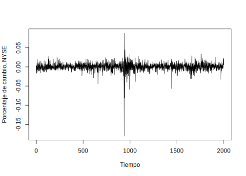
<p class="caption">(\#fig:unnamed-chunk-8)Beneficios por acción trimestrales para la compañía Johnson y Johnson</p>
</div>

\BeginKnitrBlock{example}<div class="example"><span class="example" id="exm:reservas-internacionales"><strong>(\#exm:reservas-internacionales) </strong></span>El archivo *"ReservasInternacionales.xlsx"*, contiene el registro mensual de Reservas Internacionales Venezolanas en millones de dólares ($), iniciando en el mes de enero de 1996 hasta el mes de diciembre de 2017</div>\EndKnitrBlock{example}


```r
library(readxl)
reservas <- read_excel("data/ReservasInternacionales.xlsx")
reservas=ts(reservas,start = 1996,frequency = 12)
plot.ts(reservas[,2], xlab="Año",ylab="Monto",
        main="Reservas Internacionales de Venezuela (millones $)")
```

<div class="figure" style="text-align: center">

<p class="caption">(\#fig:unnamed-chunk-9)Reservas Internacionales de Venezuela (millones $) 1996-2017</p>
</div>


\BeginKnitrBlock{example}<div class="example"><span class="example" id="exm:precio-petroleo"><strong>(\#exm:precio-petroleo) </strong></span>El archivo *"PreciosPetroleoVzla.xlsx"* contiene el precio promedio mensual de venta para el petróleo venezolano (en dólares) desde enero 2006 hasta noviembre 2017</div>\EndKnitrBlock{example}


```r
library(readxl)
petroleo <- read_excel("data/PreciosPetroleoVzla.xlsx")
petroleo=ts(petroleo,start = 2006,frequency = 12)
plot.ts(petroleo[,2], xlab="Año",ylab="Monto",
        main="Precio promedio del petróleo venezolano (en dolares $)")
```

<div class="figure" style="text-align: center">

<p class="caption">(\#fig:unnamed-chunk-10)Precio promedio del petróleo venezolano (en dolares $) 2006-2017</p>
</div>


\BeginKnitrBlock{example}<div class="example"><span class="example" id="exm:indice-dow-jones"><strong>(\#exm:indice-dow-jones) </strong></span>El archivo *"IndiceDowJones.xlsx"* contiene los valores histórico del Índice Dow-Jones desde enero de 1930 hasta octubre de 2017. En el archivo podems notar que desde enero de 1930 hasta diciembre de 1994, los registros son el promedio semanal, a partir de enero de 1995, los registros son diarios. La primera columa es la fecha, la segunda columna es el valor de apertura, la tercera columna el valor máximo, la cuarta el valor mínimo, la quinta el último valor del índice o valor de cierre y la sexta columna es el volumen de acciones.</div>\EndKnitrBlock{example}


```r
DJ=read_excel("data/IndiceDowJones.xlsx")
DJ=ts(DJ)
plot.ts(DJ[,-1], xlab="Días", 
        main="Índice Dow-Jones desde enero 1930 hasta octubre 2017")
```

<div class="figure" style="text-align: center">
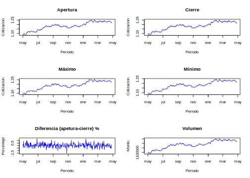
<p class="caption">(\#fig:unnamed-chunk-11)Índice Dow-Jones desde enero 1930 hasta octubre 2017</p>
</div>


\BeginKnitrBlock{example}<div class="example"><span class="example" id="exm:Bolsa-Valores-New-York"><strong>(\#exm:Bolsa-Valores-New-York) </strong></span>La figura siguiente muestra los porcentajes de cambio diario de la Bolsa de Valores de New York desde el 2 de febrero de 1984 hasta el 31 de diciembre de 1991. Como se ve hay una caída fuerte, esta ocurrió el 19 de octubre de 1987 en $t=938$. El archivo de datos es *"nyse.txt"*.</div>\EndKnitrBlock{example}


```r
NYSE=ts(scan("data/nyse.txt"))
plot(NYSE,xlab="Tiempo",ylab="Porcentaje de cambio, NYSE")
```

<div class="figure" style="text-align: center">

<p class="caption">(\#fig:unnamed-chunk-12)Porcentaje de cambio de la bolsa de New York</p>
</div>

\BeginKnitrBlock{example}<div class="example"><span class="example" id="exm:euribor"><strong>(\#exm:euribor) </strong></span>La evolución del EURIBOR es algo que fluctúa a diario. Se entiende por EURIBOR (Euro Interbank Offered Rate) el tipo de interés, promovido por el Instituto Europeo de Mercados Monetarios (EMMI), consistente en la media aritmética simple de los valores diarios con días de mercado para operaciones de depósitos en euros a plazo de uno/tres/seis/doce meses y referido al día quince del mes anterior al comienzo de cada período de interés o al día siguiente hábil si aquel no lo fuese, calculado a partir del ofertado por una muestra de Bancos para operaciones entre entidades de similar calificación.

A continuación mostramos dos series del EURIBOR. La primera es la evolución histórica anual del EURIBOR desde su implantación en 1999 hasta 2018, los datos se corresponden al mes de enero de cada año. La segunda es la evolución mensual desde enero de 2007 hasta marzo de 2018.</div>\EndKnitrBlock{example}


```r
EURIBORa<-read_excel("data/EURIBOR-anual.xlsx")
plot(EURIBORa,type="l", col = "blue", xlab = "Periodo", 
     main="Serie EURIBOR anual (1999-2018)")
grid(col = "gray")
```

<div class="figure" style="text-align: center">

<p class="caption">(\#fig:unnamed-chunk-13)Evolución anual del EURIBOR (1999-2018)</p>
</div>


```r
EURIBORm<-read_excel("data/EURIBOR-mensual.xlsx")
EURIts<-ts(EURIBORm[,2],start = 2007, frequency = 12)
plot.ts(EURIts,xlab = "Periodo", col = "blue", 
        main="Serie EURIBOR mensual (enero 2007- marzo 2018)")
grid(col = "gray")
```

<div class="figure" style="text-align: center">

<p class="caption">(\#fig:unnamed-chunk-14)Evolución mensual del EURIBOR (2007-2018)</p>
</div>

\BeginKnitrBlock{example}<div class="example"><span class="example" id="exm:cambio-dolar-euro"><strong>(\#exm:cambio-dolar-euro) </strong></span>El archivo *Cambio-EUR-USD.xlsx* contiene el histórico de la cotización dolar estadounidense versus el euro desde el 01/05/2017 hasta el 26/04/2018. En la primera columna se muestra la fecha, la segunda columna el precio de apertura, la tercera el precio de cierre, la cuarta la diferencia en %, la quinta el precio máximo del día, la sexta el precio mínimo y la utlima el volumen de transacciones. A continuación presentamos los gráficos de apertura, cierre, máximo y mínimo.</div>\EndKnitrBlock{example}


```r
Cambio<-read_excel("data/Cambio-EUR-USD.xlsx")
par(mfrow=c(3,2))
plot(Cambio$Fecha,Cambio$Apertura, col="blue", type = "l",
     xlab = "Periodo", ylab = "Cotizacion",
     main = "Apertura")
plot(Cambio$Fecha,Cambio$Cierre, col="blue", type = "l",
     xlab = "Periodo", ylab = "Cotizacion",
     main = "Cierre")
plot(Cambio$Fecha,Cambio$Máximo, col="blue", type = "l",
     xlab = "Periodo", ylab = "Cotizacion",
     main = "Máximo")
plot(Cambio$Fecha,Cambio$Mínimo, col="blue", type = "l",
     xlab = "Periodo", ylab = "Cotizacion",
     main = "Mínimo")
plot(Cambio$Fecha,Cambio$`Dif.%`, col="blue", type = "l",
     xlab = "Periodo", ylab = "Porcentaje",
     main = "Diferencia (apetura-cierre) %")
plot(Cambio$Fecha,Cambio$Volumen, col="blue", type = "l",
     xlab = "Periodo", ylab = "Monto",
     main = "Volumen")
```

<div class="figure" style="text-align: center">
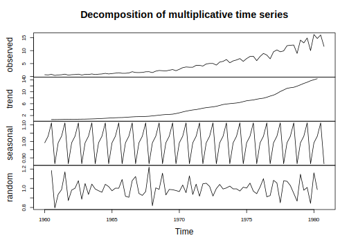
<p class="caption">(\#fig:unnamed-chunk-15)Histórico de cambio del USD vs. EUR (01/05/2017 al 26/04/2018)</p>
</div>


### Clasificación de las series de tiempo

Como se ha mostrado en los ejemplos anteriores, hay una amplia variedad de series de tiempo que pueden clasificarse en varias categorías desde varios puntos de vista. 


- **Series de tiempo continuas y discretas**. 
Los datos registrados continuamente, por ejemplo, por un dispositivo analógico, se denominan series de tiempo continuas. Por otra parte, los datos observados en ciertos intervalos de tiempo, como la presión atmosférica medida cada hora, se denominan series de tiempo discretas. Existen dos tipos de series de tiempo discretas: una en la que las observaciones de los datos se realizan a intervalos de igual espaciamiento y otra en la que las observaciones de los datos se realizan a intervalos de espaciamiento desigual. Aunque las series de tiempo mostradas en los ejemplos anteriores están conectadas continuamente por líneas sólidas, todas ellas son series de tiempo discretas. A partir de ahora en este libro, consideramos sólo series de tiempo discretas registradas a intervalos igualmente espaciados, porque las series de tiempo que analizamos en ordenadores digitales son generalmente series de tiempo discretas.


- **Series de tiempo univariadas y multivariadas**. Las series de tiempo que consisten en una sola observación en cada punto temporal, como se muestran en los ejemplos 1.1, 1.2, 1.3 y 1.5, se denominan series de tiempo univariadas. Por otra parte, las series de tiempo que se obtienen grabando simultáneamente 
dos o más fenómenos como los ilustrados en el ejemplo 1.4 se denominan series de tiempo multivariadas. Sin embargo, puede ser difícil distinguir entre series de tiempo univariadas y multivariadas desde su naturaleza; más bien, la distinción se hace desde el punto de vista del analista y por varios otros factores, como la restricción de la medición y los conocimientos empíricos o teóricos sobre el tema. Desde el punto de vista del modelado estadístico, la selección de variables en sí misma es un problema importante en el análisis de series de tiempo.


- **Series de tiempo estacionarias y no estacionarias**. Una serie de tiempo es un registro de un fenómeno que varía irregularmente con el tiempo. En el análisis de series de tiempo, las series de tiempo de variación irregular se expresan generalmente mediante modelos estocásticos. En algunos casos, un fenómeno aleatorio puede ser considerado como la realización de un modelo estocástico con una estructura de variación temporal. Estas series de tiempo se denominan series de tiempo estacinarias. El ejemplo 1.5 es un ejemplo típico de una serie de tiempo estacionaria. Por otra parte, si la estructura estoc?stica de una serie de tiempo cambia con el tiempo, se denomina serie de tiempo no estacionaria. Como ejemplos típicos de series de tiempo no estacionarias, considere la serie en los ejemplos 1.1 a 1.4 . Se puede observar que los valores medios cambian a lo largo del tiempo.


- **Series de tiempo gaussianas y no gaussianas**. Cuando una distribución de una serie de tiempo sigue una distribución normal, la serie de tiempo se denomina serie de tiempo gaussiana; de lo contrario, se denomina serie de tiempo no gausiana. La mayoría de los modelos considerados en este libro son modelos gaussianos, asumiendo que las series de tiempo siguen distribuciones gaussianas. Al igual que en el caso del ejemplo 1.3, el patrón de las series de tiempo es a veces asimétrico, de modo que la distribución marginal no puede considerarse gaussiana. Incluso en tal situación, podemos obtener una serie de tiempo gaussiana aproximada mediante una transformación de datos apropiada. 


- **Series de tiempo lineales y no lineales**. Una serie de tiempo expresable como la salida de un modelo lineal se denomina serie de tiempo lineal. Por el contrario, la salida de un modelo no lineal se denomina serie de tiempo no lineal.


- **Datos faltantes y valores atípicos**. En el modelado de series de tiempo de problemas del mundo real, a veces necesitamos tratar con observaciones faltante y valores atípicos. Algunos valores de las series de tiempo que no se han registrado por algunas razones se denominan observaciones que faltan en las series de tiempo. Los valores atípicos (observaciones exteriores) pueden ocurrir debido al comportamiento extraordinario del objeto, mal funcionamiento del dispositivo de observación o errores en el registro. En los datos de los ejemplos 1.4 y 1.5 se pueden observar datos atípicos. En el ejemplo 1.4 podemos notar caídas en los índices del DowJones y en el ejemplo 1.4 podemos notar una fuerte caída en el porcentaje de cambio de diario ocurrido el 19 de octubre de 1987.

## Componentes de una serie de tiempo

El análisis clásico de las series de tiempo se basa en la suposición de que los valores que toma la variable de observación es la consecuencia de tres componentes, cuya actuación conjunta da como resultado los valores medidos, estos componentes son:

1) **Componente de tendencia**. Se puede definir como un cambio a largo plazo que se produce en la relación al nivel medio, o el cambio a largo plazo de la media. La tendencia se identifica con un movimiento suave de la serie a largo plazo.

2) **Componente estacional**. Muchas series de tiempo presentan cierta periodicidad o dicho de otro modo, variación de cierto período (semestral, mensual, etc.). Por ejemplo las Ventas al Detalle en Puerto Rico aumentan por los meses de noviembre y diciembre por las festividades navideñas. Estos efectos son fáciles de entender y se pueden medir explícitamente o incluso se pueden eliminar de la serie de datos, a este proceso se le llama desestacionalización de la serie.

3) **Componente aleatoria**. Esta componente no responde a ningún patrón de comportamiento, sino que es el resultado de factores fortuitos o aleatorios que inciden de forma aislada en una serie de tiempo.


De los tres componentes anteriores los dos primeros son componentes determinísticos, mientras que la última es aleatoria. 

Los modelos que se utilizan con más frecuencia son:

- **Modelo aditivo**: $X_t=T_t+E_t+\epsilon_t$

- **Modelos multiplicativos**:

    - *Puro*: $X_t = T_t\times E_t\times\epsilon_t$
  
    - *Mixto*: $X_t = T_t\times E_t+\epsilon_t$ 

La elección de uno de estos modelos se hará de manera que el modelo seleccionado sea capaz de agrupar las principales características observadas en el gráfico de la serie en estudio.

### El Modelo Aditivo de Componentes de Series de Tiempo

Dada una serie $X_t, t=1,\ldots,n$, el *Modelo Aditivo de Componentes* consiste en asumir que $X_t$ se puede descomponer en tres componentes:
\begin{equation}
X_t = T_t+E_t+\epsilon_t
(\#eq:eq-modelo-aditivo)
\end{equation}

donde $T_t$ es la componente de tendencia, $E_t$ es la componente estacional y $\epsilon_t$ es la componente aleatoria o de errores. Las componentes $T_t$ y $E_t$ son funciones de $t$ determinísticas. Su evolución es perfectamente predecible.

Este modelo es apropiado cuando la magnitud de la fluctuaciones estacionales de la serie no varía al hacerlo la tendencia.

La componente $T_t$ en algunos casos también puede ser una componente estacional, pero de baja frecuencia, o, equivalentemente, una componente con período muy grande. Por ejemplo, en una serie diaria, $E_t$ puede tener período 30 días, y $T_t$ período 360 días.

En la Figura \ref{grafica-tema3-modelo-aditivo} se muestra la idea de la descomposición. Al superponer las series en los gráficos (a), (b) y (c) se obtiene la serie en el gráfico (d).


<div class="figure" style="text-align: center">

<p class="caption">(\#fig:unnamed-chunk-16)Modelo aditivo de series de tiempo</p>
</div>

Asumiendo el modelo aditivo, el análisis de series de tiempo consiste en modelar y estimar $T_t$ y $E_t$ y luego extraerlas de $X_t$ para obtener $\hat{\epsilon}_t = X_t - \hat{T}_t - \hat{E}_t$. La serie $\hat{\epsilon}_t$ se modela y estima para finalmente reconstruir $X_t$, $\hat{X}_t = \hat{T}_t+\hat{E}_t+\hat{\epsilon}_t$, y poder realizar el pronóstico $\hat{X}_{t+h}=\hat{T}_{t+h}+\hat{E}_{t+h}+\hat{\epsilon}_{t+h}$, utilizando la información disponible $X_t,\ldots,X_n$ con $h=1,2,\ldots,m$. Sin embargo, puede suceder que la serie $\hat{\epsilon}_t$ sea incorrelacionada, es decir, $Corr(\hat{\epsilon}_t,\hat{\epsilon}_{t+s}) = 0$, para $s\neq0$. En este caso $\hat{\epsilon}_{t+h}=0$ para todo $h>0$.

En **R** podemos descomponer una serie de tiempo usando la función *stl()* o la función *decompose()*. Retomando la serie de beneficios trimestrales de las acciones de Johnson y Johnson (Ejemplo \@ref(exm:ejem-beneficios-acciones)) podemos observar la descomposición de la misma. En la parte superior de la gráfica se observa la serie original, en el gráfico siguiente la estacionalidad, en el tercero la tendencia y en el gráfico inferior los residuales.


```r
plot(decompose(jj, type = "additive", filter = NULL))
```

<div class="figure" style="text-align: center">

<p class="caption">(\#fig:unnamed-chunk-17)Descomposición aditiva de la serie Johnson y Johnson</p>
</div>

La función *stl()* es más sofisticada que *decompose()*, la misma usa la descomposición de estacionalidad y tendencia de Loess (Seasonal and Trend decomposition using Loess) el cual es un método robusto y versátil para la descomposición de series de tiempo. El método STL fue desarrollado por Cleveland et al. (1990). A continuación mostramos la misma serie de beneficios de acciones de Johnson y Johnson usando esta función.


```r
plot(stl(jj,s.window="periodic"), col="blue",
     main="Descomposicion de la serie Johnson y Johnson")
```

<div class="figure" style="text-align: center">

<p class="caption">(\#fig:unnamed-chunk-18)Descomposición de la serie Johnson y Johnson usando la descomposición de Loess (STL)</p>
</div>

### El Modelo Multiplicativo de Componentes de Series de Tiempo

Dada una serie de tiempo $X_t,t=1,\ldots,n$, el *Modelo Multiplicativo de Componentes* consiste en asumir que $X_t$ se puede descomponer de una de las siguientes maneras:

- *Puro*:
\begin{equation}
X_t = T_t\times E_t\times\epsilon_t
(\#eq:eq-modelo-multiplicativo-puro)
\end{equation}

- *Mixto*:
\begin{equation}
X_t = T_t\times E_t+\epsilon_t
(\#eq:eq-modelo-multiplicativo-mixto)
\end{equation}

donde $T_t$ es la componente de tendencia, $E_t$ es la componente estacional y $\epsilon_t$ es la componente aleatoria o de errores. Estos modelos son apropiados cuando la magnitud de las fluctuaciones estacionales de la serie crece y decrece proporcionalmente con los crecimientos y decrecimientos de la tendencia respectivamente.

Usamos la misma función *decompose()* para realizar la descomposición multiplicativa de la serie de tiempo, para ello en 'type' cambiamos "additive" por "multiplicative"


```r
plot(decompose(jj, type = "multiplicative", filter = NULL))
```

<div class="figure" style="text-align: center">

<p class="caption">(\#fig:unnamed-chunk-19)Descomposición multiplicativa de la serie Johnson y Johnson</p>
</div>


<!--chapter:end:100-introduction.Rmd-->

# Características de series de tiempo

El objetivo primario en el análisis de Series de Tiempo es desarrollar modelos matemáticos que provean una descripción apropiada para los datos muestrales, como los vistos en los ejemplos del capítulo anterior. Así, lo primero que hacemos es utilizar la definición \@ref(def:defi-serie-tiempo), para tener un soporte estadístico. En este capítulo daremos algunas definiciones que serán de uso general en todo el resto del libro, también se describiran algunos métodos para el análisis exploratorio de las series de tiempo

## Medidas de dependencia para series de tiempo

\BeginKnitrBlock{definition}<div class="definition"><span class="definition" id="def:defi-proceso-estocastico"><strong>(\#def:defi-proceso-estocastico) </strong></span>Un **proceso estocástico** es una familia de variables aleatorias indexadas $x(\omega,t)$ ó $x_t(\omega)$ donde $t$ pertenece a un conjunto de índices $T$ y $\omega$ pertenece a un espacio muestral $\Omega$. Si $t=t^*$ fijo, $x(\omega,t^*)$ es una variable aleatoria. Si $\omega=\omega^*$ fijo, $x(\omega^*,t)$ es una función de $t$, y se llama una *realización* del proceso. Una **serie de tiempo** es la realización de un proceso estocástico.
</div>\EndKnitrBlock{definition}

---

Una descripción completa de una serie de tiempo, observada como una colección de $n$ variables aleatorias en puntos de tiempo enteros arbitrarios $t_1,t_2,\ldots,t_n$, para cada entero positivo $n$, es proporcionada por la función de distribución conjunta, evaluada como la probabilidad de que los valores de la serie sean conjuntamente menor que $n$ constantes $c_1,c_2,\ldots,c_n$, esto es

\begin{equation}
F(c_1,c_2,\ldots,c_n)=P(x_{t_1}\leq c_1,x_{t_2}\leq c_2,\ldots,x_{t_n}\leq c_n).
(\#eq:eq-distribucion-conjunta)
\end{equation}
Desafortunadamente, la función de distribución multidimensional usualmente no se puede escribir fácilmente a menos que las variables aleatorias tengan distribución normal conjunta, en cuyo caso, la ecuación \@ref(eq:eq-distribucion-conjunta) llega a ser la distribución normal multivariada usual.

Un caso particular en la cual la función de distribución multidimensional es fácil de escribir, será en el caso de variables aleatorias normal estándar independientes e idénticamente distribuidas, para lo cual la función de distribución se puede expresar como el producto de las distribuciones marginales, es decir,
\begin{equation}
F(c_1,c_2,\ldots,c_n)=\prod_{t_1}^{n}\Phi(c_t)
(\#eq:eq-distribucion-producto-marginal)
\end{equation}
donde
\begin{equation}
\Phi(x)=\frac{1}{\sqrt{2\pi}}\int_{-\infty}^{x}\mathbb{E}xp\left\{-\frac{z^2}{2}\right\}dz(\#eq:eq-distribucion-normal)
\end{equation}
es la función de distribución normal estándar acumulada.

Aunque la función de distribución multidimensional describa los datos completamente, esto es un instrumento poco manejable para mostrar y analizar datos de series de tiempo. La función de distribución \@ref(eq:eq-distribucion-conjunta) debe ser evaluada como una función de $n$ argumentos, entonces cualquier graficación de las  correspondientes funciones de densidad multivariante es prácticamente imposible. La función de distribución unidimensional
$$F_t(x)=P\{x_t\leq x\}$$
o la correspondiente función de densidad unidimensional
$$f_t(x)=\frac{\partial F_t(x)}{\partial x},$$
cuando existen, a menudo son más útiles para determinar si una coordenada en particular de la serie de tiempo tiene una función de densidad conocida, como la distribución  normal (gaussiana), por ejemplo.


\BeginKnitrBlock{definition}<div class="definition"><span class="definition" id="def:defi-funcion-media"><strong>(\#def:defi-funcion-media) </strong></span>La **función de media** es definida como

\begin{equation}
\mu_{xt}=\mathbb{E}(x_t)=\int_{-\infty}^{\infty}xf_t(x)dx,
(\#eq:eq-funcion-media)
\end{equation}

en caso de que exista, donde $\mathbb{E}$ denota el operador usual de esperanza. Cuando no haya confusión sobre a que serie de tiempo nos referimos, escribiremos $\mu_{xt}$ como $\mu_t$.
</div>\EndKnitrBlock{definition}

---

Lo importante de comprender sobre $\mu_t$ consiste en que es una media teórica para la serie de tiempo en un punto particular, donde la media se asume o calcula sobre todos los posibles eventos que podrían haber producido $x_t$.

\BeginKnitrBlock{definition}<div class="definition"><span class="definition" id="def:defi-funcion-autocovarianza"><strong>(\#def:defi-funcion-autocovarianza) </strong></span>La **función de autocovarianza** es definida como producto del segundo momento
\begin{equation}
\gamma_x(s,t)=\mathbb{E}[(x_s-\mu_s)(x_t-\mu_t)],
(\#eq:eq-funcion-autocovarianza)
\end{equation}
para todo $t$ y $s$. cuando no haya confusión en la existencia sobre a que serie nos referimos, escribiremos $\gamma_x(s,t)=\gamma(s,t)$.
</div>\EndKnitrBlock{definition}

---

Note que $\gamma_x(s,t)=\gamma_x(t,s)$ para todo los puntos $s$ y $t$. La función de autocovarianza mide la dependencia lineal entre dos puntos de la misma serie en diferentes tiempos. La autocovarianza \@ref(eq:eq-funcion-autocovarianza) es el promedio de los productos cruzados relacionado con la densidad conjunta $F(x_s,x_t)$. Es claro que, para $s=t$, la autocovarianza se reduce a la varianza (en el caso finito), dado que
\begin{equation}
\gamma_x(t,t)=\mathbb{E}[(x_t-\mu_t)^2]
(\#eq:eq-funcion-autocovarianza-varianza)
\end{equation}


Otro función de medida de tendencia importante es la *función de autocorrelación*.

\BeginKnitrBlock{definition}<div class="definition"><span class="definition" id="def:defi-acf"><strong>(\#def:defi-acf) </strong></span>La **función de autocorrelación (ACF)** (ACF, siglas en ingles: Autocorrelation Function) se define como
\begin{equation}
\rho(s,t)=\frac{\gamma(s,t)}{\sqrt{\gamma(s,s)\gamma(t,t)}}
(\#eq:eq-funcion-autocorrelacion)
\end{equation}
</div>\EndKnitrBlock{definition}

---

La $ACF$ mide la predictibilidad lineal de una serie de tiempo en tiempo $t$, digamos $x_t$ usando solo el valor $x_s$. Es fácil de demostrar que $-1\leq\rho(s,t)\leq1$ usando la desigualdad de Cauchy-Schwarz [^nota1]

[^nota1]:Note que la desigualdad de Cauchy-Schwartz implica $|\gamma(s,t)|^2\leq\gamma(s,s)\gamma(t,t)$.}. 

Si podemos predecir $x_t$ exactamente de $x_s$ a través de la relación lineal $x_t=\beta_0+\beta_1x_s$ entonces la correlación será 1 cuando $\beta_1>0$ y $-1$ cuando $\beta_1<0$.

\BeginKnitrBlock{definition}<div class="definition"><span class="definition" id="def:defi-covarianza-cruzada"><strong>(\#def:defi-covarianza-cruzada) </strong></span>La **función de covarianza cruzada** entre dos series $x_t$ y $y_t$ se define como
\begin{equation}
\gamma_{xy}(s,t)=\mathbb{E}[(x_s-\mu_{xs})(y_t-\mu_{yt})]
(\#eq:eq-funcion-covarianza-cruzada)
\end{equation}
</div>\EndKnitrBlock{definition}

---

\BeginKnitrBlock{definition}<div class="definition"><span class="definition" id="def:defi-ccf"><strong>(\#def:defi-ccf) </strong></span>La **función de correlación cruzada (CCF)** (CCF, siglas en ingles: Cross Correlation Function) es definida como
\begin{equation}
\rho_{xy}(s,t)=\frac{\gamma_{xy}(s,t)}{\sqrt{\gamma_x(s,s)\gamma_y(t,t)}}
(\#eq:eq-funcion-correlacion-cruzada)
\end{equation}
</div>\EndKnitrBlock{definition}

---

Las definiciones anteriores de funciones de media y varianza son completamente generales. Aunque nosotros no hayamos hecho ninguna suposición especial sobre el comportamiento de las series de tiempo, muchos de los ejemplos precedentes han insinuado que puede existir una especie de regularidad en el comportamiento de las mismas. Introducimos la noción de regularidad que usa el concepto de *estacionaridad*, que ya hemos introducido empíricamente en el apartado 1.2.1 "Clasificación de las series de tiempo"

Formalmente tenemos las siguientes definiciones de estacionaridad

\BeginKnitrBlock{definition}<div class="definition"><span class="definition" id="def:defi-estricta-estacionaridad"><strong>(\#def:defi-estricta-estacionaridad) </strong></span>Una serie de tiempo **estrictamente estacionaria** es una serie para la cual el comportamiento probabilístico de cada sucesión de valores
$$\{x_{t_1},x_{t_2},\ldots,x_{t_k}\}$$
es idéntico a la serie trasladada en el tiempo
$$\{x_{t_1+h},x_{t_2+h},\ldots,x_{t_k+h}\}$$
Esto es,
\begin{equation}
P[X_{t_1}\leq c_1,\ldots,x_{t_k}\leq c_k] = P[X_{t_1+h}\leq c_1,\ldots,x_{t_k+h}\leq c_k]
(\#eq:eq-estricta-estacionaridad)
\end{equation}
para todo $k=1,2,\ldots$, todo puntos de tiempos $t_1,t_2,\ldots,t_k$ y números $c_1,c_2,\ldots,c_k$ y todo salto $h=\pm0,\pm1,\pm2,\ldots$.
</div>\EndKnitrBlock{definition}

---

Esta definición de estacionaridad es muy fuerte para la mayoría de las aplicaciones prácticas. Por ello necesitamos una versión menos fuerte que imponga menos condiciones sobre las distribuciones de probabilidad, ya que si observamos bien la ecuación \@ref(eq:eq-estricta-estacionaridad), lo que nos dice la misma es que todas las posibles distribuciones de probabilidad deben ser iguales, lo que como ya indicamos en la práctica es muy difícil de comprobar aún para conjuntos de datos sencillos. La siguiente versión de estacionaridad solo impone condiciones sobre los dos primeros momentos de la serie

\BeginKnitrBlock{definition}<div class="definition"><span class="definition" id="def:defi-debilmente-estacionaria"><strong>(\#def:defi-debilmente-estacionaria) </strong></span>Una serie de tiempo **débilmente estacionaria** $x_t$, es un proceso de varianza finita tal que

1) la función de media $\mu_t$ es constante y no depende del tiempo $t$, 

2) la función de covarianza $\gamma(t,s)$ depende solo de las diferencias de $s$ y $t$, $|t-s|$.

Por consiguiente, usaremos el término **estacionaridad** para referirnos a estacionaridad débil; si un proceso es estacionario en el sentido estricto usaremos el término *estrictamente estacionario*.
</div>\EndKnitrBlock{definition}

---

\BeginKnitrBlock{remark}<div class="remark">\iffalse{} <span class="remark"><em>Nota. </em></span>  \fi{}
1)  Si una serie de tiempo es estrictamente estacionaria, entonces todos las funciones de distribución multivariadas para subconjuntos de variables deben coincidir con sus contrapartes en el conjunto trasladado, para todos los valores del parámetro $h$. Por ejemplo para $k=1$ La ecuación \@ref(eq:eq-estricta-estacionaridad) implica que
\begin{equation}
        P\{x_s\leq c\}=P\{x_t\leq c\}
(\#eq:e1p20)
\end{equation}
para cada puntos $s$ y $t$.
  Esta declaración implica, por ejemplo, que si la probabilidad de un valor de una serie de tiempo muestreada cada hora es negativa a la 1:00a.m, la probabilidad a la 10:00a.m. es la misma. Además, si la función de media, $\mu_t$ de la serie $x_t$ existe, \@ref(eq:e1p20) implica que $\mu_s=\mu_t$ para todo $s$ y $t$, y por consiguiente $\mu_t$ debe ser constante. 

2) Cuando $k=2$, podemos escribir la ecuación \@ref(eq:eq-estricta-estacionaridad) como
\begin{equation}
  P\{x_s\leq c_1,x_t\leq c_2\}=P\{x_{s+h}\leq c_1,x_{t+h}\leq c_2\}
(\#eq:e1p21)
\end{equation}
para cada par de puntos $s$ y $t$ y salto $h$. Entonces, si la función de varianza del proceso existe, \@ref(eq:e1p21) implica que la función de autocovarianza de la serie $x_t$ satisface $\gamma(s,t)=\gamma(s+h,t+h)$ para todos $s$ y $t$ y salto $h$.

Podemos interpretar este resultado diciendo que la función de autocovarianza del proceso depende sólo de las diferencias de tiempo entre $s$ y $t$, y no del tiempo actual.
</div>\EndKnitrBlock{remark}

---

Es claro de la definición \@ref(def:defi-estricta-estacionaridad) de serie estrictamente estacionaria, que una serie de tiempo estrictamente estacionaria con varianza finita, también es una serie estacionaria. El recíproco no es cierto a menos que impongamos condicionaes adicionales. Un importante caso donde estacionaridad implica estricta estacionaridad es el caso de series de tiempo gaussianas.

Ya que la función de media $\mathbb{E}(x_t)=\mu_t$ de una serie de tiempo estacionaria es independiente del tiempo $t$, escribimos
\begin{equation}
\mu_t=\mu
(\#eq:e1p22)
\end{equation}

Debido a que la función de covarianza de una serie de tiempo estacionaria, $\gamma(s,t)$ en tiempos $s$ y $t$ depende sólo de la diferencia $|s-t|$, podemos simplificar la notación. Sea $s=t+h$, donde $h$ representa el tiempo de traslación o salto, entonces
\begin{eqnarray}
\gamma(s,t)&=&\mathbb{E}[(x_{t+h}-\mu)(x_t-\mu)]\\ \nonumber
	&=&\mathbb{E}[(x_h-\mu)(x_0-\mu)]\\
	&=&\gamma(h,0) \nonumber
	(\#eq:eq-funcion-covarianza-estacionaria)
\end{eqnarray}
no depende del argumento de tiempo $t$; asumiendo que $\text{Var}(x_t)=\gamma(0,0)<\infty$. De ahora en adelante, por conveniencia, prescindiremos del segundo argumento de $\gamma(h,0)$, es decir, la función de covarianza se denotará $\gamma(h)$.

\BeginKnitrBlock{definition}<div class="definition"><span class="definition" id="def:defi-autocovarianza-serie-estacionaria"><strong>(\#def:defi-autocovarianza-serie-estacionaria) </strong></span>La **función de autocovarianza de una serie de tiempo estacionaria** se escribirá como
\begin{equation}
\gamma(h)=\mathbb{E}[(x_{t+h}-\mu)(x_t-\mu)]
(\#eq:eq-funcion-autocovarianza-estacionaria)
\end{equation}
</div>\EndKnitrBlock{definition}

---

\BeginKnitrBlock{definition}<div class="definition"><span class="definition" id="def:defi-acf-estacionaria"><strong>(\#def:defi-acf-estacionaria) </strong></span>La **función de autocorrelación (ACF) de una serie de tiempo estacionaria** será escrita, usando \@ref(eq:eq-funcion-autocorrelacion) como
\begin{equation}
\rho(h)=\frac{\gamma(t+h,t)}{\sqrt{\gamma(t+h,t+h)\gamma(t,t)}}=\frac{\gamma(h)}{\gamma(0)}
(\#eq:eq-funcion-autocorrelacion-estacionaria)
\end{equation}
</div>\EndKnitrBlock{definition}

---

La desigualdad de Cauchy-Schwartz muestra nuevamente que $-1\leq\rho(h)\leq1$ para todo $h$.

** Propiedades de la función de covarianza**

1) Para el valor en $h=0$, la función de autocovarianza
    \begin{equation}
    \gamma(0)=\mathbb{E}[(x_t-\mu)^2]
    (\#eq:eq-funcion-autocovarianza-h0)
    \end{equation}
    es la varianza de la serie de tiempo; note que la desigualdad de Cauchy-Schwartz implica que $|\gamma(h)|\leq\gamma(0)$.
    
2) La autocovarianza de una serie estacionaria es simétrica respecto al origen, esto es
    \begin{equation}
    \gamma(h)=\gamma(-h)
    (\#eq:eq-simetria-funcion-autocovarianza)
    \end{equation}
    para todo $h$. Esta propiedad se debe a que trasladar la serie por $h$ significa que
    \begin{eqnarray*}
    \gamma(h)&=&\gamma(t+h-t)\\
        &=&\mathbb{E}[(x_{t+h}-\mu)(x_t-\mu)]\\
        &=&\mathbb{E}[(x_t-\mu)(x_{t+h}-\mu)]\\
        &=&\gamma(t-(t+h))\\
        &=&\gamma(-h)
    \end{eqnarray*}
    lo cual muestra como usar la notación para demostrar el resultado.


\BeginKnitrBlock{definition}<div class="definition"><span class="definition" id="def:defi-conjuntamente-estacionarias"><strong>(\#def:defi-conjuntamente-estacionarias) </strong></span>Dos series de tiempo $x_t$ y $x_s$ se dice que son **conjuntamente estacionarias** si cada una de ellas es estacionaria y la función de correlación cruzada
\begin{equation}
\gamma_{xy}(h)=\mathbb{E}[(x_{t+h}-\mu_x)(y_t-\mu_y)]
(\#eq:eq-estacionaridad-conjunta)
\end{equation}
es una función sólo del salto $h$.
</div>\EndKnitrBlock{definition}

---

\BeginKnitrBlock{definition}<div class="definition"><span class="definition" id="def:defi-ccf-conjuntamente-estacionarias"><strong>(\#def:defi-ccf-conjuntamente-estacionarias) </strong></span>La **función de correlación cruzada (CCF)** de dos series conjuntamente estacionarias $x_t$ y $y_t$ se define como
\begin{equation}
\rho_{xy}(h)=\frac{\gamma_{xy}(h)}{\sqrt{\gamma_x(0)\gamma_y(0)}}
(\#eq:eq-ccf-conjuntamente-estacionarias)
\end{equation}
</div>\EndKnitrBlock{definition}

---

De nuevo, tenemos el resultado $-1\leq\rho_{xy}(h)\leq1$ lo cual nos permite comparar los valores extremos -1 y 1 cuando vemos la relación entre $x_{t+h}$ y $y_t$. La función de correlación cruzada satisface
\begin{equation}
\rho_{xy}(h)=\rho_{yx}(-h)
(\#eq:eq-simetria-ccf-conjuntamente-estacionarias)
\end{equation}
lo cual se puede demostrar de manera similar que para \@ref(eq:eq-simetria-funcion-autocovarianza).

\BeginKnitrBlock{example}\iffalse{-91-69-115-116-97-99-105-111-110-97-114-105-100-97-100-32-99-111-110-106-117-110-116-97-93-}\fi{}<div class="example"><span class="example" id="exm:ejem-estacionaridad-conjunta"><strong>(\#exm:ejem-estacionaridad-conjunta)  \iffalse (Estacionaridad conjunta) \fi{} </strong></span>Considere las series $x_t$ y $y_t$ formadas por las sumas y diferencias de dos valores sucesivos de un ruido blanco respectivamente, esto es
$$x_t=w_t+w_{t-1}$$
y
$$y_t=w_t-w_{t-1}$$
donde $w_t$ son variables aleatorias independientes con media cero y varianza $\sigma_w^2$. Es fácil demostrar que $\gamma_x(0)=\gamma_y(0)=2\sigma_w^2$ y $\gamma_x(1)=\gamma_x(-1)=\sigma_w^2$, $\gamma_y(1)=\gamma_y(-1)=-\sigma_w^2$. También
\begin{eqnarray*}
\gamma_{xy}(1)&=&\mathbb{E}[(x_{t+1}-0)(y_t-0)]\\
	&=&\mathbb{E}[(w_{t+1}+w_t)(w_t-w_{t-1})]\\
	&=&\sigma_w^2
\end{eqnarray*}
porque solo uno de los productos es distinto de cero.\\
Similarmente, $\gamma_{xy}(0)=0,\gamma_{xy}(-1)=-\sigma_w^2$. Usando (\ref{eq-ccf-conjuntamente-estacionarias}), obtenemos
$$\rho_{xy}(h)=\begin{cases}0,&h=0\\
			1/2,&h=1\\
			-1/2,&h=-1\\
			0,&|h|\geq2\end{cases}.$$
Claramente, las funciones de autocovarianza y correlación cruzada dependen solo del salto $h$, por lo tanto las series son conjuntamente estacionarias.
</div>\EndKnitrBlock{example}

---

El concepto de estacionaridad débil forma la base para muchos de los análisis realizados con series de tiempo. Las propiedades fundamentales de la media \@ref(eq:e1p22) y la función de covarianza \@ref(eq:eq-funcion-autocovarianza-estacionaria) son satisfechas por muchos modelos teóricos que aparecen para generar realizaciones muestrales apropiadas. 


\BeginKnitrBlock{definition}<div class="definition"><span class="definition" id="def:defi-proceso-lineal"><strong>(\#def:defi-proceso-lineal) </strong></span>Un **proceso lineal** $x_t$ se define como una combinación lineal de variables aleatorias de ruido blanco $w_t$, y está dado por
\begin{equation}
x_t=\mu+\sum_{j=-\infty}^{\infty}\psi_jw_{t-j}
(\#eq:eq-proceso-lineal)
\end{equation}
donde los coeficientes satisfacen
\begin{equation}
\sum_{j=-\infty}^{\infty}|\psi_j|<\infty
(\#eq:eq-coeficientes-proceso-lineal)
\end{equation}
</div>\EndKnitrBlock{definition}

---

Para un proceso lineal, podemos demostrar que la función de autocovarianza está dada por
\begin{equation}
\gamma(h)=\sigma_w^2\sum_{j=-\infty}^{\infty}\psi_{j+h}\psi_j
(\#eq:eq-funcion-autocovarianza-proceso-lineal)
\end{equation}
para todo $h\geq0$; recuerde que $\gamma(-h)=\gamma(h)$. Finalmente como mencionamos anteriormente, un caso importante en el cual una serie débilmente estacionaria es también estrictamente estacionaria es la serie normal o gaussiana.


\BeginKnitrBlock{definition}<div class="definition"><span class="definition" id="def:defi-proceso-gaussiano"><strong>(\#def:defi-proceso-gaussiano) </strong></span>Un proceso $\{x_t\}$, se dice que es un **proceso gaussiano** si el $k$-ésimo vector dimensional $\hat{x}=(x_{t_1},x_{t_2},\ldots,x_{t_k})$, para cada conjunto de puntos $t_1,t_2,\ldots,t_k$ y cada entero positivo $k$ tiene distribución normal multivariada.
</div>\EndKnitrBlock{definition}

---

Definiendo $k\times1$ vector de medias $\hat{\mu}=(\mu_{t_1},\mu_{t_2},\ldots,\mu_{t_k})'$ y la $k\times k$ matriz de covarianza positiva como $\Gamma=\{\gamma(t_i,t_j);i,j=1,\ldots,k\}$, la función de densidad normal multivariada se puede escribir como
\begin{equation}
f(\hat{x})=(2\pi)^{-k/2}|\Gamma|^{-1/2}\exp\left\{-\frac{1}{2}(\hat{x}-\hat{\mu})'\Gamma^{-1}(\hat{x}-\hat{\mu})\right\}
(\#eq:eq-densidad-normal-multivariada)
\end{equation}
donde $|\cdot|$ denota el determinante. Esta distribución forma la base para resolver problemas que envuelven inferencia estadística para series de tiempo. Si una serie de tiempo gaussiana $\{x_t\}$ es débilmente estacionaria, entonces $\mu_t=\mu$ y $\gamma(t_i,t_j)=\gamma(|t_i-t_j|)$, de modo que el vector $\hat{\mu}$ y la matriz $\Gamma$ son independientes del tiempo. Este hecho implica que todas las distribuciones finitas, \@ref(eq:eq-densidad-normal-multivariada) de la serie $\{x_t\}$ dependen sólo del salto de tiempo y no del tiempo actual, y por consiguiente la serie debe ser estrictamente estacionaria.


## Estimación de la Tendencia

En esta sección introducimos los métodos para la estimación de la tendencia. En esencia, existen dos métodos para estimar la tendencia y la componente estacional de una serie de tiempo:

* **Método paramétrico**: Se basa en

  + Proponer modelos paramétricos para expresar la relación que guardan la tendencia y la componente estacional con el tiempo.

  + Ajustar dichos modelos a la serie de tiempo (por ejemplo, a través del método de mínimos cuadrados).

  + Aislar la tendencia y la componente estacional por medio
de los modelos ajustados.

* **Método no paramétrico**: Se basa en

  + Asumir "suavidad" en la relación que guardan la tendencia
y la componente estacional con el tiempo.

  + Aislar la tendencia y la componente estacional a través de
la suavización del gráfico de la serie (aplicando, por ejemplo, filtros de promedios móviles).

Hay otros métodos que no consideraremos en este libro, por ejemplo, *wavelets*. En ocasiones la expresión "suavizar una serie" es equivalente a "extracción de la tendencia de una serie", y ambas equivalen a la estimación de la tendencia.

A continuación presentamos una lista de posibles modelos para la tendencia $T_t$:

- Lineal
    \begin{equation}
    T_t=\beta_0+\beta_1t
    (\#eq:eq-modelo-lineal)
    \end{equation}
- Cuadrático
    \begin{equation}
    T_t=\beta_0+\beta_1t+\beta_2t^2
    (\#eq:eq-modelo-cuadratico)
    \end{equation}
- Cúbico
    \begin{equation}
    T_t=\beta_0+\beta_1t+\beta_2t^2+\beta_3t^3
    (\#eq:eq-modelo-cubico)
    \end{equation}
- Exponencial
    \begin{equation}
    T_t=\exp(\beta_0+\beta_1t)
    (\#eq:eq-modelo-exponencial)
    \end{equation}
- Logístico
    \begin{equation}
    T_t=\frac{\beta_2}{1+\beta_1\exp(-\beta_0t)}
    (\#eq:eq-modelo-logistico)
    \end{equation}


En la tendencia cuadrática podemos observar:

- Si $\beta_1,\beta_2>0$, $T_t$ es monótona creciente.
- Si $\beta_1,\beta_2<0$, $T_t$ es monótona decreciente.
- Si $\beta_1>0$ y $\beta_2<0$, $T_t$ es cóncava.
- Si $\beta_1<0$ y $\beta_2>0$, $T_t$ es convexa.


Otro modelo propuesto para la tendencia es el dado por la siguiente definición. 

\BeginKnitrBlock{definition}<div class="definition"><span class="definition" id="def:defi-modelo-log-lineal"><strong>(\#def:defi-modelo-log-lineal) </strong></span>El modelo **Logarítmico Lineal** o **Log-Lineal** se define como
\begin{equation}
\ln X_t = \beta_0+\beta_1t + \epsilon_t
(\#eq:eq-modelo-log-lineal)
\end{equation}
</div>\EndKnitrBlock{definition}

---

El modelo anterior corresponde a un modelo con tendencia lineal para el logaritmo de $X_t$. En \@ref(eq:eq-modelo-log-lineal) al tomar exponencial se tiene $X_t = \exp(\beta_0+\beta_1t + \epsilon_t)$, que es similar al modelo con tendencia exponencial \@ref(eq:eq-modelo-exponencial). Sin embargo, son modelos diferentes y se estiman por métodos diferentes.


Para la estimación de los parámetros $\beta_0,\beta_1,\beta_2$ en los modelos lineales \@ref(eq:eq-modelo-lineal), \@ref(eq:eq-modelo-cuadratico), \@ref(eq:eq-modelo-cubico) y \@ref(eq:eq-modelo-log-lineal) utilizaremos el método de mínimos cuadrados clásico (MCC). En este método los parámetros estimados son aquellos que producen el valor mínimo de la suma de errores cuadrados. Para los modelos \@ref(eq:eq-modelo-exponencial) y \@ref(eq:eq-modelo-logistico) se usa el método de mínimos cuadrados no lineales, que también minimiza la suma de errores cuadrados.

El modelo Log-Lineal \@ref(eq:eq-modelo-log-lineal) es equivalente, algebráicamente, a
$$X_t = \exp(\beta_0 + \beta_1t + \epsilon_t).$$
Sin embargo, este último modelo es no lineal y no coincide con el modelo exponencial,\@ref(eq:eq-modelo-exponencial), $X_t = \exp(\beta_0+\beta_1t)+\epsilon_t$. Es posible estimar por mínimos cuadrados ordinarios el modelo Log-Lineal y utilizar los parámetros estimados $\hat{\beta}_0,\hat{\beta}_1$ como valores iniciales en la estimación del modelo exponencial por mínimos cuadrados no lineales. Pero los parámetros estimados en ambos modelos no necesariamente coinciden.

Aunque la serie tenga una componente estacional $E_t$, $X_t = T_t + E_t + \epsilon_t$, solamente consideramos un modelo de regresión entre $X_t$ y $T_t$, tal que $X_t = T_t + \eta_t$, donde $\eta_t$ es el término de error, de forma que $\eta_t=E_t+\epsilon_t$. Por ejemplo,

1. En el caso lineal $T_t = \beta_0 + \beta_1t$, ajustamos el modelo de regresión lineal: $X_t = \beta_0 + \beta_1t + \eta_t$.
2. En el caso cuadrático $T_t = \beta_0 +\beta_1t+\beta_2t^2$, ajustamos el modelo de regresión cuadrático $X_t = \beta_0+\beta_1t+\beta_2t^2 +\eta_t$. Nótese que en este caso hay que definir una variable explicativa adicional $t^2$.

En general, para que datos de series de tiempo sean estacionarias, es necesario hacer un promedio de productos en el tiempo. Como para datos de serie de tiempo es importante medir la dependencia entre los valores de la serie; al menos, debemos ser capaces de estimar las  autocorrelaciones con precisión. Será difícil medir la dependencia de estos valores si la estructura de dependencia no es regular o si cambia en el tiempo. De ahí, que para realizar cualquier análisis estadístico significativo de datos de series de tiempo, será crucial que las funciones de media y  autocovarianza satisfagan las condiciones de estacionaridad dadas en la Definición \@ref(def:defi-debil-estacionaria). A menudo, este no es el caso, y en esta sección daremos algunos métodos para lidiar con los efectos de no-estacionaridad sobre las propiedades estacionarias de las series a estudiar.


Quizás la forma más fácil de trabajar con series no-estacionarias es el modelo de tendencia estacionaria donde el proceso tiene comportamiento estacionario alrededor de una tendencia. Podemos escribir este tipo de modelos como

\begin{equation}
X_t=T_t+Y_t
(\#eq:eq-modelo-tendencia-estacionaria)
\end{equation}
donde $X_t$ son las observaciones, $T_t$ denota la tendencia y $Y_t$ es un proceso estacionario.

Por lo general, una tendencia fuerte $T_t$ puede oscurecer el comportamiento del proceso estacionario $Y_t$, como veremos en ejemplos posteriores.
De aquí, será una ventaja el que podamos remover la tendencia como un primer paso para un análisis exploratorio de los datos. Los pasos envuelven obtener un estimador razonable del componente de tendencia, llamémoslo $\hat{T}_t$ y entonces trabajar con el residual

\begin{equation}
\hat{Y}_t=X_t-\hat{T}_t.
(\#eq:eq-estimacion-componente-tendencia)
\end{equation}

El primer paso en el análisis de cualquier tipo de serie es un gráfico de los datos.

- Si existe alguna aparente discontinuidad en la serie, tal como un cambio súbito en el nivel de la serie, esto puede darnos una idea para el análisis de la serie, un primer paso sería dividir la serie en segmentos homogéneos.

- Si existen observaciones o datos "*outliers*", estos deben ser estudiados con cuidado para verificar si existe alguna justificación para descartar estas observaciones, como por ejemplo si una observación ha sido registrada de algún otro proceso por error.

- La inspección del gráfico también podría sugerir la representación de los datos como una realización de un proceso, como el modelo clásico de descomposición dado por \@ref(eq:eq-modelo-aditivo).

Si la componente estacional y la componente aleatoria o ruido parecen incrementarse con el nivel del proceso entonces una transformación preliminar de los datos es a menudo usada para hacer que los datos transformados sean compatibles con el modelo \@ref(eq:eq-modelo-aditivo). En esta sección discutiremos algunas técnicas para identificar y eliminar las componentes en \@ref(eq:eq-modelo-aditivo).

Nuestro objetivo es estimar y extraer las componentes determinísticas $T_t$ y $E_t$ con la esperanza de que el residual o la componente aleatoria $\epsilon_t$ llegue a ser un proceso estacionario. Entonces podremos usar la teoría de tales procesos para hallar un modelo probabilístico satisfactorio para el proceso $\epsilon_t$, analizar sus propiedades y usarlo en conjunto con $T_t$ y $E_t$ para hacer pronósticos y control de $X_t$.

Los dos enfoques para la eliminación de las componentes de tendencia y estacional son:

1. Estimación de $T_t$ y $E_t$ en el modelo \@ref(eq:eq-modelo-aditivo),
2. Diferencia de los datos $X_t$.

Ilustraremos ambos enfoque con varios ejemplos

### Estimación de la tendencia en ausencia de estacionalidad

Si tenemos una serie de tiempo para la cual está ausente la componente estacional $E_t$ el modelo \@ref(eq:eq-modelo-aditivo) llega ser
\begin{equation}
X_t = T_t + \epsilon_t,\quad t=1,\ldots,n
(\#eq:eq-modelo-tendencia)
\end{equation}
donde, sin perdida de generalidad, podemos suponer que $\mathbb{E}(\epsilon_t)=0$. A continuación vamos a describir tres métodos para estimar la tendencia $T_t$.

1. **Método T1: Estimación de $T_t$ por mínimos cuadrados**. El objetivo de este método es intentar ajustar una familia paramétrica de funciones como las vistas en las ecuaciones \@ref(eq:eq-modelo-lineal) a \@ref(eq:), a los datos eligiendo los parámetros que minimicen $\sum_t(X_t-T_t)^2$. Esto es, asumiendo que $\mathbb{E}(\epsilon_t)=0, se tiene
$$\mathbb{E}(X_t)=T_t=f(t)$$
Una suposición común es que la función $f$ depende de ciertos parámetros (desconocidos) $\beta_1,\ldots,\beta_p$, es decir,
\begin{equation}
f(t)=f(t;\beta_1,\ldots,\beta_p)
(\#eq:eq-funcion-parametros-metodo-T1)
\end{equation}
Sin embargo, el *tipo* de función es conocida. Los parámetros $\beta_1,\ldots,\beta_p$ serán estimados a partir de una realización $x_t$ de la variable aleatoria $X_t$. La aproximación por *estimación de mínimos cuadrados* $\hat{\beta}_1,\ldots,\hat{\beta}_p$ debe satisfacer
\begin{equation}
\sum_t(x_t-f(t;\hat{\beta}_1,\ldots,\hat{\beta}_p))^2 = \min_{\beta_1,\ldots,\beta_p}\sum_t(x_t-f(t;\beta_1,\ldots,\beta_p))^2
(\#eq:ecuacion-minimos-cuadrados-T1)
\end{equation}
cuya solución, si existe, es un problema numérico. El valor $\hat{x}_t=f(t;\hat{\beta}_1,\ldots,\hat{\beta}_p)$ servirá como una *predicción* de futuros valores $x_t$. Las diferencias observadas $x_t-\hat{x}_t$ son llamadas *residuales*. Ellas contienen información sobre la bondad de ajuste del modelo a los datos.

\BeginKnitrBlock{example}<div class="example"><span class="example" id="exm:ejem-poblacion-usa-metodo-T1"><strong>(\#exm:ejem-poblacion-usa-metodo-T1) </strong></span>El archivo "USPOP.txt" contiene la información de la población de Estados Unidos de América desde 1780 hasta 1980 segun el censo poblacional cada 10 años. En el gráfico podemos observar que no existe estacionalidad, por lo que podemos aplicar el método descrito para ajustar la tendencia.</div>\EndKnitrBlock{example}


```r
uspop=ts(scan("data/USPOP.txt"),frequency=1/10,start=1790) 
pop=window(uspop,start=1790)
plot(pop,type="o",ylab="Poblacion (millones)")
```

<!-- -->

Podemos notar del gráfico que la tendencia es creciente y parece tener un comportamiento cuadrático, por lo que ajustando una función de la forma \@ref(eq:eq-modelo-cuadratico) para la población de los datos USPOP para $1790\leq t\leq1980$ nos da los parámetros estimados

$$\hat{a}_0=2.101\times10^{10};\quad \hat{a}_1=-2.338\times10^{7}; \hat{a}_2=6.506\times10^{3}.$$

En el gráfico siguiente se puede observar la curva ajustada y los datos originales. Los valores estimados del proceso de ruido $\epsilon_t, 1790\leq t\leq1980$, son los residuales obtenidos por sustracción de $\hat{T}_t=\hat{a}_0+\hat{a}_1t+\hat{a}_2t^2$ de la serie $X_t$. La componente de tendencia $T_t$ nos proporciona un predictor natural de los valores futuros de $X_t$. Por ejemplo si deseamos estimar $T_{1990}$ por su valor medio, obtenemos

$$T_{1990} = 2.4853\times10^8$$

para la población de EE.UU en 1990. Sin embargo si los residuales $\hat{\epsilon}_t$ están altamente correlacionados podemos ser capaces de usar esos valores para dar una mejor estimación de $T_{1990}$ y por consiguiente de $X_{1990}$.


```r
x=time(pop)
reg=lm(pop~x+I(x^2),na.action=NULL)
summary(reg)
```

```
## 
## Call:
## lm(formula = pop ~ x + I(x^2), na.action = NULL)
## 
## Residuals:
##      Min       1Q   Median       3Q      Max 
## -6947521  -358167   436285  1481410  3391761 
## 
## Coefficients:
##              Estimate Std. Error t value Pr(>|t|)    
## (Intercept)  2.10e+10   6.59e+08    31.9   <2e-16 ***
## x           -2.34e+07   6.98e+05   -33.5   <2e-16 ***
## I(x^2)       6.51e+03   1.85e+02    35.2   <2e-16 ***
## ---
## Signif. codes:  
## 0 '***' 0.001 '**' 0.01 '*' 0.05 '.' 0.1 ' ' 1
## 
## Residual standard error: 2770000 on 18 degrees of freedom
## Multiple R-squared:  0.999,	Adjusted R-squared:  0.999 
## F-statistic: 8.05e+03 on 2 and 18 DF,  p-value: <2e-16
```

```r
plot(pop,type="o",xlab="Años",ylab="Poblacion (millones)")
lines(reg$fitted.values,col="red")
```

<!-- -->

---

\BeginKnitrBlock{example}<div class="example"><span class="example" id="exm:ejemplo-poblacion-alemania-T1"><strong>(\#exm:ejemplo-poblacion-alemania-T1) </strong></span>El archivo "Population-North-Rhine-Westphalia.txt" contiene la población de la región North-Rhine-Westphalia (Alemania) en millónes cada 5 años desde 1935 hasta 1980. Observando el gráfico podemos suponer que la tendencia se puede ajustar por el modelo cúbico \@ref(eq:eq-modelo-cubico), esto es 
$$T_t=\beta_0+\beta_1t+\beta_2t^2+\beta_3t^3$$
El código en R para el gráfico y el ajuste es</div>\EndKnitrBlock{example}

```r
NRWpop=read.table("data/Population-North-Rhine-Westphalia.txt",
                     header = TRUE)
knitr::kable(head(NRWpop,booktabs=TRUE,
                  caption="Población (en millones) de North-Rhine-Westphalia, Alemania, 1935-1980"))
```

<table>
 <thead>
  <tr>
   <th style="text-align:right;"> Year </th>
   <th style="text-align:right;"> Population </th>
  </tr>
 </thead>
<tbody>
  <tr>
   <td style="text-align:right;"> 1935 </td>
   <td style="text-align:right;"> 11772 </td>
  </tr>
  <tr>
   <td style="text-align:right;"> 1940 </td>
   <td style="text-align:right;"> 12059 </td>
  </tr>
  <tr>
   <td style="text-align:right;"> 1945 </td>
   <td style="text-align:right;"> 11200 </td>
  </tr>
  <tr>
   <td style="text-align:right;"> 1950 </td>
   <td style="text-align:right;"> 12926 </td>
  </tr>
  <tr>
   <td style="text-align:right;"> 1955 </td>
   <td style="text-align:right;"> 14442 </td>
  </tr>
  <tr>
   <td style="text-align:right;"> 1960 </td>
   <td style="text-align:right;"> 15694 </td>
  </tr>
</tbody>
</table>

```r
plot(NRWpop, type = "b",col="blue",xlab = "Años",ylab = "Población (millones)")
# Modelo cúbico
t=NRWpop[,1]
pob=NRWpop[,2]
modelo=lm(pob~t+I(t^2)+I(t^3),na.action = NULL)
summary(modelo)
```

```
## 
## Call:
## lm(formula = pob ~ t + I(t^2) + I(t^3), na.action = NULL)
## 
## Residuals:
##    Min     1Q Median     3Q    Max 
## -813.0 -199.2   67.1  275.6  493.8 
## 
## Coefficients:
##              Estimate Std. Error t value Pr(>|t|)   
## (Intercept)  2.11e+09   5.10e+08    4.13   0.0061 **
## t           -3.23e+06   7.81e+05   -4.14   0.0061 **
## I(t^2)       1.65e+03   3.99e+02    4.14   0.0061 **
## I(t^3)      -2.81e-01   6.79e-02   -4.14   0.0061 **
## ---
## Signif. codes:  
## 0 '***' 0.001 '**' 0.01 '*' 0.05 '.' 0.1 ' ' 1
## 
## Residual standard error: 472 on 6 degrees of freedom
## Multiple R-squared:  0.974,	Adjusted R-squared:  0.962 
## F-statistic: 76.2 on 3 and 6 DF,  p-value: 3.63e-05
```

```r
lines(t,modelo$fitted.values,col="red")
```

<!-- -->
La curva punteada en azul corresponde a los datos originales, la curva en rojo corresponde al ajuste mediante el modelo cúbico.

---
 
2. **Método T2: Suavizado por medio de un promedio móvil**. Sea $q$ un entero no negativo y consideremos un promedio móvil de la forma
\begin{equation}
W_t = \frac{1}{2q+1}\sum_{j=-q}^{q}X_{t+j}
(\#eq:eq-promedio-movil-orden-q)
\end{equation}
de un proceso $\{X_t\}$ definido por \@ref(eq:eq-modelo-tendencia). Entonces para $q+1\leq t\leq n-q$,
\begin{eqnarray}
W_t &=& \frac{1}{2q+1}\sum_{j=-q}^qT_{t+j}+\frac{1}{2q+1}\sum_{j=-q}^q\epsilon_{t+j}\\ \nonumber
    &\simeq& T_t (\#eq:eq-media-promedio-movil)
\end{eqnarray}
suponiendo que $T_t$ es aproximadamente lineal sobre el intervalo $[t-q,t+q]$ y que el promedio del término de error sobre este intervalo es cercano a cero.

El promedio móvil entonces nos provee con el estimador
\begin{equation}
\hat{T}_t = \frac{1}{2q+1}\sum_{j=-q}^qX_{t+j},\quad q+1\leq t\leq n-q.
(\#eq:eq-estimador-promedio-movil)
\end{equation}
Dado que $X_t$ es no observado para $t\leq0$ o $t\geq n$ no podemos usar \@ref(eq:eq-estimador-promedio-movil) para $t\leq q$ o $t>n-q$. Una forma de resolver este problema es haciendo $X_t=X_1$ para $t<1$ y $X_t=X_n$ para $t>n$. A continuación presentamos un ejemplo

\BeginKnitrBlock{example}<div class="example"><span class="example" id="exm:ejem-huelgas-USA-T2"><strong>(\#exm:ejem-huelgas-USA-T2) </strong></span>El gráfico siguiente muestra las huelgas ocurridas en EE.UU, de 1951 a 1980, según la Oficina de Estadísticas Laborales del Departamento de Trabajo de los EE.UU.

A estos datos le aplicamos un promedio móvil de 5 puntos, la Figura  muestra la serie suavizada y el término de error estimado $\hat{\epsilon}_t = X_t - \hat{T}_t$ se muestra en la Figura \ref{Grafico-tema3-residuales-huelga-USA}. Como era de esperarse ellos no presentan una tendencia clara.

Las instrucciones en R para el suavizado y los gráficos son los siguientes:</div>\EndKnitrBlock{example}


```r
H=read.table("data/Huelgas.txt")
# Promedio móvil por medio de la función "filter"
W=filter(H[,2],sides=2,rep(1/5,5))
# Residuales de X_t
y=H[,2]-W 
# Graficos
par(mfrow=c(3,1))
plot(H,xlab="años",ylab="Huelgas",type='b',
     main = "Huelgas en EE.UU., años 1951-1980")
plot(H[,1],W,xlab="años",ylab="Huelgas",type='b',
     main = "Promedio móvil de 5 puntos para los datos de Huelga")
plot(H[,1],y,xlab="años",ylab="Residuales",type='b',
     main = "Residuales e_t=X_t-T_t")
```

<!-- -->

---


Para cada valor fijo $a\in[0,1]$, el promedio móvil de un lado $\hat{T}_t, t=1,\ldots,n$, definido por la recursión
\begin{equation}
  \hat{T}_t = aX_t+(1-a)\hat{T}_t,\quad t=2,\ldots,n
 (\#eq:eq-promedio-movil-1-lado-peso)
\end{equation}
y
$$\hat{T}_1=X_1,$$
se puede calcular usando la opción *sides=1* en la función *filter* de R.

Es usual pensar como aplicación de la ecuación \@ref(eq:eq-promedio-movil-1-lado-peso) como un suavizado exponencial, dado que se sigue de la recursión que para $t\leq2, \hat{T}_t=\sum_{j=0}^{t-2}a(1-a)^jX_{t-j}+(1-a)^{t-1}X_1$, es un promedio móvil con peso de $X_t,X_{t-1},\ldots$, con pesos decreciendo exponencialmente (excepto para el último término).

Es útil pensar en $\{\hat{T}_t\}$ en (*filter*) como un proceso obtenido de $\{X_t\}$ por aplicación de un operador lineal o filtro lineal $\hat{T}_t=\sum_{j=-\infty}^{\infty}a_jX_{t+j}$ con pesos $a_j=(2q+1)^{-1},-q\leq j\leq q$, y $a_j=0,|j|>q$. Este filtro particular es un filtro de "paso-bajo" ya que toma los datos $\{X_t\}$ y remueve la componente de rápida fluctuación (o de alta frecuencia) $\{\hat{\epsilon}_t\}$, para dejar el término de la tendencia estimada de lenta variación $\{\hat{T}_t\}$.


3. **Método T3: Diferenciación para generar datos estacionarios**. En lugar de intentar remover el ruido por suavizado como  en el Método T2, ahora intentaremos eliminar la tendencia por diferenciación. Definamos primero el operador diferencia $\nabla$ por
\begin{equation}
  \nabla x_t = x_t-x_{t-1}=(1-B)x_t,
(\#eq:eq-operador-diferencia)
\end{equation}
donde $B$ es el operador de desplazamiento hacia atrás (*backward shift operator* en inglés) u operador de cambio
\begin{equation}
  Bx_t=x_{t-1}.
(\#eq:eq-backward-shift-operator)
\end{equation}
Las potencias de los operadores $B$ y $\nabla$ se definen de manera obvia, esto es, $B^j(x_t)=x_{t-j}$ y $\nabla^j(x_t)=\nabla(\nabla^{j-1}(x_t)),j\geq1$ con $\nabla^0(x_t)=x_t$. Los polinomios en $B$ y $\nabla$ se manipulan de la misma manera que las funciones polinómicas de variables reales. Por ejemplo
\begin{eqnarray*}
  \nabla^2x_t &=& \nabla(\nabla x_t) = (1-B)(1-B)x_t = (1-2B+B^2)x_t \\
              &=& x_t-2x_{t-1}+x_{t-2}.
\end{eqnarray*}
Si el operador $\nabla$ se aplica a una función con tendencia lineal $T_t=at+b$, entonces obtenemos la función constante $\nabla T_t=a$. De la misma manera cada tendencia polinomial de grado $k$ se puede reducir a una constante por aplicación del operador $\nabla^k$.

Iniciando entonces con el modelo $X_t=T_t+\epsilon_t$, donde $T_t=\sum_{j=0}^ka_jt^j$ y $\epsilon_t$ es estacionario con media cero, obtenemos
$$\nabla^kX_t = k!a_k+\nabla^k\epsilon_t,$$
un proceso estacionario con media $k!a_k$. Esta consideración sugiere la posibilidad, dada una sucesión $\{X_t\}$ de datos, de aplicar el operador $\nabla$ repetidamente hasta conseguir una sucesión $\{\nabla^kX_t\}$ la cual puede ser apropiadamente modelada como una realización de un proceso estacionario. Se encuentra a menudo en la práctica que el orden $k$ de diferenciación es bastante pequeño, frecuentemente uno o dos. [^2] 

[^2]: Esto depende del hecho de que muchas funciones pueden ser aproximadas bastante bien, en un intervalo de longitud finita, por un polinomio de grado razonablemente bajo.

\BeginKnitrBlock{example}<div class="example"><span class="example" id="exm:ejem-diferenciacion-poblacion-usa-T2"><strong>(\#exm:ejem-diferenciacion-poblacion-usa-T2) </strong></span>Aplicando esta técnica al ejemplo \@ref(exm:ejem-poblacion-usa-metodo-T1) de población de los EE.UU, hallamos que dos operaciones de diferenciación son suficientes para producir una serie sin aparente tendencia. Los datos diferenciados se muestran en la Figura. Note que la magnitud de las fluctuaciones en $\nabla^2X_n$ se incrementa con el valor de $n$. Este efecto se puede suprimir tomando primero logaritmo natural, $y_n=\ln X_n$ y entonces aplicando el operador $\nabla^2$ a la serie $\{y_n\}$.

Las instrucciones en R son las siguientes:</div>\EndKnitrBlock{example}

```r
Dx=diff(uspop,difference=2)
plot(Dx,type="b",xlab="Año", ylab="Diferencias")
```

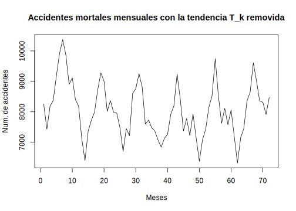<!-- -->

---

### Estimación de la tendencia y la estacionalidad

Los métodos descritos para estimar y remover la tendencia pueden ser adaptados de manera natural para estimar tanto la tendencia como la estacionalidad en el modelo general
\begin{equation}
X_t = T_t + E_t + \epsilon_t
\end{equation}
donde $\mathbb{E}(\epsilon_t)=0, E_{t+d}=E_t$ y $\sum_{j=1}^dE_t=0$. Ilustraremos estos métodos con referencia al siguiente ejemplo de accidentes. El archivo "Accidentes3.txt" muestra el número de accidentes mortales de automóviles mensual ocurridos en EE.UU., entre los años 1973 y 1978. En la tabla siguiente se muestran los datos


```r
X<-read.table("data/Accidentes3.txt", header = TRUE)
```
<table>
 <thead>
  <tr>
   <th style="text-align:left;"> Mes </th>
   <th style="text-align:right;"> X1973 </th>
   <th style="text-align:right;"> X1974 </th>
   <th style="text-align:right;"> X1975 </th>
   <th style="text-align:right;"> X1976 </th>
   <th style="text-align:right;"> X1977 </th>
   <th style="text-align:right;"> X1978 </th>
  </tr>
 </thead>
<tbody>
  <tr>
   <td style="text-align:left;"> Ene </td>
   <td style="text-align:right;"> 9007 </td>
   <td style="text-align:right;"> 7750 </td>
   <td style="text-align:right;"> 8162 </td>
   <td style="text-align:right;"> 7717 </td>
   <td style="text-align:right;"> 7792 </td>
   <td style="text-align:right;"> 7836 </td>
  </tr>
  <tr>
   <td style="text-align:left;"> Feb </td>
   <td style="text-align:right;"> 8106 </td>
   <td style="text-align:right;"> 6981 </td>
   <td style="text-align:right;"> 7306 </td>
   <td style="text-align:right;"> 7461 </td>
   <td style="text-align:right;"> 6957 </td>
   <td style="text-align:right;"> 6892 </td>
  </tr>
  <tr>
   <td style="text-align:left;"> Mar </td>
   <td style="text-align:right;"> 8928 </td>
   <td style="text-align:right;"> 8038 </td>
   <td style="text-align:right;"> 8124 </td>
   <td style="text-align:right;"> 7776 </td>
   <td style="text-align:right;"> 7726 </td>
   <td style="text-align:right;"> 7791 </td>
  </tr>
  <tr>
   <td style="text-align:left;"> Abr </td>
   <td style="text-align:right;"> 9137 </td>
   <td style="text-align:right;"> 8422 </td>
   <td style="text-align:right;"> 7870 </td>
   <td style="text-align:right;"> 7925 </td>
   <td style="text-align:right;"> 8106 </td>
   <td style="text-align:right;"> 8129 </td>
  </tr>
  <tr>
   <td style="text-align:left;"> May </td>
   <td style="text-align:right;"> 10017 </td>
   <td style="text-align:right;"> 8714 </td>
   <td style="text-align:right;"> 9387 </td>
   <td style="text-align:right;"> 8634 </td>
   <td style="text-align:right;"> 8890 </td>
   <td style="text-align:right;"> 9115 </td>
  </tr>
  <tr>
   <td style="text-align:left;"> Jun </td>
   <td style="text-align:right;"> 10826 </td>
   <td style="text-align:right;"> 9512 </td>
   <td style="text-align:right;"> 9556 </td>
   <td style="text-align:right;"> 8945 </td>
   <td style="text-align:right;"> 9299 </td>
   <td style="text-align:right;"> 9434 </td>
  </tr>
</tbody>
</table>

En la figura podemos observar que los datos presentan claramente una componente estacional con periodo $d=12$.

<!-- -->

Será conveniente para el primer método indexar los datos por mes y año. Entonces $X_{j,k}, j=1,\ldots,12, k=1,\ldots,6$ denotará el número de muertes accidentales reportados para el $j$-ésimo mes del $k$-ésimo año, $(1972+k)$. En otras palabras, definimos
$$X_{j,k}=X_{j+12(k-1)},\quad j=1,\ldots,12; k=1,\ldots,6.$$

1) **Método E1: Método de la tendencia pequeña**. Si la tendencia es pequeña (como en los datos de accidentes) no es irrazonable suponer que el término de la tendencia es constante, digamos $T_k$ para el año $k$. Dado que $\sum_{j=1}^{12}E_j=0$, nos lleva al estimador insesgado natural para la tendencia
\begin{equation}
\hat{T}_k = \frac{1}{12}\sum_{j=1}^{12}X_{j,k},
(\#eq:eq-estimador-Tj-accidentes)
\end{equation}
mientras que para la estacionalidad $E_j, j=1,\ldots,12$ tenemos el estimador
\begin{equation}
\hat{E}_j = \frac{1}{6}\sum_{k=1}^6(X_{j,k}-\hat{T}_k),
(\#eq:eq-estimador-Et-accidentes)
\end{equation}
el cual automáticamente satisface el requisito de que $\sum_{j=1}^{12}\hat{E}_j=0$. El término de error estimado para el mes $j$ del año $k$ es por supuesto
\begin{equation}
\hat{\epsilon}_{j,k} = X_{j,k}-\hat{T}_k-\hat{E}_j, \quad j=1,\ldots,12; k=1,\ldots,6.
(\#eq:eq-estimador-epsilon-t-accidentes)
\end{equation}
La generalización de \@ref(eq:eq-estimador-Tj-accidentes) a \@ref(eq:eq-estimador-epsilon-t-accidentes) para datos con estacionalidad con un periodo distinto de 12 es bastante sencillo de realizar, simplemente cambiamos 12 por el correspondiente valor de $d$. Así, en general, si tenemos $n$ años (meses, semanas, días, etc.) y estacionalidad con periodo $d$, los estimadores seran:

Para la tendencia $T_k$:
\begin{equation}
\hat{T}_k=\frac{1}{d}\sum_{j=1}^dX_{j,k}
(\#eq:eq-estimador-Tk-E1)
\end{equation}
Para la estacionalidad $E_j$:
\begin{equation}
\hat{E}_j=\frac{1}{n}\sum_{k=1}^n(X_{j,k}-\hat{T}_k),\quad j=1,\ldots,d
(\#eq:eq-estimador-Ej-E1)
\end{equation}
Para el error 
\begin{equation}
\hat{\epsilon}_{j,k}=X_{j,k}-\hat{T}_k-\hat{E}_j,\quad k=1,\ldots,n; j=1,\ldots,d.
(\#eq:eq-estimador-error-E1)
\end{equation}

Las Figuras siguientes muestran respectivamente las observaciones con la tendencia removida $X_{j,k}-\hat{T}_k$, la componente estacional estimada $\hat{E}_j$ y las observaciones con la tendencia y la estacionalidad removida $\hat{\epsilon}_{j,k}=X_{j,k}-\hat{T}_k-\hat{E}_j$. En la última gráfica (para el error) no se observa una aparente tendencia o estacionalidad.


```r
# Estimacion de la tendencia
Tk=numeric(n*d)
for(k in 1:n)
{
  for(j in 1:d)
  {
    Tk[(k-1)*d+j]=Tk[(k-1)*d+j]+(1/12)*X[j,k+1]
  }
}
# Grafico con la tendencia removida
plot(V-Tk,type = "l",xlab = "Meses",ylab = "Num. de accidentes",
     main = "Accidentes mortales mensuales con la tendencia T_k removida")
```

<!-- -->

```r
# Estimacion de la estacionalidad
Ej=numeric(n*d)
for(j in 1:d)
{
  aux=0
  for(k in 1:n)
  {
    aux=aux+(X[j,k+1]-Tk[(k-1)*d+j])
  }
  for(k in 1:n)
  {
    Ej[(k-1)*d+j]=(1/n)*aux
  }
}
# Grafico de la estacionalidad
plot(Ej,type = "l",xlab = "Meses",ylab = "Num. de accidentes",
     main = "Estacionalidad de los accidentes mortales mensuales")
```

<!-- -->

```r
# Estimacion del error
error=V-Tk-Ej
# Grafico del error estimado
plot(error,type = "l",xlab = "Meses",ylab = "Error estimado",
     main = "Error estimado de los accidentes mortales")
grid(col = "darkgray")     
```

<!-- -->

2) **Método E2: Estimación por promedio móvil**. El siguiente método es preferible al Método E1 ya que no se basa en la suposición de que $T_t$ es casi constante sobre cada ciclo de estacionalidad.

Suponga que tenemos las observaciones $\{x_1,\ldots,x_n\}$. El priemr paso es estimar la tendencia aplicando un filtro de promedio móvil especialmente elegido para eliminar la componente estacional y para amortiguar el ruido. Si el periodo $d$ es par, digamos $d=2q$, entonces usamos
\begin{equation}
\hat{T}_t = (0.5x_{t-q} + x_{t-q+1} + \cdots + x_{t+q-1} + 0.5x_{t+q})/d, q<t\leq n-q.
(\#eq:eq-filtro-especial-metodo-E2)
\end{equation}
Si el periodo es impar, digamos $d=2q+1$, entonces usamos un promedio móvil simple 
\begin{equation}
\hat{T}_t=\frac{1}{d}\sum_{j=-q}^qX_{t-j},\quad q+1\leq t\leq n-q
(\#eq:eq-filtro-promedio-movil-metodo-E2)
\end{equation}
nuevamente, haciendo uso del ejemplo de accidentes mortales, la figura siguiente muestra la tendencia estimada $\hat{T}_t$ usando el filtro mostrado en \@ref(eq:eq-filtro-especial-metodo-E2). También muestra la tendencia constante a trozos obtenida por el Método E1. En la misma se puede observar que para los ciclos 2 a 5 la tendencia se mantiene cercana, pero para los ciclos 1 y 6 hay una diferencia mas marcada.


```r
# Filtro para ciclo par d
q=d/2
N=n*d
aux=0
T.est=numeric(N)
for (t in 1:N)
{
  if (t<=q|t>N-q)
  {
    T.est[t]=V[t]
  }
  else
  {
    aux=0
    for (k in -q:q)
    {
      if (k==-q|k==q)
      {
        aux=aux+0.5*V[t+k]
      }
      else
      {
        aux=aux+V[t+k]
      }
    }
    T.est[t]=(1/d)*aux
  }
}
# Grafico de las tendencias con los metodos E1 y E2
plot(T.est,type = "l",xlab = "Meses", ylab = "Num. de accidentes")
lines(Tk,col="blue")
```

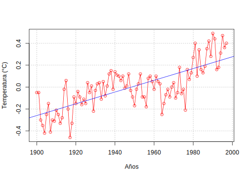<!-- -->

El segundo paso, es estimar la componente estacional. Para cada $k=1,\ldots,d$, calculamos el promedio $w_k$ de las desviaciones $\{(X_{k+jd}-\hat{T}_{k+jd}):q<k+jd\leq n-q\}$. Dado que este promedio de desviaciones no necesariamente suma cero, estimamos la componente estacional $E_k$ como
\begin{equation}
\hat{E}_k = w_k -\frac{1}{d}\sum_{i=1}^dw_i,\quad k=1,\ldots,d,
(\#eq:eq-estimador-Et-metodo-E2)
\end{equation}
y $\hat{E}_k=\hat{E}_{k-d},k>d$.

Los datos sin la componente estacional se definen entonces como la serie original con la componente estacional removida, es decir,
\begin{equation}
d_t = X_t-\hat{E}_t,\quad t=1,\ldots,n.
(\#eq:eq-serie-destacionalizada-E2)
\end{equation}
Finalmente, reestimamos la tendencia de $\{d_t\}$ aplicando un filtro de promedio móvil como se describió para los datos no estacionales (método T2) o fijando un polinomio de grado $k$ a la serie $\{d_t\}$. El término del ruido estimado llega a ser entonces
$$\hat{\epsilon}_t = X_t - \hat{E}_t - \hat{E}_t, \quad t=1,\ldots,n.$$
Los resultados de aplicar los Métodos E1 y E2 a los datos de accidentes mortales son casi iguales, dado que en este caso la constante a trozos y el promedio móvil de $\hat{T}_t$ están razonablemente cercanos.

Una comparación de los valores estimados de $\hat{E}_k, k=1,\ldots,12$, obtenido con ambos métodos se muestra en la tabla siguiente

k     |   1 |   2 |  3 |  4 | 5 | 6 |  7 | 8 |  9 | 10|  11| 12 
------|-----|-----|----|----|---|---|----|---|----|---|----|----
Mét E1|-7434|-1504|-724|-523|338|808|1665|961| -87|197|-321|-67 
Mét E2| -804|-1522|-737|-526|343|746|1680|987|-109|258|-259|-57 


- **Método E3: Diferenciación a paso $\mathbf{d}$**. La técnica de diferenciación la cual aplicamos antes a datos no estacionales se pueden adaptar para lidiar con el caso estacional de periodo $d$ introduciendo el operador de diferencia de paso $d$, $\nabla_d$ definido por
\begin{equation}
\nabla_dX_t = X_t-X_{t-d} = (1-B^d)X_t.
(\#eq:eq-operador-diferencia-paso-d)
\end{equation}
Este operador no debe confundirse con el operador $\nabla^d = (1-B)^d$ definido por (\ref{eq-operador-diferencia}).

Aplicando el operador $\nabla_d$ al modelo
$$X_t = T_t + E_t + \epsilon_t,$$
donde $\{E_t\}$ tiene periodo $d$, obtenemos
$$\nabla_dX_t = T_t-T_{t-d} + \epsilon_t-\epsilon_{t-d},$$
lo cual nos da una descomposición de la diferencia $\nabla_dX_t$ en una componente de tendencia $(T_t-T_{t-d})$ y un término de ruido $(\epsilon_t-\epsilon_{t-d})$. La tendencia $(T_t-T_{t-d})$ se puede eliminar usando los métodos ya descritos, por ejemplo, aplicando alguna potencia del operador $\nabla$. La figura siguiente muestra el resultado de aplicar el operador $\nabla_{12}$ a los datos de accidentes mortales.


```r
# Operador Nabla_d, usamos la funcion diff con lag=12
NdX=diff(V,lag=12)
plot(NdX,type = "l")
```

<!-- -->

La componente estacional evidente en la  Figura~\ref{Grafico-tema3-accidentes-USA} está ausente en la Figura de $\nabla_{12}X_t,13\leq t\leq72$. Sin embargo todavía parece haber una tendencia decreciente. Si ahora aplicamos el operador $\nabla$ a $\nabla_{12}X_t$ y graficamos las diferencias $\nabla\nabla_{12}X_t,t=14,\ldots,72$ obtenemos el gráfico mostrado en la Figura siguiente, la cual no tiene una aparente tendencia o componente estacional.


```r
DNdX=diff(NdX)
plot(DNdX,type = "l")
```

<!-- -->

## Estimación de la tendencia por regresión clásica

Los modelos de regresión son importantes para modelos en el dominio de tiempo y de frecuencia que discutiremos posteriormente. La idea principal depende de poder expresar una serie respuesta $X_t$ como una combinación lineal de entradas $z_{t_1},z_{t_2},\ldots,z_{t_q}$. La estimación de los coeficientes $\beta_1,\beta_2,\ldots,\beta_q$ de la combinación por mínimos cuadrados proporciona un método para modelar $X_t$ en términos de las entradas.

### Regresión Clásica

Supongamos que tenemos $X_t$, para $t=1,2,\ldots,n$ influenciada por una colección de series independientes $z_{t_1},z_{t_2},\ldots,z_{t_q}$, donde consideraremos primero que las entradas son fijas y conocidas. Podemos expresar esta relación como
\begin{equation}
X_t=\beta_1z_{t_1}+\beta_2z_{t_2}+\cdots+\beta_qz_{t_q}+w_t
(\#eq:eq-regresion-lineal)
\end{equation}
donde $\beta_1,\beta_2,\ldots,\beta_q$ son los coeficientes de regresión fijos y desconocidos, $\{w_t\}$ es un error aleatorio o un proceso de ruido consistente de variables normales iid con media cero y varianza $\sigma_w^2$.

El modelo lineal descrito en \@ref(eq:eq-regresion-lineal) se puede escribir de forma más general por medio de definir los vectores columna $\mathbf{z}_t=(z_{t_1},z_{t_2},\ldots,z_{t_q})^t$ y $\mathbf{\beta}=(\beta_1,\beta_2,\ldots,\beta_q)^t$ donde $t$ denota la traspuesta, así \@ref(eq:eq-regresion-lineal) será

\begin{equation}
X_t=\mathbf{\beta}^t\mathbf{z}_t+w_t
(\#eq:eq-regresion-lineal-2)
\end{equation}
donde $w_t\sim iid(0,\sigma_w^2)$. Es natural considerar la estimación de los coeficientes del vector $\mathbf{\beta}$ minimizando la suma residual de cuadrados

\begin{equation}
RSS=\sum_{t=1}^{n}(X_t-\mathbf{\beta}^t\mathbf{z}_t)^2
(\#eq:eq-suma-residual-cuadrados)
\end{equation}
con respecto a $\beta_1,\beta_2,\ldots,\beta_q$. Minimizando RSS obtenemos el estimador común de mínimos cuadrados. Esta minimización se puede hacer por diferenciación de \@ref(eq:eq-suma-residual-cuadrados) con respecto al vector $\mathbf{\beta}$ o usando las propiedades de proyección. En la notación anterior, obtenemos la ecuación normal

\begin{equation}
\left(\sum_{t=1}^{n}\mathbf{z}_t\mathbf{z}_t^t\right)\hat{\mathbf{\beta}}=\sum_{t=1}^{n}\mathbf{z}_tX_t
(\#eq:eq-regresion-lineal-normal)
\end{equation}

Definiendo la matriz $Z=(\mathbf{z}_1,\mathbf{z}_2,\ldots,\mathbf{z}_n)^t$ como una matriz $n\times q$ compuesta de $n$ muestras de las variables de entradas y el vector observado $\mathbf{x}=(x_1,x_2,\ldots,x_n)^t$ se puede hacer una simplificación de la notación. Esta identificación nos lleva a

\begin{equation}
(Z^tZ)\hat{\mathbf{\beta}}=Z^t\mathbf{x}
(\#eq:eq-regresion-matriz)
\end{equation}
y la solución es

\begin{equation}
\hat{\mathbf{\beta}}=(Z^tZ)^{-1}Z^t\mathbf{x},
(\#eq:eq-solucion-regresion-matriz)
\end{equation}
cuando la matriz $Z^tZ$ es de rango $q$. El residual minimizado de suma de cuadrados \@ref(eq:eq-suma-residual-cuadrados) tiene la forma matricial equivalente

\begin{eqnarray}
RSS&=&(\mathbf{x}-Z\hat{\mathbf{\beta}})^t(\mathbf{x}-Z\hat{\mathbf{\beta}})\\ \nonumber
&=&\mathbf{x}^t\mathbf{x}-\hat{\mathbf{\beta}}^tZ^t\mathbf{x}\\ \nonumber
&=&\mathbf{x}^t\mathbf{x}-\mathbf{x}^tZ(Z^tZ)^{-1}Z^t\mathbf{x}.
(\#eq:eq-suma-residual-cuadrados-matricial)
\end{eqnarray}

El estimador común de mínimos cuadrados es insesgado, esto es, $\mathbb{E}(\hat{\mathbf{\beta}})=\mathbf{\beta}$, y tiene la menor varianza de todos los estimadores insesgados lineales.

Si los errores $w_t$ son normalmente distribuidos (Gaussianos), $\hat{\mathbf{\beta}}$ es también el estimador de máxima verosimilitud para $\mathbf{\beta}$ y es normalmente distribuido con

\begin{eqnarray}
\text{cov}(\hat{\mathbf{\beta}})&=&\sigma_w^2\left(\sum_{t=1}^{n}\mathbf{z}_t\mathbf{z}_t^t\right)^{-1}\\ \nonumber
&=&\sigma_w^2(Z^tZ)^{-1}\\ \nonumber
&=&\sigma_w^2C,
(\#eq:eq-covarianza-beta-estimado)
\end{eqnarray}
donde

\begin{equation}
C=(Z^tZ)^{-1}.
(\#eq:eq-matriz-C)
\end{equation}

Un estimador insesgado para la varianza $\sigma_w^2$ es
\begin{equation}
s_w^2=\frac{RSS}{n-q}
(\#eq:eq-estimador-insesgado-varianza)
\end{equation}
contrastado con el estimador de máxima verosimilitud $\hat{\sigma}_w^2=RSS/n$ el cual tiene divisor $n$. Bajo la suposición de que $s_w^2$ tiene distribución proporcional a una variable aleatoria chi-cuadrado con $n-q$ grados de libertad, $\chi_{n-q}^2$, e independiente de $\hat{\beta}$, se sigue que

\begin{equation}
t_{n-q}=\frac{(\hat{\beta}_i-\beta_i)}{s_w\sqrt{c_{ii}}}
(\#eq:eq-estadistico-t)
\end{equation}
tiene distribución $t$-de Student con $n-q$ grados de libertad; $c_{ii}$ denota el $i$-ésimo elemento de la diagonal de $C$, como se definió en \@ref(eq:eq-matriz-C).

Hay varios modelos que podemos utilizar de manera de seleccionar el mejor subconjunto de variables independientes. Suponga que tenemos un modelo que sólo considera un subconjunto $q_1<q$ de variables independientes $\mathbf{z}_{1t}=(z_{t_1},z_{t_2},\ldots,z_{t_q1})^t$ que influencian a la variable $X_t$, así el modelo

\begin{equation}
X_t=\mathbf{\beta}_1^t\mathbf{z}_{1t}+w_t
(\#eq:eq-modelo-regresion-reducido)
\end{equation}
llega a ser la hipótesis nula, donde $\mathbf{\beta}_1=(\beta_1,\beta_2,\ldots,\beta_{q1})^t$ es un subconjunto de los coeficientes de las $q$ variables originales. Podemos contrastar el modelo reducido \@ref(eq:eq-modelo-regresion-reducido) contra el modelo completo \@ref(eq:eq-regresion-lineal-2) comparando el residual de la suma de cuadrados bajo los dos modelos usando el estadístico $F$

\begin{equation}
F_{q-q1,n-q}=\frac{RSS_1-RSS}{RSS}\frac{n-q}{q-q1}
(\#eq:eq-estadistico-F-residuales)
\end{equation}
el cual tiene distribución $F$ con $q-q1$ y $n-q$ grados de libertad cuando \@ref(eq:eq-estadistico-F-residuales) es el modelo correcto. La información envuelta en la prueba se resume en una tabla de Análisis de Varianza (ANOVA) como la mostrada en la Tabla siguiente para este caso particular. La diferencia en el numerador es llamada regresión de la suma de cuadrados.


Fuente | g.l | Suma de cuadrados | Medias Cuadrados 
-------|-----|-------------------|------------------
$z_{t,q_1+1},\ldots,z_{t,q}$ | $q-q_1$ | $SS_{reg}=RSS_1-RSS$ | $MS_{reg}=SS_{reg}/(q-q_1)$ 
Error	| $n-q$	| $RSS$	| $s_e^2=RSS/(n-q)$ 
Total	| $n-q_1$	| $RSS_1$		|	

En términos de la Tabla, por convención escribimos el estadístico $F$ dado en \@ref(eq:eq-estadistico-F-residuales) como el radio de dos medias cuadrados, obteniéndose
\begin{equation}
F_{q-q1,n-q}=\frac{M S_{reg}}{s_w^2}.
(\#eq:eq-estadistico-F-radio-medias)
\end{equation}

Un caso de especial interés es para $q_1=1$ y $z_{1t}=1$, así el modelo en \@ref(eq:eq-modelo-regresion-reducido) es
$$X_t=\beta_1+w_t$$
y la proporción de variación explicada por las otras variables es
\begin{equation}
R_{xz}^2=\frac{RSS_0-RSS}{RSS_0},
(\#eq:eq-proporcion-variacion-explicada)
\end{equation}
donde la suma residual de cuadrados bajo el modelo reducido dada por
\begin{equation}
RSS_0=\sum_{t=1}^{n}(X_t-\bar{X})^2
(\#eq:eq-suma-residual-reducido)
\end{equation}
es precisamente la suma de desviaciones al cuadrado de la media $\bar{X}$. La medida $R_{xz}^2$ es la correlación múltiple cuadrado entre $X_t$ y $z_{t2},z_{t3},\ldots,z_{tq}$.

Las técnicas discutidas se pueden usar para hacer comparación entre varios modelos. Estas pruebas han sido usadas en el pasado en una manera gradual, donde las variables son añadidas o suprimidas cuando los valores de la prueba $F$ exceden o fallan en exceder algunos niveles predeterminados. El procedimiento, llamado regresión múltiple por pasos, es útil para conseguir un conjunto de variables que sea de utilidad. Una manera alternativa es enfocándose en un procedimiento para selección del modelo que no sea secuencial, sino simplemente evaluar cada modelo en base a sus propios méritos.

Suponga que consideramos un modelo de regresión con $k$ coeficientes y denotemos el estimador de máxima verosimilitud para la varianza como
\begin{equation}
\hat{\sigma}_k^2=\frac{RSS_k}{n}
(\#eq:eq-estimador-emv-varianza)
\end{equation}
donde $RSS_k$ denota la suma residual de cuadrados bajo el modelo con $k$ coeficientes de regresión. Entonces, Akaike (1969, 1973, 1974) sugirió medir la bondad del ajuste para este modelo en particular equilibrando el error del ajuste contra el número de parámetros en el modelo; definiendo lo siguiente

\BeginKnitrBlock{definition}\iffalse{-91-67-114-105-116-101-114-105-111-32-100-101-32-73-110-102-111-114-109-97-99-105-243-110-32-100-101-32-65-107-97-105-107-101-32-40-65-73-67-41-93-}\fi{}<div class="definition"><span class="definition" id="def:defi-AIC"><strong>(\#def:defi-AIC)  \iffalse (Criterio de Información de Akaike (AIC)) \fi{} </strong></span>El Criterio de Información de Akaike se define como
\begin{equation}
AIC=\ln\hat{\sigma}_k^2+\frac{n+2k}{n}
(\#eq:eq-AIC)
\end{equation}
donde $\hat{\sigma}_k^2$ está dado por \@ref(eq:eq-estimador-emv-varianza) y $k$ es el número de parámetros en el modelo
</div>\EndKnitrBlock{definition}

----

El *criterio de información de Akaike* (AIC) es una medida de la calidad relativa de un modelo estadístico, para un conjunto dado de datos. Como tal, el AIC proporciona un medio para la selección del modelo. El valor de $k$ que minimiza $AIC$ especifica el mejor modelo. La idea es que la minimización de $\hat{\sigma}_k^2$ sea razonablemente objetiva, excepto que decrezca monótonamente cuando $k$ crece. Por lo tanto, debemos penalizar la variación del error por un término proporcional al número de parámetros. La elección del término de penalización dado por \@ref(eq:eq-AIC) no es único.


\BeginKnitrBlock{example}\iffalse{-91-84-101-109-112-101-114-97-116-117-114-97-32-103-108-111-98-97-108-93-}\fi{}<div class="example"><span class="example" id="exm:ejem-temperatura-global"><strong>(\#exm:ejem-temperatura-global)  \iffalse (Temperatura global) \fi{} </strong></span>Consideremos los datos de temperatura global del archivo "globtemp2.txt". Estos datos corresponden a 125 años de mediciones de temperatura, representan la desviación promedio entre las temperaturas en tierra y aire medidos en grados centígrados (°C), desde 1880 hasta 2004.</div>\EndKnitrBlock{example}


```r
# Lectura del archivo de datos
globtemp=read.table("data/globtemp2.txt")
# Grafico de la serie de datos
plot(globtemp[,1],globtemp[,2],type = "l",col = "red", xlab = "Años",
     ylab = "Desv. temp. global (°c)",
     main="Desviación de la temperatura promedio global (1880-2004)")
grid(col = "darkgray")
```

<!-- -->

Ajustemos una regresión simple de la forma 
$$x_t+\beta_1+\beta_2t+w_t\text{, con }t=1900,1901,\ldots,1997.$$
Esta es la forma del modelo de regresión \@ref(eq:eq-regresion-lineal) con $q=2,z_{t_1}=1,z_{t_2}=t$.
 
Note que podemos usar $t=0,1,\ldots,97$, sin afectar la interpretación del coeficiente de la pendiente $\beta_2$, solo se afectaría la intercepción $\beta_1$.

Usando regresión lineal obtuvimos los valores estimados de los coeficientes: $\hat{\beta}_1=-10.44,\hat{\beta}_2=0.0053$, con un error estándar de $4.9\times10^{-4}$, dando un incremento estimado de 0.6 grados por cada 100 años. En la figura podemos observar la serie de tiempo con la recta de regresión 

$$\hat{x}_t=-10.44+0.0053t$$
  

```r
# Convertimos a serie de tiempo
gtemp=ts(globtemp[,2],start = 1880)
# Tomamos el subconjunto de 1900 a 1997
gtemp=window(gtemp,start = 1900, end = 1997)
# Calculamos la regresion lineal
fit=lm(gtemp~time(gtemp),na.action = NULL)
summary(fit)
```

```
## 
## Call:
## lm(formula = gtemp ~ time(gtemp), na.action = NULL)
## 
## Residuals:
##     Min      1Q  Median      3Q     Max 
## -0.3578 -0.0899 -0.0055  0.1064  0.2671 
## 
## Coefficients:
##              Estimate Std. Error t value Pr(>|t|)    
## (Intercept) -1.04e+01   9.56e-01   -10.9   <2e-16 ***
## time(gtemp)  5.36e-03   4.91e-04    10.9   <2e-16 ***
## ---
## Signif. codes:  
## 0 '***' 0.001 '**' 0.01 '*' 0.05 '.' 0.1 ' ' 1
## 
## Residual standard error: 0.137 on 96 degrees of freedom
## Multiple R-squared:  0.554,	Adjusted R-squared:  0.549 
## F-statistic:  119 on 1 and 96 DF,  p-value: <2e-16
```

```r
# Grafico de la serie y la regresion
plot(gtemp,type = "o", xlab = "Años", ylab = "Temperatura (°C)", 
    col =  "red")
abline(fit, col = "blue")
grid(col="darkgray")
```

<!-- -->
 
Podemos ver los residuales de la temperatura global $e_t=x_t-\hat{x}_t$, así como la ACF de los mismos. En las gráficas siguientes se muestran los mismo. En el gráfico para la ACF podemos observar que existe una correlación importante entre $x_t$ y $x_{t-1}$, y también cierta correlación entre $x_t$ y $x_{t-4},x_{t-5}$ y $x_{t-6}$. En el capítulo de modelos $AR$ veremos más sobre esta relación.


```r
# Residuales
e.temp=gtemp-fit$fitted.values
plot(e.temp, xlab="Años", main="Residuales de la temperatura global")
```

<!-- -->

```r
# ACF de los residuales
acf(e.temp, main="ACF de los residuales de la temperatura global")
```

<!-- -->
 
---

\BeginKnitrBlock{example}\iffalse{-91-85-115-111-32-100-101-32-114-101-103-114-101-115-105-243-110-32-112-97-114-97-32-100-101-115-99-117-98-114-105-114-32-117-110-97-32-115-101-241-97-108-32-100-101-32-114-117-105-100-111-93-}\fi{}<div class="example"><span class="example" id="exm:ejem-regresion-senal-ruido"><strong>(\#exm:ejem-regresion-senal-ruido)  \iffalse (Uso de regresión para descubrir una señal de ruido) \fi{} </strong></span>
Consideremos el modelo

\begin{equation}
x_t=A\cos(2\pi\omega t+\phi)+w_t
(\#eq:eq-modelo-senosoidal)
\end{equation}

donde $\omega=1/50,A=2,\phi=0.6\pi$ y $\sigma_w=5$, para $t=1,2,\ldtos,500$.

Usando identidad trigonométrica, podemos escribir
\begin{eqnarray*}
A\cos(2\pi\omega t+\phi)&=&A\cos(\phi)\cos(2\pi\omega t)-A\sin(\phi)\sin(2\pi\omega t)\\
		&=&\beta_1\cos(2\pi\omega t)+\beta_2\sin(2\pi\omega t),
\end{eqnarray*}

donde $\beta_1=A\cos(\phi)$ y $\beta_2=-A\sin(\phi)$. Ahora podemos escribir el modelo \@ref(eq:eq-modelo-senosoidal) en la forma de regresión lineal dada por

\begin{equation}
x_t=\beta_1\cos(2\pi t/50)+\beta_2\sin(2\pi t/50)+w_t.
(\#eq:eq-modelo-senosoidal-lineal)
\end{equation}

Usando regresión lineal sobre la serie generada, el modelo fijado será

\begin{equation}
\hat{x}_t=-0.84_{(0.32})\cos(2\pi t/50)-1.99_{(0.32})\sin(2\pi t/50)
(\#eq:eq-modelo-regresion-datos)
\end{equation}

con $\hat{\sigma}_w=5.08$, donde los valores entre paréntesis son los errores estándar.

Las instrucciones en R son las siguientes:</div>\EndKnitrBlock{example}


```r
C=2*cos(2*pi*1:500/50+0.6*pi)
w=rnorm(500,0,1)
Xt=-0.84*cos(2*pi*1:500/50)-1.99*sin(2*pi*1:500/50)
plot(C+5*w, type="l", col="red")
lines(Xt,col="blue")
```

<div class="figure">

<p class="caption">(\#fig:fig-tema3-regresion-senal-ruido)Datos generados por el modelo senosoidal [línea punteado roja] con modelo de regresión [línea solida azul</p>
</div>

---

\BeginKnitrBlock{example}\iffalse{-91-85-115-111-32-100-101-32-112-101-114-105-111-100-111-103-114-97-109-97-32-112-97-114-97-32-100-101-115-99-117-98-114-105-114-32-117-110-97-32-115-101-241-97-108-32-100-101-32-114-117-105-100-111-93-}\fi{}<div class="example"><span class="example" id="exm:ejem-periodograma-senal-ruido"><strong>(\#exm:ejem-periodograma-senal-ruido)  \iffalse (Uso de periodograma para descubrir una señal de ruido) \fi{} </strong></span>En algunos ejemplos puede lucir engañoso la periodicidad porque damos por supuesto que conocemos el valor del parámetro $\omega$. Si no conocemos el parámetro $\omega$, podemos tratar de fijar el modelo \@ref(eq:eq-modelo-senosoidal) usando regresión no lineal con $\omega$ como un parámetro. Otro método es intentar con distintos valores de $\omega$ de forma sistemática. 

Una medida apropiada de la presencia de una frecuencia de oscilación de $j$ ciclos en $n$ puntos de tiempos de un conjunto datos podría ser

\begin{equation}
P(j/n)=\hat{\beta}_1^2(j/n)+\hat{\beta}_2^2(j/n)
(\#eq:eq-periodograma)
\end{equation}

lo cual es básicamente una medida de correlación cuadrada. La cantidad \@ref(eq:eq-periodograma) es usualmente llamada el *periodograma*.

La Figura siguiente muestra el periodograma para los datos generados por \@ref(eq:eq-modelo-senosoidal), y es fácil descubrir la componente periódica con frecuencia $\omega=0.02=10/500$.</div>\EndKnitrBlock{example}


```r
t=1:500
x=2*cos(2*pi*t/50+0.6*pi+rnorm(500,0,5))
I=abs(fft(x)/sqrt(500))^2
P=(4/500)*I
f=0:250/500
plot(f, P[1:251],type="l",xlab="frequency", ylab=" ",col="blue")
abline(v=seq(0,.5,.02),lty="dotted")
```

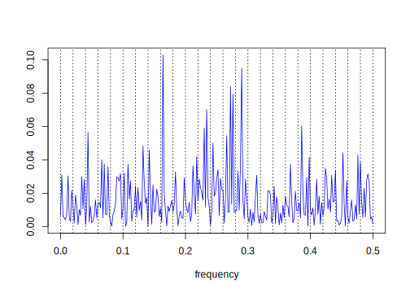<!-- -->

---

Finalmente mencionamos que no es necesario realizar una regresión grande

\begin{equation}
x_t=\sum_{j=0}^{n/2}\beta_1(j/n)\cos(2\pi tj/n)+\beta_2(j/n)\sin(2\pi tj/n)
(\#eq:eq-regresion-n-medio)
\end{equation}

para obtener los valores de $\beta_1(j/n)$ y $\beta_2(j/n)$ $[\beta_2(0)=\beta_2(1/2)=0]$ porque ellos se pueden calcular fácilmente si $n$ es un entero grande. No hay error en \@ref(eq:eq-regresion-n-medio) porque son $n$ observaciones y $n$ parámetros; la regresión ajusta bien. La Transformada Discreta de Fourier (DFT) es un promedio a valores complejos de los datos dados por

\begin{equation}
d(j/n)=n^{-1/2}\sum_{t=1}^{n}x_t\exp(-2\pi i tj/n)
(\#eq:eq-DF)
\end{equation}

a los valores $j/n$ son llamados *frecuencias fundamentales* o *de Fourier*.

Como un número grande de cálculos redundantes en \@ref(eq:eq-DFT) se pueden realizar rápidamente usando la Transformada Rápida de Fourier (FFT), la cual está disponible en muchos paquete de computación entre ellos Matlab y R. Note que [^nota011]

[^nota011]:$e^{-i\alpha}=\cos(\alpha)-i\sin(\alpha)$ y si $z=a-ib$ entonces $|z|^2=z\bar{z}=(a-ib)(a+ib)=a^2+b^2$.

\begin{equation}
|d(j/n)|^2=\frac{1}{n}\left(\sum_{t=1}^{n}x_t\cos(2\pi tj/n)\right)^2+\frac{1}{n}\left(\sum_{t=1}^{n}x_t\sin(2\pi tj/n)\right)^2
(\#eq:eq-periodograma-2)
\end{equation}

y esta cantidad es lo que llamamos el periodograma; por lo que podemos escribir

$$I(j/n)=|d(j/n)|^2$$

De modo, que podemos calcular el periodograma \@ref(eq:eq-periodograma) usando la expresión

\begin{equation}
P(j/n)=\frac{4}{n}I(j/n)
\end{equation}

Discutiremos esta aproximación con más detalles en el Tema [Análisis Espectral].

<!--chapter:end:200-caracterisitcas-series-tiempo.Rmd-->

# Modelos de series de tiempo

Como indicamos en el capítulo anterior el objetivo principal en el análisis de series de tiempo es desarrollar modelos matemáticos que provean una descripción apropiada para los datos muestrales. Recordando las definiciones \@ref(def:defi-serie-tiempo) y \@ref(def:defi-proceso-estocastico) podemos describir los modelos generales útiles para la descripción de series de tiempo

## Modelos Estocásticos

### Procesos Estocásticos

De la definición de procesos estocásticos (Definición  \@ref(def:defi-proceso-estocastico)), las variables aleatorias de la familia (medibles para todo $t\in T$) son funciones de la forma
$$x(\omega,t):\Omega\times T\to\mathbb{R}$$
Para $T=\mathbb{N}$, tenemos un proceso en *tiempo discreto* y para $T\subset\mathbb{R}$ tenemos un proceso en *tiempo continuo*. En lo que respecta a este libro, consideraremos como subconjunto de índices $T=(0,\infty)$.

Como ya indicamos, usaremos la notación $X_t$ para denotar la realización de un proceso estocástico $x_t(\omega*)$ cuando no haya lugar a confución. De esta forma, adoptaremos sin pérdida de generalidad, el conjunto de índices habitual de las series de tiempo en el ámbito de las finanzas y economía $I=(1,T)$.

De lo anterior, se tiene que los procesos estocásticos suelen ser descritos mediante su distribución conjunta de probabilidades, de manera que la relación que existe entre  una realización y un proceso estocástico es análoga a la existente entre la muestra y la población en el análisis estadístico clásico.

### Momentos, Varianza, Covarianza y Correlación

\BeginKnitrBlock{definition}<div class="definition"><span class="definition" id="def:defi-esperanza-varianza-procesos"><strong>(\#def:defi-esperanza-varianza-procesos) </strong></span>El **valor esperado** y **varianza** de un proceso estocástico están dados por
\begin{equation}
\mathbb{E}(x_t)=\int_{\Omega}x(\omega,t)dP(\omega),\quad t\in[0,T]
(\#eq:eq-esperanza-proceso)
\end{equation}
y
\begin{equation}
Var(x_t)=\mathbb{E}(x_t-\mathbb{E}(x_t))^2,\quad t\in[0,T]
(\#eq:eq-varianza-proceso)
\end{equation}
siempre que las integrales existan y sean finitas.</div>\EndKnitrBlock{definition}

\BeginKnitrBlock{definition}<div class="definition"><span class="definition" id="def:defi-k-esimo-momento-proceso"><strong>(\#def:defi-k-esimo-momento-proceso) </strong></span>El **$k$-ésimo momento** de $x_t$, con $k\geq1$, se define como $\mathbb{E}(x_t^k)$ para todo $t\in[0,t]$.</div>\EndKnitrBlock{definition}

\BeginKnitrBlock{definition}<div class="definition"><span class="definition" id="def:defi-funcion-covarianza-proceso"><strong>(\#def:defi-funcion-covarianza-proceso) </strong></span>La **función de covarianza** del proceso para dos instantes de tiempo $t$ y $s$ está dada por
$$\gamma(t,s)=Cov(x_t,x_s)=\mathbb{E}[(x_t-\mathbb{E}(x_t))(x_s-\mathbb{E}(x_s))]$$
La cantidad $x_t-x_s$ es llamada el proceso de *incrementos* desde $s$ a $t$, con $s<t$.</div>\EndKnitrBlock{definition}

### Variación de un proceso

Sea $P_n=\{0=t_0<t_1<\cdots<t_i<\cdots<t_n=t\}$ una partición cualquiera del intervalos $[0,t]$ en $n$ subintervalos y denotemos por
$$||P_n||=\max\{j=0,1,\ldots,n-1(t_{j+1}-t_j)\}$$
el tamaño de paso máximo de discretización de la partición $P_n$.

\BeginKnitrBlock{definition}<div class="definition"><span class="definition" id="def:defi-variacion-proceso"><strong>(\#def:defi-variacion-proceso) </strong></span>La **variación** del proceso $x$ se define como
\begin{equation}
V_t(x)=p-\lim_{||P_n||}\sum_{k=0}^{n-1}|x_{t_{k+1}}-x_{t_k}|
(\#eq:eq-variacion-proceso)
\end{equation}
Si $x$ es diferenciable, entonces $V_t(x)=\int_0^t|x'(u)|du$. Si $V_t(X)<\infty$, entonces decimos que $x$ es de *variación acotada* en $[0,t]$. Si es cierto para todo $t\geq0$, entonces decimos que $x$ tiene *variación acotada*.</div>\EndKnitrBlock{definition}

\BeginKnitrBlock{definition}<div class="definition"><span class="definition" id="def:defi-variacion-acotada"><strong>(\#def:defi-variacion-acotada) </strong></span>La **variación cuadrática** de un proceso estocástico $x$, denotada por $[x,x]_t$, se define como
\begin{equation}
[x,x]_t = p-\lim_{||P_n||}\sum_{k=0}^{n-1}|x_{t_{k+1}}-x_{t_k}|^2
(\#eq:eq-variacion-acotada-proceso)
\end{equation}</div>\EndKnitrBlock{definition}

Para procesos estocásticos con trayectorias continua, el límite existe, y en dicho caso usamos la notación $\langle x,x\rangle_t$ y podemos definirla alternativamente como 
\begin{equation}
\langle x,x\rangle_t = p-\lim_{n\to\infty}\sum_{k=1}^{2^n}\left(x_{\min(t,k/2^n)} - x_{\min(t,(k-1)/2^n)}\right)^2
(\#eq:eq-variacion-acotada-proceso-2)
\end{equation}

Si $x$ es continuo y tiene variación acotada cuadrática finita, entonces su variación total es infinita. Note que $V_t(x)$ y $[x,x]_t$ son también procesos estocásticos.

### Martingalas

En teoría de probabilidad, un proceso estocástico de tipo **martingala** (galicismo de *martingale*) es todo proceso caracterizado por no tener deriva. Este tipo de procesos estocásticos reciben su nombre de la estrategia de la martingala, un método de apuestas que tuvo cierta fama en el siglo XVIII. La estrategia de la martingala consiste en volver a apostar por el total perdido al momento de incurrir en una pérdida en un juego de azar,. En la nueva apuesta, el jugador tiene la posibilidad de recobrar todas sus pérdidas, por lo que podría parecer que a largo plazo la esperanza de ganancia con esta estrategia se mantienen constantes y a favor del jugador. De hecho, estadísticamente es así: el capital medio del jugador (esto es, el dinero que el jugador tiene a su disposición para jugar) se mantiene constante. El problema reside en que, al incurrir en sucesivas pérdidas, el jugador que siga la estrategia de la martingala se ve obligado a apostar de nuevo cantidades cada vez mayores (las pérdidas acumuladas), que tienden a crecer exponencialmente. Al cabo de unos pocos ciclos de apuestas, el jugador, cuyos recursos son habitualmente muy inferiores a los de la banca, se ve arruinado al ser incapaz de apostar de nuevo por el total de sus pérdidas. Evitar jugadores que intenten seguir la estratega de la martingala es de todos modos una de las razones por las que los casinos actuales establecen límites máximos de apuesta.

La estrategia de la martingala se popularizó en el siglo XVIII con fama de ser una estrategia ingenua y propia de mentes simples, puesto que aunque en apariencia es infalible, sin embargo, está abocada a arruinar al jugador. Recibe el nombre de los habitantes de la localidad francesa de *Martigues* (martingales en francés), situada en las cercanías de Marsella, que por aquel entonces tenían fama de ser ingenuos y simplones.

El concepto de la martingala en la teoría de probabilidades fue introducido por *Paul Pierre Lévy*, y una gran parte del desarrollo original de la teoría la realizó *Joseph Leo Doob*. Parte de la motivación para ese esfuerzo era demostrar la inexistencia de estrategias de juego infalibles.

El concepto fue inmediatamente aplicado al análisis de procesos bursátiles. Uno de los resultados más importantes de la matemática financiera es, precisamente, que un mercado perfecto sin posibilidades de arbitraje es una martingala.

\BeginKnitrBlock{definition}<div class="definition"><span class="definition" id="def:defi-filtracion"><strong>(\#def:defi-filtracion) </strong></span>Sea $(\omega,\mathcal{F},P)$ un espacio de probabilidad. Una **filtración** $\{\mathcal{F}_t,t\geq0\}$ es una familia creciente de sub-$\sigma$-álgebras de $\mathcal{F}$ indexadas por $t\geq0$; es decir, para cada $s,t>0$ tal que $s<t$, se tiene $\mathcal{F}_s\subset\mathcal{F}_t$ con $\mathcal{F}_0=\{\Omega,\emptyset\}$.</div>\EndKnitrBlock{definition}

Para cada proceso estocástico $\{x_t\}_{t\geq0}$ y para cada $t$, podemos asociar una $\sigma$-álgebra denotada por $\mathcal{F}_t=\sigma\{x_s:0\leq s\leq t\}$, y que además es la $\sigma$-álgebra generada por $x$; es decir, la $\sigma$-álgebra más pequeña (minimal) de $\mathcal{F}$ que hace a $x(s,\omega)$ medible para cada $0\leq s\leq t$.

\BeginKnitrBlock{definition}<div class="definition"><span class="definition" id="def:defi-proceso-adaptado"><strong>(\#def:defi-proceso-adaptado) </strong></span>Dado un proceso estocástico $\{X_t\}_{t\geq0}$ y una filtración $\{\mathcal{F}_t, t\geq0\}$ (no necesariamente la que genera $X$), el proceso $X$ se denomina **adaptado** a $\{\mathcal{F}_t, t\geq0\}$ ($\mathcal{F}_t$-adaptado) si para cada $t\geq0$, $X(t)$ es $\mathcal{F}_t$-medible.</div>\EndKnitrBlock{definition}

En otras palabras $X=\{X_t\}_{t\geq0}$ es $\mathcal{F}_t$-adaptado cuando el valor de $X_t$ en el tiempo $t$ solo depende de la información contenida en la realización hasta el instante $t$.

Dado un espacio de probabilidad $(\Omega,\mathcal{F},P)$ y una filtración $\{\mathcal{F}_t,t\geq0\}$, entonces definimos el **espacio de probabilidad filtrado** a la cuaterna $(\Omega,\mathcal{F},\{\mathcal{F}_t\}_{t\geq0},P)$.

\BeginKnitrBlock{definition}<div class="definition"><span class="definition" id="def:defi-martingala"><strong>(\#def:defi-martingala) </strong></span>Sea $(\Omega,\mathcal{F},\{\mathcal{F}_t\}_{t\geq0},P)$ un espacio de probabilidad filtrado. Un proceso $X_t$ con $t\in T$, $T\subseteq\mathcal{R}$ un conjunto de índices, es una **martingala** relativo a la filtración $\{\mathcal{F}_t,t\geq0\}$, si

1) $X_t$ es adaptado a la filtración $\{\mathcal{F}_t,t\geq0\}$
  
2) $X_t$ es integrable, es decir, $\mathbb{E}|X_t|<\infty$,

3) Para cualesquieras $s$ y $t$ con $s<t$, $\mathbb{E}(X_t|\mathcal{F}_s)=X_s$ c.s.

Decimos que el proceso es una **submartingala** si 
$$\mathbb{E}(X_t|\mathcal{F}_s)\geq X_s \text{ c.s.}$$
Decimos que es una **supermartingala** si 
$$\mathbb{E}(X_t|\mathcal{F}_s)\leq X_s \text{ c.s.}$$</div>\EndKnitrBlock{definition}

\BeginKnitrBlock{example}<div class="example"><span class="example" id="exm:unnamed-chunk-36"><strong>(\#exm:unnamed-chunk-36) </strong></span>Sean $X_0,X_1,\ldots,X_n$ variables aleatorias iid tal que $\mathbb{E}(X_1)=\mu$ y sean 
\begin{eqnarray*}
M_0 &=& X_0 \\
M_1 &=& X_0+X_1 \\
\vdots & & \vdots \\
M_n &=& X_0+X_1+\cdots+X_n
\end{eqnarray*}
La sucesión de variables aleatorias $M_n$ se llama **paseo aleatorio** y es una supermartingala si $\mu\leq0$, una martingala si $\mu=0$ y una submartingala si $\mu\geq0$.

Es fácil demostrarlo, sencillamente usamos el hecho de que 
$$M_{n+1}=M_n+X_{n+1}$$
y que $M_n$ y $X_{n+1}$ son independientes. Podemos generar tal proceso en **R**.</div>\EndKnitrBlock{example}


```r
n=100
mu=0
sigma=1
X=rnorm(n,mu,sigma)
M=cumsum(X)
plot(M,type = "l",xlab = "t",ylab = "M_n")
```

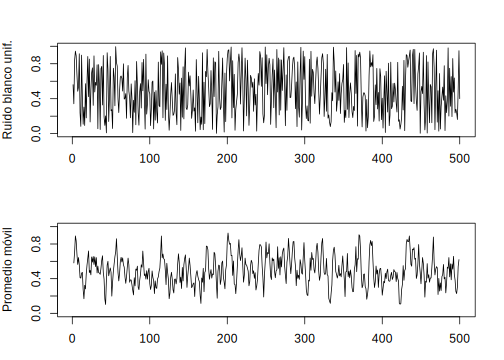<!-- -->
\BeginKnitrBlock{example}\iffalse{-91-80-114-101-99-105-111-32-100-101-32-97-99-99-105-111-110-101-115-93-}\fi{}<div class="example"><span class="example" id="exm:unnamed-chunk-38"><strong>(\#exm:unnamed-chunk-38)  \iffalse (Precio de acciones) \fi{} </strong></span>Sean $Y_0,Y_1,\ldots,Y_n$ variables aleatorias independientes y positivas. Supongamos que una acción tiene precio $M_0$ a tiempo $t=0$. </div>\EndKnitrBlock{example}

Un modelo común para modelar el precio de la acción en tiempo $t=n$ es

$$M_{n+1}=M_nY_n$$

donde $(Y_n-1)\times100$ representa (en porcentaje) la variabilidad de la acción. Usando las propiedades de esperanza condicional (Apéndice), es muy sencillo demostrar que 

$$\mathbb{E}(M_{n+1}|M_0,\ldots,M_n)=M_n\mathbb{E}(Y_n)$$

En particular, si $Y_1,\ldots,Y_n$ son idénticamente distribuidas con $\mathbb{E}(Y_1)=\mu$ tenemos que $M_n$ es

 - Una **martingala** si $\mu=1$
 
 - Una **submartingala** si $\mu>1$
 
 - Una **supermartingala** si $\mu<1$.
 
Dos modelos bien conocidos de lo anterior son

1) Modelo **Black-Scholes discreto**. 

Sean $Y_1,\ldots,Y_n$ definidas por 

$$Y_n=e^{Z_n}$$

donde $Z_1,\ldots,Z_n$ son variables aleatorias independientes normales $N(\mu,\sigma^2)$.
   
2) **Modelo Binomial**. 

Sean $Y_1,\ldots,Y_n$ definidas por

$$P(Y_i=(1+t)e^{-r})=p\quad\text{ y }\quad P(Y_i=(1+t)^{-1}e^{-r})=1-p$$

La constante $r$ es la tasa de interés y los factores $(1+t)$ y $(1+t)^{-1}$ modelan las variaciones del mercado y garantizan que el precio tiene la forma $M_0(1+t)^ye^{-nr}$, con $|y|\leq n$. La volatilidad del precio está asociada a $p$. 

\BeginKnitrBlock{definition}<div class="definition"><span class="definition" id="def:defi-proceso-cuadrado-integrable"><strong>(\#def:defi-proceso-cuadrado-integrable) </strong></span>Una variable aleatoria $X$ es **cuadrado integrable** si $\mathbb{E}(X^2)<\infty$. Un proceso estocástico $X_t$ en el intervalo $[0,T]$, donde $T$ puede ser infinito, es **cuadrado integrable** si 
\begin{equation}
\sup_{t\in[0,T]}\mathbb{E}(X_t^2)<\infty
(\#eq:eq-proceso-cuadrado-integrable)
\end{equation}
es decir, si sus segundos momentos son acotados.</div>\EndKnitrBlock{definition}

\BeginKnitrBlock{definition}<div class="definition"><span class="definition" id="def:defi-proceso-uniforme-integrable"><strong>(\#def:defi-proceso-uniforme-integrable) </strong></span>Un proceso estocástico $X_t, 0\leq t\leq T$ se dice que es **uniformemente integrable** si 
$$\mathbb{E}(|X_t|\mathbf{1}_{\{|X_t|>n\}})$$
converge a 0 cuando $n\to\infty$ uniformemente en $t$.</div>\EndKnitrBlock{definition}

### Propiedad de Markov

La propiedad de Markov establece que si conocemos el estado actual  de un proceso estocástico, entonces el comportamiento futuro de dicho proceso es independiente de su pasado. Un proceso $X_t$ tiene la *propiedad de Markov* si la distribución condicional del proceso $X_t$ dado el proceos en el instante $X_t=x$, no depende de los valores pasados.

\BeginKnitrBlock{definition}<div class="definition"><span class="definition" id="def:defi-proceso-markov"><strong>(\#def:defi-proceso-markov) </strong></span>$X$ es un **proceso de Markov** si para cualquier $t$ y $s>0$,
$$P(X_{t+s}\leq y|\mathcal{F}_t) = P(X_{t+s}\leq y|X_t) \text{ c.s.}$$
donde $\mathcal{F}_t$ es la $\sigma$-álgebra generada por el proceso hasta el tiempo $t$.</div>\EndKnitrBlock{definition}

\BeginKnitrBlock{definition}<div class="definition"><span class="definition" id="def:defi-funcion-transicion-probabilidad"><strong>(\#def:defi-funcion-transicion-probabilidad) </strong></span>La **función de transición de probabilidad** de un proceso $X$ se define como 
$$P(y,t,x,s) = P(X_y\leq y|X_s\leq x)$$
la función de distribución condicional del proceso en el instante $t$, dado que éste está en el punto $x$ en el instante $s<t$.</div>\EndKnitrBlock{definition}

La propiedad de Markov implica una expresión que resulta muy útil en términos de la esperanza condicional por la $\sigma$-álgebra de eventos, la cual es válida tanto para procesos en tiempo discreto como en tiempo continuo.

Las definiciones y propiedades anteriores son temas de estudio de gran importancia y con una amplia teoría matemática que está fuera del alcance de este libro, pero lo que hemos descrito es suficiente para el objetivo del mismo.

## Modelos lineales

Los modelos lineales proporcionan un enfoque natural que permite analizar el comportamiento de los procesos estocásticos o series de tiempo y en especial a lo referente a finanzas y economía. En esta sección discutiremos la estructura de dependencia, autocorrelación, modelización y predicción de los modelos lineales teóricos, con los correspondientes comandos en **R** para generar y nalaizar dichos procesos.

### Proceso de Ruido Blanco

\BeginKnitrBlock{definition}<div class="definition"><span class="definition" id="def:defi-ruido-blanco"><strong>(\#def:defi-ruido-blanco) </strong></span>Un proceso $\{w_t\}$ se denomina **ruido blanco** (white noise) de media 0 y varianza $\sigma^2$ si satisface
\begin{eqnarray*}
\mathbb{E}(w_t) &=& 0,\quad Var(w_t)=\sigma_w^2<\infty \\
Cov(w_t,w_{t-k}) &=& 0, \forall k\neq0
\end{eqnarray*}</div>\EndKnitrBlock{definition}

Las series de tiempo generadas de esta manera son muy usadas como modelos para ruido en aplicaciones de ingeniería. La designación *"blanco"* se origina de la analogía con la luz blanca e indica que todos los posibles períodos de oscilación están presentes con igual intensidad.

En particular, una sucesión de variables aleatorias iid con media 0 y varianza $\sigma_w^2$ representa un caso especial de un proceso de ruido blanco. Este proceso lo denotaremos por $w_t\sim WN(0,\sigma_w^2)$. Un muy usado ruido blanco es el **ruido blanco gaussiano**, donde las $w_t$ son variables aleatorias normales o gaussianas con media 0 y varianza $\sigma_w^2$ y denotadas como $w_t\sim iidN(0,\sigma_w^2)$.

La función de media de un ruido blanco es trivial, es decir
$$\mu_w=\mathbb{E}(w_t)=0.$$
Calculemos la función de autocovarianza de $w_t$
\begin{eqnarray*}
\gamma_w(s,t) &=& \mathbb{E}[(w_s-\mu_s)(w_t-\mu_t)] \\
      &=& \mathbb{E}[w_sw_t] \\
      &=& \begin{cases}
            \sigma_w^2, &\text{ si }s=t \\
            0, &\text{ si }s\neq t
          \end{cases}
\end{eqnarray*}
La última igualdad se sigue del hecho de que $w_s$ y $w_t$ son no-correlacionados para $s\neq t$ por lo que $\mathbb{E}(w_sw_t) = \mathbb{E}(w_s)\mathbb{E}(w_t)=0$.

\BeginKnitrBlock{example}\iffalse{-91-69-115-116-97-99-105-111-110-97-114-105-100-97-100-32-100-101-32-117-110-32-114-117-105-100-111-32-98-108-97-110-99-111-93-}\fi{}<div class="example"><span class="example" id="exm:unnamed-chunk-39"><strong>(\#exm:unnamed-chunk-39)  \iffalse (Estacionaridad de un ruido blanco) \fi{} </strong></span>La función de autocovarianza de un ruido blanco es fácil de evaluar como 
$$\gamma_w(h) = \mathbb{E}(w_{t+h}w_t) = \begin{cases}
                                          \sigma_w^2,&\text{ si }h=0\\
                                          0,&\text{ si }h\neq0
                                         \end{cases}$$
donde $\sigma_w^2$ es la varianza del ruido blanco. Esto significa que la serie es *débilmente estacionaria* o *estacionaria*. Si las variables de ruido blanco también son gaussianas, el proceso es *estrictamente estacionario*, como se pueder ver evaluando (2.10) usando la relación (2.2).</div>\EndKnitrBlock{example}


```r
#-----------------------------------------
# Ruidos blancos
#-----------------------------------------
# Uniforme [0,1]
wu=runif(500,0,1)
# Gaussiano
wn=rnorm(500,0,1)
# Graficos
par(mfrow=c(2,1))
plot(wu,type = "l",xlab = "Num. de observaciones",
     main = "Ruido blanco uniforme en [0,1]")
plot(wn,type = "l",xlab = "Num. de observaciones",
     main = "Ruido blanco gaussiano")
```

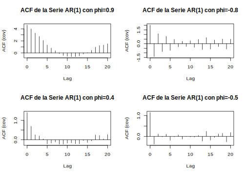<!-- -->

```r
# Funciones de autocovarianza (ACF)
acf(wu)
acf(wn)
```

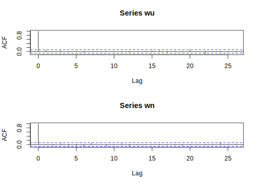<!-- -->

\BeginKnitrBlock{example}<div class="example"><span class="example" id="exm:ejem-promedio-movil-ruido-blanco"><strong>(\#exm:ejem-promedio-movil-ruido-blanco) </strong></span>Podemos reemplazar las series de ruido blanco $w_t$ por un promedio móvil que suavice la serie. Por ejemplo, consideremos la serie $w_t$ en la ecuación ( ) y reemplacémosla por un promedio móvil de 3 puntos, dado por 
\begin{equation}
v_t = \frac{1}{3}(w_{t-1}+w_t+w_{t+1})
(\#eq:eq-promedio-movil-ruido-blanco)
\end{equation}
lo cual nos da una serie suavizada. Tomando la serie del ejemplo anterior y usando la función 'filter' de **R** se obtienen los gráficos siguientes:</div>\EndKnitrBlock{example}


```r
#------------------------------------------
# Promedio movil
#------------------------------------------
# Uniforme
vu=filter(wu,sides = 2,rep(1/3,3))
par(mfrow=c(2,1),mar=c(3,4,3,2))#
plot.ts(wu,xlab=" ",ylab="Ruido blanco unif.")
plot.ts(vu,ylim=c(0,1),ylab="Promedio móvil")
```

<!-- -->

```r
# Gaussiano
vn=filter(wn,sides = 2,rep(1/3,3))
par(mfrow=c(2,1),mar=c(3,4,3,2))
plot.ts(wn,xlab=" ",ylab="Ruido blanco gauss.")
plot.ts(vn,ylim=c(-3,3),ylab="Promedio móvil")
```

<!-- -->
En la parte superior de cada uno se observan los ruidos blancos y en la parte inferior los respectivos promedios móviles. Podemos notar que las series de promedio móvil suavizan el comportamiento de las series originales, si tomamos más puntos en el promedio mayor será el suavizado.

\BeginKnitrBlock{example}\iffalse{-91-70-117-110-99-105-243-110-32-100-101-32-109-101-100-105-97-32-100-101-32-117-110-32-112-114-111-109-101-100-105-111-32-109-243-118-105-108-93-}\fi{}<div class="example"><span class="example" id="exm:ejem-funcion-media-MA"><strong>(\#exm:ejem-funcion-media-MA)  \iffalse (Función de media de un promedio móvil) \fi{} </strong></span>Si $w_t$ denota una serie de ruido blanco, entonces $\mu_{wt}=\mathbb{E}(w_t)=0$ para todo $t$. Luego para el promedio móvil de 3 puntos se tiene
$$\mu_{wt} = \mathbb{E}(v_t) = \frac{1}{3}\mathbb{E}(w_{t-1}+w_t+w_{t+1}) = \frac{1}{3}(\mathbb{E}(w_{t-1})+\mathbb{E}(w_t)+\mathbb{E}(w_{t+1}))=0.$$</div>\EndKnitrBlock{example}

\BeginKnitrBlock{example}\iffalse{-91-65-117-116-111-99-111-118-97-114-105-97-110-122-97-32-100-101-32-117-110-32-112-114-111-109-101-100-105-111-32-109-243-118-105-108-93-}\fi{}<div class="example"><span class="example" id="exm:ejem-ACF-MA"><strong>(\#exm:ejem-ACF-MA)  \iffalse (Autocovarianza de un promedio móvil) \fi{} </strong></span>Consideremos el promedio móvil de 3 puntos del ejemplo anterior y calculemos su función de autocovarianza
\begin{eqnarray*}
\gamma_v(s,t) &=& \mathbb{E}[(v_s-\mu_s)(v_t-\mu_t)] \\
      &=& \mathbb{E}[(v_s-o)(v_t-0)] \\
      &=& \frac{1}{9}\mathbb{E}[(w_{s-1}+w_s+w_{s+1})(w_{t-1}+w_t+w_{t+1})]
\end{eqnarray*}
Consideremos $s-t=h$, para $h=0,\pm1,\pm2,\ldots$. Entonces, tenemos para $h=0$
\begin{eqnarray*}
\gamma_v(t,t) &=& \frac{1}{9}\mathbb{E}[(w_{t-1}+w_t+w_{t+1})(w_{t-1}+w_t+w_{t+1})] \\
      &=& \frac{1}{9}[\mathbb{E}(w_{t-1}w_{t-1})+\mathbb{E}(w_tw_t)+\mathbb{E}(w_{t+1}w_{t+1})] \\
      &=& \frac{3}{9}
\end{eqnarray*}
Para $h=1$, tenemos
\begin{eqnarray*}
\gamma_v(t+1,t) &=& \frac{1}{9}\mathbb{E}[(w_t+w_{t+1}+w_{t+2})(w_{t-1}+w_t+w_{t+1})] \\
      &=& \frac{1}{9}[\mathbb{E}(w_tw_t)+\mathbb{E}(w_{t+1}w_{t+1})] \\
      &=& \frac{2}{9}
\end{eqnarray*}
Usando el hecho de que $\mathbb{E}(w_tw_s)=0$ si $s\neq t$. Cálculos similares nos dan $\gamma_v(t-1,t)=2/9, \gamma_v(t+2,t)=\gamma_v(t-2,t)=1/9$ y 0 para $h\geq3$. Resumiendo se tiene
\begin{equation}
\gamma_v(s,t) = \begin{cases}
                3/9, &\text{ si }s=t\\
                2/9, &\text{ si }|s-t|=1\\
                1/9, &\text{ si }|s-t|=2\\
                0, &\text{ si }|s-t|\geq3
                \end{cases}
(\#eq:eq-autocovarianza-promedio-movil)
\end{equation}</div>\EndKnitrBlock{example}

\BeginKnitrBlock{example}\iffalse{-91-69-115-116-97-99-105-111-110-97-114-105-100-97-100-32-100-101-32-117-110-32-112-114-111-109-101-100-105-111-32-109-243-118-105-108-93-}\fi{}<div class="example"><span class="example" id="exm:ejem-estacionaridad-MA"><strong>(\#exm:ejem-estacionaridad-MA)  \iffalse (Estacionaridad de un promedio móvil) \fi{} </strong></span>El proceso de promedio móvil usado en los ejemplos \@ref(exm:ejem-promedio-movil-ruido-blanco) y \@ref(exm:ejem-funcion-media-MA) es estacionario ya que podemos escribir la función de autocovarianza obtenida en \@ref(eq:eq-autocovarianza-promedio-movil) como
$$\gamma_v(h) = \begin{cases}
                  3/9, &\text{ si }h=0\\
                  2/9, &\text{ si }h=\pm1\\
                  1/9, &\text{ si }h=\pm2\\
                  0, &\text{ si }|h|\geq3
                  \end{cases}$$
        </div>\EndKnitrBlock{example}

\BeginKnitrBlock{example}<div class="example"><span class="example" id="exm:ejem-camino-aleatorio"><strong>(\#exm:ejem-camino-aleatorio) </strong></span>Un modelo para analizar tendencias es el camino aleatorio con tendencia dado por 
\begin{equation}
X_t = \delta+X_{t-1}+w_t
(\#eq:eq-camino-aleatorio-tendencia)
\end{equation}
para $t=1,2,\ldots,$ con condición inicial $X_0=0$, y donde $w_t$ es un ruido blanco. La constante $\delta$ es llamada *tendencia*, y cuando $\delta=0$, \@ref(eq:eq-camino-aleatorio-tendencia) es llamado simplemente *camino aleatorio*. El término camino aleatorio viene del hecho de que cuando $\delta=0$ el valor de la serie de tiempo en tiempo $t$ es el valor de la serie de tiempo al tiempo $t-1$ más un movimiento completamente aleatorio determinado por $w_t$. La expresión \@ref(eq:eq-camino-aleatorio-tendencia) la podemos reescribir como una suma de variables de ruido blanco, esto es,
\begin{equation}
X_t = \delta t+\sum_{j=1}^Nw_j
(\#eq:eq-camino-aleatorio-suma)
\end{equation}
para $t=1,2,\ldots.$
A continuación generaremos un camino aleatorio usando **R**</div>\EndKnitrBlock{example}


```r
set.seed(154)
w=rnorm(500,0,1)
X=cumsum(w)
wd=w+0.2; Xd=cumsum(wd)
plot.ts(Xd,ylim=c(-40,80))
lines(X,col="red")
lines(0.2*(1:500),lty="dashed",col="blue")
```

<div class="figure" style="text-align: center">

<p class="caption">(\#fig:unnamed-chunk-42)Gráficos de caminos aleatorios: con tendencia (negro), sin tendencia (rojo)</p>
</div>


<!--chapter:end:300-modelos-series-tiempo.Rmd-->

# Modelos AR

Los modelos autoregresivos están basados en la idea de que el valor actual de la serie $x_t$ se puede explicar como una función de $p$ valores pasados $x_{t-1},x_{t-2},\ldots,x_{t-p}$ donde $p$ determina el número de pasos en necesarios para predecir el valor actual. Una parte de las series de tiempo económicas y financieras suelen ser caracterizadas por los modelos autorregresivos. Entre los principales ejemplos de las finanzas tenemos valoración de precios y de dividendos, las tasas reales de cambio, tasas de interés y los diferenciales de tipos de interés (spreads).

\BeginKnitrBlock{definition}<div class="definition"><span class="definition" id="def:defi-modelo-ARp"><strong>(\#def:defi-modelo-ARp) </strong></span>Un *modelo autoregresivo de orden $p$*, abreviado $AR(p)$ es de la forma 

\begin{equation}
x_t=\phi_1x_{t-1}+\phi_2x_{t-2}+\cdots+\phi_px_{t-p}+w_t,
(\#eq:eq-ARp)
\end{equation}

donde $x_t$ es estacionario, $\phi_1\phi_2,\ldots,\phi_p$ son constantes ($\phi_p\neq0$). A menos que se declare lo contrario, se asume que $w_t$ es un ruido blanco gaussiano de media cero y varianza $\sigma_w^2$. La media de $x_t$ es \@ref(eq:eq-ARp) es cero. Si la media $\mu$ de $x_t$ no es cero, reemplazamos $x_t$ por $x_t-\mu$ en \@ref(eq:eq-ARp), es decir

$$x_t-\mu=\phi_1(x_{t-1}-\mu)+\phi_2(x_{t-2}-\mu)+\cdots+\phi_p(x_{t-p}-\mu)+w_t$$

o escribimos

\begin{equation}
x_t=\alpha+\phi_1x_{t-1}+\phi_2x_{t-2}+\cdots+\phi_px_{t-p}+w_t,
(\#eq:eq-ARp-mu)
\end{equation}

donde $\alpha=\mu(1-\phi_1-\phi_2-\cdots-\phi_p)$.</div>\EndKnitrBlock{definition}

----

Note que \@ref(eq:eq-ARp-mu) es similar al modelo de regresión dado en \@ref(eq:eq-regresion-lineal) y por consiguiente el término *autoregresión*. Sin embargo, se presentan algunas dificultades técnicas para la aplicación de este modelo, porque los regresores $x_{t-1},x_{t-2},\ldots,x_{t-p}$ son aleatorios, mientras que $x_t$ se asume fijo. Una forma más útil se deriva de usar el siguietne operador de cambio dado por \@ref(eq:eq-backward-shift-operator). Para escribir el modelo $AR(p)$ como

\begin{equation}
(1-\phi_1B-\phi_2B^2-\cdots-\phi_pB^p)x_t=w_t
(\#eq:eqARp-operador-B)
\end{equation}

o más conciso como

\begin{equation}
\phi(B)x_t=w_t.
(\#eq:eq-ARp-B-conciso)
\end{equation}

Las propiedades de $\phi(B)$ son importantes para resolver \@ref(eq:eq-ARp-B-conciso). Esto nos lleva a la siguiente definición.

\BeginKnitrBlock{definition}<div class="definition"><span class="definition" id="def:defi-operador-autoregresivo"><strong>(\#def:defi-operador-autoregresivo) </strong></span>El *operador autoregresivo* de orden $p$ se define como
\begin{equation}
\phi(B) = 1-\phi_1B-\phi_2B^2-\cdots-\phi_pB^p
(\#eq:eq-operador-autoregresivo)
\end{equation}</div>\EndKnitrBlock{definition}

## Modelo AR(1)

Iniciaremos el estudio de los modelos $AR$ considerando el modelo de primer orden $AR(1)$, dado por $x_t=\phi x_{t-1}+w_t$. Iterando el operador de cambio $k$ veces, obtenemos

\begin{eqnarray*}
x_t &=& \phi x_{t-1}+w_t = \phi(\phi x_{t-2}+w_{t-1})+w_t \\
    &=& \phi^2x_{t-2}+\phi w_{t-1}+w_t \\
    &\vdots& \\
    &=& \phi^kx_{t-k}+\sum_{j=0}^{k-1}\phi^jw_{t-j}.
\end{eqnarray*}

Este método sugiere que por iteración continua del operador de cambio, siempre que $|\phi|<1$ y $x_t$ sea estacionario, podemos representar un modelo $AR(1)$ como un proceso lineal dado por [^nota3]

[^nota3]: Note que $\lim_{k\to\infty}\mathbb{E}(x_t-\sum_{j=0}^{\infty}\phi^jw_{t-j})^2 = \lim_{k\to\infty}\phi^{2k}\mathbb{E}(x_{t-k}^2)=0$, de modo que \@ref(eq:eq-AR1-serie-lineal) existe en el sentido de media cuadrado.

\begin{equation}
x_t \sum_{j=0}^{\infty}\phi^jw_{t-j}
(\#eq:eq-AR1-serie-lineal)
\end{equation}

 
El proceso $AR(1)$ definido en \@ref(eq:eq-AR1-serie-lineal) es estacionario con media

$$\mathbb{E}(x_t) = \sum_{j=0}^{\infty}\phi^j\mathbb{E}(w_{t-j})=0,$$

y la función de autocovarianza es

\begin{eqnarray}
\gamma(h) &=& Cov(x_{t+h},x_t) \nonumber \\
    &=& \mathbb{E}\left[\left(\sum_{j=0}^{\infty}\phi^jw_{t+h-j}\right) \left(\sum_{k=0}^{\infty}\phi^kw_{t-k}\right)\right] \nonumber \\
    &=& \sigma_w^2\sum_{j=0}^{\infty}\phi^j\phi^{j+h} = \sigma_w^2\phi^h\sum_{j=0}^{\infty}\phi^{2j} \nonumber \\
    &=& \frac{\sigma_w^2\phi^h}{1-\phi^2}, h>0
(\#eq:eq-ACV-AR1)
\end{eqnarray}

Recuerde que $\gamma(h)=\gamma(-h)$ de modo que basta presentar la función de autocovarianza para $h\geq0$. 

Si en \@ref(eq:eq-ACV-AR1), hacemos $h=0$, obtenemos la varianza del proceso $AR(1)$, siendo esta

$$Var(x_t)=\frac{\sigma_w^2}{1-\phi^2},$$

asumiendo que $\phi_1^2<1$. El requisito de que $\phi_1^2<1$ resulta del hecho de que la varianza de una variable aleatoria es acotada y no negativa. Por consiguiente, la estacionaridad de un modelo $AR(1)$ implica que $-1<\phi_1<1$. Pero si $-1<\phi_1<1$, entonces por \@ref(eq:eq-AR1-serie-lineal) y la independencia de $\{w_t\}$ se puede demostrar que la media y la varianza de $x_t$ son finitas. Además, por la desigualdad de Cauchy-Schwartz todas las autocovarianzas de $x_t$ son finitas. Por lo tanto, el modelo $AR(1)$ es estacionario. En resumen, una condición necesaria y suficiente para que un proceso $AR(1)$ sea estacionario es $|\phi_1|<1$.

De \@ref(eq:eq-ACV-AR1) la ACF de un modelo $AR(1)$ es

\begin{equation}
\rho(h) = \frac{\gamma(h)}{\gamma(0)} = \phi^h, \quad h>0
(\#eq:eq-ACF-AR1)
\end{equation}

y $\rho(h)$ satisface la recursión

\begin{equation}
\rho(h) = \phi\rho(h-1)\text{, para }h=1,2,\ldots.
(\#eq:eq-ACF-AR1-recursiva)
\end{equation}

Las ecuaciones \@ref(eq:eq-ACF-AR1) y \@ref(eq:eq-ACF-AR1-recursiva) indican que la ACF de un modelo $AR(1)$ estacionario tiene un decaimiento exponencial con tasa igual a $\phi_1$. Si $\phi_1>0$ el decaimiento es constante. Si por el contrario, $\phi_1<0$ entonces el decaimiento es compuesto y se presenta de forma alternante con tasa $\phi_1^2$. Para tener una idea de esto, consideremos los modelos autoregresivos
de orden 1 simulados, para distintos valores de $\phi_1$.


```r
# Coeficientes phi
phi1=0.9
phi2=-0.8
phi3=0.4
phi4=-0.5
# Ruido blanco gaussiano
w=rnorm(100,0,1)
# Series AR(1)
ar1_1=filter(w,filter = phi1,method = "recursive")
ar1_2=filter(w,filter = phi2,method = "recursive")
ar1_3=filter(w,filter = phi3,method = "recursive")
ar1_4=filter(w,filter = phi4,method = "recursive")
# Graficos
par(mfrow=c(2,2))
plot.ts(ar1_1, col="blue",type = "l",
     main = "AR(1) con phi=0.9",xlab="t",ylab="x_t")
plot.ts(ar1_2, col="blue",type = "l",
        main = "AR(1) con phi=-0.8",xlab="t",ylab="x_t")
plot.ts(ar1_3, col="blue",type = "l",
        main = "AR(1) con phi=0.4",xlab="t",ylab="x_t")
plot.ts(ar1_4, col="blue",type = "l",
        main = "AR(1) con phi=-0.5",xlab="t",ylab="x_t")
```

<div class="figure" style="text-align: center">

<p class="caption">(\#fig:unnamed-chunk-43)Simulaciones de procesos autoregresivos de orden 1, AR(1), para distintos valores de phi</p>
</div>

A continuación mostramos las funciones de autocovarianzas de las series AR(1) simuladas anteriormente


```r
par(mfrow=c(2,2))
acf(ar1_1,type = "covariance", main="ACF de la Serie AR(1) con phi=0.9")
acf(ar1_2,type = "covariance", main="ACF de la Serie AR(1) con phi=-0.8")
acf(ar1_3,type = "covariance", main="ACF de la Serie AR(1) con phi=0.4")
acf(ar1_4,type = "covariance", main="ACF de la Serie AR(1) con phi=-0.5")
```

<div class="figure" style="text-align: center">

<p class="caption">(\#fig:unnamed-chunk-44)Funciones de autocovarianzas para las series AR(1) simuladas</p>
</div>


\BeginKnitrBlock{example}\iffalse{-91-77-111-100-101-108-111-32-65-82-32-69-120-112-108-111-115-105-118-111-32-121-32-99-97-117-115-97-108-105-100-97-100-93-}\fi{}<div class="example"><span class="example" id="exm:ejem-modelo-AR-explosivo-causal"><strong>(\#exm:ejem-modelo-AR-explosivo-causal)  \iffalse (Modelo AR Explosivo y causalidad) \fi{} </strong></span>
Ya hemos descritos las condiciones para que un proceso $AR(1)$ sea estacionario. Nos preguntamos si existe un proceso AR(1) estacionario con $|\phi|>1$. Tal proceso será llamado *explosivo* porque los valores de la serie de tiempo se hacen grande en magnitud rápidamente. Claramente, porque $|\phi|^j$ crece sin acotación cuando $j\to\infty$. Por otra parte, $\sum_{j=0}^{k-1}\phi^jw_{t-j}$ no converge (en media cuadrado) cuando $k\to\infty$, de modo que la idea intuitiva usada para obtener \@ref(eq:eq-AR1-serie-lineal) no funciona acá directamente.
Podemos modificar el argumento para obtener un modelo estacionario como sigue. Escribimos $x_{t+1}=\phi x_t+w_{t+1}$ en cuyo caso

\begin{eqnarray}
  x_t &=& \phi^{-1}x_{t+1}-\phi^{-1}w_{t+1}=\phi^{-1}(\phi^{-1}x_{t+2}-\phi^{-1}w_{t+2})-\phi^{-1}w_{t+1} \nonumber\\
      &\vdots&  \nonumber\\
      &=& \phi^{-1}x_{t+k}-\sum_{j=1}^{k-1}\phi^{-1}w_{t+j},(\#eq:eq-modelo-AR-estacionario)
\end{eqnarray}
  
iterando $k$ pasos hacia adelante. Porque $|\phi|^{-1}<1$, este resultado sugiere el modelo AR(1) estacionario que depende del futuro
$$x_t=-\sum_{j=1}^{\infty}\phi^{-1}w_{t+j}$$

Podemos verificar que este modelo es estacionario y de la forma AR(1), $x_t=\phi x_{t-1}+w_t$. Desafortunadamente, el modelo es inútil porque requiere conocer el futuro para predecir el futuro. Cuando un proceso no depende del futuro, tal como un AR(1) con $|\phi|<1$, decimos que el proceso es *causal*. En el caso explosivo de este ejemplo, el proceso es estacionario, pero también depende del futuro, y no causal.</div>\EndKnitrBlock{example}


## Modelo AR(2)

Un proceso $AR(2)$ tiene la forma general

\begin{equation}
x_t = \alpha + \phi_1 x_{t-1} + \phi_2 x_{t-2} + w_t
(\#eq:eq-AR2)
\end{equation}

siendo $\alpha = \mu(1-\phi_1-\phi_2)$, con $\phi_2\neq 0$. Podemos calcular su función de media

\begin{eqnarray*}
\mathbb{E}(x_t) &=& \mathbb{E}(\alpha + \phi_1 x_{t-1} + \phi_2 x_{t-2} + w_t) \\
    &=& \alpha+\phi_1\mathbb{E}(x_{t-1})+\phi_2\mathbb{E}(x_{t-2})
\end{eqnarray*}

Por estacionalidad, se tiene que $\mathbb{E}(x_t)=\mathbb{E}(x_{t-1})=\mathbb{E}(x_{t-2})$, luego

$$\mathbb{E}(x_t)(1-\phi_1-\phi_2) = \alpha$$
Así, $\mathbb{E}(x_t) = \frac{\alpha}{1-\phi_1-\phi_2}$, siempre que $\phi_1+\phi_2\neq1$. Usando $\alpha=(1-\phi_1-\phi_2)\mu$ podemos reescribir el proceso $AR(2)$ como

$$x_t-\mu = \phi_1(x_{t-1}-\mu)+\phi_2(x_{t-2}-\mu)+w_t.$$

Multiplicando por $x_{t-h}-\mu$, tenemos

$$(x_{t-h}-\mu)(x_t-\mu) = \phi_1(x_{t-h}-\mu)(x_{t-1}-\mu) + \phi_2(x_{t-h}-\mu)(x_{t-2}-\mu) + (x_{t-h}-\mu)w_t.$$

Tomando valor esperado y usando el hecho de que $\mathbb{E}[(x_{t-h}-\mu)w_t]=0$, para $h>0$, obtenemos

\begin{equation}
\gamma(h) = \phi_1\gamma(h-1)+\phi_2\gamma(h-2) \text{, para }h>0.
(\#eq:eq-ecuacion-momento-AR2)
\end{equation}

Este último resultado se conoce como la **ecuación de momentos** de un proceso estacionario $AR(2)$. Dividiendo \@ref(eq:eq-ecuacion-momento-AR2) por $\gamma(0)$, tenemos la propiedad

\begin{equation}
\rho(h) = \phi_1\rho(h-1)+\phi_2\rho(h-2)\text{, para }h>0
(\#eq:eq-ACF-AR2-recursiva)
\end{equation}

para la ACF de $x_t$. En particular, para paso 1 ($h=1$) la ACF satisface

$$\rho(1) = \phi_1\rho(0)+\phi_2\rho(-1) = \phi_1+\phi_2\rho(1)$$

Por lo tanto, para un proceso $AR(2)$ estacionario $x_t$, tenemos

\begin{eqnarray*}
\rho(0) &=& 1 \\
\rho(1) &=& \frac{\phi_1}{1-\phi_2} \\
\rho(h) &=& \phi_1\rho(h-1)+\phi_2\rho(h-2),\quad h\geq2
\end{eqnarray*}

El resultado de la ecuación \@ref(eq:eq-ACF-AR2-recursiva) nos dice que la ACF de un proceso estacionario $AR(2)$ satisface la ecuación en diferencias de segundo orden

\begin{equation}
(1-\phi_1B-\phi_2B^2)\rho(h) = 0
(\#eq:eq-diferencia-ACF)
\end{equation}

donde $B$ es el operador definido en \@ref(eq:eq-backward-shift-operator). La ecuación \@ref(eq:eq-diferencia-ACF) determina las propiedades de la ACF de un proceso $AR(2)$ estacionario. También determina el comportamiento de los pronósticos de $x_t$. Correspondiendo a la ecuación en diferencias anterior, existe una ecuación polinómica de segundo orden

\begin{equation}
x^2-\phi_1x-\phi_2=0
(\#eq:eq-polinomio-2do-orden-AR2)
\end{equation}

Las soluciones de esta ecuación son las raíces características de un proceso $AR(2)$ y estas son

$$x=\frac{\phi_1\pm\sqrt{\phi_1^2+4\phi_2}}{2}$$

Denotamos las dos raíces por $r_1$ y $r_2$. Si ambos son reales, entonces la ecuación en diferencias de segundo orden la podemos factorizar como

$$(1-r_1B)(1-r_2B)$$

y el proceso $AR(2)$ lo podemos considerar como un proceso $AR(1)$ operando sobre otro proceso $AR(1)$.

La ACF de $x_t$ es entonces una mezcla de dos decaimientos exponenciales. Pero si $\phi_1^2+4\phi_2<0$, entonces $r_1$ y $r_2$ son raíces complejas conjugadas, y el gráfico de la ACF de $x_t$ mostrará un amortiguamiento de senos y cosenos.

En aplicaciones financieras y económicas, las raíces caracteríticas complejas son importantes. Dan lugar al comportamiento de los ciclos económicos. Por lo tanto, es común que los modelos económicos de series de tiempo tengan raíces características de valor complejo. Para un proceso $AR(2)$ dado por \@ref(eq:eq-AR2) con raíces características complejas, la longitud *promedio* de un ciclo estocástico es

$$k=\frac{360°}{\arccos(\phi_1/2\sqrt{-\phi_2})},$$

donde el arcocoseno está expresado en grados.

La figura siguiente muestra la ACF de 4 procesos estacionarios $AR(2)$. Los procesos $AR(2)$ mostrados son:

a) $x_t=1.2x_{t-1}-0.35x_{t-2}+w_t$

b) $x_t=0.6x_{t-1}-0.4x_{t-2}+w_t$

c) $x_t=0.2x_{t-1}+0.35x_{t-2}+w_t$

d) $x_t=-0.2x_{t-1}+0.35x_{t-2}+w_t$

<div class="figure">

<p class="caption">(\#fig:unnamed-chunk-45)ACF de 4 procesos estacionarios AR(2)</p>
</div><div class="figure">

<p class="caption">(\#fig:unnamed-chunk-45)ACF de 4 procesos estacionarios AR(2)</p>
</div>

La serie (b) tiene raíces características complejas, en efecto 

$$\phi_1^2+4\phi_2=(0.6)^2+4\times(-0.4)-1.24<0$$

Se puede notar que n el gráfico de la ACF que este exhibe un comportamiento de ondas de senos y cosenos. Los otros 3 procesos $AR(2)$ tienen raíces características reales, por lo que las ACF decaen exponencialmente. La condición de estacionaridad de un proceso $AR(2)$ es que los valores absolutos de sus raíces características sean menor que uno, esto es $|\phi_1|<1, |\phi_2|<1$. Bajo esta condición, la ecuación recursiva \@ref(eq:eq-ACF-AR2-recursiva) asegura que la ACF del proceso converge a cero cuando el salto $h$ crece. Esta propiedad de convergencia es una condición necesaria para una serie de tiempo estacionaria. De hecho, la condición también aplica para un proceso $AR(1)$ donde la ecuación polinómica es $x-\phi_1=0$. La raíz característica es $x=\phi_1$, la cual debe ser menor que uno en módulo para que $x_t$ sea estacionario. Como mostramos antes, para un proceso estacionario $AR(1)$ la ACF es $\rho(h)=\phi^h$, \@ref(eq:eq-ACF-AR1).

Así, la condición $|\phi|<1$, asegura que $\rho(h)=\phi^h\to0$, cuando $h\to\infty$. 

## Procesos AR(p)

Los resultados de los procesos $AR(1)$ y $AR(2)$, los podemos generalizar a procesos $AR(p)$. Así, la función de media del proceso $AR(p)$ estacionario será

\begin{equation}
\mathbb{E}(x_t) = \frac{\alpha}{1-\phi_1-\cdots-\phi_p}
(\#eq:eq-funcion-media-ARp)
\end{equation}

siempre que el denominador sea distinto de cero. La ecuación polinómica asociada al modelo es

\begin{equation}
x^p-\phi_1x^{p-1}-\phi_2x^{p-2}-\cdots-\phi_p=0
(\#eq:eq-polinomio-ARp)
\end{equation}

la cual nos referimos como la *ecuación característica* del modelo. Si todas las *raíces características* de esta ecuación son menores qye uno en módulo, esto es $|r_j|<1$, con $j=1,\ldots,p$, entonces la serie $x_t$ es estacionaria. Para un proceso $AR(p)$ estacionario, la ACF satisface la ecuación en diferencias

$$(1-\phi_1B-\phi_2B^2-\cdots-\phi_pB^p)\rho(h)=0\text{, para }h>0.$$

El gráfico de la ACF de un proceso $AR(p)$ estacionario mostrará una mezcla de ondas de senos y cosenos con decaimientos exponenciales dependiendo de la naturaleza de sus raíces características.

\BeginKnitrBlock{example}<div class="example"><span class="example" id="exm:ejem-modelo-AR3"><strong>(\#exm:ejem-modelo-AR3) </strong></span>Consideremos el modelo $AR(3)$ de la forma 

$$x_t=0.0047+0.35x_{t-1}+0.18x_{t-2}-0.14x_{t-3}+w_t.$$
  
Reescribiendo el proceso como 

$$x_t-0.35x_{t-1}-0.18x_{t-2}+0.14x_{t-3}=0.0047+w_t$$
  
obtenemos la correspondiente ecuación en diferencias de orden 3,

$$(1-0.35B-0.18B^2+0.14B^3)=0$$
  
la cual podemos factorizar como   

$$(1+0.52B)(1-0.87B+0.27B^2)=0$$

El primer factor $(1+0.52B)=0$, muestra u ndecaimiento exponencial en la ACF. Veamos ahora el segundo factor $(1-0.87B-(-0.27)B^2)=0$, tenemos que $\phi_1^2+4\phi_2=(0.87)^2+4(-0.27)=-0.3231<0$. Por consiguiente la ACF mostrará un comportamiento en ondas de senos y cosenos.
</div>\EndKnitrBlock{example}

```r
xt<-arima.sim(list(order=c(3,0,0),ar=c(0.35,0.18,-0.14)),n=100)
par(mfrow=c(2,1))
plot(xt,type="l",main="Proceso AR(3)")
acf(xt)
```

<!-- -->

----

En aplicaciones, se desconoce el orden $p$ de una serie de tiempo autoregresiva, por lo que debe especificarse empíricamente. Esto se conoce como la determinación del orden de los modelos $AR$. Existen dos enfoques generales para determinar el valor de $p$. El primero es utilizar la función de autocorrelación parcial, y el segundo utilizar alguna función de criterio de información. En **R** existe una función para determinar el orden $p$ de un proceso $AR$, sin embargo vamos a estudiar primero los dos enfoques mencionados de manera de poder entender como funciona **R** al respecto.

## Función de Autocorrelación Parcial

La función de autocorrelación parcial PACF (siglas en inglés: Partial Autocorrelation Function) de una serie de tiempo es una función de su ACF y es una herramienta útil para determinar el orden $p$ de un modelo autoregresivo. Una manera simple pero efectiva de introducir la PACF es considerando los siguientes modelos $AR$ en órdenes consecutivos:

\begin{eqnarray*}
x_t &=& \phi_{0,1}+\phi_{1,1}x_{t-1}+w_{1t} \\
x_t &=& \phi_{0,2}+\phi_{1,2}x_{t-1}+\phi_{2,2}x_{t-2}+w_{2t} \\
x_t &=& \phi_{0,3}+\phi_{1,3}x_{t-1}+\phi_{2,3}x_{t-2}+\phi_{3,3}x_{t-3}+w_{2t} \\
\vdots & & \\
\end{eqnarray*}

donde $\phi_{0,j}, \phi_{i,j}, \{w_{jt}\}$ son respectivamente, el término constante, el coeficiente de $x_{t-j}$ y el término de error del modelo $AR(j)$. Estos modelos están en la forma de regresión lineal múltiple y se pueden estimar por mínimos cuadrados. 

La estimación de $\hat{\phi}_{1,1}$ de la primera ecuación se llama *PACF muestral de paso 1* de $x_t$. LA estimación de $\hat{\phi}_{2,2}$ de la segunda ecuación es la PACF muestral de paso 2 de $x_t$. La estimación $\hat{\phi}_{3,3}$ de la tercera ecuación es la PACF muestral de paso 3 de $x_t$, y así sucesivamente.

De la definición, la PACF de paso 2 muestra la contribución añadida de $x_{t-2}$ a $x_t$ sobre el modelo $AR(1)$ $x_t=\phi_0+\phi_1x_{t-1}+w_{1t}$. La PACF de paso 3 muestra la contribución añadida de $x_{t-3}$ a $x_t$ sobre un modelo $AR(2)$, etc. Por lo tanto, para un modelo $AR(p)$, la PACF de paso $p$ no debería ser cero, sino que $\hat{\phi}_{j,j}$ debería ser cercano a cero para todo $j>p$. Esta propiedad será útil para determinar el orden $p$. De hecho, bajo ciertas condiciones de regularidad, se puede demostrar que la PACF muestral de un proceso $AR(p)$ tiene las siguientes propiedades:

-  $\hat{\phi}_{p,p}$ converge a $\phi_p$ cuando el tamaño $N$ de la muestra tiende a infinito.

- $\hat{\phi}_{l,l}$ converge a cero para todo $l>p$.

- La varianza asintótica de $\hat{\phi}_{l,l}$ es $1/N$ para $l>p$.

Estos resultados dicen que para una serie $AR(p)$ la PACF muestral se corta en paso o salto $p$.

Para concluir esta sección, destaquemos que tanto la función de autocorrelación (ACF) como la función de autocorrelación parcial (PACF) nos permiten determinar el orden de un modelo $AR(p)$. El cuadro siguiente indica como usarlas

|   | ACF  |  PACF |
|---|---|---|
| AR(p)  |  Disminución gradual | Corte en paso p  |


\BeginKnitrBlock{example}\iffalse{-91-76-97-32-80-65-67-70-32-100-101-32-117-110-32-65-82-40-49-41-32-99-97-117-115-97-108-93-}\fi{}<div class="example"><span class="example" id="exm:ejem-PACF-AR1-causal"><strong>(\#exm:ejem-PACF-AR1-causal)  \iffalse (La PACF de un AR(1) causal) \fi{} </strong></span>
Considere la PACF de un proceso AR(1) dado por $x_t=\phi x_{t-1}+w_t$ con $|\phi|<1$. Por definición, $\phi_{1,1}=\rho(1)=\phi$. Para calcular $\phi_{2,2}$ considere la regresión de $x_2$ en $x_1$, $x_2^1=\beta x_1$. Minimicemos $\beta$

$$\mathbb{E}(x_2-\beta x_1)^2 = \gamma(0)-2\beta\gamma(1)+\beta^2\gamma(0).$$

Derivando e igualando a cero, tenemos $\beta=\gamma(1)/\gamma(0)=\rho(0)=\phi$. Entonces $x_2^1=\phi x_1$. Ahora, consideremos la regresión de $x_0$ en $x_1$, $x_0^1=\beta x_1$. Nuevamente, minimizamos $\beta$

$$\mathbb{E}(x_0-\beta x_1)^2 = \gamma(0)-2\beta\gamma(1)+\beta^2\gamma(0).$$

Esta ecuación es la misma que la anterior, por lo que $\beta=\phi$ y $x_0^1=\phi x_1$. Por consiguiente, $\phi_{22}=\text{corr}(x_2-\phi x_1,x_0-\phi x_1)$. Pero, note que

$$\text{cov}(x_2-\phi x_1,x_0-\phi x_1)=\gamma(2)-2\phi\gamma(1)+\phi^2\gamma(0)=0$$

porque $\gamma(h)=\gamma(0)\phi^h$. Entonces $\phi_{2,2}=0$.</div>\EndKnitrBlock{example}

----

\BeginKnitrBlock{example}\iffalse{-91-76-97-32-80-65-67-70-32-100-101-32-117-110-32-65-82-40-112-41-32-99-97-117-115-97-108-93-}\fi{}<div class="example"><span class="example" id="exm:ejem-PACF-ARp-causal"><strong>(\#exm:ejem-PACF-ARp-causal)  \iffalse (La PACF de un AR(p) causal) \fi{} </strong></span>
Sea $x_t=\sum_{j=1}^{p}\phi_jx_{t-j}+w_j$ donde las raíces de $\phi(z)$ están fuera del círculo unitario. En particular, $x_h=\sum_{j=1}^{p}\phi_jx_{h-j}+w_h$. Cuando $h>p$, la regresión de $x_h$ en $x_{h-1},x_{h-2},\ldots,x_1$ es

$$x_h^{h-1}=\sum_{j=1}^{p}\phi_jx_{h-j}$$

Este resultado se demostrará en la sección "Pronósticos" del capítulo "Modelos ARMA".

Entonces, cuando $h>p$,

\begin{eqnarray*}
  \phi_{hh} &=& \text{corr}(x_h-x_h^{h-1},x_0-x_0^{h-1}) \\
            &=& \text{corr}(w_h,x_0-x_0^{h-1})
\end{eqnarray*}

ya que, por causalidad $x_0-x_0^{h-1}$ depende sólo de $\{w_{h-1},w_{h-2},\ldots\}$. Cuando $h\leq p$, $\phi_{pp}$ no es cero y $\phi_{11},\phi_{22},\ldots,\phi_{p-1,p-1}$ no son necesariamente ceros.

La figura \@ref(fig:grafico-ACF-PACF-AR2) muestra las ACF y PACF del modelo AR(2) dado por 

$$x_t=1.5x_{t-1}-0.75x_{t-2}+w_t.$$</div>\EndKnitrBlock{example}


```r
ACF=ARMAacf(ar=c(1.5,-0.75),ma=0,25)
PACF=ARMAacf(ar=c(1.5,-0.75),ma=0,25,pacf=T)
par(mfrow=c(1,2))
plot(ACF,type="h",ylim=c(-0.8,1),xlab="Salto")
abline(h=0)
plot(PACF,type="h",ylim=c(-0.8,1),xlab="Salto")
abline(h=0)
```

<div class="figure" style="text-align: CENTER">

<p class="caption">(\#fig:grafico-ACF-PACF-AR2)Las ACF y PACF de un modelo AR(2) con phi_1=1.5 y phi_2=-0.75</p>
</div>


## Criterios de Información

Existen diversos criterios de información disponibles para determinar el orden $p$ de un proceso autoregresivo. Todos ellos están basados en verosimilitud. El primer criterio ya lo definimos en \@ref(def:defi-AIC)

\BeginKnitrBlock{definition}\iffalse{-91-67-114-105-116-101-114-105-111-32-100-101-32-73-110-102-111-114-109-97-99-105-243-110-32-100-101-32-65-107-97-105-107-101-32-40-65-73-67-41-93-}\fi{}<div class="definition"><span class="definition" id="def:defi-AIC-2"><strong>(\#def:defi-AIC-2)  \iffalse (Criterio de Información de Akaike (AIC)) \fi{} </strong></span>El Criterio de Información de Akaike se define como 

\begin{equation}
AIC = \ln\hat{\sigma}_k^2+\frac{n+2k}{n}
(\#eq:eq-AIC)
\end{equation}

donde $\hat{\sigma}_k^2$ es el estimador de máxima verosimilitud para la varianza, $k$ es el número de parámetros en el modelo y $n$ es el tamaño de la muestra [^nota4]</div>\EndKnitrBlock{definition}

----

[^nota4]: Formalmente, el AIC se define como $$-2\ln L_k+2k$$ donde $L_k$ es la verosimilud maximizada y $k$ es el número de parámetros del modelo.

El **Criterio de Información de Akaike** (AIC) es una medida de la calidad relativa de un modelo estadístico, para un conjunto dado de datos. Como tal, el AIC proporciona un medio para la selección del modelo. El AIC maneja un trade-off [^nota5] entre la bondad de ajuste del modelo y la complejidad del modelo. Se basa en la entropía de información: se ofrece una estimación relativa de la información perdida cuando se utiliza un modelo determinado para representar el proceso que genera los datos.

[^nota5]: *Trade-off* o simplemente *tradeoff* , en algunas ocasiones traducido al español como *sacrificio*, es un anglicismo que describe una situación en la cual se debe perder cierta cualidad a cambio de otra cualidad. Un tradeoff se puede dar por varias razones, entre ellas por simples limitaciones de la física (dentro de una cantidad de espacio dada se pueden meter muchos objetos pequeños o una menor cantidad de objetos grandes). La idea de un tradeoff como una decisión por lo general implica que ésta es realizada con una compresión total de las ventajas y desventajas de la decisión en particular, como por ejemplo, es el caso cuando una persona decide invertir en acciones de una empresa (una inversión más riesgosa pero con mayor potencial) sobre bonos (por lo general más seguros pero con menor potencial de ganancias).
  
El AIC no proporciona una prueba de un modelo en el sentido de probar una hipótesis nula, es decir el AIC puede decir nada acerca de la calidad del modelo en un sentido absoluto. Si todos los modelos candidatos encaja mal, el AIC nodará ningún aviso de ello. El valor de $k$ que minimiza el AIC especifica el mejor modelo. La idea es que la minimización de $\hat{\sigma}_k^2$ sea  razonablemente objetiva, excepto que decrezca monótonamente cuando $k$ crece. Por lo tanto, debemos penalizar la variación del error por un término proporcional al número de parámetros. La elección del término de penalización dado por \@ref(eq:eq-AIC) no es único.

En el criterio AIC definido en la ecuación \@ref(eq:eq-AIC), el sesgo es aproximado por el número de parámetros los cuales son constantes y no tienen variabilidad. Para el modelo de regresión, la corrección del sesgo el logaritmo de la verosimilitud se define como

\BeginKnitrBlock{definition}\iffalse{-91-65-73-67-32-99-111-110-32-115-101-115-103-111-32-99-111-114-114-101-103-105-100-111-32-40-65-73-67-99-41-93-}\fi{}<div class="definition"><span class="definition" id="def:defi-AICc"><strong>(\#def:defi-AICc)  \iffalse (AIC con sesgo corregido (AICc)) \fi{} </strong></span>
\begin{equation}
AICc = \ln\hat{\sigma}_k^2+\frac{n+k}{n-k-2}
(\#eq:eq-AICc)
\end{equation}

donde $\hat{\sigma}_k^2$ es el estimador de máxima verosimilitud de la varianza, $k$ es el número de parámetros en el modelo y $n$ es el tamaño de la muestra.</div>\EndKnitrBlock{definition}

----

Este modelo fue propuesto originalmente por *N. Sugiura* en el artículo **"Further analysis of the data by Akaike's information criterion and the finite corrections"**. *Communications in Statistics, Theory and Methods*, Vol. 7, No. 1, pp. 13-26, 1978. Se tiene que el AICc es esencialmente el AIC con un término de penalización adicional para el número de parámetros. Nótese que cuando $n\to\infty$, el término de penalización adicional converge a 0, y por lo tanto el AICc converge al AIC. De manera similar que en el AIC, se selecciona el modelo con el menor valor AICc.

\BeginKnitrBlock{definition}\iffalse{-91-67-114-105-116-101-114-105-111-32-100-101-32-73-110-102-111-114-109-97-99-105-243-110-32-100-101-32-83-99-104-119-97-114-122-32-40-83-73-67-41-93-}\fi{}<div class="definition"><span class="definition" id="def:defi-SIC"><strong>(\#def:defi-SIC)  \iffalse (Criterio de Información de Schwarz (SIC)) \fi{} </strong></span>
\begin{equation}
SIC = \ln\hat{\sigma}_k^2+\frac{k\ln n}{n}
(\#eq:eq-SIC)
\end{equation}
  
usando la misma notación que en la definición \@ref(def:defi-AICc).</div>\EndKnitrBlock{definition}

----

SIC también llamado *Criterio Bayesiano de Información* (BIC) es un criterio para la selección de modelos. Se basa, en parte, en la función de probabilidad y está estrechamente relacionado con el Criterio de Información de Akaike (AIC). Cuando se hace ajuste de modelos, es posible aumentar la probabilidad mediante la adición de parámetros, pero esto puede resultar en sobreajuste. Tanto BIC como AIc resuelven este problema mediante la introducción de un término de penalización para el núemro de parámetros en el modelo, el término de penalización es mayor en el BIC que en el AIC.

El BIC fue desarrollado por *Gideon E. Schwarz*, quien dio un argumento bayesiano a favor de su adopción. Akaike también desarrolló su propio formalismo bayesiano, que ahora se conoce como la ABIC (siglas en inglés) por Criterio de Información Bayesiano de Akaike.


\BeginKnitrBlock{example}<div class="example"><span class="example" id="exm:ejem-serie-nuevos-peces-AR2"><strong>(\#exm:ejem-serie-nuevos-peces-AR2) </strong></span>Consideremos el archivo de datos "recruit.txt", consistente del número de nuevos peces en el Pacífico Central relacionado con el Índice de Oscilación del Sur (SOI) que mide los cambios en la presión del aire relativo a la temperatura de la superficie del mar. Son 453 registros de 1950 a 1987 tomados mensualmente. La ACF y la PACF indican que el modelo que mejor se ajusta es un $AR(2)$. La ACF tiene ciclos correspondientes a aproximadamente períodos de 12 meses y la PACF tiene valores grandes para $h=1,2$ y es esencialmente cero para paso de orden mayor.</div>\EndKnitrBlock{example}


```r
rec=ts(scan("data/recruit.txt"),start = 1950, frequency = 12)
par(mfrow=c(3,1))
plot(rec,type = "l", ylab = "", xlab = "meses", main = "Número de nuevos peces en el Pacífico Central (1950-1987)")
acf(rec,48)
pacf(rec,48)
```

<!-- -->


## Estimación de Parámetros.

Para un modelo $AR(p)$ especificado por \@ref(eq:eq-ARp), el método de mínimos cuadrados condicional, el cual inicia con $p+1$ observaciones, se usa a menudo para estimar los parámetros. Específicamente, condicionando sobre las primeras $p$ observaciones, tenemos

$$x_t=\phi_0+\phi_1x_{t-1}+\cdots+\phi_px_{t-p}+w_t,\quad t=p+1,\ldots,N,$$

el cual se puede estimar por mínimos cuadrados. Denotemos los estimadores de $\phi_i$ por $\hat{\phi}_i$. El *modelo ajustado* será 

$$\hat{x}_t = \hat{\phi}_0+\hat{\phi}_1x_{t-1}+\cdots+\hat{\phi}_px_{t-p}$$

y el residual asociado es

$$\hat{w}_t=x_t-\hat{x}_t$$

La serie $\{\hat{w}_t\}$ se llama *serie residual*, de la cual obtenemos

$$\hat{\sigma}_w^2 = \frac{\sum_{t=p+1}^N\hat{w}_t^2}{N-2p-1}$$

Debemos examinar con cuidado un modelo ajustado para verificar si es adecuado o no. Si el modelo es adecuado, entonces la serie residual debe comportarse como un ruido blanco. La ACF y el estadístico de Ljung-Box [^nota6] de los residuos son útiles para comprobar la cercanía de $\hat{w}_t$ a un ruido blanco. Para un modelo $AR(p)$, el estadístico de Ljung-Box $Q(m)$ se distribuye asintóticamente como una Chi-Cuadrado con $m-p$ grados de libertad, para significar que los $p$ coeficientes del proceso AR son estimados. Si descubirmos que un modelo ajustado es inadecuado, debemos refinarlo.

[^nota6]: El estadístico de Ljung-Box está dado por $$Q(m) = N(N+2)\sum_{i=1}^m\frac{\hat{\rho}_i^2}{N-i}$$ donde $\hat{\rho}_1,\hat{\rho}_2,\ldots$, son las *funciones de autocorrelación muestral* (ACF) de $x_t$, $N$ el tamaño de la muestra.


## Predicciones con modelos AR

La predicción es una aplicación importante del análisis de series de tiempo. Para el modelo $AR(p)$ en la ecuación \@ref(eq:eq-ARp), supongamos que estamos en tiempo $m$ y estamos interesados en predecir $x_{m+h}$, donde $h\geq1$. El tiempo $m$ se llama el *origen de predicción* y el entero $h$ es el *horizonte de predicción*. Sea $\hat{x}_m(h)$ la predicción de $x_{m+h}$ usando la función de pérdida de error mínimo al cuadrado. En otras palabras, escogemos la predicción $\hat{x}_k(h)$ tal que 

$$\mathbb{E}(x_{m+h}-\hat{x}_m(h))\leq\min_g\mathbb{E}(x_{m+h}-g)^2$$

donde $g$ es una función de información disponible pen tiempo $m$. Nos referimos a $\hat{x}_m(h)$ como la predicción de $h$ pasos de $x_t$ con origen de predicción $m$.

### Predicción de un paso

Del modelo $AR(p)$ tenemos

$$x_{m+1}=\phi_0+\phi_1x_m+\cdots+\phi_px_{m+1-p}+w_{m+1}$$

Bajo la función de pérdida de error mínimo al cuadrado, la predicción puntual $x_{m+1}$ dado el modelo y las observaciones hasta tiempo $m$, es el valor esperado condicional

$$\hat{x}_m(1) = \mathbb{E}(x_{m+1}|x_m,x_{m-1},\ldots) = \phi_0+\sum_{i=1}^p\phi_ix_{m+1-i}$$

y el error de predicción asociado es 

$$e_m(1)=x_{m+1}-\hat{x}_m(1)=w_{m+1}$$

Consecuentemente, la varianza del error de predicción de un paso es $Var(e_m(1))=Var(w_{m+1})=\sigma_w^2$. Si $w_t$ se distribuye como una normal, entonces un intervalo de predicción de un paso del 95% de confianza está dado por

$$\hat{x}_m(1)\pm1.96\sigma_w^2.$$

### Predicción de dos pasos

Ahora consideremos la predicción de $x_{m+2}$ con origen de predicción $m$. De un modelo $AR(p)$, tenemos

$$x_{m+2} = \phi_0+\phi_1x_{m+1}+\cdots+\phi_px_{m+2-p}+w_{m+2}$$

Tomando valor esperado condicional, tenemos

\begin{eqnarray*}
\hat{x}_m(2) &=& \mathbb{E}(x_{m+2}|x_m,x_{m-1},\ldots) \\
      &=& \phi_0+\phi_1\hat{x}_m(1)+\phi_2x_m+\cdots+\phi_px_{m+2-p}
\end{eqnarray*}

y el error de predicción asociado es

\begin{eqnarray*}
e_m(2) &=& x_{m+2}-\hat{x}_m(2) = \phi_1[x_{m+1}-\hat{x}_m(1)]+w_{m+2} \\
       &=& w_{m+2}-\phi_1w_{m+1}
\end{eqnarray*}

La varianza del error de predicción es $Var(e_m(2))=(1+\phi_1^2)\sigma_w^2$. Un intervalo de predicción para $x_{m+2}$ lo podemos calcular de la misma manera que para $x_{m+1}$. Es interesante notar que $Var(e_m(2))\geq Var(e_m(1))$, lo que indica que cuando el horizonte de predicción crece la incertidumbre de la predicción también crece.

### Predicción de múltiples pasos

En general, tenemos

$$x_{m+h}=\phi_0+\phi_1x_{m+h-1}+\cdots+\phi_px_{m+h-p}+w_{m+h}$$

La predicción de $h$ pasos basado en la función de pérdida de error mínimo al cuadrado es el valor epsrado condicional de $x_{m+h}$ dado $\{x_{m-i}\}_{i=0}^{\infty}$, el cual podemos escribir como

$$\hat{x}_m(h) = \phi_0+\sum_{i=1}^p\phi_1\hat{x}_m(h-i)$$

donde se entiede que $\hat{x}_m(i)=x_{m+i}$ si $i<0$. Esta predicción se puede calcular recursivamente usando las predicciones $\hat{x}_m(i)$ para $i=1,\ldots,h-1$. El error de predicción de paso $h$ es $e_m(h)=x_{m+h}-\hat{x}_m(h)$. Se puede demostrar que para un proceso $AR(p)$ estacionario, $\hat{x}_m(h)$ converge a $\mathbb{E}(x_t)$ cuando $h\to\infty$, esto es, para una serie $AR(p)$ estacionaria, la predicción a largo plazo se aproxima a su media incondicional. Esta propiedad se conoce como la *reversión media* en la literatura financiera. La desviación del error de predicción se aproxima entonces a la desviación incondicional de $x_t$.

\BeginKnitrBlock{example}<div class="example"><span class="example" id="exm:ejem-prediccion-SOI"><strong>(\#exm:ejem-prediccion-SOI) </strong></span>Realicemos una predicción para la serie de nuevos peces dado en el ejemplo \@ref(exm:ejem-serie-nuevos-peces-AR2). Para ello usaremos la función "predict" de R. Vamos a hacer una predicción de 24 meses. Del ejemplo \@ref(exm:ejem-serie-nuevos-peces-AR2), pudimos notar en las ACF y PACF que un modelo que se ajusta a esta serie es un proceso $AR(2)$, así que lo primero que hacemos es ajustar el modelo, y luego calculamos la predicción. 

Al realizar el gráfico de la serie y la predicción notamos que después de 12 meses, la predicción converge a la media de la serie tal como se describió previamente.
</div>\EndKnitrBlock{example}


```r
# Ajuste AR(2)
regr=ar.ols(rec,order=2,demean = FALSE, intercept = TRUE)
regr$asy.se.coef
```

```
## $x.mean
## [1] 1.111
## 
## $ar
## [1] 0.04179 0.04188
```

```r
# Prediccion
fore=predict(regr, n.ahead=24)
```

```
## Warning in object$var.pred * vars: Recycling array of length 1 in array-vector arithmetic is deprecated.
##   Use c() or as.vector() instead.
```

```r
ts.plot(rec,fore$pred,col=1:2,xlim=c(1980,1990),
        xlab="Años", ylab="Nuevos peces")
lines(fore$pred,type = "p",col=2)
lines(fore$pred+fore$se,lty = "dashed",col=4)
lines(fore$pred-fore$se,lty = "dashed",col=4)
```

<!-- -->

<!--chapter:end:301-modelos-AR.Rmd-->

# Modelos MA

En este capítulo describiremos otra clase de modelos simples que también son útiles en el modelado de series de retorno en finanzas. Estos modelos se denominam modelos de promedio móvil ($MA$, siglas en inglés: Moving Average). Hay varias maneras de introducir los modelos $MA$. Un enfoque es tratar el modelo como una extensión de una serie de ruido blanco; alternativamente a la representación autoregresiva en la cual $x_t$ del lado izquierdo se asume como una combinación lineal, en los modelos de promedio móvil e orden $q$ $MA(q)$, asumimos el ruido blanco $w_t$ del lado derecho de la ecuación que los define como una combinación lineal de los datos observados.

\BeginKnitrBlock{definition}<div class="definition"><span class="definition" id="def:defi-modelo-MAq"><strong>(\#def:defi-modelo-MAq) </strong></span>El **modelo de promedio móvil de orden $q$** o modelo $MA(q)$, se define como

\begin{equation}
x_t=w_t+\theta_1x_{t-1}+\theta_2x_{t-2}+\cdots+\theta_qx_{t-q}
(\#eq:eq-MAq)
\end{equation}
  
donde hay $q$ pasos o saltos en el promedio móvil y $\theta_1,\theta_2,\ldots,\theta_q (\theta_q\neq0)$ son parámetros. [^nota7] El ruido $w_t$ se asume como un ruido blanco gaussiano.</div>\EndKnitrBlock{definition}

----

[^nota7]: Algunos libros y algunos paquetes estadísticos escriben el modelo $MA$ con coeficientes negativos, esto es $$x_t=w_t-\theta_1x_{t-1}-\theta_2x_{t-2}-\cdots-\theta_qx_{t-q}$$


Podemos escribir también el modelo $MA(q)$ en la forma equivalente

\begin{equation}
x_t = \theta(B)w_t
(\#eq:eq-MAq-operador)
\end{equation}

usando la siguiente definición.

\BeginKnitrBlock{definition}<div class="definition"><span class="definition" id="def:defi-operador-promedio-movil"><strong>(\#def:defi-operador-promedio-movil) </strong></span>El **operador de promedio móvil** se define como

\begin{equation}
\theta(B) = 1+\theta_1B+\theta_2B^2+\cdots+\theta_qb^q
(\#eq:eq-operador-promedio-movil)
\end{equation}</div>\EndKnitrBlock{definition}

----

A diferencia del proceso autoregresivo $AR(p)$, el proceso de promedio móvil $MA(q)$ es estacionario para cada valor de los parámetros $\theta_1,\theta_2,\ldots,\theta_q$.

Otro enfoque para introducir los proceso de promedio móvil es tratar el modelo como un modelo $AR$ de orden infinito con algunas restricciones. No hay una razón en particular, pero por simplicidad y sin pérdida de generalidad, asumiremos *a priori* que el orden del modelo es finito. Podemos suponer, al menos en teoría, un modelo $AR$ con orden infinito como

$$x_t=\phi_0+\phi_1x_{t-1}+\phi_2x_{t-2}+\cdots+w_t$$
Sin embargo, tal modelo $AR$ no esrealista porque tiene infinitos parámetros. Una forma de hacer práctico el modelo es asumir que los coeficientes $\phi_i$ satisfacen algunas restricciones para que sean determinados por un número  finito de parámetros. Un caso especial de esta idea es

\begin{equation}
x_t=\phi_0-\theta_1x_{t-1}-\theta_1^2x_{t-2}-\theta_1^3x_{t-3}-\cdots+w_t
(\#eq:eq-MA-infty)
\end{equation}

donde los coeficientes dependen de un simple parámetro $\theta_1$ via $\phi_i=-\theta_1^i$ para $i>1$. Para que el modelo en la ecuación \@ref(eq:eq-MA-infty) sea estacionario, $\theta_1$ debe ser menor que uno en valor absoluto, esto es, $|\theta_1|<1$; de otra forma $\theta_1^i$ y la serie serán explosivas, porque los valores de la serie de tiempo se hacen grande en magnitud rápidamente. Claramente, porque $|\phi_i|^j$ crece sin acotación cuando $j\to\infty$. 

Dado que $|\theta_1|<1$, tenemos que $\theta_1^i\to0$ cuando $i\to\infty$. Por lo tanto, la contribución de $x_{t-i} a $x_t$ decae exponencialmente cuando $i$ crece. Esto es razonable, ya que la dependencia de una serie estacionaria $x_t$ de su valor $x_{t-i}$, si existe, debería decaer con el tiempo.

El modelo en la ecuación \@ref(eq:eq-MA-infty) lo podemos escribir en forma más compacta. Para ello, reescribamosel modelo como

\begin{equation}
x_t+\theta_1x_{t-1}+\theta_1^2x_{t-2}+\cdots=\phi_0+w_t
(\#eq:eq-MA-2)
\end{equation}

El modelo para $x_{t-1}$ es entonces

\begin{equation}
x_{t_1}+\theta_1x_{t-2}+\theta_1^2x_{t-3}+\cdots=\phi_0+w_{t-1}
(\#eq:eq-MA-xt-1)
\end{equation}

Multiplicando la ecuación \@ref(eq:eq-MA-xt-1) por $\theta_1$ y restando el resultado a la ecuación \@ref(eq:eq-MA-2), obtenemos

$$x_t=\phi_0(1-\theta_1)+w_t-\theta_1w_{t-1}$$

que dice que excepto para el término constante, $x_t$ es un promedio ponderado de $w_t$ y $w_{t-1}$. Por lo tanto, el modelo se denomina $MA$ de orden 1 o modelo $MA(1)$. La forma general de un modelo $MA(1)$ es

\begin{equation}
x_t=c_0+w_t-\theta_1w_{t-1}
(\#eq:eq-MA1)
\end{equation}

donde $c_0$ es constante y $\{w_t\}$ es una serie de ruido blanco. De manera similar, un modelo $MA(2)$ es de la forma

\begin{equation}
x_t=c_0+w_t-\theta_1w_{t-1}-\theta_2w_{t-2}
(\#eq:eq-MA2)
\end{equation}

y un modelo $MA(q)$ es de la forma

\begin{equation}
x_t=c_0+w_t-\theta_1w_{t-1}-\theta_2w_{t-2}-\cdots-\theta_qw_{t-q}
(\#eq:eq-MAq-2)
\end{equation}

con $q>0$.

## Propiedades de los modelos MA

Al igual que con los modelos $AR$, daremos las propiedades para los modelos $MA(1)$ y $MA(2)$, y luego generalizaremos a los modelos $MA(q)$.

### Estacionaridad

Los modelos $MA$ son siempre débilmente estacionarios porque son combinaciones lineales finitas de una sucesión de ruiod blanco para el cual los primeros dos momentos son invariantes en el tiempo. Por ejemplo, consideremos el modelo $MA(1)$ dado en \@ref(eq:eq-MA1). Tomando el valor esperado obtenemos

\begin{eqnarray*}
\mathbb{E}(x_t) &=& \mathbb{E}(c_0+w_t-\theta_1w_{t-1}) \\
                &=& \mathbb{E}(c_0) = c_0
\end{eqnarray*}

el cual es invariante. Tomando la varianza en la misma ecuación \@ref(eq:eq-MA1), obtenemos

\begin{eqnarray*}
Var(x_t) &=& Var(c_0+w_t-\theta_1w_{t-1}) \\
         &=& Var(c_0)+Var(w_t)+\theta_1^2Var(w_{t-1}) \\
         &=& \sigma_w^2+\theta_1^2\sigma_w^2 \\
         &=& (1+\theta_1^2)\sigma_w^2
\end{eqnarray*}

donde usamos el hecho de que $w_t$ y $w_{t-1}$ son no correlacionados. Nuevamente, $Var(x_t)$ es invariante. Los cálculos anteriores los podemos aplicar a un modelo $MA(q)$ general, de donde obtenemos dos propiedades generales:

1) El término constante de un modelo $MA(q)$ es la media de la serie, es decir, $\mathbb{E}(x_t)=c_0$

2) La varianza de un modelo $MA(q)$ es $$Var(x_t)=(1+\theta_1^2+\theta_2^2+\cdots+\theta_q^2)\sigma_w^2$$

La serie en la figura siguiente corresponde a dos procesos $MA(1)$, uno con $\theta_1=0.5$ y el otro con $\theta_1=-0.5$, en ambos casos $\sigma_w^2=1$.


```r
par(mfrow=c(2,1))
plot(arima.sim(list(order=c(0,0,1),ma=0.5),n=100),ylab="x1",
     main=expression(MA(1)~~~theta==+0.5))
plot(arima.sim(list(order=c(0,0,1),ma=-0.5),n=100),ylab="x2",
     main=expression(MA(1)~~~theta==-0.5))
```

<div class="figure" style="text-align: center">
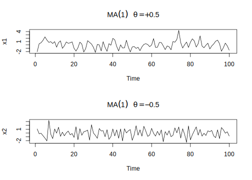
<p class="caption">(\#fig:unnamed-chunk-49)Simulación de dos modelos MA(1)</p>
</div>

### Función de autocorrelación (ACF)

Para simplificar podemos asumir que $c_0=0$, para un modelo $MA(1)$. Multiplicando el modelo por $x_{t-h}$, obtenemos

$$x_{t-h}x_t=x_{t-h}w_t-\theta_1x_{t-h}w_{t-1}$$

Tomando el valor esperado, obtenemos
\begin{eqnarray}
\gamma(h) &=& \mathbb{E}(x_{t-h}x_t) = \mathbb{E}(x_{t-h}w_t-\theta_1x_{t-h}w_{t-1}) \nonumber \\
    &=& \begin{cases}
          -\theta_1\sigma_w^2,&\text{ si }h=1 \\
          0, &\text{ si }h>1
        \end{cases}
(\#eq:eq-autocovarianza-MA1)
\end{eqnarray}

Usando el hecho de que $Var(x_t)=(1+\theta_1^2)\sigma_w^2$, obtenemos la función de autocorrelacion ACF para un modelo $MA(1)$, a saber

\begin{equation}
\rho(h) = \begin{cases}
            1,&\text{ si }h=0 \\
            \frac{-\theta_1}{1+\theta_1^2},&\text{ si }h=1 \\
            0,&\text{ si }h>1
          \end{cases}
(\#eq:eq-ACF-MA1)
\end{equation}

Entonces, para un modelo $MA(1)$, el paso 1 de la ACF es distinto de cero, y para orden o paso superior la ACF es cero. En otras palabras, la ACF de un modelo $MA(1)$ corta en paso 1. Note que $|\rho(1)|\leq1/2$ para todo valor de $\theta_1$. También, $x_t$ está correlacionado con $x_{t-1}$ pero no con $x_{t-2},x_{t-3},\ldots$. Constraste esto con el caso del modelo $AR(1)$ en el cual la correlación entre $x_t$ y $x_{t-k}$ nunca es cero, para $k>1$. 

En la figura siguiente podemos observar las funciones de autocorrelacion de los modelos $MA(1)$ simulados anteriormente


```r
par(mfrow=c(2,1))
acf(arima.sim(list(order=c(0,0,1),ma=0.5),n=100),ylab="x1",
     main=expression(MA(1)~~~theta==+0.5))
acf(arima.sim(list(order=c(0,0,1),ma=-0.5),n=100),ylab="x2",
     main=expression(MA(1)~~~theta==-0.5))
```

<div class="figure" style="text-align: center">

<p class="caption">(\#fig:unnamed-chunk-50)ACF para dos modelos MA(1)</p>
</div>

Podemos notar en cada una de las ACF, que efectivamente tienen un corte en paso 1. Para la serie con $\theta_1=0.5$, la correlación es positiva y para la serie con $\theta=-0.5$ la correlación es negativa.


Para un modelo $MA(2)$ dado por la ecuación \@ref(eq:eq-MA2) la función de autocorrelación está dada por

\begin{equation}
\rho(h) = \begin{cases}
          \frac{-\theta_1+\theta_1\theta_2}{1+\theta_1^2+\theta_2^2}, &\text{ si }h=1 \\
          \frac{-\theta_2}{1+\theta_1^2+\theta_2^2}, &\text{ si }h=2 \\
          0, &\text{ si }h>1
          \end{cases}
(\#eq:eq-ACF-MA2)
\end{equation}

En este caso, la ACF corta en paso 2. Esta propiedad la podemos generalizar a los modelos $MA(q)$. Así, para un modelo $MA(q)$ la ACF se corta en paso $q$, y vale cero para $h>q$. Consecuentemente, una serie $MA(q)$ está solo linealmente relacionada con sus $q$ primeros valores y por consiguiente es un modelo de "memoria finita". 

\BeginKnitrBlock{example}\iffalse{-91-78-111-32-117-110-105-99-105-100-97-100-32-100-101-32-109-111-100-101-108-111-115-32-77-65-32-101-32-73-110-118-101-114-116-105-98-105-108-105-100-97-100-93-}\fi{}<div class="example"><span class="example" id="exm:ejem-no-unicidad-MA"><strong>(\#exm:ejem-no-unicidad-MA)  \iffalse (No unicidad de modelos MA e Invertibilidad) \fi{} </strong></span>Usando las funciones de autocovarianza (ec.  \@ref(eq:eq-autocovarianza-MA1)) y de autocorrelación (ec. \@ref(eq:eq-ACF-MA1)) de un modelo $MA(1)$ podemos notar que $\rho(h)$ es el mismo para $\theta$ y $1/\theta$, probemos, por ejemplo, con $\theta=5$ y $\frac{1}{\theta}=\frac{1}{5}$
  
\begin{eqnarray*}
\rho(h) &=& \begin{cases}
           \frac{5}{(1+5^2)},&\text{ si }h=1 \\
           0,&\text{ si }h>1
          \end{cases} = \begin{cases}
                         \frac{5}{26},&\text{ si }h=1 \\
                         0,&\text{ si }h>1
                        \end{cases} \\
\rho(h) &=& \begin{cases}
           \frac{1/5}{(1+(1/5)^2)},&\text{ si }h=1 \\
           0,&\text{ si }h>1
          \end{cases} = \begin{cases}
                         \frac{5}{26},&\text{ si }h=1 \\
                         0,&\text{ si }h>1
                        \end{cases}
\end{eqnarray*}

Además, el par $\sigma_w^2=1$ y $\theta=5$ llevan a la misma función de autocovarianza que el par $\sigma_w^2=25$ y $\theta=1/5$, esto es

$$\gamma(h) = \begin{cases}
              26,&\text{ si }h=0\\
              5,&\text{ si }h=1\\
              0,&\text{ si }h>1
              \end{cases}$$

Entonces los procesos $MA(1)$

$$x_t=w_t+\frac{1}{5}w_{t-1}, w_t\sim iidN(0,25)\text{  y  } x_t=v_t+5v_{t-1},  v_t\sim iidN(0,1)$$

son los mismos debido a la normalidad, es decir, todas las distribuciones finitas son las mismas.
              
Para descubrir cual de los modelos es el modelo invertible, podemos invertir los papeles de $x_t$ y $w_t$ (porque estamos copiando el caso $AR$) y escribir el modelo $MA(1)$ como $w_t=-\theta w_{t-1}+x_t$. Siguiendo los pasos para \@ref(eq:eq-AR1-serie-lineal), si $|\theta|<1$, entonces $w_t=\sum_{j=0}^{\infty}(-\theta)^jx_{t-j}$, lo cual es la representación del modelo $AR$ infinito deseado. Por consiguiente, elegimos el modelo con $\sigma_w^2=25$ y $\theta=1/5$ ya que este modelo es invertible</div>\EndKnitrBlock{example}

----

## Identificación del orden de un MA

La ACF es muy útil para identificar el orden de un modelo $MA$. Para una serie de tiempo $x_t$ con ACF $\rho(h)$, si $\rho(q)\neq0$, pero $\rho(h)=0$ para $h>q$, entonces $x_t$ sigue un modelo $MA(q)$. La figura siguiente muestra el gráfico de la ACF para la serie de porcentajes de cambio diario de la Bolsa de Valores de New York del ejemplo \@ref(exm:Bolsa-Valores-New-York). Las lineas discontinuas en azul en la ACF denotan los dos límites de error estándar. Se puede notar que la serie tiene un ACF significativo en pasos 1,2 y 5, lo que nos sugiere el siguiente modelo $MA(5)$
$$x_t=c_0+w_t-\theta_1w_{t-1}-\theta_2w_{t-2}-\theta_5w_{t-5}$$

<div class="figure" style="text-align: center">

<p class="caption">(\#fig:unnamed-chunk-51)Serie de tiempo y función de autocorrelación de los porcentajes de cambio diario de la Bolsa de Valores de New York, desde el 2 de febrero de 1984 hasta el 31 de diciembre de 1991</p>
</div>

## Estimación

La estimación de máxima verosimilitud se usa comúnmente para estimar  modelos $MA$. Existen dos enfoques para evaluar la función de verosimilitud de un modelo $MA$. El primer enfoque asume que los valores iniciales, es decir, para $t\leq0$, son ceros. Como tal, los valores necesarios en el cálculo de la función de verosmilitud se obtiene recursivamente del modelo iniciando con $w_1=x_1-c_0$ y $w_2=x_2-c_0+\theta w_1$. Este enfoque se conoce como el *método de verosimilitud condicional* y las estimaciones resultantes son las estimaciones de máxima verosimilitud condicional. El segundo enfoque trata los valores iniciales en $t\leq0$ como parámetros adicionales del modelo y los estima conjuntamente con otros parámetros. Este enfoque se conoce como el *método de verosimilitud exacta*. Las estimaciones de verosimilitud exacta son preferibles a las condicionales, pero requieren un cálculo más extenso. Si el tamaño de la muestra es grande, entonces los dos tipos de estimación de máxima verosimilitud están cerca uno del otro.

## Predicciones usando modelos MA

Las predicciones con modelos MA son fáciles de obtener. Como el modelo es de "memoria finita", la predicción converge rápidamente a la media de la seire. Para ver esto, supongamos que la predicción inicia en $m$. Para la predicción de un paso de un proceso $MA(1)$, el modelo nos dice que

$$x_{m+1}=c_0+w_{m+1}-\theta_1w_m$$

Tomando el valor esperado condicional, tenemos

\begin{eqnarray*}
  \hat{x}_m(1) &=& \mathbb{E}(x_{m+1}|x_m,x_{m-1},\ldots) = c_0-\theta_1w_m \\
  e_m(1) &=& x_{m+1}-\hat{x}_m(1) = w_{m+1}
\end{eqnarray*}

La varianza del error de predicción de un paso es $Var[e_m(1)]=\sigma_w^2$. En la práctica, el valor $w_m$ lo podemos obtener de varias maneras. Por ejemplo, suponemos que $w_0=0$, entonces $w_1=x_1-c_0$ y calculamos $w_t$ para $2\leq t\leq m$ recursivamente usando $w_t=x_t-c_0+\theta_1w_{t-1}$. Alternativamente, podemos calcularlo usando la representación $AR$ del modelo $MA(1)$. (Véase el ejemplo \@ref(exm:ejem-no-unicidad-MA))

Para la predicción de dos pasos, de la ecuación

$$x_{m+2}=c_0+w_{m+2}-\theta_1w_{m+1}$$

obtenemos

\begin{eqnarray*}
  \hat{x}_m(2) &=& \mathbb{E}(x_{m+2}|x_m,x_{m-1},\ldots)=c_0\\
  e_m(2) &=& x_{m+2}-\hat{x}_m(2) = w_{m+2}-\theta_1w_{m+1}
\end{eqnarray*}

La varianza del error de predicción es $Var[e_m(2)]=(1+\theta_1^2)\sigma_m^2$, la cual es la varianza del proceso $MA$ y es mayor o igual que la varianza del error de predicción de un paso. Este resultado muestra que para un modelo $MA(1)$ la predicción de dos pasos de la serie es sencillamente la media incondicional del modelo. Esto es cierto para cualquier predicción iniciando en $m$. Más generalmente $\hat{x}_m(h)=c_0$ para $h>2$. En resumen, para un modelo $MA(1)$, la predicción de un paso a futuro con origen en $m$ es $c_0-\theta_1w_m$ y la predicción de múltiples pasos es $c_0$, el cual es la media incondicional del modelo. Si graficamos la predicción $\hat{x}_m(h)$ versus $h$ podemos ver que la predicción es una linea horizontal después del paso uno.

De manera similar, para un modelo $MA(2)$, tenemos 

$$x_{m+h} = c_0+w_{m+h}-\theta_1w_{m+h-1}-\theta_2w_{m+h-2}$$

para el cual obtenemos

\begin{eqnarray*}
 \hat{x}_m(1) &=& c_0-\theta_1w_m-\theta_2w_{m-1} \\
 \hat{x}_m(2) &=& c_0-\theta_2w_m \\
 \hat{x}_m(h) &=& c_0\text{, para }h>2
\end{eqnarray*}

Entonces, la predicción de múltiples pasos de un modelo $MA(2)$ tiende a la media de la serie después de dos pasos. La varianza del error de predicción converge a la varianza de la serie después de dos pasos. En general, para un modelo $MA(q)$, la predicción multipasos converge a la media de la serie después de los primeros $q$ pasos.

----

** Resumen **

Para concluir daremos un resumen de las propiedades estudiadas para los modelos $AR$ y $MA$ en estos dos capítulos:

- Para los modelos $MA$, la ACF es útil para especificar el orden dado que la ACF se corta en salto $q$ para una serie $MA(q)$.

- Para un modelo $AR$, la PACF es útil para determinar el orden ya que la PACF se corta en salto $p$ para un proceso $AR(p)$.

- Una serie $MA$ es siempre estacionaria, pero para que una serie $AR$ sea estacionaria, todas sus raíces características deben ser menor que u1 en módulo.

- Para una serie estacionaria, la predicción de múltiples pasos converge a la media de la serie y la varianza del error de predicción converge a la varianza de la serie.


 


<!--chapter:end:302-modelos-MA.Rmd-->

#  Modelos ARMA

En el capítulo 2, introdujimos las funciones de autocorrelación y correlación cruzada (ACFs y CCFs) como herramientas para clarificar las relaciones que pueden ocurrir dentro y entre las series de tiempo en varios rezagos. Además, explicamos cómo construir modelos lineales basado en la teoría clásica de regresión para la explotación de las asociaciones indicadas por los valores grandes de la ACF o CCF. Los métodos de este capítulo, en dominio del tiempo, o de regresión, son apropiados cuando se trata de posiblemente no estacionaridad con series de tiempo cortas; estas series son la regla y no la excepción en muchas aplicaciones. 

La regresión clásica es a menudo insuficiente para explicar todas las dinámicas interesantes de una serie de tiempo. Por ejemplo, la ACF de los residuos del ajuste de regresión lineal simple a los datos globales de la temperatura (véase el Ejemplo \@ref(exm:ejem-temperatura-global) del capítulo 2, Sección 2.3.1) revela una estructura adicional en los datos que la regresión no captura. En lugar de ello, la introducción de correlación como un fenómeno que se puede generar a través de relaciones lineales retardadas lleva a proponer los modelos autorregresivo (AR) y autorregresivo de promedio móvil (ARMA). Añadiendo modelos no estacionarios a la combinación conduce al modelo autorregresivo integrado de media móvil (ARIMA) popularizado en el destacado trabajo de Box y Jenkins (1970). El método de Box-Jenkins para la identificación de un posible modelo ARIMA se da en el siguiente capítulo junto con técnicas para la estimación de parámetros y la previsión para estos modelos.

El modelo de regresión clásico del Capítulo 3 fue desarrollado para el caso estático, es decir, que sólo permite que la variable dependiente sea influenciada por los valores actuales de las variables independientes. En el caso de series de tiempo, es deseable permitir que la variable dependiente sea influenciada por los valores pasados de las variables independientes y posiblemente por sus propios valores pasados. Si el presente puede ser modelado plausiblemente en términos de sólo los valores pasados de las entradas independientes, tenemos la atractiva posibilidad de que la predicción será posible.

Ahora procederemos con un desarrollo más general de modelos autoregresivos, de promedio móvil y mezcla de ambos modelos para series de tiempo estacionarias.

\BeginKnitrBlock{definition}<div class="definition"><span class="definition" id="def:defi-modelo-ARMA"><strong>(\#def:defi-modelo-ARMA) </strong></span>Una serie de tiempo $\{x_t; t=0,\pm1,\pm2,\ldots\}$ es un *proceso autoregresivo de promedio móvil*, denotado $ARMA(p,q)$, si es estacionario y

\begin{equation}
    x_t=\phi_1x_{t-1}+\cdots+\phi_px_{t-p}+w_t+\theta_1w_{t-1}+\cdots+\theta_qw_{t-q}
(\#eq:eq-modelo-ARMA)
\end{equation}

con $\phi_p\neq0,\theta_q\neq0$ y $\sigma_w^2>0$. Los parámetros $p$ y $q$ son llamados ordenes autoregresivos y de promedio móvil respectivamente. Si $x_t$ tiene media $\mu$ distinto de cero, hacemos $\alpha=\mu(1-\phi_1-\cdots-\phi_p)$ y escribimos el modelo como

\begin{equation}
    x_t=\alpha+\phi_1x_{t-1}+\cdots+\phi_px_{t-p}+w_t+\theta_1w_{t-1}+\cdots+\theta_qw_{t-q}
(\#eq:eq-modelo-ARMA-media-no-cero)
\end{equation}

A menos que se declare lo contrario, $\{w_t;t=0,\pm1,\pm2,\ldots\}$ es una sucesión de ruido blanco gaussiano.</div>\EndKnitrBlock{definition}

----

Como se observó previamente, cuando $q=0$, el modelo es llamado modelo autoregresivo de orden $p$, AR(p), y cuando $p=0$ el modelo es llamado modelo de promedio móvil de orden $q$ MA(q). Como ayuda en la investigación de los modelos ARMA, será útil escribir estos usando el operador AR \@ref(eq:eq-operador-autoregresivo) y el operador MA \@ref(eq:eq-operador-promedio-movil). En particular el modelo ARMA(p,q) en \@ref(eq:eq-modelo-ARMA) se puede escribir en forma concisa como

\begin{equation}
    \phi(B)x_t=\theta(B)w_t
(\#eq:eq-modelo-ARMA-conciso)
\end{equation}

Antes de discutir las condiciones bajo la cual \@ref(eq:eq-modelo-ARMA) es causal e invertible, veamos un potencial problema con el modelo ARMA.

\BeginKnitrBlock{example}<div class="example"><span class="example" id="exm:ejem-modelo-econometria"><strong>(\#exm:ejem-modelo-econometria) </strong></span>En econometría, es usual considerar modelos dinámicos del siguiente tipo; llamemos $x_1,\ldots,x_r$ a la característica numérica de interés en un sector económico arbitrario dado (precios, nivel de producción, ingresos, inversiones, etc.), asumiendo por ejemplo que las observaciones son anuales. Para el año $n$ existe un vector asociado $X(n)$ con coordenadas $x_1(n),\ldots,x_r(n)$. Asumimos que $X(n)$ verifica la recursión lineal del tipo
$$X(n) = A_0X(n)+A_1X(n-1)+\cdots+A_jX(n-j)$$
donde $A_0,\ldots,A_j$ son matrices, pero esa relación \emph{ideal} es perturbada por un efecto aleatorio $w(n)$ con media cero, no correlacionado para diferentes años. Entonces $X(n)$ llega a ser un vector aleatorio que verifica

\begin{equation}
X(n) = \sum_{k=0}^jA_kX(n-k) + w(n).
(\#eq:eq-vector-aleatorio-ejemplo-econometria)
\end{equation}

Se puede demostrar, con unas pocas restricciones sobre los $A_k$, que si $w(n)$ es un ruido blanco, entonces existe un proceso estacionario $X(n)$ que satisface \@ref(eq:eq-vector-aleatorio-ejemplo-econometria) tal que para cada $i=1,\ldots,r$, $x_i(n)$ es un proceso ARMA.
</div>\EndKnitrBlock{example}


\BeginKnitrBlock{example}\iffalse{-91-82-101-100-117-110-100-97-110-99-105-97-32-100-101-32-80-97-114-225-109-101-116-114-111-93-}\fi{}<div class="example"><span class="example" id="exm:ejem-redundancia-parametro"><strong>(\#exm:ejem-redundancia-parametro)  \iffalse (Redundancia de Parámetro) \fi{} </strong></span>Considere un proceso de ruido blanco $x_t=w_t$. Equivalentemente podemos escribir este como $0.5x_{t-1}=0.5w_{t-1}$ utilizando el operador de cambio una vez y multiplicando por 0.5. Ahora, restamos las dos representaciones para obtener

\begin{equation}
    x_t-0.5x_{t-1}=w_t-0.5w_{t-1}\text{ ó }x_t=0.5x_{t-1}-0.5w_{t-1}+w_t
(\#eq:eq-redundancia-parametro-ARMA11)
\end{equation}

el cual luce como un modelo ARMA(1,1). De hecho, $x_t$ es todavía un ruido blanco; nada ha cambiado en esta consideración [esto es, $x_t=w_t$ es la solución de \@ref(eq:eq-redundancia-parametro-ARMA11), pero hemos escondido el hecho de que $x_t$ es un ruido blanco debido al parámetro de redundancia o sobre-parametrización.

Escribiendo el parámetro de redundancia en la forma de operador como $\phi(B)x_t=\theta(B)w_t$ o
$$(1-0.5B)x_t=(1-0.5B)w_t$$
Aplicando el operador $\phi(B)^{-1}=(1-0.5B)^{-1}$ a ambos lados de la igualdad, obtenemos
$$x_t=(1-0.5B)^{-1}(1-0.5B)x_t=(1-0.5B)^{-1}(1-0.5B)w_t=w_t$$
el cual es el modelo original.

Podemos fácilmente detectar el problema de sobre-parametrización con el uso de los operadores o sus polinomios asociados. Esto es, escribimos el polinomio AR $\phi(z)=(1-0.5z)$, el polinomio MA $\theta(z)=(1-0.5z)$ y note que ambos polinomios tienen un factor común, este es $(1-0.5z)$. Este factor común identifica los parámetros de redundancia de inmediato. Descartando el factor en cada uno, nos queda $\phi(z)=1$ y $\theta(z)=1$ de donde se concluye que $\phi(B)=1$ y $\theta(B)=1$, y deducimos que el modelo es un ruido blanco. La consideración de parámetros de redundancia será crucial cuando discutamos la estimación de modelo ARMA en general. Como apuntó este ejemplo, podemos fijar un modelo ARMA(1,1) a un ruido blanco y conseguir que los parámetros estimados sean significativos. Si no fuéramos conscientes de la redundancia de parámetros, se podría alegar que los datos están correlacionados, cuando en realidad no lo son.
</div>\EndKnitrBlock{example}

----

Los ejemplos \@ref(exm:ejem-modelo-AR-explosivo-causal), \@ref(exm:ejem-no-unicidad-MA) y \@ref(exm:ejem-redundancia-parametro) señalan un número de problemas con la definición general de los modelos ARMA(p,q) dados por \@ref(eq:eq-modelo-ARMA) o equivalentemente por \@ref(eq:eq-modelo-ARMA-conciso). En resumen, tenemos los siguientes problemas:

1) Modelos de parámetros redundantes,

2) Modelos AR estacionarios que dependen del futuro, y

3) Modelos MA que no son únicos.


Para resolver estos problemas, requeriremos algunas restricciones adicionales sobre los parámetros de los modelos, pero primero, daremos las siguientes definiciones:

\BeginKnitrBlock{definition}<div class="definition"><span class="definition" id="def:defi-polinomios-AR-MA"><strong>(\#def:defi-polinomios-AR-MA) </strong></span>Los *Polinomios AR y MA* se definen como

\begin{equation}
    \phi(z)=1-\phi_1z-\cdots-\phi_pz^p\text{, }\phi_p\neq0
(\#eq:eq-polinomio-AR)
\end{equation}

y

\begin{equation}
    \theta(z)=1+\theta_1z+\cdots+\theta_qz^q\text{, }\theta_q\neq0
(\#eq:eq-polinomio-MA)
\end{equation}

respectivamente, donde $z$ es un número complejo.</div>\EndKnitrBlock{definition}

----

Para abordar el primer problema (Modelos de parámetros redundantes), de ahora en adelante nos referiremos a un modelo $ARMA(p,q)$ el sentido de su forma más simple. Esto es, además de la definición original dada en la ecuación \@ref(eq:eq-modelo-ARMA), requeriremos también que $\phi(z)$ y $\theta(z)$ no tengan factores comunes. Así, el proceso $x_t=0.5x_{t-1}-0.5w_{t-1}+w_t$ discutido en el ejemplo \@ref(exm:ejem-redundancia-parametro) no se refiere a un proceso ARMA(1,1) porque en su forma reducida $x_t$ es un ruido blanco.

Para resolver el problema del modelo con dependencia del futuro, introduciremos formalmente el concepto de causalidad.

\BeginKnitrBlock{definition}<div class="definition"><span class="definition" id="def:defi-causalidad"><strong>(\#def:defi-causalidad) </strong></span>Un modelo ARMA(p,q), $\phi(B)x_t=\theta(B)w_t$, se dice que es *causal* si la serie de tiempo $\{x_t:t=0,\pm1,\pm2,\ldots\}$ se puede escribir como un proceso lineal de un lado, esto es

\begin{equation}
    x_t=\sum_{j=0}^{\infty}\psi_jw_{t-j}=\psi(B)w_t
(\#eq:eq-modelo-causal)
\end{equation}

donde $\psi(B)=\sum_{j=0}^{\infty}\psi_jB^j$ y $\sum_{j=0}^{\infty}|\psi_j|<\infty$; haciendo $\psi_0=1$</div>\EndKnitrBlock{definition}

----

En el ejemplo \@ref(exm:ejem-modelo-AR-explosivo-causal) el proceso $AR(1)$ $x_t=\phi z_{t-1}+w_t$ es causal solo cuando $|\phi|<1$. Equivalentemente, el proceso es causal sólo cuando la raíz de $\phi(z)=1-\phi z$ es mayor que uno en valor absoluto. Esto es, la raíz $z_0$ de $\phi(z)$ es $z_0=1/\phi$ (porque $\phi(z_0)=0$) y $|z_0|>1$, porque $|\phi|<1$.


\BeginKnitrBlock{definition}<div class="definition"><span class="definition" id="def:defi-modelo-invertible"><strong>(\#def:defi-modelo-invertible) </strong></span>Un modelo ARMA(p,q) $\phi(B)x_t=\theta(B)w_t$ se dice *invertible* si la serie de tiempo $\{x_t:t=0,\pm1,\pm2,\ldots\}$ se puede escribir como
\begin{equation}
    \pi(B)x_t=\sum_{j=0}^{\infty}\pi_jx_{t-j}=w_t
(\#eq:eq-modelo-invertible)
\end{equation}

donde $\pi(B)=\sum_{j=0}^{\infty}\pi_jB^j$ y $\sum_{j=0}^{\infty}|\pi_j|<\infty$; hacemos $\pi_0=1$</div>\EndKnitrBlock{definition}

## Propiedades de los modelos ARMA(p,q)

\BeginKnitrBlock{proposition}\iffalse{-91-80-114-111-112-105-101-100-97-100-32-49-58-32-67-97-117-115-97-108-105-100-97-100-93-}\fi{}<div class="proposition"><span class="proposition" id="prp:propiedad-causalidad-ARMApq"><strong>(\#prp:propiedad-causalidad-ARMApq)  \iffalse (Propiedad 1: Causalidad) \fi{} </strong></span>Un modelo ARMA(p,q) es causal si y solo si $\phi(z)\neq0$ para $|z|\leq1$. El coeficiente del proceso lineal dado en \@ref(eq:eq-modelo-causal) se puede determinar resolviendo

$$\psi(z)=\sum_{j=0}^{\infty}\psi_jz^j=\frac{\theta(z)}{\phi(z)}\text{, }|z|<1.$$

Otra manera de ver la propiedad 1, es que un *modelo ARMA es causal sólo cuando las raíces de $\phi(z)$ están fuera del círculo unitario*, esto es $\phi(z)=0$ sólo cuando $|z|>1$.</div>\EndKnitrBlock{proposition}

---- 

\BeginKnitrBlock{proof}<div class="proof">\iffalse{} <span class="proof"><em>Demostración. </em></span>  \fi{}Supongamos primero que las raíces de $\phi(z)$, digamos $z_1,\ldots,z_p$, están fuera del círculo unitario. Escribimos las raíces en el siguiente orden $1<|<_1|\leq|z_2|\leq\ldots\leq|z_p|$, note que $z_1,\ldots,z_p$ no son necesariamente únicas, y hacemos $|z_1|=1+\epsilon$, para algún $\epsilon>0$. Entonces, $\phi(z)\neq0$ siempre que $|z|<|z_1|=1+\epsilon$ y por consiguiente, $\phi^{-1}(z)$ existe y tiene un desarrollo en serie de potencias

$$\frac{1}{\phi(z)} = \sum_{j=0}^{\infty}a_jz^j,\quad |z|<1+\epsilon.$$

Ahora, elegimos un valor de $\delta$ tal que $0<\delta<\epsilon$, y hacemos $z=1+\delta$, el cual está dentro del radio de convergencia. Se sigue entonces que
      
\begin{equation}
  \phi^{-1}(1+\delta) = \sum_{j=0}^{\infty}a_j(1+\delta)^j<\infty.
(\#eq:eq-convergencia-phi)
\end{equation}
      
Así, podemos cada término de la suma en \@ref(eq:eq-convergencia-phi) por una constante, sea esta $|a_j(1+\delta)^j|<c$, para $c>0$. Por consiguiente, $|a_j|<c(1+\delta)^{-j}$, de donde se sigue que
      
\begin{equation}
  \sum_{j=0}^{\infty}|a_j|<\infty.
(\#eq:eq-convergencia-aj)
\end{equation}
      
En consecuencia, $\phi^{-1}(B)$ existe y podemos aplicar este a ambos lados del modelo ARMA, $\phi(B)x_t=\theta(B)w_t$, para obtener
      
$$x_t = \phi^{-1}(B)\phi(B)x_t = \phi^{-1}(B)\theta(B)w_t.$$
      
Entonces, haciendo $\psi(B)=\phi^{-1}(B)\theta(B)$, tenemos
      
$$x_t = \psi(B)w_t = \sum_{j=0}^{\infty}\psi_jw_{t-j},$$
      
donde los $\psi$-pesos, los cuales son absolutamente sumables, pueden ser evaluados por medio de $\psi(z) = \phi^{-1}(z)\theta(z)$ para $|z|\leq1$.

Ahora, supongamos que $x_t$ es un proceso causal, esto es, el proceso tiene la representación

$$x_t = \sum_{j=0}^{\infty}\psi_jw_{t-j},\quad\text{con}\quad \sum_{j=0}^{\infty}|\psi_j|<\infty.$$

En este caso, escribimos

$$x_t = \psi(B)w_t,$$

y multiplicando a ambos lados por $\phi(B)$ nos queda

\begin{equation}
  \phi(B)x_t = \phi(B)\psi(B)w_t.
(\#eq:eq-modelo-causal-conciso)
\end{equation}

Además de \@ref(eq:eq-modelo-causal-conciso), el modelo ARMA se puede escribir como

\begin{equation}
  \phi(B)x_t = \theta(B)w_t.
(\#eq:eq-modelo-ARMA-conciso2)
\end{equation}

De \@ref(eq:eq-modelo-causal-conciso) y \@ref(eq:eq-modelo-ARMA-conciso2), notamos que

\begin{equation}
  \phi(B)\psi(B)w_t = \theta(B)w_t.
(\#eq:eq-B15)
\end{equation}

Ahora, sea
$$a(z) = \phi(z)\psi(z) = \sum_{j=0}^{\infty}a_jz^j,\quad |z|\leq1$$
y, por consiguiente, podemos escribir \@ref(eq:eq-B15) como

\begin{equation}
  \sum_{j=0}^{\infty}a_jw_{t-j} = \sum_{j=0}^{q}\theta_jw_{t-j}.
(\#eq:eq-B16)
\end{equation}

A continuación, multiplicamos ambos lados de \@ref(eq:eq-B16) por $w_{t-h}$, para $h=0,1,2,\ldots$, y tomamos esperanza. Haciendo esto, obtenemos

\begin{eqnarray}
  a_h &=& \theta_h,\quad h=0,1,\ldots,q \nonumber \\
  a_h &=& 0, \quad h>q. (\#eq:eq-B17)
\end{eqnarray}

De \@ref(eq:eq-B17) concluimos que

\begin{equation}
  \phi(z)\psi(z) = a(z) = \theta(z),\quad |z|\leq1.
(\#eq:eq-igualdad-phi-psi-theta)
\end{equation}

Si existe un número en el círculo unitario, digamos $z_0$, para el cual $\phi(z_0)=0$, entonces por \@ref(eq:eq-igualdad-phi-psi-theta), $\theta(z_0)=0$. Pero, si existe tal $z_0$ entonces $\phi(z)$ y $\theta(z)$ tienen un factor común lo cual no es posible. En consecuencia, podemos escribir $\psi(z) = \theta(z)/\phi(z)$. Además, por hipótesis, tenemos que $|\psi(z)|<\infty$ para $|z|\leq1$, y por lo tanto

\begin{equation}
  |\psi(z)| = \left|\frac{\theta(z)}{\phi(z)}\right|<\infty,\text{ para }|z|\leq1.
(\#eq:eq-B19)
\end{equation}

Finalmente, la ecuación \@ref(eq:eq-B19) implica que $\phi(z)\neq0$ para $|z|\leq1$; esto es, las raíces de $\phi(z)$ están fuera del círculo unitario.</div>\EndKnitrBlock{proof}

----

\BeginKnitrBlock{proposition}\iffalse{-91-80-114-111-112-105-101-100-97-100-32-50-58-32-73-110-118-101-114-116-105-98-105-108-105-100-97-100-93-}\fi{}<div class="proposition"><span class="proposition" id="prp:propiedad-invertibilidad-ARMApq"><strong>(\#prp:propiedad-invertibilidad-ARMApq)  \iffalse (Propiedad 2: Invertibilidad) \fi{} </strong></span>Un modelo ARMA(p,q) es *invertible* si y solo si $\theta(z)\neq0$ para $|z|\leq1$. El coeficiente $\pi_j$ de $\pi(B)$ dado en \@ref(eq:eq-modelo-invertible) se puede determinar al resolver

$$\pi(z)=\sum_{j=0}^{\infty}\pi_jz^j=\frac{\phi(z)}{\theta(z)}\text{, }|z|\leq1.$$

  Otra manera de escribir la propiedad 2, es que un *proceso ARMA es invertible solo cuando las raíces de $\theta(z)$ están fuera del círculo unitario*; esto es, $\theta(z)=0$ sólo cuando $|z|>1$.</div>\EndKnitrBlock{proposition}

----

\BeginKnitrBlock{proof}<div class="proof">\iffalse{} <span class="proof"><em>Demostración. </em></span>  \fi{}La demostración de esta propiedad es similar a la propiedad 1, y se deja como ejercicio.</div>\EndKnitrBlock{proof}

----

\BeginKnitrBlock{example}\iffalse{-91-82-101-100-117-110-100-97-110-99-105-97-32-100-101-32-80-97-114-225-109-101-116-114-111-115-44-32-67-97-117-115-97-108-105-100-97-100-32-101-32-73-110-118-101-114-116-105-98-105-108-105-100-97-100-93-}\fi{}<div class="example"><span class="example" id="exm:ejem-redundancia-causalidad-invertibilidad"><strong>(\#exm:ejem-redundancia-causalidad-invertibilidad)  \iffalse (Redundancia de Parámetros, Causalidad e Invertibilidad) \fi{} </strong></span>

Considere el proceso

$$x_t=0.4x_{t-1}+0.45x_{t-2}+w_t+w_{t-1}+0.25w_{t-2}$$

o, en la forma operador

$$(1-0.4B-0.45B^2)x_t=(1+B+0.25B^2)w_t$$

A primera vista $x_t$ parece ser un proceso ARMA(2,2). Pero, los polinomios asociados

\begin{eqnarray*}
\phi(z) &=& 1-0.4z-0.45z^2=(1+0.5z)(1-0.9z)
\theta(z) &=& (1+z+0.25z^2)=(1+0.5z)^2
\end{eqnarray*}

tienen un factor común que se puede cancelar.

Después de cancelar los factores comunes, los polinomios quedan $\phi(z)=(1-0.9z)$ y $\theta(z)=(1+0.5z)$, de modo que el modelo es un proceso ARMA(1,1) $(1-0.9B)x_t=(1+0.5B)w_t$ o

\begin{equation}
  x_t=0.9x_{t-1}+0.5w_{t-1}+w_t
(\#eq:eq-ejemplo-ARMA11)
\end{equation}

El modelo es causal, porque $\phi(z)=(1-0.9z)=0$ cuando $z=10/9$ que está fuera del círculo unitario. El modelo también es invertible porque la raíz de $\theta(z)=(1+0.5z)$ es $z=-2$ que también está fuera del circulo unitario.

Para escribir el modelo como un proceso lineal, podemos obtener los $\psi$-pesos usando la proposición \@ref(prp:propiedad-causalidad-ARMApq):

\begin{eqnarray*}
\psi(z) &=& \frac{\theta(z)}{\phi(z)}=\frac{(1+0.5z)}{(1-0.9z)} \\
        &=& (1+0.5z)(1+0.9z+0.9^2z^2+0.9^3z^3+\cdots)\text{ }|z|\leq1
\end{eqnarray*}

El coeficiente de $z^j$ en $\psi(z)$ es $\psi_j=(0.5+0.9)0.9^{j-1}$, para $j\geq1$, así, podemos escribir (\ref{eq-ejemplo-ARMA11}) como

$$x_t=w_t+1.4\sum_{j=0}^{\infty}0.9^{j-1}w_{t-j}$$

Similarmente, para hallar la representación invertible usando la proposición \@ref(prp:propiedad-invertibilidad-ARMApq):
  
$$\pi(z)=\frac{\phi(z)}{\theta(z)}=(1-0.9z)(1-0.5z+0.5^2z^2-0.5^3z^3+\cdots)\text{ }|z|\leq1.$$

En este caso, los $\pi$-pesos están dados por  $\pi_j=(-1)^j(0.9+0.5)0.5^{j-1}$ para $j\geq1$ y por lo tanto, podemos escribir \@ref(eq:eq-ejemplo-ARMA11) como

$$x_t=1.4\sum_{j=0}^{\infty}(-0.5)^{j-1}x_{t-j}+w_t$$</div>\EndKnitrBlock{example}

----

La PACF para los modelos $MA$ se comporta como el ACF para los modelos $AR$. También, la PACF para modelos $AR$ se comporta como la ACF para modelos $MA$. Debido a que un modelo ARMA invertible tiene una representación $AR$ infinita, la PACF no tendrá corte. Resumimos estos resultados en la tabla siguiente


|   | AR(p)  |  MA(q) | ARMA(p,q)  |
|---|:-:|:-:|:-:|
| ACF   | Disminución  |  Corte después | Disminución  |
|   | gradual  | de paso $q$  | gradual  |
| PACF  | Corte después  | Disminución  | Disminución  |
|   | de paso $q$  | gradual  | gradual  |


## Ecuaciones en Diferencias

El estudio del comportamiento de los procesos ARMA es mucho mejor si se tiene un conocimiento básico de ecuaciones en diferencias, simplemente porque los procesos ARMA son ecuaciones en diferencias. Este tópico será también muy útil para el estudio de los modelos en dominio del tiempo y procesos estocásticos en general. Vamos a dar una breve y heurística reseña del tema junto con algunos ejemplos de la utilidad de la teoría.

Supongamos que tenemos una sucesión de números $u_0,u_1,u_2,\ldots$ tal que

\begin{equation}
    u_n-\alpha u_{n-1}=0\text{, }\alpha\neq0\text{, }n=1,2,\ldots
(\#eq:eq-sucesion-u-n)
\end{equation}

Por ejemplo, recuerde \@ref(eq:eq-ACF-AR1), en la cual mostramos que la ACF de un proceso AR(1) es una sucesión $\rho(h)$ que satisface

$$\rho(h)=\phi\rho(h-1)=0\text{, para }h=1,2\ldots$$
La ecuación \@ref(eq:eq-sucesion-u-n) representa un ecuación en diferencias homogénea de orden 1. Para resolver la ecuación, escribimos

\begin{eqnarray*}
  u_1 &=& \alpha u_0 \\
  u_2 &=& \alpha u_1 = \alpha^2u_0 \\
      &\vdots&  \\
  u_n &=& \alpha u_{n-1} = \alpha^nu_0.
\end{eqnarray*}

Dando una condición inicial $u_0=c$ podemos resolver \@ref(eq:eq-sucesion-u-n), sea esta $u_n=\alpha^nc$.

En la notación de operador, \@ref(eq:eq-sucesion-u-n) se puede escribir como $(1-\alpha B)u_n=0$. El polinomio asociado a \@ref(eq:eq-sucesion-u-n) es $\alpha(z)=1-\alpha z$, y las raíz $z_0$ del polinomio es $z_0=1/\alpha$, esto es $\alpha(z_0)=0$.

Conocemos la solución de \@ref(eq:eq-sucesion-u-n) con condición inicial $u_0=c$, esta es

$$u_n=\alpha^nc=(z_0^{-1})^nc.$$

Esto es, la solución de la ecuación en diferencias \@ref(eq:eq-sucesion-u-n) solo depende de la condición inicial y de la inversa de la raíz del polinomio asociado $\alpha(z)$.

Supóngase ahora que la sucesión satisface

\begin{equation}
    u_n-\alpha_1u_{n-1}-\alpha_2u_{n-2}=0\text{, }\alpha_2\neq0\text{, }n=2,3,\ldots
(\#eq:eq-sucesion-u-n-2)
\end{equation}

Esta ecuación es una ecuación en diferencias homogénea de orden 2. El correspondiente polinomio es

$$\alpha(z)=1-\alpha_1z-\alpha_2z^2$$
el cual tiene dos raíces $z_1$ y $z_2$, tal que $\alpha(z_1)=\alpha(z_2)=0$.

Consideremos dos casos:

- **Caso 1:** $z_1\neq z_2$.} La solución general en este caso es
    \begin{equation}
        u_n=c_1z_1^{-n}+c_2z_2^{-n}
    (\#eq:eq-solucio-u-n-raices-distintas)
    \end{equation}
    donde $c_1$ y $c_2$ dependen de las condiciones iniciales. Esta afirmación puede ser verificada por la sustitución directa de \@ref(eq:eq-solucio-u-n-raices-distintas) en \@ref(eq:eq-sucesion-u-n-2):
    \begin{eqnarray*}
    c_1z_1^{-n}+c_2z_2^{-n} &-& \alpha_1\left(c_1z_1^{-(n-1)}+c_2z_2^{-(n-1)}\right)-\alpha_2\left(c_1z_1^{-(n-2)}+c_2z_2^{-(n-2)}\right) \\
         &=& c_1z_1^{-n}(1-\alpha_1z_1-\alpha_2z_1^2)+c_2z_2^{-n}((1-\alpha_1z_2-\alpha_2z_2^2) \\
         &=& c_1z_1^{-n}\alpha(z_1)+c_2z_2^{-n}\alpha(z_2) \\
         &=& 0.
    \end{eqnarray*}
    Dando dos condiciones iniciales $u_0$ y $u_1$ podemos resolver para $c_1$ y $c_2$:
    \begin{eqnarray*}
        u_0 &=& c_1+c_2 \\
        u_1 &=& c_1z_1^{-1}+c_2z_2^{-1}
    \end{eqnarray*}
    donde $z_1$ y $z_2$ se pueden resolver en términos de $\alpha_1$ y $\alpha_2$ usando la fórmula cuadrática por ejemplo.

- **Caso 2:** $z_1=z_2 (=z_0)$. En este caso la solución general de \@ref(eq:eq-sucesion-u-n-2) es
    \begin{equation}
        u_n=z_0^{-n}(c_1+c_2n)
        (\#eq:eq-solucio-u-n-raices-iguales)
    \end{equation}
    Esta afirmación se puede verificar por sustitución directa de \@ref(eq:eq-solucio-u-n-raices-iguales) en \@ref(eq:eq-sucesion-u-n-2):
    \begin{eqnarray*}
    z_0^{-n}(c_1+c_2n) &-& \alpha_1\left(z_0^{-(n-1)}[c_1+c_2(n-1)]\right)-\alpha_2\left(z_0^{-(n-2)}[c_1+c_2(n-2)]\right) \\
         &=& z_0^{-n}(c_1+c_2n)(1-\alpha_1z_0-\alpha_2z_0^2)+c_2z_0^{-n+1}(\alpha_1+2\alpha_2z_0) \\
         &=& c_2z_0^{-n+1}(\alpha_1+2\alpha_2z_0).
    \end{eqnarray*}
    Para demostrar que $(\alpha_1+2\alpha_2z_0)=0$, escribimos $1-\alpha_1z-\alpha_2z^2=(1-z_0^{-1}z)^2$ y derivamos respecto de $z$ en ambos lados de la ecuación para obtener $(\alpha_1+2\alpha_2z)=2z_0^{-1}(1-z_0^{-1}z)$. Entonces $(\alpha_1+2\alpha_2z_0)=2z_0^{-1}(1-z_0^{-1}z_0)=0$.
    Finalmente, dando dos condiciones iniciales $u_0$ y $u_1$ podemos resolver para $c_1$ y $c_2$;
    \begin{eqnarray*}
        u_0 &=& c_1 \\
        u_1 &=& (c_1+c_2)z_0^{-1}
    \end{eqnarray*}


Resumiendo:

En el caso de raíces distintas, la solución de la ecuación en diferencias homogénea de grado 2 es
\begin{eqnarray*}
  u_n &=& z_1^{-n}\times(\text{un polinomio en } n \text{ de grado }m_1-1) \\
      &+& z_2^{-n}\times(\text{un polinomio en } n \text{ de grado }m_2-1)
\end{eqnarray*}
donde $m_1$ es la multiplicidad de la raíz $z_1$ y $m_2$ es la multiplicidad de la raíz $z_2$. En este ejemplo, se tiene $m_1=m_2=1$ y decimos que $c_1$ y $c_2$ son polinomios de grado cero respectivamente.

En el caso de raíces repetidas, la solución es
$$u_n=z_0^{-n}\times(\text{un polinomio en } n \text{ de grado }m_0-1),$$
donde $m_0$ es la multiplicidad de la raíz $z_0$; esto es $m_0=2$. En este caso, escribimos el polinomio de grado uno como $c_1+c_2n$. En ambos casos, resolvimos $c_1$ y $c_2$ dando dos condiciones iniciales $u_0$ y $u_1$.

Veamos a continuacion algunos ejemplos de uso de las ecuaciones en diferencias, los dos primeros veremos la aplicación a procesos $AR(2)$, y posteriormente daremos un ejemplo de uso para modelos ARMA.

\BeginKnitrBlock{example}\iffalse{-91-76-97-32-65-67-70-32-100-101-32-117-110-32-112-114-111-99-101-115-111-32-65-82-40-50-41-93-}\fi{}<div class="example"><span class="example" id="exm:ejem-ACF-AR2"><strong>(\#exm:ejem-ACF-AR2)  \iffalse (La ACF de un proceso AR(2)) \fi{} </strong></span>
Supóngase que $x_t=\phi_1x_{t-1}+\phi_2x_{t-2}+w_t$ es un proceso $AR(2)$ causal. Multiplicando ambos lados del modelo por $x_{t-h}$ para $h>0$, tomando esperanza:

$$\mathbb{E}(x_tx_{t-h})=\phi_1\mathbb{E}(x_{t-1}x_{t-h})+\phi_2\mathbb{E}(x_{t-2}x_{t-h})+\mathbb{E}(w_tx_{t-h})$$

El resultado es

\begin{equation}
    \gamma(h)=\phi_1\gamma(h-1)+\phi_2\gamma(h-2)\text{, para }h=1,2,\ldots
(\#eq:eq-autocovarianza-AR2)
\end{equation}

En \@ref(eq:eq-autocovarianza-AR2) estamos usando el hecho de que $\mathbb{E}(x_t)=0$ y para $h>0$,

$$\mathbb{E}(w_tx_{t-h})=\mathbb{E}\left(w_t\sum_{j=0}^{\infty}\psi_jw_{t-h-j}\right)=0.$$

Dividimos \@ref(eq:eq-autocovarianza-AR2) por $\gamma(0)$ para obtener la ecuación en diferencia de la ACF del proceso:

\begin{equation}
  \rho(h)-\phi_1\rho(h-1)-\phi_2\rho(h-2)=0\text{, con }h=1,2,\ldots.
(\#eq:eq-ACF-AR2)
\end{equation}

Las condiciones iniciales son $\rho(0)=1$ y $\rho(-1)=\phi_1/(1-\phi_2)$, lo cual se obtiene evaluando $h=1$ en \@ref(eq:eq-ACF-AR2) y observando que $\rho(1)=\rho(-1)$.

Usando los resultados para la ecuación en diferencias homogénea de orden dos, sean $z_1$ y $z_2$ las raíces del polinomio asociado $\phi(z)=1-\phi_1z-\phi_2z^2$. Como el modelo es causal sabemos que las raíces están fuera del círculo unitario: $|z_1|>1$ y $|z_2|>1$. Ahora consideremos la solución para los tres casos:

- **Caso 1:** Cuando $z_1$ y $z_2$ son reales y distintos, entonces $$\rho(h)=c_1z_1^{-h}+c_2z_2^{-h},$$ de modo que $\rho(h)\to0$ exponencialmente cuando $h\to\infty$.

- **Caso 2:** Cuando $z_1=z_2(=z_0)$ son reales e iguales, entonces $$\rho(h)=z_0^{-h}(c_1+c_2h),$$ de modo que $\rho(h)\to0$ exponencialmente cuando $h\to\infty$.

- **Caso 3:** Cuando $z_1=\bar{z}_2$ son complejas conjugadas, entonces $c_2=\bar{c}_1$ (porque $\rho(h)$ es real) y $$\rho(h)=c_1z_1^{-h}+\bar{c}_1\bar{z}_1^{-h}.$$
  Escribiendo $c_1$ y $z_1$ en coordenadas polares, por ejemplo $z_1=|z_1|e^{i\theta}$ donde $\theta$ es el ángulo cuya tangente es el radio de la parte imaginaria y la parte real de $z_1$; el rango de $\theta$ es $[-\pi,\pi]$. Entonces, usando el hecho de que $e^{i\alpha}+e^{-i\alpha}=2\cos(\alpha)$ la solución tiene la forma
  $$\rho(h)=a|z_1|^{-h}\cos(h\theta+b),$$
  donde $a$ y $b$ se determinan de las condiciones iniciales. De nuevo $\rho(h)$ tiende a cero exponencialmente cuando $h\to\infty$ pero en forma senosoidal.</div>\EndKnitrBlock{example}

----

\BeginKnitrBlock{example}\iffalse{-91-67-97-109-105-110-111-32-109-117-101-115-116-114-97-108-32-100-101-32-117-110-32-112-114-111-99-101-115-111-32-65-82-40-50-41-32-99-111-110-32-114-97-237-99-101-115-32-99-111-109-112-108-101-106-97-115-93-}\fi{}<div class="example"><span class="example" id="exm:ejem-camino-muestral-AR2"><strong>(\#exm:ejem-camino-muestral-AR2)  \iffalse (Camino muestral de un proceso AR(2) con raíces complejas) \fi{} </strong></span>
La Figura \@ref(fig:grafico-AR2-simulado) muestra $n=144$ observaciones de un modelo AR(2)
$$x_t=1.5x_{t-1}-0.75x_{t-2}+w_t$$
con $\sigma_w^2=1$ y con raíces complejas, así el proceso exhibe un comportamiento pseudo-cíclico con  una frecuencia de un ciclo cada 12 puntos de tiempo. El polinomio autoregresivo para este modelo es $\phi(z)=1-1.5z+0.75z^2$. Las raíces de $\phi(z)$ son $1\pm i/\sqrt{3}$ y $\theta=\tan^{-1}(1/\sqrt{3})=2\pi/12$ radianes por unidad de tiempo. Para convertir el ángulo a ciclos por unidad de tiempo, dividimos por $2\pi$ para obtener $1/12$ ciclos por unidad de tiempo. La ACF para este modelo se muestra en la parte inferior de la Figura \@ref(fig:grafico-AR2-simulado).</div>\EndKnitrBlock{example}

```r
# Simulación del proceso AR(2)
set.seed(5)
ar2=arima.sim(list(order=c(2,0,0), ar=c(1.5,-0.75)), n=144)
# Gráfico del proceso AR(2)
par(mfrow=c(2,1))
plot(1:144/12,ar2,type="l",xlab="Tiempo (una unidad=12ptos)",ylab="AR(2)")
abline(v=0:12,lty="dotted")
# Raices del polinomio asociado
Arg(polyroot(c(1,-1.5,0.75))[1])/(2*pi)
```

```
## [1] 0.08333
```

```r
# Cálculo de la ACF
ACF = ARMAacf(ar=c(1.5,0.75),ma=0,50)
# Gráfico de la ACF
plot(ACF,type="h",xlab="LAG")
abline(h=0)
```

<div class="figure">

<p class="caption">(\#fig:grafico-AR2-simulado)Modelo AR(2) simulado, n=144, con phi_1=1.5,  phi_2=-0.75 (parte superior) y la función de autocovarianza (parte inferior)</p>
</div>

----

Ahora, daremos la solución para una ecuación en diferencias homogénea general de orden $p$:

\begin{equation}
  u_n-\alpha_1u_{n-1}-\cdots-\alpha_pu_{n-p}=0\text{, con } \alpha_p\neq0\text{, }n=p,p+1,\ldots
(\#eq:eq-sucesion-u-n-p)
\end{equation}

El polinomio asociado es

$$\alpha(z)=1-\alpha_1z-\alpha_2z^2-\cdots-\alpha_pz^p.$$

Suponga que $\alpha(z)$ tiene $r$ raíces distintas, $z_1$ con multiplicidad $m_1$, $z_2$ con multiplicidad $m_2,\ldots,$ y $z_r$ con multiplicidad $m_r$, tal que $m_1+m_2+\cdots+m_r=p$. La solución general para la ecuación \@ref(eq:eq-sucesion-u-n-p) es

\begin{equation}
  u_n=z_1^{-n}P_1(n)+z_2^{-n}P_2(n)+\cdots+z_r^{-n}P_r(n),
(\#eq:eq-solucion-general-u-n)
\end{equation}

donde $P_j(n)$ para $j=1,2,\ldots,r$ es un polinomio en $n$ de grado $m_j-1$. Dadas las condiciones iniciales $u_0,u_1,\ldots,u_{p-1}$ podemos resolver $P_j(n)$ explícitamente para $j=1,2,\ldots,r$

\BeginKnitrBlock{example}\iffalse{-91-68-101-116-101-114-109-105-110-97-99-105-243-110-32-100-101-32-108-111-115-32-112-115-105-45-112-101-115-111-115-32-100-101-32-117-110-32-112-114-111-99-101-115-111-32-65-82-77-65-40-112-44-113-41-32-99-97-117-115-97-108-93-}\fi{}<div class="example"><span class="example" id="exm:ejem-pesos-ARMA-causal"><strong>(\#exm:ejem-pesos-ARMA-causal)  \iffalse (Determinación de los psi-pesos de un proceso ARMA(p,q) causal) \fi{} </strong></span>
Para un modelo ARMA(p,q) causal $\phi(B)x_t=\theta(B)w_t$ donde los ceros de $\phi(z)$ están fuera del círculo unitario, recordemos que podemos escribir este como

$$x_t=\sum_{j=0}^{\infty}\psi_jw_{t-j}$$

donde los $\psi$-pesos se determinan usando la propiedad 1. (Proposición \@ref(prp:propiedad-causalidad-ARMApq))

Para un modelo $MA(q)$ puro $\psi_0=1,\psi_j=\theta_j$ para $j=1,2,\ldots,q$ y $\psi_j=0$ en otro caso.

Para el caso general de un modelo ARMA(p,q) la tarea de resolver los $\psi$-pesos es más complicada, como se demostró en el ejemplo \@ref(exm:ejem-redundancia-causalidad-invertibilidad).

La teoría de ecuaciones en diferencias homogénea será útil para resolver este problema.

Para resolver los $\psi$-pesos en general, debemos igualar los coeficientes en $\psi(z)\phi(z)=\theta(z)$

$$(\psi_0+\psi_1z+\psi_2z^2+\cdots)(1-\phi_1z-\phi_2z^2-\cdots)=(1+\theta_1z+\theta_2z^2+\cdots)$$

Los primeros valores serán

\begin{eqnarray*}
  \psi_0 &=& 1 \\
  \psi_1-\phi_1\psi_0 &=& \theta_1 \\
  \psi_2-\phi_1\psi_1-\phi_2\psi_0 &=& \theta_2 \\
  \psi_3-\phi_1\psi_2-\phi_2\psi_1-\phi_3\psi_0 &=& \theta_3 \\
   &\vdots &
\end{eqnarray*}

donde podemos tomar $\phi_j=0$ para $j>p$ y $\theta_j=0$ para $j>q$.

Los $\psi$-pesos satisfacen la ecuación en diferencias homogénea dada por

\begin{equation}
  \psi_j-\sum_{k=1}^{p}\phi_k\psi_{j-k}=0\text{, con }j\geq\max(p,q+1)
(\#eq:eq-diferencias-homogeneas-pesos)
\end{equation}

con condiciones iniciales

\begin{equation}
    \psi_j-\sum_{k=1}^{j}\phi_k\psi_{j-k}=\theta_j\text{, con }0\leq j<\max(p,q+1).
(\#eq:eq-condicion-inicial-pesos)
\end{equation}

La solución general depende de las raíces del polinomio AR $\phi(z)=1-\phi_1z-\cdots-\phi_pz^p$ como se ve de \@ref(eq:eq-diferencias-homogeneas-pesos). La solución particular de hecho dependerá de las condiciones iniciales.

Considere el proceso ARMA dado en \@ref(eq:eq-ejemplo-ARMA11) $x_t=0.9x_{t-1}+0.5w_{t-1}+w_t$.

Dado que $\max(p,q+1)=2$, usando \@ref(eq:eq-condicion-inicial-pesos), tenemos que $\psi_0=1$ y $\psi_1=0.9+0.5=1.4$. De \@ref(eq:eq-diferencias-homogeneas-pesos) para $j=2,3,\ldots,$ los $\psi$-pesos satisfacen $\psi_j-0.9\psi_{j-1}=0$. La solución general es $\psi_j=c0.9^j$.

Para hallar la solución particular, usamos la condición inicial $\psi=1.4$, de modo que $1.4=c0.9$ ó $c=1.4/0.9$. Finalmente $\psi_j=1.4(0.9)^{j-1}$ para $j\geq1$ como vimos en el ejemplo \@ref(exm:ejem-redundancia-causalidad-invertibilidad).

Para ver los primeros 50 $\psi$-pesos, usamos las siguientes instrucciones en R:</div>\EndKnitrBlock{example}


```r
ARMAtoMA(ar=0.9,ma=0.5, 50)
```

```
##  [1] 1.400000 1.260000 1.134000 1.020600 0.918540
##  [6] 0.826686 0.744017 0.669616 0.602654 0.542389
## [11] 0.488150 0.439335 0.395401 0.355861 0.320275
## [16] 0.288248 0.259423 0.233481 0.210132 0.189119
## [21] 0.170207 0.153187 0.137868 0.124081 0.111673
## [26] 0.100506 0.090455 0.081410 0.073269 0.065942
## [31] 0.059348 0.053413 0.048072 0.043264 0.038938
## [36] 0.035044 0.031540 0.028386 0.025547 0.022992
## [41] 0.020693 0.018624 0.016762 0.015085 0.013577
## [46] 0.012219 0.010997 0.009898 0.008908 0.008017
```

```r
plot(ARMAtoMA(ar=0.9,ma=0.5,50))
```

<div class="figure">

<p class="caption">(\#fig:unnamed-chunk-54)psi-pesos para el modelo ARMA,  x_t=0.9x_{t-1}+0.5w_{t-1}+w_t</p>
</div>

----


### Función de Autocorrelación (ACF) para modelos ARMA

Iniciemos mostrando la ACF de un proceso MA(q) $x_t=\theta(B)w_t$, donde $\theta(B)=1+\theta_1B+\cdots+\theta_qB^q$. Dado que $x_t$ es una combinación lineal de términos de ruido blanco, el proceso es estacionario con media

$$\mathbb{E}(x_t)=\sum_{j=0}^{q}\theta_j\mathbb{E}(w_{t-j})=0,$$

donde podemos escribir $\theta_0=1$, y la función de autocovarianza es

\begin{eqnarray}
  \gamma(h)=\text{cov}(x_{t+h},x_t) &=& \mathbb{E}\left[\left(\sum_{j=0}^{q}\theta_jw_{t+h-j}\right)\left(\sum_{k=0}^{q}\theta_kw_{t-k}\right)\right] \nonumber \\
   &=& \begin{cases}\sigma_w^2\sum_{j=0}^{q-h}\theta_j\theta_{j+h},&\text{ si }0\leq h\leq q\\
                    0,&\text{ si }h>q\end{cases}(\#eq:eq-autocovarianza-MA-q)
\end{eqnarray}

Recuerde que $\gamma(h)=\gamma(-h)$, por eso solo mostramos $\gamma(h)$ para $h\geq0$.

El corte de $\gamma(h)$ después de $q$ saltos es la firma del modelo MA(q). Dividiendo (\ref{eq-autocovarianza-MA-q}) por $\gamma(0)$ conseguimos la ACF de un MA(q):

\begin{equation}
  \rho(h)=\begin{cases}\frac{\sum_{j=0}^{q-h}\theta_j\theta_{j+h}}{1+\theta_1^2+\cdots+\theta_q^2},&\text{ si }1\leq h\leq q\\
                0,\text{ si }h>q\end{cases}
(\#eq:eq-ACF-MA-q)
\end{equation}

Para un modelo ARMA(p,q) causal $\phi(B)x_t=\theta(B)w_t$, donde los ceros de $\phi(z)$ están fuera del círculo unitario, podemos escribir

$$x_t=\sum_{j=0}^{\infty}\psi_jw_{t-j}$$

Se sigue inmediatamente que $\mathbb{E}(x_t)=0$. También, la función de autocovarianza de $x_t$ se puede escribir como

\begin{equation}
  \gamma(h)=\text{cov}(x_{t-h},x_t)=\sigma_w^2\sum_{j=0}^{\infty}\psi_j\psi_{j+h}\text{, }h\geq0
(\#eq:eq-autocovarianza-ARMA)
\end{equation}


Podemos entonces usar \@ref(eq:eq-diferencias-homogeneas-pesos) y \@ref(eq:eq-condicion-inicial-pesos) para resolver los $\psi$-pesos. A su vez, podemos resolver para $\gamma(h)$ y la ACF $\rho(h)=\gamma(h)/\gamma(0)$. Como en el ejemplo \@ref(exm:ejem-ACF-AR2), también es posible obtener una ecuación en diferencias homogénea directamente en términos de $\gamma(h)$. Primero, escribimos

\begin{eqnarray}
  \gamma(h) &=& \text{cov}(x_{t+h},x_t)=\mathbb{E}\left[\left(\sum_{j=1}^{p}\phi_jx_{t+h-j}+\sum_{j=0}^{q}\theta_jw_{t+h-j}\right)x_t\right]\nonumber \\
    &=& \sum_{j=1}^{p}\phi_j\gamma(h-j)+\sigma_w^2\sum_{j=h}^{q}\theta_j\psi_{j-h}\text{, }h\geq0 (\#eq:eq-autocovarianza-ARMA-2)
\end{eqnarray}

donde hemos usado el hecho de que $x_t=\sum_{k=0}^{\infty}\psi_jw_{t-k}$ y para $h\geq0$,

$$\mathbb{E}(w_{t+h-j}x_t)=\mathbb{E}\left[w_{t+h-j}\left(\sum_{k=0}^{\infty}\psi_kw_{t-k}\right)\right]=\psi_{j-h}\sigma_w^2.$$


De \@ref(eq:eq-autocovarianza-ARMA-2) podemos escribir una ecuación general homogénea para la ACF de un proceso ARMA causal:

\begin{equation}
  \gamma(h)-\phi_1\gamma(h-1)-\cdots-\phi_p\gamma(h-p)=0\text{, }h\geq\max(p,q+1)
(\#eq:eq-ACF-ARMA-causal)
\end{equation}

con condiciones iniciales

\begin{equation}
  \gamma(h)-\sum_{j=1}^{p}\phi_j\gamma(h-j)=\sigma_w^2\sum_{j=h}^{q}\theta_j\psi_{j-h}\text{, }0\leq h<\max(p,q+1).
(\#eq:eq-condicion-inicial-ACF-ARMA-causal)
\end{equation}

Dividiendo \@ref(eq:eq-ACF-ARMA-causal) y \@ref(eq:eq-condicion-inicial-ACF-ARMA-causal) por $\gamma(0)$ nos permite resolver la ACF $\rho(h)=\gamma(h)/\gamma(0)$.


\BeginKnitrBlock{example}\iffalse{-91-76-97-32-65-67-70-32-100-101-32-117-110-32-112-114-111-99-101-115-111-32-65-82-77-65-40-49-44-49-41-93-}\fi{}<div class="example"><span class="example" id="exm:ejem-ACF-ARMA11"><strong>(\#exm:ejem-ACF-ARMA11)  \iffalse (La ACF de un proceso ARMA(1,1)) \fi{} </strong></span>
Consideremos el proceso ARMA(1,1) causal $x_t=\phi x_{t-1}+\theta w_{t-1}+w_t$ donde $|\phi|<1$. Basándonos en \@ref(eq:eq-ACF-ARMA-causal) la función de autocovarianza satisface

$$\gamma(h)-\phi\gamma(h-1)=0\text{, }h=2,3,\ldots,$$

así, la solución general es $\gamma(h)=c\phi^h$ para $h=1,2,\ldots$. Para obtener las condiciones iniciales, usamos \@ref(eq:eq-condicion-inicial-ACF-ARMA-causal):

\begin{eqnarray*}
  \gamma(0) &=& \phi\gamma(1)+\sigma_w^2[1+\theta\phi+\theta^2] \\
  \gamma(1) &=& \phi\gamma(0)+\sigma_w^2\theta
\end{eqnarray*}

Resolviendo para $\gamma(0)$ y $\gamma(1)$, obtenemos

\begin{eqnarray*}
  \gamma(0) &=& \sigma_w^2\frac{1+2\theta\phi+\theta^2}{1-\phi^2} \\
  \gamma(1) &=& \sigma_w^2\frac{(1+\theta\phi)(\phi+\theta)}{1-\phi^2}
\end{eqnarray*}

Para resolver $c$, note que $\gamma(1)=c\phi$, en cuyo caso $c=\gamma(1)/\phi$. Por consiguiente, la solución particular es

$$\gamma(h)=\sigma_w^2\frac{(1+\theta\phi)(\phi+\theta)}{1-\phi^2}\phi^{h-1}$$

Finalmente, dividiendo por $\gamma(0)$ nos da la ACF

\begin{equation}
  \rho(h)=\frac{(1+\theta\phi)(\phi+\theta)}{1+2\theta\phi+\theta^2}\phi^{h-1}\text{, }h\geq1
(\#eq:eq-ACF-ARMA11)
\end{equation}</div>\EndKnitrBlock{example}

----


## Pronósticos

El objetivo en el pronóstico, es predecir los valores futuros de una serie de tiempo $x_{n+m}, m=1,2,\ldots$ basado en los valores de la serie observados hasta el tiempo actual $\mathbf{x}=\{x_n,x_{n-1},\ldots,x_1\}$. En esta sección asumiremos que $x_t$ es estacionario y que los parámetros del modelo son conocidos. El problema de hacer pronósticos cuando los parámetros del modelo son desconocidos se analizará en la siguiente sección. En los capítulos para modelos AR y modelos MA, vimos como realizar los pronósticos o predicciones para los mismos. A continuación daremos métodos más generales de predicción y que se pueden utilizar para los modelos AR, MA y ARMA.

El mínimo del error cuadrático medio del predictor $x_{n+m}$ es
$$x_{n+m}^n=\mathbb{E}(x_{n+m}|x_n,x_{n-1},\ldots,x_1)$$
porque el valor esperado condicional minimiza el error cuadrático medio

\begin{equation}
  \mathbb{E}[x_{n+m}-g(\mathbf{x})]^2
(\#eq:eq-esperanza-error-cuadratico-medio)
\end{equation}

donde $g(\mathbf{x})$ es una función de las observaciones $\mathbf{x}$.

Primero, nos restringiremos a los predictores que son función lineal de los datos, esto es, predictores de la forma

\begin{equation}
  x_{n+m}^n=\alpha_0+\sum_{k=1}^{n}\alpha_kx_k
(\#eq:eq-predictores)
\end{equation}

donde $\alpha_0,\alpha_1,\ldots,\alpha_n$ son números reales. Los predictores lineales de la forma (\ref{eq-predictores}) que minimizan el error cuadrático medio del predictor \@ref(eq:eq-esperanza-error-cuadratico-medio) son llamados el **mejor predictor lineal (BLP's)**. Como demostraremos luego, los predictores lineales dependen solo del segundo momento del proceso, lo cual es fácil de estimar a partir de los datos.

A continuación daremos algunas propiedades y ejemplos.

\BeginKnitrBlock{proposition}\iffalse{-91-77-101-106-111-114-32-80-114-101-100-105-99-116-111-114-32-76-105-110-101-97-108-32-112-97-114-97-32-80-114-111-99-101-115-111-115-32-69-115-116-97-99-105-111-110-97-114-105-111-115-93-}\fi{}<div class="proposition"><span class="proposition" id="prp:propiedad-mejor-predictor-lineal"><strong>(\#prp:propiedad-mejor-predictor-lineal)  \iffalse (Mejor Predictor Lineal para Procesos Estacionarios) \fi{} </strong></span>
Dada las observaciones $x_1,x_2,\ldots,x_n$, el mejor predictor lineal $x_{n+m}^n=\alpha_0+\sum_{k=1}^{n}\alpha_kx_k$, de $x_{n+m}$ para $m\geq1$, se halla resolviendo

\begin{equation}
  \mathbb{E}\left[(x_{n+m}-x_{n+m}^n)x_k\right]=0\text{, para } k=0,1,2,\ldots
(\#eq:eq-mejor-predictor-lineal)
\end{equation}

donde $x_0=1$.</div>\EndKnitrBlock{proposition}

----

Las ecuaciones especificadas en \@ref(eq:eq-mejor-predictor-lineal) son llamadas ecuaciones de predicción, y son usadas para resolver los coeficientes $\{\alpha_0,\alpha_1,\ldots,\alpha_n\}$. Si $\mathbb{E}(x_t)=\mu$, la primera ecuación ($k=0$) de \@ref(eq:eq-mejor-predictor-lineal) implica

$$\mathbb{E}(x_{n+m}^n)=\mathbb{E}(x_{m+n})=\mu.$$

Entonces, tomando valor esperado en \@ref(eq:eq-predictores), tenemos

$$\mu=\alpha_0+\sum_{k=1}^{n}\alpha_k\mu\text{  o   }\alpha_0=\mu\left(1-\sum_{k=1}^{n}\alpha_k\right).$$

Por lo tanto, la forma del BLP es
$$x_{n+m}^n=\mu+\sum_{k=1}^{n}\alpha_k(x_k-\mu).$$


Sin perdida de generalidad, podemos considerar el caso $\mu=0$ en cuyo caso, $\alpha_0=0$

Consideremos primero la predicción de un paso. Esto es, dado $\{x_1,x_2,\ldots,x_n\}$, queremos predecir el valor la serie temporal en tiempo $t=n+1$, o sea $x_{n+1}$. El BLP de $x_{n+1}$ es

\begin{equation}
  x_{n+1}^n=\phi_{n1}x_n+\phi_{n2}x_{n-1}+\cdots+\phi_{nn}x_1
(\#eq:eq-BLP-1-paso)
\end{equation}

donde, $\alpha_k$ en \@ref(eq:eq-predictores) lo escribiremos como $\phi_{n,n+1-k}$ en \@ref(eq:eq-BLP-1-paso), para $k=1,2,\ldots,n$. Usando la proposición \@ref(prp:propiedad-mejor-predictor-lineal), los coeficientes $\{\phi_{n1},\phi_{n2},\ldots,\phi_{nn}\}$ satisfacen

$$\mathbb{E}\left[\left(x_{n+1}-\sum_{j=1}^{n}\phi_{nj}x_{n+1-j}\right)x_{n+1-k}\right]=0\text{, para }k=1,2,\ldots,n$$

o

\begin{equation}
  \sum_{j=1}^{n}\phi_{nj}\gamma(k-j)=\gamma(k)\text{, }k=1,2,\ldots,n
(\#eq:eq-coeficientes-BLP)
\end{equation}


Las ecuaciones de predicción \@ref(eq:eq-coeficientes-BLP) se pueden escribir en forma matricial como

\begin{equation}
  \Gamma_n\vec{\phi}_n=\vec{\gamma}_n
(\#eq:eq-prediccion-BLP-matricial)
\end{equation}

donde $\Gamma_n=\{\gamma(k-j)\}_{j,k=1}^n$ es una matriz $n\times n$, $\vec{\phi}_n=(\phi_{n1},\phi_{n2},\ldots,\phi_{nn})^t$ es un vector $n\times1$ y $\vec{\gamma}_n=(\gamma(1),\gamma(2),\ldots,\gamma(n))^t$ es un vector $n\times1$.

La matriz $\Gamma_n$ es no-negativa definida. Si $\Gamma_n$ es singular, existen muchas soluciones de \@ref(eq:eq-prediccion-BLP-matricial), pero por el Teorema de Proyección (véase Cramer \& Leadbetter (1967)) $x_{n+1}^n$ es único. Si $\Gamma_n$ es no singular, los elementos de $\vec{\phi}_n$ son únicos, y están dados por

\begin{equation}
  \vec{\phi}_n=\Gamma_n^{-1}\vec{\gamma}_n.
(\#eq:eq-elementos-matriz-phi-n)
\end{equation}

Para un modelo ARMA, el hecho de que $\sigma_w^2>0$ y $\gamma(h)\to0$ cuando $h\to\infty$ es suficiente para asegurar que $\Gamma_n$ es positiva definida.

A veces es conveniente escribir el pronóstico de un paso en forma vectorial

\begin{equation} 
  x_{n+1}^n=\vec{\phi}^t_n\mathbf{x}
(\#eq:eq-BLP-1-paso-matricial)
\end{equation}

donde $\mathbf{x}=(x_1,x_2,\ldots,x_n)^t$. El error cuadrático medio de la predicción de un paso es

\begin{equation}
  P_{n+1}^n=\mathbb{E}(x_{n+1}-x_{n+1}^n)^2=\gamma(0)-\vec{\gamma}^t_n\Gamma_n^{-1}\vec{\gamma}_n.
(\#eq:eq-ecm-prediccion-1-paso)
\end{equation}

Para verificar \@ref(eq:eq-ecm-prediccion-1-paso), usemos \@ref(eq:eq-elementos-matriz-phi-n) y \@ref(eq:eq-BLP-1-paso-matricial)

\begin{eqnarray*}
  \mathbb{E}(x_{n+1}-x_{n+1}^n)^2 &=& \mathbb{E}(x_{n+1}-\vec{\phi}^t_n\mathbf{x})^2=\mathbb{E}(x_{n+1}-\vec{\gamma}^t_n\Gamma_n^{-1}\mathbf{x})^2 \\
         &=& \mathbb{E}(x_{n+1}^2-2\vec{\gamma}^t_n\Gamma_n^{-1}\mathbf{x}x_{n+1}+\vec{\gamma}^t_n\Gamma_n^{-1}\mathbf{xx^t}\Gamma_n^{-1}\vec{\gamma}_n) \\
         &=& \gamma(0)-2\vec{\gamma}^t_n\Gamma_n^{-1}\vec{\gamma}_n+\vec{\gamma}^t_n\Gamma_n^{-1}\Gamma_n\Gamma_n^{-1}\vec{\gamma}_n \\
         &=& \gamma(0)-\vec{\gamma}^t_n\Gamma_n^{-1}\vec{\gamma}^t_n.
\end{eqnarray*}


\BeginKnitrBlock{example}\iffalse{-91-80-114-101-100-105-99-99-105-243-110-32-112-97-114-97-32-117-110-32-65-82-40-50-41-93-}\fi{}<div class="example"><span class="example" id="exm:ejem-prediccion-AR2"><strong>(\#exm:ejem-prediccion-AR2)  \iffalse (Predicción para un AR(2)) \fi{} </strong></span>
Suponga que tenemos un proceso AR(2) causal $x_t=\phi_1x_{t-1}+\phi_2x_{t-2}+w_t$, y una observación $x_1$. Entonces, usando la ecuación \@ref(eq:eq-elementos-matriz-phi-n), la predicción de $x_2$ basada en $x_1$ es
$$x_2^1=\phi_{11}x_1=\frac{\gamma(1)}{\gamma(0)}x_1=\rho(1)x_1$$
Ahora, supóngase que deseamos la predicción de $x_3$ basado en dos observaciones $x_1$ y $x_2$. Podemos usar \@ref(eq:eq-elementos-matriz-phi-n) de nuevo y resolver

$$x_3^2=\phi_{21}x_2+\phi_{22}x_1=(\gamma(1),\gamma(2))\left(
                                                         \begin{array}{cc}
                                                           \gamma(0) & \gamma(1) \\
                                                           \gamma(1) & \gamma(0) \\
                                                         \end{array}
                                                       \right)^{-1}\left(
                                                                     \begin{array}{c}
                                                                       x_2 \\
                                                                       x_1 \\
                                                                     \end{array}
                                                                   \right)
$$

pero, debe quedar claro a partir del modelo que $x_3^2=\phi_1x_2+\phi_2x_1$.

Dado que $\phi_1x_2+\phi_2x_1$ satisface las ecuaciones de predicción \@ref(eq:eq-mejor-predictor-lineal)

\begin{eqnarray*}
  \mathbb{E}\{[x_3-(\phi_1x_2+\phi_2x_1)]x_1\} &=& \mathbb{E}(w_3x_1)=0 \\
  \mathbb{E}\{[x_3-(\phi_1x_2+\phi_2x_1)]x_2\} &=& \mathbb{E}(w_3x_2)=0
\end{eqnarray*}

De ello se deduce que, de hecho $x_3^2=\phi_1x_2+\phi_2x_1$, y por la unicidad de los coeficientes en este caso, que $\phi_{21}=\phi_1$ y $\phi_{22}=\phi_2$. Continuando de esta misma manera, es fácil verificar que para $n\geq2$

$$x_{n+1}^n=\phi_1x_n+\phi_2x_{n-1}$$

Esto es, $\phi_{n1}=\phi_1$, $\phi_{n2}=\phi_2$ y $\phi_{nj}=0$ para $j=3,4,\ldots,n$</div>\EndKnitrBlock{example}

----

Del ejemplo \@ref(exm:ejem-prediccion-AR2), es claro que si la serie de tiempo es un proceso AR(p) causal, entonces para $n\geq p$

\begin{equation}
  x_{n+1}^n=\phi_1x_n+\phi_2x_{n-1}+\cdots+\phi_px_{n-p+1}.
(\#eq:eq-predictor-ARp)
\end{equation}

Para modelos ARMA en general, las ecuaciones de predicción no serán tan simple como en el caso AR puro. Además, para $n$ grande, el uso de \@ref(eq:eq-elementos-matriz-phi-n) es prohibitivo, ya que requiere la inversión de una matriz grande. Sin embargo, existen soluciones iterativas que no requieren ninguna inversión de matriz. En particular, utilizaremos la solución recursiva de Levinson (1947) y Durbin (1960).


\BeginKnitrBlock{proposition}\iffalse{-91-65-108-103-111-114-105-116-109-111-32-100-101-32-68-117-114-98-105-110-45-76-101-118-105-110-115-111-110-93-}\fi{}<div class="proposition"><span class="proposition" id="prp:propiedad-algoritmo-durbin-levinson"><strong>(\#prp:propiedad-algoritmo-durbin-levinson)  \iffalse (Algoritmo de Durbin-Levinson) \fi{} </strong></span>
Las ecuaciones \@ref(eq:eq-elementos-matriz-phi-n) y \@ref(eq:eq-ecm-prediccion-1-paso) se pueden resolver iterativamente como sigue:

\begin{equation}
  \phi_{00}=0\text{, } P_1^0=\gamma(0)
(\#eq:eq-phi00-P10)
\end{equation}

Para $n\geq1$
  
\begin{equation}
  \phi_{nn}=\frac{\rho(n)-\sum_{k=1}^{n-1}\phi_{n-1,k}\rho(n-k)}{1-\sum_{k=1}^{n-1}\phi_{n-1,k}\rho(k)}\text{, con }P_{n+1}^n=P_n^{n-1}(1-\phi_{nn}^2)
(\#eq:eq-phi-nn-P-n)
\end{equation}

donde, para $n\geq2$

\begin{equation}
  \phi_{nk}=\phi_{n-1,k}-\phi_{nn}\phi_{n-1,k-1}\text{, para }k=1,2,\ldots,n-1
(\#eq:eq-coeficientes-phi-durbin-levinson)
\end{equation}</div>\EndKnitrBlock{proposition}

----

\BeginKnitrBlock{example}\iffalse{-91-85-115-111-32-100-101-108-32-65-108-103-111-114-105-116-109-111-32-68-117-114-98-105-110-45-76-101-118-105-110-115-111-110-93-}\fi{}<div class="example"><span class="example" id="exm:ejem-algoritmo-durbin-levinson"><strong>(\#exm:ejem-algoritmo-durbin-levinson)  \iffalse (Uso del Algoritmo Durbin-Levinson) \fi{} </strong></span>
Para usar el algoritmo, iniciemos con $\phi_{00}=0, P_1^0=\gamma(0)$. Entonces, para $n=1$,

$$\phi_{11}=\rho(1)\text{ y }P_2^1=\gamma(0)[1-\phi_{11}^2].$$

Para $n=2$

\begin{eqnarray*}
  \phi_{22} &=& \frac{\rho(2)-\phi_{11}\rho(1)}{1-\phi_{11}\rho(1)}=\frac{\rho(2)-\rho(1)^2}{1-\rho(1)^2} \\
  \phi_{21} &=& \phi_{11}-\phi_{22}\phi_{11}=\rho(1)[1-\phi_{22}] \\
  P_3^2 &=& \gamma(0)[1-\phi_{11}^2][1-\phi_{22}^2]
\end{eqnarray*}

Para $n=3$

$$\phi_{33}=\frac{\rho(3)-\phi_{21}\rho(2)-\phi_{22}\rho(1)}{1-\phi_{21}\rho(1)-\phi_{22}\rho(2)}$$

y así sucesivamente.</div>\EndKnitrBlock{example}

----

Una consecuencia importante del algoritmo de Durbin-Levinson es la siguiente propiedad.

\BeginKnitrBlock{proposition}\iffalse{-91-83-111-108-117-99-105-243-110-32-73-116-101-114-97-116-105-118-97-32-112-97-114-97-32-108-97-32-80-65-67-70-93-}\fi{}<div class="proposition"><span class="proposition" id="prp:propiedad-solucion-iterativa-PACF"><strong>(\#prp:propiedad-solucion-iterativa-PACF)  \iffalse (Solución Iterativa para la PACF) \fi{} </strong></span>
La PACF de un proceso estacionario $x_t$, se puede obtener via iteración de $$\phi_{nn}=\frac{\rho(n)-\sum_{k=1}^{n-1}\phi_{n-1,k}\rho(n-k)}{1-\sum_{k=1}^{n-1}\phi_{n-1,k}\rho(k)}\text{, con }P_{n+1}^n=P_n^{n-1}(1-\phi_{nn}^2)$$ como $\phi_{nn}$, para $n=1,2,\ldots$</div>\EndKnitrBlock{proposition}

----

\BeginKnitrBlock{example}\iffalse{-91-76-97-32-80-65-67-70-32-100-101-32-117-110-32-65-82-40-50-41-93-}\fi{}<div class="example"><span class="example" id="exm:ejem-PACF-AR2"><strong>(\#exm:ejem-PACF-AR2)  \iffalse (La PACF de un AR(2)) \fi{} </strong></span>
Del ejemplo \@ref(exm:ejem-PACF-ARp-causal), sabemos que para un AR(2), $\phi_{hh}=0$ para $h>2$, pero usaremos los resultados del ejemplo \@ref(exm:ejem-prediccion-AR2) y la proposición \@ref(prp:propiedad-solucion-iterativa-PACF) para calcular los primeros tres valores de la PACF. Recuerde (Ejemplo \@ref(exm:ejem-ACF-AR2)) que para un AR(2), $\rho(1)=\phi_1/(1-\phi_2)$ y en general $\rho(h)-\phi_1\rho(h-1)-\phi_2\rho(h-2)=0$ para $h\geq2$. Entonces

\begin{eqnarray*}
  \phi_{11} &=& \rho(1)=\frac{\phi_1}{1-\phi_2} \\
  \phi_{22} &=& \frac{\rho(2)-\rho(1)^2}{1-\rho(1)^2}=\frac{\left[\phi_1\left(\frac{\phi_1}{1-\phi_2}\right)+\phi_2\right]-\left(\frac{\phi_1}{1-\phi_2}\right)^2}{1-\left(\frac{\phi_1}{1-\phi_2}\right)^2}=\phi_2 \\
  \phi_{21} &=& \phi_1 \\
  \phi_{33} &=& \frac{\rho(3)-\phi_1\rho(2)-\phi_2\rho(1)}{1-\phi_1\rho(1)-\phi_2\rho(2)}=0.
\end{eqnarray*}</div>\EndKnitrBlock{example}

----

Hasta ahora nos hemos concentrado en la predicción de un paso, pero la proposición \@ref(prp:propiedad-mejor-predictor-lineal) nos permite calcular el BLP de $x_{n+m}$ para cada $m\geq1$. Dado los datos $\{x_1,x_2,\ldots,x_n\}$ el predictor de $m$ pasos es

\begin{equation}
  x_{n+m}^n=\phi_{n1}^{(m)}x_n+\phi_{n2}^{(m)}x_{n-1}+\cdots+\phi_{nn}^{(m)}x_1
(\#eq:eq-predictor-m-pasos)
\end{equation}

donde $\{\phi_{n1}^{(m)},\phi_{n2}^{(m)},\ldots,\phi_{nn}^{(m)}\}$ satisfacen las ecuaciones de predicción

$$\sum_{j=1}^{n}\phi_{nj}^{(m)}\mathbb{E}(x_{n+1-j}x_{n+1-k})=\mathbb{E}(x_{n+m}x_{n+1-k})\text{, }k=1,2,\ldots,n$$

o

\begin{equation}
  \sum_{j=1}^{n}\phi_{nj}^{(m)}\gamma(k-j)=\gamma(m+k-1)\text{, }k=1,2,\ldots,n
(\#eq:eq-prediccion-m-pasos)
\end{equation}

Las ecuaciones de predicción se pueden escribir nuevamente en forma matricial como

\begin{equation}
  \Gamma_n\vec{\phi}_n^{(m)}=\vec{\gamma}_n^{(m)}
(\#eq:eq-prediccion-m-pasos-matricial)
\end{equation}

donde $\vec{\gamma}_n^{(m)}=(\gamma(m),\ldots,\gamma(m+n-1))^t$ y $\vec{\phi}_n^{(m)}=(\phi_{n1}^{(m)},\phi_{n2}^{(m)},\ldots,\phi_{nn}^{(m)})^t$ son vectores $n\times1$.

El error cuadrático medio del predictor de $m$ pasos es

\begin{equation}
  P_{n+m}^n=\mathbb{E}(x_{n+m}-x_{n+m}^n)^2=\gamma(0)-(\vec{\gamma}_n^{(m)})^t\Gamma_n^{-1}\vec{\gamma}_n^{(m)}
(\#eq:eq-ecm-prediccion-m-pasos)
\end{equation}

Otro algoritmo útil para calcular pronósticos es dado por Brockwell \& Davis (1996)[\ref{brockwell:davis}]. Este algoritmo se obtiene por aplicación directa del Teorema de Proyección a $x_t-x_t^{t-1}$ para $t=1,2,\ldots,n$ usando el hecho de que $x_t-x_t^{t-1}$ y $x_s-x_s^{s-1}$ son no-correlacionados para $s\neq t$. Presentamos el caso en el cual $x_t$ es una serie de tiempo estacionaria de media cero.


\BeginKnitrBlock{proposition}\iffalse{-91-65-108-103-111-114-105-116-109-111-32-100-101-32-73-110-110-111-118-97-99-105-111-110-101-115-93-}\fi{}<div class="proposition"><span class="proposition" id="prp:propiedad-algoritmo-innovaciones"><strong>(\#prp:propiedad-algoritmo-innovaciones)  \iffalse (Algoritmo de Innovaciones) \fi{} </strong></span>
Los predictores $x_{t+1}^t$ y sus errores cuadráticos medios $P_{t+1}^t$ se pueden calcular iterativamente como

$$x_1^0=0\text{, }P_1^0=\gamma(0)$$

\begin{equation}\label{}
  x_{t+1}^t=\sum_{j=1}^{t}\theta_{tj}(x_{t+1-j}-x_{t+1-j}^{t-j})\text{, } t=1,2,\ldots
(\#eq:eq-interactiva-predictor-x)
\end{equation}

\begin{equation}
    P_{t+1}^t=\gamma(0)-\sum_{j=0}^{t-1}\theta_{t,t-j}^2P_{j+1}^j\text{, }t=1,2,\ldots
(\#eq:eq-interactiva-ecm-x)
\end{equation}

donde, para $j=0,1,\ldots,t-1$,

\begin{equation}
  \theta_{t,t-j}=\left(\gamma(t-j)-\sum_{k=0}^{j-1}\theta_{j,j-k}\theta_{t,t-k}P_{k+1}^k\right)\left(P_{j+1}^j\right)^{-1}
(\#eq:eq-coeficiente-innovacion)
\end{equation}</div>\EndKnitrBlock{proposition}

----

Dado los datos $x_1,x_2,\ldots,x_n$ el algoritmo de innovación se puede calcular sucesivamente para $t=1$, luego $t=2$ y así hasta $t=n$, en cuyo caso obtenemos el predictor $x_{n+1}^n$ y el error cuadrático medio $P_{n+1}^n$. El predictor de $m$ pasos y el error cuadrático medio basado en el algoritmo de innovación son dados por

\begin{eqnarray}
  x_{n+m}^n &=& \sum_{j=m}^{n+m-1}\theta_{n+m-1,j}(x_{n+m-j}-x_{n+m-j}^{n+m-j-1})(\#eq:eq-interactiva-predictor-x-m-pasos) \\
  P_{n+m}^n &=& \gamma(0)-\sum_{j=m}^{n+m-1}\theta_{n+m-1,j}^2P_{n+m-j}^{n+m-j-1}(\#eq:eq-interactiva-ecm-x-m-pasos)
\end{eqnarray}

donde los $\theta_{n+m-1,j}$ se obtienen por iteración continua de \@ref(eq:eq-coeficiente-innovacion).


\BeginKnitrBlock{example}\iffalse{-91-80-114-101-100-105-99-99-105-243-110-32-100-101-32-117-110-32-77-65-40-49-41-93-}\fi{}<div class="example"><span class="example" id="exm:ejem-prediccion-MA1"><strong>(\#exm:ejem-prediccion-MA1)  \iffalse (Predicción de un MA(1)) \fi{} </strong></span>
El algoritmo de innovación nos da un buen predictor para un proceso de promedio móvil. Considere un modelo MA(1), $x_t=w_t+\theta x_{t-1}$. Recuerde que $\gamma(0)=(1+\theta^2)\sigma_w^2, \gamma(1)=\theta\sigma_w^2$ y $\gamma(h)=0$ para $h>1$. Entonces, usando la proposición \@ref(prp:propiedad-algoritmo-innovaciones), tenemos,

\begin{eqnarray*}
  \theta_{n1} &=& \theta\sigma_w^2/P_n^{n-1} \\
  \theta_{nj} &=& 0\text{, para }j=2,3,\ldots,n \\
  P_1^0 &=& (1+\theta^2)\sigma_w^2 \\
  P_{n+1}^n &=& (1+\theta^2-\theta\theta_{n1})\sigma_w^2
\end{eqnarray*}

Finalmente, de \@ref(eq:eq-interactiva-predictor-x) el predictor de un paso es

$$x_{n+1}^n=\theta(x_n-x_n^{n-1})\sigma_w^2/P_n^{n-1}$$</div>\EndKnitrBlock{example}
  

### Pronósticos para procesos ARMA

Las ecuaciones de predicción general \@ref(eq:eq-mejor-predictor-lineal) nos dan una pequeña intuición en el pronóstico de los modelos ARMA en general. Hay diferentes maneras de expresar estos pronósticos, y cada uno ayuda a entender la estructura especial de la predicción ARMA. A través de toda esta sección asumiremos que $x_t$ es un proceso ARMA(p,q) causal e invertible $\phi(B)x_t=\theta(B)w_t$ donde $w_t\sim\text{iid}N(0,\sigma_w^2)$. En el caso de media distinto de cero, $\mathbb{E}(x_t)=\mu$, reemplazamos $x_t$ por $x_t-\mu$ en el modelo.

Primero consideraremos dos tipos de pronósticos. Escribiremos el mínimo del error cuadrático medio del predictor $x_{n+m}$ como $x_{n+m}^n$ basado en los datos $\{x_n,x_{n-1},\ldots,x_1\}$, esto es

$$x_{n+m}^n=\mathbb{E}(x_{n+m}|x_n,x_{n-1},\ldots,x_1).$$

Para un modelo ARMA, es fácil  calcular el predictor de $x_{n+m}$ asumiendo que tenemos el historial completo del proceso $\{x_n,x_{n-1},\ldots\}$. Denotaremos el predictor de $x_{n+m}$ basado en *infinitos valores pasados* como

$$\tilde{x}_{n+m}=\mathbb{E}(x_{n+m}|x_n,x_{n-1},\ldots).$$

La idea aquí, es que para muestra grandes $\tilde{x}_{n+m}$ proveerá una buena aproximación de $x_{n+m}^n$.

Ahora, escribamos $x_{n+m}$ en sus formas causal e invertible

\begin{eqnarray}
  x_{n+m} &=& \sum_{j=0}^{\infty}\psi_jw_{n+m-j}\text{, }\psi_0=1 (\#eq:eq-predictor-forma-causal) \\
  w_{n+m} &=& \sum_{j=0}^{\infty}\pi_jx_{n+m-j}\text{, }\pi_0=1 (\#eq:eq-predictor-forma-invertible)
\end{eqnarray}

Entonces, tomando esperanza condicional en \@ref(eq:eq-predictor-forma-causal), tenemos

\begin{equation}
  \tilde{x}_{n+m}=\sum_{j=0}^{\infty}\psi_j\tilde{w}_{n+m-j}=\sum_{j=m}^{\infty}\psi_jw_{n+m-j}
(\#eq:eq-esperanza-predictor-causal)
\end{equation}

ya que  por \@ref(eq:eq-predictor-forma-invertible)

$$\tilde{w}_t\equiv\mathbb{E}(w_t|x_n,x_{n-1},\ldots)=\begin{cases}
                    0,& t>n\\
                    w_t,& t\leq n
                \end{cases}$$


Similarmente, tomando esperanza condicional en \@ref(eq:eq-predictor-forma-invertible), se tiene

$$0=\tilde{x}_{n+m}+\sum_{j=1}^{\infty}\pi_j\tilde{x}_{n+m-j}$$

o

\begin{equation}
  \tilde{x}_{n+m}=-\sum_{j=1}^{m-1}\pi_j\tilde{x}_{n+m-j}-\sum_{j=m}^{\infty}\pi_jx_{n+m-j}
(\#eq:eq-esperanza-predictor-invertible)
\end{equation}

usando el hecho de que $\mathbb{E}(x_t|x_n,x_{n-1},\ldots)=x_t$ para $t\leq n$.

La predicción se consigue recursivamente usando \@ref(eq:eq-esperanza-predictor-invertible) iniciando con un predictor de un paso $m=1$ y continuando para $m=2,3,\ldots$. Usando \@ref(eq:eq-esperanza-predictor-invertible) podemos escribir

$$x_{n+m}-\tilde{x}_{n+m}=\sum_{j=0}^{m-1}\psi_jw_{n+m-j}$$

de modo que el error cuadrático medio de predicción se puede escribir como

\begin{equation}
  P_{n+m}^n=\mathbb{E}(x_{n+m}-\tilde{x}_{n+m})^2=\sigma_w^2\sum_{j=0}^{m-1}\psi_j^2
(\#eq:eq-ecm-prediccion)
\end{equation}

También, observe que para una muestra fija de tamaño $n$ los errores de predicción están correlacionados. Esto es, para $k\geq1$,

\begin{equation}
  \mathbb{E}[(x_{n+m}-\tilde{x}_{n+m})(x_{n+m+k}-\tilde{x}_{n+m+k})]=\sigma_w^2\sum_{j=0}^{m-1}\psi_j\psi_{j+k}
(\#eq:eq-correlacion-ecm-prediccion)
\end{equation}


\BeginKnitrBlock{example}\iffalse{-91-80-114-111-110-243-115-116-105-99-111-32-97-32-108-97-114-103-111-32-112-108-97-122-111-93-}\fi{}<div class="example"><span class="example" id="exm:ejem-pronostico-largo-plazo"><strong>(\#exm:ejem-pronostico-largo-plazo)  \iffalse (Pronóstico a largo plazo) \fi{} </strong></span>
Consideremos el pronóstico para un proceso ARMA de media $\mu$. Del caso de media cero en \@ref(eq:eq-esperanza-predictor-causal) podemos deducir que el pronóstico de $m$ pasos se puede escribir como

\begin{equation}
    \tilde{x}_{n+m}=\mu+\sum_{j=m}^{\infty}\psi_jw_{n+m-j}
(\#eq:eq-pronostico-m-pasos)
\end{equation}

Note que los $\psi$ pesos decrece a cero de forma exponencial, es claro entonces que

$$\tilde{x}_{n+m}\to\mu$$

exponencialmente (en el sentido de media cuadrado) cuando $m\to\infty$. Más aún, por \@ref(eq:eq-ecm-prediccion) el error cuadrático medio de predicción

\begin{equation}
  P_{n+m}^n\to\sigma_w^2\sum_{j=0}^{\infty}\psi_j^2,
(\#eq:eq-convergencia-ecm-prediccion)
\end{equation}

exponencialmente cuando $m\to\infty$.

Es claro de \@ref(eq:eq-pronostico-m-pasos) y \@ref(eq:eq-convergencia-ecm-prediccion) que el pronóstico de un proceso ARMA rápidamente se estabiliza a la media con un error de predicción constante a medida que el periodo de pronóstico  $m$ crece. </div>\EndKnitrBlock{example}

----

Cuando $n$ es pequeño, las ecuaciones generales de predicción \@ref(eq:eq-mejor-predictor-lineal) se puede usar fácilmente. Cuando $n$ es grande, usaremos \@ref(eq:eq-esperanza-predictor-causal) por truncamiento, porque solo tenemos disponibles las observaciones $x_1,x_2,\ldots,x_n$. En este caso truncamos \@ref(eq:eq-esperanza-predictor-causal) haciendo

$$\sum_{j=n+m}^{\infty}\pi_jx_{n+m-j}=0$$

El predictor truncado se escribe entonces como

\begin{equation}
  \tilde{x}_{n+m}^n=-\sum_{j=1}^{m-1}\pi_j\tilde{x}_{n+m-j}^n-\sum_{j=m}^{n+m-1}\pi_jx_{n+m-j}
(\#eq:eq-predictor-truncado)
\end{equation}

el cual es también calculado recursivamente para $m=1,2,\ldots$. El error cuadrático medio de predicción, en este caso, se aproxima por \@ref(eq:eq-ecm-prediccion).


Para un modelo AR(p) y cuando $n>p$ la ecuación \@ref(eq:eq-predictor-ARp) nos da el predictor exacto $x_{n+m}^n$ de $x_{n+m}$ y no hay necesidad de aproximación. Esto es, para $n>p$, $\tilde{x}_{n+m}^n=\tilde{x}_{n+m}=x_{n+m}^n$.


También, en este caso, el error de predicción de un paso es $\mathbb{E}(x_{n+1}-x_{n+1}^n)^2=\sigma_w^2$. Para un modelo ARMA(p,q) en general, los predictores truncados para $m=1,2,\ldots$, son

\begin{equation}
  \tilde{x}_{n+m}^n=\phi_1\tilde{x}_{n+m}^n+\cdots+\phi_p\tilde{x}_{n+m-p}^n+\theta_1\tilde{w}_{n+m-1}^n+\cdots+\theta_q\tilde{w}_{n+m-q}^n
(\#eq:eq-predictor-truncado-ARMApq)
\end{equation}

donde $\tilde{x}_t^n=x_t$ para $1\leq t\leq n$ y $\tilde{x}_t^n=0$ para $t\leq0$. Los errores de predicción truncados están dados por:

\begin{equation*}
  \begin{cases}
  \tilde{w}_t^n=0&\text{ para }t\leq0\text{ ó }t>n\\
  \tilde{w}_t^n=\phi(B)\tilde{x}_t^n-\theta_1\tilde{w}_{t-1}^n-\cdots-\theta_q\tilde{w}_{t-q}^n&\text{ para }1\leq t\leq n.
  \end{cases}
\end{equation*}


\BeginKnitrBlock{example}\iffalse{-91-80-114-111-110-243-115-116-105-99-111-32-112-97-114-97-32-117-110-97-32-115-101-114-105-101-32-65-82-77-65-40-49-44-49-41-93-}\fi{}<div class="example"><span class="example" id="exm:ejem-pronostico-ARMA11"><strong>(\#exm:ejem-pronostico-ARMA11)  \iffalse (Pronóstico para una serie ARMA(1,1)) \fi{} </strong></span>
Dado los datos $x_1,x_2,\ldots,x_n$ para propósito de pronósticos, escribiremos el modelo como

$$x_{n+1}=\phi x_n+w_{n+1}+\theta w_n.$$

Entonces, basado en \@ref(eq:eq-predictor-truncado-ARMApq), el pronóstico truncado de un paso es

$$\tilde{x}_{n+1}^n=\phi x_n+0+\theta\tilde{w}_n^n.$$

Para $m\geq2$, tenemos

$$\tilde{x}_{n+m}^n=\phi\tilde{x}_{n+m-1}^n,$$

el cual puede ser calculado recursivamente para $m=1,2,\ldots$.


Para calcular $\tilde{w}_n^n$, que se necesitará para iniciar los pronósticos sucesivos, podemos escribir el modelo como $w_t=x_t-\phi x_{t-1}-\theta w_{t-1}$ para $t=1,2,\ldots,n$. Para el pronóstico truncado, usando \@ref(eq:eq-predictor-truncado-ARMApq) hacemos $\tilde{w}_0^n=0, \tilde{w}_1^n=x_1$ y entonces iteramos el error

$$\tilde{w}_t^n=x_t-\phi x_{t-1}-\theta\tilde{w}_{t-1}^n\text{, }t=2,3,\ldots,n.$$

La varianza aproximada del pronóstico se calcula de \@ref(eq:eq-ecm-prediccion) usando los $\psi$ pesos determinados como en el ejemplo \@ref(exm:ejem-pesos-ARMA-causal). En particular, los $\psi$ pesos satisfacen $\psi_j=(\phi+\theta)\phi^{j-1}$ para $j\geq1$. Este resultado nos da

\begin{eqnarray*}
  P_{n+m}^n &=& \sigma_w^2\left[1+(\phi+\theta)^2\sum_{j=1}^{m-1}\phi^{2(j-1)}\right] \\
            &=& \sigma_w^2\left[1+\frac{(\phi+\theta)^2(1-\phi^{2(m-1)})}{(1-\phi^2)}\right]
\end{eqnarray*}
</div>\EndKnitrBlock{example}

----

Para evaluar la precisión de los pronósticos, se calculan los intervalos de predicción junto con el pronóstico. En general, los $(1-\alpha)$ intervalos de predicción son de la forma

\begin{equation}
  x_{n+m}^n\pm c_{\frac{\alpha}{2}}\sqrt{P_{n+m}^n}
(\#eq:eq-intervalos-prediccion)
\end{equation}

donde $c_{\alpha/2}$ se elige de manera de obtener el grado deseado de confidencia. Por ejemplo, si el proceso es gaussiano, entonces elegimos $c_{\alpha/2}=2$ los cual nos da un intervalo de predicción de aproximadamente 95\% para $x_{n+m}$. Si estamos interesados en establecer un intervalos de predicción sobre más de un periodo de tiempo, entonces $c_{\alpha/2}$ se ajustará apropiadamente, por ejemplo, usando la desigualdad de Bonferroni. (véase Shumway (2006), Capítulo 4)


\BeginKnitrBlock{example}\iffalse{-91-80-114-111-110-243-115-116-105-99-111-32-112-97-114-97-32-108-97-32-115-101-114-105-101-32-100-101-32-110-117-101-118-111-115-32-112-101-99-101-115-93-}\fi{}<div class="example"><span class="example" id="exm:ejem-pronostico-serie-reclutamiento"><strong>(\#exm:ejem-pronostico-serie-reclutamiento)  \iffalse (Pronóstico para la serie de nuevos peces) \fi{} </strong></span>
Usando los parámetros estimados como los valores actuales de los parámetros, la figura \@ref(fig:grafico-pronostico-serie-reclutamiento) muestra los resultados de la serie de nuevos peces dada en el ejemplo \@ref(exm:ejem-serie-nuevos-peces-AR2), sobre un periodo de 24 meses $m=1,2,\ldots,24$.

Los pronósticos actuales se calculan como

$$x_{n+m}^n=6.74+1.35x_{n+m-1}^n-0.46x_{n+m-2}^n$$

para $n=453$ y $m=1,2,\ldots,12$. Recuerde que $x_t^s=x_t$ cuando $t\leq s$. Los errores de pronóstico $P_{n+m}^n$ se calculan usando \@ref(eq:eq-ecm-prediccion). Recuerde que $\hat{\sigma}_w^2=90.31$, y usando \@ref(eq:eq-diferencias-homogeneas-pesos) del ejemplo \@ref(exm:ejem-serie-nuevos-peces-AR2) tenemos $\psi_j=1.35\psi_{j-1}-0.46\psi_{j-2}$ para $j\geq2$, donde $\psi_0=1$ y $\psi_1=1.35$. Entonces para $n=453$

\begin{eqnarray*}
  P_{n+1}^n &=& 90.31 \\
  P_{n+2}^n &=& 90.31(1+1.35^2) \\
  P_{n+3}^n &=& 90.31(1+1.35^2+[1.35^2-0.46^2])
\end{eqnarray*}

y así sucesivamente.

Note como el pronóstico se nivela rápidamente y los intervalos de predicción son amplios, aún cuando en este caso los límites están basados en un solo error estándar; esto es, $x_{n+m}^n\pm\sqrt{P_{n+m}^n}$.
</div>\EndKnitrBlock{example}


<div class="figure" style="text-align: center">

<p class="caption">(\#fig:grafico-pronostico-serie-reclutamiento)24 meses de pronósticos para la serie de reclutamientos (nuevos peces)</p>
</div>

----

Completaremos está sección con una breve discusión de retroproyección. En retroproyección deseamos predecir $x_{1-m}$, $m=1,2,\ldots$, basado en los datos $\{x_1,x_2,\ldots,x_n\}$.

Escribamos la retroproyección como

\begin{equation}
  x_{1-m}^n=\sum_{j=1}^{n}\alpha_jx_j
(\#eq:eq-retroproyeccion)
\end{equation}

Análogamente a \@ref(eq:eq-prediccion-m-pasos), las ecuaciones de predicción (asumiendo $\mu=0$) son

\begin{eqnarray}
  \sum_{j=1}^{n}\alpha_j\mathbb{E}(x_jx_k) &=& \mathbb{E}(x_{1-m}x_k)\text{, }k=1,\ldots,n\text{ ó } (\#eq:eq-retroproyeccion-m-pasos-1) \\
  \sum_{j=1}^{n}\alpha_j\gamma(k-j) &=& \gamma(m+k-1)\text{, }k=1,\ldots,n (\#eq:eq-retroproyeccion-m-pasos-2)
\end{eqnarray}

Estas ecuaciones son precisamente las ecuaciones de predicción para predicción a futuro. Estos es, $\alpha_j\equiv\phi_{nj}^{(m)}$ para $j=1,\ldots,n$ donde los $\phi_{nj}^{(m)}$ están dados por \@ref(eq:eq-prediccion-m-pasos-matricial). Finalmente las retroproyecciones están dadas por

\begin{equation}
  x_{1-m}^n=\phi_{nj}^{(m)}x_1+\ldots+\phi_{nn}^{(m)}x_n\text{, con }m=1,2,\ldots
(\#eq:eq-retroproyeccion-final)
\end{equation}


\BeginKnitrBlock{example}\iffalse{-91-82-101-116-114-111-112-114-111-121-101-99-99-105-243-110-32-100-101-32-117-110-32-112-114-111-99-101-115-111-32-65-82-77-65-40-49-44-49-41-93-}\fi{}<div class="example"><span class="example" id="exm:ejem-retroproyeccion-ARMA11"><strong>(\#exm:ejem-retroproyeccion-ARMA11)  \iffalse (Retroproyección de un proceso ARMA(1,1)) \fi{} </strong></span>
Considere un proceso ARMA(1,1) causal e invertible $x_t=\phi x_{t-1}+\theta w_{t-1}+w_t$, llamaremos a este, modelo hacia adelante.  Hemos visto que el mejor predictor lineal hacia atrás en el tiempo es el mismo predictor lineal hacia adelante en el tiempo para procesos estacionarios. Dado que estamos suponiendo que el modelo ARMA es gaussiano, tenemos que el mínimo error cuadrático medio de predicción hacia atrás es el mismo que hacia adelante para modelos ARMA. Entonces, el proceso se puede generar equivalentemente por un modelo hacia atrás $x_t=\phi x_{t+1}+\theta v_{t+1}+v_t$ donde $\{v_t\}$ es un ruido blanco gaussiano con varianza $\sigma_w^2$. [^nota8] 

[^nota8:] En el caso estacionario gaussiano (a) la distribución de $\{x_{n+1},x_n,\ldots,x_1\}$ es la misma que (b) la distribución de $\{x_0,x_1,\ldots,x_n\}$. En pronóstico usamos (a) para obtener $\mathbb{E}(x_{n+1}|x_n,\ldots,x_1)$; en retroproyección usamos (b) para obtener $\mathbb{E}(x_0|x_1,\ldots,x_n)$. Dado que (a) y (b) son iguales, los dos problemas son equivalentes.

Escribiremos $x_t=\sum_{j=0}^{\infty}\psi_jv_{t+j}$ donde $\psi_0=1$; esto significa que $x_t$ es no-correlacionado con $\{v_{t-1},v_{t-2},\ldots\}$, en analogía con el modelo a futuro.

Dado los datos $\{x_1,x_2,\ldots,x_n\}$, truncamos $v_t=\mathbb{E}(v_n|x_1,\ldots,x_n)$ a cero. Esto es, hacemos $\tilde{v}_n^n=0$, como aproximación inicial, y entonces generamos los errores

$$\tilde{v}_t^n=x_t-\phi x_{t+1}+\theta\tilde{v}_{t+1}^n\text{, con }t=(n-1),(n-2),\ldots,1.$$

Entonces

$$\tilde{x}_0^n=\phi x_1+\theta\tilde{v}_1^n+\tilde{v}_0^n=\phi x_1+\theta\tilde{v}_1^n.$$

porque $\tilde{v}_t^n=0$ para $t\leq0$. Continuando, las retroproyecciones truncadas general están dadas por

$$\tilde{x}_{1-m}^n=\phi\tilde{x}_{2-m}^n\text{, para }m=2,3,\ldots$$
</div>\EndKnitrBlock{example}


<!--chapter:end:303-modelos-ARMA.Rmd-->

# Estimación de parámetros

## Estimación

A lo largo de esta sección, supongamos que tenemos $n$ observaciones, $x_1,\ldots,x_n$, a partir de un proceso ARMA(p,q) gaussiano causal e invertible en el que, inicialmente, los parámetros de orden, $p$ y $q$, son conocidos. Nuestro objetivo es estimar los parámetros, $\phi_1,\ldots,\phi_p,\theta_1,\ldots,\theta_q$ y $\sigma_w^2$. Vamos a discutir el problema de determinar $p$ y $q$ más adelante en esta sección.

Comenzamos con el método de estimación de momentos. La idea detrás de estos estimadores es el de igualar los momentos de la población a los momentos de la muestra y luego resolver para los parámetros en términos de los momentos de la muestra. Inmediatamente vemos que, si $\mathbb{E}(x_t)=\mu$, entonces  estimador de momentos de $\mu$ es el promedio de la muestra $\bar{x}$. Por lo tanto, mientras se discute el método de momentos, vamos a suponer $\mu=0$. Aunque el método de momentos puede producir buenos estimadores, a veces puede conducir a estimadores subóptimos. En primer lugar, consideremos el caso en el cual el método conduce a un estimador óptimo (eficiente), esto es, un modelo AR(p).

Cuando el proceso es AR(p),
$$x_t=\phi_1x_{t-1}+\cdots+\phi_px_{t-p}+w_t,$$
las primeras $p+1$ ecuaciones de \@ref(eq:eq-ACF-ARMA-causal) y \@ref(eq:eq-condicion-inicial-ACF-ARMA-causal) conducen a la siguiente definición:

\BeginKnitrBlock{definition}<div class="definition"><span class="definition" id="def:defi-ecuacion-yule-walker"><strong>(\#def:defi-ecuacion-yule-walker) </strong></span>Las *ecuaciones de Yule-Walker* están dadas por

\begin{eqnarray}
\gamma(h)  &=& \phi_1\gamma(h-1)+\cdots\phi_p\gamma(h-p),\quad h=1,2,\ldots,p (\#eq:eq-yule-walker-gamma)\\
\sigma_w^2 &=& \gamma(0)-\phi_1\gamma(1)-\cdots-\phi_p\gamma(p)  (\#eq:eq-yule-walker-sigma)
\end{eqnarray}</div>\EndKnitrBlock{definition}

----

En notacion matricial, las ecuaciones de Yule-Walker son:

\begin{equation}
  \Gamma_p\mathbf{\phi}=\mathbf{\gamma}_p, \sigma_w^2=\gamma(0)-\mathbf{\phi}^t\mathbf{\gamma}_p,
(\#eq:eq-yule-walker-matricial)
\end{equation}

donde $\Gamma_p=\{\gamma(k-j)\}_{j,k=1}^p$ es una matriz de orden $p\times p$, $\mathbf{\phi}=(\phi_1,\ldots,\phi_p)^t$ es un vector $p\times1$ y $\mathbf{\gamma}_p=(\gamma(1),\ldots,\gamma(p))^t$ es un vector $p\times1$. Usando el método de los momentos, reemplazamos $\gamma(h)$ en \@ref(eq:eq-yule-walker-matricial) por $\hat{\gamma}(h)$ y resolvemos

\begin{equation}
  \hat{\mathbf{\phi}} = \hat{\Gamma}_p^{-1}\hat{\mathbf{\gamma}}_p, \hat{\sigma}_w^2 = \hat{\gamma}(0)-\hat{\mathbf{\gamma}}_p^t\hat{\Gamma}_p^{-1}\hat{\mathbf{\gamma}}_p.
(\#eq:eq-estimadores-yule-walker)
\end{equation}

Estos estimadores son llamados **estimadores de Yule-Walker**. Para propósitos de cálculo es a veces más conveniente trabajar con la ACF muestral. Factorizando $\hat{\gamma}(0)$ en \@ref(eq:eq-estimadores-yule-walker) podemos escribir los estimadores de Yule-Walker como:

\begin{equation}
  \hat{\mathbf{\phi}} = \hat{\mathbf{R}}_p^{-1}\hat{\mathbf{\rho}}_p,  \hat{\sigma}_w^2 = \hat{\gamma}(0)\left[1-\hat{\mathbf{\rho}}_p^t\hat{\mathbf{R}}_p^{-1}\hat{\mathbf{\rho}}_p\right],
(\#eq:eq-estimadores-yule-walker-2)
\end{equation}

donde $\hat{\mathbf{R}}_p=\{\hat{\rho}(k-j)\}_{j,k=1}^p$ es una matriz de orden $p\times p$ y $\hat{\mathbf{\rho}}_p=(\hat{\rho}(1),\ldots,\hat{\rho}_p)^t$ es un vector $p\times1$.

Para un modelo $AR(p)$, si el tamaño de la muestra es grande, los estimadores de Yule-Walker tienen distribución aproximadamente normal y $\hat{\sigma}_w^2$ es cercano al valor real de $\sigma_w^2$. Establecemos este resultado en la proposición \@ref(prp:propie-estimadores-yule-walker-muestra-grande).

\BeginKnitrBlock{proposition}\iffalse{-91-82-101-115-117-108-116-97-100-111-32-100-101-32-109-117-101-115-116-114-97-115-32-100-101-32-116-97-109-97-241-111-32-103-114-97-110-100-101-32-112-97-114-97-32-108-111-115-32-101-115-116-105-109-97-100-111-114-101-115-32-100-101-32-89-117-108-101-45-87-97-108-107-101-114-93-}\fi{}<div class="proposition"><span class="proposition" id="prp:propie-estimadores-yule-walker-muestra-grande"><strong>(\#prp:propie-estimadores-yule-walker-muestra-grande)  \iffalse (Resultado de muestras de tamaño grande para los estimadores de Yule-Walker) \fi{} </strong></span>
El comportamiento asintótico ($n\to\infty$) de los estimadores de Yule-Walker en el caso de un proceso AR(p) causal es como sigue:
  
\begin{equation}
  \sqrt{n}(\hat{\mathbf{\phi}}-\mathbf{\phi})\stackrel{d}{\to} N(\mathbf{0},\sigma_w^2\Gamma_p^{-1}),\qquad \hat{\sigma}_w^2\stackrel{p}{\to}\sigma_w^2
(\#eq:eq-convergencia-estimadores-yule-walker)
\end{equation}</div>\EndKnitrBlock{proposition}

----

El algoritmo de Durbin-Levinson, \@ref(eq:eq-phi00-P10) a \@ref(eq:eq-coeficientes-phi-durbin-levinson), se puede usar para calcular $\hat{\mathbf{\phi}}$ sin invertir $\hat{\Gamma}_p$ o $\hat{\mathbf{R}}_p$, reemplazando $\gamma(h)$ por $\hat{\gamma}(h)$ en el algoritmo. En la corrida del algoritmo, iterativamente calculamos el $h\times1$ vector, $\hat{\mathbf{\phi}}_h=(\hat{\phi}_{h1},\ldots,\hat{\phi}_{hh})^t$, para $h=1,2,\ldots$. Por lo tanto, además de obtener el pronóstico deseado, el algoritmo de Durbin-Levinson nos da $\hat{\phi}_{hh}$, la PACF muestral. Usando \@ref(eq:eq-convergencia-estimadores-yule-walker) se puede demostrar la siguiente propiedad.

\BeginKnitrBlock{proposition}\iffalse{-91-68-105-115-116-114-105-98-117-99-105-243-110-32-100-101-32-80-65-67-70-32-112-97-114-97-32-109-117-101-115-116-114-97-115-32-103-114-97-110-100-101-115-93-}\fi{}<div class="proposition"><span class="proposition" id="prp:propie-distribucion-PACF-muestra-grande"><strong>(\#prp:propie-distribucion-PACF-muestra-grande)  \iffalse (Distribución de PACF para muestras grandes) \fi{} </strong></span>
Para un proceso $AR(p)$ causal, asintóticamente ($n\to\infty$)
\begin{equation}
  \sqrt{n}\hat{\phi}_{hh}\stackrel{d}{\to}N(0,1),\text{ para } h>p.
(\#eq:eq-convergencia-PACF-muestral)
\end{equation}</div>\EndKnitrBlock{proposition}

----

\BeginKnitrBlock{example}\iffalse{-91-69-115-116-105-109-97-99-105-243-110-32-100-101-32-89-117-108-101-45-87-97-108-107-101-114-32-112-97-114-97-32-117-110-32-112-114-111-99-101-115-111-32-65-82-40-50-41-93-}\fi{}<div class="example"><span class="example" id="exm:ejem-estimacion-yule-walker-AR2"><strong>(\#exm:ejem-estimacion-yule-walker-AR2)  \iffalse (Estimación de Yule-Walker para un proceso AR(2)) \fi{} </strong></span>
Los datos mostrados en la figura \@ref(fig:grafico-AR2-simulado) son $n=144$ observaciones simuladas de un modelo AR(2)
$$x_t=1.5x_{t-1}-0.75x_{t-2}+w_t,$$
donde $w_t\sim iid N(0,1)$. Para estos datos, $\hat{\gamma}(0)=8.434, \hat{\rho}(1)=0.834$, y $\hat{\rho}(2)0=.476$. En consecuencia,

$$\hat{\mathbf{\phi}} = \left(
                      \begin{array}{c}
                        \hat{\phi}_1 \\
                        \hat{\phi}_2 \\
                      \end{array}
                    \right) = \left[
                                \begin{array}{cc}
                                  1 & 0.834 \\
                                  0.834 & 1 \\
                                \end{array}
                              \right]^{-1}\left(
                                            \begin{array}{c}
                                              0.834 \\
                                              0.476 \\
                                            \end{array}
                                          \right) = \left(
                                                      \begin{array}{c}
                                                        1.439 \\
                                                        -0.725 \\
                                                      \end{array}
                                                    \right)
$$

y

$$\hat{\sigma}_w^2 = 8.434\left[1-(0.834,0.476)\left(
                                                 \begin{array}{c}
                                                   1.439 \\
                                                   -0.725 \\
                                                 \end{array}
                                               \right)\right] = 1.215.
$$

Por la proposición \@ref(prp:propie-estimadores-yule-walker-muestra-grande), la matriz de varianza-covarianzas asintótica de $\hat{\mathbf{\phi}}$,

$$\frac{1}{144}\frac{1.215}{8.434}\left[
                                    \begin{array}{cc}
                                      1 & 0.834 \\
                                      0.834 & 1 \\
                                    \end{array}
                                  \right]^{-1} = \left[
                                                   \begin{array}{cc}
                                                     0.057^2 & -0.003 \\
                                                     -0.003 & 0.057^2 \\
                                                   \end{array}
                                                 \right],
$$

se puede usar para hallar la región de confianza o hacer inferencias sobre $\hat{\mathbf{\phi}}$ y sus componentes. Por ejemplo, un intervalo de confianza aproximado del 95\% para $\phi_2$ es $-0.725\pm2(0.057)$ 0 $(-0.839, -0.611)$ el cual contiene el valor real de $\phi_2=-0.75$.

Para estos datos, las tres primeras correlaciones muestrales fueron $\hat{\phi}_{11}=\hat{\rho}(1)=0.834, \hat{\phi}_{22}=\hat{\phi}_2=-0.725$ y $\hat{\phi}_{33}=-0.075$. De acuerdo a la Propiedad~\ref{propie-distribucion-PACF-muestra-grande}, el error estándar asintótico de $\hat{\phi}_{33}$ es $1/\sqrt{144}=0.083$, y el valor observado es $-0.075$, que esta a menos de una desviación estándar de $\phi_{33}=0$.</div>\EndKnitrBlock{example}

----

\BeginKnitrBlock{example}\iffalse{-91-69-115-116-105-109-97-99-105-243-110-32-100-101-32-89-117-108-101-45-87-97-108-107-101-114-32-112-97-114-97-32-108-97-32-115-101-114-105-101-32-100-101-32-110-117-101-118-111-115-32-112-101-99-101-115-93-}\fi{}<div class="example"><span class="example" id="exm:ejem-estimacion-yule-walker-serie-reclutamiento"><strong>(\#exm:ejem-estimacion-yule-walker-serie-reclutamiento)  \iffalse (Estimación de Yule-Walker para la serie de nuevos peces) \fi{} </strong></span>
Consideremos nuevamente la serie de nuevos peces y ajustemos un modeloa AR(2) usando la estimación de Yule-Walker. Abajo están los resultados de fijar el modelo usando R.


|Parámetros   |Valores   |
|---|--:|
|Media estimada   |62.26278   |
|$\phi_1$ y $\phi_2$ estimados   |1.3315874;  -0.4445447   |
|Errores estándar   |0.04222637;  0.04222637   |
|Error de varianza estimada   |94.79912   |
    
Las instrucciones R para realizar la estimación de Yule-Walker y generar la figura \@ref(fig:grafico-pronostico-serie-reclutamiento-yw) son:</div>\EndKnitrBlock{example}

----


```r
rec=scan("data/recruit.txt")
rec.yw=ar.yw(rec, order=2)
# -----------------------------------------
rec.pr=predict(rec.yw, n.ahead=24) 
U=rec.pr$pred+rec.pr$se 
L=rec.pr$pred-rec.pr$se 
meses=360:453 
plot(meses,rec[meses], type="o", xlim=c(360,480),ylab="Nuevos peces", main="Estimación de Yule-Walker para la serie de nuevos peces")
lines(rec.pr$pred, col="red",type="o") 
lines(U, col="blue",lty="dashed")
lines(L, col="blue",lty="dashed")
```

<div class="figure">

<p class="caption">(\#fig:grafico-pronostico-serie-reclutamiento-yw)Estimación de Yule-Walker para la serie de nuevos peces</p>
</div>


En el caso de los modelos AR(p), los estimadores de Yule-Walker dados en \@ref(eq:eq-estimadores-yule-walker-2) son óptimos en el sentido de que la distribución asintótica, \@ref(eq:eq-convergencia-estimadores-yule-walker), es la mejor distribución normal asintótica. Esto se debe a que, dadas las condiciones iniciales, los modelos AR(p) son modelos lineales, y los estimadores de Yule-Walker son esencialmente estimadores de mínimos cuadrados. Si utilizamos el método de momentos para los modelos MA o ARMA, no obtendremos estimadores óptimos debido a que tales procesos no son lineales en los parámetros.

\BeginKnitrBlock{example}\iffalse{-91-69-115-116-105-109-97-99-105-243-110-32-112-111-114-32-101-108-32-77-233-116-111-100-111-32-100-101-32-108-111-115-32-77-111-109-101-110-116-111-115-32-112-97-114-97-32-117-110-32-112-114-111-99-101-115-111-32-77-65-40-49-41-93-}\fi{}<div class="example"><span class="example" id="exm:ejem-estimacion-momentos-MA1"><strong>(\#exm:ejem-estimacion-momentos-MA1)  \iffalse (Estimación por el Método de los Momentos para un proceso MA(1)) \fi{} </strong></span>
Considere la serie de tiempo

$$x_t=w_t+\theta w_{t-1},$$

donde $|\theta|<1$. El modelo se puede escribir como

$$x_t=\sum_{j=1}^{\infty}(-\theta)^jx_{t-j}+w_t,$$

el cual es no lineal en $\theta$. Las primeras dos autocovarianza poblacionales son $\gamma(0)=\sigma_w^2(1+\theta^2)$ y $\gamma(1)=\sigma_w^2\theta$, de modo que la estimación de $\theta$ se halla resolviendo

$$\hat{\rho}(1) = \frac{\hat{\gamma}(1)}{\hat{\gamma}(0)} = \frac{\hat{\theta}}{1+\hat{\theta}^2}.$$

Existen dos soluciones, por lo que elegimos la invertible. Si $|\hat{\rho}(1)|\leq\frac{1}{2}$, la solución es real, en cualquier otro caso, no existe solución real. Aún cuando $|\rho(1)|<\frac{1}{2}$ para un modelo MA(1), puede pasar que $|\hat{\rho}(1)|\geq\frac{1}{2}$ porque este es un estimador. Cuando $|\hat{\rho}(1)|<\frac{1}{2}$, la estimación invertible es

$$\hat{\theta}=\frac{1-\sqrt{1-4\hat{\rho}(1)^2}}{2\hat{\rho}(1)}.$$

Se puede demostrar que [^nota10]

[^nota10:] La notación AN se lee \textbf{asintóticamente normal} y se define como: Sea $\{x_n\}$ una sucesión de variables aleatorias, se dice que $\{x_n\}$ que es \textbf{asintóticamente normal} con media $\mu_n$ y varianza $\sigma_n^2$, si cuando $n\to\infty$, $$\sigma_n^{-1}(x_n-\mu_n)\stackrel{d}{\to}z,$$donde $z$ tiene distribución normal estándar.

$$\hat{\theta} \sim AN\left(\theta,\frac{1+\theta^2+4\theta^4+\theta^6+\theta^8}{n(1-\theta^2)^2}\right).$$

El estimador de máxima verosimilitud (que discutiremos en la próxima sección) de $\theta$, en este caso, tiene una varianza asintótica de $(1-\theta^2)/n$. Cuando $\theta=0.5$, por ejemplo, la relación de la varianza asintótica del estimador por el método de los momentos y el estimador por el método de máxima verosimilitud de $\theta$ es alrededor de 3.5. Esto es, para muestras grandes, la varianza del estimador por el método de los momentos es alrededor de 3.5 veces mayor que la varianza del estimador por el EMV de $\theta$ cuando $\theta=0.5$.</div>\EndKnitrBlock{example}


## Estimación por Máxima Verosimilitud y Mínimos Cuadrados {#sect-EMV}


Para fijar ideas, primero enfoquemos en un modelo causal AR(1). Sea

$$x_t=\mu+\phi(x_{t-1}-\mu)+w_t,$$

donde $|\phi|<1$ y $w_t\sim\text{iid}N(0,\sigma_w^2)$. Dado los datos $x_1,x_2,\ldots,x_n$ buscamos la función de verosimilitud

$$L(\mu,\phi,\sigma_w^2)=f_{\mu,\phi,\sigma_w^2}(x_1,x_2,\ldots,x_n).$$

En el caso de un modelo AR(1), podemos escribir la función de verosimilitud como

$$L(\mu,\phi,\sigma_w^2)=f(x_1)f(x_2|x_1)\cdots f(x_n|x_{n-1}),$$

donde hemos eliminado los parámetros en las densidades $f(\cdot)$ para facilitar la notación.


Dado que $x_t|x_{t-1}\sim N(\mu+\phi(x_{t-1}-\mu,\sigma_w^2)$ tenemos

$$f(x_t|x_{t-1})=f_w[(x_t-\mu)-\phi(x_{t-1}-\mu)],$$

donde $f_w(\cdot)$ es la densidad de $w_t$, esto es, la densidad normal con media cero y varianza $\sigma_w^2$. Podemos escribir la función de verosimilitud como

$$L(\mu,\phi,\sigma_w^2)=f(x_1)\prod_{t=2}^{n}f_w[(x_t-\mu)-\phi(x_{t-1}-\mu)].$$

Para hallar $f(x_1)$ podemos usar la representación causal

$$x_1=\mu+\sum_{j=0}^{\infty}\phi^jw_{1-j},$$

para ver que $x_1$ es normal con media $\mu$ y varianza $\sigma_w^2/(1-\phi^2)$.


Finalmente, para un AR(1), la verosimilitud es

\begin{equation}
  L(\mu,\phi,\sigma_w^2)=(2\pi\sigma_w^2)^{-n/2}(1-\phi^2)^{1/2}\exp\left[-\frac{S(\mu,\phi)}{2\sigma_w^2}\right]
(\#eq:eq-funcion-verosimilitud-AR1)
\end{equation}

donde

\begin{equation}
  S(\mu,\phi)=(1-\phi^2)(x_1-\mu)^2+\sum_{t=2}^{n}[(x_t-\mu)-\phi(x_{t-1}-\mu)]^2.
(\#eq:eq-S-AR1)
\end{equation}

Normalmente, $S(\mu,\phi)$ se llama *suma de cuadrados incondicional*. Podemos también considerar la estimación de $\mu$ y $\phi$ usando la suma de cuadrados incondicional, esto es, minimizando $S(\mu,\phi)$.

Tomando la derivada parcial del logaritmo de \@ref(eq:eq-funcion-verosimilitud-AR1) con respecto a $\sigma_w^2$ e igualando a cero, que para cada valor de $\mu$ y $\phi$ en el espacio de parámetros, $\sigma_w^2=n^{-1}S(\mu,\phi)$ maximiza la verosimilitud. Por consiguiente, el estimador de máxima verosimilitud de $\sigma_w^2$ es

\begin{equation}
  \hat{\sigma}_w^2=n^{-1}S(\hat{\mu},\hat{\phi})
(\#eq:eq-estimador-EMV-sigma-AR1)
\end{equation}

donde $\hat{\mu}$ y $\hat{\phi}$ son los estimadores de máxima verosimilitud de $\mu$ y $\phi$ respectivamente.

Si reemplazamos $n$ en \@ref(eq:eq-estimador-EMV-sigma-AR1) por $n-2$ podemos obtener el estimador de mínimo cuadrado incondicional de $\sigma_w^2$.

Si en \@ref(eq:eq-funcion-verosimilitud-AR1) tomamos logaritmo, reemplazamos $\sigma_w^2$ por $\hat{\sigma}_w^2$, e ignoramos las constantes, $\hat{\mu}$ y $\hat{\phi}$ son los valores que minimizan la función de criterio

\begin{equation}
  l(\mu,\phi)=\ln[n^{-1}S(\mu,\phi)]-n^{-1}\ln(1-\phi^2).
(\#eq:eq-funcion-criterio-AR1)
\end{equation}

Esto es, $l(\mu,\phi)\propto-2\ln L(\mu,\phi,\hat{\sigma}_w^2)$. [^nota11]

[^nota11]: La función de criterio a veces es llamada perfil de verosimilitud.

Dado que \@ref(eq:eq-S-AR1) o \@ref(eq:eq-funcion-criterio-AR1) son funciones complicadas de los parámetros, la minimización de $l(\mu,\phi)$ o $S(\mu,\phi)$ se hace numéricamente. En el caso de modelos AR, tenemos la ventaja que, condicionando los valores inicial, ellos son modelos lineales. Esto es, podemos eliminar el término en la verosimilitud que causa la no-linealidad.

Condicionando sobre $x_1$ la verosimilitud condicional llega a ser

\begin{eqnarray}
  L(\mu,\phi,\sigma_w^2|x_1) &=& \prod_{t=2}^{n}f_w[(x_t-\mu)-\phi(x_{t-1}-\mu)] \nonumber \\
        &=& (2\pi\sigma_w^2)^{-(n-1)/2}\exp\left[-\frac{S_c(\mu,\phi)}{2\sigma_w^2}\right] (\#eq:eq-verosimilitud-condicional-AR1)
\end{eqnarray}

donde la suma de cuadrados condicional  es

\begin{equation}
  S_c(\mu,\phi)=\sum_{t=2}^{n}[(x_t-\mu)-\phi(x_{t-1}-\mu)]^2.
(\#eq:eq-suma-cuadrado-condicional-AR1)
\end{equation}

El estimador de máxima verosimilitud condicional de $\sigma_w^2$ es

\begin{equation}
  \hat{\sigma}_w^2=S_c(\hat{\mu},\hat{\phi})/(n-1)
(\#eq:eq-EMV-condicional-sigma-AR1)
\end{equation}

y $\hat{\mu}$ y $\hat{\phi}$ son los valores que minimizan la suma de cuadrados condicional $S_c(\mu,\phi)$.

Haciendo $\alpha=\mu(1-\phi)$ la suma de cuadrados condicional se puede escribir como

\begin{equation}
  S_c(\mu,\phi)=\sum_{t=2}^{n}[x_t-(\alpha+\phi x_{t-1})]^2.
(\#eq:eq-suma-cuadrado-condicional-AR1-2)
\end{equation}

El problema ahora es un problema de regresión lineal visto en el Tema 2. Siguiendo los resultados de la estimación de mínimos cuadrados, tenemos $\hat{\alpha}=\bar{x}_{(2)}-\hat{\phi}\bar{x}_{(1)}$ donde $\bar{x}_{(1)}=(n-1)^{-1}\sum_{t=1}^{n-1}x_t$ y $\bar{x}_{(2)}=(n-1)^{-1}\sum_{t=2}^{n}x_t$ y los estimados condicionales son entonces

\begin{eqnarray}
  \hat{\mu} &=& \frac{\bar{x}_{(2)}-\hat{\phi}\bar{x}_{(1)}}{1-\hat{\phi}} (\#eq:eq-EMV-condicional-mu) \\
    \hat{\phi} &=& \frac{\sum_{t=2}^{n}(x_t-\bar{x}_{(2)})(x_{t-1}-\bar{x}_{(1)})}{\sum_{t=2}^{n}(x_{t-1}-\bar{x}_{(1)})^2}. (\#eq:eq-EMV-condicional-phi)
\end{eqnarray}

De \@ref(eq:eq-EMV-condicional-mu) y \@ref(eq:eq-EMV-condicional-phi) vemos que $\hat{\mu}\approx\bar{x}$ y $\hat{\phi}\approx\hat{\rho}(1)$. Estos es, los estimadores de Yule-Walker y los estimadores de mínimos cuadrados son aproximadamente los mismos. La única diferencia es la inclusión o exclusión de los términos que envuelven los puntos finales $x_1$ y $x_n$. Podemos también ajustar el estimado de $\sigma_w^2$ en \@ref(eq:eq-EMV-condicional-sigma-AR1) para que sea equivalente al estimador de mínimos cuadrados, esto es, dividimos $S_c(\hat{\mu},\hat{\phi})$ por $(n-3)$ en vez de $(n-1)$ en \@ref(eq:eq-EMV-condicional-sigma-AR1).


Para un modelo general AR(p) los estimadores máxima verosimilitud, mínimos cuadrados incondicionales y mínimos cuadrados condicionales se obtienen de manera análoga al ejemplo de AR(1).

Para modelos ARMA en general, es difícil escribir la función de verosimilitud como una función explícita de los parámetros. En vez de eso, es conveniente escribir la verosimilitud en término de las innovaciones o errores de predicción de un paso, $x_t-x_t^{t-1}$.

Supóngase que $x_t$ es un proceso ARMA(p,q) causal con $w_t\sim\text{idd}N(0,\sigma_w^2)$.

Sea $\pmb{\beta}=(\mu,\phi_1\ldots,\phi_p,\theta_1,\ldots,\theta_q)^t$ un vector de orden $(p+q+1)\times1$ de los parámetros del modelo. La función de verosimilitud se puede escribir como

$$L(\pmb{\beta},\sigma_w^2)=\prod_{t=1}^{n}f(x_t|x_{t-1},\ldots,x_1)$$

La distribución condicional de $x_t$ dados $x_{t-1},\ldots,x_1$ es gaussiana con media $x_t^{t-1}$ y varianza $P_t^{t-1}$. Además, para modelos ARMA, podemos escribir $P_t^{t-1}=\sigma_w^2r_t^{t-1}$ donde $r_t^{t-1}$ no depende de $\sigma_w^2$.


La función de verosimilitud de la muestra se puede escribir entonces como

\begin{equation}
  L(\mathbf{\beta},\sigma_w^2)=(2\pi\sigma_w^2)^{-n/2}\left[r_1^0(\mathbf{\beta})r_2^1(\mathbf{\beta})\cdot sr_n^{n-1}(\mathbf{\beta})\right]^{1/2}\exp\left[-\frac{S(\mathbf{\beta})}{2\sigma_w^2}\right]
(\#eq:eq-funcion-verosimilitud-datos)
\end{equation}

donde

\begin{equation}
  S(\mathbf{\beta})=\sum_{t=1}^{n}\left[\frac{(x_t-x_t^{t-1}(\mathbf{\beta}))^2}{r_t^{t-1}(\mathbf{\beta})}\right].
(\#eq:eq-S-beta)
\end{equation}

Se tiene que $x_t^{t-1}$ y $r_t^{t-1}$ son funciones de $\mathbf{\beta}$ y hacemos este hecho explícito en \@ref(eq:eq-funcion-verosimilitud-datos) y \@ref(eq:eq-S-beta).


Dados los valores para $\mathbf{\beta}$ y $\sigma_w^2$, la verosimilitud se puede evaluar usando las técnicas vistas para Pronósticos. La estimación de máxima verosimilitud ahora procederá maximizando \@ref)eq:eq-funcion-verosimilitud-datos) con respecto a $\mathbf{\beta}$ y $\sigma_w^2$. Tenemos entonces

\begin{equation}
  \hat{\sigma}_w^2=n^{-1}S(\hat{\mathbf{\beta}}),
(\#eq:eq-sigma-estimado-EMV)
\end{equation}

donde $\hat{\mathbf{\beta}}$ es el valor de $\mathbf{\beta}$ que minimiza la función de criterio

\begin{equation}
  l(\mathbf{\beta})=\ln[n^{-1}S(\mathbf{\beta})]+n^{-1}\sum_{t=1}^{n}\ln r_t^{t-1}(\mathbf{\beta}).
(\#eq:eq-funcion-criterio-EMV)
\end{equation}

Por ejemplo, para el modelo AR(1) discutido arriba, la función genérica $l(\mathbf{\beta})$ en \@ref(eq:eq-funcion-criterio-EMV) es $l(\mu,\phi)$ en \@ref(eq:eq-funcion-criterio-AR1) y la general $S(\mathbf{\beta})$ en \@ref(eq:eq-S-beta) es $S(\mu,\phi)$ dado en \@ref(eq:eq-S-AR1).


De \@ref(eq:eq-S-AR1) y \@ref(eq:eq-funcion-criterio-AR1) se ve que $x_1^0=\mu$ y $x_t^{t-1}=\mu+\phi(x_{t-1}-\mu)$ para $t=2,\ldots,n$. También $r_1^0=1/(1-\phi^2)$ y $r_t^{t-1}=1$ para $t=2,\ldots,n$.

Los mínimos cuadrados incondicional se desarrollarán minimizando \@ref(eq:eq-S-beta) con respecto a $\mathbf{\beta}$. La estimación de mínimos cuadrados condicional envuelve minimizar \@ref(eq:eq-S-beta) con respecto a $\mathbf{\beta}$ pero donde, para facilitar la carga computacional, las predicciones y sus errores se obtienen por condicionamiento sobre los valores iniciales de las observaciones. En general, se usan las rutinas numéricas de optimización para obtener las estimaciones y sus errores estándar.

\BeginKnitrBlock{example}\iffalse{-91-65-108-103-111-114-105-116-109-111-115-32-100-101-32-78-101-119-116-111-110-45-82-97-112-104-115-111-110-32-121-32-112-117-110-116-117-97-99-105-243-110-93-}\fi{}<div class="example"><span class="example" id="exm:ejem-algoritmo-newton-raphson"><strong>(\#exm:ejem-algoritmo-newton-raphson)  \iffalse (Algoritmos de Newton-Raphson y puntuación) \fi{} </strong></span>
Dos rutinas numéricas de optimización comunes para la estimación de máxima verosimilitud son el Newton-Raphson y el de puntuación. Daremos una breve descripción de las ideas matemáticas. La implementación de estos algoritmos es más complicada de lo que discutiremos en este ejemplo.

Sea $l(\mathbf{\beta})$ una función de criterio de $k$ parámetros $\mathbf{\beta}=(\beta_1,\ldots,\beta_k)$ la cual deseamos minimizar respecto a $\mathbf{\beta}$. Por ejemplo, considere la función de verosimilitud dada por \@ref(eq:eq-funcion-criterio-AR1) o \@ref(eq:eq-funcion-criterio-EMV). Suponga que $l(\hat{\mathbf{\beta}})$ es el extremo que estamos interesados en hallar, y $\hat{\mathbf{\beta}}$ se halla resolviendo $\partial l(\mathbf{\beta})/\partial\beta_j=0$ para $j=1,\ldots,k$. Denotemos por $l^{(1)}(\mathbf{\beta})$ el vector $k\times1$ de derivadas parciales

$$l^{(1)}(\mathbf{\beta})=\left(\frac{\partial l(\mathbf{\beta})}{\partial\beta_1},\cdots,\frac{\partial l(\mathbf{\beta})}{\partial\beta_k}\right)^t$$
  

Note que $l^{(1)}(\mathbf{\hat{\beta}})=\textbf{0}$.

Sea $l^{(2)}(\mathbf{\beta})$ una matriz $k\times k$ de las segundas derivadas parciales

$$l^{(2)}(\mathbf{\beta})=\left\{-\frac{\partial l^2(\mathbf{\beta})}{\partial\beta_i\partial\beta_j}\right\}_{i,j=1}^{k}$$

y supongamos que $l^{(2)}(\mathbf{\beta})$ es no singular. Sea $\mathbf{\beta}_{(0)}$ un estimador inicial de $\mathbf{\beta}$. Entonces, usando el desarrollo de Taylor, tenemos la siguiente aproximación:

$$\textbf{0}=l^{(1)}(\mathbf{\hat{\beta}})\approx l^{(1)}(\mathbf{\beta}_{(0)})-l^{(2)}(\mathbf{\beta}_{(0)})\left[\mathbf{\hat{\beta}}-\mathbf{\beta}_0\right]$$

Haciendo el lado derecho cero y resolviendo para $\mathbf{\hat{\beta}}$ se tiene

$$\mathbf{\beta}_{(1)}=\mathbf{\beta}_{(0)}+\left[l^{(2)(\mathbf{\beta}_{(0)}})\right]^{-1}l^{(1)}(\mathbf{\beta}_{(0)})$$

El algoritmo de Newton-Raphson procede iterando este resultado, reemplazando $\mathbf{\beta}_{(0)}$ por $\mathbf{\beta}_{(1)}$ para obtener $\mathbf{\beta}_{(2)}$ y así sucesivamente, hasta que converja. Bajo un conjunto apropiado  de condiciones, la sucesión de estimadores $\mathbf{\beta}_{(1)},\mathbf{\beta}_{(2)},\ldots$, convergerá a $\mathbf{\hat{\beta}}$ el estimador de máxima verosimilitud para $\mathbf{\beta}$.

Para la estimación de máxima verosimilitud, la función de criterio usada es $l(\mathbf{\beta})$ dada por (\@ref(eq:eq-funcion-criterio-EMV); $l^{(1)}(\mathbf{\beta})$ es llamado el **vector de puntuación** y $l^{(2)}(\mathbf{\beta})$ es llamado el **Hessiano**. En el algoritmo de puntuaciones, reemplazamos $l^{(2)}(\mathbf{\beta})$ por $\mathbb{E}[l^{(2)}(\mathbf{\beta})]$, la matriz de información. Bajo condiciones apropiadas, la inversa de la matriz de información es la matriz de varianza-covarianza asintótica del estimador $\mathbf{\hat{\beta}}$. Esta es a veces aproximada por la inversa del Hessiano en $\mathbf{\hat{\beta}}$.

Si las derivadas son difíciles de obtener, es posible usar la estimación de verosimilitud cuasi-máxima donde se usan las técnicas numéricas para aproximar las derivadas.</div>\EndKnitrBlock{example}

----

\BeginKnitrBlock{example}\iffalse{-91-69-77-86-32-112-97-114-97-32-108-97-32-115-101-114-105-101-32-100-101-32-110-117-101-118-111-115-32-112-101-99-101-115-93-}\fi{}<div class="example"><span class="example" id="exm:ejem-EMV-serie-reclutamiento"><strong>(\#exm:ejem-EMV-serie-reclutamiento)  \iffalse (EMV para la serie de nuevos peces) \fi{} </strong></span>
En el ejemplo \@ref(exm:ejem-estimacion-yule-walker-serie-reclutamiento)  fijamos un modelo AR(2) para la serie de nuevos peces usando las ecuaciones de Yule-Walker. El siguiente comando en R fija el modelo AR(2) via máxima verosimilitud. Pueden comparar estos resultados con los obtenidos en el ejemplo \@ref(exm:ejem-estimacion-yule-walker-serie-reclutamiento).</div>\EndKnitrBlock{example}


```r
rec.mle=ar.mle(rec,order=2)
rec.mle
```

```
## 
## Call:
## ar.mle(x = rec, order.max = 2)
## 
## Coefficients:
##      1       2  
##  1.351  -0.461  
## 
## Order selected 2  sigma^2 estimated as  89.3
```


## Estimación de mínimos cuadrados para modelos ARMA(p,q)

Ahora discutiremos la estimación de mínimos cuadrados para modelos ARMA(p,q) via Gauss-Newton. Sea $x_t$ un proceso ARMA(p,q) gaussiano causal e invertible. Escribimos $\mathbf{\beta}=(\phi_1,\ldots,\phi_p$, $\theta_1,\ldots,\theta_q)^t$, para simplificación de la discusión, hacemos $\mu=0$. Escribimos el modelo en términos de los errores

\begin{equation}
  w_t(\mathbf{\beta})=x_t-\sum_{j=1}^{p}\phi_jx_{t-j}-\sum_{k=1}^{q}\theta_kw_{t-k}(\mathbf{\beta})
(\#eq:eq-modelo-ARMA-pq-EMV)
\end{equation}

para enfatizar la dependencia de los errores sobre los parámetros.

Para mínimos cuadrados condicional, aproximamos la suma residual de cuadrados condicionando por $x_1,\ldots,x_p (p>0)$ y $w_p=w_{p-1}=\cdots=w_{1-q}=0 (q>0)$, en cuyo caso podemos evaluar \@ref(eq:eq-modelo-ARMA-pq-EMV) para $t=p+1,p+2,\ldots,n$. Usando estos argumentos condicionales, el error de suma de cuadrados condicional es

$$S_c(\mathbf{\beta})=\sum_{t=p+1}^{n}w_t^2(\mathbf{\beta})$$


Minimizando $S_c(\mathbf{\beta})$ con respecto a $\mathbf{\beta}$ obtenemos los estimados de mínimos cuadrados condicional.

Si $q=0$, el problema es una regresión lineal, y no se necesitan técnicas iterativas para minimizar $S_c(\phi_1,\ldots,\phi_p)$. Si $q>0$ el problema es de regresión no-lineal y tenemos que acudir a optimización numérica.

Cuando $n$ es grande, condicionando sobre unos pocos valores iniciales tendremos poca influencia sobre los estimados finales de los parámetros. En el caso de muestras de tamaño pequeño a moderado, podemos usar mínimos cuadrados incondicionales. El problema de mínimos cuadrados incondicional es elegir $\mathbf{\beta}$ para minimizar la suma de cuadrados incondicional, la cual denotamos por $S(\mathbf{\beta})$.

La suma de cuadrados incondicional se puede escribir de varias maneras. Una de las maneras es la siguiente forma [^nota12]

[^nota12]: Para detalles, véase Box, G.E.P., Jenkins, G.M. and Reinsel, G.C. (1994). *Time Series Analysis, Forecasting and Control, 3rd ed.* Englewood Cliffs, NJ: Prentice Hall. Apéndice A7.3.

$$S(\mathbf{\beta})=\sum_{t=-\infty}^{n}\hat{w}_t^2(\mathbf{\beta})$$

donde $\hat{w}_t^2(\mathbf{\beta})=\mathbb{E}(w_t|x_1,\ldots,x_n)$. Cuando $t\leq0$ los $\hat{w}_t(\mathbf{\beta})$ se obtienen por retroproyección. Como una forma práctica, aproximamos $S(\mathbf{\beta})$ por medio de iniciar la suma en $t=-M+1$ donde $M$ se elige suficientemente grande para garantizar que $\sum_{t=-\infty}^{-M}\hat{w}_t^2(\mathbf{\beta})\approx0$. En el caso de estimación por mínimos cuadrados incondicional, son necesarias las técnicas de optimización numéricas aún cuando $q=0$.


Para emplear Gauss-Newton, sea $\mathbf{\beta}_{(0)}=(\phi_1^{(0)},\ldots,\phi_p^{(0)},\theta_1^{(0)},\ldots,\theta_q^{(0)})^t$ un estimado inicial de $\mathbf{\beta}$. Por ejemplo, podemos obtener $\mathbf{\beta}_{(0)}$ por el método de los momentos. El desarrollo de Taylor de primer orden de $w_t(\mathbf{\beta})$ es

\begin{equation}
  w_t(\mathbf{\beta}) \approx w_t(\mathbf{\beta}_{(0)})-\left(\mathbf{\beta}-\mathbf{\beta}_{(0)}\right)^t z_t(\mathbf{\beta}_{(0)})
(\#eq:eq-desarrollo-Taylor-1-wt)
\end{equation}

donde

$$z_t(\mathbf{\beta}_{(0)})=\left(-\frac{\partial w_t(\mathbf{\beta}_{(0)})}{\partial\beta_1},\cdots,-\frac{\partial w_t(\mathbf{\beta}_{(0)})}{\partial\beta_{p+q}}\right)^t\text{, }t=1,\ldots,n$$

La aproximación lineal de $S_c(\mathbf{\beta})$ s

\begin{equation}
  Q(\mathbf{\beta})=\sum_{t=p+1}^{n}\left[w_t(\mathbf{\beta}_{(0)})-\left(\mathbf{\beta}-\mathbf{\beta}_{(0)}\right)^tz_t(\mathbf{\beta}_{(0)})\right]^2
(\#eq:eq-aprox-lineal-S-beta)
\end{equation}

y esta es la cantidad que queremos minimizar. Para aproximar los mínimos cuadrados incondicional, iniciaremos la suma en \@ref(eq:eq-aprox-lineal-S-beta) en $t=-M+1$ para $M$ grande, y trabajamos con los valores de retroproyección.

Usando los resultados de mínimos cuadrados ordinarios, sabemos que

\begin{equation}
  (\widehat{\mathbf{\beta}-\mathbf{\beta}}_{(0)})=\left(n^{-1}\sum_{t=p+1}^{n}z_t(\mathbf{\beta}_{(0)})z_t^t(\mathbf{\beta}_{(0)})\right)^{-1}
\left(n^{-1}\sum_{t=p+1}^{n}z_t(\mathbf{\beta}_{(0)})w_t(\mathbf{\beta}_{(0)})\right)
(\#eq:eq-beta-estimado-mc)
\end{equation}

minimiza $Q(\mathbf{\beta})$. De \@ref(eq:eq-beta-estimado-mc) podemos escribir el estimado Gauss-Newton de un paso como

\begin{equation}
  \mathbf{\beta}_{(1)}=\mathbf{\beta}_{(0)}+\Delta(\mathbf{\beta}_{(0)})
(\#eq:eq-estimador-gauss-newton-1)
\end{equation}

donde $\Delta(\mathbf{\beta}_{(0)})$ denota el lado derecho de \@ref(eq:eq-beta-estimado-mc). La estimación Gauss-Newton se logra reemplazando $\mathbf{\beta}_{(0)}$ por $\mathbf{\beta}_{(1)}$ en \@ref(eq:eq-estimador-gauss-newton-1). Este procedimiento se repite, iterando para $j=2,3,\ldots$, para calcular

$$\mathbf{\beta}_{(j)}=\mathbf{\beta}_{(j-1)}+\Delta(\mathbf{\beta}_{(j-1)})$$

hasta converger.

\BeginKnitrBlock{example}\iffalse{-91-71-97-117-115-115-45-78-101-119-116-111-110-32-112-97-114-97-32-117-110-32-77-65-40-49-41-93-}\fi{}<div class="example"><span class="example" id="exm:ejem-gauss-newton-MA1"><strong>(\#exm:ejem-gauss-newton-MA1)  \iffalse (Gauss-Newton para un MA(1)) \fi{} </strong></span>
Considere un proceso MA(1) invertible, $x_t=w_t+\theta w_{t-1}$. Escribimos el error truncado como

\begin{equation}
  w_t(\theta)=x_t-\theta w_{t-1}(\theta)\text{, }t=1,\ldots,n
(\#eq:eq-error-truncado-MA1)
\end{equation}

donde condicionamos $w_0(\theta)=0$. Derivando respecto de $\theta$

\begin{equation}
  -\frac{\partial w_t(\theta)}{\partial\theta}=w_{t-1}(\theta)+\theta\frac{\partial w_{t-1}(\theta)}{\partial\theta}\text{, }t=1,\ldots,n
(\#eq:eq-derivada-error-truncado-MA1)
\end{equation}

donde $\partial w_0(\theta)/\partial\theta=0$. Usando la notación de \@ref(eq:eq-desarrollo-Taylor-1-wt) podemos escribir \@ref(eq:eq-derivada-error-truncado-MA1) como

\begin{equation}
  z_t(\theta)=w_{t-1}(\theta)-\theta z_{t-1}(\theta)\text{, }t=1,\ldots,n
(\#eq:eq-derivada-error-truncado-MA1-2)
\end{equation}

donde $z_0(\theta)=0$.

Sea $\theta_{(0)}$ una estimación inicial de $\theta$, por ejemplo, el estimado dado en el ejemplo \@ref(exm:ejem-estimacion-momentos-MA1). Entonces, el procedimiento Gauss-Newton para mínimos cuadrados condicional está dado por

\begin{equation}
  \theta_{(j+1)}=\theta_{(j)}+\frac{\sum_{t=1}^{n}z_t(\theta_{(j)})w_t(\theta_{(j)})}{\sum_{t=1}^{n}z_t^2(\theta_{(j)})}\text{, }j=0,1,2,\ldots
(\#eq:eq-procedimiento-gauss-newton-MA1)
\end{equation}

donde los valores en \@ref(eq:eq-procedimiento-gauss-newton-MA1) se calculan recursivamente usando \@ref(eq:eq-error-truncado-MA1) y \@ref(eq:eq-derivada-error-truncado-MA1). Los cálculos se paran cuando $|\theta_{(j+1)}-\theta_{(j)}|$ ó $|Q(\theta_{(j+1)})-Q(\theta_{(j)})|$ son menor que alguna cantidad prefijada.</div>\EndKnitrBlock{example}

----

\BeginKnitrBlock{example}\iffalse{-91-65-106-117-115-116-101-32-100-101-32-108-97-32-115-101-114-105-101-32-100-101-32-118-97-114-118-97-115-32-103-108-97-99-105-97-114-101-115-93-}\fi{}<div class="example"><span class="example" id="exm:ejem-ajuste-varvas-glaciares"><strong>(\#exm:ejem-ajuste-varvas-glaciares)  \iffalse (Ajuste de la serie de varvas glaciares) \fi{} </strong></span>
Consideremos la serie de espesores de varvas glaciares en Massachusetts para $n=634$ años, como analizamos en el ejemplo 3.4.3 (Tema 3) donde ajustamos a un modelo de promedio móvil de primer orden una transformación logarítmica, podemos también a esa serie ajustar una ecuación en diferencia de la transformación logarítmica, como sigue

$$\nabla[\ln(x_t)]=\ln(x_t)-\ln(x_{t-1})=\ln\left(\frac{x_t}{x_{t-1}}\right)$$

el cual se puede interpretar como la proporción del porcentaje de cambio en el espesor.

En la figura \@ref(fig:grafico-ACF-PACF-varvas-glaciares) mostramos las ACF y PACF muestral, confirmando la tendencia de $\nabla[\ln(x_t)]$ de comportarse como proceso de promedio móvil de primer orden ya que la ACF tiene un pico significativa en paso 1 y la PACF decrece exponencialmente.


A continuación se muestran 9 iteraciones del procedimiento de Gauss-Newton dado en \@ref(eq:eq-procedimiento-gauss-newton-MA1), iniciando con $\hat{\theta}_0=-0.1$, dando los valores

$$-0.442; -0.624; -0.717;-0.750;-0.763;-0.768;-0.771;-0.772;-0.772;$$

para $\theta_{(1)},\ldots,\theta_{(9)}$, y la varianza estimada del error es $\hat{\sigma}_w^2=0.236$. Usando el valor final de $\hat{\theta}=\theta_{(9)}=-0.772$ y el vector $z_t$ de derivadas parciales en \@ref(eq:eq-derivada-error-truncado-MA1-2) nos da un error estándar de $0.025$ y un $t$-valor de $-0.772/0.025=-30.88$ con $632$ grados de libertad (se pierde uno con las diferencias).</div>\EndKnitrBlock{example}


```r
varva=scan("data/varve.txt")
dv=log(varva[2:634]/varva[1:633]);
par(mfrow=c(2,1))
acf(dv,30) 
pacf(dv,30)
```

<div class="figure">

<p class="caption">(\#fig:grafico-ACF-PACF-varvas-glaciares)ACF y PACF de la serie varvas glaciares</p>
</div>

----

En el caso general de un proceso ARMA(p,q) causal e invertible, las estimaciones de máxima verosimilitud, y las estimaciones de mínimos cuadrados condicional e incondicional (y las estimación de Yule-Walker en el caso de modelos AR) dan estimadores óptimos. La prueba de este resultado general se puede hallar en Brockwell y Davis (2006). Denotaremos los coeficientes del proceso ARMA por $\mathbf{\beta}=(\phi_1,\ldots,\phi_p,\theta_1,\ldots,\theta_q)'$.


\BeginKnitrBlock{proposition}\iffalse{-91-68-105-115-116-114-105-98-117-99-105-243-110-32-100-101-32-108-111-115-32-101-115-116-105-109-97-100-111-114-101-115-32-112-97-114-97-32-109-117-101-115-116-114-97-115-32-103-114-97-110-100-101-115-93-}\fi{}<div class="proposition"><span class="proposition" id="prp:propie-distribucion-estimadores-muestras-grandes"><strong>(\#prp:propie-distribucion-estimadores-muestras-grandes)  \iffalse (Distribución de los estimadores para muestras grandes) \fi{} </strong></span>
Bajo condiciones apropiadas, para procesos ARMA causal e invertible, los estimadores de máxima verosimilitud, mínimos cuadrados incondicional y condicional, cada uno inicializado por los estimadores dados por el método de los momentos, proveen estimadores óptimos de $\sigma_w^2$ y $\mathbf{\beta}$ en el sentido de que $\hat{\sigma}_w^2$ es consistente, y la distribución asintótica de $\mathbf{\hat{\beta}}$ es la mejor distribución normal asintótica. En particular, cuando $n\to\infty$

\begin{equation}
  \sqrt{n}\left(\mathbf{\hat{\beta}}-\mathbf{\beta}\right)\overset{d}{\to}N(\textbf{0},\sigma_w^2\Gamma_{p,q}^{-1})
(\#eq:eq-distribucion-estimadores-muestras-grandes)
\end{equation}</div>\EndKnitrBlock{proposition}

----

En \@ref(eq:eq-distribucion-estimadores-muestras-grandes) la matriz de varianza-covarianza del estimador $\mathbf{\hat{\beta}}$ es la inversa de la matriz de transformación. En este caso, la matriz $\Gamma_{p,q}$ de orden $(p+q)\times(p+q)$, que tiene la forma

\begin{equation}
  \Gamma_{p,q}=\left(
                   \begin{array}{cc}
                     \Gamma_{\phi\phi} & \Gamma_{\phi\theta} \\
                     \Gamma_{\theta\phi} & \Gamma_{\theta\theta} \\
                   \end{array}
                 \right)
(\#eq:eq-matriz-Gamma-pq)
\end{equation}


La $p\times p$ matriz $\Gamma_{\phi\phi}$ es dada por \@ref(eq:eq-yule-walker-matricial), esto es, el $ij$-ésimo elemento de $\Gamma_{\phi\phi}$ para $i,j=1,\ldots,p$ es $\gamma_x(i-j)$ de un proceso AR(p) $\phi(B)x_t=w_t$. Similarmente, $\Gamma_{\theta\theta}$ es una matriz $q\times q$ con el $ij$-ésimo elemento para $i,j=1,\ldots,q$ igual a $\gamma_y(i-j)$ de un proceso AR(q) $\theta(B)y_t=w_t$. La $p\times q$ matriz $\Gamma_{\phi\theta}=\{\gamma_{xy}(i-j)\}$ para $i=1,\ldots,p; j=1,\ldots,q$; estos es, el $ij$-ésimo elemento es la covarianza cruzada entre dos procesos AR dados por $\phi(B)x_t=w_t$ y $\theta(B)y_t=w_t$. Finalmente, $\Gamma_{\theta\phi}=\Gamma_{\phi\theta}'$ es de orden $q\times p$.


\BeginKnitrBlock{example}\iffalse{-91-65-108-103-117-110-97-115-32-100-105-115-116-114-105-98-117-99-105-111-110-101-115-32-97-115-105-110-116-243-116-105-99-97-115-32-101-115-112-101-99-237-102-105-99-97-115-93-}\fi{}<div class="example"><span class="example" id="exm:ejem-distribuciones-asintoticas-especificas"><strong>(\#exm:ejem-distribuciones-asintoticas-especificas)  \iffalse (Algunas distribuciones asintóticas específicas) \fi{} </strong></span>
Las siguientes distribuciones son algunos casos de la proposición \@ref(prp:propie-distribucion-estimadores-muestras-grandes)

1) **AR(1):** $\gamma_x(0)=\sigma_w^2/(1-\phi^2)$, de esta manera $\sigma_w^2\Gamma_{1,0}^{-1}=(1-\phi^2)$. Entonces
    \begin{equation}
        \hat{\phi}\sim AN[\phi,n^{-1}(1-\phi^2)]
    (\#eq:eq-distribucion-asintotica-AR1)
    \end{equation}

2) **AR(2):** Pueden verificar que $\gamma_x(0)=\left(\frac{1-\phi_2}{1+\phi_2}\right)\frac{\sigma_w^2}{(1-\phi_2)^2-\phi_1^2}$ y $\gamma_x(1)=\phi_1\gamma_x(0)+\phi_2\gamma_x(1)$. De este hecho, podemos calcular $\Gamma_{2,0}^{-1}$. En particular, tenemos
  \begin{equation}
    \left(
      \begin{array}{c}
        \hat{\phi}_1 \\
        \hat{\phi}_2 \\
      \end{array}
    \right)\sim AN\left[\left(
                          \begin{array}{c}
                            \phi_1 \\
                            \phi_2 \\
                          \end{array}
                        \right), n^{-1}\left(
                                         \begin{array}{cc}
                                           1-\phi_2^2 & -\phi_1(1+\phi_2) \\
                                           \text{sym} & 1-\phi_2^2 \\
                                         \end{array}
                                       \right)\right]
(\#eq:eq-distribucion-asintotica-AR2)  
\end{equation}

3) **MA(1):** En este caso, escribimos $\theta(B)y_t=w_t$ ó $y_t+\theta y_{t-1}=w_t$. Entonces, análogamente al caso AR(1), $\gamma_t(0)=\sigma_w^2/(1-\theta^2)$, de este modo $\sigma_w^2\Gamma_{0,1}^{-1}=(1-\theta^2)$. Entonces,
  \begin{equation}
    \hat{\theta}\sim AN[\theta,n^{-1}(1-\theta^2)]
  (\#eq:eq-distribucion-asintotica-MA1)
  \end{equation}

4) **MA(2):** Escribiendo $y_t+\theta_1y_{t-1}+\theta_2y_{t-2}=w_t$, así, análogamente al caso AR(2), tenemos
  \begin{equation}
    \left(
      \begin{array}{c}
        \hat{\theta}_1 \\
        \hat{\theta}_2 \\
      \end{array}
    \right)\sim AN\left[\left(
                          \begin{array}{c}
                            \theta_1 \\
                            \theta_2 \\
                          \end{array}
                        \right), n^{-1}\left(
                                         \begin{array}{cc}
                                           1-\theta_2^2 & -\theta_1(1+\theta_2) \\
                                           \text{sym} & 1-\theta_2^2 \\
                                         \end{array}
                                       \right)\right]
 (\#eq:eq-distribucion-asintotica-MA2)
 \end{equation}


5) **ARMA(1,1):** Para calcular $\Gamma_{\phi\theta}$ debemos hallar $\gamma_{xy}(0)$, donde $x_t-\phi x_{t-1}=w_t$ y $y_t+\theta y_{t-1}=w_t$. Tenemos
\begin{eqnarray*}
  \gamma_{xy}(0) &=& \text{cov}(x_t,y_t)=\text{cov}(\phi x_{t-1}+w_t,-\theta y_{t-1}+w_t \\
                 &=& -\phi\theta\gamma_{xy}(0)+\sigma_w^2
\end{eqnarray*}
Resolviendo, hallamos $\gamma_{xy}(0)=\sigma_w^2/(1+\phi\theta)$. Entonces,
\begin{equation}
   \left(
      \begin{array}{c}
        \hat{\phi} \\
        \hat{\theta} \\
      \end{array}
    \right)\sim AN\left[\left(
                          \begin{array}{c}
                            \phi \\
                            \theta \\
                          \end{array}
                        \right), n^{-1}\left[
                                         \begin{array}{cc}
                                           (1-\phi^2)^{-1} & (1+\phi\theta)^{-1} \\
                                           \text{sym} & (1-\theta^2)^{-1} \\
                                         \end{array}
                                       \right]^{-1}\right]
 (\#eq:eq-distribucion-asintotica-ARMA11)
\end{equation}
</div>\EndKnitrBlock{example}

----

Puede resultar sorprendente, que las distribuciones asintóticas de $\hat{\phi}$ de un AR(1) [ecuación \@ref(eq:eq-distribucion-asintotica-AR1)] y $\hat{\theta}$ de un MA(1) [ecuación \@ref(eq:eq-distribucion-asintotica-MA1)] sean de la misma forma. Es posible explicar este resultado heurístico inesperado usando la intuición de regresión lineal. Esto es, para el modelo de regresión normal presentado en la Sección 3.3 del Tema 3 sin término de intercepción $x_t=\beta z_t+w_t$, sabemos que $\hat{\beta}$ es normalmente distribuido con media $\beta$, y de (3.16) (Tema 3)

$$\text{var}\left\{\sqrt{n}\left(\hat{\beta}-\beta\right)\right\}=n\sigma_w^2\left(\sum_{t=1}^{n}z_t^2\right)^{-1}=\sigma_w^2\left(n^{-1}\sum_{t=1}^{n}z_t^2\right)^{-1}$$

Para el modelo AR(1) causal dado por $x_t=\phi x_{t-1}+w_t$, la intuición de regresión nos dice que debemos esperar que para $n$ grande

$$\sqrt{n}(\hat{\phi}-\phi)$$

es aproximadamente normal con media cero y varianza dada por

$$\sigma_w^2\left(n^{-1}\sum_{t=1}^{n}x_{t-1}^2\right)^{-1}$$


Ahora, $n^{-1}\sum_{t=2}^{n}x_{t-1}^2$ es la varianza muestral (recuerde que la media de $x_t$ es cero) de $x_t$, de modo que cuando $n$ se hace grande podemos esperar que esta se aproxime a $\text{var}(x_t)=\gamma(0)=\sigma_w^2/(1-\phi^2)$. Entonces, la varianza muestral grande de $\sqrt{n}(\hat{\phi}-\phi)$ es

$$\sigma_w^2\gamma_x(0)^{-1}=\sigma_w^2\left(\frac{\sigma_w^2}{1-\phi^2}\right)^{-1}=(1-\phi^2)$$

esto es, \@ref(eq:eq-distribucion-asintotica-AR1) vale.

En el caso de un MA(1), podemos usar la discusión del  ejemplo \@ref(exm:ejem-gauss-newton-MA1) para escribir un modelo de regresión aproximado para el MA(1). Esto es, considere la aproximación \@ref(eq:eq-derivada-error-truncado-MA1-2) como el modelo de regresión

$$z_t(\hat{\theta})=-\theta z_{t-1}(\hat{\theta})+w_{t-1}$$

donde ahora, $z_{t-1}(\hat{\theta})$ se define como en el ejemplo \@ref(exm:ejem-gauss-newton-MA1), jugando el papel de regresor.

Continuando con la analogía, podemos esperar que la distribución asintótica de $\sqrt{n}(\hat{\phi}-\phi)$ sea normal con media cero y varianza aproximada

$$\sigma_w^2\left(n^{-1}\sum_{t=1}^{n}z_{t-1}^2(\hat{\theta})\right)^{-1}$$

Como en el caso AR(1), $n^{-1}\sum_{t=1}^{n}z_{t-1}^2(\hat{\theta})$ es la varianza muestral de $z_t(\hat{\theta})$, de modo que para $n$ grande, esta debería ser $\text{var}\{z_t(\theta)\}=\gamma_z(0)$.

Pero, note que, como se ve de \@ref(eq:eq-derivada-error-truncado-MA1-2), $z_t(\theta)$ es aproximadamente un proceso AR(1) con parámetro $-\theta$. Por la tanto,

$$\sigma_w^2\gamma_X(0)^{-1}=\sigma_w^2\left(\frac{\sigma_w^2}{1-(-\theta)^2}\right)^{-1}=(1-\theta^2)$$

lo cual concuerda con \@ref(eq:eq-distribucion-asintotica-MA1).


Finalmente, la distribución asintótica de los parámetros estimados de un AR y de un MA son de la misma forma, porque en el caso MA, los *regresores* son las diferencias del proceso $z_t(\theta)$ que tienen estructura AR, y es esta estructura la que determina la varianza asintótica de los estimadores.

En el ejemplo 3.31 el error estándar estimado de $\hat{\theta}$ fue $0.025$. En el ejemplo, este valor se calculó como la raíz cuadrada de

$$s_w^2\left(n^{-1}\sum_{t=2}^{n}z_{t-1}^2(\hat{\theta})\right)^{-1}$$

donde $n=633, s_w^2=0.236$ y $\hat{\theta}=-0.772$. Usando \@ref(eq:eq-distribucion-asintotica-MA1), también pudimos haber calculado este valor usando la aproximación asintótica, como la raíz cuadrada de $(1-0.772^2)/633$ lo cual también nos da $0.025$.


El comportamiento asintótico de los estimadores de los parámetros nos da una información adicional sobre el problema de ajuste de los modelos ARMA a los datos. Por ejemplo, supongamos que una serie de tiempo sigue un proceso AR(1) y decidimos fijar un modelo AR(2) a los datos. ¿Habrá algún problema si hacemos esto? Más generalmente, *¿por qué no fijamos un modelo AR de orden grande para asegurar que capturamos toda la dinámica del proceso?* Después de todo, si el proceso es realmente un AR(1), los otros parámetros autoregresivos no serán significativos. La respuesta es que si sobre ajustamos el modelo, podemos perder eficiencia. Por ejemplo, si fijamos un modelo AR(1) a un proceso AR(1), para $n$ grande, $\text{var}(\hat{\phi})\approx n^{-1}(1-\phi_1^2)$. Pero si fijamos un modelo AR(2) a un proceso AR(1), para $n$ grande, $\text{var}(\hat{\phi})\approx n^{-1}(1-\phi_2^2)=n^{-1}$ porque $\phi_2=0$. En consecuencia, la varianza de $\phi_1$ ha sido aumentada, haciendo del estimador menos preciso. Sin embargo, diremos que el sobre ajuste lo podemos usar como una herramienta de diagnóstico. Por ejemplo,, si fijamos un modelo AR(2) a los datos y estos se satisfacen con el modelo, entonces, agregando un parámetro más y fijando un modelo AR(3) debería darnos aproximadamente el mismo modelo como en el ajuste AR(2). Discutiremos los modelos de diagnóstico con más detalle más adelante.

Si $n$ es pequeño o si los parámetros están cerca de los bordes o cotas, la aproximación asintótica puede ser un poco pobre. La técnica de bootstrap puede ser útil en este caso. Para una explicación ampliada de bootstrap véase Efron y Tibshirani (1994). Daremos un ejemplo simple de bootstrap para un proceso AR(1)

\BeginKnitrBlock{example}\iffalse{-91-66-111-111-116-115-116-114-97-112-32-112-97-114-97-32-117-110-32-65-82-40-49-41-93-}\fi{}<div class="example"><span class="example" id="exm:ejem-bootstrap-AR1"><strong>(\#exm:ejem-bootstrap-AR1)  \iffalse (Bootstrap para un AR(1)) \fi{} </strong></span>
Consideremos un modelo AR(1) con coeficiente de regresión cerca a la cota de causalidad y un error del proceso que es simétrico pero no normal. Específicamente, considere el modelo estacionario y causal

\begin{equation}\label{}
  x_t=\mu+\phi(x_{t-1}-\mu)+w_t
(\#eq:eq-modelo-estacionario-causal)
\end{equation}

donde $\mu=50, \phi=0.95$ y $w_t$ son iid doble exponencial con localización cero, y parámetro de escala $\beta=2$. La densidad de $w_t$ está dada por

$$f_{w_t}(w)=\frac{1}{2\beta}\exp[-|w|/\beta]\text{ con }-\infty<w<\infty$$

En este ejemplo, $\mathbb{E}(w_t)=0$ y $\text{var}(w_t)=2\beta^2=8$. La figura \@ref(fig:grafico-modelo-estacionario-causal-n-100) muestra $n=100$ observaciones simuladas de este proceso.</div>\EndKnitrBlock{example}


```r
boot=scan("data/ar1boot.txt")
plot(boot,type="b",xlab="Tiempo")
```

<div class="figure">

<p class="caption">(\#fig:grafico-modelo-estacionario-causal-n-100)Modelo causal estacionario, n=100</p>
</div>

Esta realización en particular es interesante, ya que los datos lucen como si fuesen generados de un proceso no-estacionario con tres diferentes niveles de media. De hecho, los datos fueron generados por un modelo estacionario y causal de buen comportamiento, aunque no normal. Para mostrar las ventajas del bootstrap, procederemos como si no conociéramos la distribución del error y procederemos como si este fuera normal; por supuesto, esto significa, por ejemplo, que los EMV de $\phi$ basados en una normal no serán los EMV reales porque los datos no son normales.

Usando los datos mostrado en la figura \@ref{fig:grafico-modelo-estacionario-causal-n-100), obtenemos los estimadores de Yule-Walker $\hat{\mu}=40.0483, \hat{\phi}=0.9572$ y $s_w^2=15.55$, donde $s_w^2$  es el estimado de $\text{var}(w_t)$.


```r
m=mean(boot)
m
```

```
## [1] 40.05
```

```r
fit=ar.yw(boot,order=1)
fit
```

```
## 
## Call:
## ar.yw.default(x = boot, order.max = 1)
## 
## Coefficients:
##     1  
## 0.957  
## 
## Order selected 1  sigma^2 estimated as  15.6
```

```r
phi=fit$ar
```

Basándonos en la proposición \@ref(prp:propie-distribucion-estimadores-muestras-grandes), diremos que $\hat{\phi}$ es aproximadamente normal con media $\phi$ y varianza $(1-\phi^2)/100$, la cual es aproximada por $(1-0.957^2)/100=0.029^2$.

Para evaluar la distribución muestral finita de $\hat{\phi}$ cuando $n=100$, simularemos 1000 realizaciones de este proceso AR(1) y estimaremos los parámetros vía Yule-Walker. La densidad muestral finita del estimador Yule-Walker de $\phi$ basado en 1000 simulaciones se muestra en la figura \@ref(fig:grafico-densidad-muestral-estimadores-yule-walker). Claramente la distribución muestral no está cerca a la normalidad para este tamaño muestral. La media de la distribución mostrada es $0.8638$ y la varianza es $0.122^2$ estos valores son muy distintos de los valores asintóticos.


```r
# Densidad del estimador de Yule-Walker de phi
phi.est=0
x.sim=boot[1]
wt=rexp(100,1/2)
for (i in 1:1000)
  {
  for (j in 2:100)
  {x.sim[j]=50+0.95*(x.sim[j-1]-50)+wt[j]}
  fit.est=ar.yw(x.sim,order=1)
  phi.est[i]=fit.est$ar}

plot(density(phi.est),main="Densidad muestral finita de los estimadores de Yule-Walker de phi")
```

<div class="figure">
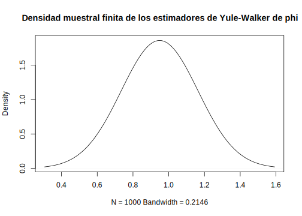
<p class="caption">(\#fig:grafico-densidad-muestral-estimadores-yule-walker)Densidad muestral finita de los estimadores de Yule-Walker de phi</p>
</div>

Algunos de los cuantiles de la distribución muestral son: 

|Cuantil|  5% |  10% | 25%  |  50% | 75%  |  90% | 95%  |
|---|:-:|:-:|:-:|:-:|:-:|:-:|:-:|
|Valor   |0.6747 |  0.6957 |  0.7587 |  0.8638 |  0.9689 |  1.0320 |  1.0530 |


Antes de discutir la técnica de bootstrap, estudiemos el proceso de innovación muestral $x_t-x_t^{t-1}$ con la correspondiente varianza $P_t^{t-1}$. Para el modelo AR(1) de este ejemplo

$$x_t^{t-1}=\mu+\phi(x_{t-1}-\mu)\text{, }t=2,\ldots,100$$

De aquí, se sigue que

$$P_t^{t-1}=\mathbb{E}(x_t-x_t^{t-1})^2=\sigma_w^2\text{, }t=2,\ldots,100$$

Cuando $t=1$, tenemos

$$x_1^0=\mu\text{ y }P_1^0=\sigma_w^2/(1-\phi^2)$$

Entonces, las innovaciones tiene media cero pero varianzas distintas; a fin de que todas las innovaciones tengan la misma varianza $\sigma_w^2$, las escribiremos como

\begin{eqnarray}
  \epsilon_1 &=& (x_1-\mu)\sqrt{(1-\phi^2)} \nonumber \\
  \epsilon_t &=& (x_t-\mu)-\phi(x_{t-1}-\mu)\text{, para }t=2,\ldots,100 (\#eq:eq-innovaciones-bootstrap)
\end{eqnarray}

De estas ecuaciones, podemos escribir el modelo en término de las innovaciones $\epsilon_t$ como

\begin{eqnarray}
  x_1 &=& \mu+\epsilon_1/\sqrt{(1-\phi^2)} \nonumber\\
  x_t &=& \mu+\phi(x_{t-1}-\mu)+\epsilon_t\text{, para }t=2,\ldots,100 (\#eq:eq-modelo-innovaciones)
\end{eqnarray}

A continuación, reemplazamos los parámetros con sus estimados en \@ref(eq:eq-innovaciones-bootstrap), esto es, $n=100, \hat{\mu}=40.048$ y $\hat{\phi}=0.957$ y denotamos los resultados de las innovaciones muestrales como $\{\hat{\epsilon}_1,\ldots,\hat{\epsilon}_{100}\}$. Para obtener una muestra bootstrap, primero escogemos una muestra aleatoria con reemplazo con $n=100$ del conjunto de innovaciones muestral, llamemos a esta muestra $\{\epsilon_1^*,\ldots,\epsilon_{100}^*\}$. Ahora, generamos un conjunto de datos bootstrap secuencialmente haciendo

\begin{eqnarray}
  x_1^* &=& 40.048+\epsilon_1^*/\sqrt{(1-0.957^2)} \nonumber\\
  x_t^* &=& 40.048+0.957(x_{t-1}^*-40.048)+\epsilon_t^*\text{, }t=2,\ldots,n (\#eq:eq-generacion-datos-bootstrap)
\end{eqnarray}

A continuación, estimamos los parámetros como si los datos fueran $x_t^*$. Llamamos a estos estimados $\hat{\mu}(1),\hat{\phi}(1)$ y $s_w^2(1)$. Repetimos este proceso un número grande $N$ de veces, generando una colección de parámetros estimados bootstrap $\{\hat{\mu}(k),\hat{\phi}(k),s_w^2(k),k=1,\ldots,N\}$. Podemos entonces aproximar la distribución muestral finita de un estimador de los valores del parámetro obtenido con bootstrap. Por ejemplo, podemos aproximar la distribución de $\hat{\phi}-\phi$ por la distribución empírica de $\hat{\phi}(k)-\hat{\phi}$ para $k=1,\ldots,N$.

La figura \@ref(fig:grafico-histograma-bootstrap) muestra un histograma bootstrap de 200 estimaciones de $\phi$ hechas con bootstrap usando los datos en la figura \@ref(fig:grafico-modelo-estacionario-causal-n-100}. En particular, la media de la distribución de $\hat{\phi}(k)$ es $0.8750$ con varianza $0.0556^2$. Algunos cuantiles de esta distribución son: 

| Cuantil | 5%  | 10%  |  25% | 50%  |  75% | 90%  |  95% |
|---|:-:|:-:|:-:|:-:|:-:|:-:|:-:|
| Valor  |  0.7833 |  0.8014 |  0.8412 |  0.8762 |  0.9135 |  0.9455 |  0.9672 |


```r
# Booststrap

nboot=200
resids=fit$resid
resids=resids[2:100]
boot.star=boot
phi.star=matrix(0,nboot,1)
for (i in 1:nboot){
  resid.star=sample(resids,replace=TRUE)
  for (t in 1:99){
    boot.star[t+1]=boot+phi*(boot.star[t]-boot)+resid.star[t]
  }
  phi.star[i]=ar.yw(boot.star,order=1)$ar
}
# Histograma
hist(phi.star,breaks=15,col = "lightblue",
main="Histograma de frecuencia para phi estimado con bootstrap")
```

<div class="figure">
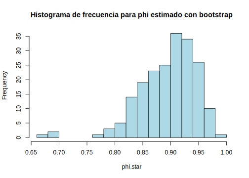
<p class="caption">(\#fig:grafico-histograma-bootstrap)Histograma bootstrap de phi basado en 200 iteraciones.</p>
</div>

----

<!--chapter:end:304-estimacion-de-parametros.Rmd-->

# Modelos ARIMA

En este capítulo examinaremos el problema de encontrar un modelo apropiado para un conjunto determinado de observaciones $\{x_1,\ldots,x_n\}$ que no son necesariamente generados por una serie de tiempo estacionaria. Si los datos (a) no muestran desviaciones aparentes de la estacionariedad y (b) tienen una función de autocovarianza en rápida disminución, intentamos ajustar un modelo ARMA a los datos medios corregidos utilizando las técnicas desarrolladas en el capítulo de modelos ARMA. De lo contrario, buscamos primero una transformación de los datos que genere una nueva serie con las propiedades (a) y (b). Esto puede lograrse frecuentemente mediante la diferenciación, lo que nos lleva a considerar la clase de modelos ARIMA (siglas en inglés: autoregressive integrated moving-average).

En muchas situaciones, las series de tiempo pueden pensarse o ver como la composición de dos componentes, una componente de tendencia no estacionaria y una componente estacionaria de media cero. Por ejemplo, consideremos el modelo

\begin{equation}
x_t = \mu_t+y_t,
(\#eq:eq-modelo-base-1-diferencia)
\end{equation}

donde $\mu_t=\beta_0+\beta_1t$ y $y_t$ es estacionario. Si diferenciamos este proceso, obtenemos un proceso estacionario, en efecto

\begin{eqnarray*}
\nabla x_t &=& x_t-x_{t-1} = (\mu_t+y_t)-(\mu_{t-1}+y_{t-1}) \\
    &=& (\beta_0+\beta_1t+y_t)-(\beta_0+\beta_1(t-1)+y_{t-1}) \\
    &=& \beta_1 + y_t-y_{t-1} \\
    &=& \beta_1+\nabla y_t.
\end{eqnarray*}

El cual claramente es estacionario.

Otro modelo que lleva a la primera diferenciación es el caso en el cual $\mu_t$ en la ecuación \@ref(eq:eq-modelo-base-1-diferencia), es un proceso estocástico y que varía lentamente de acuerdo a un paseo laeatorio. Esto es,

$$\mu_t=\mu_{t-1}+v_t,$$

donde $v_t$ es estacionario. Tenemos entonces

$$x_t=\mu_{t-1}+v_t+y_t.$$

En este caso,

\begin{eqnarray*}
\nabla x_t &=& x_t-x_{t-1} \\
    &=& (\mu_{t-1}+v_t+y_t)-(\mu_{t-2}+v_{t-1}+y_{t-1}) \\
    &=& v_t+\nabla y_t,
\end{eqnarray*}

es estacionario. Si $\mu_t$ en \@ref(eq:eq-modelo-base-1-diferencia) es un polinomio de grado $k$, $\mu_t=\sum_{i=0}^k\beta_it^i$, entonces la serie diferenciada $\nabla^ky_t$ es estacinaia. Por ejemplo, sea $\mu_t=\beta_0+\beta_1t+\beta_2t^2$, luego

$$x_t=\mu_t+y_t = \beta_0+\beta_1t+\beta_2t^2+y_t.$$

Diferenciando una vez se tiene

\begin{eqnarray*}
\nabla x_t &=& (\mu_t+y_t)-(\mu_{t-1}+y_{t-1}) \\
    &=& (\beta_0+\beta_1t+\beta_2t^2+y_t) - (\beta_0+\beta_1(t-1)+\beta_2(t-1)^2+y_{t-1}) \\
    &=& \beta_0+\beta_1t+\beta_2t^2+y_t-\beta_0-\beta_1t-\beta_1-\beta_2(t^2-2t+1)-y_{t-1} \\
    &=& \beta_1+\beta_2+2\beta_2t+\nabla y_t.
\end{eqnarray*}

Volvemos a diferenciar

\begin{eqnarray*}
\nabla(\nabla x_t) &=& (\beta_1+\beta_2+2\beta_2t+(y_t-y_{t-1})) - (\beta_1+\beta_2+2\beta_2(t-1)+(y_{t-1}-y_{t-2})) \\
    &=& \beta_1+\beta_2+2\beta_2t+y_t-y_{t-1}-\beta_1-\beta_2-2\beta_2t+2\beta_2-y_{t-1}+y_{t-2} \\
    &=& 2\beta_2+\nabla(\nabla y_t) \\
    &=& 2\beta_2+\nabla^2y_t.
\end{eqnarray*}

El cual es estacionario. Los modelos estocásticos con tendencia llevan a diferenciaciones de orden superior. Por ejemplo, supongamos 

$$\mu_t=\mu_{t-1}+v_t\text{ y }v_t=v_{t-1}+e_t$$

donde $e_t$ es estacionario. Entonces $\nabla x_t = v_t+\nabla y_t$ no es estacionario, pero 

$$\nabla^2x_t = e_t+\nabla^2y_t,$$

si es estacionario.

Los modelos ARMA integrados o modelos ARIMA, es una extensión de los modelos ARMA que incluyen diferenciación. Formalmente, tenemos la siguiente definición.

\BeginKnitrBlock{definition}<div class="definition"><span class="definition" id="def:defi-modelo-ARIMA"><strong>(\#def:defi-modelo-ARIMA) </strong></span>Un proceso $x_t$ es un proceso ARIMA(p,d,q) si 

$$\nabla^dx_t = (1-B)^dx_t$$
  
es un proceso ARMA(p,q). En general, escribimos el modelo como 

\begin{equation}
  \phi(B)(1-B)^dx_t = \theta(B)w_t.
(\#eq:eq-modelo-ARIMA)
\end{equation}

Si $\mathbb{E}(\nabla^dx_t)=\mu$, escribimos el modelo como

$$\phi(B)(1-B)^dx_t=\delta+\theta(B)w_t,$$

donde $\delta=\mu(1-\phi_1-\cdots-\phi_p)$.</div>\EndKnitrBlock{definition}

----

Debido a la no estacionaridad, debemosser cuidadosos cuando realizamos predicciones.

## Construcción de modelos ARIMA

Hay algunos pasos básicos para ajustar modelos ARIMA a series de tiempo:

- Gráfico de los datos.

- Posible transformación de los datos (diferenciación, logaritmo, etc.).

- Identificación del orden de dependencia del modelo.

- Estimación del (los) parámetro(s).

- Diagnóstico.

- Elección del modelo.

Primero, como en todo análisis de datos, debemos realizar un gráfico de serie de tiempo de los datos e inspeccionar el mismo para ver cualquier anomalía. Si, por ejemplo, la variabilidad crece en el tiempo, será necesario que transformemos los datos para estabilizar la varianza. En este caso, las transformaciones de potencia de la clase Box-Cox resultan útiles. Por ejemplo, supongamos un proceso que evoluciona como un cambio porcentual bastante pequeño, como una inversión. Supongamos que

$$x_t=(1+p_t)x_{t-1},$$

donde $x_t$ es el valor de la inversión en tiempo $t$ y $p_t$ es el porcentaje de cambio del periodo $t-1$ al $t$, el cual puede ser negativo. Tomando logaritmo tenemos

$$\ln(x_t) = \ln(1+p_t)+\ln(x_{t-1})$$

o

$$\nabla\ln(x_t) = \ln(1+p_t).$$

Si el porcentaje de cambio $p_t$ se mantiene relativamente pequeño en magnitud, entonces $\ln(1+p_t)\approx p_t$ [^nota9] y entonces

[^nota9]: $\ln(1+p)=p-\frac{p^2}{2}+\frac{p^3}{3}-\cdots$ para $-1<p\leq1$. Si $p$ es un porcentaje de cambio pequeño, entonces los términos de orden superior en el desarrollo son despreciables.

$$\nabla\ln(x_t)\approx p_t,$$

será un proceso relativamente estable. A menudo $\nabla\ln(x_t)$ se llama el retorno o tasa de crecimiento. Después de una transformación apropiada de los datos, el siguiente paso es identificar los valores preliminares del orden autoregresivo $p$, el orden de diferenciación $d$ y el orden de promedio móvil $q$.

Ya hemos abordado en parte el problema de la elección del orden de diferenciación. El gráfico de la serie de tiempo nos ayudará a deterinar si hace falta una diferenciación. Si se requiere una diferenciación, entonces diferenciamos los datos una vez $(d=1)$, e inspeccionamos el gráfico de $\nabla x_t$. Si hace falta otra diferenciación, entonces volvemos a diferenciar $(d=2)$ e inspeccionamos nuevamente el gráfico, esta vez el de $\nabla^2x_t$. Debemos tener cuidado de no sobre diferenciar pues esto puede introducir dependencia donde no la hay. Por ejemplo, $x_t=w_t$ es no correlacionado, pero $\nabla x_t=w_t-w_{t-1}$ es un proceso $MA(1)$. Además del gráfico de la serie de tiempo, la ACF muestral nos puede ayudar a ver si es necesaria una diferenciación. Dado que el polinomio $\phi(z)(1-z)^d$ tiene raíz unitaria, la ACF muestral $\hat{\rho}(h)$, no decaerá a cero tan rápido cuando $h$ crece. Entonces, un lento decaimiento en $\hat{\rho}(h)$ es un indicativo de que se necesitará una diferenciación.

Una vez que hemos establecido el valor preliminar de $d$, el siguiente paso es ver la ACF y PACF muestrales de $\nabla^dx_t$ para el valor de $d$ elegido. Usando la tabla resumen para la elección de modelos ARMA (véase la tabla al final de la sección [Propiedades de los modelos ARMA(p,q)]) como guía, escogemos los valores preliminares de $p$ y $q$.

Dado que estamos trabajando con estimaciones, dos modelos que luzcan diferentes pueden ser de hecho bastante similares, por lo tanto, nodebemos preocuparnos, de momento, en ser muy precisos al ajustar un modelo. En este punto, unos pocos valores preliminares de $p,d$ y $q$ serán suficientes y nos permitirán iniciar las estimaciones de los parámetros. A continuación daremos un ejemplo de uso de los pasos previamente descritos.

\BeginKnitrBlock{example}\iffalse{-91-65-110-225-108-105-115-105-115-32-100-101-32-100-97-116-111-115-32-71-46-78-46-80-46-93-}\fi{}<div class="example"><span class="example" id="exm:ejem-gnp-data"><strong>(\#exm:ejem-gnp-data)  \iffalse (Análisis de datos G.N.P.) \fi{} </strong></span>Consideremos los datos del Producto Nacional Bruto trimestral de EE.UU en miles de millónes de dólares, desde el primer trimestre de 1947 hasta el tercer trimestre de 2002. Son $n=223$ observaciones, losdatos han sido ajustados estacionalmente. El archivo de datos es "gnp96.txt", y fueron obtenidos del *Federal Reserve Bank of St. Louis* (http://research.stlouisfed.org/). El gráfico \@ref(fig:fig-gnp-data) muestra la serie de tiempo correspondiente.</div>\EndKnitrBlock{example}


```r
# Lectura de los datos
gnp=read.table("data/gnp96.txt")
# Grafico de la serie
plot(gnp,type="l", xlab="Años",ylab="G.N.P.",col="blue")
```

<div class="figure">

<p class="caption">(\#fig:fig-gnp-data)Producto Nacional Bruto trimestral de EE.UU (en miles de millónes de dólares), desde el 1er trimestre de 1947 hasta el 3er trimestre de 2002.</p>
</div>

Dado que la serie presenta una fuerte tendencia creciente, no es claro si la varianza crece con el tiempo. Por lo tanto para propósito de demostrar como usar la ACF muestral, en la figura \@ref(fig:fig-acf-gnp) mostramos la misma. Como el decaimiento es lento, esto nos sugiere que una diferenciación es posible.


```r
# ACF muestral de GNP
acf(gnp[,2], 50)
```

<div class="figure">

<p class="caption">(\#fig:fig-acf-gnp)ACF muestral para la serie de datos G.N.P.</p>
</div>

La figura \@ref(fig:fig-gnp-dif-1) muestra la primera diferenciación, allí podemos observar que la variabilidad en la segunda mitad de datos es mayor que en la primera mitad. Además, parece que la tendencia creciente todavía está presente, porlo tanto, tomando en cuenta los pasos descritos al inicio de esta sección primero transformamos losdatos y luego diferenciamos, así obtenemos $y_t=\nabla\ln(x_t)$. 


```r
# Primera diferencia
gnpdif=diff(gnp[,2])
plot(gnp[2:223,1],gnpdif, type="l",xlab="Años",ylab="diff(G.N.P.)",
     col="blue")
```

<div class="figure">

<p class="caption">(\#fig:fig-gnp-dif-1)Primera diferenciación de la serie de tiempo G.N.P.</p>
</div>

La figura \@ref(fig:fig-gnp-log-dif-1) muestra la serie transformada y diferenciada, podemos ver allí que el proceso parece ser estable. Más aún, podemos interpretar los valores de $y_t$ como el porcentaje de crecimiento trimestral del Producto Nacional Bruto de EE.UU.


```r
# Transformacion y primera diferencia
gnpgr = diff(log(gnp[,2]))
plot(gnp[2:223,1],gnpgr,type = "l",xlab="Años",ylab="diff(G.N.P.)",
     col="blue")
```

<div class="figure">

<p class="caption">(\#fig:fig-gnp-log-dif-1)Serie de tiempo de G.N.P. transformada (log) y diferenciada una vez</p>
</div>

Graficamos ahora las ACF y PACF muestral de $y_t$. Observando las ACF y PACF parece que la ACF se corta en paso 2 y la PACF decae, lo que nos sugiere un modelo $MA(2)$ para la tasa de crecimiento del P.N.B., o un modelo ARIMA(0,1,2) para $y_t$. Pero en lugar de enfocarnos en un solo modelo, si detallamos las ACF y PACF muestral, parece sugerir que la ACF decrece y la PACF se corta en paso 1, lo que sugiere un modelo $AR(1)$ para la tasa de cambio o un modelo ARIMA(1,1,0) para $y_t$. Podemos decir entonces que un modelo ARIMA(1,1,2) es una primera elección de ajuste.


```r
# ACF y PACF de la transformacion
par(mfrow=c(2,1))
acf(gnpgr, 24)
pacf(gnpgr,24)
```

<div class="figure">

<p class="caption">(\#fig:fig-acf-pacf-gnp)ACF y PACF muestrales para las serie de tiempo G.N.P., transformada y diferenciada</p>
</div>

A modo de entrenamiento vamos a realizar primeramente los ajustes de los modelos $MA(2)$ y $AR(1)$ por separado. Para ello nos valemos de R, usaremos la función 'sarima' del paquete 'astsa'. Iniciamos con el modelo $AR(1)$.


```r
gnpgr.ar=arima(gnpgr, c(1, 0, 0)) # AR(1)
```

El modelo $AR(1)$ estimado es $x_t=\mu(1-\phi_1)+\phi_1x_{t-1}+\hat{w}_t$

\begin{equation}
x_t = 0.0083_{(0.001)}(1-0.3467)+0.3467_{(0.063)}x_{t-1}+\hat{w}_t
(\#eq:eq-modelo-AR1-gnp)
\end{equation}

donde $\hat{\sigma}_w=0.0095$ con 220 grados de libertad; note que la constante en \@ref(eq:eq-modelo-AR1-gnp) es $0.0083(1-0.3467)=0.005$. Los valores entre parentesis son los errores estándar estimados.

Ahora usando EMV fijamos un modelo $MA(2)$ para la tasa de crecimiento $x_t$, siendo el modelo estimado

\begin{equation}
x_t = 0.008_{(0.001)}+0.303_{(0.065)}\hat{w}_{t-1}+0204_{(0.064)}\hat{w}_{t-2}+\hat{w}_t
(\#eq:eq-modelo-MA2-gnp)
\end{equation}

donde $\hat{\sigma}_w=0.0094$ con 219 grados de libertad. Los valores entre parentesis corresponden a los errores estándar estimados. Aunque la constante es muy pequeña, su valor es significativo, no incluir una constante lleva a conclusiones erróneas sobre la naturaleza de la economía estadounidense. Si no  incluimos una constane, asumiríamos que la tasa de crecimiento trimestral promedio es cero, mientras que en realidad la tasa de crecimiento trimestral promedio del P.N.B. de EE.UU es de alrededor del 1% (véase la gráfica \@ref(fig:fig-gnp-data)).


```r
gnpgr.ma2=arima(gnpgr, c(0, 0, 2)) # MA(2)
# Psi-pesos
ARMAtoMA(ar=.3467, ma=0, 10) # prints psi-weights
```

```
##  [1] 3.467e-01 1.202e-01 4.167e-02 1.445e-02 5.009e-03
##  [6] 1.737e-03 6.021e-04 2.088e-04 7.237e-05 2.509e-05
```

----

El siguiente paso en el ajuste de modelos es el diagnóstico. Esta investigación incluye el análisis de residuales así como la comparación de modelos. De nuevo, el primer paso envuelve un gráfico de las innovaciones (o residuales) $x_t-\hat{x}_t^{t-1}$ o de las innovaciones estandarizadas

\begin{equation}
 e_t = (x_t-\hat{x}_t^{t-1})/\sqrt{\hat{P}_t^{t-1}}
(\#eq:eq-innovaciones-estandar)
\end{equation}

donde $\hat{x}_t^{t-1}$ es la predicción de un paso de $x_t$ basado en el modelo ajustado y $\hat{P}_t^{t-1}$ es varianza del error estimado de un paso. Si el modelo se ajusta bien, el residual estandarizado debe comportarse como una sucesión iid de media cero y varianza uno, así que debemos observar bien el gráfico de la serie de tiempo para ver si hay desviación evidente de esta suposición. Por ejemplo, es posible en el caso no-gaussiano tener un proceso no-correlacionado para el cual valores contiguos en tiempo sean altamente dependientes. Como ejemplo, podemos mencionar la familia de modelos GARCH que discutiremos en el capítulo siguiente.

Para determinar o investigar sobre la normaidad marginal nos valemos del histograma de los residuales, así visualmente podemos ver si el mismo se parece o ajusta a la curva de densidad normal. Además de esto, un gráfico de probabilidad normal o un gráfico de cuantiles (qq-plot) nos puede ayudar a identificar la desviación de la normalidad.

También podemos inspeccionar la autocorrelación muestral de los residuales $\hat{\rho}_e(h)$, para ver algún patrón o valores grandes. Recordemos que, para un ruido blanco, las autocorrelaciones muestrales son aproximadamente independientes y normalmente distribuidas con media cero y varianza $1/n$. Por consiguiente, una buena forma de inspeccionar la estructura de correlación de los residuales es graficar $\hat{\rho}_e(h)$ vs $h$ junto con las cotas de error $\pm2/\sqrt{n}$. Tome en cuenta, sin embargo, que los residuales de un modelo ajustado, no tendrán necesariamente las propiedades de un ruido blanco y la varianza de $\hat{\rho}_e(h)$ puede ser mucho menor que $1/n$.

Además de graficar $\hat{\rho}_e(h)$, podemos realizar una prueba de hipótesis general que tome en consideración las magnitudes de $\hat{\rho}_e(h)$ como grupo. Por ejemplo, puede ser el caso que individualmente cada $\hat{\rho}_e(h)$ sea pequeño en magnitud, digamos menr que $2/\sqrt{n}$ en magnitud, es decir $|\hat{\rho}_e(h)|<2/\sqrt{n}$, pero colectivamente, los valores sean grandes. El estadístico de Ljung-Box-Pierce dado por 

\begin{equation}
 Q = n(n+2)\sum_{h=1}^H\frac{\hat{\rho}_e^2(h)}{n-h}
 (\#eq:eq-estadistico-ljung-box-pierce)
\end{equation}

es útil para realizar esta prueba de hipótesis. El  valor $H$ en \@ref(eq:eq-estadistico-ljung-box-pierce) se elige de manera arbitraria, en general se usa $H=20$. Bajo la hipótesis nula de que el modelo es adecuado, asintóticamente, (cuando $n\to\infty$), $Q$ se distribuye como una chi-cuadrado con $H-p-q$ grados de libertad, esto es $Q\sim\chi_{H-p-q}^2$. Entonces, rechazamos la hipótesis nula a nivel $\alpha$ si el valor  de $Q$ es mayor que la $\chi_{H-p-q}^2(1-\alpha)$.

\BeginKnitrBlock{example}\iffalse{-91-68-105-97-103-110-243-115-116-105-99-111-32-112-97-114-97-32-108-97-32-116-97-115-97-32-100-101-32-99-114-101-99-105-109-105-101-110-116-111-32-100-101-108-32-80-46-78-46-66-93-}\fi{}<div class="example"><span class="example" id="exm:ejem-diagnostico-tasa-crecimiento-gnp"><strong>(\#exm:ejem-diagnostico-tasa-crecimiento-gnp)  \iffalse (Diagnóstico para la tasa de crecimiento del P.N.B) \fi{} </strong></span>Enfoquémonos en el modelo $MA(2)$ ajustado del ejemplo \@ref(exm:ejem-gnp-data), el análisis de los residuales de $AR(1)$ es similar. La figura \@ref(fig:fig-modelo-arima002-gnp) muestra el gráfico de los residuales estandarizados (parte superior), la ACF de los residuales (parte media izquierda) (Note que R incluye la correlación en paso cero que siempre es uno) y los valores del estadístico $Q$, dado en \@ref(eq:eq-estadistico-ljung-box-pierce) desde paso $H=1$ hasta $H=20$ (parte inferior). </div>\EndKnitrBlock{example}


```r
tsdiag(gnpgr.ma2,gof.lag=20)
```

<div class="figure">

<p class="caption">(\#fig:fig-diagnostico-residual-MA2-gnp)Diagnóstico de los residuales con el modelo MA(2) de la serie P.N.B.</p>
</div>

Observando el gráfico de los residuales estandarizados en \@ref(fig:fig-diagnostico-residual-MA2-gnp), no muestran un patrón obvio. Note que no hay valores atípicos pero si algunos pocos valores mayores que 3 desviaciones estándar. La ACF de los residuales no muestra una aparente desviación de la suposición del modelo, y el estadístico $Q$ no es significativo para los primeros 20 pasos calculados.

Finalmente la figura \@ref(fig:fig-histograma-qq-plot-residual-gnp) muestra un histograma de los residuales (parte superior) y un gráfico qq-plot de los residuales (parte inferior). En la misma podemos observar que los residuales están cercanos a la normalidad excepto para algunos valores extremos en la cola.


```r
par(mfrow=c(2,1))
hist(gnpgr.ma2$resid,br=12)
qqnorm(gnpgr.ma2$resid)
```

<div class="figure">
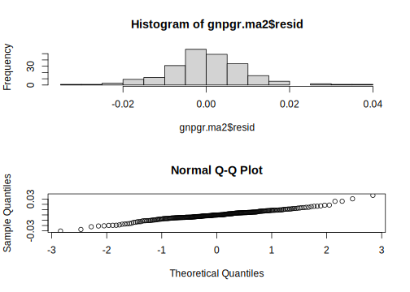
<p class="caption">(\#fig:fig-histograma-qq-plot-residual-gnp)Histograma de los residuales para P.N.B. (parte superior), y qq-plot de los residuales (parte inferior), para el modelo MA(2)</p>
</div>

Para concluir, realizamos la prueba de Shapiro-Wilk (referencia), la cual nos da un $p$-valor de 0.003, lo que indica que los residuales no son normal. Por lo tanto, el modelo parece ajustarse bien salvo que debemos usar una distribución con una cola más pesada que la distribución normal. El comando en R para la prueba de Shapiro-Wilk es


```r
shapiro.test(gnpgr.ma2$resid)
```

```
## 
## 	Shapiro-Wilk normality test
## 
## data:  gnpgr.ma2$resid
## W = 0.98, p-value = 0.003
```
----

Podemos hacer lo mismo ahora para el modelo ARIMA(1,1,2)

```r
gnpgr.arima=arima(gnpgr,order=c(1,1,2))
tsdiag(gnpgr.arima,gof.lag=20)
```

<div class="figure">

<p class="caption">(\#fig:fig-diagnostico-gnp-arima)Diagnóstico para el modelo ARIMA de B.N.P</p>
</div>

Nuevamente, observando el gráfico de los residuales estandarizados, estos no muestran un patrón obvio. Note que tampoco hay valores atípicos pero si algunos pocos valores mayores que 3 desviaciones estándar. La ACF de los residuales no muestra una aparente desviación de la suposición del modelo, y el estadístico $Q$ no es significativo para los primeros 20 pasos calculados.


```r
par(mfrow=c(2,1))
hist(gnpgr.arima$resid)
qqnorm(gnpgr.arima$resid)
```

<div class="figure">
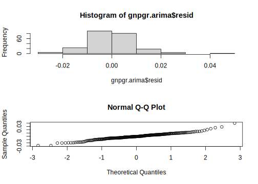
<p class="caption">(\#fig:fig-histograma-qq-plot-residual-gnp-arima)Histograma de los residuales para P.N.B. (parte superior), y qq-plot de los residuales (parte inferior), para el modelo ARIMA(1,1,2)</p>
</div>

```r
shapiro.test(gnpgr.arima$resid)
```

```
## 
## 	Shapiro-Wilk normality test
## 
## data:  gnpgr.arima$resid
## W = 0.98, p-value = 0.001
```

La figura \@ref(fig:fig-histograma-qq-plot-residual-gnp-arima) muestra un histograma de los residuales (parte superior) y un gráfico qq-plot de los residuales (parte inferior). En la misma, de manera similar al modelo $MA(2)$ podemos observar que los residuales están cercanos a la normalidad excepto para algunos valores extremos en la cola. Por último, realizamos la prueba de Shapiro-Wilk, la cual nos da un $p$-valor de 0.001, lo que indica que los residuales no son normales. Por lo tanto, de nuevo, este modelo parece también ajustarse bien salvo que debemos usar una distribución con una cola más pesada que la distribución normal.

----

Como explicamos previamente, debemos tener cuidado con sobreajustar un modelo; no siempre es el caso que más es mejor. Sobreajustar nos lleva a estimadores menos preciso, y agregar más parámetros puede ajustar mejor los datos pero puede llevar a malas predicciones. Este resultado se ilustra en el ejemplo siguiente.

\BeginKnitrBlock{example}\iffalse{-91-85-110-32-112-114-111-98-108-101-109-97-32-100-101-32-115-111-98-114-101-97-106-117-115-116-101-93-}\fi{}<div class="example"><span class="example" id="exm:ejem-problema-sobreajuste"><strong>(\#exm:ejem-problema-sobreajuste)  \iffalse (Un problema de sobreajuste) \fi{} </strong></span>La figura \@ref(fig:fig-sobreajuste-poblacion-usa), muestra  la población de los EE.UU., según el censo oficial cada 10 años de 1910 hasta 1990 (puntos azules). Si usamos estos nueve puntos para predecir la población a futuro de los EE.UU. podemos usar un polinomio de grado 8 para ajustar las 9 observaciones; lo cual como se observa en la gráfica es perfecta. El modelo en este caso es 

$$x_t=\beta_0+\beta_1t+\beta_2t^2+\cdots+\beta_8t^8+w_t$$

El modelo fijado, el cual es graficado hasta el año 2010, (linea continua roja), pasa a través de los 9 puntos. El modelo predice que la población de los EE.UU. estará cercana a cero en el año 2000, y cruzará el cero en algún mes del año 2002, lo cual es falso.</div>\EndKnitrBlock{example}


```r
uspop=read.table("data/USPOP2.txt", header = TRUE)
fit.usp=lm(Pob~t+I(t^2)+I(t^3)+I(t^4)+I(t^5)+I(t^6)+I(t^7)+I(t^8),
           data=uspop)
plot(uspop,type="p",lty=19,col="blue",xlim=c(1910,2010))
lines(x = uspop$t, y=predict(fit.usp), col = "red", lwd = 2)
```

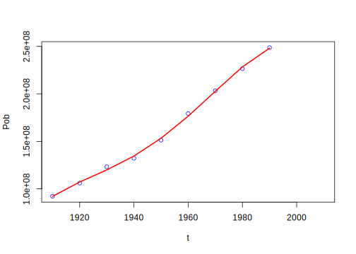<!-- -->

----

El paso final en el ajuste de modelos es la elección del modelo. Esto es, debemos decidir que modelo mantendremos para la predicción. La técnica más popular es calcular los índices AIC, AICc y SIC (BIC), descritos en las definiciones \@ref(def:defi-AIC-2), \@ref(def:defi-AICc) y \@ref(def:defi-SIC).

\BeginKnitrBlock{example}\iffalse{-91-69-108-101-99-99-105-243-110-32-100-101-108-32-109-111-100-101-108-111-32-112-97-114-97-32-108-97-32-115-101-114-105-101-32-80-46-78-46-66-46-32-100-101-32-69-69-46-85-85-46-93-}\fi{}<div class="example"><span class="example" id="exm:ejem-eleccion-modelo-gnp"><strong>(\#exm:ejem-eleccion-modelo-gnp)  \iffalse (Elección del modelo para la serie P.N.B. de EE.UU.) \fi{} </strong></span>Volviendo al análisis del P.N.B. de EE.UU., visto en los ejemplos \@ref(exm:ejem-gnp-data) y \@ref(exm:ejem-diagnostico-tasa-crecimiento-gnp), recordemos que los modelos son AR(1), MA(2) y ARIMA(1,1,2). Para escoger el modelo final, comparemos los valores del AIC, AICc y SIC para los 3 modelos</div>\EndKnitrBlock{example}

```r
n=length(gnpgr)
# Modelos AR
kar=length(gnpgr.ar$coef)
sar=gnpgr.ar$sigma2
# Modelos MA
kma=length(gnpgr.ma2$coef)
sma=gnpgr.ma2$sigma2
# Modelo ARIMA
karima=length(gnpgr.arima$coef)
sarima=gnpgr.arima$sigma2
# AIC
log(sar)+(n+2*kar)/n
```

```
## [1] -8.294
```

```r
log(sma)+(n+2*kma)/n
```

```
## [1] -8.298
```

```r
log(sarima)+(n+2*karima)/n
```

```
## [1] -8.285
```

```r
# AICc
log(sar)+(n+kar)/(n-kar-2)
```

```
## [1] -8.285
```

```r
log(sma)+(n+kma)/(n-kma-2)
```

```
## [1] -8.288
```

```r
log(sarima)+(n+karima)/(n-karima-2)
```

```
## [1] -8.275
```

```r
# BIC (SIC)
log(sar)+kar*log(n)/n
```

```
## [1] -9.264
```

```r
log(sma)+kma*log(n)/n
```

```
## [1] -9.252
```

```r
log(sarima)+karima*log(n)/n
```

```
## [1] -9.239
```
----


## Modelos SARIMA

En esta sección vamos a introducir diversas modificaciones a los modelos ARIMA para que se ajusten a comportamiento estacional y no-estacionario. A menudo, la dependencia del pasado tiende a ocurrir más fuertemente en múltiplos de algún paso estacinal $s$ oculto. Por ejemplo, con datos económicos mensuales, existe una fuerte componente anual con pasos que son múltiplos de $s=12$, debido a la fuerte conexión de todas las actividades al calendario anual. Los datos tomados trimestralmente exhibirán un período repetitivo para $s=4$. Los fenómenos naturales tales como temperatura, lluvia, etc., también presentan una fuerte componente correspondiente a la estación del año. Por consiguiente, la variabilidad natural de muchos fenómenos físicos, biológicos y procesos económicos tienden a comportarse según las fluctuaciones estacionales. Debido a esto, es apropiado introducir polinomios autorregresivo de promedio móvil que se identifiquen con los rezagos estacionales.

\BeginKnitrBlock{definition}<div class="definition"><span class="definition" id="def:defi-modelo-sarma"><strong>(\#def:defi-modelo-sarma) </strong></span>El **modelo autorregresivo de promedio móvil estacional puro** denotado $ARMA(P,Q)_s$ tiene la forma

\begin{equation}
\Phi_P(B^s)x_t=\Theta_Q(B^s)w_t,
(\#eq:eq-modelo-sarma)
\end{equation}

donde los operadores

\begin{equation}
\Phi_P(B^s) = 1-\Phi_1B^s-\Phi_2B^{2s}-\cdots-\Phi_PB^{Ps}
(\#eq:eq-operador-AR-estacional)
\end{equation}
  
y 

\begin{equation}
\Theta_Q(B^s) = 1+\Theta_1B^s+\Theta_2B^{2s}+\cdots+\Theta_QB^{Qs},
(\#eq:eq-operador-MA-estacional)
\end{equation}
  
son los *operadores autorreggresivo estacional* y de *promedio móvil estacional* de ordenes $P$ y $Q$ respectivamente, con período estacional $s$.

Análogo a las propiedades de los modelos $ARMA$ no-estacionales, el modelo $ARMA(P,Q)_s$ puro es *causal* sólo cuando las raíces de $\Phi_P(z^s)$ están fuera del círculo unitario y es *invertible* cuando las raíces de $\Theta_Q(z^s)$ están fuera del círculo unitario. </div>\EndKnitrBlock{definition}

----

\BeginKnitrBlock{example}\iffalse{-91-85-110-97-32-115-101-114-105-101-32-65-82-32-101-115-116-97-99-105-111-110-97-108-93-}\fi{}<div class="example"><span class="example" id="exm:ejem-serie-AR-estacional"><strong>(\#exm:ejem-serie-AR-estacional)  \iffalse (Una serie AR estacional) \fi{} </strong></span>Una serie autorregresiva estacional de primer orden que podría durar meses la podemos escribir como

$$(1-\Phi B^{12})x_t=w_t$$

o

$$x_t=\phi x_{t-12}+w_t.$$

Este modelo exhibe la serie $x_t$ en términos de saltos o rezagos múltiplos del periodo estacional anual $s=12$ meses. 

De la forma anterior se desprende cláramente que la estimación y el pronóstico para tal proceso sólo implica modificaciones directas del cso de rezago unitario que ya tratamos. En particular, la condición causal requiere $|\Phi|<1$.

Simulamos 3 años de datos de este modelo con $\Phi=0.9$ y mostramos las ACF y PACF teóricas del modelo. Véase la figura \@ref(fig:fig-modelo-AR1-estacional)</div>\EndKnitrBlock{example}


```r
set.seed(666)
phi=c(rep(0,11),0.9)
sAR=arima.sim(list(order=c(12,0,0),ar=phi),n=37)
sAR = ts(sAR, freq=12)
layout(matrix(c(1,1,2, 1,1,3), nc=2))
par(mar=c(3,3,2,1), mgp=c(1.6,.6,0))
plot(sAR, axes=FALSE, main='Serie AR(1) estacional', xlab="años", type='c')
Months = c("E","F","M","A","M","J","J","A","S","O","N","D")
points(sAR, pch=Months, cex=1.25, font=4, col=1:4)
axis(1, 1:4); abline(v=1:4, lty=2, col=gray(.7))
axis(2); box()
ACF = ARMAacf(ar=phi, ma=0, 100)
PACF = ARMAacf(ar=phi, ma=0, 100, pacf=TRUE)
plot(ACF,type="h", xlab="Rezago", ylim=c(-.1,1)); abline(h=0)
plot(PACF, type="h", xlab="Rezago", ylim=c(-.1,1)); abline(h=0)
```

<div class="figure">
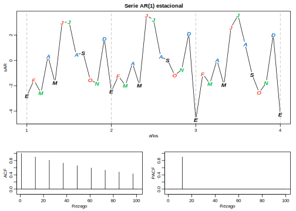
<p class="caption">(\#fig:fig-modelo-AR1-estacional)Datos generados de un modelo estaconal AR(1), con s=12 y las funciones ACF y PACF del modelo x_t=0.9x_{t-12}+w_t</p>
</div>

----

Para un modelo $MA(1)$ estacional con $s=12$, $x_t=w_t+\Theta w_{t-12}$, es fácil verificar que 

\begin{eqnarray*}
  \gamma(0) &=& (1+\Theta^2)\sigma^2 \\
  \gamma(\pm12) &=& \Theta\sigma^2 \\
  \gamma(h) &=& 0 \text{, cualquier otro caso.}
\end{eqnarray*}

Entonces, la única correlación no cero, aparte del paso 0 es 

$$\rho(\pm12) = \Theta/(1+\Theta^2).$$

Para un modelo $AR(1)$ estacional con $s=12$, usando las técnicas para el modelo $AR(1)$ no-estacional, tenemos

\begin{eqnarray*}
  \gamma(0) &=& \sigma^2/(1-\Phi^2) \\
  \gamma(\pm12) &=& \sigma^2\Phi^k/(1-\Phi^2), k=1,2,\ldots \\
  \gamma(h) &=& 0 \text{, cualquier otro caso.}
\end{eqnarray*}

En este caso, las únicas correlaciones no cero son

$$\rho(\pm12) = \Phi^k, k=0,1,2,\ldots.$$
Estos resultados se pueden verificar usando el resultado general

$$\gamma(h) = \Phi\gamma(h-12)\text{, para }h\geq1.$$
Por ejemplo, cuando $h=1$, $\gamma(1)=\Phi\gamma(11)$, pero para $h=11$, se tiene que $\gamma(11)=\Phi\gamma(1)$, lo que implica que $\gamma(1)=\gamma(11)=0$. Adicional a estos resultados, la PACF tiene extensión análoga del modelo no-estacional al estacional. Estos resultados se observan en la figura \@ref(fig:fig-modelo-AR1-estacional).

Como un criterio de diagnóstico inicial, podemos usar las propiedades de una serie autorregresiva de promedio móvil estacional puro que se muestran en la tabla siguiente. Estas propiedades las podemos considerar como una generalización de las propiedades para modelos no estacionales que presentamos en la sección (*referencia*)


|   | AR(P)s  | MA(Q)s  | ARMA(P,Q)s  |
|---|:-:|:-:|:-:|
| ACF*  | Cola fuera en | Corte después | Cola fuera en |
|   | paso k, k=1,2,... | de paso Q  | paso k   |
| PACF*  | Corte después  |  Cola fuera en | Cola fuera en  |
|   | de paso P | paso k, k=1,2,... | paso k |

*Los valores en paso no-estacional $h\neq k$, para $k=1,2,\ldots$ son cero.

En general, podemos combinar los operadores no estacionales y estacionales en un solo modelo.

\BeginKnitrBlock{definition}<div class="definition"><span class="definition" id="def:defi-modelo-sarma-multiplicativo"><strong>(\#def:defi-modelo-sarma-multiplicativo) </strong></span>Un modelo **multiplicativo autorregresivo de promedio móvil estacional** denotado por $ARMA(p,q)\times(P,Q)_s$ tiene la forma 

\begin{equation}
\Phi_P(B^s)\phi(B)x_t = \Theta_Q(B^s)\theta(B)w_t
(\#eq:eq-sarma-multiplicativo)
\end{equation}</div>\EndKnitrBlock{definition}

----

Aunque las propiedades de diagnóstico en la tabla anterior no son estrictamente ciertas para el modelo general mixto, el comportamiento de las ACF y PACF tienden a mostrar patrones aproximados de la forma indicada. De hecho, para modelos mixtos, podemos ver una mezcla de las propiedades listadas en las tablas mencionadas.

Al ajustar tales modelos, nos centraremos primero en los componentes estacionales autorregresivo de promedio móvil estacional, lo que en general nos conduce a resultados más satisfactorios.

\BeginKnitrBlock{example}\iffalse{-91-85-110-32-109-111-100-101-108-111-32-101-115-116-97-99-105-111-110-97-108-32-109-105-120-116-111-93-}\fi{}<div class="example"><span class="example" id="exm:ejem-modelo-estacional-mixto"><strong>(\#exm:ejem-modelo-estacional-mixto)  \iffalse (Un modelo estacional mixto) \fi{} </strong></span>Consideremos un modelo $ARMA(0,1)\times(1,0)_{12}$
  
$$x_t = \Phi x_{t-12}+w_t+\theta w_{t-1},$$
  
donde $|\Phi|<1$ y $|\theta|<1$. Entonces, dado que $x_{t-12}, w_t$ y $w_{t-1}$ son no-correlacionados, y $x_t$ es estacionario $\gamma(0)=\Phi^2\gamma(0)+\sigma_w^2+\theta^2\\sigma_w^2$ o 

$$\gamma(0) = \frac{1+\theta^2}{1-\Phi^2}\sigma_w^2.$$
  
Además, multiplicando el modelo por $x_{t-h}, h>0$, y tomando valor esperado, tenemos $\gamma(1)=\Phi\gamma(11)+\theta\sigma_w^2$, y $\gamma(h)=\Phi\gamma(h-12)$ para $h\geq2$. Entonces, la ACF para este modelo es 

\begin{eqnarray*}
  \rho(12h) &=& \Phi^h, h=1,2,\ldots\\
  \rho(12h-1) &=& \rho(12h+1) = \frac{\theta}{1+\theta^2}\Phi^h, h=0,1,2,\ldots \\
  \rho(h) &=& 0 \text{, en otro caso.}
\end{eqnarray*}

Las ACF y PACF para este modelo, con $\Phi=0.8$ y $\theta=-0.5$ se muestran en la Figura \@ref(fig:fig-modelo-sarma-multiplicativo). Los comandos en $R$ para reproducir la Figura \@ref(fig:fig-modelo-sarma-multiplicativo) son los siguientes.</div>\EndKnitrBlock{example}


```r
phi = c(rep(0,11),.8)
ACF = ARMAacf(ar=phi, ma=-.5, 50)[-1] # [-1] remueve el rezago 0
PACF = ARMAacf(ar=phi, ma=-.5, 50, pacf=TRUE)
par(mfrow=c(1,2))
plot(ACF, type="h", xlab="Rezago", ylim=c(-.4,.8)); abline(h=0)
plot(PACF, type="h", xlab="Rezago", ylim=c(-.4,.8)); abline(h=0)
```

<div class="figure">

<p class="caption">(\#fig:fig-modelo-sarma-multiplicativo)ACF y PACF de un modelo ARMA estacional mixto</p>
</div>

----

La persistencia estacional ocurre cuando el proceso es casi periódico en la temporada. Por ejemplo, con promedios de temperaturas mensuales sobre los años, cada enero será aproximadamente igual, cada febrero será aproximadamente el mismo, y así sucesivamente. En este caso, podemos pensar que la temperatura promedio mensual $x_t$ es modelada como 

$$x_t = S_t+w+t,$$

donde $S_t$ es una componente estacional que varia poco de un año a otro de acuerdo a un paseo aleatorio

$$S_t = S_{t-12}+v_t.$$

En este modelo, $w_t$ y $v_t$ son ruidos blancos no-correlacionados. La tendencia de los datos que sigue este tipo de modelos se exhibe en la ACF muestral que es grande y decae muy lentamente en los rezagos $h=12k$ para $k=1,2,\ldots$. Si sustraemos el efecto de años sucesivos el uno del otro, encontramos que 

$$(1-B^{12})x_t = x_t-x_{t-12} = v_t+w_t-w_{t-12}.$$

Este modelo es un modelo $MA(1)_{12}$ estacionario y su ACF tendrá un pico solo en paso 12. En general, la diferenciación estacional puede ser indicada cuando la ACF decae lentamente en múltiplos de algún período estacional $s$, pero es despreciable entre los períodos.

\BeginKnitrBlock{definition}<div class="definition"><span class="definition" id="def:defi-diferencia-estacional-D"><strong>(\#def:defi-diferencia-estacional-D) </strong></span>La **diferencia estacional de orden $D$** se define como  

\begin{equation}
\nabla_s^Dx_t=(1-B^2)^Dx_t
(\#eq:eq-diferencia-estacional-D)
\end{equation}</div>\EndKnitrBlock{definition}

----

Normalmente, $D=1$, es suficiente para obtener estacionaridad estacional. incorporando estas ideas al modelo general nos lleva a la siguiente definición. 

\BeginKnitrBlock{definition}<div class="definition"><span class="definition" id="def:defi-modelo-sarima"><strong>(\#def:defi-modelo-sarima) </strong></span>Un modelo **autorregresivo integrado de promedio móvil estacional multiplicativo** o modelo $SARIMA$ está dado por 

\begin{equation}
\Phi_P(B^s)\phi(B)\nabla_s^D\nabla^dx_t = \delta+\Theta_Q(B^s)\theta(B)w_t,
(\#eq:eq-modelo-sarima)
\end{equation}
  
donde $w_t$ es un ruido blanco gaussiano. El modelo general es denotado como $ARIMA(p,d,q)\times(P,D,Q)_s$. Las componentes autorregresiva y de promedio móvil ordinarias son representadas por $\phi(B)$ y $\theta(B)$ de órdenes $p$ y $q$ respectivamente, y las componentes autorregresivas y de promedio móvil estacionales por $\Phi_P(B^s)$ y $\Theta_Q(B^s)$ de órdenes $P$ y $Q$, y las componentes de diferencias ordinarias y estacionales $\nabla^d=(1-B)^d$ y $\nabla_s^D=(1-B^s)^D$.</div>\EndKnitrBlock{definition}

----

\BeginKnitrBlock{example}\iffalse{-91-85-110-32-109-111-100-101-108-111-32-83-65-82-73-77-65-93-}\fi{}<div class="example"><span class="example" id="exm:ejem-modelo-sarima"><strong>(\#exm:ejem-modelo-sarima)  \iffalse (Un modelo SARIMA) \fi{} </strong></span>Consideremos el siguiente modelo, el cual a menudo provee una representación razonable para seires econométricas estacionales y no estacionarias. Mostramos la ecuación para el modelo, denotado por $ARIMA(0,1,1)\times(0,1,1)_{12}$ en la notación de la definición anterior (Definición \@ref(def:defi-modelo-sarima)), donde las fluctuaciones estacionales ocurren cada 12 meses. Entonces con $\delta=0$, el modelo \@ref(eq:eq-modelo-sarima) llega a ser 

$$\nabla_{12}\nabla x_t=\Theta(B^{12})\theta(B)w_t,$$
  
o

\begin{equation}
(1-B^{12})(1-B)x_t = (1+\Theta B^{12})(1+\theta B)w_t.
(\#eq:eq-modelo-sarima-p12)
\end{equation}
  
Expandiendo ambos lados de \@ref(eq:eq-modelo-sarima-p12), obtenemos la representación 

$$(1-B-B^{12}+B^{13})x_t = (1+\theta B+\Theta B^{12}+\Theta\theta B^{13})w_t,$$
  
o en la forma de ecuaciones en diferencias

$$x_t = x_{t-1}+x_{t-12}-x_{t-13}+w_t+\theta w_{t-1}+\Theta w_{t-12}+\Theta\theta w_{t-13}.$$
  
Note que la naturaleza multiplicativa del modelo implica que el coeficiente de $w_{t-13}$ es el producto de los coeficientes de $w_t$ y $w_{t-12}$, en lugar de un parámetro libre. El supuesto del modelo multiplicativo parece funcionar bien con muchos conjuntos  de datos de series de tiempo estacionales a la vez que reduce el número de parámetros que debemos estimar.</div>\EndKnitrBlock{example}

----

Seleccionar el modelo apropiado para un conjunto de datos dado entre todos los posibles modelos representados por la ecuación \@ref(eq:eq-modelo-sarima) es una tarea desalentadora, y generalmente pensamos primero en términos de encontrar operadores de diferencia que producen una serie más o menos estacionaria y luego en términos de encontrar un modelo autorregresivo de promedio móvil simple o un modelo ARMA multiplicativo estacional para adaptarlo a la serie de residuales resultante.

Primero aplicamos operaciones de diferenciación y luego construimos los residuos a partir de una serie de tamaño reducido. A continuación, evaluamos las ACF y PACF de estos residuos. Los picos que aparecen en estas funciones a menudo pueden eliminarse fjando o ajustando una componente autorregresiva o una componente de promedio móvil de acuerdo con las propiedades de las Tablas para las funciones ACF y PACF. Al considerar si el modelo es satisfactorio podemos aplicar las técnicas de diagnóstico discutidas en la Sección [Construcción de modelos ARIMA].

\BeginKnitrBlock{example}\iffalse{-91-80-97-115-97-106-101-114-111-115-32-97-233-114-101-111-115-93-}\fi{}<div class="example"><span class="example" id="exm:ejem-pasajeros-aereos"><strong>(\#exm:ejem-pasajeros-aereos)  \iffalse (Pasajeros aéreos) \fi{} </strong></span>Consideremos el conjunto de datos de $R$ "AirPassengers", que son los totales mensuales de pasajeros de lineas aereas internacionales de 1949 a 1960. En la Figura \@ref(fig:fig-serie-pasajeros-transformados) mostramos la serie de datos así como 3 transformaciones de los mismos. Primero una transformación logarítmica, luego una diferenciación de un paso sobre esta, y finalmente una diferenciación adicional de orden 12. Las instrucciones en $R$ son:</div>\EndKnitrBlock{example}


```r
x = AirPassengers
lx = log(x); dlx = diff(lx); ddlx = diff(dlx, 12)
plot.ts(cbind(x,lx,dlx,ddlx), main="")
```

<div class="figure">

<p class="caption">(\#fig:fig-serie-pasajeros-transformados)Serie de tiempo AirPassengers, x, (parte superior), el cual es los totales mensuales de pasajeros de lineas aéreas internacionales de 1949 a 1960; y los datos transformados lx=log x_t (segundo cuadro); dlx=diff(log x_t) (tercer cuadro) y ddlx=diff_12 diff(log x_t) (cuadro inferior)</p>
</div>

Observe que la serie original $x$ muestra tendencia y varianza crecientes; en $lx$ están los datos transformados logarítmicamente y en estso la varianza se estabiliza. Luego diferenciamos la serie transformada para eliminar la tendencia, y la guardamos en $dlx$. Se observa claramente la persistencia estacional (i.e., $dlx_t\approx dlx_{t-12}$) de modo que aplicamos una diferenciación de orden 12. Los datos transformados parecen ser estacionarios, así que estamos listos para fijar un modelo inicial a los mismos.

Las ACF y PACF muestrales de $ddlx (\nabla_{12}\nabla\log x_t)$ los mostramos en la Figura \@ref(fig:fig-acf-pacf-pasajeros).


```r
acf2(ddlx,50)
```

<div class="figure">
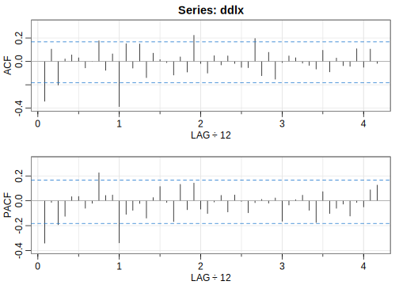
<p class="caption">(\#fig:fig-acf-pacf-pasajeros)ACF y PACF muestrales de ddlx</p>
</div>

```
##         ACF  PACF
##  [1,] -0.34 -0.34
##  [2,]  0.11 -0.01
##  [3,] -0.20 -0.19
##  [4,]  0.02 -0.13
##  [5,]  0.06  0.03
##  [6,]  0.03  0.03
##  [7,] -0.06 -0.06
##  [8,]  0.00 -0.02
##  [9,]  0.18  0.23
## [10,] -0.08  0.04
## [11,]  0.06  0.05
## [12,] -0.39 -0.34
## [13,]  0.15 -0.11
## [14,] -0.06 -0.08
## [15,]  0.15 -0.02
## [16,] -0.14 -0.14
## [17,]  0.07  0.03
## [18,]  0.02  0.11
## [19,] -0.01 -0.01
## [20,] -0.12 -0.17
## [21,]  0.04  0.13
## [22,] -0.09 -0.07
## [23,]  0.22  0.14
## [24,] -0.02 -0.07
## [25,] -0.10 -0.10
## [26,]  0.05 -0.01
## [27,] -0.03  0.04
## [28,]  0.05 -0.09
## [29,] -0.02  0.05
## [30,] -0.05  0.00
## [31,] -0.05 -0.10
## [32,]  0.20 -0.02
## [33,] -0.12  0.01
## [34,]  0.08 -0.02
## [35,] -0.15  0.02
## [36,] -0.01 -0.16
## [37,]  0.05 -0.03
## [38,]  0.03  0.01
## [39,] -0.02  0.05
## [40,] -0.03 -0.08
## [41,] -0.07 -0.17
## [42,]  0.10  0.07
## [43,] -0.09 -0.10
## [44,]  0.03 -0.06
## [45,] -0.04 -0.03
## [46,] -0.04 -0.12
## [47,]  0.11 -0.01
## [48,] -0.05 -0.05
## [49,]  0.11  0.09
## [50,] -0.02  0.13
```

*Componente estacional*: Parece que en la estacionalidad, la ACF se corta en paso $1s$ ($s=12$), mientras que la PACF se rezaga en pasos $1s,2s,3s,4s,\ldots$. Estos resultados implican un $SMA(1), P=0,Q=1$, en la componente estacional (s=12).

*Componente no-estacional*: Inspeccionando las ACf y PACF muestrales en los primeros pasos, parece que ambas colas decaen. Esto sugiere un modelo $ARMA(1,1)$, dentor de las estaciones, $p=q=1$. 

Entonces podemos empear con el modelo $ARIMA(1,1,1)\times(0,1,1)_{12}$ sobre la serie $lx$.


```r
sarima(lx, 1,1,1, 0,1,1,12)
```

```
## initial  value -3.085211 
## iter   2 value -3.225399
## iter   3 value -3.276697
## iter   4 value -3.276902
## iter   5 value -3.282134
## iter   6 value -3.282524
## iter   7 value -3.282990
## iter   8 value -3.286319
## iter   9 value -3.286413
## iter  10 value -3.288141
## iter  11 value -3.288262
## iter  12 value -3.288394
## iter  13 value -3.288768
## iter  14 value -3.288969
## iter  15 value -3.289089
## iter  16 value -3.289094
## iter  17 value -3.289100
## iter  17 value -3.289100
## iter  17 value -3.289100
## final  value -3.289100 
## converged
## initial  value -3.288388 
## iter   2 value -3.288459
## iter   3 value -3.288530
## iter   4 value -3.288649
## iter   5 value -3.288753
## iter   6 value -3.288781
## iter   7 value -3.288784
## iter   7 value -3.288784
## iter   7 value -3.288784
## final  value -3.288784 
## converged
```

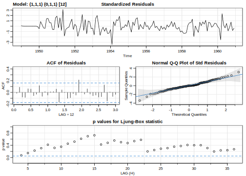<!-- -->

```
## $fit
## 
## Call:
## stats::arima(x = xdata, order = c(p, d, q), seasonal = list(order = c(P, D, 
##     Q), period = S), include.mean = !no.constant, optim.control = list(trace = trc, 
##     REPORT = 1, reltol = tol))
## 
## Coefficients:
##         ar1     ma1    sma1
##       0.196  -0.578  -0.564
## s.e.  0.247   0.213   0.075
## 
## sigma^2 estimated as 0.00134:  log likelihood = 244.9,  aic = -481.9
## 
## $degrees_of_freedom
## [1] 128
## 
## $ttable
##      Estimate     SE t.value p.value
## ar1    0.1960 0.2475  0.7921  0.4298
## ma1   -0.5784 0.2132 -2.7127  0.0076
## sma1  -0.5643 0.0747 -7.5544  0.0000
## 
## $AIC
## [1] -5.573
## 
## $AICc
## [1] -5.557
## 
## $BIC
## [1] -6.511
```

Sin embargo, el parámetro $AR$ no es significativo, así que intentamos eliminando un parámetro de la parte dentro de las estaciones. En este caso probaremos con los modelos $ARIMA(0,1,1)\times(0,1,1)_{12}$ y $ARIMA(1,1,0)\times(0,1,1)_{12}$.


```r
sarima(lx, 0,1,1, 0,1,1,12)
```

```
## initial  value -3.086228 
## iter   2 value -3.267980
## iter   3 value -3.279950
## iter   4 value -3.285996
## iter   5 value -3.289332
## iter   6 value -3.289665
## iter   7 value -3.289672
## iter   8 value -3.289676
## iter   8 value -3.289676
## iter   8 value -3.289676
## final  value -3.289676 
## converged
## initial  value -3.286464 
## iter   2 value -3.286855
## iter   3 value -3.286872
## iter   4 value -3.286874
## iter   4 value -3.286874
## iter   4 value -3.286874
## final  value -3.286874 
## converged
```

<div class="figure">

<p class="caption">(\#fig:fig-residuales-pasajeros)Análisis de residuales para el modelo ARIMA(0,1,1)x(0,1,1)_12 ajustado a la serie lx de pasajeros aéreos</p>
</div>

```
## $fit
## 
## Call:
## stats::arima(x = xdata, order = c(p, d, q), seasonal = list(order = c(P, D, 
##     Q), period = S), include.mean = !no.constant, optim.control = list(trace = trc, 
##     REPORT = 1, reltol = tol))
## 
## Coefficients:
##          ma1    sma1
##       -0.402  -0.557
## s.e.   0.090   0.073
## 
## sigma^2 estimated as 0.00135:  log likelihood = 244.7,  aic = -483.4
## 
## $degrees_of_freedom
## [1] 129
## 
## $ttable
##      Estimate     SE t.value p.value
## ma1   -0.4018 0.0896  -4.482       0
## sma1  -0.5569 0.0731  -7.619       0
## 
## $AIC
## [1] -5.581
## 
## $AICc
## [1] -5.566
## 
## $BIC
## [1] -6.54
```


```r
sarima(lx, 1,1,0, 0,1,1,12)
```

```
## initial  value -3.085211 
## iter   2 value -3.259459
## iter   3 value -3.262637
## iter   4 value -3.275171
## iter   5 value -3.277007
## iter   6 value -3.277205
## iter   7 value -3.277208
## iter   8 value -3.277209
## iter   8 value -3.277209
## iter   8 value -3.277209
## final  value -3.277209 
## converged
## initial  value -3.279535 
## iter   2 value -3.279580
## iter   3 value -3.279586
## iter   3 value -3.279586
## iter   3 value -3.279586
## final  value -3.279586 
## converged
```

<div class="figure">

<p class="caption">(\#fig:unnamed-chunk-61)Análisis de residuales para el modelo ARIMA(1,1,0)x(0,1,1)_12 ajustado a la serie lx de pasajeros aéreos</p>
</div>

```
## $fit
## 
## Call:
## stats::arima(x = xdata, order = c(p, d, q), seasonal = list(order = c(P, D, 
##     Q), period = S), include.mean = !no.constant, optim.control = list(trace = trc, 
##     REPORT = 1, reltol = tol))
## 
## Coefficients:
##          ar1    sma1
##       -0.340  -0.562
## s.e.   0.082   0.075
## 
## sigma^2 estimated as 0.00137:  log likelihood = 243.7,  aic = -481.5
## 
## $degrees_of_freedom
## [1] 129
## 
## $ttable
##      Estimate     SE t.value p.value
## ar1   -0.3395 0.0822  -4.130   1e-04
## sma1  -0.5619 0.0748  -7.511   0e+00
## 
## $AIC
## [1] -5.567
## 
## $AICc
## [1] -5.552
## 
## $BIC
## [1] -6.526
```

Todos los criterios de información prefieren el modelo $ARIMA(0,1,1)\times(0,1,1)_{12}$. En la Figura \@ref(fig:fig-residuales-pasajeros) mostramos los diagnósticos para los residuales y excepto para uno o dos datos atípicos, el modelo parece ajustarse bien.

Finalmente, el pronóstico para 12 meses de los datos con la transformación logarítmica lo mostramo en la Figura \@ref(fig:fig-pronostico-pasajeros).


```r
sarima.for(lx, 12, 0,1,1, 0,1,1,12)
```

<div class="figure">

<p class="caption">(\#fig:fig-pronostico-pasajeros)Pronóstico de 12 meses usando el modelo ARIMA(0,1,1)x(0,1,1)_12 de los datos transformados de pasajeros aéreos</p>
</div>

```
## $pred
##        Jan   Feb   Mar   Apr   May   Jun   Jul   Aug
## 1961 6.110 6.054 6.172 6.199 6.233 6.369 6.507 6.503
##        Sep   Oct   Nov   Dec
## 1961 6.325 6.209 6.063 6.168
## 
## $se
##          Jan     Feb     Mar     Apr     May     Jun
## 1961 0.03672 0.04278 0.04809 0.05287 0.05725 0.06132
##          Jul     Aug     Sep     Oct     Nov     Dec
## 1961 0.06513 0.06873 0.07216 0.07543 0.07856 0.08157
```

----


<!--chapter:end:305-modelos-ARIMA.Rmd-->

# Modelos ARCH y GARCH

Antes de comenzar, es necesario precisar el concepto de volatilidad en el contexto del análisis financiero. Se denomina volatilidad a la tasa relativa a la que un activo experimenta una drástica disminución o aumento de su precio dentro de un período predeterminado de tiempo. La volatilidad se determina mediante el cálculo de la desviación estándar anualizada de la variación diaria del precio. Si el precio de la acción aumenta y disminuye rápidamente durante cortos períodos de tiempo, entonces se dice que tiene una volatilidad alta. Si el precio se mantiene casi siempre en el mismo valor entonces se dice que tiene volatilidad baja. Los inversores evalúan la volatilidad de las acciones antes de tomar una decisión en, la compra de una oferta de acciones nuevas, la adquisición de acciones adicionales de un activo ya presente en una cartera, o en la venta de acciones que actualmente est án en poder del inversionista. La idea detrás de la comprensión del comportamiento de la volatilidad de los activos es organizar las inversiones para obtener el máximo rendimiento con el mínimo de oportunidades de pérdida.

En esta sección se discutirán algunos de los modelos estadísticos y econométricos mas importantes para la modelización de la volatilidad de series de tiempo de rentabilidades de activos. A diferencia del análisis de series de tiempo tradicional, el cual se enfoca principalmente en la modelización del momento condicional de primer orden, los denominados modelos de heterocedasticidad condicional buscan captar la dependencia dentro del momento condicional de segundo orden, en otras palabras, el objetivo ahora es modelizar la volatilidad. La incertidumbre o riesgo constituye uno de los temas de investigación principales en el análisis financiero. Como se mencion´o, la volatilidad es un factor importante en las finanzas puesto que proporciona un método simple para calcular el valor en riesgo de una situación financiera en la gestión de riesgos. Por otra parte, la modelización de la volatilidad de una serie de tiempo puede mejorar la eficiencia en la estimación de parámetros y la exactitud en los intervalos de predicción. En esta sección se discutirán los modelos univariados de la volatilidad entre los que se incluyen el modelo autorregresivo de heterocedasticidad condicional (*ARCH*) de Engle
(1982), el modelo generalizado ARCH (*GARCH*) de Bollerslev (1986), entre otros.

La volatilidad tiene la particularidad de que no es posible su observación directa. Aún cuando esto no es posible, la volatilidad tiene algunas características que pueden ser observadas en las series de rentabilidad de activos entre los que se pueden destacar,

- Agrupamiento de la volatilidad (cluster). En otras palabras, períodos
de volatilidades altas y períodos de volatilidades bajas.

- Evolución continua de la volatilidad en el tiempo.

- Las variaciones de la volatilidad se presentan en un rango fijo,
es decir, no diverge al infinito. En términos estadísticos, se puede
decir que la volatilidad es a menudo estacionaria.

- La volatilidad parece reaccionar de manera diferente a un incremento
elevado de los precios o una disminución sustancial de los precios. Este efecto es conocido con el nombre de apalancamiento o efecto palanca.

Tales propiedades descritas anteriormente juegan un papel importante
en el desarrollo de los modelos usados para caracterizar la volatilidad.

## Estructura de los Modelos

Como se analizó en secciones previas, más precisamente en la sección de modelos lineales, una serie de tiempo $x_t$ se puede escribir como la suma de dos componentes,

\begin{equation}
x_t=\mu_t+w_t = \mathbb{E}(x_t|\mathcal{F}_{t-1})
(\#eq:eq-modelos-xt-2-componentes)
\end{equation}

donde $\mathcal{F}_{t-1}$ representa la información disponible hasta el tiempo $t-1$. Usualmente, $\mathcal{F}_{t-1}$ consiste de todas la funciones lineales del pasado de $x_t$. El objetivo de los proceso descritos por \@ref(eq:eq-modelos-xt-2-componentes) es la modelización de $\mu_t=\mathbb{E}(x_t|\mathcal{F}_{t-1})$, con la suposición de que $w_t$ sea un ruido blanco condicionalmente homocedástico, es decir,

\begin{equation}
\mathbb{E}(w_t^2) = \mathbb{E}(w_t^2|\mathcal{F}_{t-1}) = \sigma_w^2.
(\#eq:eq-ruido-blanco-homocedastico)
\end{equation}

Los modelos de heterocedasticidad condicional suponen que el segundo momento condicional depende del tiempo, es decir,

\begin{equation}
\sigma_t^2=Var(x_t|\mathcal{F}_{t-1})=\mathbb{E}((x_t-\mu_t)^2|\mathcal{F}_{t-1})=\mathbb{E}(w_t^2|\mathcal{F}_{t-1})=h_t,
(\#eq:eq-varianza-heterocedastica)
\end{equation}

siendo $h_t$ una función no negtiva, $h_t=h_t(\mathcal{F}_{t-1})$. A través de este capítulo discutiremos algunas de las posibles funciones para $h_t$.

La forma en que $h_t$ evoluciona respecto del tiempo distinguirá una forma de otra. Ya que nuestro objetivo esel estudio de modelos que nos permitan caracterizar series de tiempo financieras, consideraremos de forma general que $x_t$ representa la serie de rentabilidades de activos. Así mismo, haremos referencia de $w_t$ como la *rentabilidad corregida en media* o *impulso* del activo.

Los modelos de heterocedasticidad condicional los podemos clasificar en dos categorías generales

1) La primera categoría, agrupa los modelos que usan una función exacta que rige la evolución de $\sigma_t^2=h_t$.

2) La segunda categoría, agrupa los modelos que usan una ecuación estocástica para describir $\sigma_t^2=h_t$.

Los modelos GARCH pertenecen a la primera categoría, mientras que los modelos de volatilidad estocástica están en la segunda categoría.


## Modelos ARCH

El primer modelo que proporciona un enfoque sistemático para el modelado de la volatilidad es el modelo *Autorregresivo de Heterocedasticidad Condicional* denotado por sus sigla en inglés $ARCH$ (Autoregressive Conditional Heteroscedasticity), introducido por Engle (1982). un modelo $ARCH(p)$ tiene la forma

\begin{eqnarray}
w_t^2 &=& \nu_t\sqrt{h_t} \nonumber \\
h_t   &=& \alpha_0+\alpha_1w_{t-1}^2+\cdots+\alpha_pw_{t-p}^2.
(\#eq:eq-modelos-ARCHp)
\end{eqnarray}

Donde $\{\nu_t\}$ es una sucesión de variables aleatorias iid con media 0 y varianza 1, $\alpha_0>0,\alpha_p>0$ y $\alpha_i\geq0, i=1,\ldots,p-1$. La condición de no negatividad sobre los coeficinetes $\alpha_i$ garantizan que la varianza condicional $h_t$ sea positiva.

\BeginKnitrBlock{remark}<div class="remark">\iffalse{} <span class="remark"><em>Nota. </em></span>  \fi{}Algunos autores usan $\sigma_t^2$ para denotar la varianza condicional en la ecuación \@ref(eq:eq-modelos-ARCHp) en lugar de $h_t$ tal como lo denotamos. Así pues, el modelo $ARCH(p)$ también lo podemos escirbir de la siguiente manera:

\begin{eqnarray}
w_t &=& \nu_t\sigma_t \\
\sigma_t^2 &=& \alpha_0+\alpha_1w_{t-1}^2+\cdots+\alpha_pw_{t-p}^2.
\end{eqnarray}

Sin embargo, en lo que sigue y por razones prácticas, usareos la primera notación que describimos en la ecuación \@ref(eq:eq-modelos-ARCHp).</div>\EndKnitrBlock{remark}

---

El modelo $ARCH(P)$ lo podemos escribir como un modelo $AR(p)$ para $w_t^2$. En efecto,

\begin{equation}
w_t^2=\alpha_0+\alpha_1w_{t-1}^2+\cdots+\alpha_pw_{t-p}^2+\eta_t,
(\#eq:eq-modelo-AR-wt2)
\end{equation}

donde $\eta_t=w_t^2-h_t$. Recordando la teoría de los modelos $AR$, si las raíces de la ecuación característica del proceso $AR$ están fuera del círculo unitario, entonces el proceso es estacionario y además podemos calcular la varianza incondicional de $w_t$, como

$$Var(w_t^2) = \sigma_w^2 = \mathbb{E}(w_t^2) = \frac{\alpha_0}{1-\alpha_1-\cdots-\alpha_p}$$

siempre y cuando $1-\alpha_1-\cdots-\alpha_p>0$. Tomando en cuenta la ecuación \@ref(eq:eq-modelos-ARCHp), podemos ver la razón por la cual los modelos $ARCH$ pueden describir el agrupamiento de la volatilidad. El mmodelo establece que la varianza condicional $h_t$ es una función creciente de $w_{t-1}^2$ para $i=1,\ldots,p$. Por lo tanto, valores grandes de $w_{t-1}$ (en módulo) dan lugar a valores grandes de $h_t$. Por consiguiente, $w_t$ también tiende a asumirvalores grandes (en módulo).

Además de capturar el agrupamiento de la volatilidad, los modelos $ARCH$ tambie'n reflejan el exceso de kurtosis estándar de las series de rentabilidad. Para estudiar esta y otras propiedades, consideraremos por simplicidad el modelo $ARCH(1)$, que asume la forma siguiente:

\begin{eqnarray}
w_t &=& \nu_t\sqrt{h_t} \nonumber\\
h_t &=& \alpha_0+\alpha_1w_{t-1}^2. 
(\#eq:eq-modelo-ARCH1)
\end{eqnarray}

Entonces, tenemos que 

$$\mathbb{E}(w_t) = \mathbb{E}[\mathbb{E}(w_t|\mathcal{F}_{t-1})] = \mathbb{E}(\sqrt{h_t}\mathbb{E}(\nu_t)) = 0.$$

Por otro lado, suponiendo estacionaridad de la serie, la varianza incondicional de $w_t$ es 

$$\sigma_w^2=\mathbb{E}(w_t^2) = \frac{\alpha_0}{1-\alpha_1},$$

con $0\leq\alpha_1<1$. Suponiendo normalidad en $\nu_t$, tenemos

$$\mathbb{E}(w_t^4|\mathcal{F}_{t-1}) = 3(\alpha_0+\alpha_1w_{t-1}^2)^2,$$

y por lo tanto

$$\mathbb{E}(w_t^4) = \mathbb{E}(\mathbb{E}(w_t^4|\mathcal{F}_{t-1})) = 3\mathbb{E}(\alpha_0^2+2\alpha_0\alpha_1w_{t-1}^2+\alpha_1^2w_{t-1}^4).$$

Entonces si $w_t$ es estacionario de cuarto orden con $\mu_4=\mathbb{E}(w_t^4)$, tenemos que

$$\mu_4 = 3(\alpha_0^2+2\alpha_0\alpha_1Var(w_t)+\alpha_1^2\mu_4) = 3\alpha_0^2\left(1+2\frac{\alpha_1}{1-\alpha_1}\right)+3\alpha_1^2\mu_4.$$

Despejando, obtenemos

$$\mu_4 = \frac{3\alpha_0^2(1+\alpha_1)}{(1-\alpha_1)(1-3\alpha_1^2)}.$$

Con la condición $0\leq\alpha_1^2<\frac{1}{3}$, para asegurar que $\mu_4>0$. or otra parte, la kurtosis incondicional de $w_t$ es 

$$k = \frac{\mathbb{E}(w_t^4)}{[Var(w_t)]^2} = 3\frac{1-\alpha_1^2}{1-3\alpha_1^2} > 3.$$

En esta última ecuación vemos reflejado el exceso de kurtosis de $w_t$.

El modelo $ARCH$ tiene múltiles propiedades que en cierta forma pueden mejorar el modelado de series de tiempo financieras, en epsecial si queremos modeloar o simular la volatilidad.Sin embargo, este modelo como los ya vistos presentan limitaciones a la hora de modelar series de rentabilidad de activos financieros. Es habitual que períodos de rentabilidades negativas sean seguidos por períodos de gran volatilidad. Así, los modelos $ARCH$ no tienen la capacidad de captar esta característica debido a que la volatilidad responde igualmente ante impulsos negativos y positivos, pues dependen del cuadrado de los mismos. 

Por otro lado, las condiciones para la existencia de momentos de orden mayor, implica colocar restricciones muy estrictas sobre los parámetros del modelo. Como ya mencionamos, para un modelo $ARCH(1)$ con momento de cuarto orden finito exigimos que $0\leq\alpha_1^2<1/3$, de modo que para un modelo $ARCH$ de mayor orden las restricciones tienden a complicarse.


### Estimación de un Modelo ARCH(p)

Los estimadores que se usan con más frecuencia para estimar los modelos $ARCH$ son los que se obtienen de la función de máxima verosimilitud gaussiana condicional. Consideremos el modelo $ARCH(p)$ dado en la ecuación \@ref(eq:eq-modelos-ARCHp). Bao la hipótesis de normalidad de $\nu_t$, tenemos que la distribución de $w_t$ condicionado a $\mathcal{F}_{t-1}$, tiene una distribución normal co media $\mu=0$ y varianza $h_t=0$, y la función de máxima verosimilitud adopta la forma

\begin{eqnarray}
f(w_1,\ldots,w_T|\vec{\alpha}) &=& f(w_T|\mathcal{F}_{T-1})f(w_T-1|\mathcal{F}_{T-2})\cdots f(w_{p+1}|\mathcal{F}_p)f(w_1,\ldots,w_p|\vec{\alpha}) \nonumber\\
  \prod_{t=p+1}^T\frac{1}{\sqrt{2\pi h_t}}\exp\left(\frac{-w_t^2}{2h_t}\right)f(w_1,\ldots,w_p|\vec{\alpha})
  (\#eq:eq-FMV-ARCH)
\end{eqnarray}

donde $\vec{\alpha}=(\alpha_0,\alpha_1,\ldots,\alpha_p)^T$ y $f(w_1,\ldots,w_p|\vec{\alpha})$ es la función de densidad conjunta de $w_1,\ldots,w_p$. Dado que la forma exacta de esta densidad es difícil de calcular, consideraremos la función de verosimilitud condicionada siguiente:

\begin{equation}
f(w_{p+1},\ldots,w_T|\vec{\alpha},w_1,\ldots,w_p) = \prod_{t=p+1}^T\frac{1}{\sqrt{2\pi h_t}}\exp\left(\frac{-w_t^2}{2h_t}\right).
(\#eq:eq-FMV-ARCH-2)
\end{equation}

Ya que maximizar la función de verosimilitud \@ref(eq:eq-FMV-ARCH-2) equivales= a maximizar su logaritmo, consideremos entonces

$$L(\alpha_0,\vec{\alpha}) = \ln(f(w_{p+1},\ldots,w_T|\vec{\alpha},w_1,\ldots,w_p)) = \sum_{t=p+1}^T\frac{1}{2}\left[\ln(2\pi)+\ln(h_t)+\frac{w_t^2}{h_t}\right].$$

ahora bien, dado que el primer término de la suma no depende de ningún parámetro, los estimadores de máxima verosimilitud condicional de $\alpha_0$ y $\vec{\alpha}=(\alpha_1,\ldots,\alpha_p)^T$ obtenemos maximizando

$$L(\alpha_0,\vec{\alpha}) = -\sum_{t=p+1}^T\frac{1}{2}\ln\left[\ln(h_t)+\frac{w_t^2}{h_t}\right],$$

donde $h_t=\alpha_0+\alpha_1w_{t-1}^2+\cdots+\alpha_pw_{t-p}^2$ lo podemos evaluar recursivamente.


### Predicción con modelos ARCH

Sean $x_1,\ldots,x_h$ observaciones de una serie de tiempo $\{x_t\}$. Queremos predecir la observación $x_{h+k}$ para algún horizonte de predicción $k>0$, a partir de las observaciones disponibles dadas. Denotemos por $\hat{x}_h(k)$ el estimador de mínimos cuadrados de $x_h(k)$, esto es

$$\hat{x}_h(k)=\arg\inf_f\mathbb{E}(x_{h+k}-f)^2$$
donde el ínfimo se considera sobre las funciones medibles de $x_1,\ldots,x_h$. Podemos ver que bajo estas condiciones,

$$\hat{x}_h(k) = \mathbb{E}(x_{h+k}|x_1,\ldots,x_h).$$

Teniendo en cuenta este resultado, las predicciones de $h_t$ para los modelos $ARCH$ los obtenemos recursivamente a partir de la ecuación de la volatilidad dada por \@ref(eq:eq-modelos-ARCHp), bajo la suposición de que conocemos la serie de tiempo hasta el instante $t$, así la predicción de $h_{t+1}$ está dada por 

$$\hat{h}_t(1) = \alpha_0+\alpha_1w_t^2+\cdots+\alpha_pw_{t+1-p}^2.$$

Ahora bien, tomando $\hat{w}_t^2(1)=\hat{h}_t(1)$, la predicción a dos pasos es 

\begin{eqnarray*}
\hat{h}_t(2) &=& \alpha_0+\alpha_1\hat{w}_t^2(1)+\alpha_2w_t^2+\cdots+\alpha_pw_{t+2-p}^2 \\
    &=& \alpha_0+\alpha_1\hat{h}_t(1)+\alpha_2w_t^2+\cdots+\alpha_pw_{t+2-p}^2.
\end{eqnarray*}

En general, para la predicción de $k$ pasos, tenemos

$$\hat{h}_t(k)=\alpha_0+\alpha_1\hat{h}_t(k-1)+\cdots+\alpha_p\hat{h}_t(k-p),$$
donde $\hat{h}_t(k-i)=w_{t+k-i}^2$ con $i=1,\ldots,p$, si $k-i\leq0$.

\BeginKnitrBlock{example}<div class="example"><span class="example" id="exm:unnamed-chunk-63"><strong>(\#exm:unnamed-chunk-63) </strong></span>Ejemplo ....</div>\EndKnitrBlock{example}


## Modelos GARCH

Cuando se consideran modelos $ARCH$ para caracterizar el comportamiento dinámico de la volatilidad suele ocurrir que el orden $p$ sea significativamente alto. Esto conlleva a que las restricciones sobre los parámetros, para garantizar la no negatividad de la varianza y la no estacionaridad del proceso, sea muy fuerte. Bollerslev (1986) propuso como solución alternativa los *modelos generalizados autoregresivos de heterocedasticidad condicional* y denotados como $GARCH$ (Generalized $ARCH$). Para estos modelos, la varianza condicional en un instante depende, no solo de los valores pasados de los impulsos la cuadrado, sino también de sus propios retardos. Así, un modelo $GARCH(p,q)$ tiene la siguiente expresión

\begin{eqnarray}
w_t &=& \nu_t\sqrt{h_t} \nonumber \\
h_t &=& \alpha_0+\sum_{i=1}^p\alpha_iw_{t-i}^2+\sum_{j=1}^q\beta_jh_{t-j}
(\#eq:eq-modelo-GARCHpq)
\end{eqnarray}

donde $\nu_t$ es una sucesión de variables aleatorias iid con media 0 y varianza 1, independientes de $\{w_{t-k}\}_{k\geq1}$ para todo $t$. Para garantizar la no negatividad de la varianza condicional $h_t$ hacemos $\alpha_0>0,\alpha_i\geq0$ y $\beta_j\geq0$ con $i=1,\ldots,p, j=1,\ldots,q$.

Se puede demostrar que el proceso es estrictamente estacionario con $\mathbb{E}(w_t^2)<\infty$ si y solo si $\sum_{i=1}^p\alpha_i+\sum_{j=1}^q\beta_j<1$. En este caso, $\mathbb{E}(w_t)=0$ y la varianza incondicional de $w_t$ toma el valor

$$\sigma_w^2 = \mathbb{E}(w_t^2) = \frac{\alpha_0}{1-(\sum_{i=1}^p\alpha_i+\sum_{j=1}^q\beta_j)}.$$

En efecto, bajo la suposición de estacionaridad se tiene

\begin{eqnarray*}
\mathbb{E}(w_t^2) &=& \mathbb{E}(h_t) \\
    &=& \alpha_0+\sum_{i=1}^p\alpha_i\mathbb{E}(w_{t-i}^2)+\sum_{j=1}^q\beta_j\mathbb{E}(h_{t-j}) \\
    &=& \alpha_0+\sum_{i=1}^p\mathbb{E}(w_t^2)+\sum_{j=1}^q\beta_j\mathbb{E}(w_t^2),
\end{eqnarray*}

y despejando $\mathbb{E}(w_t^2)$ se obtiene la expresión dada para la varianza incondicional.

Por otro lado, el modelo $GARCH(p,q)$ puede representarse alternativamente mediante un modelo $ARMA(m,q)$ para $w_t^2$, siendo $m=\max(p,q)$. Sea $\eta_t=w_t^2-h_t$. Sustituyendo $h_t=w_t^2-h_t$ en \@ref(eq:eq-modelo-GARCHpq)se tiene

\begin{equation}
w_t^2 = \alpha_0+\sum_{i=1}^m(\alpha_i+\beta_i)w_{t-1}^2-\sum_{j=1}^q\beta_j\eta_{t-j},
(\#eq:eq-modelo-GARCH-alterno)
\end{equation}

donde $\alpha_{p+j}=\beta_{q+j}=0$ para $j\geq1$.

\BeginKnitrBlock{remark}<div class="remark">\iffalse{} <span class="remark"><em>Nota. </em></span>  \fi{}Se puede demostrar que el modelo $GARCH$ definido como un modelo $ARMA$ satisface $\mathbb{E}(\eta_t)=0$ y $Cov(\eta_t,\eta_{t-j})=0$ para $j\geq1$. Sin embargo $\{\eta_j\} no es, en general, una sucesión variables iid.</div>\EndKnitrBlock{remark}

Similar a las consideraciones anteriores de los modelos de series de tiempo, consideraremos, por simplicidad el modelo $GARCH(1,1)$ para estudiar sus propiedades y que luego podemos generalizar.

Consideremos el modelo $GARCH(1,1)$ dado por 

\begin{eqnarray}
w_t &=& \nu_t\sqrt{h_t} \nonumber\\
h_t &=& \alpha_0+\alpha_1w_{t-1}^2+\beta_1h_{t-1}
(\#eq:eq-modelo-GARCH11)
\end{eqnarray}

En primer lugar veremos como se puede reducir el númeor de retardos de los impulsos al cuadrado al hacer la volatilidad de sus valores pasados. El modelo \@ref(eq:eq-modelo-GARCH11) lo podemos escribir como

$$h_t=\alpha_0+\alpha_1w_{t-1}^2+\beta_1(\alpha_0+\alpha_1w_{t-1}^2+\beta_1h_{t-2}),$$
y de forma recursiva obtenemos

\begin{equation}
h_t = \alpha_0\sum_{i=0}^{\infty}\beta_1^i+\alpha_1\sum_{i=0}^{\infty}\beta_1^{i-1}w_{t-i}^2.
(\#eq:eq-modelo-GRACH11-recursivo)
\end{equation}

Esto quiere decir, que el modelo $GARCH(1,1)$ admite una representación $ARCH(\infty)$. De \@ref(eq:eq-modelo-GARCH11) se deduce que valores grandes de $w_t^2$ o $h_{t-1}$ dan lugar a valores grandes de $h_t$. Esto significa que grandes valores de $w_{t-1}^2$ tienden a ir seguidos de grandes valores de $w_t^2$, dando lugar así al característico agrupamiento de la volatilidad de las series financieras. Por otra parte, si imponemos condiciones de existencia del momento de cuarto orden de $w_t$ y suponiendo normalidad en $\nu_t$, obtenemos

$$\mathbb{E}(w_t^4) = 3\mathbb{E}(\alpha_0+\alpha_1w_{t-1}^2+\beta_1h_{t-1})^2.$$

Desarrrollando la expresión anterior y despejando $\mu_4$ obtenemos

$$\mu_4 = \frac{3\alpha_0^2[1+2(\alpha_1+\beta_1)]}{[1-(\alpha_1+\beta_1)][1-(\alpha_1+\beta_1)^2-2\alpha_1^2]}.$$

Por lo tanto, la kurtosis de un proceso $GARCH(1,1)$ será 

\begin{equation}
K = \frac{\mathbb{E}(w_t^4)}{[\mathbb{E}(w_t^2)]^2} = \frac{3[1-(\alpha_1+\beta_1)^2]}{1-(\alpha_1+\beta_1)^2-2\alpha_1^2} >3.
(\#eq:eq-kurtosis-GARCH11)
\end{equation}

En consecuencia, $1-(\alpha_1+\beta_1)^2-2\alpha_1^2>0$. Así, de la ecuación \@ref(eq:eq-kurtosis-GARCH11) tenemos que la distribución de las colas de un proceso $GARCH(1,1)$ es más pesada que la de una distribución normal. Por lo tanto, el modelo también es capaz de reflejar el exceso de kurtosis característico de las series de rentabilidades. Sin embargo, similar a lo que ocurre con los modelos $ARCH$, los modelos $GARCH$ responden de igual forma ante los impulsos independientemente de su signo y por este motivo no pueden reflejar los efectos asimétricos de las rentabilidades negativas o positivas.

### Estimación de un Modelo GARCH

De manera similar al procedimiento que realizamos para el modelo $ARCH$ y suponiendo que $\nu_t$ sigue una distribución normal, obtenemos una expresión para la función de verosimilitud gaussiana (condicional) dada por 

\begin{equation}
L(w_{p+1},\ldots,w_T|\vec{\alpha},\vec{\beta},w_1,\ldots,w_p) = -\sum_{t=p+1}^T\frac{1}{2}\left[ctte+\ln(h_t)+\frac{w_t^2}{h_t}\right],
(\#eq:eq-verosimilitud-gaussiana-GARCH)
\end{equation}

con $h_t=\alpha_0+\sum_{i=1}^p\alpha_iw_{t-i}^2+\sum_{j=1}^q\beta_jh_{t-j}$. En esta situación la varianza condicional $h_t$ no la podemos expresar en términos de un número finito de observaciones pasadas de $w_t$, tal como sucede con los modelos $ARCH$. Para solucionar este inconveniente, sustituimos en la función de verosimilitud a $h_t$ por una versión truncada de la misma, llamémosla $\tilde{h}_t$. Los estimadores de máxima verosimilitud condicional de $\alpha_0, \vec{\alpha}=(\alpha_1,\ldots,\alpha_p)^t$ y $\vec{\beta}=(\beta_1,\ldots,\beta_p)^T$ los obtenemos al maximizar la función

$$L(\alpha_0,\vec{\alpha},\vec{\beta}) = -\sum_{t=k}^T\frac{1}{2}\left[\ln(\tilde{h}_t)+\frac{w_t^2}{\tilde{h}_t}\right],$$
donde $k$ es un entero ($k>p$).

Hasta ahora hemos asumido que las innovaciones $\nu_t$ siguen una distribución normal, lo cual implica que la distribución condicional de $w_t$ es una normal con meda cero y varianza $h_t$. Por otro lado, la distribución incondicional de $\nu_t$ en los modelos $GARCH$ no es normal. Por ejemplo, para un modelo $GARCH(1,1)$, la kurtosis y la kurtosis incondicional de $w_t$ es mayor que la kurtosis de una normal.

En aplicaciones prácticas en series de tiempo de alta frecuencia, es usual observar que la kurtosis incondicional de $w_t$ en un modelo $GARCH(1,1)$ dada por \@ref(eq:eq-kurtosis-GARCH11), es menor que la de la serie observada, es decir, el modelo $GARCH(1,1)$ con $\nu_t$ con distribución normal, no tiene la capacidad de recoger todo el peso de las colas de la distribución incondicional de $w_t$. Una manera de resolver este problema es considerar que $\nu_t$ tiene una distribución distinta de la normal. También se han desarrollado nuevos modelos para lidiar con este problema que suelen ser muy útiles.

Una distribución comúnmente usada para $\nu$, es la $t$-de Student estandarizada con $v$ grados de libertad, motivado al hecho de que tiene propiedades relacionadas cn las colas pesadas. Sea 

$$f(\nu_t) = \frac{\Gamma\left(\frac{v+1}{2}\right)}{\Gamma\left(\frac{v}{2}\right)}\frac{1}{\sqrt{\pi(v-2)}}\left(1+\frac{\nu_t^2}{v-2}\right)^{-\frac{v+1}{2}},$$
con $v>2$, donde $\Gamma(\cdot)$ es la función Gamma.

La función de verosimilitud en este caso se expresa como

$$f(w_{p+1},\ldots,w_T|\vec{\alpha},\vec{\beta},w_1,\ldots,w_p) = \prod_{t=p+1}^T\frac{1}{\sqrt{h_t}}\frac{\Gamma\left(\frac{v+1}{2}\right)}{\Gamma\left(\frac{v}{2}\right)}\frac{1}{\sqrt{\pi(v-2)}}\left(1+\frac{\nu_t^2}{v-2}\right)^{-\frac{v+1}{2}}.$$

Como antes, maximizar $f$ es equivalente a maximizar el $\ln f(\cdot)=L(\cdot)$,

$$L(\alpha_0,\vec{\alpha},\vec{\beta},v) = -\sum_{t=p+1}^T\frac{1}{2}\left[\ln(h_t)-\ln\left(\frac{\Gamma\left(\frac{v+1}{2}\right)}{\Gamma\left(\frac{v}{2}\right)}\right)+\ln(\pi(v-2))+(v+1)\ln\left(1+\frac{\nu_t^2}{v-2}\right)\right].$$

En este caso, la kurtosis incondicional de $w_t$ es mayor que la obtenida cuando se asume que la disribución de $\nu_t$ es normal.

\BeginKnitrBlock{remark}<div class="remark">\iffalse{} <span class="remark"><em>Nota. </em></span>  \fi{}Los grados de libertad de la distribución $t$-de Student pueden ser especificados a priori o se pueden estimar con el resto de parámetros a partir de la función de verosimilitud.</div>\EndKnitrBlock{remark}

### Predicción con modelos GARCH

Tal como discutimos para los modelos $ARCH$, de forma análoga podemos calcular de manera recursiva las predicciones para la varianza condicional en los procesos $GARCH$. Sea el modelo $GARCH(1,1)$ con ecuación \@ref(eq:eq-modelo-GARCH11), la esperanza condicional de $h_{t+k}$, es teóricamente el estimador óptimo para la predicción de la varianza condicional, y se determina por

$$\hat{h}_t(k) = \alpha_0+\alpha_1\hat{w}_t^2(k-1)+\beta_1\hat{h}_t(k-1),$$
donde $\hat{w}_t(k-1)=\hat{h}_t(k-1)$ si $k-1>0$, mientras que $\hat{w}_t(k-1)=w_{t+k-1}^2$ y $\hat{h}_t(k-1)=h_{t-k+1}$ si $k-1\leq0$. Sustituyendo de forma recursiva,

\begin{equation}
\hat{h}_t(k)=\alpha_0\sum_{j=0}^{k-2}(\alpha_1+\beta_1)^j+(\alpha_1+\beta_1)^{k-1}h_{t+1},
(\#eq:eq-prediccion-GARCH11-recursivo)
\end{equation}
donde, en este caso, $h_{t+1}$ se calcula directamente a partir de la serie histórica.

Si el proceso es estacioanrio con $\alpha_1+\beta_1<1$, mediante un simple cálculo, obtenemos

\begin{equation}
\hat{h}_t(k)=\sigma_w^2+(\alpha_1+\beta_1)^{k-1}(h_{t+1}-\sigma_w^2)
(\#eq:eq-prediccion-GARCH-estacionario)
\end{equation}
donde $\sigma_w^2=\frac{\alpha_0}{1-\alpha_1-\beta_1}$ es la varianza incondicional de $w_t$.


<!--chapter:end:306-Modelos-ARCH-GARCH.Rmd-->

# Modelos lineales estacionales y modelos no-estacionarios

## Modelos Estacionales

Algunas series en finanzas tales como los ingresos  trimestrales de los activos de una empresa presentan un cierto comportamiento cíclico o periódico. Tales tipos de series se denominan *series de tiempo estacionales*. En ciertas aplicaciones la estacionalidad la podemos considerar como algo secundario y por tanto la podemos remover, obteniendo una serie de tiempo estacionalmente ajustada la cula procedemos a estudiar. Sin embargo, en predicción de series financieras la estacionalidad es muy importante, tanto como otras características de los datos y por consiguiente la debemos considerar cuando hacemos el análisis de series de tiempo. En el capítulo [Modelos ARMA], en la sección [Modelos SARIMA] ya vimos un modelo estacional, el modelo SARIMA. Ahora veremos algunos modelos econométricos útiles para modelar series estacionales.

Para una serie de tiempo estacional $x_t$ con periodo estacinal $s$, la *diferenciación estacional* se define como 

\begin{equation}
\Delta sx_t = x_t-x_{t-s}.
(\#eq:eq-diferencia-estacional-s)
\end{equation}

La diferencia convencional $\Delta x_t=x_t-x_{t-1} = (1-B)x_t$ la llamaremos *diferenciación usual*. Consideremos ahora el caso especial de la siguiente serie estacional

\begin{equation}
(1-B^s)(1-B)x_t = (1-\theta B)(1-\Theta B^s)w_t,
(\#eq:eq-serie-estacional-s)
\end{equation}

donde $s$ es el período estacional de la serie, $w_t$ es un ruido blanco, $|\theta|<1$ y $|\Theta|<1$. Este modelo se conoce como el *modelo de aerolinea* (ver Box et. al (1994), Cap. 9). La parte autorregresiva $AR$ (lado izquierdo de \@ref(eq:eq-serie-estacional-s)) del modelo consta de diferencias estacionales y usuales, mientras que el promedio móvil, $MA$ (lado derecho de \@ref(eq:eq-serie-estacional-s)) involucra dos parámetros, $\theta$ y $\Theta$. Consideremos la parte $MA$,

$$w_t = (1-\theta B)(1-\Theta B^s)w_t = w_t-\theta w_{t-1}-\Theta w_{t-s}+\theta\Theta w_{t-s-1},$$

donde $w_t=(1-B^s)(1-B)x_t$. El proceso $w_t$ se denomina *modelo estacional multiplicativo MA*. En aplicaciones, un modelo estacional multiplicativo supone que la dinámica de las componentes regular y estacional de la serie son aproximadamente ortogonales.

## Modelos de memoria larga.

Algunas series de tiempo muestran marcadas correlaciones a rezagos grandes, nos referiremos a ellos como proceos de memoria larga. La *memoria larga* es una característica de muchas series de tiempo geofísicas. Los caudales en el río Nilo tienen correlación en rezagos grandes y Hurst (1951) demostró que esto afectaba la capacidad de diseño optima de una presa. Mudelsee (2007) demostró que la memoria larga es una propiedad hidrológica que puede conducir a sequías prolongadas o al agrupamiento temporal de inundaciones extremas. A una escala bastante diferente, Leland et. al (1993) encontraron que el tráfico de la red de área local (LAN) Ethernet parece ser estadísticamente autosimilar y un proceso de memoria larga. Demostraron que la naturaleza de la congestión producida por el tráfico autosimilar difiere drásticamente de la prevista por los modelos de tráfico utilizados en ese momento. Mandelbrot y sus compañeros de trabajo investigaron la relación entre la autosimilaridad y la memoria a largo plazo y desempeñaron un papel fundamental en el establecimiento de la geometría fractal como tema de estudio.

### Diferenciación fraccionada

Beran (1994) describió las características cualitativas de una trayectoria de muesteo típica (realización) de un proceso de memoria larga. Hay períodos relativmanete largos durante el cual las observaciones tienden a mantenerse a un nivel alto y periodos largos similares durante el cual las observaicones tienden a ser de bajo nivel. Puede parecer que hay tendencias o ciclos sobre períodos de tiempos cortos, pero no persisten y toda la serie parece estacionaria. Un criteio más objetivo es que la correlación muestral $r_k$ decaiga a cero a una tasa que es aproximadamente proporcional a $k^{-\lambda}$ para algún $0<\lambda<1$. Esto es notablemente más lento que la tasa de decaimiento de $r_k$ para realizaciones a partir de un proceso $AR(1)$, por ejemplo, el cual es aproximadamente proporcional a $\lambda^k$ para algún $0<\lambda<1$.

La definición matemática de un proceso estacionario con memoria larga, también conocido como dependencia o persistencia a largo plazo, se puede dar en términos de la función de autocorrelación.

\BeginKnitrBlock{definition}<div class="definition"><span class="definition" id="def:defi-proceso-memoria-larga"><strong>(\#def:defi-proceso-memoria-larga) </strong></span>Un *proceso estacionario con memoria larga* $x_t$ tiene una función de autocorrelación $\rho_k$ que satisface la condición

\begin{equation}
\lim_{k\to\infty}\rho_k=ck^{-\lambda}
(\#eq:eq-condicion-proceso-memoria-larga)
\end{equation}

para algún $c>0$ y $0<\lambda<1$. Cuanto más cerca está $\lambda$ de 0, más pronunciada es la memoria larga.</div>\EndKnitrBlock{definition}

---

El hidrólogo Harold Hurst halló que para muchos registros geofísicos, incluyendo los datos del río Nilo, el estadístico conocido como *rango reescalado* sobre un período $k$ es aproximadamente proporcional a $k^H$ para algún $H>1/2$. El parámetro de Hurst, $H$, se define como $H=1-\lambda/2$ y tiene rango $[1/2,1)$. Cuanto más cerca está $H$ de 1, más persistente es la serie. Si no hay efecto de memoria larga, entonces $H=1/2$.

\BeginKnitrBlock{definition}<div class="definition"><span class="definition" id="def:defi-modelo-diferencia-fraccional"><strong>(\#def:defi-modelo-diferencia-fraccional) </strong></span>Un modelo de diferencia fraccional de defiene como

\begin{equation}
(1-B)^dx_t=w_t,\quad -1/2<d>1/2,
(\#eq:eq-modelo-diferencia-fraccional)
\end{equation}

donde $\{w_t\}$ es un proceso de ruido blanco.</div>\EndKnitrBlock{definition}

---

Algunas de las propiedades para este modelo son las siguientes:

- Si $d<1/2$, entonces $x_t$ es un proceso débilmente estacionario con representación $MA$ infinita 
\begin{eqnarray*}
x_t &=& w_t = \sum_{i=1}^{\infty}\psi_iw_{t-i}\text{; con }\psi_k=\frac{d(d+1)\cdots(k-1+d)}{k!} \\
    &=& \frac{(k+d+1)!}{k!(d-1)!}
\end{eqnarray*}

- Si $d>1/2$, entonces $x_t$ es invertible con representación $AR$ infinita
\begin{eqnarray*}
x_t &=& \sum_{i=1}^{\infty}\pi_ix_{t-i}+w_t\text{, con }\pi_k=\frac{-d(1-d)\cdots(k-1-d)}{k!} \\
    &=& \frac{(k-d-1)!}{k!(-d-1)!}
\end{eqnarray*}

- Para $-1/2<d<1/2$, la ACF de $x_t$ es $$\rho_k=\frac{d(d+1)\cdots(k-1+d)}{(1-d)(2-d)\cdots(k-d)},\quad k=1,2,\ldots.$$ En particular $\rho_1=\frac{d}{1-d}$ y $$\rho_k\approx\frac{(-d)!}{(d-1)!}k^{2d-1}\text{, cuando }k\to n\infty.$$

- Para $-1/2<d<1/2$, la PACF de $x_t$ es $\phi_{kk}=\frac{d}{k-d}$ para $k=1,2,\ldots$.

- Para $-1/2<d<1/2$, la función de densidad epsectral $f(\omega)$ de $x_t$, que es la transformada de Fourier de la ACF de $x_t$ satisface

\begin{equation}
f(\omega)\sim\omega^{-2d},\quad \omega\to0
(\#eq:eq-densidad-espectral-proceso-memoria-larga)
\end{equation}

donde $\omega\in[0,2\pi]$ denota la frecuencia.

\BeginKnitrBlock{definition}<div class="definition"><span class="definition" id="def:defi-diferencia-fraccional-ARIMA"><strong>(\#def:defi-diferencia-fraccional-ARIMA) </strong></span>Un proceso de diferencia fraccional ARIMA, denotado $FARIMA(p,d,q)$ tiene la forma 

\begin{equation}
\phi(B)(1-B)^dx_t = \psi(B)w_t
(\#eq:eq-FARIMApdq)
\end{equation}

para algún $-1/2<d<1/2$. El rango $o<d<1/2$ da el proceso de memoria larga.</div>\EndKnitrBlock{definition}

---

Es útil introducir la serie fraccionadamente diferenciada $\{y_t\}$ y expresar la ecuación \@ref(eq:eq-FARIMApdq) como 

\begin{equation}
y_t = (1-B)^dx_t = [\phi(B)]^{-1}\psi(B)w_t,
(\#eq:eq-serie-fraccionada-diferenciada)
\end{equation}

porque esto sugiere un medio para adaptar un modelo $FARIMA$ a las series de tiempo.

Para un valor de prueba $d$, calculamos la serie fraccionadamente diferenciada $\{y_t\}$, ajustamos un modelo $ARIMA$ a $\{y_t\}$ y luego investigamos los residuos. El cálculo de las series fraccionadamente diferenciadas $\{y_t\}$ resulta de una expansión binomial formal de $(1-B)^d$ y está dada por

$$(1-B)^d = 1-dB+\frac{d(d-1)}{2!}B^2-\frac{d(d-1)(d-2)}{3!}B^3+\cdots$$

truncada para algún retardo convenientemente grande ($L$), que podríamos fijar razonablemente en 40. Por ejemplo, si $d=0.45$, entonces

\begin{eqnarray*}
y_t &=& x_t-0.45x_{t-1}+\frac{0.45(0.45-1)}{2!}x_{t-2}-\frac{0.45(0.45-1)(0.45-2)}{3!}x_{t-3}+\cdots\\
    &=& x_t-0.450x_{t-1}-0.12375x_{t-2}-0.0639375x_{t-3}-\cdots-0.001287312x_{t-40}.
\end{eqnarray*}

El código en $R$ para calcular los coeficientes es 


```r
cf=rep(40)
d=0.45
cf[1]=-d
for (i in 1:39) cf[i+1]=-cf[i]*(d-i)/(i+1)
```

Otra expresión equivalente para la ecuación \@ref(eq:eq-FARIMApdq), la cual resulta muy útil para simulación, es 

\begin{equation}
x_t = [\phi(B)]^{-1}\psi(B)(1-B)^{-d}w_t.
(\#eq:eq-FARIMA-simulacion)
\end{equation}

En simulación, el primer paso es calcular $(1-B)^{-d}w_t$. El operador $(1-B)^{-d}$ lo desarrollamos como

$$(1-B)^{-d} = 1-d(-B)+\frac{-d(-d-1)}{2!}B^2-\frac{-d(-d-1)(-d-2)}{3!}B^3+\cdots,$$

con la serie truncada en algún paso $L$ convenientemente largo. Las distribuciones de la serie independiente de ruido blanco la podemos elegir de modo que se adapten a la aplicación. Cabe destacar que en finanzas y telecomunicaciones las distirbuciones de colas pesadas a menudo son apropiadas. En particular una distribución $t$ con $\nu (>4)$ grados de libertad tiene curtosis $6/\nu-4$ y es también de cola pesada. Si, por ejemplo, $d=0.45$ y $L=40$, entonces

\begin{eqnarray*}
(1-B)^{-d}w_t &=& w_t+0.45w_{t-1}+0.32625w_{t-2}+0.2664375w_{t-3}+\cdots\\
              & & \cdots + 0.0657056w_{t-40}. 
\end{eqnarray*}

La función de autocorrelación $\rho_k$ de un proceso $FARIMA(0,d,0)$ tiende a 

$$\frac{\Gamma(1-d)}{\Gamma(d)}|k|^{2d-1},$$

para $n$ grande.

Un modelo $FARIMA(0,d,0)$ con $0<d<1/2$, está entre un modelo $AR(1)$ y un camino aleatorio no estacionario. En la práctica, para ajustar o simular , debemos truncar el modelo $FARIMA(0,d,0)$ en algún paso $L$. Entonces, este es equivalente a un modelo $AR(L)$, pero todos los coeficientes en el modelo $FARIMA(0,d,0)$ dependen un solo parámetro $d$.

### Ajuste de datos simulados

En el siguiente script, la función 'fraccdiff.sim' genera una realizaci'pon de un proceso $FARIMA$. El primer parámetro es la longitud de larealización, los parámetros $AR$ y $MA$ los podemos especificar usando la función 'c()' si hay más de uno para cada un de ellos, el siguiente parámetro es el valor de $d$.


```r
library(fracdiff)
set.seed(1)
fds.sim=fracdiff.sim(10000,ar=0.9,d=0.4)
x=fds.sim$series
fds.fit=fracdiff(x,nar = 1)
```

En el siguiente script, el primer 'for loop' calcula los coeficientes para los términos de rezago en las diferencias fraccionales usando el valor ajustado para $d$. El siguiente ciclo anidado calcula entonces la serie de tiempo fraccionadamente diferenciada. A continuación, se ajusta un modelo $AR$ a la serie diferenciada y se grafica la ACF de los residuales. Los residuales deben parecer una realización de un ruido blanco discreto.


```r
n <- length(x)
L <- 30
d <- fds.fit$d
fdc <- d
fdc[1] <- fdc
# Calculo de los coeficientes
for (k in 2:L) fdc[k] <- fdc[k-1] * (d+1-k) / k
y <- rep(0, L)
# Calculo de la serie fraccionadamente diferenciada
for (i in (L+1):n) {
  csm <- x[i]
  for (j in 1:L) csm <- csm + ((-1)^j) * fdc[j] * x[i-j]
  y[i] <- csm
}
y <- y[(L+1):n]
z.ar <- ar(y)
ns <- 1 + z.ar$order
z <- z.ar$res [ns:length(y)]
# Graficos
par(mfcol = c(2, 2))
plot(as.ts(x), ylab = "x", xlab="Tiempo", col="blue")
acf(x) ; acf(y) ; acf(z)
```

<!-- -->

La figura muestra una realización $\{x_t\}$ del proceso fraccionadamente diferenciado $FARIMA(1,0.4,0)$ (parte superior izquierda) con parámetro $AR$, $\phi=0.9$. Los valores estimados para $d$ y $\phi$ son 0.429 y 0.8839 respectivamente. En la parte superio derecha observamos la ACF para la realización $\{x_t\}$, y en la parte inferior izquierda la PACF para la serie fraccionadamente diferenciada $\{y_t\}$, como podemos notar, ambas funciones decaen lentamente, lo que indica la memoria larga. En la parte inferior derecha de la misma figura se mmuestra la ACF para los residuales de $y_t$. Con la función 'summary()' podemos ver los valores de los parámetros del modelo, así como algunos estadísticos.


```r
# Resumen
summary(fds.fit)
```

```
## 
## Call:
##   fracdiff(x = x, nar = 1) 
## 
## Coefficients:
##    Estimate Std. Error z value Pr(>|z|)    
## d   0.42904    0.01439    29.8   <2e-16 ***
## ar  0.88368    0.00877   100.7   <2e-16 ***
## ---
## Signif. codes:  
## 0 '***' 0.001 '**' 0.01 '*' 0.05 '.' 0.1 ' ' 1
## sigma[eps] = 1.012 
## [d.tol = 0.0001221, M = 100, h = 0.0001508]
## Log likelihood: -1.43e+04 ==> AIC = 28630 [3 deg.freedom]
```

### Evaluación de las pruebas de dependencia a largo plazo

A continuación mostraremos tre ejemplos donde evaluaremos las dependencias a largo plazo. El primer ejemplo es con los datos en el archivo "Nilemin.txt", el cual contiene los nivéles mínimos de agua ($mm$) del río Nilo para los años 622 a 1284, medidos en la Isla de Roda cerca del Cairo. El segundo ejemplo son los números de llegadas de paquetes (bits) en 4000 intervalos consecutivos de $10ms$ vistos en una Ethernet en las instalaciones de Bellcore Morristown Research and Engineering, el archivo es "LAN.txt". El último ejemplo son los datos del porcentaje mensual de la tasa preferencial del Banco de la Reserva Federal de los Estados Unidos, cortesía de la Junta de Gobernadores del Sistema de la Reserva Federal, desde enero de 1949 hasta noviembre de 2007. El archivo es "mprime.txt". Todos los archivos de datos fueron obtenidos de: <https://github.com/AtefOuni/ts/tree/master/Data>.

\BeginKnitrBlock{example}\iffalse{-91-78-105-118-233-108-101-115-32-109-237-110-105-109-111-32-100-101-108-32-114-237-111-32-78-105-108-111-93-}\fi{}<div class="example"><span class="example" id="exm:ejem-minimo-Nilo"><strong>(\#exm:ejem-minimo-Nilo)  \iffalse (Nivéles mínimo del río Nilo) \fi{} </strong></span>Para estos datos, es probable que haya una tendencia creciente durante el período de 600 años debido a los cambios climáticos o a los cambios en los canales alrededor de la Isla de Roda. Iniciamos el análisis estimando y removiendo la tendencia usando regresión lineal. Luego elegimos el valor de 'nar' inicial para aplicar la función 'fracdiff' sobre los residuales de la regresión. El valor estimado de $d$ con $nar=5$ es 0.3456 con un error estándar de 0.0295. El mejor modelo para la serie fraccionadamente diferenciada es un $AR(1)$ con parámetro $\phi=0.076$ y $d=0.3420$.</div>\EndKnitrBlock{example}


```r
Nilo=read.table("data/Nilemin.txt", header = T)
# Variables
Nivel=Nilo$Depth
n=length(Nivel)
tiempo=seq(1:n)
# Regresion linela para removver la tendencia
y=lm(Nivel~tiempo, Nilo)
summary(y)
```

```
## 
## Call:
## lm(formula = Nivel ~ tiempo, data = Nilo)
## 
## Residuals:
##    Min     1Q Median     3Q    Max 
## -245.4  -57.0   -7.0   49.3  335.1 
## 
## Coefficients:
##             Estimate Std. Error t value Pr(>|t|)    
## (Intercept) 1.11e+03   6.67e+00  166.13  < 2e-16 ***
## tiempo      1.20e-01   1.74e-02    6.88  1.4e-11 ***
## ---
## Signif. codes:  
## 0 '***' 0.001 '**' 0.01 '*' 0.05 '.' 0.1 ' ' 1
## 
## Residual standard error: 85.8 on 661 degrees of freedom
## Multiple R-squared:  0.0668,	Adjusted R-squared:  0.0653 
## F-statistic: 47.3 on 1 and 661 DF,  p-value: 1.42e-11
```

```r
reg=y$coefficients[1]+y$coefficients[2]*tiempo
Nilo.det=Nivel-reg
# Ajuste de la serie fraccionada diferenciada
Nilo.frac=fracdiff(Nilo.det, nar = 1)
summary(Nilo.frac)
```

```
## 
## Call:
##   fracdiff(x = Nilo.det, nar = 1) 
## 
## Coefficients:
##    Estimate Std. Error z value Pr(>|z|)    
## d    0.3420     0.0291   11.76   <2e-16 ***
## ar   0.0764     0.0491    1.56     0.12    
## ---
## Signif. codes:  
## 0 '***' 0.001 '**' 0.01 '*' 0.05 '.' 0.1 ' ' 1
## sigma[eps] = 69.92 
## [d.tol = 0.0001221, M = 100, h = 3.96e-05]
## Log likelihood: -3.76e+03 ==> AIC = 7520 [3 deg.freedom]
```

```r
# Simulacion de la serie fraccionada diferenciada
Nilo.sim=fracdiff.sim(n,ar=Nilo.frac$ar,d=Nilo.frac$d)
Nilo.sim.ts=Nilo.sim$series
# Modelo AR(1) para conseguir los residuales
Nilo.ar=ar(Nilo.sim.ts,order.max = 1)
Nilo.resid=Nilo.ar$resid[2:n]
```

En la gráfica siguiente se muestran los nivéles del río Nilo junto con la recta de regresión de tendencia (superior izquierda); la ACF de la serie de tiempo una vez removida la tendencia (superior derecha); la serie simulada con el proceso $FARIMA(1,d,0)$, con $d=0.342$ (medio izquierda); la ACF para la serie fraccionadamente diferenciada (medio izquierda); la ACF de los residuales del modelo $AR(1)$ (inferior izquierda) y la ACF de los residuales al cuadrado (inferior derecha).


```r
par(mfrow=c(3,2))
plot(tiempo,Nivel, type="l", col="blue", main="Nivel del río Nilo")
lines(tiempo,y$coefficients[1]+y$coefficients[2]*tiempo,col="red")
acf(Nilo.det, main="ACF de la serie con la tendencia removida")
plot(tiempo,Nilo.sim.ts, type="l", col="blue", ylab="Simulación", main="Serie fraccionada diferenciada")
acf(Nilo.sim.ts, main="ACF de la serie fraccionada diferenciada")
acf(Nilo.resid, main="ACF de los residuales")
acf(Nilo.resid^2, main="ACF de los residuales cuadrados")
```

<div class="figure">

<p class="caption">(\#fig:unnamed-chunk-71)Nivéles del río Nilo (serie de tiempo) y tendencia (superior izquierda); ACF de la serie de tiempo sin tendencia (superior derecha); serie simulada con un proceso $FARIMA(1,0.342,0)$ (medio izquierda); ACF para la serie fraccionadamente diferenciada (medio izquierda); ACF de los residuales del modelo $AR(1)$ (inferior izquierda) y la ACF de los residuales al cuadrado (inferior derecha)</p>
</div>

---

\BeginKnitrBlock{example}\iffalse{-91-68-97-116-111-115-32-100-101-32-69-116-104-101-114-110-101-116-32-101-110-32-66-101-108-108-99-111-114-101-93-}\fi{}<div class="example"><span class="example" id="exm:ejem-ethernet-bellcore"><strong>(\#exm:ejem-ethernet-bellcore)  \iffalse (Datos de Ethernet en Bellcore) \fi{} </strong></span>Al trazar el histograma de frecuencia de estos datos, nos damos cuenta que está notablemente sesgado, por lo que trabajamos con el logaritmo de uno más el número de bits. La ACF del log(bits) sugiere un modelo $FARIMA$ con un 'nar' mayor a 40. Usando $nar=48$, estimamos el modelo, el valor estimado para $d=0.3404$ y la serie fraccionadamente diferenciada no tiene correlación sustancial. Sin embargo, la función 'ar' fija un modelo $AR(26)$ a la serie, con un error estándar estimado de 2.10 el cual es ligeramente menor que 2.13 dado para el modelo $FARIMA$. Existe una autocrrelación notable en la serie de residuos cuadrados del modelo $AR(26)$, que es una característica de las series de tiempo con estallidos de actividad y que podemos modelar como un proceso $GARCH$.</div>\EndKnitrBlock{example}


```r
LAN=read.table("data/LAN.txt", header = T)
bits=LAN$bits
# Transformacion log(bits+1)
bits.t=log(bits+1)
# Histogramas
par(mfrow=c(1,2))
hist(bits)
hist(bits.t)
```

<!-- -->

```r
# Ajuste de un modelo FARIMA con d=48
bits.frac=fracdiff(bits.t,nar=48)
summary(bits.frac)
```

```
## 
## Call:
##   fracdiff(x = bits.t, nar = 48) 
## 
## Coefficients:
##       Estimate Std. Error z value Pr(>|z|)    
## d     0.340481   0.023313   14.60  < 2e-16 ***
## ar1  -0.014851   0.027578   -0.54  0.59023    
## ar2  -0.096160   0.019795   -4.86  1.2e-06 ***
## ar3  -0.049305   0.017644   -2.79  0.00520 ** 
## ar4   0.016784   0.017196    0.98  0.32905    
## ar5  -0.010652   0.016283   -0.65  0.51298    
## ar6  -0.023007   0.016158   -1.42  0.15449    
## ar7   0.011378   0.016358    0.70  0.48673    
## ar8   0.056854   0.016261    3.50  0.00047 ***
## ar9   0.040561   0.016408    2.47  0.01344 *  
## ar10  0.048990   0.016267    3.01  0.00260 ** 
## ar11  0.056088   0.016165    3.47  0.00052 ***
## ar12  0.014485   0.016180    0.90  0.37063    
## ar13  0.049191   0.016206    3.04  0.00240 ** 
## ar14  0.046020   0.016066    2.86  0.00418 ** 
## ar15  0.039909   0.016050    2.49  0.01290 *  
## ar16 -0.003971   0.016152   -0.25  0.80582    
## ar17 -0.033314   0.016088   -2.07  0.03839 *  
## ar18  0.000339   0.016048    0.02  0.98317    
## ar19  0.000302   0.016076    0.02  0.98500    
## ar20  0.002580   0.016081    0.16  0.87252    
## ar21 -0.010736   0.016191   -0.66  0.50726    
## ar22 -0.000402   0.015954   -0.03  0.97990    
## ar23 -0.061302   0.015982   -3.84  0.00013 ***
## ar24  0.018400   0.016115    1.14  0.25354    
## ar25 -0.024523   0.016001   -1.53  0.12538    
## ar26  0.032997   0.016021    2.06  0.03944 *  
## ar27 -0.006242   0.016016   -0.39  0.69672    
## ar28  0.016139   0.016048    1.01  0.31458    
## ar29 -0.017378   0.016113   -1.08  0.28081    
## ar30  0.021073   0.016053    1.31  0.18929    
## ar31 -0.026200   0.016050   -1.63  0.10260    
## ar32 -0.001268   0.015932   -0.08  0.93655    
## ar33 -0.016156   0.016369   -0.99  0.32363    
## ar34 -0.007927   0.016067   -0.49  0.62175    
## ar35 -0.043696   0.015949   -2.74  0.00615 ** 
## ar36 -0.016645   0.016103   -1.03  0.30130    
## ar37 -0.008787   0.016008   -0.55  0.58308    
## ar38 -0.017836   0.016063   -1.11  0.26685    
## ar39 -0.020635   0.016039   -1.29  0.19826    
## ar40 -0.015276   0.016044   -0.95  0.34102    
## ar41 -0.022284   0.016026   -1.39  0.16438    
## ar42  0.035214   0.016053    2.19  0.02826 *  
## ar43 -0.018629   0.016031   -1.16  0.24520    
## ar44 -0.010474   0.016073   -0.65  0.51463    
## ar45  0.005752   0.016119    0.36  0.72119    
## ar46 -0.048927   0.016067   -3.05  0.00233 ** 
## ar47 -0.006103   0.016059   -0.38  0.70393    
## ar48 -0.014164   0.016066   -0.88  0.37801    
## ---
## Signif. codes:  
## 0 '***' 0.001 '**' 0.01 '*' 0.05 '.' 0.1 ' ' 1
## sigma[eps] = 2.073 
## [d.tol = 0.0001221, M = 100, h = 9.055e-05]
## Log likelihood: -8.59e+03 ==> AIC = 17285 [50 deg.freedom]
```

```r
# simulacion del proceso FARIMA
bits.sim=fracdiff.sim(length(bits),ar=bits.frac$ar, d=bits.frac$d)
bits.ts=bits.sim$series
# Modelo AR(26) para conseguir los residuales
bits.ar=ar(bits.ts,order.max = 26)
bits.resid=bits.ar$resid
# Graficos
par(mfrow=c(3,2))
plot(bits.t, type="l", main = "Serie de tiempo transformada, log(bits+1)", xlab = "Tiempo", ylab = "x")
acf(bits.t, lag.max = 50, main="ACF de la serie log(bits+1)")
plot(bits.ts, type = "l", main = "Serie fraccionada diferenciada de log(bits+1)")
acf(bits.ts, main="ACF de la serie fraccionada diferenciada de log(bits+1)")
acf(bits.resid[27:4000], main="ACF de los residuales ")
acf(bits.resid[27:4000]^2, main="ACF de los residuales cuadrado")
```

<!-- -->

---

\BeginKnitrBlock{example}\iffalse{-91-84-97-115-97-32-100-101-32-112-114-101-115-116-97-109-111-32-98-97-110-99-97-114-105-111-93-}\fi{}<div class="example"><span class="example" id="exm:ejem-tasa-prestamo-bancario"><strong>(\#exm:ejem-tasa-prestamo-bancario)  \iffalse (Tasa de prestamo bancario) \fi{} </strong></span>La serie de tiempo es graficada en la parte superior de la figura \@ref(fig:fig-tasa-prestamo-bancario) y parece que podría ser la realización de un paseo al azar. También tiene un período de alta variabilidad. El correlograma muestras correlaciones muy altas con pasos pequeños y correlaciones sustanciales de hasta paso 28. Ni un paseo al azar ni un modelo con tendencia son modelos adecuados para simulación a largo plazo de las tasa de interés en una economía estable. En lugar de ello ajustamos un modelo $FARIMA$ que tiene la ventaja de ser estacionario.

La estimación de $d$ es casi 0, lo que implica que el decaimiento de las correlaciones a partir de un valor  inicial alto es más rápido que en el caso de un modelo $FARIMA$. El modelo $AR$ ajustado tiene un orden de 17 y no es del todo satisfactorio debido a la correlación estadísticamente significativa en el paso 1 de la serie de residuales. Las autocorrelaciones sustanciales de los residuales cuadrados del modelo $AR(17)$ sugieren que un modelo que se ajusta mejor es un modelo $GARCH$.</div>\EndKnitrBlock{example}


```r
TPB=read.table("data/mprime.txt",header = T)
tasa=TPB$Interest
plot(tasa, type = "l")
```

<!-- -->

```r
acf(tasa,lag.max = 40)
```

<!-- -->

---

En el capítulo [Modelos ARCH y GARCH] retomaremos estos 3 ejemplos y realizaremos los ajustes y simulación con modelos $GARCH$, de manera de observar las diferencias y lo apropiado de dichos modelos a estos datos.

### Simulación

Los modelos FARIMA son importantes para la simulación porque los modelos de memoria corta, que ignoran la evidencia de memoria larga, pueden llevar a una sobreestimación seria del rendimiento del sistema. Esto se ha demostrado de forma convincente en las escalas de los enrutadores de las redes de telecomunicaciones.

Los modelos realistas para la simulación normalmente necesitarán incorporar GARCH y distribuciones de cola pesada para la serie básica de ruido blanco. El procedimiento es ajustar un modelo GARCH a los residuos del modelo AR ajustado a las series fraccionadamente diferenciadas. Entonces los residuos del modelo GARCH y una distribución de probabilidad adecuada puede ser ajustada a los mismos. Una vez fijados los modelos, la simulación procede de la siguiente manera generando números aleatorios a partir del modelo de probabilidad ajustado ajustado a la Residuos de GARCH.

## Modelos de regresión


## Modelos no estacionarios:


## No estacionarios en Varianza


## No estacionarios en Media.


## Test de raíz unitaria.


<!--chapter:end:307-Modelos-estacionales-no-estacionarios.Rmd-->

# Análisis Espectral

La representación espectral de un proceso estacionario $x_t$ esencialmente descompone $x_t$ en suma de componentes senosoidales con coeficientes no correlacionados. En relación con esta descomposición existe una correspondiente descomposición en senosoidales de la función de autocovarianza de $x_t$. La descomposición espectral es así una analogía para procesos estocásticos estacionarios de la conocida representación de Fourier para funciones determinísticas. El análisis de procesos estacionarios por medio de su representación espectral es usualmente referido como el análisis en el *dominio de frecuencias* de la serie de tiempo. Este es equivalente al análisis en el *dominio de tiempo* basado en la función de autocovarianza, pero provee una manera alternativa de ver el proceso para el cual en algunas aplicaciones puede ser más significativo. Por ejemplo en el diseño de una estructura sujeta a una fluctuación de carga aleatoria es importante tener cuidado con la presencia en la fuerza de carga de una gran armónica con frecuencia particular para asegurar que la frecuencia en cuestión no sea una frecuencia resonante de la estructura. El punto de vista espectral es particularmente ventajoso en el análisis de procesos estacionarios multivariantes y en el análisis de conjuntos de datos grandes, para los cuales los cálculos numéricos se pueden realizar rápidamente usando la *Transformada Rápida de Fourier (FFT)*.

## Comportamiento Cíclico y Periodicidad

Ya hemos visto la noción de periodicidad en varios ejemplos de los capítulos anteriores. La noción general de periodicidad se puede hacer con más precisión introduciendo algunas terminologías. De interés descriptivo es el período de una serie temporal, definido como el número de puntos en un ciclo, es decir,

\begin{equation}
    T=\frac{1}{\omega}.
(\#eq:eq-periodo-serie-tiempo)
\end{equation}

De manera de definir la tasa de cambio a la cual una serie oscila, primero definiremos un ciclo como un periodo completo de una función seno o de coseno sobre un intervalo de tiempo de longitud $2\pi$. Consideremos el siguiente proceso periódico

\begin{equation}
x_t=A\cos(2\pi\omega t+\phi)
(\#eq:eq-proceso-periodico)
\end{equation}

para $t=0,\pm1,\pm2,\ldots$, donde $\omega$ es un índice de frecuencias, definida en ciclos por unidad de tiempo con $A$ la altura o **amplitud** de la función y $\phi$ la **fase** la cual determina el punto de inicio de la función coseno. Podemos introducir una variación aleatoria en esta serie de tiempo haciendo que la *amplitud* o la *fase* varíen aleatoriamente. De esta manera es fácil usar identidad trigonométrica [^nota10] y escribir \@ref(eq:eq-proceso-periodico) como

[^nota10]: $\cos(\alpha\pm\beta)=\cos(\alpha)\cos(\beta)\mp\sin(\alpha)\sin(\beta)$


\begin{equation}
    x_t=U_1\cos(2\pi\omega t)+U_2\sin(2\pi\omega t)
(\#eq:eq-proceso-periodico-2)
\end{equation}

donde $U_1=A\cos\phi$ y $U_2=-A\sin\phi$ son en general tomados de manera que sean variables aleatorias normalmente distribuidas. En este caso la amplitud es $A=\sqrt{U_1^2+U_2^2}$ y la fase es $\phi=\arctan(-U_2/U_1)$. De este hecho se puede demostrar que si y solo si, en \@ref(eq:eq-proceso-periodico), $A$ y $\phi$ son variables aleatorias independientes, donde $A^2$ es una chi-cuadrado con 2 grados de libertad, y $\phi$ es uniforme en $(-\pi,\pi)$, entonces $U_1$ y $U_2$ son variables aleatorias normal estándar independientes.

Considere una generalización de \@ref(eq:eq-proceso-periodico-2) que nos permita mezclas de series periódicas con multiples frecuencias y amplitudes

\begin{equation}
    x_t=\sum_{k=1}^{q}\left[U_{k1}\cos(2\pi\omega_kt)+U_{k2}\sin(2\pi\omega_kt)\right]
(\#eq:eq-proceso-periodico-general)
\end{equation}

donde $U_{k1},U_{k2}$ para $k=1,2,\ldots,q$, son variables aleatorias independientes con media cero y varianza $\sigma_k^2$ y las $\omega_k$ son distintas frecuencias. Note que \@ref(eq:eq-proceso-periodico-general) muestra el proceso como una suma de componentes independientes, con varianza $\sigma_k^2$ para frecuencia $\omega_k$. Usando la independencia de $Us$ e identidad trigonométrica, es fácil demostrar que la función de autocovarianza del proceso es

\begin{equation}
 \gamma(h)=\sum_{k=1}^{q}\sigma_k^2\cos(2\pi\omega_kh)
(\#eq:eq-funcion-covarianza-proceso-periodico)
\end{equation}


Note que la función de autocovarianza es la suma de componentes periódicas con pesos proporcionales a la varianza $\sigma_k^2$. Por consiguiente, $x_t$ es un proceso estacionario de media cero con varianza

\begin{equation}
    \gamma(0)=\mathbb{E}(x_t^2)=\sum_{k=1}^{q}\sigma_k^2
(\#eq:eq-varianza-proceso-periodico)
\end{equation}

que muestra la variación total como la suma de las varianzas de cada una de las componentes.


\BeginKnitrBlock{example}\iffalse{-91-85-110-97-32-115-101-114-105-101-32-112-101-114-105-243-100-105-99-97-93-}\fi{}<div class="example"><span class="example" id="exm:ejem-serie-periodica"><strong>(\#exm:ejem-serie-periodica)  \iffalse (Una serie periódica) \fi{} </strong></span>
La Figura \@ref(fig:fig-componentes-periodicas) muestra un ejemplo de mezcla \@ref(eq:eq-proceso-periodico-general) con $q=3$ construido de la siguiente manera. Primero para $t=1,\ldots,100$ generamos tres series

\begin{eqnarray*}
  x_{t1} &=& 2\cos(2\pi t6/100)+3\sin(2\pi t6/100) \\
  x_{t2} &=& 4\cos(2\pi t10/100)+5\sin(2\pi t10/100) \\
  x_{t3} &=& 6\cos(2\pi t40/100)+7\sin(2\pi t40/100)
\end{eqnarray*}

Estas tres series se muestran en la Figura \@ref(fig:fig-componentes-periodicas) junto con las correspondientes frecuencias y amplitudes cuadrada. Por ejemplo, la amplitud cuadrada de $x_{t1}$ es $2^3+3^2=13$. Por consiguiente, los valores máximos y mínimos de la serie $x_{t1}$ están restringidos a $\pm\sqrt{13}=\pm3.61$. Finalmente construimos la serie
$$x_t=x_{t1}+x_{t2}+x_{t3}$$
esta serie también se muestra en la Figura \@ref(fig:fig-componentes-periodicas). Note que la serie $x_t$ parece tener el comportamiento de alguna de las series periódicas vistas en los Capítulos [Características de series de tiempo] y [Modelos de series de tiempo]. La clasificación sistemática de los componentes esenciales de frecuencia en una serie de tiempo, incluyendo sus contribuciones relativas, constituye uno de los principales objetivos del análisis espectral.</div>\EndKnitrBlock{example}


```r
x1=2*cos(2*pi*1:100*6/100)+3*sin(2*pi*1:100*6/100) 
x2=4*cos(2*pi*1:100*10/100)+5*sin(2*pi*1:100*10/100)
x3=6*cos(2*pi*1:100*40/100)+7*sin(2*pi*1:100*40/100)
xt=x1+x2+x3   
par(mfrow=c(2,2))   
plot.ts(x1, ylim=c(-10,10),
        main=expression(omega==6/100~~~A^2==13))
plot.ts(x2, ylim=c(-10,10),
        main=expression(omega==10/100~~~A^2==41))
plot.ts(x3, ylim=c(-10,10),
        main=expression(omega==40/100~~~A^2==85))
plot.ts(xt, ylim=c(-10,10), main="suma")
```

<div class="figure">

<p class="caption">(\#fig:fig-componentes-periodicas)Componentes periódicas y su suma como se describe en el Ejemplo</p>
</div>

---

\BeginKnitrBlock{example}\iffalse{-91-80-101-114-105-111-100-111-103-114-97-109-97-32-101-115-99-97-108-97-100-111-32-112-97-114-97-32-101-108-32-101-106-101-109-112-108-111-32-97-110-116-101-114-105-111-114-93-}\fi{}<div class="example"><span class="example" id="exm:ejem-periodograma-escalado"><strong>(\#exm:ejem-periodograma-escalado)  \iffalse (Periodograma escalado para el ejemplo anterior) \fi{} </strong></span>
En el Ejemplo \@ref(exm:ejem-regresion-senal-ruido) introdujimos el periodograma como una manera de descubrir las componentes periódicas de una serie de tiempo. Recuerde que el periodograma escalado está dado por

\begin{equation}
    P(j/n)=\left(\frac{2}{n}\sum_{t=1}^{n}x_t\cos(2\pi tj/n)\right)^2+\left(\frac{2}{n}\sum_{t=1}^{n}x_t\sin(2\pi tj/n)\right)^2
(\#eq:eq-periodograma-escalado)
\end{equation}

y se podia considerar como una medida de la correlación cuadrada de los datos con las oscilaciones senosoidales a frecuencia $\omega_j=j/n$ o $j$ ciclos en $n$ puntos de tiempo.

El periodograma escalado de los datos $x_t$ simulados en el Ejemplo \@ref(exm:ejem-serie-periodica) se muestran en la Figura \@ref(fig:fig-periodograma-escalado) y claramente se identifican las tres componentes $x_{t1},x_{t2}$ y $x_{t3}$ de $x_t$. Más aún, los pesos del periodograma escalado mostrados en la Figura \@ref(fig:fig-periodograma-escalado) son

$$P(6/100)=13\text{, }P(10/100)=41\text{, }P(40/100)=85\text{ y } P(j/n)=0 \text{ en otro caso.}$$

Estos son exactamente las amplitudes al cuadrado de las componentes generadas en el Ejemplo \@ref(exm:ejem-serie-periodica). Este resultado sugiere que el periodograma puede proporcionar una idea de la varianza de los componentes, \@ref(eq:eq-varianza-proceso-periodico), de un conjunto real de los datos.

Las instrucciones en R para calcular el Periodograma y graficarlo son:</div>\EndKnitrBlock{example}


```r
P=abs(2*fft(xt)/100)^2
f=0:50/100
plot(f,P[1:51], type="o", xlab="Frecuencia", ylab="periodograma") 
```

<div class="figure">
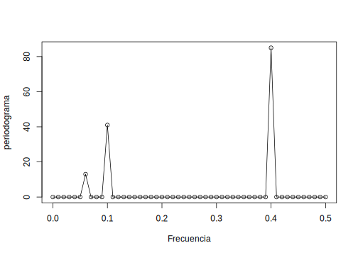
<p class="caption">(\#fig:fig-periodograma-escalado)Periodograma de los datos generados en el Ejemplo ...</p>
</div>

---

Si consideramos los datos $x_t$ en el Ejemplo \@ref(exm:ejem-serie-periodica) como un color (forma de onda) hecho con colores primarios $x_{t1},x_{t2},x_{t3}$ en varias intensidades (amplitudes), entonces podemos considerar el periodograma como un prisma que descompone el color $x_t$ en sus colores primarios (espectro). Por consiguiente el término **análisis espectral**.

Otro hecho que podemos usar para entender el concepto de periodograma es que para cada muestra $x_1,\ldots,x_n$ de una serie temporal donde $n$ es impar, podemos escribir, exactamente

\begin{equation}
x_t=a_0 + \sum_{j=1}^{(n-1)/2}\left[a_j\cos(2\pi tj/n) + b_j\sin(2\pi tj/n)\right],
(\#eq:eq-serie-periodograma-impar)
\end{equation}

para $t=1,\ldots,n$ y coeficientes convenientemente elegidos. Si $n$ es par, la representación (\ref{eq-serie-periodograma-impar}) se puede modificar sumando hasta $(n/2-1)$ y añadiendo una componente adicional dada por $a_{n/2}\cos(2\pi t1/2)=a_{n/2}(-1)^t$. El punto crucial aquí es que \@ref(eq:eq-serie-periodograma-impar) es exacto para cada muestra. Dado que \@ref(eq:eq-proceso-periodico-general) se puede pensar como una aproximación de \@ref(eq:eq-serie-periodograma-impar), la idea es que muchos de los coeficientes en \@ref(eq:eq-serie-periodograma-impar) pueden estar cerca de cero. Recuerde del Ejemplo 3.4.5 que

\begin{equation}
P(j/n) = a_j^2+b_j^2
(\#eq:eq-periodograma-simple)
\end{equation}

de modo que el periodograma escalado indica cuales componentes periódicas en \@ref(eq:eq-serie-periodograma-impar) son grandes y cuales componentes son pequeñas.


## La Densidad Espectral

La idea de que una serie de tiempo está formada por componentes periódicos, apareciendo en proporción a sus varianzas subyacentes es fundamental en la representación espectral dada por los siguientes Teoremas:

\BeginKnitrBlock{theorem}<div class="theorem"><span class="theorem" id="thm:teo-funcion-hermitiana-no-negativa"><strong>(\#thm:teo-funcion-hermitiana-no-negativa) </strong></span>Una función $\gamma(h)$ para $h=0,\pm1,\pm2,\dots$ es Hermitiana no-negativa definida si y solo si se puede expresar como

\begin{equation}
    \gamma(h)=\int_{-1/2}^{1/2}\exp(2\pi i\omega h)dF(\omega)
(\#eq:eq-funcion-hermitiana)
\end{equation}

donde $F(\cdot)$ es monótona no-decreciente. La función $F(\cdot)$ es continua a la derecha, acotada en $[-1/2,1/2]$ y únicamente determinada por las condiciones $F(-1/2)=0,F(1/2)=\gamma(0)$.</div>\EndKnitrBlock{theorem}

\BeginKnitrBlock{proof}<div class="proof">\iffalse{} <span class="proof"><em>Demostración. </em></span>  \fi{}Para demostrar el resultado, note primero que si $\gamma(h)$ tiene la representación de arriba

\begin{eqnarray*}
  \sum_{s=1}^{n}\sum_{t=1}^{n}\bar{a}_s\gamma(s-t)a_t &=& \int_{-1/2}^{1/2}\bar{a}_s\gamma(s-t)a_te^{2\pi i\omega(s-t)}dF(\omega) \\
        &=& \int_{-1/2}^{1/2}\left|\sum_{s=1}^{n}a_se^{-2\pi i\omega s}\right|^2dF(\omega) \\
        &=& \geq 0
\end{eqnarray*}

y $\gamma(h)$ es no-negativa definida. Recíprocamente, suponga que $\gamma(h)$ es una función no-negativa definida, y definamos la función no-negativa

\begin{eqnarray}
  f_n(\omega) &=& \frac{1}{n}\sum_{s=1}^{n}\sum_{t=1}^{n}e^{-2\pi i\omega s}\gamma(s-t)e^{2\pi i\omega t} \nonumber\\
         &=& \frac{1}{n}\sum_{u=-(n-1)}^{(n-1)}(n-|u|)e^{-2\pi i\omega u}\gamma(u) (\#eq:eq-funcion-no-negativa) \\
         &=& \geq 0. \nonumber
\end{eqnarray}

Ahora, sea $F_n(\omega)$ la función de distribución correspondiente a $f_n(\omega)I_{(-1/2,1/2]}$ donde $I_{(\cdot)}$ denota la función indicatriz del intervalo en el subíndice. Note que $F_n(\omega)=0, \omega\leq-1/2$ y $F_n(\omega)=F_n(1/2)$ para $\omega\geq1/2$. Entonces

\begin{eqnarray*}
  \int_{-1/2}^{1/2}e^{2\pi i\omega u}dF_n(\omega) &=& \int_{-1/2}^{1/2}e^{2\pi i\omega u}f_n(\omega)d\omega \\
         &=& \begin{cases}
         (1-|u|/n)\gamma(u)&\text{, }|u|<n\\
         0&\text{, en otro caso}
         \end{cases}
\end{eqnarray*}

También tenemos

\begin{eqnarray*}
  F_n(1/2) &=& \int_{-1/2}^{1/2}f_n(\omega)d\omega \\
         &=& \int_{-1/2}^{1/2}\sum_{|u|<n}(1-|u|/n)\gamma(u)e^{-2\pi i\omega u}d\omega \\
         &=& \gamma(0).
\end{eqnarray*}

Ahora, por el primer teorema de convergencia de Helly [^nota11], existe una subsucesión $F_{n_k}$ convergente a $F$ y por el lema de Helly-Bray, esto implica que

$$\int_{-1/2}^{1/2}e^{2\pi i\omega u}dF_{n_k}(\omega)\to\int_{-1/2}^{1/2}e^{2\pi i\omega u}dF(\omega)$$

y del lado derecho de la ecuación anterior

$$(1-|u|/n_k)\gamma(u)\to\gamma(u)$$

cuando $n_k\to\infty$, y se obtiene el resultado requerido.</div>\EndKnitrBlock{proof}

---

[^nota11]: Véase Bhat, R.R. (1985). *Modern Probability Theory, 2nd ed.*  New York, Wiley, pag157.

Ahora presentamos una versión del Teorema de Representación Espectral en términos de un proceso estacionario de media cero $x_t$. Esta versión nos permite pensar en un proceso estacionario como un proceso generado (aproximadamente) por sumas aleatorias de senos y cosenos tal como se describe en \@ref(eq:eq-proceso-periodico-general).

\BeginKnitrBlock{theorem}<div class="theorem"><span class="theorem" id="thm:teo-representacion-espectral-proceso-estacionario"><strong>(\#thm:teo-representacion-espectral-proceso-estacionario) </strong></span>Si $x_t$ es un proceso estacionario de media cero, con distribución espectral $F(\omega)$ como la dada en el Teorema \@ref(thm:teo-funcion-hermitiana-no-negativa), entonces existe un proceso estocástico a valores complejos $z(\omega)$ en el intervalo $\omega\in[-1/2,1/2]$ con incrementos estacionarios no-correlacionados, tal que $x_t$ se puede escribir como la integral estocástica
$$x_t=\int_{-1/2}^{1/2}\exp(-2\pi it\omega)dz(\omega)$$
donde, para $-1/2\leq\omega_1\leq\omega_2\leq1/2$
$$\text{var}\{z(\omega_2)-z(\omega_1)\}=F(\omega_2)-F(\omega_1).$$</div>\EndKnitrBlock{theorem}

---

Este resultado es muy técnico porque envuelve integración estocástica; es decir, integración respecto a un proceso estocástico. En términos no técnico, el Teorema \@ref(thm:teo-representacion-espectral-proceso-estacionario) dice que \@ref(eq:eq-proceso-periodico-general) es aproximadamente verdadero para cada serie de tiempo estacionaria. En otras palabras,  *cada serie de tiempo estacionaria se puede pensar, aproximadamente, como una superposición aleatoria de senos y cosenos oscilando a distintas frecuencias.*

Dado que \@ref(eq:eq-proceso-periodico-general) es aproximadamente cierta para toda serie de tiempo estacionaria, la siguiente pregunta es si una representación significativa para la función de autocovarianza, como la dada por \@ref(eq:eq-funcion-covarianza-proceso-periodico), también existirá. La respuesta es sí, y su representación es dada por el Teorema \@ref(thm:teo-funcion-hermitiana-no-negativa). El siguiente ejemplo, nos ayudará a explicar estos resultados.

\BeginKnitrBlock{example}\iffalse{-91-85-110-32-112-114-111-99-101-115-111-32-101-115-116-97-99-105-111-110-97-114-105-111-32-112-101-114-105-243-100-105-99-111-93-}\fi{}<div class="example"><span class="example" id="exm:ejem-proceso-estacionario-periodico"><strong>(\#exm:ejem-proceso-estacionario-periodico)  \iffalse (Un proceso estacionario periódico) \fi{} </strong></span>Considere un proceso aleatorio estacionario periódico dado por \@ref(eq:eq-proceso-periodico-2), con frecuencia fija $\omega_0$

$$x_t=U_1\cos(2\pi\omega_0t)+U_2\sin(2\pi\omega_0t)$$

donde $U_1$ y $U_2$ son variables aleatorias independientes de media cero y varianza igual $\sigma^2$. El número de periodos de tiempo necesario para que la serie de arriba complete un ciclo es exactamente $1/\omega_0$, y el proceso hace exactamente $\omega_0$ ciclos por puntos para $t=0,\pm1,\pm2,\ldots$. Es fácil demostrar que
[^nota12]

\begin{eqnarray*}
  \gamma(h) &=& \sigma^2\cos(2\pi\omega_0h)=\frac{\sigma^2}{2}e^{-2\pi i\omega_0h}+\frac{\sigma^2}{2}e^{2\pi i\omega_0h} \\
         &=& \int_{-1/2}^{1/2}e^{2\pi i\omega h}dF(\omega)
\end{eqnarray*}

usando la integración de Riemann-Stieltjes, donde $F(\omega)$ es la función definida por

$$F(\omega)=\begin{cases}
0,&\omega<-\omega_0\\
\sigma^2/2,&-\omega_0\leq\omega<\omega_0\\
\sigma^2,&\omega\geq\omega_0
\end{cases}.$$

La función $F(\omega)$ se comporta como una función de distribución acumulada para una variable aleatoria discreta, excepto que $F(\infty)=\sigma^2=\gamma_x(0)$ en vez de uno. De hecho, $F(\omega)$ es una función de distribución acumulada, no una probabilidad, sino más bien de varianza asociada con la frecuencia $\omega_0$ en un análisis de varianza, siendo $F(\infty)$ la varianza total del proceso $x_t$. Por lo tanto, llamamos a $F(\omega)$ la *función de distribución espectral*.</div>\EndKnitrBlock{example}

---

[^nota12]:Algunas identidades que pueden ayudar aquí: $e^{i\alpha}=\cos(\alpha)+i\sin(\alpha)$, así $\cos(\alpha)=(e^{i\alpha}+e^{-i\alpha})/2$ y $\sin(\alpha)=(e^{i\alpha}-e^{-i\alpha})/2i$.

El Teorema \@ref(thm:teo-funcion-hermitiana-no-negativa) establece que una representación como la dada en el Ejemplo \@ref(exm:ejem-proceso-estacionario-periodico) siempre existirá para un proceso estacionario. En particular, si $x_t$ es estacionario con autocovarianza $\gamma(h)=\mathbb{E}[(x_{t+h}-\mu)(x_t-\mu)]$, entonces existe una única función monótona creciente $F(\omega)$, llamada la **función de distribución espectral**, que es acotada, con $F(-\infty)=F(-1/2)=0$ y $F(\infty)=F(1/2)=\gamma(0)$ tal que

\begin{equation}
  \gamma(h)=\int_{-1/2}^{1/2}e^{2\pi i\omega h}dF(\omega).
(\#eq:eq-funcion-distribucion-espectral)
\end{equation}

Una situación más importante que usaremos repetidamente es cubierta por el Teorema \@ref(thm:teo-densidad-espectral), donde se muestra que, sujeto a la sumabilidad absoluta de la autocovarianza, la función de distribución espectral es absolutamente continua con $dF(\omega)=f(\omega)d\omega$ y la representación \@ref(eq:eq-funcion-distribucion-espectral) motiva la propiedad que sigue.

\BeginKnitrBlock{theorem}<div class="theorem"><span class="theorem" id="thm:teo-densidad-espectral"><strong>(\#thm:teo-densidad-espectral) </strong></span>Si $\gamma(h)$ es la función de autocovarianza de un proceso estacionario $x_t$ con

\begin{equation}
  \sum_{h=-\infty}^{\infty}|\gamma(h)|<\infty
(\#eq:eq-covarianza-convergente)
\end{equation}

entonces la densidad espectral de $x_t$ está dada por

\begin{equation}
  f(\omega)=\sum_{h=-\infty}^{\infty}\gamma(h)e^{-2\pi i\omega h}.
(\#eq:eq-densidad-espectral)
\end{equation}</div>\EndKnitrBlock{theorem}


\BeginKnitrBlock{proposition}\iffalse{-91-76-97-32-68-101-110-115-105-100-97-100-32-69-115-112-101-99-116-114-97-108-93-}\fi{}<div class="proposition"><span class="proposition" id="prp:propie-densidad-espectral"><strong>(\#prp:propie-densidad-espectral)  \iffalse (La Densidad Espectral) \fi{} </strong></span>Si la función de autocovarianza $\gamma(h)$ de un proceso estacionario satisface

\begin{equation}
  \sum_{h=-\infty}^{\infty}|\gamma(h)|<\infty
(\#eq:eq-covarianza-finita)
\end{equation}

entonces esta tiene representación espectral

\begin{equation}
  \gamma(h)=\int_{-1/2}^{1/2}e^{2\pi i\omega h}f(\omega)d\omega\text{ para }h=0,\pm1,\pm2,\ldots
(\#eq:eq-representacion-covarianza)
\end{equation}

como la transformación inversa de la densidad espectral, la cual tiene la representación

\begin{equation}
  f(\omega)=\sum_{h=-\infty}^{\infty}\gamma(h)e^{-2\pi i\omega h}\text{ con }-1/2\leq\omega\leq1/2.
(\#eq:eq-densidad-espectral-covarianza)
\end{equation}</div>\EndKnitrBlock{proposition}

La densidad espectral definida en la Proposición \@ref(prp:propie-densidad-espectral) es análoga a la función de densidad de probabilidad; el hecho de que $\gamma(h)$ es no negativa definida asegura que

$$f(\omega)\geq0$$

para todo $\omega$. Se sigue inmediatamente de \@ref(eq:eq-representacion-covarianza) y \@ref(eq:eq-densidad-espectral-covarianza) que

$$f(\omega)=f(-\omega)$$

y

$$f(\omega+1)=f(\omega)$$

verificando que la densidad espectral es una función par de periodo uno. Debido a que $f(\omega)$ es una función par, normalmente se graficará solo $f(\omega)$ para $\omega\geq0$.

Adicionalmente, haciendo $h=0$ en \@ref(eq:eq-representacion-covarianza) se obtiene

$$\gamma(0)=\text{var}(x_t)=\int_{-1/2}^{1/2}f(\omega)d\omega$$

lo cual expresa la varianza total como la integral de la densidad espectral sobre todas las frecuencias. Demostraremos luego, que un filtro lineal puede aislar la varianza en ciertos intervalos de frecuencias o bandas.

Análogo a la teoría de probabilidades, $\gamma(h)$ en \@ref(eq:eq-representacion-covarianza) es la función característica de la densidad espectral $f(\omega)$ en \@ref(eq:eq-densidad-espectral-covarianza). Estos hechos deben dejar claro que, cuando la condición de la Proposición \@ref(prp:propie-densidad-espectral) es satisfecha, la función de autocovarianza $\gamma(h)$ y la función de densidad espectral $f(\omega)$ contienen la misma información. Esta información, sin embargo, es expresada de distintas maneras. La función de autocovarianza expresa la información en términos de pasos o saltos, mientras que la densidad espectral expresa la misma información en término de ciclos. Algunos de los problemas son más fáciles de trabajar cuando consideramos la información de pasos o saltos y tendemos a manejar los problemas en el dominio del tiempo. Sin embargo, otros problemas son más fáciles de trabajar teniendo en cuenta la información periódica y tendemos a manejar los problemas en el dominio espectral o de frecuencias.

También debemos mencionar, que hasta ahora nos hemos enfocado en la frecuencia $\omega$ expresada en ciclos por puntos de tiempo, en lugar de la más común (en estadística) alternativa $\lambda=2\pi\omega$ que nos da radianes por puntos. Finalmente, la condición de sumabilidad absoluta \@ref(eq:eq-covarianza-finita) no es satisfecha por \@ref(eq:eq-funcion-covarianza-proceso-periodico), el ejemplo que introdujimos para dar las ideas de representación espectral. La condición, sin embargo, es satisfecha para modelos ARMA.

Note que la función de autocovarianza $\gamma(h)$ en \@ref(eq:eq-representacion-covarianza) y la densidad espectral $f(\omega)$ en \@ref(eq:eq-densidad-espectral-covarianza) son pares de transformadas de Fourier. En general, tenemos la siguiente definición:

\BeginKnitrBlock{definition}<div class="definition"><span class="definition" id="def:defi-par-transformadas-fourier"><strong>(\#def:defi-par-transformadas-fourier) </strong></span>Para una función  general $\{a_t;t=0,\pm1,\pm2,\ldots\}$ que satisface la condición de sumabilidad absoluta

\begin{equation}
  \sum_{t=-\infty}^{\infty}|a_t|<\infty,
(\#eq:eq-cond-sumabilidad-absoluta)
\end{equation}

definimos el **par de transformadas de Fourier** de la forma

\begin{equation}\label{}
  A(\omega)=\sum_{t=-\infty}^{\infty}a_te^{-2\pi i\omega t}
(\#eq:eq-transformada-fourier-A)
\end{equation}

y

\begin{equation}\label{}
  a_t=\int_{-1/2}^{1/2}A(\omega)e^{2\pi i\omega t}d\omega
(\#eq:eq-transformada-fourier-a)
\end{equation}</div>\EndKnitrBlock{definition}

El uso de \@ref(eq:eq-representacion-covarianza) y \@ref(eq:eq-densidad-espectral-covarianza) como par de transformadas de Fourier es fundamental en el estudio de procesos estacionarios a tiempo discreto. Bajo la condición de sumabilidad, el par de transformadas de Fourier \@ref(eq:eq-representacion-covarianza) y \@ref(eq:eq-densidad-espectral-covarianza) existirá y esta relación es única.


Si $f(\omega)$ y $g(\omega)$ son dos densidades espectrales para lo cual

\begin{equation}
\int_{-1/2}^{1/2}f(\omega)e^{2\pi i\omega h}d\omega=\int_{-1/2}^{1/2}g(\omega)e^{2\pi i\omega h}d\omega
(\#eq:eq-igualdad-densidades-f-g)
\end{equation}

para todo $h=0,\pm1,\pm2,\ldots$, entonces

\begin{equation}
f(\omega)=g(\omega)
(\#eq:eq-igualdad-densidades-f-g-cs)
\end{equation}

casi siempre.


\BeginKnitrBlock{example}\iffalse{-91-83-101-114-105-101-32-100-101-32-114-117-105-100-111-32-98-108-97-110-99-111-93-}\fi{}<div class="example"><span class="example" id="exm:ejem-espectro-serie-ruido-blanco"><strong>(\#exm:ejem-espectro-serie-ruido-blanco)  \iffalse (Serie de ruido blanco) \fi{} </strong></span>
Como un ejemplo sencillo, consideremos el espectro de potencias teórica de una sucesión de variables aleatorias no correlacionadas $w_t$ con varianza $\sigma_w^2$. Dado que la función de autocovarianza fue calculada en \@ref(eq:eq-funcion-autocovarianza-ruido-blanco) como $\gamma_w(h)=\sigma_w^2$ para $h=0$ y cero en cualquier otro caso, se sigue de \@ref(eq:eq-densidad-espectral-covarianza) que

$$f_w(\omega)=\sigma_w^2$$

para $-1/2\leq\omega\leq1/2$ con la misma potencia para todas las frecuencias. Esta propiedad se ve en la realización, el cual parece contener todas las diferentes frecuencias en proporciones similares. La figura \@ref(fig:fig-espectros-teoricos) (parte superior) muestra la gráfica del espectro de un ruido blanco con $\sigma_w^2=1$.
</div>\EndKnitrBlock{example}


\BeginKnitrBlock{example}\iffalse{-91-85-110-32-112-114-111-109-101-100-105-111-32-109-243-118-105-108-32-115-105-109-112-108-101-93-}\fi{}<div class="example"><span class="example" id="exm:ejem-espectro-promedio-movil-simple"><strong>(\#exm:ejem-espectro-promedio-movil-simple)  \iffalse (Un promedio móvil simple) \fi{} </strong></span>
Una serie que no tiene una proporción igual de frecuencias es la serie de ruido blanco suavizada que se muestra en la parte inferior de la primera Figura del Ejemplo \@ref(exm:ejem-promedio-movil-ruido-blanco). Específicamente construimos una serie de promedio móvil de tres puntos definida por

$$v_t=\frac{1}{3}(w_{t-1}+w_t+w_{t+1}).$$

Es claro de la realización del ejemplo que la serie tiene menos frecuencias altas, calculando su espectro de potencias se verifica este hecho. En el Ejemplo \@ref(exm:ejem-ACF-MA) calculamos su función de autocovarianza, obteniendo

$$\gamma_v(h)=\frac{\sigma_w^2}{9}(3-|h|)$$

para $|h|\leq2$ y $\gamma_v(h)=0$ para $|h|>2$.

Entonces, usando \@ref(eq:eq-densidad-espectral-covarianza) nos da

\begin{eqnarray*}
f_v(\omega) &=& \sum_{h=-2}^{2}\gamma_v(h)e^{-2\pi i\omega h} \\
         &=& \frac{\sigma_w^2}{9}(e^{-4\pi i\omega}+e^{4\pi i\omega})+\frac{2\sigma_w^2}{9}(e^{-2\pi i\omega}+e^{2\pi\omega})+\frac{3\sigma_w^2}{9} \\
         &=& \frac{\sigma_w^2}{9}[3+4\cos(2\pi\omega)+2\cos(4\pi\omega)]
\end{eqnarray*}

Graficando el espectro para $\sigma_w^2=1$, como en la Figura \@ref(fig:fig-espectros-teoricos), se muestra que las frecuencias cercanas a cero tiene mayor potencia y las energías más grandes, $\omega>0.2$ tienen menor potencia.
</div>\EndKnitrBlock{example}


\BeginKnitrBlock{example}\iffalse{-91-85-110-97-32-115-101-114-105-101-32-97-117-116-111-114-101-103-114-101-115-105-118-97-32-100-101-32-115-101-103-117-110-100-111-32-111-114-100-101-110-93-}\fi{}<div class="example"><span class="example" id="exm:ejem-espectro-AR2"><strong>(\#exm:ejem-espectro-AR2)  \iffalse (Una serie autoregresiva de segundo orden) \fi{} </strong></span>
Consideremos el espectro de una serie AR(2) de la forma

$$x_t-\phi_1x_{t-1}-\phi_2x_{t-2}=w_t$$

para el caso especial $\phi_1=1$ y $\phi_2=-0.9$. Recuerde el Ejemplo \@ref(exm:ejem-ACF-MA) el cual muestra una realización de este proceso con $\sigma_w^2=1$. Note que los datos exhiben una fuerte componente periódica de un ciclo cada seis puntos. Primero, calculemos la función de autocovarianza del lado derecho e igualemos este a la autocovarianza de la parte izquierda

\begin{eqnarray*}
  \gamma_w(h) &=& \mathbb{E}[(x_{t+h}-\phi_1x_{t+h-1}-\phi_2x_{t+h-2})(x_t-\phi_1x_{t-1}-\phi_2x_{t-2})] \\
         &=& [1+\phi_1^2+\phi_2^2]\gamma_x(h)+(\phi_1\phi_2-\phi_1)[\gamma_x(h+1)+\gamma_x(h-1)]-\phi_2[\gamma_x(h+2)+\gamma_x(h-2)] \\
         &=& 2.81\gamma_x(h)-1.9[\gamma_x(h+1)+\gamma_x(h-1)]+0.9[\gamma_x(h+2)+\gamma_x(h-2)],
\end{eqnarray*}

hemos sustituido los valores de $\phi_1=1$ y $\phi_2=-0.9$ en la ecuación.

Ahora, sustituyendo la representación espectral para $\gamma_x(h)$ en la ecuación anterior, se tiene

\begin{eqnarray*}
  \gamma_w(h) &=& \int_{-1/2}^{1/2}[2.81-1.90(e^{2\pi i\omega}+e^{-2\pi i\omega})+0.90(e^{4\pi i\omega}+e^{-4\pi i\omega})]e^{2\pi i\omega h}f_x(\omega)d\omega \\
         &=& \int_{-1/2}^{1/2}[2.81-3.80\cos(2\pi\omega)+1.80\cos(4\pi\omega)]e^{2\pi i\omega h}f_x(\omega)d\omega.
\end{eqnarray*}

Si el espectro del proceso de ruido blanco es $g_w(\omega)$, la unicidad de la transformada de Fourier nos permite identificar
$$g_w(\omega)=[2.81-3.80\cos(2\pi\omega)+1.80\cos(4\pi\omega)]f_x(\omega).$$

Pero, como ya hemos visto, $g_w(\omega)=\sigma_w^2$ de donde se deduce que

$$f_x(\omega)=\frac{\sigma_w^2}{2.81-3.80\cos(2\pi\omega)+1.80\cos(4\pi\omega)}$$

es el espectro de la serie autoregresiva. Haciendo $\sigma_w^2=1$ se tiene el espectro $f_x(\omega)$ mostrado en la Figura \@ref(fig:fig-espectros-teoricos), y donde muestra una componente de potencia fuerte alrededor de $\omega=0.16$ ciclos por puntos o un periodo entre seis y siete ciclos por puntos y potencias muy pequeñas en las otras frecuencias. En este caso, modificando la serie de ruido blanco aplicando un operador AR de orden dos ha concentrado la potencia o varianza de la serie resultante en una banda de frecuencia bastante estrecha.
</div>\EndKnitrBlock{example}

\begin{figure}[h!]
\centering
  \includegraphics[width=16cm]{Densidades-espectrales.png}\\
  \caption{Espectros teóricos de un ruido blanco (superior), promedio móvil de ruido blanco (medio) y proceso AR(2) (inferior)}
  \label{grafico-espectros-teoricos}
\end{figure}


```r
n=100
sigma2=1
w=seq(0,0.5,length=n)
# Calculo de las densidades espectrales
fw=numeric(n)
fv=numeric(n)
fx=numeric(n)
for (i in 1:n){
  fw[i]=sigma2
  fv[i]=(sigma2/9)*(3+4*cos(2*pi*w[i])+2*cos(4*pi*w[i]))
  fx[i]=sigma2/(2.81-3.80*cos(2*pi*w[i])+1.80*cos(4*pi*w[i]))
}
# Graficos
par(mfrow=c(3,1))
plot(w,fw,type="l", main="Ruido blanco", ylab="Potencia")
plot(w,fv,type="l", main="Promedio movil del ruido blanco", ylab="Potencia")
plot(w,fx,type="l", main="AR(2)", ylab="Potencia", xlab="Frecuencia")
```

<div class="figure">

<p class="caption">(\#fig:fig-espectros-teoricos)Espectros teóricos de un ruido blanco (superior), promedio móvil de ruido blanco (medio) y proceso AR(2) (inferior)</p>
</div>

---

Los ejemplos anteriores han sido dados para motivar el uso de los espectros de potencias para describir las fluctuaciones de la varianza teórica de una serie estacionaria. Es más, la interpretación de la función de densidad espectral como la varianza de la serie de tiempo sobre una banda de frecuencia dada nos da una explicación intuitiva del significado físico. La gráfica de la función $f(\omega)$sobre el argumento de frecuencia $\omega$ puede ser pensado como un análisis de varianza, en el cual las columnas o bloques efectivos son las frecuencias indexadas por $\omega$.


## Periodograma y Transformada Discreta de Fourier

Ahora estamos listos para unir el periodograma, que es el concepto basada en la muestra presentado en la sección [Comportamiento Cíclico y Periodicidad], con la densidad espectral, que es el concepto basado en la población descrito en la sección [La Densidad Espectral].

\BeginKnitrBlock{definition}<div class="definition"><span class="definition" id="def:defi-TDF"><strong>(\#def:defi-TDF) </strong></span>Dado los datos $x_1,x_2,\ldots,x_n$, definimos la **Transformada Discreta de Fourier (TDF)** como

\begin{equation}
  d(\omega_j)=n^{-1/2}\sum_{t=1}^{n}x_te^{-2\pi i\omega_jt}
(\#eq:eq-TDF)
\end{equation}

para $j=0,1,\ldots,n-1$, donde las frecuencias $\omega_j=j/n$ son llamadas las *frecuencias de Fourier* o *frecuencias fundamentales*.</div>\EndKnitrBlock{definition}

---

Si $n$ es un número altamente compuesto (i.e., tiene muchos factores), la TDF se puede calcular usando la Transformada Rápida de Fourier (FFT). A veces es útil explotar el resultado de inversión para TDF que muestra que la transformación lineal es de uno a uno. Para la inversa de TDF, tenemos

\begin{equation}
  x_t=n^{-1/2}\sum_{j=0}^{n-1}d(\omega_j)e^{2\pi i\omega_jt}
(\#eq:eq-inversa-TDF)
\end{equation}

para $t=1,2,\ldots,n$.

\BeginKnitrBlock{definition}<div class="definition"><span class="definition" id="def:defi-periodograma"><strong>(\#def:defi-periodograma) </strong></span>Dados los datos $x_1,x_2,\ldots,x_n$ definimos el **periodograma** como

\begin{equation}
  I(\omega_j)=|d(\omega_j)|^2
(\#eq:eq-periodograma-datos)
\end{equation}

para $j=0,1,2,\ldots,n-1$.\footnote{Si $z=a+ib$ es un número complejo, entonces $\bar{z}=a-ib$ y $|z|^2=z\bar{z}=a^2+b^2$.}</div>\EndKnitrBlock{definition}

---

Note que $I(0)=n\bar{x}^2$, donde $\bar{x}$ es la media muestral. Además, dado que $\sum_{t=1}^{n}\exp(-2\pi i\omega_jt)=0$ para $j\neq0$, [^nota13]  podemos escribir la TDF como

\begin{equation}
  d(\omega_j)=n^{-1/2}\sum_{t=1}^{n}(x_t-\bar{x})e^{-2\pi i\omega_jt}
(\#eq:eq-TDF-2)
\end{equation}

para $j\neq0$.

[^nota13]: Note que $\sum_{t=1}^{n}z^t=z\frac{1-z^n}{1-z}$ para $z\neq1$.

Entonces, para $j\neq0$,

\begin{eqnarray}
  I(\omega_j)=|d(\omega_j)|^2 &=& n^{-1}\sum_{t=1}^{n}\sum_{s=1}^{n}(x_t-\bar{x})(x_s-\bar{x})e^{-2\pi i\omega_j(t-s)} \nonumber\\
         &=& n^{-1}\sum_{t=1}^{n}\sum_{s=1}^{n}(x_{t+|h|}-\bar{x})(x_t-\bar{x})e^{-2\pi i\omega_jh} \nonumber \\
         &=& \sum_{h=-(n-1)}^{n-1}\hat{\gamma}(h)e^{-2\pi i\omega_jh} (\#eq:eq-periodograma-acf)
\end{eqnarray}

donde hemos hecho $h=t-s$ con $\hat{\gamma}(h)$ [^nota22]. Recuerde que $P(\omega_j)=(4/n)I(\omega_j)$ donde $P(\omega_j)$ es el periodograma escalado definido en \@ref(eq:eq-periodograma-escalado). Por consiguiente, trabajaremos con $I(\omega_j)$ en vez de $P(\omega_j)$.

[^nota22]: Aquí usamos la *función de autocovarianza muestral*  definida como $$
\hat{\gamma}(h)=n^{-1}\sum_{t=1}^{n-h}(x_{t+h}-\bar{x})(x_t-\bar{x})
$$ con $\hat{\gamma}(-h)=\hat{\gamma}(h)$ para $h=0,1,\ldots,n-1$.

A veces es útil trabajar con las partes real e imaginarias de la TDF individualmente, de donde tenemos la siguiente definición:

\BeginKnitrBlock{definition}<div class="definition"><span class="definition" id="def:defi-transformadas-seno-coseno"><strong>(\#def:defi-transformadas-seno-coseno) </strong></span>Dados las datos $x_1,x_2,\ldots,x_n$ definimos la **transformada de cosenos** como

\begin{equation}
  d_c(\omega_j)=n^{-1/2}\sum_{t=1}^{n}x_t\cos(2\pi\omega_jt)
(\#eq:eq-transformada-coseno)
\end{equation}

y la **transformada de senos** como

\begin{equation}
  d_s(\omega_j)=n^{-1/2}\sum_{t=1}^{n}x_t\sin(2\pi\omega_jt)
(\#eq:eq-transformada-seno)
\end{equation}

donde $\omega_j=j/n$ para $j=0,1,2,\ldots,n-1$.</div>\EndKnitrBlock{definition}

---

Note que $d(\omega_j)=d_c(\omega_j)-id_s(\omega_j)$ y por lo tanto

\begin{equation}
  I(\omega_j)=d_c^2(\omega_j)+d_s^2(\omega_j)
(\#eq:eq-periodograma-transf-seno-coseno)
\end{equation}

\BeginKnitrBlock{example}\iffalse{-91-65-78-79-86-65-32-101-115-112-101-99-116-114-97-108-93-}\fi{}<div class="example"><span class="example" id="exm:ejem-ANOVA-espectral"><strong>(\#exm:ejem-ANOVA-espectral)  \iffalse (ANOVA espectral) \fi{} </strong></span>Sea $x_1,x_2,\ldots,x_n$ una muestra de tamaño $n$, donde para simplificar $n$ es impar. Entonces, recordando el Ejemplo \@ref(exm:ejem-periodograma-escalado), se tiene

\begin{equation}
  x_t=a_0+\sum_{j=1}^{m}[a_j\cos(2\pi\omega_jt)+b_j\sin(2\pi\omega_jt)]
(\#eq:eq-e4p27)
\end{equation}

donde $m=(n-1)/2$ es exacto para $t=1,2,\ldots,n$. En particular, usando la fórmula de regresión multiples, tenemos $a_0=\bar{x}$

\begin{eqnarray*}
  a_j &=& \frac{2}{n}\sum_{t=1}^{n}x_t\cos(2\pi\omega_jt)=\frac{2}{\sqrt{n}}d_c(\omega_j) \\
  b_j &=& \frac{2}{n}\sum_{t=1}^{n}x_t\sin(2\pi\omega_jt)=\frac{2}{\sqrt{n}}d_s(\omega_j)
\end{eqnarray*}

Por consiguiente, podemos escribir

$$(x_t\bar{x})=\frac{2}{\sqrt{n}}\sum_{j=1}^{m}[d_c(\omega_j)\cos(2\pi\omega_jt)+d_s(\omega_j)\sin(2\pi\omega_jt)]$$

para $t=1,2,\ldots,n$. Elevando al cuadrado ambos miembros y sumando tenemos [^nota14]

$$\sum_{t=1}^{n}(x_t-\bar{x})^2=2\sum_{j=1}^{m}\left[d_c^2(\omega_j)+d_s^2(\omega_j)\right]=2\sum_{j=1}^{m}I(\omega_j)$$

En consecuencia, hemos particionado la suma de cuadrados en componentes armónicas representadas por las frecuencias $\omega_j$ con el periodograma $I(\omega_j)$ siendo la regresión cuadrada media.

[^nota14]: Recuerde que $\sum_{t=1}^{n}\cos^2(2\pi\omega_jt)=\sum_{t=1}^{n}\sin^2(2\pi\omega_jt)=n/2$ para $j\neq0$ o un múltiplo de $n$. También $\sum_{t=1}^{n}\cos(2\pi\omega_jt)\sin(2\pi\omega_kt)=0$ para cada $j$ y $k$.

Esto nos lleva a la tabla ANOVA

| Fuente  | g.l.  | SC  | MS  |
|:-:|:-:|:-:|:-:|
| $\omega_1$  |  2 | $2I(\omega_1)$  |  $I(\omega_1)$ |
| $\omega_2$  |  2 | $2I(\omega_2)$  |  $I(\omega_2)$ |
| $\vdots$  | $\vdots$  | $\vdots$  | $\vdots$  |
| $\omega_m$  |  2 | $2I(\omega_m)$  |  $I(\omega_m)$ |
|Total | $n-1$ | $\sum_{t=1}^{n}(x_t-\bar{x})^2$ | |


Esta descomposición significa que si los datos contienen alguna componente periódica fuerte, entonces los valores del periodograma correspondientes a estas frecuencias (o cercano a estas frecuencias) serán grandes. Por otra parte, los valores del periodograma serán pequeños para componentes periódicas no presentes en los datos.
</div>\EndKnitrBlock{example}

---

Ahora estamos listos para presentar algunas propiedades de muestras grandes del periodograma. Primero, sea $\mu$ la media de un proceso estacionario $x_t$ con función de autocovarianza absolutamente sumable $\gamma(h)$ y densidad espectral $f(\omega)$. Podemos usar el mismo argumento como en \@ref(eq:eq-periodograma-acf) reemplazando $\bar{x}$ por $\mu$ en \@ref(eq:eq-TDF-2) para escribir

\begin{equation}
  I(\omega_j)=n^{-1}\sum_{h=-(n-1)}^{n-1}\sum_{t=1}^{n-|h|}(x_{t+|h|}-\mu)(x_t-\mu)e^{-2\pi i\omega_jh}
(\#eq:eq-periodograma-dobe-suma)
\end{equation}

donde $\omega_j$ es una frecuencia fundamental no cero. Tomando esperanza en \@ref(eq:eq-periodograma-dobe-suma) obtenemos

\begin{equation}
  \mathbb{E}[I(\omega_j)]=\sum_{h=-(n-1)}^{n-1}\left(\frac{n-|h|}{n}\right)\gamma(h)e^{-2\pi i\omega_jh}.
(\#eq:eq-esperanza-periodograma)
\end{equation}

Para cada $\omega\neq0$ dado, elegimos una frecuencia fundamental $\omega_{j:n}\to\omega$ cuando $n\to\infty$ [^nota15] de lo cual se sigue por \@ref(eq:eq-esperanza-periodograma) que

[^nota15]: Esto significa que $\omega_{j:n}$ es una frecuencia de la forma $j_n/n$ donde $\{j_n\}$ es una sucesión de enteros elegidos de modo que $j_n/n\to\omega$ cuando $n\to\infty$.

\begin{equation}
  \mathbb{E}(I(\omega_{j:n})]\to f(\omega)=\sum_{h=-\infty}^{\infty}\gamma(h)e^{-2\pi  ih\omega}
(\#eq:eq-convergencia-esperanza-periodograma-densidad)
\end{equation}

cuando $n\to\infty$. [^nota16]  En otras palabras, bajo la sumabilidad absoluta de $\gamma(h)$, la densidad espectral es la media a largo plazo del periodograma.

[^nota16]: De la definición \@ref(def:defi-periodograma) tenemos que $I(0)=n\bar{x}^2$, así, el resultado análogo para el caso $\omega=0$ es $\mathbb{E}[I(0)]-n\mu^2=n\text{var}(\bar{x})\to f(0)$ cuando $n\to\infty$.

Para examinar la distribución asintótica del periodograma, note que si $x_t$ es una serie de tiempo normal, las transformadas de senos y cosenos serán conjuntamente normal, porque sus combinaciones lineales son variables aleatorias conjuntamente normal $x_1,x_2,\ldots,x_n$. En este caso, la suposición de que la función de covarianza satisface la condición

\begin{equation}
  \theta=\sum_{h=-\infty}^{\infty}|h||\gamma(h)|<\infty
(\#eq:eq-conv-absoluta-covarianza)
\end{equation}

es suficiente para obtener aproximaciones de muestras grandes simples de la varianza y la covarianza.

Usando el mismo argumento para desarrollar \@ref(eq:eq-esperanza-periodograma) tenemos

\begin{eqnarray}
  \text{cov}[d_c(\omega_j),d_c(\omega_k)] &=& n^{-1}\sum_{s=1}^{n}\sum_{t=1}^{n}\gamma(s-t)\cos(2\pi\omega_js)\cos(2\pi\omega_kt) (\#eq:eq-covarianza-coseno-coseno) \\
  \text{cov}[d_c(\omega_j),d_s(\omega_k)] &=& n^{-1}\sum_{s=1}^{n}\sum_{t=1}^{n}\gamma(s-t)\cos(2\pi\omega_js)\sin(2\pi\omega_kt) (\#eq:eq-covarianza-coseno-seno) \\
  \text{cov}[d_s(\omega_j),d_s(\omega_k)] &=& n^{-1}\sum_{s=1}^{n}\sum_{t=1}^{n}\gamma(s-t)\sin(2\pi\omega_js)\sin(2\pi\omega_kt) (\#eq:eq-covarianza-seno-seno)
\end{eqnarray}

donde los términos de la varianza se obtienen haciendo $\omega_j=\omega_k$ en \@ref(eq:eq-covarianza-coseno-coseno) y \@ref(eq:eq-covarianza-seno-seno).

Se puede demostrar que los términos en \@ref(eq:eq-covarianza-coseno-coseno) y \@ref(eq:eq-covarianza-seno-seno) tienen propiedades interesantes bajo la suposición \@ref(eq:eq-conv-absoluta-covarianza), por ejemplo, para $\omega_j,\omega_k\neq0$ o 1/2.

\begin{eqnarray}
  \text{cov}[d_c(\omega_j),d_c(\omega_k)] &=& \begin{cases}f(\omega_j)/2+\epsilon_n, & \omega_j=\omega_k\\
                                                            \epsilon_n,& \omega_j\neq\omega_k \end{cases} (\#eq:eq-cov-coseno-coseno-2) \\
  \text{cov}[d_s(\omega_j),d_s(\omega_k)] &=& \begin{cases}f(\omega_j)/2+\epsilon_n, & \omega_j=\omega_k\\
                                                            \epsilon_n,& \omega_j\neq\omega_k \end{cases} (\#eq:eq-cov-seno-seno-2)
\end{eqnarray}

y

\begin{equation}
  \text{cov}[d_c(\omega_j),d_s(\omega_k)] = \epsilon_n
(\#eq:eq-cov-coseno-seno-2)
\end{equation}

donde el término de error $\epsilon_n$ en la aproximación se puede acotar por

\begin{equation}
  |\epsilon_n|\leq\theta/n
(\#eq:eq-cota-epsilon-n)
\end{equation}

y $\theta$ está dado por \@ref(eq:eq-conv-absoluta-covarianza). Si $\omega_j=\omega_k=0$ o 1/2 en \@ref(eq:eq-cov-coseno-coseno-2) el múltiplo 1/2 desaparece; note que $d_s(0)=d_s(1/2)=0$, de modo que \@ref(eq:eq-cov-seno-seno-2) no aplica.


\BeginKnitrBlock{example}\iffalse{-91-67-111-118-97-114-105-97-110-122-97-115-32-100-101-32-115-101-110-111-115-32-121-32-99-111-115-101-110-111-115-32-112-97-114-97-32-117-110-32-112-114-111-99-101-115-111-32-77-65-93-}\fi{}<div class="example"><span class="example" id="exm:ejem-cov-seno-coseno-MA"><strong>(\#exm:ejem-cov-seno-coseno-MA)  \iffalse (Covarianzas de senos y cosenos para un proceso MA) \fi{} </strong></span>Para la serie de promedio móvil de tres puntos del Ejemplo \@ref(exm:ejem-espectro-promedio-movil-simple), el espectro teórico se mostraba en la Figura \@ref(fig:fig-espectros-teoricos). Para $n=256$ puntos, la matriz de covarianza teórica del vector

$$\textbf{d}=(d_c(\omega_{26}),d_s(\omega_{26}),d_c(\omega_{27}),d_s(\omega_{27}))^t$$

es

$$\text{cov}(\textbf{d})=\left(
                         \begin{array}{cccc}
                            0.3752 & -0.0009 & -0.0022 & -0.0010 \\
                           -0.0009 &  0.3777 & -0.0009 &  0.0003 \\
                           -0.0022 & -0.0009 &  0.3667 & -0.0010 \\
                           -0.0010 &  0.0003 & -0.0010 &  0.3692 \\
                         \end{array}
                       \right)$$

Los elementos de la diagonal se pueden comparar con los valores del espectro teórico de 0,7548 para el espectro en frecuencia $\omega_{26}=0.102$ y de 0,7378 para el espectro en $\omega_{27}=0.105$.

Por consiguiente, las transformadas de senos y cosenos produce variables casi no correlacionadas con varianzas aproximadamente igual a un medio del espectro teórico. Para este caso particular, la cota uniforme es determinada por $\theta=8/9$ obteniéndose $|\epsilon_{256}|\leq0.0035$ para la cota del error de aproximación.
</div>\EndKnitrBlock{example}

---

Si $x_t\sim\text{iid}(0,\sigma^2)$, entonces se sigue de \@ref(eq:eq-conv-absoluta-covarianza) a \@ref(eq:eq-cov-coseno-seno-2) y del Teorema Central del Límite [^nota17]  que

\begin{equation}
  d_c(\omega_{j:n})\sim AN(0,\sigma^2/2)\text{   y   }d_s(\omega_{j:n})\sim AN(0,\sigma^2/2)
(\#eq:eq-convergencia-AN-transf-seno-coseno)
\end{equation}

conjunta e independientemente, e independiente de $d_c(\omega_{k:n})$ y $d_s(\omega_{k:n})$ siempre que $\omega_{j:n}\to\omega_1$ y $\omega_{k:n}\to\omega_2$ donde $0<\omega_1\neq\omega_2<1/2$. Note que en este caso $f(\omega)=\sigma^2$. En vista de \@ref(eq:eq-convergencia-AN-transf-seno-coseno) se sigue inmediatamente que cuando $n\to\infty$

\begin{equation}
  \frac{2I(\omega_{j:n})}{\sigma^2}\overset{d}{\to}\chi_2^2\text{   y   }\frac{2I(\omega_{k:n})}{\sigma^2}\overset{d}{\to}\chi_2^2
(\#eq:eq-conv-distribucion-periodograma)
\end{equation}

con $I(\omega_{j:n})$ e $I(\omega_{k:n})$ siendo asintóticamente independientes, donde $\chi^2_{\nu}$ denota una variable aleatoria chi-cuadrado con $\nu$ grados de libertad. Usando el Teorema Central del Límite es bastante fácil extender los resultados del caso iid al caso de procesos lineales.

[^nota17]: Si $Y_j\sim\text{iid}(0,\sigma^2)$ y $\{a_j\}$ son constantes para las cuales $\sum_{j=1}^{n}a_j^2/\max_{1\leq j\leq n}a_j^2\to\infty$ cuando $n\to\infty$, entonces $\sum_{j=1}^{n}a_jY_j\sim AN\left(0,\sigma^2\sum_{j=1}^{n}a_j^2\right)$; la notación $AN$ significa asintóticamente normal.

\BeginKnitrBlock{proposition}\iffalse{-91-68-105-115-116-114-105-98-117-99-105-243-110-32-100-101-32-108-97-115-32-79-114-100-101-110-97-100-97-115-32-100-101-32-117-110-32-80-101-114-105-111-100-111-103-114-97-109-97-93-}\fi{}<div class="proposition"><span class="proposition" id="prp:propie-distrib-ordenadas-periodograma"><strong>(\#prp:propie-distrib-ordenadas-periodograma)  \iffalse (Distribución de las Ordenadas de un Periodograma) \fi{} </strong></span>Si

\begin{equation}
  x_t=\sum_{j=-\infty}^{\infty}\psi_jw_{t-j}\text{,  }\sum_{j=-\infty}^{\infty}|\psi_j|<\infty
(\#eq:eq-condicion-proceso-MA)
\end{equation}

donde $w_t\sim\text{iid}(0,\sigma_w^2)$ y \@ref(eq:eq-conv-absoluta-covarianza) vale, entonces para cada sucesión de $m$ frecuencias distintas $\omega_j$ con $\omega_{j:n}\to\omega_j$
  
\begin{equation}
  \frac{2I(\omega_{j:n})}{f(\omega_j)}\overset{d}{\to}\text{iid}\chi^2_2
(\#eq:eq-distrib-ordenadas-periodograma)
\end{equation}

siempre que $f(\omega_j)>0$ para $j=1,2,\ldots,m$.</div>\EndKnitrBlock{proposition}

---

La distribución resultante en \@ref(eq:eq-distrib-ordenadas-periodograma) se puede usar para obtener un intervalo de confianza aproximado para el espectro en la manera usual. Sea $\chi^2_{\nu}(\alpha)$ la probabilidad $\alpha$ de cola inferior para la distribución chi-cuadrado con $\nu$ grados de libertad, esto es,

\begin{equation}
  P\{\chi^2_{\nu}\leq\chi^2_{\nu}(\alpha)\}=\alpha.
(\#eq:eq-probabilidad-chi-2-cola-inferior)
\end{equation}

Entonces, un intervalo de confianza aproximado del $100(1-\alpha)\%$ para la función de densidad espectral es de la forma

\begin{equation}
  \frac{2I(\omega_{j:n})}{\chi^2_2(1-\alpha/2)}\leq f(\omega)\leq\frac{2I(\omega_{j:n})}{\chi^2_2(\alpha/2)}
(\#eq:eq-intervalo-confianza-densidad-espectral)
\end{equation}


\BeginKnitrBlock{example}\iffalse{-91-80-101-114-105-111-100-111-103-114-97-109-97-32-100-101-32-83-79-73-32-121-32-115-101-114-105-101-32-100-101-32-114-101-99-108-117-116-97-109-105-101-110-116-111-32-40-110-117-101-118-111-115-32-112-101-99-101-115-41-93-}\fi{}<div class="example"><span class="example" id="exm:ejem-periodograma-SOI"><strong>(\#exm:ejem-periodograma-SOI)  \iffalse (Periodograma de SOI y serie de reclutamiento (nuevos peces)) \fi{} </strong></span>La Figura \@ref(fig:fig-periodograma-SOI) muestra el periodograma de las series SOI y nuevos peces.

Note que $\chi^2_2(0.025)=0.0506$ y $\chi^2_2(0.975)=7.3778$, de allí podemos obtener un intervalo de confianza aproximado del 95% para las frecuencias de interés, en este caso $\omega_j=1/12$. 
Para este valor, se tiene $I_S(1/12)=2.6084$, luego un intervalo de confianza aproximado del 95% para el espectro $f_S(1/12)$ es

$$[2(2.6084)/7.3778; 2(2.6084)/0.0506]=[0.7071;103.0254]$$

lo cual es muy amplio para que sea de utilidad, sin embargo ese valor es mayor que cualquier otro valor de la ordenada del periodograma, así podemos decir que este valor es significativo. Por otra parte un intervalo de confianza aproximado del 95% para la otra frecuencia de interés ($\omega_j=1/48$) para $f_S(1/48)$ es de la forma

$$[2(0.3804)/7.3778; 2(0.3804)/0.0506]=[0.1031; 15.0355]$$

el cual también es bastante amplio, pero en este caso no es posible establecer una significancia para el pico espectral.

Los comandos en R para calcular los periodogramas y generar los gráficos son los siguientes:</div>\EndKnitrBlock{example}


```r
soi=scan('data/soi.txt')
rec=scan('data/recruit.txt')
par(mfrow=c(2,1)) 
soi.per=spec.pgram(soi,taper=0,log='no')
abline(v=1/12,lty='dotted') 
abline(v=1/48,lty='dotted') 
rec.per=spec.pgram(rec,taper=0,log='no') 
abline(v=1/12,lty='dotted') 
abline(v=1/48,lty='dotted')
```

<div class="figure">

<p class="caption">(\#fig:fig-periodograma-SOI)Periodograma de SOI y Reclutamiento (nuevos peces)</p>
</div>

Los intervalos de confianza de la serie SOI para el ciclo anual $w=1/12=40/480$ y los posibles ciclos de cuatro años de El Niño con $w=1/48=10/480$ se pueden calcular en Matlab y R con los siguientes comandos:


```r
li=qchisq(0.975,2) 
ls=qchisq(0.025,2) 
2*soi.per$spec[10]/li
```

```
## [1] 0.1748
```

```r
2*soi.per$spec[10]/ls
```

```
## [1] 25.47
```

```r
2*soi.per$spec[40]/li 
```

```
## [1] 3.163
```

```r
2*soi.per$spec[40]/ls
```

```
## [1] 460.8
```

---

## Estimación Espectral No-paramétrica

Definamos una banda de frecuencia $\mathcal{B}$ de $L\ll n$ frecuencias fundamentales contiguas centradas alrededor $\omega_j=j/n$ que estén cercanas a la frecuencia de interés $\omega$ como

\begin{equation}
  \mathcal{B}=\left\{\omega:\omega_j\frac{m}{n}\leq\omega\leq\omega_j+\frac{m}{n}\right\}
(\#eq:eq-banda-frecuencia)
\end{equation}

donde

\begin{equation}
  L=2m+1
(\#eq:eq-frecuencias-fundamentales)
\end{equation}

es un número impar, elegido tal que los valores espectrales en el intervalo $\mathcal{B}$

$$f(\omega_j+k/n)\text{, }k=-m,\ldots,0,\ldots,m$$

son aproximadamente igual a $f(\omega)$. Esta estructura se puede desarrollar para un muestra grande. Los valores del espectro en esta banda de frecuencia serán relativamente constantes, así también será un buen estimador para el espectro suavizado que definimos a continuación.

Usando la banda anterior, podemos definir un periodograma suavizado o de media como el promedio de los valores del periodograma, esto es,

\begin{equation}
  \bar{f}(\omega)=\frac{1}{L}\sum_{k=-m}^{m}I(\omega_j+k/n)
(\#eq:eq-periodograma-suavizado)
\end{equation}

como el promedio sobre la banda $\mathcal{B}$.

Bajo la suposición que la densidad espectral es casi constante en la banda $\mathcal{B}$ y en vista de \@ref(eq:eq-distrib-ordenadas-periodograma) podemos demostrar que bajo condiciones apropiadas, [^nota18] para $n$ grande, los periodogramas en \@ref(eq:eq-periodograma-suavizado) son variables aleatorias distribuidas aproximadamente como variables $f(\omega)\chi^2_2/2$ independientes, para $0<\omega<1/2$, siempre y cuando mantengamos $L$ bastante pequeño con relación a $n$. Por consiguiente, bajo estas condiciones, $L\bar{f}(\omega)$ es la suma de $L$ variables aleatorias $f(\omega)\chi^2_2/2$ aproximadamente independientes.

[^nota18]: Las condiciones, las cuales son suficientes, son que $x_t$ es un proceso lineal, como el descrito en la Proposición \@ref(prp:propie-distrib-ordenadas-periodograma), con $\sum_{j>0}\sqrt{j}|\psi_j|<\infty$, y $w_t$ tiene momento finito de orden cuarto.

Se sigue que para $n$ grande

\begin{equation}
  \frac{2L\bar{f}(\omega)}{f(\omega)}\overset{\cdot}{\sim}\chi^2_{2L}
(\#eq:eq-distrib-periodograma-suavizado)
\end{equation}

donde $\overset{\cdot}{\sim}$ significa *aproximadamente distribuida como*.

De esta manera, es razonable llamar a la longitud del intervalo definido por \@ref(eq:eq-banda-frecuencia)

\begin{equation}
  B_w=\frac{L}{n}
(\#eq:eq-ancho-banda)
\end{equation}

el *ancho de banda*. El ancho de banda en este caso, se refiere al ancho de la banda de frecuencia usada para suavizar el periodograma. El concepto de ancho de banda, sin embargo, se hace más complicado con la introducción de los estimadores espectrales que suavizan con pesos desiguales. Note que \@ref(eq:eq-ancho-banda) implica que los grados de libertad los podemos expresar como

\begin{equation}
  2L=2B_wn
(\#eq:eq-grados-libertad)
\end{equation}

o dos veces el producto del ancho de banda por tiempo. El resultado \@ref(eq:eq-distrib-periodograma-suavizado) se puede reordenar para obtener un intervalo de confianza aproximado del $100(1-\alpha)\%$ de la forma

\begin{equation}
  \frac{2L\bar{f}(\omega)}{\chi^2_{2L}(1-\alpha/2)}\leq f(\omega)\leq\frac{2L\bar{f}(\omega)}{\chi^2_{2L}(\alpha/2)}
(\#eq:eq-intervalo-confianza-espectro)
\end{equation}

para el espectro verdadero $f(\omega)$.

Muchas veces el impacto visual del gráfico de la densidad espectral se puede mejorar, graficando el logaritmo del espectro en vez del espectro. [^nota20]
Este fenómeno puede ocurrir cuando en algunas regiones del espectro existen picos de interés mucho más pequeños que los de las componentes principales. Para el logaritmo del espectro obtenemos un intervalo de confianza de la forma

\begin{equation}
  \left[\ln\bar{f}(\omega)+\ln2L-\ln\chi^2_{2L}(1-\alpha/2),\ln\bar{f}(\omega)+\ln2L-\ln\chi^2_{2L}(\alpha/2)\right].
(\#eq:eq-intervalo-confianza-log-espectro)
\end{equation}

Podemos realizar también una prueba de hipótesis relativa a la igualdad del espectro usando el hecho de que la distribución resultante \@ref(eq:eq-distrib-periodograma-suavizado) implica que el radio del espectro basado en una muestra aproximadamente independiente tiene distribución aproximada $F_{2L}^{2L}$.

[^nota20]: La transformación logarítmica  es la transformación de estabilización de la varianza en este caso.


\BeginKnitrBlock{example}\iffalse{-91-80-101-114-105-111-100-111-103-114-97-109-97-32-115-117-97-118-105-122-97-100-111-32-100-101-32-108-97-115-32-115-101-114-105-101-115-32-83-79-73-32-121-32-114-101-99-108-117-116-97-109-105-101-110-116-111-32-40-110-117-101-118-111-115-32-112-101-99-101-115-41-93-}\fi{}<div class="example"><span class="example" id="exm:ejem-periodograma-suavizado-SOI"><strong>(\#exm:ejem-periodograma-suavizado-SOI)  \iffalse (Periodograma suavizado de las series SOI y reclutamiento (nuevos peces)) \fi{} </strong></span>En la Figura \@ref(fig:fig-periodograma-SOI) graficamos los periodogramas para las series SOI y Reclutamiento (nuevos peces). En la gráfica se puede notar una frecuencia baja en el efecto El Niño, lo que sugiere que un suavizado nos permitirá identificar las frecuencias dominantes sobre todos los periodos. La elección del valor de $L=9$ luce razonable para el suavizado. El ancho de banda en este caso es $B_w=9/480=0.01875$ ciclos por meses para el espectro estimado. La Figura \@ref(fig:fig-periodograma-suavizado-SOI) muestra los periodogramas suavizados de ambas series. Allí se puede notar, (líneas punteadas) las cuatro frecuencias dominantes, estas son $\omega_j=1/12,2/12,3/12$ y $1/48$. También puede observar el ancho de banda que es $B_w=0.00541$.</div>\EndKnitrBlock{example}

<div class="figure" style="text-align: center">

<p class="caption">(\#fig:fig-periodograma-suavizado-SOI)Periodograma suavizado de las series SOI y Reclutamiento</p>
</div>

---

\BeginKnitrBlock{example}\iffalse{-91-83-101-114-105-101-32-100-101-32-65-108-116-117-114-97-115-32-100-101-32-79-108-97-115-46-32-69-115-116-97-99-105-243-110-32-49-52-52-46-32-83-84-46-32-80-69-84-69-82-83-66-85-82-71-93-}\fi{}<div class="example"><span class="example" id="exm:ejem-espectro-altura-olas"><strong>(\#exm:ejem-espectro-altura-olas)  \iffalse (Serie de Alturas de Olas. Estación 144. ST. PETERSBURG) \fi{} </strong></span>La Figura \@ref(fig:fig-periodograma-altura-olas) muestra el registro de alturas de olas y el correspondiente periodograma. Las alturas de olas fueron registrados por una boya ubicada en el Golfo de México, cercana a las costa de St. Petersburg, Florida, EE.UU, tomadas el 1ro. enero de 2009 con una frecuencia de muestreo de 1.28Hz. Los comandos en R son: </div>\EndKnitrBlock{example}


```r
SP=matrix(scan("data/station14401.txt"), byrow=TRUE, ncol=2)
m<-matrix(c(1,1:3),2,2,byrow=TRUE)
layout(m)
plot(SP[,1]/0.78,SP[,2],type="l", xlab="Tiempo (seg)",ylab="Alturas (m)", main="Altura de olas, Estacion 431, St. Petersburg, FL")
I1=spectrum(SP[,2],spans=3,log="no", main="Periodograma suavizado estacion 144")
I2=spectrum(SP[,2],log="no", main="Periodograma estacion 144")
```

<div class="figure">
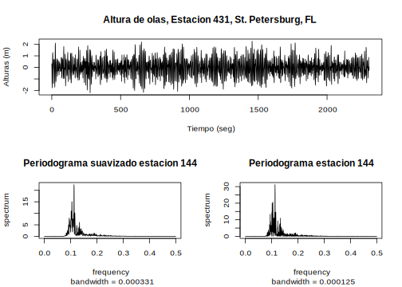
<p class="caption">(\#fig:fig-periodograma-altura-olas)Periodograma para las alturas de olas, Estación 144, St. Petersburg, FL.</p>
</div>

---

\BeginKnitrBlock{example}\iffalse{-91-80-101-114-105-111-100-111-103-114-97-109-97-115-32-112-97-114-97-32-108-97-115-32-115-101-114-105-101-115-32-100-101-32-84-101-114-114-101-109-111-116-111-115-32-121-32-69-120-112-108-111-115-105-111-110-101-115-93-}\fi{}<div class="example"><span class="example" id="exm:ejem-periodograma-terremoto-explosiones"><strong>(\#exm:ejem-periodograma-terremoto-explosiones)  \iffalse (Periodogramas para las series de Terremotos y Explosiones) \fi{} </strong></span>La Figura \@ref(fig:fig-periodograma-terremoto-explosiones) muestra el espectro calculado por separado de las dos fases del terremoto y explosión en la Figura 2.7 del capítulo 2.</div>\EndKnitrBlock{example}


```r
x=matrix(scan("data/eq5exp6.txt"),ncol=2)
eqP=x[1:1024,1]; eqS=x[1025:2048,1]
exP=x[1:1024,2]; exS=x[1025:2048,2]
par(mfrow=c(2,2))
eqPs=spectrum(eqP, main="Espectro del sismo (fase P)", log="no", xlim=c(0,0.25), ylim=c(0,0.04))
eqSs=spectrum(eqS, main="Espectro del sismo (fase S)", log="no", xlim=c(0,0.25), ylim=c(0,0.4))
exPs=spectrum(exP, main="Espectro de explosiones (fase P)", log="no", xlim=c(0,0.25), ylim=c(0,0.04))
exSs=spectrum(exS, main="Espectro de explosiones (fase S)", log="no", xlim=c(0,0.25), ylim=c(0,0.4))
```

<div class="figure">

<p class="caption">(\#fig:fig-periodograma-terremoto-explosiones)Periodogramas para las series de Terremotos y Explosiones</p>
</div>

---

## Procesos de Incremento Ortogonal sobre $[-\pi,\pi]$

Con el fin de dar un significado preciso a la representación espectral \@ref(eq:eq-funcion-distribucion-espectral) mencionada anteriormente, es necesario introducir el concepto de integración estocástica de una función no-aleatoria con respecto a un proceso de incremento ortogonal $\{Z(\lambda)\}$ .

\BeginKnitrBlock{definition}<div class="definition"><span class="definition" id="def:defi-proceso-estacionario-complejo"><strong>(\#def:defi-proceso-estacionario-complejo) </strong></span>Un proceso $\{x_t\}$ es un *proceso estacionario a valores complejos* si $\mathbb{E}|x_t^2|<\infty$, $\mathbb{E}(X_t)$ es independiente de $t$ y $\mathbb{E}(x_{t+h}\bar{x}_t)$ es independiente de $t$</div>\EndKnitrBlock{definition}

---

\BeginKnitrBlock{definition}<div class="definition"><span class="definition" id="def:defi-autocovarianza-proceso-complejo"><strong>(\#def:defi-autocovarianza-proceso-complejo) </strong></span>La función de autocovarianza $\gamma(\cdot)$ de un proceso estacionario a valores complejos $\{x_t\}$ es

\begin{equation}
\gamma(h) = \mathbb{E}(x_{t+h}\bar{x}_t) - \mathbb{E}(x_{t+h})\mathbb{E}(\bar{x}_t).
(\#eq:eq-autocovarianza-proceso-complejo)
\end{equation}</div>\EndKnitrBlock{definition}

---

\BeginKnitrBlock{theorem}<div class="theorem"><span class="theorem" id="thm:teo-autocovarianza-hermitiana"><strong>(\#thm:teo-autocovarianza-hermitiana) </strong></span>Una función $K(\cdot)$ definida sobre los enteros en la función de autocovarianza de una serie estacionaria (posiblemente a valores complejos) si y solo si $K(\cdot)$ es Hermitiana y no-negativa definida, esto es, si y solo si $K(n)=\overline{K(-n)}$ y

\begin{equation}
\sum_{i,j=1}^na_iK(i-j)\bar{a}_j\geq0,
(\#eq:eq-k-no-negativa-definida)
\end{equation}

para todo entero positivo $n$ y todo vector $\mathbf{a}=(a_1,\ldots,a_n)^t\in\mathbb{C}^n$.</div>\EndKnitrBlock{theorem}

---

El Teorema \@ref(thm:teo-autocovarianza-hermitiana) caracteriza la función de autocovarianza a valores complejos sobre los enteros como aquellas funciones que son Hermitianas y no-negativa definida. El Teorema de Herglotz, el cual presentaremos a continuación, caracteriza estas como las funciones que pueden ser escritas en la forma \@ref(eq:eq-funcion-distribucion-espectral) para alguna función de distribución acotada $F$ con masa concentrada en $(-\pi,\pi]$.

\BeginKnitrBlock{theorem}\iffalse{-91-84-101-111-114-101-109-97-32-100-101-32-72-101-114-103-108-111-116-122-93-}\fi{}<div class="theorem"><span class="theorem" id="thm:teo-Herglotz"><strong>(\#thm:teo-Herglotz)  \iffalse (Teorema de Herglotz) \fi{} </strong></span>Una función a valores complejos $\gamma(\cdot)$ definida sobre los enteros es no-negativa definida si y solo si

\begin{equation}
\gamma(h) = \int_{-\pi}^{\pi}e^{ihv}dF(v)\text{ para todo }h=0,\pm1,\pm2,\ldots,
(\#eq:eq-no-negativa-definida-Herglotz)
\end{equation}

donde $F(\cdot)$ es una función acotada en $[-\pi,\pi]$ continua a la derecha, no decreciente y $F(-\pi)=0$.</div>\EndKnitrBlock{theorem}

---

\BeginKnitrBlock{definition}<div class="definition"><span class="definition" id="def:defi-proceso-incremento-ortogonal"><strong>(\#def:defi-proceso-incremento-ortogonal) </strong></span>Un *proceso de incremento ortogonal sobre $[-\pi,\pi]$* es un proceso estocástico a valores complejos $\{Z(\lambda),-\pi\leq\lambda\leq\pi\}$ tal que

\begin{eqnarray}
\langle Z(\lambda),Z(\lambda)\rangle &<& \infty\text{, con }-\pi\leq\lambda\leq\pi (\#eq:eq-e4p6p1)  \\
\langle Z(\lambda),1\rangle &=& 0 \text{, con }-\pi\leq\lambda\leq\pi (\#eq:eq-e4p6p2)
\end{eqnarray}

y

\begin{equation}
\langle Z(\lambda_4)-Z(\lambda_3),Z(\lambda_2)-Z(\lambda_1)\rangle=0\text{, si }(\lambda_1,\lambda_2]\cap(\lambda_3,\lambda_4]=\emptyset
(\#eq:eq-e4p6p3)
\end{equation}

donde el producto interno se define como $\langle X,Y\rangle=\mathbb{E}(X\bar{Y})$.</div>\EndKnitrBlock{definition}

---

El proceso $\{Z(\lambda),-\pi\leq\lambda\leq\pi\}$ se llamará **continuo a la derecha** si para todo $\lambda\in[-\pi,\pi)$

$$\|Z(\lambda+\delta)-Z(\lambda)\|^2=\mathbb{E}|Z(\lambda+\delta)-Z(\lambda)|^2\to0\text{ cuando }\delta\downarrow0.$$

\BeginKnitrBlock{proposition}<div class="proposition"><span class="proposition" id="prp:prop-incremento-ortogonal-distrib-unica"><strong>(\#prp:prop-incremento-ortogonal-distrib-unica) </strong></span>Si $\{Z(\lambda),-\pi\leq\lambda\leq\pi\}$ es un proceso de incremento ortogonal, entonces existe una única función de distribución $F$ (es decir, una única función continua a derecha no decreciente) tal que

\begin{equation}
\begin{array}{lclc}
F(\lambda) &=&0, &   \lambda\leq-\pi  \\
F(\lambda) &=& F(\pi), &  \lambda\geq\pi  \\
F(\mu)-F(\lambda) &=& \|Z(\mu)-Z(\lambda)\|^2, &   -\pi\leq\lambda\leq\mu\leq\pi\\
\end{array}
(\#eq:eq-e4p6p4)
\end{equation}</div>\EndKnitrBlock{proposition}

\BeginKnitrBlock{proof}<div class="proof">\iffalse{} <span class="proof"><em>Demostración. </em></span>  \fi{}Para $F$ satisfaciendo las condiciones prescritas es claro, haciendo $\lambda=-\pi$ que

\begin{equation}
  F(\mu)=\|Z(\mu)-Z(-\pi)\|^2\text{, }-\pi\leq\mu\leq\pi
(\#eq:eq-e4p6p5)
\end{equation}

Para verificar que la función así definida es no decreciente, usamos la ortogonalidad de $Z(\mu)-Z(\lambda)$ y $Z(\lambda)-Z(-\pi), -\pi\leq\lambda\leq\mu\leq\pi$ para escribir

\begin{eqnarray*}
  F(\mu) &=& \|Z(\mu)-Z(\lambda)+Z(\lambda)-Z(-\pi)\|^2 \\
         &=& \|Z(\mu)-Z(\lambda)\|^2+\|Z(\lambda)-Z(-\pi)\|^2 \\
         &\geq& F(\lambda)
\end{eqnarray*}

El mismo procedimiento nos da para $-\pi\leq\mu\leq\mu+\delta\leq\pi$

$$F(\mu+\delta)-F(\mu)=\|Z(\mu+\delta)-Z(\mu)\|^2\to0\text{, cuando }\delta\downarrow0,$$

por la suposición de continuidad a derecha de $\{Z(\lambda)\}$</div>\EndKnitrBlock{proof}

---

\BeginKnitrBlock{remark}<div class="remark">\iffalse{} <span class="remark"><em>Nota. </em></span>  \fi{}La función de distribución $F$ de la Proposición \@ref(prp:prop-incremento-ortogonal-distrib-unica), definida en $[-\pi,\pi]$ por \@ref(eq:eq-e4p6p5) será referida como la función de distribución asociada con el proceso de incremento ortogonal $\{Z(\lambda),-\pi\leq\lambda\leq\pi\}$. Es común en la práctica en el análisis de series de tiempo usar la notación corta

$$\mathbb{E}(dZ(\lambda),d\bar{Z(\mu)})=\delta_{\lambda,\mu}dF(\lambda)$$

para las ecuaciones \@ref(eq:eq-e4p6p3) y \@ref(eq:eq-e4p6p4).</div>\EndKnitrBlock{remark}

---

\BeginKnitrBlock{definition}<div class="definition"><span class="definition" id="def:defi-movimiento-browniano"><strong>(\#def:defi-movimiento-browniano) </strong></span>Un **Movimiento Browniano Estándar** iniciando en nivel cero es un proceso $\{B(t),t\geq0\}$ que satisface las siguientes condiciones:

* $B(0)=0$,

* $B(t_2)-B(t_1),B(t_3)-B(t_2),\ldots,B(t_n)-B(t_{n-1})$ son independientes para cada $n\in\{3,4,\ldots\}$ y cada $t=(t_1,\ldots,t_n)^t$ tal que $0\leq t_1<t_2<\ldots<t_n$,

* $B(t)-B(s)\sim N(0,t-s)$ para $t\geq s$.</div>\EndKnitrBlock{definition}

---

\BeginKnitrBlock{example}<div class="example"><span class="example" id="exm:ejem-movimiento-browniano"><strong>(\#exm:ejem-movimiento-browniano) </strong></span>Un movimiento browniano $\{B(\lambda),-\pi\leq\lambda\leq\pi\}$ con $\mathbb{E}B(\lambda)=0$ y $\text{var}(B(\lambda))=\sigma^2(\lambda+\pi)/2\pi\text{, }-\pi\leq\lambda\leq\pi$, es un proceso de incremento ortogonal sobre $[-\pi,\pi]$. La función de distribución asociada satisface $F(\lambda)=0\text{, para }\lambda\leq-\pi, F(\lambda)=\sigma^2\text{, para }\lambda\geq\pi$ y

$$F(\lambda)=\sigma^2(\lambda+\pi)/2\pi\text{, para }-\pi\leq\lambda\leq\pi.$$</div>\EndKnitrBlock{example}

---

\BeginKnitrBlock{definition}<div class="definition"><span class="definition" id="def:defi-proceso-poisson"><strong>(\#def:defi-proceso-poisson) </strong></span>Un **Proceso de Poisson con media $\lambda>0$** es un proceso $\{N(t),t\geq0\}$ que satisface:
  
* $N(0)=0$,

* $N(t_2)-N(t_1),N(t_3)-N(t_2),\ldots,N(t_n)-N(t_{n-1})$ son independientes para cada $n\in\{3,4,\ldots\}$ y cada $t=(t_1,\ldots,t_n)$ tal que $0\leq t_1<t_2<\ldots<t_n$,

* $N(t)-N(s)$ tiene distribución de Poisson con media $\lambda(t-s)$ para $t\geq s$.</div>\EndKnitrBlock{definition}

---

\BeginKnitrBlock{example}<div class="example"><span class="example" id="exm:ejem-proceso-poison"><strong>(\#exm:ejem-proceso-poison) </strong></span>Si $\{N(\lambda),-\pi\leq\lambda\leq\pi\}$ es un proceso de Poisson sobre $[-\pi,\pi]$ con intensidad constante $c$ entonces el proceso $Z(\lambda)=N(\lambda)-\mathbb{E}N(\lambda)\text{, }-\pi\leq\lambda\leq\pi$, es un proceso de incremento ortogonal con función de distribución asociada 

$$F(\lambda)=\begin{cases}
   0&\text{, para }\lambda\leq-\pi\\
   2\pi c&\text{, para }\lambda\geq\pi\\
   c(\lambda+\pi)&\text{, para }-\pi\leq\lambda\leq\pi
\end{cases}
$$

Si escogemos $c$ como $\sigma^2/2\pi$ entonces $\{Z(\lambda)\}$ tiene exactamente la misma función de distribución asociada como la de $\{B(\lambda)\}$ del Ejemplo \@ref(exm:ejem-movimiento-browniano).</div>\EndKnitrBlock{example}

---

## Integración con Respecto a un Proceso de Incremento Ortogonal

En esta sección demostraremos como definir la integral estocástica

$$I(f)=\int_{(-\pi,\pi]}f(v)dZ(v)$$

donde $\{Z(\lambda)\text{, }-\pi\leq\lambda\leq\pi\}$ es un proceso de incremento ortogonal definido sobre el espacio de probabilidad $(\Omega,\mathcal{F},P)$ y $f$ es cada función en $[-\pi,\pi]$ cuadrado integrable con respecto a la función de distribución $F$ asociada con $Z(\lambda)$. Procederemos paso por paso, primero definiremos $I(f)$ para cada función $f$ de la forma

\begin{equation}
  f(\lambda)=\sum_{i=0}^{n}f_iI_{(\lambda_i,\lambda_{i+1}]}(\lambda)\text{,    }-\pi=\lambda_0<\lambda_1<\cdots<\lambda_{n+1}=\pi
(\#eq:eq-e4p7p1)
\end{equation}

como

\begin{equation}
    I(f)=\sum_{i=0}^{n}f_i[Z(\lambda_{i+1})-Z(\lambda_i)]
(\#eq:eq-e4p7p2)
\end{equation}

Entonces, extendemos la aplicación $I$ a un isomorfismo de $L^2([-\pi,\pi],\mathcal{B},F)\equiv L^2(F)$ a un subespacio de $L^2(\Omega,\mathcal{F},P)$.

Sea $\mathcal{D}$ la clase de todas las funciones que tiene la forma \@ref(eq:eq-e4p7p1) para algún $n\in\{0,1,2,\ldots\}$. Entonces la definición \@ref(eq:eq-e4p7p2) es consistente en $\mathcal{D}$ dado que para cada $f\in\mathcal{D}$ existe una *única* representación de $f$,

$$f(\lambda)=\sum_{i=0}^{n}r_iI_{(v_i,v_{i+1}]}(\lambda)\text{,    }-\pi=v_0<v_1<\cdots<v_{m+1}=\pi,$$

en la cual $r_i\neq r_{i+1}, 0\leq i<m$. Todas las otras representaciones de $f$ que tienen la forma \@ref(eq:eq-e4p7p1) son obtenidas por medio de reexpresar una o más funciones indicatrices $I_{(v_i,v_{i+1}]}$ como una suma de funciones indicatrices de intervalos adjuntos. Sin embargo, esto no hace ninguna diferencia en el valor de $I(f)$, y por consiguiente la definición \@ref(eq:eq-e4p7p2) es la misma para todas las representaciones \@ref(eq:eq-e4p7p1) de $f$. Es claro que \@ref(eq:eq-e4p7p2) define $I$ como una aplicación lineal sobre $\mathcal{D}$.


Más aún, la aplicación preserva el producto interno ya que si $f\in\mathcal{D}$ y $g\in\mathcal{D}$ entonces existen representaciones

$$f(\lambda)=\sum_{i=0}^{n}f_iI_{(\lambda_i,\lambda_{i+1}]}(\lambda)$$

$$g(\lambda)=\sum_{i=0}^{n}g_iI_{(\lambda_i,\lambda_{i+1}]}(\lambda)$$

en términos de una partición simple $-\pi=\lambda_0<\lambda_1<\cdots<\lambda_{n+1}=\pi$. Por lo tanto, el producto interno de $I(f)$ e $I(g)$ en $L^2(\Omega,\mathcal{F},P)$ es

\begin{eqnarray*}
  \langle I(f),I(g)\rangle &=& \left\langle\sum_{i=0}^{n}f_i[Z(\lambda_{i+1})-Z(\lambda_i)],\sum_{i=0}^{n}g_i[Z(\lambda_{i+1})-Z(\lambda_i)\right\rangle \\
         &=& \sum_{i=0}^{n}f_i\bar{g}_i(F(\lambda_{i+1})-F(\lambda_i))
\end{eqnarray*}

por la ortogonalidad de los incrementos de $\{Z(\lambda)\}$ y la Proposición \@ref(prp:prop-incremento-ortogonal-distrib-unica).

La última expresión la podemos escribir como

$$\int_{(-\pi,\pi]}f(v)\bar{g}(v)dF(v)=\langle f,g\rangle_{L^2(F)}$$

el producto interno en $L^2(F)$ de $f$ y $g$. Por lo tanto la aplicación I sobre $\mathcal{D}$ preserva los productos internos.

Ahora, denotemos $\bar{\mathcal{D}}$ la clausura en $L^2(F)$ del conjunto $\mathcal{D}$. Si $f\in\bar{\mathcal{D}}$ entonces existe una sucesión $\{f_n\}$ de elementos de $\mathcal{D}$ tal que $\|f_n-f\|_{L^2(f)}\to0$. Por lo tanto definimos $I(f)$ como el límite en media cuadrado

\begin{equation}
    I(f)=\underset{n\to\infty}{m.s.\lim}I(f_n)
(\#eq:eq-e4p7p3)
\end{equation}

Primero comprobemos (a) que el límite existe y (b) que el límite es el mismo para todas las sucesiones $\{f_n\}$ tal que $\|f_n-f\|_{L^2(F)}\to0$.


Para comprobar (a) simplemente observe que para $f_m,f_n\in\mathcal{D}$,

\begin{eqnarray*}
\|I(f_n)-I(f_m)\| &=& \|I(f_n-f_m)\| \\
                  &=& \|f_n-f_m\|_{L^2(F)},
\end{eqnarray*}

de modo que si $\|f_n-f_m\|_{L^2(F)}\to0$, la sucesión $\{I(f_n)\}$ es una sucesión de Cauchy y por lo tanto converge en $L^2(\Omega,\mathcal{F},P)$.


Para comprobar (b), supóngase que $\|f_n-f\|_{L^2(F)}\to0$ y $\|g_n-f\|_{L^2(F)}\to0$ donde $f_n,g_n\in\mathcal{D}$. Entonces la sucesión $f_1,g_1,f_2,g_2,\ldots$, debe converger en norma y por lo tanto la sucesión $I(f_1), I(g_1)$, $I(f_2), I(g_2), \ldots$, debe converger en $L^2(\Omega,\mathcal{D},P)$. Sin embargo, esto no es posible a menos que las subsucesiones $I(f_n)$ e $I(g_n)$ tengan el mismo límite en media cuadrado. Esto completa la prueba de que la definición \@ref(eq:eq-e4p7p3) es válida y consistente para $f\in\bar{\mathcal{D}}$.


La aplicación $I$ sobre $\bar{\mathcal{D}}$ es lineal y preserva el producto interno ya que si $f^{(i)}\in\bar{\mathcal{D}}$ y \\ $\|f_n^{(i)}-f^{(i)}\|_{L^2(F)}\to0, f_n^{(i)}\in\mathcal{D},i=1,2$, entonces por linealidad de $I$ en $\mathcal{D}$

\begin{eqnarray*}
I(a_1f^{(1)}+a_2f^{(2)}) &=& \lim_{n\to\infty}I(a_1f_n^{(1)}+a_2f_n^{(2)}) \\
     &=& \lim_{n\to\infty}(a_1I(f_n^{(1)})+a_2I(f_n^{(2)})) \\
     &=& a_1I(f^{(1)})+a_2I(f^{(2)})
\end{eqnarray*}

y por continuidad del producto interno

\begin{eqnarray*}
  \langle I(f^{(1)},I(f^{(2)}\rangle &=& \lim_{n\to\infty}\langle I(f_n^{(1)}),I(f_n^{(2)})\rangle \\
         &=& \lim_{n\to\infty}\langle f_n^{(1)},f_n^{(2)}\rangle_{L^2(F)} \\
         &=& \langle f^{(1)},f^{(2)}\rangle_{L^2(F)}\rangle.
\end{eqnarray*}

Falta solo demostrar que $\bar{\mathcal{D}}=L^2(F)$. Para hacer esto primero observe que las funciones continuas en $[-\pi,\pi]$ son densas en $L^2(F)$ ya que $F$ es una función de distribución acotada. Más aún $\mathcal{D}$ es un subconjunto denso (en el sentido $L^2(F)$) del conjunto de funciones continuas sobre $[-\pi,\pi]$. Por consiguiente $\bar{\mathcal{D}}=L^2(F)$.

Las ecuaciones \@ref(eq:eq-e4p7p2) y \@ref(eq:eq-e4p7p3) entonces definen $I$ como una aplicación lineal que preserva el producto interno sobre $\bar{\mathcal{D}}=L^2(F)$ en $L^2(\Omega,\mathcal{F},P)$. La imagen $I(\bar{\mathcal{D}})$ de $\bar{\mathcal{D}}$ es claramente un subespacio lineal cerrado de $L^2(\Omega,\mathcal{F},P)$ y la aplicación $I$ es un isomorfismo de $\bar{\mathcal{D}}$ en $I(\bar{\mathcal{D}})$. La aplicación $I$ que nos proporciona la definición necesita de la integral estocástica.

\BeginKnitrBlock{definition}<div class="definition"><span class="definition" id="def:defi-integral-estocastica"><strong>(\#def:defi-integral-estocastica) </strong></span>Si $\{Z(\lambda)\}$ es un proceso de incremento ortogonal sobre $[-\pi,\pi]$ con función de distribución asociada $F$ y si $f\in L^2(F)$, entonces \textbf{la integral estocástica} $\int_{(-\pi,\pi]}f(\lambda)dZ(\lambda)$ se define como la variable aleatoria $I(f)$ construida arriba, esto es,

\begin{equation}
\int_{(-\pi,\pi]}f(v)dZ(v):=I(f).
(\#eq:eq-integral-estocastica)
\end{equation}</div>\EndKnitrBlock{definition}

---

### Propiedades de la Integral Estocástica

Para cada par de funciones $f$ y $g$ en $L^2(F)$ hemos establecidos las propiedades

\begin{eqnarray}
  I(a_1f+a_2g) &=& a_1I(f)+a_2I(g)\text{, }a_1,a_2\in\mathbb{C} (\#eq:eq-e4p7p4)\\
  \mathbb{E}(I(f)\bar{I(g)}) &=& \int_{(-\pi,\pi]}f(v)\bar{g(v)}dF(v) (\#eq:eq-e4p7p5)
\end{eqnarray}

Más aún, si $\{f_n\}$ y $\{g_n\}$ son sucesiones en $L^2(F)$ tal que $\|f_n-f\|_{L^2(F)}\to0$ y $\|g_n-g\|_{L^2(F)}\to0$, entonces por continuidad del producto interno

\begin{equation}
  \mathbb{E}(I(f_n)\bar{I(g_n)})\to\mathbb{E}(I(f)\bar{I(g)})=\int_{(-\pi,\pi]}f(v)\bar{g(v)}dF(v)
(\#eq:eq-e4p7p6)
\end{equation}

De \@ref(eq:eq-e4p7p2) es claro que

\begin{equation}
    \mathbb{E}(I(f))=0
(\#eq:eq-e4p7p7)
\end{equation}

para todo $f\in\mathcal{D}$; si $f\in\bar{\mathcal{D}}$ entonces existe una sucesión $\{f_n\}, f_n\in\mathcal{D}$ tal que $f_n\overset{L^2(F)}{\longrightarrow}f$ y $I(f_n)\overset{m.s.}{\longrightarrow}I(f)$, de modo que $\mathbb{E}(I(f))=\lim_{n\to\infty}\mathbb{E}(I(f_n))$ y \@ref(eq:eq-e4p7p7) sigue siendo válido. Este argumento es frecuentemente usado para establecer las propiedades de integral estocástica.


Finalmente notamos de \@ref(eq:eq-e4p7p5) y \@ref(eq:eq-e4p7p7) que si $\{Z(\lambda)\}$ es cada proceso de incremento ortogonal sobre $[-\pi,\pi]$ con función de distribución asociada $F$, entonces

\begin{equation}
  X_t=I(e^{it})=\int_{(-\pi,\pi]}e^{itv}dZ(v)\text{,  }t\in\mathbb{Z},
(\#eq:eq-e4p7p8)
\end{equation}

es un proceso estacionario con media cero y función de autocovarianza

\begin{equation}
  \mathbb{E}(X_{t+h}\bar{X}_t)=\int_{(-\pi,\pi]}e^{ivh}dF(v).
(\#eq:eq-e4p7p9)
\end{equation}


## La Representación Espectral


Sea $\{X_t\}$ un proceso estacionario de media cero con función de distribución espectral $F$. Para establecer la representación espectral

\begin{equation}
X_t=\int_{(-\pi,\pi]}e^{itv}dZ(v)
(\#eq:eq-e4p2p5)
\end{equation}

del proceso $\{X_t\}$ necesitamos primero identificar un proceso de incremento ortogonal apropiado $\{Z(\lambda),\lambda\in[-\pi,\pi]\}$. La identificación de $\{Z(\lambda)\}$ y la demostración de la representación se logrará mediante la definición de un isomorfismo entre ciertos subespacios $\overline{\mathcal{H}}=\overline{sp}\{X_t,t\in\mathbb{Z}\}$ de $L^2(\Omega,\mathfrak{F},P)$ y $\overline{\mathcal{K}}=\overline{sp}\{e^{it},t\in\mathbb{Z}\}$ [^nota21] de $L^2(F)$. Este isomorfismo proporcionará un vínculo entre las variables aleatorias en el *dominio del tiempo* y las funciones sobre $[-\pi, \pi]$ en el *dominio de la frecuencia*.

[^nota21]:El espacio cerrado $\overline{sp}\{x_t,t\in T\}$ de cada subconjunto $\{x_t,t\in T\}$ de un espacio de Hilbert $\mathcal{H}$ se define como el subespacio cerrado más pequeño de $\mathcal{H}$ el cual contiene todos los elementos $x_t, t\in T$.

Sean $\mathcal{H}=\{X_t,t\in\mathbb{Z}\}$ y $\mathcal{K}=sp\{e^{it},t\in\mathbb{Z}\}$ subespacios (no necesariamente cerrados) de $\mathcal{H}\subset L^2(\Omega,\mathfrak{F},P)$ y $\mathcal{K}\subset L^2(F)$ consistentes de combinaciones lineales finitas de $X_t,t\in\mathbb{Z}$ y $e^{it},t\in\mathbb{Z}$, respectivamente. Demostraremos primero que la aplicación

\begin{equation}
  T\left(\sum_{j=1}^{n}a_jX_{t_j}\right)=\sum_{j=1}^{n}a_je^{it_j}
(\#eq:eq-e4p8p1)
\end{equation}

define un isomorfismo entre $\mathcal{H}$ y $\mathcal{K}$.

Para verificar que $T$ está bien definida, supóngase que $\|\sum_{j=1}^{n}a_jX_{t_j}-\sum_{k=1}^{m}b_kX_{t_k}\|=0$. Entonces por definición de la norma $L^2(F)$ y el teorema de Herglotz (Teorema \@ref(thm:teo-Herglotz))

\begin{eqnarray*}
  \left\|T\left(\sum_{j=1}^{n}a_jX_{t_j}\right)-T\left(\sum_{k=1}^{m}b_kX_{t_k}\right)\right\|^2_{L^2(F)}&=&\int_{(-\pi,\pi]}\left|\sum_{j=1}^{n}a_je^{it_jv}-\sum_{k=1}^{m}b_ke^{it_kv}\right|^2dF(v)\\
            &=&\mathbb{E}\left|\sum_{j=1}^{n}a_jX_{t_j}-\sum_{k=1}^{m}b_kX_{t_k}\right|^2=0,
\end{eqnarray*}

muestra que \@ref(eq:eq-e4p8p1) define $T$ consistentemente en $\mathcal{H}$. La linealidad de $T$ se sigue de este hecho.

Adicionalmente

\begin{eqnarray*}
  \left\langle T\left(\sum_{j=1}^{n}a_jX_{t_j}\right),T\left(\sum_{k=1}^{m}b_kX_{s_k}\right)\right\rangle &=& \sum_{j=1}^{n}\sum_{k=1}^{m}a_j\bar{b}_k\langle e^{it_j},e^{is_k}\rangle_{L^2(F)} \\
   &=& \sum_{j=1}^{n}\sum_{k=1}^{m}a_j\bar{b}_k\int_{(-\pi,\pi]}e^{i(t_j-s_k)v}dF(v) \\
   &=& \sum_{j=1}^{n}\sum_{k=1}^{m}a_j\bar{b}_k\langle X_{t_j},X_{s_k}\rangle \\
   &=& \left\langle\sum_{j=1}^{n}a_jX_{t_j},\sum_{k=1}^{m}b_kX_{s_k}\right\rangle
\end{eqnarray*}

mostrando que $T$ de hecho define un isomorfismo entre $\mathcal{H}$ y $\mathcal{K}$.

Demostraremos ahora que la aplicación $T$ se puede extender de manera única a un isomorfismo de $\overline{\mathcal{H}}$ en $\overline{\mathcal{K}}$. Si $Y\in\overline{\mathcal{H}}$ entones existe una sucesión $Y_n\in\mathcal{H}$ tal que $\|Y_n-Y\|\to0$. Esto implica que $\{Y_n\}$ es una sucesión de Cauchy y por consiguiente, dado que $T$ preserva la norma, la sucesión $\{TY_n\}$ es Cauchy en $L^2(F)$. La sucesión $\{TY_n\}$ por lo tanto converge en norma a un elemento de $\overline{\mathcal{K}}$. Si $T$ preserva la norma sobre $\overline{\mathcal{H}}$ definimos

$$TY=m.s.\lim_{n\to\infty}TY_n.$$

Esta es una definición consistente de $T$ en $\overline{\mathcal{H}}$ ya que si $\|\tilde{Y}_n-Y\|\to0$ entonces la sucesión $TY_1,T\tilde{Y}_1$, $TY_2,T\tilde{Y}_2,\ldots$ es convergente, lo que implica que las subsucesiones $\{TY_n\}$ y $\{T\tilde{Y}_n\}$ tienen el mismo límite, llamémoslo $TY$. Más aún, usando el mismo argumento dado en la sección [Integración con Respecto a un Proceso de Incremento Ortogonal] es fácil demostrar que la aplicación $T$ extendida a $\overline{\mathcal{H}}$ es lineal y preserva el producto interno.

Finalmente, del teorema siguiente se tiene que $\mathcal{K}$ es uniformemente denso en el espacio de funciones continuas $\phi$ en $[-\pi,\pi]$ con $\phi(\pi)=\phi(-\pi)$, que a su vez es denso en $L^2(F)$. Por consiguiente $\overline{\mathcal{K}}=L^2(F)$.

\BeginKnitrBlock{theorem}<div class="theorem"><span class="theorem" id="thm:teo-t2p11p1"><strong>(\#thm:teo-t2p11p1) </strong></span>Sea $f$ una función continua en $[-\pi,\pi]$ tal que $f(\pi)=f(-\pi)$. Entonces

\begin{equation}
  n^{-1}(S_0f+S_1f+\cdots+S_{n-1}f)\to f
(\#eq:eq-e2p11p1)
\end{equation}

uniformemente en $[-\pi,\pi]$ cuando $n\to\infty$.\footnote{$S_i$ es la $i$-ésima aproximación de Fourier de $f$.}</div>\EndKnitrBlock{theorem}

---

De los hechos anteriores, se tiene el siguiente teorema

\BeginKnitrBlock{theorem}<div class="theorem"><span class="theorem" id="thm:teo-t4p8p1"><strong>(\#thm:teo-t4p8p1) </strong></span>Si $F$ es la función de distribución espectral del proceso estacionario $\{X_t,t\in\mathbb{Z}\}$, entonces existe un único isomorfismo $T$ de $\overline{sp}\{X_t,t\in\mathbb{Z}\}$ en $L^2(F)$ tal que

$$TX_t=e^{it}\text{,   }t\in\mathbb{Z}.$$</div>\EndKnitrBlock{theorem}

---

El Teorema \@ref(thm:teo-t4p8p1) es particularmente útil en la teoría de predicción lineal. También es la clave para la identificación de los procesos de incremento ortogonal $\{Z(\lambda),-\pi\leq\lambda\leq\pi\}$ que aparecen en la representación espectral \@ref(eq:eq-e4p2p5). Introducimos el proceso $\{Z(\lambda)\}$ en la siguiente proposición.

\BeginKnitrBlock{proposition}<div class="proposition"><span class="proposition" id="prp:propo-p4p8p1"><strong>(\#prp:propo-p4p8p1) </strong></span>Si $T$ es definimos como en el Teorema \@ref(thm:teo-t4p8p1) entonces el proceso $\{Z(\lambda),-\pi\leq\lambda\leq\pi\}$ definido por

$$Z(\lambda)=T^{-1}(I_{(-\pi,\lambda]}(\cdot))\text{, }-\pi\leq\lambda\leq\pi,$$

es un proceso de incremento ortogonal. Más aún, la función de distribución asociada con $\{Z(\lambda)\}$ es exactamente la función de distribución espectral $F$ de $\{X_t\}$.</div>\EndKnitrBlock{proposition}

\BeginKnitrBlock{proof}<div class="proof">\iffalse{} <span class="proof"><em>Demostración. </em></span>  \fi{}Para cada $\lambda\in[-\pi,\pi]$, $Z(\lambda)$ es un elemento bien definido de $\overline{sp}\{X_t,t\in\mathbb{Z}\}$ por el Teorema \@ref(thm:teo-t4p8p1). Por lo tanto $\langle Z(\lambda),Z(\lambda)\rangle<\infty$. Dado que $Z(\lambda)\in\overline{sp}\{X_t,t\in\mathbb{Z}\}$ existe una sucesión $\{Y_n\}$ de elementos de $\overline{sp}\{X_t,t\in\mathbb{Z}\}$ tal que $\|Y_n-Z(\lambda)\|\to0$ cuando $n\to\infty$. Por la continuidad del producto interior tenemos

$$\langle Z(\lambda),1\rangle=\lim_{n\to\infty}\langle Y_n,1\rangle=0$$

ya que cada $X_t$, y por consiguiente cada $Y_t$ tiene media cero. Finalmente, si $-\pi\leq\lambda_1\leq\lambda_2\leq\lambda_3\leq\lambda_4\leq\pi$,

\begin{eqnarray*}
  \langle Z(\lambda_4)-Z(\lambda_3),Z(\lambda_2)-Z(\lambda_1)\rangle &=& \langle TZ(\lambda_4)-TZ(\lambda_3),TZ(\lambda_2)-TZ(\lambda_1)\rangle \\
     &=& \langle I_{(\lambda_3,\lambda_4]}(\cdot),I_{(\lambda_1,\lambda_2]}(\cdot)\rangle_{L^2(F)} \\
     &=& \int_{(-\pi,\pi]}I_{(\lambda_3,\lambda_4]}(v)I_{(\lambda_1,\lambda_2]}(v)dF(v)=0
\end{eqnarray*}

completando la demostración de que $\{Z(\lambda)\}$ tiene incrementos ortogonales. Un cálculo casi idéntico a los cálculos previos nos da

$$\langle Z(\mu)-Z(\lambda),Z(\mu)-Z(\mu)\rangle=F(\mu_-F(\lambda),$$

demostrando que $\{Z(\lambda)\}$ es continua a derecha con función de distribución asociada $F$ como afirma la proposición</div>\EndKnitrBlock{proof}

---

Ahora es fácil establecer la representación espectral \@ref(eq:eq-e4p2p5).

\BeginKnitrBlock{theorem}\iffalse{-91-69-108-32-84-101-111-114-101-109-97-32-100-101-32-82-101-112-114-101-115-101-110-116-97-99-105-243-110-32-69-115-112-101-99-116-114-97-108-93-}\fi{}<div class="theorem"><span class="theorem" id="thm:teo-representacion-espectral"><strong>(\#thm:teo-representacion-espectral)  \iffalse (El Teorema de Representación Espectral) \fi{} </strong></span>Si $\{X_t\}$ es una sucesión estacionaria con media cero y función de distribución espectral $F$, entonces existe un proceso de incremento ortogonal continua a la derecha $\{Z(\lambda),-\pi\leq\lambda\leq\pi\}$ tal que

$$\text{(i) }\mathbb{E}|Z(\lambda)-Z(-\pi)|^2=F(\lambda)\text{, }-\pi\leq\lambda\leq\pi,$$

y

$$\text{(ii) }X_t=\int_{(-\pi,\pi]}E^{itv}dZ(v)\text{ con probabilidad uno.}$$</div>\EndKnitrBlock{theorem}

\BeginKnitrBlock{proof}<div class="proof">\iffalse{} <span class="proof"><em>Demostración. </em></span>  \fi{}Sea $\{Z(\lambda)\}$ el proceso definido en la Proposición \@ref(prp:propo-p4p8p1) y sea $I$ el isomorfismo

$$I(f)=\int_{(-\pi,\pi]}f(v)dZ(v),$$

de $\overline{\mathcal{D}}=L^2(F)$ en $I(\overline{\mathcal{D}}\subseteq L^2(\Omega,\mathfrak{F},P)$ discutido en la Sección [Integración con Respecto a un Proceso de Incremento Ortogonal]. Si $f\in\mathcal{D}$ tiene la representación \@ref(eq:eq-e4p7p1) entonces

\begin{eqnarray*}
  I(f) &=& \sum_{i=0}^{n}f_i(Z(\lambda_{i+1})-Z(\lambda_i)) \\
       &=& T^{-1}(f).
\end{eqnarray*}

Esta relación se mantiene válida para toda $f\in\overline{\mathcal{D}}=L^2(F)$ ya que tanto $I$ como $T^{-1}$ son isomorfismos.

Por lo tanto tenemos que $I=T^{-1}$ (i.e. $TI(f)=f$ para todo $f\in L^2(F)$) y por consiguiente del Teorema \@ref(thm:teo-t4p8p1)

$$X_t=I(e^{it\cdot})=\int_{(-\pi,\pi]}e^{itv}dZ(v),$$

dando la representación requerida para $\{X_t\}$. La primera afirmación del Teorema es una consecuencia inmediata de la Proposición \@ref(prp:propo-p4p8p1).</div>\EndKnitrBlock{proof}

---

\BeginKnitrBlock{corollary}<div class="corollary"><span class="corollary" id="cor:cor-c4p8p1"><strong>(\#cor:cor-c4p8p1) </strong></span>Si $\{X_t\}$ es una sucesión estacionaria de media cero entonces existe un proceso de incremento ortogonal continuo a la derecha $\{Z(\lambda),-\pi\leq\lambda\leq\pi\}$ tal que $Z(-\pi)=0$ y

$$X_t=\int_{(-\pi,\pi]}e^{itv}dZ(v)\text{ con probabilidad uno.}$$

Si $\{Y(\lambda)\}$ y $\{Z(\lambda)\}$ son dos de tales procesos entonces

$$P(Y(\lambda)=Z(\lambda))=1\text{ para cada}\lambda\in[-\pi,\pi].$$</div>\EndKnitrBlock{corollary}

\BeginKnitrBlock{proof}<div class="proof">\iffalse{} <span class="proof"><em>Demostración. </em></span>  \fi{}Si denotamos por $\{Z^{\star}(\lambda)\}$ el proceso de incremento ortogonal definido por la Proposición \@ref(prp:propo-p4p8p1), entonces el proceso

$$Z(\lambda)=Z^{\star}(\lambda)-Z^{\star}(-\pi)\text{, }-\pi\leq\lambda\leq\pi,$$

no solo satisface $Z(-\pi)=0$, sino también tiene exactamente el mismo incremento que $\{Z^{\star}(\lambda)\}$. Por consiguiente

$$X_t=\int_{(-\pi,\pi]}e^{itv}dZ^{\star}(v)=\int_{(-\pi,\pi]}e^{itv}dZ(v).$$

Supóngase ahora que $\{Y(\lambda)\}$ es otro proceso de incremento ortogonal tal que $Y(-\pi)=0$ y

\begin{equation}
  X_t=\int_{(-\pi,\pi]}e^{itv}dY(v)=\int_{(-\pi,\pi]}e^{itv}dZ(v)\text{ con probabilidad uno.}
(\#eq:eq-e4p8p2)
\end{equation}

Si definimos para $f\in L^2(F)$

$$I_Y(f)=\int_{(-\pi,\pi]}f(v)dY(v)$$

e

$$I_Z(f)=\int_{(-\pi,\pi]}f(v)dZ(v)$$

entonces tenemos de \@ref(eq:eq-e4p8p2)

\begin{equation}
  I_y(e^{it\cdot})=I_z(e^{it\cdot})\text{ para todo }t\in\mathbb{Z}.
(\#eq:eq-e4p8p3)
\end{equation}

Dado que $I_Y$ e $I_Z$ son iguales en $sp\{e^{it\cdot},t\in\mathbb{Z}\}$ el cual es denso en $L^2(F)$, se sigue que $I_Y(f)=I_Z(f)$ para todo $f\in L^2(F)$. Eligiendo $f(v)=I_{(-\pi,\lambda]}(v)$ obtenemos (con probabilidad uno)

$$Y(\lambda)=\int_{(-\pi,\pi]}f(v)dZ(v)=Z(\lambda)\text{,  }-\pi\leq\lambda\leq\pi$$</div>\EndKnitrBlock{proof}

- **Observación 1.** En el transcurso de la demostración del Teorema \@ref(thm:teo-representacion-espectral) se estableció el siguiente resultado: $Y\in\overline{sp}\{X_t,t\in\mathbb{Z}\}$ si y solo si existe una función $f\in L^2(F)$ tal que $Y=I(f)=\int_{(-\pi,\pi]}f(v)dZ(v)$. Esto significa que $I$ es un isomorfismo de $L^2(F)$ en $\overline{sp}\{X_t,t\in\mathbb{Z}\}$ (con la propiedad de que $I(e^{it\cdot})=X_t$).

- **Observación 2.** Los argumentos aportados por el Teorema \@ref(thm:teo-representacion-espectral) es una prueba de existencia que no revela de manera explícita cómo se construye $\{Z(\lambda)\}$.

- **Observación 3.** El corolario establece que el proceso de incremento ortogonal en la representación espectral es único si usamos la normalización de $Z(-\pi)=0$. Dos proceso estacionarios diferentes pueden tener la misma función de distribución espectral, por ejemplo los procesos $X_t=\int_{(-\pi,\pi]}e^{it\lambda}dB(\lambda)$ e $Y_t=\int_{(-\pi,\pi]}e^{it\lambda}dN(\lambda)$ con $\{B(\lambda)\}$ y $\{N(\lambda)\}$ definidos como en los Ejemplos \@ref(exm:ejem-movimiento-browniano) y \@ref(exm:ejem-proceso-poison). En tales casos los procesos deben de hecho tener la misma función de autocovarianza.


\BeginKnitrBlock{example}\iffalse{-91-82-101-112-114-101-115-101-110-116-97-99-105-243-110-32-101-115-112-101-99-116-114-97-108-32-100-101-32-117-110-32-109-111-118-105-109-105-101-110-116-111-32-98-114-111-119-110-105-97-110-111-93-}\fi{}<div class="example"><span class="example" id="exm:ejem-representacion-espectral-movimiento-browniano"><strong>(\#exm:ejem-representacion-espectral-movimiento-browniano)  \iffalse (Representación espectral de un movimiento browniano) \fi{} </strong></span>Sea $Z(\lambda)=B(\lambda)$ un movimiento browniano en $[-\pi,\pi]$ como el definido en el Ejemplo \ref{ejem-movimiento-browniano} con $\mathbb{E}Z(\lambda)=0$ y $Var(Z(\lambda))=\sigma^2(\lambda+\pi)/2\pi,-\pi\leq\lambda\leq\pi$. Para $t\in\mathbb{Z}$, hagamos $g_t(v)=\sqrt{2}\cos(tv)I_{(-\pi,0]}(v)+\sqrt{2}\sin(tv)I_{(0,\pi]}(v)$ y

\begin{equation}
  X_t=\int_{(-\pi,\pi]}g_t(v)dB(v)=\sqrt{2}\left(\int_{(-\pi,0]}\cos(tv)dB(v)+\int_{(0,\pi]}\sin(tv)dB(v)\right).
(\#eq:eq-e4p8p4)
\end{equation}

Entonces $\mathbb{E}X_t=0$ por \@ref(eq:eq-e4p7p7) y por \@ref(eq:eq-e4p7p5),

\begin{equation}
  \mathbb{E}(X_{t+h}X_t)=\frac{\sigma^2}{2\pi}\int_{(-\pi,\pi]}g_{t+h}(v)g_t(v)dv=\frac{\sigma^2}{2\pi}2\int_0^{\pi}\cos(hv)dv.
(\#eq:eq-e4p8p5)
\end{equation}

Por lo tanto $\mathbb{E}(X_{t+h}X_t)=\sigma^2\delta_{h,0}$ y en consecuencia $\{X_t\}\sim WN(0,\sigma^2)$.</div>\EndKnitrBlock{example}

---

Sin embargo, dado que $B(\lambda)$ es gaussiano podemos ir más allá y demostrar que las variables aleatorias $X_t,t=0,\pm1,\ldots$, son independientes con $X_t\sim N(0,\sigma^2)$. Para demostrar esto, sea $s_1,\ldots,s_k$, $k$ enteros distintos y para cada $j$ fijo sea $\{f_j^{(n)}\}$ una sucesión de elementos de $\mathcal{D}$, esto es, funciones de la forma (\ref{e4p7p1}), tal que $f_j^{(n)}\to g_{sj}(\cdot)$ en $L^2(F)$. Dado que la aplicación $I_n$ es un isomorfismo de $\overline{\mathcal{D}}=L^2(F)$ en $I_B(\overline{\mathcal{D}})$, concluimos de \@ref(eq:eq-e4p8p4) que

\begin{equation}
  \theta_1I_B(f_1^{(n)})+\cdots+\theta_kI_B(f_k^{(n)})\overset{m.s}{\to}\theta_1X_{s_1}+\cdots+\theta_kX_{s_k}.
(\#eq:eq-e4p8p6)
\end{equation}

El lado izquierdo $I_B(\sum_{j=1}^{k}\theta_jf_j^{(n)})$ es claramente normalmente distribuido con media cero y varianza $\|\sum_{j=1}^{k}\theta_jf_j^{(n)}\|^2$.

La función característica de $I_B(\sum_{j=1}^{k}\theta_jf_j^{(n)})$ es por lo tanto

$$\phi_n(u)=\exp\left[-\frac{1}{2}u^2\left\|\sum_{j=1}^{k}\theta_jf_j^{(n)}\right\|_{L^2(F)}^2\right].$$

Por continuidad del producto interior en $L^2(F)$, cuando $n\to\infty$

$$\left\|\sum_{j=1}^{k}\theta_jf_j^{(n)}\right\|_{L^2(F)}^2\to\left\|\sum_{j=1}^{n}\theta_je^{s_j\cdot}\right\|_{L^2(F)}^2=\sigma^2\sum_{j=1}^{k}\theta_j^2.$$

De \@ref(eq:eq-e4p8p6) concluimos por lo tanto que $\sum_{j=1}^{k}\theta_jX_{s_j}$ tiene función característica gaussiana

$$\phi(u)=\lim_{n\to\infty}\phi_n(u)=\exp\left[-\frac{1}{2}u^2\sigma^2\sum_{j=1}^{k}\theta_j^2\right].$$

Ya que esto es cierto para toda elección de $\theta_1,\ldots,\theta_k$ deducimos que $X_{s_1},\ldots,X_{s_k}$ son conjuntamente normal. De la covarianza \@ref(eq:eq-e4p8p5) se sigue entonces que las variables aleatorias $X_t,t=0,\pm1,\ldots$, son iid$N(0,\sigma^2)$.

- **Observación 4.** Si $A$ es un subconjunto de Borel de $[-\pi,\pi]$, es conveniente en la siguiente proposición (y en otros lugares) definir
\begin{equation}
  \int_A f(v)dZ(v)=\int_{(-\pi,\pi]}f(v)I_A(v)dZ(v),
(\#eq:eq-e4p8p7)  
\end{equation}
donde el lado derecho ya ha sido definido en la Sección [Integración con Respecto a un Proceso de Incremento Ortogonal].


\BeginKnitrBlock{proposition}<div class="proposition"><span class="proposition" id="prp:propo-p4p8p2"><strong>(\#prp:propo-p4p8p2) </strong></span>Supóngase que la función de distribución espectral $F$ de un proceso estacionario $\{X_t\}$ tiene un punto de discontinuidad en $\lambda_0$ donde $-\pi<\lambda_0<\pi$. Entonces con probabilidad uno,

$$X_t=\int_{(-\pi,\pi]\backslash\{\lambda_0\}}e^{itv}dZ(v)+(Z(\lambda_0)-Z(\lambda_0^-))e^{it\lambda_0}$$

donde los dos términos del lado derecho son no-correlacionados y

$$Var(Z(\lambda_0)-Z(\lambda_0^-))=F(\lambda_0)-F(\lambda_0^-).$$</div>\EndKnitrBlock{proposition}

\BeginKnitrBlock{proof}<div class="proof">\iffalse{} <span class="proof"><em>Demostración. </em></span>  \fi{}El límite izquierdo $Z(\lambda_0^-)$ se define como

\begin{equation}
  Z(\lambda_0^-)=m.s.\lim_{n\to\infty}Z(\lambda_n)
(\#eq:eq-e4p8p8)
\end{equation}

donde $\lambda_n$ es una sucesión tal que $\lambda_n\uparrow\lambda_0$.\\
Para verificar que \@ref(eq:eq-e4p8p8) tiene sentido, note que $\{Z(\lambda_n)\}$ es una sucesión de Cauchy ya que $\|Z(\lambda_n)-Z(\lambda_m)\|^2=|F(\lambda_n)-F(\lambda_m)|\to0$ cuando $m,n\to\infty$. Por lo tanto el límite en \@ref(eq:eq-e4p8p8) existe. Más aún, si $\nu_n\uparrow\lambda_0$ cuando $n\to\infty$ entonces $\|Z(\lambda_n)-Z(\nu_n)\|^2=|F(\lambda_n)-F(\nu_n)|\to0$ cuando $n\to\infty$, y en consecuencia el límite (\ref{e4p8p8}) es el mismo para toda sucesión no decreciente con límite $\lambda_0$.\\
Para $\delta>0$ definamos $\lambda_{\pm\delta}=\lambda_0\pm\delta$. Ahora por representación espectral, si $0<\delta<\pi-|\lambda_0|$,

\begin{equation}
  X_t=\int_{(-\pi,\pi]\backslash(\lambda_{-\delta},\lambda_{\delta}]}e^{itv}dZ(v)+\int_{(\lambda_{-\delta},\lambda_{\delta}]}e^{itv}dZ(v).
(\#eq:eq-e4p8p9)
\end{equation}

Note que los dos términos son no-correlacionados ya que las regiones de integración son disjuntas. Ahora cuando $\delta\to0$ el primer término converge en media cuadrado a $\int_{(-\pi,\pi]\backslash\{\lambda_0\}}e^{itv}dZ(v)$ dado que

$$e^{it\cdot}I_{90-\pi,\pi]\backslash(\lambda_{-\delta},\lambda_{\delta}]}\to e^{it\cdot}I_{(-\pi,\pi]\backslash\{\lambda_0\}}\text{ en }L^2(F).$$

Para ver cómo el último término de \@ref(eq:eq-e4p8p9) se comporta como $\delta\to0$ usamos la desigualdad

\begin{eqnarray}
  \left\|\int_{(\lambda_{-\delta},\lambda_{\delta}]}e^{itv}dZ(v)-e^{it\lambda_0}(Z(\lambda_0)-Z(\lambda_0^-))\right\|&\leq&\left\|\int_{(\lambda_{-\delta},\lambda_{\delta}]}e^{itv}dZ(v)-e^{it\lambda_0}(Z(\lambda_{\delta})-Z(\lambda_{-\delta}))\right\| \nonumber\\
  &+&\left\|Z(\lambda_{\delta})-Z(\lambda_{-\delta})-(Z(\lambda_0)-Z(\lambda_0^-))\right\| (\#eq:eq-e4p8p10)
\end{eqnarray}

Cuando $\delta\to0$ el segundo término de la derecha de \@ref(eq:eq-e4p8p10) tiende a cero por la continuidad a la derecha de $\{Z(\lambda)\}$ y la definición de $Z(\lambda_0^-)$.
El primer término del lado derecho de \@ref(eq:eq-e4p8p10) se puede escribir como

\begin{eqnarray*}
\left\|\int_{(-\pi,\pi]}(e^{itv}-e^{it\lambda_0})I_{(\lambda_{-\delta},\lambda_{\delta}]}(v)dZ(v)\right\|&=&\left\|(e^{it\cdot}-e^{it\lambda_0})I_{(\lambda_{-\delta},\lambda_{\delta}]}(\cdot)\right\|_{L^2(F)}\\
&\leq&\left[\sup_{\lambda_{-\delta}\leq\lambda\leq\lambda_{\delta}}|e^{it\lambda}-e^{it\lambda_0}|^2(F(\lambda_{\delta})-F(\lambda_{-\delta}))\right]^{1/2}
\end{eqnarray*}

este tiende 0 cuando $\delta\to0$, por la continuidad de la función $e^{it\cdot}$. Por lo tanto, deducimos de \@ref(eq:eq-e4p8p10) que

$$\int_{(\lambda_{-\delta},\lambda_{\delta}]}e^{itv}dZ(v)\overset{m.s.}{\to}e^{it\lambda_0}(Z(\lambda_0)-Z(\lambda_0^-))\text{ cuando }\delta\to0.$$

La continuidad del producto interior y la ortogonalidad de las dos integrales en \@ref(eq:eq-e4p8p9) garantiza que sus límites en media cuadrado son también ortogonales.

Más aún

$$Var(Z(\lambda_0)-Z(\lambda_0^-))=\lim_{\lambda_n\uparrow\lambda_0}Var(Z(\lambda_0)-Z(\lambda_n))=F(\lambda_0)-F(\lambda_0^-).$$</div>\EndKnitrBlock{proof}

---

Si la función de densidad espectral tiene $k$ puntos de discontinuidad en $\lambda_1,\ldots,\lambda_k$ entonces $\{X_t\}$ tiene la representación

\begin{equation}
  X_t=\int_{(-\pi,\pi]\backslash\{\lambda_1,\ldots,\lambda_k\}}e^{itv}dZ(v)+\sum_{j=1}^{k}(Z(\lambda_j)-Z(\lambda_j^-))e^{it\lambda_j},
(\#eq:eq-e4p8p11)
\end{equation}

donde los $(k+1)$ términos del lado derecho son no-correlacionados.

La importancia de \@ref(eq:eq-e4p8p11) en el análisis de series de tiempo es inmenso. El proceso $Y_t=(Z(\lambda_0)-Z(\lambda_0^-))e^{it\lambda_0}$ se dice ser determinístico ya que $Y_t$ está determinado para todo $t$ si $Y_{t_0}$ es conocido para algún $t_0$. La existencia de una discontinuidad en la función de densidad espectral en una frecuencia dada $\lambda_0$ por lo tanto indica la presencia en la serie de tiempo de una componente determinística sinusoidal con frecuencia $\lambda_0$.


<!--chapter:end:308-Analisis-espectral.Rmd-->

\cleardoublepage 

# (APPENDIX) Apéndice {-}


<!--chapter:end:400-apendice.Rmd-->

# Referencias {-}


<!--chapter:end:500-references.Rmd-->

