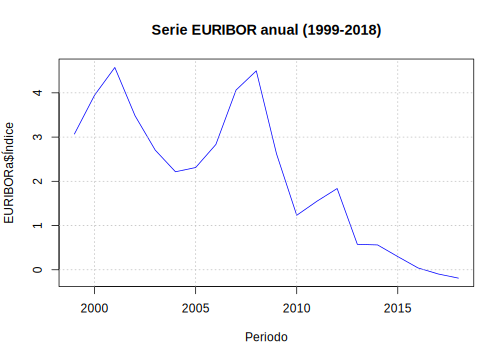
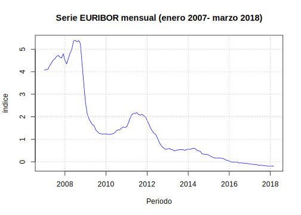
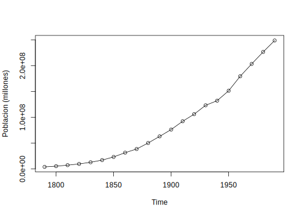
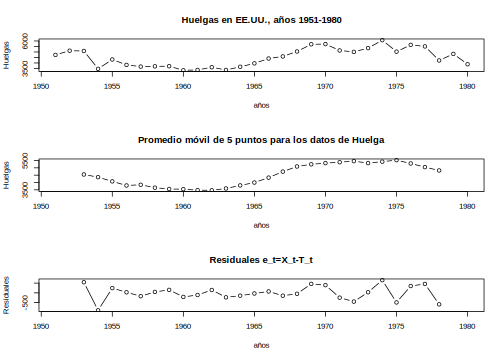
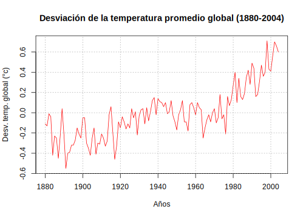
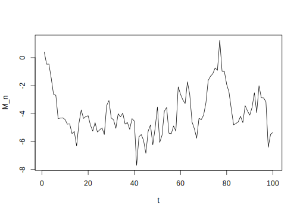
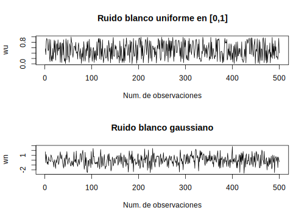
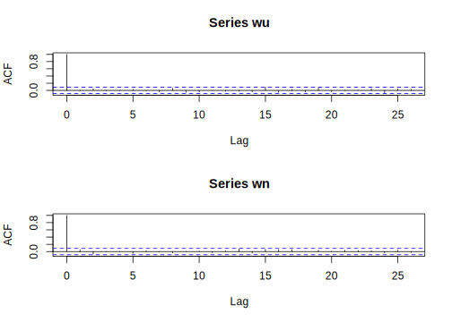
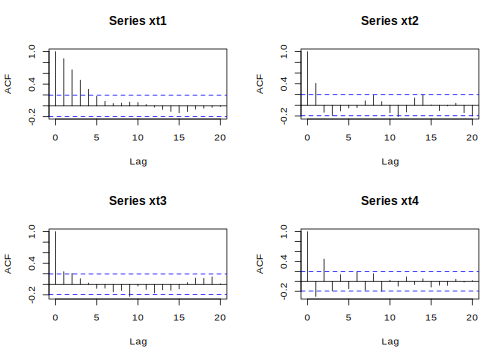
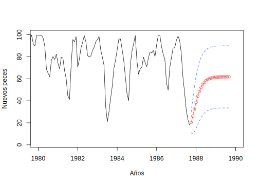

<script src="https://cdn.datacamp.com/datacamp-light-latest.min.js"></script>

--- 
title: "Series de Tiempo en R"
subtitle: "Ciencia de los Datos Financieros"
author: "Synergy Vision"
date: "2018-06-06"
knit: "bookdown::render_book"
documentclass: krantz
bibliography: [book.bib, packages.bib]
biblio-style: apalike
link-citations: yes
colorlinks: yes
lot: yes
lof: yes
fontsize: 12pt
monofontoptions: "Scale=0.8"
keep_md: yes
site: bookdown::bookdown_site
description: ""
url: 'http\://synergy.vision/Series-de-Tiempo-en-R/'
github-repo: synergyvision/Series-de-Tiempo-en-R/
cover-image: images/cover.png
---


# Prefacio {-}

<a href="https://synergy.vision/LibrosInteractivos/" target="_blank"></a>


  
La versión en línea de este libro se comparte bajo la licencia [Creative Commons Attribution-NonCommercial-ShareAlike 4.0 International License](http://creativecommons.org/licenses/by-nc-sa/4.0/).

## ¿Por qué  leer este libro? {-}


## Estructura del libro {-}


## Información sobre los programas y convenciones {-}

Este libro es posible gracias a una gran cantidad de desarrolladores que contribuyen en la construcción de herramientas para generar documentos enriquecidos e interactivos. En particular al autor de los paquetes Yihui Xie xie2015.

## Prácticas interactivas con R {-}

Vamos a utilizar el paquete [Datacamp Tutorial](https://github.com/datacamp/tutorial) que utiliza la librería en JavaScript [Datacamp Light](https://github.com/datacamp/datacamp-light) para crear ejercicios y prácticas con `R`. De esta forma el libro es completamente interactivo y con prácticas incluidas. De esta forma estamos creando una experiencia única de aprendizaje en línea.

<div data-datacamp-exercise data-height="300" data-encoded="true">eyJsYW5ndWFnZSI6InIiLCJwcmVfZXhlcmNpc2VfY29kZSI6ImIgPC0gNSIsInNhbXBsZSI6IiMgQ3JlYSB1bmEgdmFyaWFibGUgYSwgaWd1YWwgYSA1XG5cblxuIyBNdWVzdHJhIGVsIHZhbG9yIGRlIGEiLCJzb2x1dGlvbiI6IiMgQ3JlYSB1bmEgdmFyaWFibGUgYSwgaWd1YWwgYSA1XG5hIDwtIDVcblxuIyBNdWVzdHJhIGVsIHZhbG9yIGRlIGFcbmEiLCJzY3QiOiJ0ZXN0X29iamVjdChcImFcIilcbnRlc3Rfb3V0cHV0X2NvbnRhaW5zKFwiYVwiLCBpbmNvcnJlY3RfbXNnID0gXCJBc2VnJnVhY3V0ZTtyYXRlIGRlIG1vc3RyYXIgZWwgdmFsb3IgZGUgYGFgLlwiKVxuc3VjY2Vzc19tc2coXCJFeGNlbGVudGUhXCIpIn0=</div>


## Agradecimientos {-}


\BeginKnitrBlock{flushright}<p class="flushright">Synergy Vision, Caracas, Venezuela</p>\EndKnitrBlock{flushright}


<!--chapter:end:index.Rmd-->


# Acerca del Autor {-}

Este material es un esfuerzo de equipo en Synergy Vision, (<http://synergy.vision/nosotros/>).		 

El propósito de este material es ofrecer una experiencia de aprendizaje distinta y enfocada en el estudiante. El propósito es que realmente aprenda y practique con mucha intensidad. La idea es cambiar el modelo de clases magistrales y ofrecer una experiencia más centrada en el estudiante y menos centrado en el profesor. Para los temas más técnicos y avanzados es necesario trabajar de la mano con el estudiante y asistirlo en el proceso de aprendizaje con prácticas guiadas, material en línea e interactivo, videos, evaluación contínua de brechas y entendimiento, entre otros, para procurar el dominio de la materia.
  		  
Nuestro foco es la Ciencia de los Datos Financieros y para ello se desarrollará material sobre: **Probabilidad y Estadística Matemática en R**, **Programación Científica en R**, **Mercados**, **Inversiones y Trading**, **Datos y Modelos Financieros en R**, **Renta Fija**, **Inmunización de Carteras de Renta Fija**, **Teoría de Riesgo en R**, **Finanzas Cuantitativas**, **Ingeniería Financiera**, **Procesos Estocásticos en R**, **Series de Tiempo en R**, **Ciencia de los Datos**, **Ciencia de los Datos Financieros**, **Simulación en R**, **Desarrollo de Aplicaciones Interactivas en R**, **Minería de Datos**, **Aprendizaje Estadístico**, **Estadística Multivariante**, **Riesgo de Crédito**, **Riesgo de Liquidez**, **Riesgo de Mercado**, **Riesgo Operacional**, **Riesgo de Cambio**, **Análisis Técnico**, **Inversión Visual**, **Finanzas**, **Finanzas Corporativas**, **Valoración**, **Teoría de Portafolio**, entre otros.

Nuestra cuenta de Twitter es (https://twitter.com/bysynergyvision) y nuestros repositorios están en GitHub (https://github.com/synergyvision).
  		  
 **Somos Científicos de Datos Financieros**

<!--chapter:end:000-author.Rmd-->

# Introducción

Las series de tiempo ya han desempeñado un papel importante en las primeras ciencias naturales. La astronomía babilónica utilizó series de tiempo de las posiciones relativas de estrellas y planetas para predecir eventos astronómicos. Las observaciones de los movimientos de los planetas formaron la base de las leyes que Johannes Kepler descubrió. El análisis de las series de tiempo ayuda a detectar las regularidades en las observaciones de una variable y a derivar "leyes" de ellas, y/o explotar toda la información incluida en esta variable para predecir mejor los desarrollos futuros. La idea metodológica básica detrás de estos procedimientos, que también eran válidos para los babilonios, es que es posible descomponer series de tiempos en un número finito de componentes independientes pero no directamente observables que se desarrollan regularmente y que por lo tanto pueden ser calculados de antemano. Para este procedimiento es necesario que existan diferentes factores independientes que incidan en la variable.

 A mediados del siglo XIX, este enfoque metodológico de la astronomía fue asumido por los economistas Charles Babbage y William Stanley Jevons. La descomposición en componentes no observados que dependen de diferentes factores causales, como suele emplearse en el análisis clásico de series de tiempo, fue desarrollada por Warren M. Persons (1919). Distinguía cuatro componentes diferentes:

- Desarrollo a largo plazo, tendencia,

- Componente cíclico con períodos de más de un año, el ciclo económico,

- Componente que contiene los altibajos dentro de un año, el ciclo estacional, y

- Componente que contiene todos los movimientos que no pertenecen ni a la tendencia ni al ciclo económico ni al componente estacional, el residual.


Suponiendo que los diferentes factores no observables son independientes, su recubrimiento aditivo genera las series de tiempo que, sin embargo, sólo podemos observar en su conjunto. Para obtener información sobre el proceso de generación de datos, tenemos que hacer suposiciones sobre sus componentes no observados. El análisis clásico de series de tiempo supone que los componentes sistemáticos, es decir, la tendencia, el ciclo económico y el ciclo estacional, no están influenciados por perturbaciones estocásticas y, por lo tanto, pueden representarse mediante funciones determinísticas del tiempo. El impacto estocástico se limita a los residuos, que, por otra parte, no contienen movimientos sistemáticos. Por lo tanto, se modela como una serie de variables aleatorias independientes o no correlacionadas con esperanza cero y varianza constante, es decir, como un proceso aleatorio puro.


Este enfoque cambió desde la presentación de los trabajos de George E. P. Box and Gwilym M. Jenkins, "Time Series Analysis: Forecasting and Control", en los años 70 del siglo XX. Se abandonaron los procedimientos puramente descriptivos del análisis clásico de series de tiempo y, en su lugar, se han utilizado los resultados y métodos de la teoría de la probabilidad y las estadísticas matemáticas. Desde ese entonces, el análisis de series ha tenido un desarrollo creciente. Se han presentado una gran variedad de libros sobre este tópico, cada uno de ellos influenciado principalmente por la orientación de las series que se discuten en sus contenidos. Una gran parte de la literatura está dirigida a exponer los aspectos teóricos alrededor de las series de tiempo, siendo en muchos casos, rigurosamente desarrollados y descritos, sin embargo poco de ellos presentan implementaciones de las técnicas estudiadas y su compresión en ejemplos reales lo que a veces puede dificultar su comprensión en especial para aquellos que no posean una apropiada formación matemática.

Los primeros intentos de estudiar el comportamiento de las series de tiempo financieras fueron realizados por profesionales financieros y periodistas en lugar de por académicos. De hecho, esto parece haberse convertido en una tradición de larga data, ya que, incluso hoy en día, gran parte de la investigación y el desarrollo empíricos todavía se originan en la propia industria financiera. Esto puede explicarse por el carácter práctico de los problemas, la necesidad de datos especializados y las posibles ventajas de dicho análisis. El primer y más conocido ejemplo de la investigación publicada sobre series de tiempo financieras es el legendario Charles Dow, como se expresa en sus editoriales en el Wall Street Times entre 1900 y 1902. Estos escritos formaron la base de la "teoría del Dow" e influyeron en lo que más tarde se conoció como análisis técnico y carisma. Aunque Dow no coleccionó y publicó sus editoriales por separado, esto fue hecho póstumamente por su seguidor Samuel Nelson (Nelson, 1902). Las ideas originales de Dow fueron posteriormente interpretadas y ampliadas por Hamilton (1922) y Rhea (1932). Estas ideas gozaron de cierto reconocimiento entre los académicos de la época: por ejemplo, Hamilton fue elegido miembro de la Royal Statistical Society. 

Aunque Dow y sus seguidores discutieron muchas de las ideas que encontramos en el análisis moderno de finanzas y series de tiempo, incluyendo estacionalidad, eficiencia del mercado, correlación entre rendimiento de activos e índices, diversificación e imprevisibilidad, no hicieron ningún esfuerzo serio para adoptar métodos estadísticos formales. La mayor parte del análisis empírico consistió en la interpretación minuciosa de gráficos detallados de las medias bursátiles sectoriales, formando así los famosos Índices Dow-Jones. Se argumentó que estos índices descuentan toda la información necesaria y proporcionan el mejor pronóstico de eventos futuros. Una idea fundamental, muy relevante para la teoría de los ciclos de Stanley Jevons y la metodología de descomposición de tendencias de la "curva Harvard A-B-C" de Warren Persons, fue que las variaciones de precios del mercado consistían en tres movimientos primarios: diarios, a medio y largo plazo. 

La investigación empírica más temprana que utiliza métodos estadísticos formales se remonta a los documentos de Working (1934), Cowles (1933,1944) y Cowles and Jones (1937). El trabajo centró la atención en una característica previamente señalada de los precios de las materias primas y las acciones: que se asemejan a la acumulación de cambios puramente aleatorios. Alfred Cowles 3rd, analista financiero cuantitativamente entrenado y fundador de Econometric Society and the Cowles Foundation, investigó la habilidad de los analistas de mercado y servicios financieros para predecir los futuros cambios de precios, encontrando que había pocas pruebas de que pudieran hacerlo. Cowles y Jones reportaron evidencia de correlación positiva entre sucesivas variaciones de precios, pero, como posteriormente Cowles (1960) comentó, esto fue probablemente debido a que tomaron promedios mensuales de precios diarios o semanales antes de computar los cambios: un fenómeno de "correlación espuria", analizado por Working (1960).

La previsibilidad de los cambios de precios se ha convertido desde entonces en un tema importante de la investigación financiera, pero, sorprendentemente, poco más se publicó hasta el estudio de Kendall (1953), en el que encontró que los cambios semanales en una amplia variedad de precios financieros no podían predecirse ni a partir de los cambios pasados en las series ni a partir de los cambios pasados en otras series de precios. Este parece haber sido el primer informe explícito de esta propiedad de los precios financieros a menudo citada, aunque la investigación sobre la previsibilidad de los precios sólo se vio impulsada por la publicación de los documentos de Roberts (1959) y Osborne (1959). El primero presenta un argumento en gran medida heurístico sobre por qué las sucesivas variaciones de precios deben ser independientes, mientras que el segundo desarrolla la proposición de que no se trata de cambios absolutos de precios, sino de cambios logarítmicos de precios independientes entre sí. Con la suposición auxiliar de que las propias modificaciones se distribuyen normalmente, esto implica que los precios se generan como movimiento Browniano.

El análisis de series de tiempo desempeña un papel importante en el análisis requerido para el pronóstico de eventos futuros. Existen varias formas o métodos de calcular cual va a ser la tendencia del comportamiento del proceso en estudio.

Un **pronóstico** es una predicción de algún evento o eventos futuros. Como sugirió Neils Bohr, hacer buenas predicciones no siempre es fácil. Los pronósticos famosamente "malos" incluyen lo siguiente del libro *"Malas Predicciones"*:

 

- "La población es de tamaño constante y se mantendrá hasta el fin de la humanidad." La Enciclopedia, 1756.

 

- "1930 será un espléndido año de empleo." Departamento de Trabajo de los EE.UU., pronóstico de Año Nuevo en 1929, justo antes de que el mercado se desplomara el 29 de octubre.

 

- "Las computadoras se multiplican a un ritmo rápido. Para el cambio de siglo habrá 220,000 en los EE.UU." Wall Street Journal, 1966.


Algunos ejemplos donde se puede utilizar y hacer precciones con series de tiempo:
  
1) **Dirección de Operaciones**. Las organizaciones empresariales utilizan habitualmente las previsiones de ventas de productos o la demanda de servicios para programar la producción, controlar los inventarios, gestionar la cadena de suministro, determinar las necesidades de personal y planificar la capacidad. Las previsiones también pueden utilizarse para determinar la combinación de productos o servicios que deben ofrecerse y las ubicaciones en las que deben fabricarse los productos.


2) **Marketing**. La previsión es importante en muchas decisiones de marketing. Las previsiones de respuesta de las ventas a los gastos publicitarios, las nuevas romociones o los cambios en las políticas de precios permiten a las empresas evaluar su eficacia, determinar si se están alcanzando los objetivos y realizar ajustes.


3) **Finanzas y Gestión de Riesgos**. Los inversores en activos financieros están interesados en pronosticar los rendimientos de sus inversiones. Estos activos incluyen, pero no se limitan a acciones, bonos y materias primas; otras decisiones de inversión se pueden tomar en relación con las previsiones de tasas de inter?s, opciones y tipos de cambio. La gestión del riesgo financiero requiere previsiones de la volatilidad de la rentabilidad de los activos para que se puedan evaluar y asegurar los riesgos asociados a las carteras de inversion, y para que los derivados financieros puedan cotizarse adecuadamente.


4) **Economía**. Los gobiernos, las instituciones financieras y las organizaciones de política requieren pronósticos de las principales variables económicas, como el producto interno bruto, el crecimiento demográfico, el desempleo, las tasas de interés, la inflación, el crecimiento del empleo, la producción y el consumo. Estas previsiones son parte integrante de la orientación de la política monetaria y fiscal, así como de los planes y decisiones presupuestarias adoptadas por los gobiernos. también son fundamentales en las decisiones de planificación estratégica tomadas por organizaciones empresariales e instituciones financieras.


5) **Control de Procesos Industriales**. Las previsiones de los valores futuros de las características de calidad crítica de un proceso de producción pueden ayudar a determinar cuándo deben cambiarse las variables controlables importantes del proceso, o si el proceso debe detenerse y revisarse. Los esquemas de retroalimentación y control feedforward son ampliamente utilizados en el monitoreo y ajuste de procesos industriales, y las predicciones de la producción del proceso son una parte integral de estos esquemas. 


6) **Demografía**. Las previsiones de población por país y región se realizan de manera rutinaria, a menudo estratificadas por variables como el género, la edad y la raza. Los demógrafos también pronostican nacimientos, muertes y patrones migratorios de las poblaciones. Los gobiernos utilizan estas previsiones para planificar políticas y acciones de servicio social, como el gasto en atención médica, programas de jubilación y programas de lucha contra la pobreza. Muchas empresas utilizan pronósticos de poblaciones por grupos de edad para hacer planes estratégicos en relación con el desarrollo de nuevas líneas de productos o tipos de servicios que será ofrecido.


## Conceptos financieros básicos

La mayoría de los estudios financieros y econ?micos implican rendimiento, en lugar de precios de los activos. Existen dos buenas razones para ello. Primero, para los inversores medios, el rendimiento de un activo es un resumen completo y libre de escala de la oportunidad de inversión. Segundo, las series de rendimiento son más fáciles de manejar que las series de precios porque las primeras tienen propiedades estadísticas más atractivas. Sin embargo, existen varias definiciones de rendimiento de activos. Sea $P_t$ el precio de un activo en tiempo $t$. Discutiremos algunas definiciones de rendimiento que utilizaremos a lo largo del libro. Supongamos por el momento que el activo no paga dividendos.

\BeginKnitrBlock{definition}\iffalse{-91-82-101-110-100-105-109-105-101-110-116-111-32-115-105-109-112-108-101-32-100-101-32-117-110-32-112-101-114-105-111-100-111-93-}\fi{}<div class="definition"><span class="definition" id="def:defi-rendimiento-simple"><strong>(\#def:defi-rendimiento-simple)  \iffalse (Rendimiento simple de un periodo) \fi{} </strong></span>Mantener el activo fijo durante un periodo a partir de tiempo $t-1$ hasta tiempo $t$ da lugar a una **rentabilidad bruta simple**
\begin{equation}
1+R_t=\frac{P_t}{P_{t-1}}\quad\text{ o }\quad P_t=P_{t-1}(1+R_t)
(\#eq:eq-rentabilidad-bruta-simple)
\end{equation}
El correspondiente **rendimiento neto simple** de un periodo o **rendimiento simple** es 
\begin{equation}
R_t=\frac{P_t}{P_{t-1}}-1=\frac{P_t-P_{t-1}}{P_{t-1}}
(\#eq:eq-rendimiento-neto-simple)
\end{equation}</div>\EndKnitrBlock{definition}

\BeginKnitrBlock{definition}\iffalse{-91-82-101-110-100-105-109-105-101-110-116-111-32-115-105-109-112-108-101-32-109-117-108-116-105-112-101-114-105-111-100-111-93-}\fi{}<div class="definition"><span class="definition" id="def:defi-rendimiento-simple-multiperiodo"><strong>(\#def:defi-rendimiento-simple-multiperiodo)  \iffalse (Rendimiento simple multiperiodo) \fi{} </strong></span>Mantener el activo fijo durante $k$ periodos entre los tiempos $t-k$ y $t$ da un **rendimiento bruto simple de periodo $k$**
\begin{eqnarray*}
1+ R_t[k] &=& \frac{P_t}{P_{t-k}} = \frac{P_t}{P_{t-1}}\times\frac{P_{t-1}}{P_{t-2}}\times \cdots \times\frac{P_{t-k+1}}{P_{t-k}} \\
        &=& (1+R_t)(1+R_{t-1})\cdots(1+R_{t-k+1}) \\
        &=& \prod_{j=0}^{k-1}(1+R_{t-j})
\end{eqnarray*}</div>\EndKnitrBlock{definition}

De la definición, se tiene que la rentabilidad bruta simple de periodo $k$ es el producto de las $k$ rentabilidades brutas simples de un periodo. Esto se llama **rendimiento compuesto**. El **rendimiento neto simple de periodo $k$** es $R_t[k]=(P_t-P_{t-k})/P_{t-k}$.

En la práctica, el intervalo de tiempo real es importante para discutir y comparar los rendimientos (por ejemplo, rendimiento mensual o rendimiento anual). Si no se indica el intervalo de tiempo, se asume implícitamente que es de un año. Si el activo se mentuvo durante $k$ años, entonces el rendimiento anualizado se define como

$$\text{Anualizado}\{R_t[k]\} = \left[\prod_{j=0}^{k-1}(1+R_{t-j})\right]^{1/k}-1.$$
Esta es una media geométrica de los $k$ rendimientos brutos simple de un periodo y lo podemos calcular por 

$$\text{Anualizado}\{R_t[k]\} = \exp\left[\frac{1}{k}\sum_{j=0}^{k-1}\ln(1+R_{t-j})\right]-1.$$

Debido a que es más fácil calcular el promedio aritmético que la media geométrica y los rendimientos de un periodo tienden a ser pequeños, podemos utilizar el desarrollo de Taylor de primer orden para aproximar el rendimiento anualizado y obtener

\begin{equation}
\text{Anualizado}\{R_t[k]\} \approx \frac{1}{k}\sum_{j=0}^{k-1}R_{t-j}
(\#eq:eq-rendimiento-anualizado)
\end{equation}

Sin embargo, la exactitud de la aproximación en la ecuación \@ref(eq:eq-rendimiento-anualizado) puede no ser suficiente en algunas aplicaciones.

Otra definición útil es la de **rendimiento compuesto continuo**, pero antes de discutir tales definiciones, discutamos el efecto de la capitalización. Supongamos que la tasa de interés de un depósito bancario es del 10% anual y el depósito inicial es de $\$1,00$. Si el banco paga intereses una vez al año, entonces el valor neto del depósito se convierte en $\$1,00(1+0.10)=\$1,10$ un año después. Si el banco paga intereses semestralmente, el tipo de interés a 6 meses es $10\%/2=5\%$ y el valor del depósito será $\$1,00(1+0.10/2)2=\$1,1025$ después del primer año. En general, si el banco para intereses $m$ veces al año, entonces la tasa de interés para cada pago es $10\%/m$ y el valor neto del depósito se convierte en $\$1.00(1+0.1/m)m$ un año después. La tabla siguiente da los resultados para algunos intervalos de tiempo comúnmente usados. En particular, el valor neto se aproxima a $\$1,1052$, que se obtiene con $\exp(0.1)$ y se refiere al resultado de la capitalización continua.


Tipo        Número de pagos  Tasa de interés por periodo  Valor neto
----------  ---------------  ---------------------------  ----------
Anual           1             0.1                         $1.10000
Semestral       2             0.05                        $1.10250
Trimestral      4             0.025                       $1.10831
Mensual        12             0.0083                      $1.10471
Semanal        52             0.1/52                      $1.10506
Diario        365             0.1/365                     $1.10516
Continuo      Inf.                                        $1.10517

Tabla. Ilustración de los efectos de la combinación. El intervalo de tiempo es de 1 año y la tasa de interés es del 10% anual.


En general, el valor liquidativo $A$ de la capitalización continua es
\begin{equation}
A=C\exp(r\times n)
(\#eq:eq-valor-capitalizacion-continua)
\end{equation}
donde $r$ es el tipo de interés anual, $C$ es el capital inicial y $n$ es el número de años. A partir de la ecuación \@ref(eq:eq-valor-capitalizacion-continua), tenemos 
\begin{equation}
C=A\exp(-r\times n)
(\#eq:eq-valor-presente-activo)
\end{equation}
el cual se refiere como el valor presente de un activo que vale $A$ dolares $n$ años a partir de ahora, asumiendo que la tasa de interés compuesta continua es $r$ por año.

\BeginKnitrBlock{definition}\iffalse{-91-82-101-110-100-105-109-105-101-110-116-111-32-99-111-109-112-117-101-115-116-111-32-99-111-110-116-105-110-117-111-93-}\fi{}<div class="definition"><span class="definition" id="def:defi-rendimiento-compuesto-continuo"><strong>(\#def:defi-rendimiento-compuesto-continuo)  \iffalse (Rendimiento compuesto continuo) \fi{} </strong></span>El logaritmo natural de rendimiento bruto simple de un activo se denomina **rendimiento compuesto continuo** o **rendimiento logarítmico**
\begin{equation}
r_t=\ln(1+R_t) = \ln\left(\frac{P_t}{P_{t-1}}\right) = p_t-o_{t-1}
(\#eq:eq-rendimiento-compuesto-continuo)
\end{equation}
donde $p_t=\ln(P_t)$.</div>\EndKnitrBlock{definition}

Los rendimientos compuestos continuos deisfrutan de algunas ventajas sobre los rendimientos netos simples $R_t$. En primer lugar, consideremos los rendimientos multiperiodos. Tenemos
\begin{eqnarray*}
r_t[k] &=& \ln(1+R_t[k]) = \ln[(1+R_t)(1+R_{t-1})\cdots(1+R_{t-k+1})]\\
       &=& \ln(1+R_t)+\ln(1+R_{t_1})+\cdots+\ln(1+R_{t-k+1})\\
       &=& r_t+r_{t-1}+\cdots+r_{t-k+1}.
\end{eqnarray*}
Por lo tanto, el rendimiento multiperiodo compuesto continuo es simplemente la suma de los rendimientos compuesto continuo de un periodo involucrados. En segundo lugar, las propiedades estadísticas de los logaritmos de los rendimientos son más manejables.

\BeginKnitrBlock{definition}\iffalse{-91-82-101-110-116-97-98-105-108-105-100-97-100-32-100-101-32-108-97-32-99-97-114-116-101-114-97-93-}\fi{}<div class="definition"><span class="definition" id="def:defi-rentabilidad-cartera"><strong>(\#def:defi-rentabilidad-cartera)  \iffalse (Rentabilidad de la cartera) \fi{} </strong></span>El rendimiento neto simple de una cartera de inversión compuesta por $N$ activos es una media ponderada de los rendimientos netos simples de los activos en cuestión, en la que la ponderación de cada activo es el porcentaje del valor de la cartera invertido en ese activo. Sea $p$ un portafolio que ponga peso con el activo $i$, entonces el rendimineto simple $p$ en el tiempo $t$ es
$$R_{p,t} = \sum_{i=1}^N\omega_iR_{it}$$
donde $R_{it}$ es el rendimiento simple del activo $i$.</div>\EndKnitrBlock{definition}

Los rendimientos compuestos continuos de una cartera, sin embargo, no tienen la propiedad conveniente anterior. Si los rendimientos simples $R_t$ son todos pequeños en magnitud, entonces tenemos
$$r_{p,t} \approx \sum_{i=1}^N\omega_ir_{it}$$
donde $r_{p,t}$ es el rendimiento compuesto continuo de la cartera en el momento $t$. Esta aproximación se utiliza a menudo para estudiar los rendimientos de las carteras.

\BeginKnitrBlock{definition}\iffalse{-91-80-97-103-111-32-100-101-32-100-105-118-105-100-101-110-100-111-115-93-}\fi{}<div class="definition"><span class="definition" id="def:defi-pago-dividendos"><strong>(\#def:defi-pago-dividendos)  \iffalse (Pago de dividendos) \fi{} </strong></span>Si un activo paga dividendos periódicamente, debemos modificar las definiciones de rendimientos de activos.

Sea $D_t$ el pago de dividendos de un activo entre los tiempos $t-1$ y $t$ y sea $P_t$ el precio del activo al final del periodo $t$. Entonces el dividendo no se incluye en $P_t$. Entonces el rendimiento neto simple y el rendimiento compuesto continuo en el tiempo $t$ están dados por
\begin{eqnarray*}
R_t &=& \frac{P_t+D_t}{P_{t-1}}-1 \\
r_t &=& \ln(P_t+D_t) - \ln(P_{t-1})
\end{eqnarray*}</div>\EndKnitrBlock{definition}

\BeginKnitrBlock{definition}\iffalse{-91-69-120-99-101-115-111-32-100-101-32-114-101-110-100-105-109-105-101-110-116-111-93-}\fi{}<div class="definition"><span class="definition" id="def:exceso-rendimiento"><strong>(\#def:exceso-rendimiento)  \iffalse (Exceso de rendimiento) \fi{} </strong></span>El **rendimiento excesivo** de un activo en el momento $t$ es la diferencia entre el rendimiento del activo y el rendimiento de algún activo de referencia.</div>\EndKnitrBlock{definition}

A menudo se considera que el activo de referencia no tiene riesgo, como una devolución de letras del Tesoro de EE.UU. a corto plazo. El exceso de rentabilidad simple y el logaritmo de exceso de rentabilidad de un activo se definen como 
\begin{equation}
Z_t = R_t-R_{0t}; \quad z_t=r_t-r_{0t}
(\#eq:eq-exceso-rentabilidad-simple-log)
\end{equation}
donde $R_{0t}$ y $r_{0t}$ son los rendimientos simples y logarítmicos del activo de referencia, respectivamente.

En la literatura financiera, el exceso de rentabilidad se considera como el pago de una cartera de arbitraje que va larga en un activo y corta en el activo de referencia sin inversión inicial neta.

** Resumen de la relación**

Las relaciones entre el rendimiento simple $R_t$ y el rendimiento compuesto continuo (o logarítmico) $r_t$ son
$$r_t=\ln(1+R_t), \qquad R_t=e^{r_t}-1$$
La agregación temporal de los rendimientos produce
\begin{eqnarray*}
1+R_t[k] &=& (1+R_t)(1+R_{t-1})\cdots(1+R_{t-k+1}) \\
  r_t[k] &=& r_t+r_{t-1}+\cdots+r_{t-k+1}
\end{eqnarray*}
Si el tipo de interés compuesto continuo es por año, entonces la relación entre los valores presentes y futuros de un activo fijo es
$$A = C\exp(r\times n),\qquad C=A\exp(-r\times n).$$

## Conceptos básicos 

Una serie tiempo es una secuencia de observaciones, medidos en determinados momentos del tiempo, ordenados cronológicamente y, espaciados entre sí de manera uniforme, así los datos usualmente son dependientes entre sí. El principal objetivo de una serie de tiempo es su análisis para hacer pronóstico. Formalmente se tiene la siguiente definición.


\BeginKnitrBlock{definition}<div class="definition"><span class="definition" id="def:defi-serie-tiempo"><strong>(\#def:defi-serie-tiempo) </strong></span>Una **serie de tiempo** es un conjunto de observaciones $x_t$, cada una registrada a un tiempo específico $t$.
</div>\EndKnitrBlock{definition}


\BeginKnitrBlock{definition}<div class="definition"><span class="definition" id="def:defi-modelo-serie-tiempo"><strong>(\#def:defi-modelo-serie-tiempo) </strong></span>Un **modelo de series de tiempo** para los datos observados $\{x_t\}$ es una especificación de una distribución conjunta (o posiblemente solo de medias y covarianzas) de una sucesión de variables aleatorias $\{X_t\}$ de las cuales $\{x_t\}$ es una realización.</div>\EndKnitrBlock{definition}

A continuación presentaremos una serie de ejemplos que demuestran la utilidad y lo cotidiano de las series de tiempo, también se mostrarán los códigos en **R** para cargar los archivos de datos y graficar las respectivas series de tiempo.

## Ejemplos 
\BeginKnitrBlock{example}\iffalse{-91-66-101-110-101-102-105-99-105-111-115-32-100-101-32-97-99-99-105-111-110-101-115-93-}\fi{}<div class="example"><span class="example" id="exm:ejem-beneficios-acciones"><strong>(\#exm:ejem-beneficios-acciones)  \iffalse (Beneficios de acciones) \fi{} </strong></span>Beneficios por acción trimestrales para la compañía Johnson y Johnson. Se tienen 84 trimestres iniciando el primer trimestre de 1960 hasta el último trimestre de 1980. Los métodos para analizar tales datos se verán en el Tema 3 usando técnicas de regresión. El archivo es *"jj.txt"*.

Los comandos en R para cargar el archivo y graficar la serie de tiempo son los siguientes:</div>\EndKnitrBlock{example}


```r
jj=ts(scan("data/jj.txt"),start=1960,freq=4) 
plot(jj, type="l",ylab="Beneficios por acción trimestrales")
```

<div class="figure" style="text-align: center">

<p class="caption">(\#fig:unnamed-chunk-8)Beneficios por acción trimestrales para la compañía Johnson y Johnson</p>
</div>

\BeginKnitrBlock{example}<div class="example"><span class="example" id="exm:reservas-internacionales"><strong>(\#exm:reservas-internacionales) </strong></span>El archivo *"ReservasInternacionales.xlsx"*, contiene el registro mensual de Reservas Internacionales Venezolanas en millones de dólares ($), iniciando en el mes de enero de 1996 hasta el mes de diciembre de 2017</div>\EndKnitrBlock{example}


```r
library(readxl)
reservas <- read_excel("data/ReservasInternacionales.xlsx")
reservas=ts(reservas,start = 1996,frequency = 12)
plot.ts(reservas[,2], xlab="Año",ylab="Monto",
        main="Reservas Internacionales de Venezuela (millones $)")
```

<div class="figure" style="text-align: center">

<p class="caption">(\#fig:unnamed-chunk-9)Reservas Internacionales de Venezuela (millones $) 1996-2017</p>
</div>


\BeginKnitrBlock{example}<div class="example"><span class="example" id="exm:precio-petroleo"><strong>(\#exm:precio-petroleo) </strong></span>El archivo *"PreciosPetroleoVzla.xlsx"* contiene el precio promedio mensual de venta para el petróleo venezolano (en dólares) desde enero 2006 hasta noviembre 2017</div>\EndKnitrBlock{example}


```r
library(readxl)
petroleo <- read_excel("data/PreciosPetroleoVzla.xlsx")
petroleo=ts(petroleo,start = 2006,frequency = 12)
plot.ts(petroleo[,2], xlab="Año",ylab="Monto",
        main="Precio promedio del petróleo venezolano (en dolares $)")
```

<div class="figure" style="text-align: center">

<p class="caption">(\#fig:unnamed-chunk-10)Precio promedio del petróleo venezolano (en dolares $) 2006-2017</p>
</div>


\BeginKnitrBlock{example}<div class="example"><span class="example" id="exm:indice-dow-jones"><strong>(\#exm:indice-dow-jones) </strong></span>El archivo *"IndiceDowJones.xlsx"* contiene los valores histórico del Índice Dow-Jones desde enero de 1930 hasta octubre de 2017. En el archivo podems notar que desde enero de 1930 hasta diciembre de 1994, los registros son el promedio semanal, a partir de enero de 1995, los registros son diarios. La primera columa es la fecha, la segunda columna es el valor de apertura, la tercera columna el valor máximo, la cuarta el valor mínimo, la quinta el último valor del índice o valor de cierre y la sexta columna es el volumen de acciones.</div>\EndKnitrBlock{example}


```r
DJ=read_excel("data/IndiceDowJones.xlsx")
DJ=ts(DJ)
plot.ts(DJ[,-1], xlab="Días", 
        main="Índice Dow-Jones desde enero 1930 hasta octubre 2017")
```

<div class="figure" style="text-align: center">

<p class="caption">(\#fig:unnamed-chunk-11)Índice Dow-Jones desde enero 1930 hasta octubre 2017</p>
</div>


\BeginKnitrBlock{example}<div class="example"><span class="example" id="exm:Bolsa-Valores-New-York"><strong>(\#exm:Bolsa-Valores-New-York) </strong></span>La figura siguiente muestra los porcentajes de cambio diario de la Bolsa de Valores de New York desde el 2 de febrero de 1984 hasta el 31 de diciembre de 1991. Como se ve hay una caída fuerte, esta ocurrió el 19 de octubre de 1987 en $t=938$. El archivo de datos es *"nyse.txt"*.</div>\EndKnitrBlock{example}


```r
NYSE=ts(scan("data/nyse.txt"))
plot(NYSE,xlab="Tiempo",ylab="Porcentaje de cambio, NYSE")
```

<div class="figure" style="text-align: center">

<p class="caption">(\#fig:unnamed-chunk-12)Porcentaje de cambio de la bolsa de New York</p>
</div>

\BeginKnitrBlock{example}<div class="example"><span class="example" id="exm:euribor"><strong>(\#exm:euribor) </strong></span>La evolución del EURIBOR es algo que fluctúa a diario. Se entiende por EURIBOR (Euro Interbank Offered Rate) el tipo de interés, promovido por el Instituto Europeo de Mercados Monetarios (EMMI), consistente en la media aritmética simple de los valores diarios con días de mercado para operaciones de depósitos en euros a plazo de uno/tres/seis/doce meses y referido al día quince del mes anterior al comienzo de cada período de interés o al día siguiente hábil si aquel no lo fuese, calculado a partir del ofertado por una muestra de Bancos para operaciones entre entidades de similar calificación.

A continuación mostramos dos series del EURIBOR. La primera es la evolución histórica anual del EURIBOR desde su implantación en 1999 hasta 2018, los datos se corresponden al mes de enero de cada año. La segunda es la evolución mensual desde enero de 2007 hasta marzo de 2018.</div>\EndKnitrBlock{example}


```r
EURIBORa<-read_excel("data/EURIBOR-anual.xlsx")
plot(EURIBORa,type="l", col = "blue", xlab = "Periodo", 
     main="Serie EURIBOR anual (1999-2018)")
grid(col = "gray")
```

<div class="figure" style="text-align: center">

<p class="caption">(\#fig:unnamed-chunk-13)Evolución anual del EURIBOR (1999-2018)</p>
</div>


```r
EURIBORm<-read_excel("data/EURIBOR-mensual.xlsx")
EURIts<-ts(EURIBORm[,2],start = 2007, frequency = 12)
plot.ts(EURIts,xlab = "Periodo", col = "blue", 
        main="Serie EURIBOR mensual (enero 2007- marzo 2018)")
grid(col = "gray")
```

<div class="figure" style="text-align: center">

<p class="caption">(\#fig:unnamed-chunk-14)Evolución mensual del EURIBOR (2007-2018)</p>
</div>

\BeginKnitrBlock{example}<div class="example"><span class="example" id="exm:cambio-dolar-euro"><strong>(\#exm:cambio-dolar-euro) </strong></span>El archivo *Cambio-EUR-USD.xlsx* contiene el histórico de la cotización dolar estadounidense versus el euro desde el 01/05/2017 hasta el 26/04/2018. En la primera columna se muestra la fecha, la segunda columna el precio de apertura, la tercera el precio de cierre, la cuarta la diferencia en %, la quinta el precio máximo del día, la sexta el precio mínimo y la utlima el volumen de transacciones. A continuación presentamos los gráficos de apertura, cierre, máximo y mínimo.</div>\EndKnitrBlock{example}


```r
Cambio<-read_excel("data/Cambio-EUR-USD.xlsx")
par(mfrow=c(3,2))
plot(Cambio$Fecha,Cambio$Apertura, col="blue", type = "l",
     xlab = "Periodo", ylab = "Cotizacion",
     main = "Apertura")
plot(Cambio$Fecha,Cambio$Cierre, col="blue", type = "l",
     xlab = "Periodo", ylab = "Cotizacion",
     main = "Cierre")
plot(Cambio$Fecha,Cambio$Máximo, col="blue", type = "l",
     xlab = "Periodo", ylab = "Cotizacion",
     main = "Máximo")
plot(Cambio$Fecha,Cambio$Mínimo, col="blue", type = "l",
     xlab = "Periodo", ylab = "Cotizacion",
     main = "Mínimo")
plot(Cambio$Fecha,Cambio$`Dif.%`, col="blue", type = "l",
     xlab = "Periodo", ylab = "Porcentaje",
     main = "Diferencia (apetura-cierre) %")
plot(Cambio$Fecha,Cambio$Volumen, col="blue", type = "l",
     xlab = "Periodo", ylab = "Monto",
     main = "Volumen")
```

<div class="figure" style="text-align: center">

<p class="caption">(\#fig:unnamed-chunk-15)Histórico de cambio del USD vs. EUR (01/05/2017 al 26/04/2018)</p>
</div>


### Clasificación de las series de tiempo

Como se ha mostrado en los ejemplos anteriores, hay una amplia variedad de series de tiempo que pueden clasificarse en varias categorías desde varios puntos de vista. 


- **Series de tiempo continuas y discretas**. 
Los datos registrados continuamente, por ejemplo, por un dispositivo analógico, se denominan series de tiempo continuas. Por otra parte, los datos observados en ciertos intervalos de tiempo, como la presión atmosférica medida cada hora, se denominan series de tiempo discretas. Existen dos tipos de series de tiempo discretas: una en la que las observaciones de los datos se realizan a intervalos de igual espaciamiento y otra en la que las observaciones de los datos se realizan a intervalos de espaciamiento desigual. Aunque las series de tiempo mostradas en los ejemplos anteriores están conectadas continuamente por líneas sólidas, todas ellas son series de tiempo discretas. A partir de ahora en este libro, consideramos sólo series de tiempo discretas registradas a intervalos igualmente espaciados, porque las series de tiempo que analizamos en ordenadores digitales son generalmente series de tiempo discretas.


- **Series de tiempo univariadas y multivariadas**. Las series de tiempo que consisten en una sola observación en cada punto temporal, como se muestran en los ejemplos 1.1, 1.2, 1.3 y 1.5, se denominan series de tiempo univariadas. Por otra parte, las series de tiempo que se obtienen grabando simultáneamente 
dos o más fenómenos como los ilustrados en el ejemplo 1.4 se denominan series de tiempo multivariadas. Sin embargo, puede ser difícil distinguir entre series de tiempo univariadas y multivariadas desde su naturaleza; más bien, la distinción se hace desde el punto de vista del analista y por varios otros factores, como la restricción de la medición y los conocimientos empíricos o teóricos sobre el tema. Desde el punto de vista del modelado estadístico, la selección de variables en sí misma es un problema importante en el análisis de series de tiempo.


- **Series de tiempo estacionarias y no estacionarias**. Una serie de tiempo es un registro de un fenómeno que varía irregularmente con el tiempo. En el análisis de series de tiempo, las series de tiempo de variación irregular se expresan generalmente mediante modelos estocásticos. En algunos casos, un fenómeno aleatorio puede ser considerado como la realización de un modelo estocástico con una estructura de variación temporal. Estas series de tiempo se denominan series de tiempo estacinarias. El ejemplo 1.5 es un ejemplo típico de una serie de tiempo estacionaria. Por otra parte, si la estructura estoc?stica de una serie de tiempo cambia con el tiempo, se denomina serie de tiempo no estacionaria. Como ejemplos típicos de series de tiempo no estacionarias, considere la serie en los ejemplos 1.1 a 1.4 . Se puede observar que los valores medios cambian a lo largo del tiempo.


- **Series de tiempo gaussianas y no gaussianas**. Cuando una distribución de una serie de tiempo sigue una distribución normal, la serie de tiempo se denomina serie de tiempo gaussiana; de lo contrario, se denomina serie de tiempo no gausiana. La mayoría de los modelos considerados en este libro son modelos gaussianos, asumiendo que las series de tiempo siguen distribuciones gaussianas. Al igual que en el caso del ejemplo 1.3, el patrón de las series de tiempo es a veces asimétrico, de modo que la distribución marginal no puede considerarse gaussiana. Incluso en tal situación, podemos obtener una serie de tiempo gaussiana aproximada mediante una transformación de datos apropiada. 


- **Series de tiempo lineales y no lineales**. Una serie de tiempo expresable como la salida de un modelo lineal se denomina serie de tiempo lineal. Por el contrario, la salida de un modelo no lineal se denomina serie de tiempo no lineal.


- **Datos faltantes y valores atípicos**. En el modelado de series de tiempo de problemas del mundo real, a veces necesitamos tratar con observaciones faltante y valores atípicos. Algunos valores de las series de tiempo que no se han registrado por algunas razones se denominan observaciones que faltan en las series de tiempo. Los valores atípicos (observaciones exteriores) pueden ocurrir debido al comportamiento extraordinario del objeto, mal funcionamiento del dispositivo de observación o errores en el registro. En los datos de los ejemplos 1.4 y 1.5 se pueden observar datos atípicos. En el ejemplo 1.4 podemos notar caídas en los índices del DowJones y en el ejemplo 1.4 podemos notar una fuerte caída en el porcentaje de cambio de diario ocurrido el 19 de octubre de 1987.

## Componentes de una serie de tiempo

El análisis clásico de las series de tiempo se basa en la suposición de que los valores que toma la variable de observación es la consecuencia de tres componentes, cuya actuación conjunta da como resultado los valores medidos, estos componentes son:

1) **Componente de tendencia**. Se puede definir como un cambio a largo plazo que se produce en la relación al nivel medio, o el cambio a largo plazo de la media. La tendencia se identifica con un movimiento suave de la serie a largo plazo.

2) **Componente estacional**. Muchas series de tiempo presentan cierta periodicidad o dicho de otro modo, variación de cierto período (semestral, mensual, etc.). Por ejemplo las Ventas al Detalle en Puerto Rico aumentan por los meses de noviembre y diciembre por las festividades navideñas. Estos efectos son fáciles de entender y se pueden medir explícitamente o incluso se pueden eliminar de la serie de datos, a este proceso se le llama desestacionalización de la serie.

3) **Componente aleatoria**. Esta componente no responde a ningún patrón de comportamiento, sino que es el resultado de factores fortuitos o aleatorios que inciden de forma aislada en una serie de tiempo.


De los tres componentes anteriores los dos primeros son componentes determinísticos, mientras que la última es aleatoria. 

Los modelos que se utilizan con más frecuencia son:

- **Modelo aditivo**: $X_t=T_t+E_t+\epsilon_t$

- **Modelos multiplicativos**:

    - *Puro*: $X_t = T_t\times E_t\times\epsilon_t$
  
    - *Mixto*: $X_t = T_t\times E_t+\epsilon_t$ 

La elección de uno de estos modelos se hará de manera que el modelo seleccionado sea capaz de agrupar las principales características observadas en el gráfico de la serie en estudio.

### El Modelo Aditivo de Componentes de Series de Tiempo

Dada una serie $X_t, t=1,\ldots,n$, el *Modelo Aditivo de Componentes* consiste en asumir que $X_t$ se puede descomponer en tres componentes:
\begin{equation}
X_t = T_t+E_t+\epsilon_t
(\#eq:eq-modelo-aditivo)
\end{equation}

donde $T_t$ es la componente de tendencia, $E_t$ es la componente estacional y $\epsilon_t$ es la componente aleatoria o de errores. Las componentes $T_t$ y $E_t$ son funciones de $t$ determinísticas. Su evolución es perfectamente predecible.

Este modelo es apropiado cuando la magnitud de la fluctuaciones estacionales de la serie no varía al hacerlo la tendencia.

La componente $T_t$ en algunos casos también puede ser una componente estacional, pero de baja frecuencia, o, equivalentemente, una componente con período muy grande. Por ejemplo, en una serie diaria, $E_t$ puede tener período 30 días, y $T_t$ período 360 días.

En la Figura \ref{grafica-tema3-modelo-aditivo} se muestra la idea de la descomposición. Al superponer las series en los gráficos (a), (b) y (c) se obtiene la serie en el gráfico (d).


<div class="figure" style="text-align: center">

<p class="caption">(\#fig:unnamed-chunk-16)Modelo aditivo de series de tiempo</p>
</div>

Asumiendo el modelo aditivo, el análisis de series de tiempo consiste en modelar y estimar $T_t$ y $E_t$ y luego extraerlas de $X_t$ para obtener $\hat{\epsilon}_t = X_t - \hat{T}_t - \hat{E}_t$. La serie $\hat{\epsilon}_t$ se modela y estima para finalmente reconstruir $X_t$, $\hat{X}_t = \hat{T}_t+\hat{E}_t+\hat{\epsilon}_t$, y poder realizar el pronóstico $\hat{X}_{t+h}=\hat{T}_{t+h}+\hat{E}_{t+h}+\hat{\epsilon}_{t+h}$, utilizando la información disponible $X_t,\ldots,X_n$ con $h=1,2,\ldots,m$. Sin embargo, puede suceder que la serie $\hat{\epsilon}_t$ sea incorrelacionada, es decir, $Corr(\hat{\epsilon}_t,\hat{\epsilon}_{t+s}) = 0$, para $s\neq0$. En este caso $\hat{\epsilon}_{t+h}=0$ para todo $h>0$.

En **R** podemos descomponer una serie de tiempo usando la función *stl()* o la función *decompose()*. Retomando la serie de beneficios trimestrales de las acciones de Johnson y Johnson (Ejemplo \@ref(exm:ejem-beneficios-acciones)) podemos observar la descomposición de la misma. En la parte superior de la gráfica se observa la serie original, en el gráfico siguiente la estacionalidad, en el tercero la tendencia y en el gráfico inferior los residuales.


```r
plot(decompose(jj, type = "additive", filter = NULL))
```

<div class="figure" style="text-align: center">

<p class="caption">(\#fig:unnamed-chunk-17)Descomposición aditiva de la serie Johnson y Johnson</p>
</div>

La función *stl()* es más sofisticada que *decompose()*, la misma usa la descomposición de estacionalidad y tendencia de Loess (Seasonal and Trend decomposition using Loess) el cual es un método robusto y versátil para la descomposición de series de tiempo. El método STL fue desarrollado por Cleveland et al. (1990). A continuación mostramos la misma serie de beneficios de acciones de Johnson y Johnson usando esta función.


```r
plot(stl(jj,s.window="periodic"), col="blue",
     main="Descomposicion de la serie Johnson y Johnson")
```

<div class="figure" style="text-align: center">

<p class="caption">(\#fig:unnamed-chunk-18)Descomposición de la serie Johnson y Johnson usando la descomposición de Loess (STL)</p>
</div>

### El Modelo Multiplicativo de Componentes de Series de Tiempo

Dada una serie de tiempo $X_t,t=1,\ldots,n$, el *Modelo Multiplicativo de Componentes* consiste en asumir que $X_t$ se puede descomponer de una de las siguientes maneras:

- *Puro*:
\begin{equation}
X_t = T_t\times E_t\times\epsilon_t
(\#eq:eq-modelo-multiplicativo-puro)
\end{equation}

- *Mixto*:
\begin{equation}
X_t = T_t\times E_t+\epsilon_t
(\#eq:eq-modelo-multiplicativo-mixto)
\end{equation}

donde $T_t$ es la componente de tendencia, $E_t$ es la componente estacional y $\epsilon_t$ es la componente aleatoria o de errores. Estos modelos son apropiados cuando la magnitud de las fluctuaciones estacionales de la serie crece y decrece proporcionalmente con los crecimientos y decrecimientos de la tendencia respectivamente.

Usamos la misma función *decompose()* para realizar la descomposición multiplicativa de la serie de tiempo, para ello en 'type' cambiamos "additive" por "multiplicative"


```r
plot(decompose(jj, type = "multiplicative", filter = NULL))
```

<div class="figure" style="text-align: center">

<p class="caption">(\#fig:unnamed-chunk-19)Descomposición multiplicativa de la serie Johnson y Johnson</p>
</div>


<!--chapter:end:100-introduction.Rmd-->

# Características de series de tiempo

El objetivo primario en el análisis de Series de Tiempo es desarrollar modelos matemáticos que provean una descripción apropiada para los datos muestrales, como los vistos en los ejemplos del capítulo anterior. Así, lo primero que hacemos es utilizar la definición \@ref(def:defi-serie-tiempo), para tener un soporte estadístico. En este capítulo daremos algunas definiciones que serán de uso general en todo el resto del libro, también sedescribiran algunos métodos para el análisis exploratorio de las series de tiempo

## Medidas de dependencia para series de tiempo

\BeginKnitrBlock{definition}<div class="definition"><span class="definition" id="def:defi-proceso-estocastico"><strong>(\#def:defi-proceso-estocastico) </strong></span>Un **proceso estocástico** es una familia de variables aleatorias indexadas $x(\omega,t)$ ó $x_t(\omega)$ donde $t$ pertenece a un conjunto de índices $T$ y $\omega$ pertenece a un espacio muestral $\Omega$. Si $t=t^*$ fijo, $x(\omega,t^*)$ es una variable aleatoria. Si $\omega=\omega^*$ fijo, $x(\omega^*,t)$ es una función de $t$, y se llama una realización del proceso. Una **serie de tiempo** es la realización de un proceso estocástico.</div>\EndKnitrBlock{definition}

Una descripción completa de una serie de tiempo, observada como una colección de $n$ variables aleatorias en puntos de tiempo enteros arbitrarios $t_1,t_2,\ldots,t_n$, para cada entero positivo $n$, es proporcionada por la función de distribución conjunta, evaluada como la probabilidad de que los valores de la serie sean conjuntamente menor que $n$ constantes $c_1,c_2,\ldots,c_n$, esto es

\begin{equation}
F(c_1,c_2,\ldots,c_n)=P(x_{t_1}\leq c_1,x_{t_2}\leq c_2,\ldots,x_{t_n}\leq c_n).
(\#eq:eq-distribucion-conjunta)
\end{equation}

Desafortunadamente, la función de distribución multidimensional usualmente no se puede escribir fácilmente a menos que las variables aleatorias tengan distribución normal conjunta, en cuyo caso, la ecuación \@ref(eq:eq-distribucion-conjunta) llega a ser la distribución normal multivariada usual.

Un caso particular en la cual la función de distribución multidimensional es fácil de escribir, será en el caso de variables aleatorias normal estándar independientes e idénticamente distribuidas, para lo cual la función de distribución se puede expresar como el producto de las distribuciones marginales, es decir,

\begin{equation}
F(c_1,c_2,\ldots,c_n)=\prod_{t_1}^{n}\Phi(c_t)
(\#eq:eq-distribucion-producto-marginal)
\end{equation}

donde

\begin{equation}
\Phi(x)=\frac{1}{\sqrt{2\pi}}\int_{-\infty}^{x}\mathbb{E}xp\left\{-\frac{z^2}{2}\right\}dz(\#eq:eq-distribucion-normal)
\end{equation}

es la función de distribución normal estándar acumulada.

Aunque la función de distribución multidimensional describa los datos completamente, esto es un instrumento poco manejable para mostrar y analizar datos de series de tiempo. La función de distribución \@ref(eq:eq-distribucion-conjunta) debe ser evaluada como una función de $n$ argumentos, entonces cualquier graficación de las  correspondientes funciones de densidad multivariante es prácticamente imposible. La función de distribución unidimensional

$$F_t(x)=P\{x_t\leq x\}$$
o la correspondiente función de densidad unidimensional

$$f_t(x)=\frac{\partial F_t(x)}{\partial x},$$
cuando existen, a menudo son más útiles para determinar si una coordenada en particular de la serie de tiempo tiene una función de densidad conocida, como la distribución  normal (gaussiana), por ejemplo.

\BeginKnitrBlock{definition}<div class="definition"><span class="definition" id="def:defi-funcion-media"><strong>(\#def:defi-funcion-media) </strong></span>La **función de media** es definida como

\begin{equation}
\mu_{xt}=\mathbb{E}(x_t)=\int_{-\infty}^{\infty}xf_t(x)dx,
(\#eq:eq-funcion-media)
\end{equation}

en caso de que exista, donde $\mathbb{E}$ denota el operador usual de esperanza. Cuando no haya confusión sobre a que serie de tiempo nos referimos, escribiremos $\mu_{xt}$ como $\mu_t$.</div>\EndKnitrBlock{definition}

Lo importante de comprender sobre $\mu_t$ consiste en que es una media teórica para la serie de tiempo en un punto particular, donde la media se asume o calcula sobre todos los posibles eventos que podrían haber producido $x_t$.

\BeginKnitrBlock{definition}<div class="definition"><span class="definition" id="def:defi-funcion-autocovarianza"><strong>(\#def:defi-funcion-autocovarianza) </strong></span>La **función de autocovarianza** es definida como producto del segundo momento

\begin{equation}
\gamma_x(s,t)=\mathbb{E}[(x_s-\mu_s)(x_t-\mu_t)],
(\#eq:eq-funcion-autocovarianza)
\end{equation}

para todo $t$ y $s$. cuando no haya confusión en la existencia sobre a que serie nos referimos, escribiremos $\gamma_x(s,t)=\gamma(s,t)$.</div>\EndKnitrBlock{definition}

Note que $\gamma_x(s,t)=\gamma_x(t,s)$ para todo los puntos $s$ y $t$. La función de autocovarianza mide la dependencia lineal entre dos puntos de la misma serie en diferentes tiempos. La autocovarianza \@ref(eq:eq-funcion-autocovarianza) es el promedio de los productos cruzados relacionado con la densidad conjunta $F(x_s,x_t)$. Es claro que, para $s=t$, la autocovarianza se reduce a la varianza (en el caso finito), dado que

\begin{equation}
\gamma_x(t,t)=\mathbb{E}[(x_t-\mu_t)^2]
(\#eq:eq-funcion-autocovarianza-varianza)
\end{equation}


Otro función de medida de tendencia importante es la *función de autocorrelación*.

\BeginKnitrBlock{definition}<div class="definition"><span class="definition" id="def:defi-acf"><strong>(\#def:defi-acf) </strong></span>La **función de autocorrelación (ACF)** (ACF, siglas en ingles: Autocorrelation Function) se define como

\begin{equation}
\rho(s,t)=\frac{\gamma(s,t)}{\sqrt{\gamma(s,s)\gamma(t,t)}}
(\#eq:eq-funcion-autocorrelacion)
\end{equation}</div>\EndKnitrBlock{definition}

La $ACF$ mide la predictibilidad lineal de una serie de tiempo en tiempo $t$, digamos $x_t$ usando solo el valor $x_s$. Es fácil de demostrar que $-1\leq\rho(s,t)\leq1$ usando la desigualdad de Cauchy-Schwarz [^nota1]

[^nota1]:Note que la desigualdad de Cauchy-Schwartz implica $|\gamma(s,t)|^2\leq\gamma(s,s)\gamma(t,t)$.}. 

Si podemos predecir $x_t$ exactamente de $x_s$ a través de la relación lineal $x_t=\beta_0+\beta_1x_s$ entonces la correlación será 1 cuando $\beta_1>0$ y $-1$ cuando $\beta_1<0$.

\BeginKnitrBlock{definition}<div class="definition"><span class="definition" id="def:defi-covarianza-cruzada"><strong>(\#def:defi-covarianza-cruzada) </strong></span>La **función de covarianza cruzada** entre dos series $x_t$ y $y_t$ se define como

\begin{equation}
\gamma_{xy}(s,t)=\mathbb{E}[(x_s-\mu_{xs})(y_t-\mu_{yt})]
(\#eq:eq-funcion-covarianza-cruzada)
\end{equation}</div>\EndKnitrBlock{definition}


\BeginKnitrBlock{definition}<div class="definition"><span class="definition" id="def:defi-ccf"><strong>(\#def:defi-ccf) </strong></span>La **función de correlación cruzada (CCF)** (CCF, siglas en ingles: Cross Correlation Function) es definida como

\begin{equation}
\rho_{xy}(s,t)=\frac{\gamma_{xy}(s,t)}{\sqrt{\gamma_x(s,s)\gamma_y(t,t)}}
(\#eq:eq-funcion-correlacion-cruzada)
\end{equation}</div>\EndKnitrBlock{definition}

Las definiciones anteriores de funciones de media y varianza son completamente generales. Aunque nosotros no hayamos hecho ninguna suposición especial sobre el comportamiento de las series de tiempo, muchos de los ejemplos precedentes han insinuado que puede existir una especie de regularidad en el comportamiento de las mismas. Introducimos la noción de regularidad que usa el concepto de *estacionaridad*, que ya hemos introducido empíricamente en el apartado 1.2.1 "Clasificación de las series de tiempo"

Formalmente tenemos las siguientes definiciones de estacionaridad

\BeginKnitrBlock{definition}<div class="definition"><span class="definition" id="def:defi-estricta-estacionaridad"><strong>(\#def:defi-estricta-estacionaridad) </strong></span>Una serie de tiempo **estrictamente estacionaria** es una serie para la cual el comportamiento probabilístico de cada sucesión de valores

$$\{x_{t_1},x_{t_2},\ldots,x_{t_k}\}$$
  
es idéntico a la serie trasladada en el tiempo

$$\{x_{t_1+h},x_{t_2+h},\ldots,x_{t_k+h}\}$$
  
Esto es,

\begin{equation}
P[X_{t_1}\leq c_1,\ldots,x_{t_k}\leq c_k] = P[X_{t_1+h}\leq c_1,\ldots,x_{t_k+h}\leq c_k]
(\#eq:eq-estricta-estacionaridad)
\end{equation}
  
para todo $k=1,2,\ldots$, todo puntos de tiempos $t_1,t_2,\ldots,t_k$ y números $c_1,c_2,\ldots,c_k$ y todo salto $h=\pm0,\pm1,\pm2,\ldots$.</div>\EndKnitrBlock{definition}

Esta definición de estacionaridad es muy fuerte para la mayoría de las aplicaciones prácticas. Por ello necesitamos una versión menos fuerte que imponga menos condiciones sobre las distribuciones de probabilidad, ya que si observamos bien la ecuación \@ref(eq:eq-estricta-estacionaridad), lo que nos dice la misma es que todas las posibles distribuciones de probabilidad deben ser iguales, lo que como ya indicamos en la práctica es muy difícil de compriobar aún para conjuntos de datos sencillos. La siguiente versión de estacionaridad solo impone condiciones sobre los dos primeros momentos de la serie

\BeginKnitrBlock{definition}<div class="definition"><span class="definition" id="def:defi-debilmente-estacionaria"><strong>(\#def:defi-debilmente-estacionaria) </strong></span>Una serie de tiempo **débilmente estacionaria** $x_t$, es un proceso de varianza finita tal que 

1) la función de media $\mu_t$ es constante y no depende del tiempo $t$, 

2) la función de covarianza $\gamma(t,s)$ depende solo de las diferencias de $s$ y $t$, $|t-s|$.

Por consiguiente, usaremos el término **estacionaridad** para referirnos a estcionaridad débil; si un proceso es estacinario en el sentido estricto usaremos el término *estrictamente estacionario*.</div>\EndKnitrBlock{definition}

\BeginKnitrBlock{remark}<div class="remark">\iffalse{} <span class="remark"><em>Nota. </em></span>  \fi{}1)  Si una serie de tiempo es estrictamente estacionaria, entonces todos las funciones de distribución multivariadas para subconjuntos de variables deben coincidir con sus contrapartes en el conjunto trasladado, para todos los valores del parámetro $h$. Por ejemplo para $k=1$ La ecuación \@ref(eq:eq-estricta-estacionaridad) implica que

\begin{equation}
        P\{x_s\leq c\}=P\{x_t\leq c\}
(\#eq:e1p20)
\end{equation}
  
para cada puntos $s$ y $t$.

Esta declaración implica, por ejemplo, que si la probabilidad de un valor de una serie de tiempo muestreada cada hora es negativa a la 1:00a.m, la probabilidad a la 10:00a.m. es la misma. Además, si la función de media, $\mu_t$ de la serie $x_t$ existe, \@ref(eq:e1p20) implica que $\mu_s=\mu_t$ para todo $s$ y $t$, y por consiguiente $\mu_t$ debe ser constante. 

2) Cuando $k=2$, podemos escribir la ecuación \@ref(eq:eq-estricta-estacionaridad) como
        
\begin{equation}
  P\{x_s\leq c_1,x_t\leq c_2\}=P\{x_{s+h}\leq c_1,x_{t+h}\leq c_2\}
(\#eq:e1p21)
\end{equation}
  
para cada par de puntos $s$ y $t$ y salto $h$. Entonces, si la función de varianza del proceso existe, \@ref(eq:e1p21) implica que la función de autocovarianza de la serie $x_t$ satisface $\gamma(s,t)=\gamma(s+h,t+h)$ para todos $s$ y $t$ y salto $h$.

Podemos interpretar este resultado diciendo que la función de autocovarianza del proceso depende sólo de las diferencias de tiempo entre $s$ y $t$, y no del tiempo actual.</div>\EndKnitrBlock{remark}


Es claro de la definición \@ref(def:defi-estricta-estacionaridad) de serie estrictamente estacionaria, que una serie de tiempo estrictamente estacionaria con varianza finita, también es una serie estacionaria. El recíproco no es cierto a menos que impongamos condicionaes adicionales. Un importante caso donde estacionaridad implica estricta estacionaridad es el caso de series de tiempo gaussianas.

Ya que la función de media $\mathbb{E}(x_t)=\mu_t$ de una serie de tiempo estacionaria es independiente del tiempo $t$, escribimos

\begin{equation}
\mu_t=\mu
(\#eq:e1p22)
\end{equation}

Debido a que la función de covarianza de una serie de tiempo estacionaria, $\gamma(s,t)$ en tiempos $s$ y $t$ depende sólo de la diferencia $|s-t|$, podemos simplificar la notación. Sea $s=t+h$, donde $h$ representa el tiempo de traslación o salto, entonces

\begin{eqnarray}
\gamma(s,t)&=&\mathbb{E}[(x_{t+h}-\mu)(x_t-\mu)]\\ \nonumber
	&=&\mathbb{E}[(x_h-\mu)(x_0-\mu)]\\
	&=&\gamma(h,0) \nonumber
	(\#eq:eq-funcion-covarianza-estacionaria)
\end{eqnarray}

no depende del argumento de tiempo $t$; asumiendo que $\text{Var}(x_t)=\gamma(0,0)<\infty$. De ahora en adelante, por conveniencia, prescindiremos del segundo argumento de $\gamma(h,0)$, es decir, la función de covarianza se denotará $\gamma(h)$.

\BeginKnitrBlock{definition}<div class="definition"><span class="definition" id="def:defi-autocovarianza-serie-estacionaria"><strong>(\#def:defi-autocovarianza-serie-estacionaria) </strong></span>La **función de autocovarianza de una serie de tiempo estacionaria** se escribirá como

\begin{equation}
\gamma(h)=\mathbb{E}[(x_{t+h}-\mu)(x_t-\mu)]
(\#eq:eq-funcion-autocovarianza-estacionaria)
\end{equation}</div>\EndKnitrBlock{definition}


\BeginKnitrBlock{definition}<div class="definition"><span class="definition" id="def:defi-acf-estacionaria"><strong>(\#def:defi-acf-estacionaria) </strong></span>La **función de autocorrelación (ACF) de una serie de tiempo estacionaria** será escrita, usando \@ref(eq:eq-funcion-autocorrelacion) como

\begin{equation}
\rho(h)=\frac{\gamma(t+h,t)}{\sqrt{\gamma(t+h,t+h)\gamma(t,t)}}=\frac{\gamma(h)}{\gamma(0)}
(\#eq:eq-funcion-autocorrelacion-estacionaria)
\end{equation}</div>\EndKnitrBlock{definition}

La desigualdad de Cauchy-Schwartz muestra nuevamente que $-1\leq\rho(h)\leq1$ para todo $h$.

** Propiedades de la función de covarianza**

1) Para el valor en $h=0$, la función de autocovarianza
    \begin{equation}
    \gamma(0)=\mathbb{E}[(x_t-\mu)^2]
    (\#eq:eq-funcion-autocovarianza-h0)
    \end{equation}
    es la varianza de la serie de tiempo; note que la desigualdad de Cauchy-Schwartz implica que $|\gamma(h)|\leq\gamma(0)$.
    
2) La autocovarianza de una serie estacionaria es simétrica respecto al origen, esto es
    \begin{equation}
    \gamma(h)=\gamma(-h)
    (\#eq:eq-simetria-funcion-autocovarianza)
    \end{equation}
    para todo $h$. Esta propiedad se debe a que trasladar la serie por $h$ significa que
    \begin{eqnarray*}
    \gamma(h)&=&\gamma(t+h-t)\\
        &=&\mathbb{E}[(x_{t+h}-\mu)(x_t-\mu)]\\
        &=&\mathbb{E}[(x_t-\mu)(x_{t+h}-\mu)]\\
        &=&\gamma(t-(t+h))\\
        &=&\gamma(-h)
    \end{eqnarray*}
    lo cual muestra como usar la notación para demostrar el resultado.


\BeginKnitrBlock{definition}<div class="definition"><span class="definition" id="def:defi-conjuntamente-estacionarias"><strong>(\#def:defi-conjuntamente-estacionarias) </strong></span>Dos series de tiempo $x_t$ y $x_s$ se dice que son **conjuntamente estacionarias** si cada una de ellas es estacionaria y la función de correlación cruzada

\begin{equation}
\gamma_{xy}(h)=\mathbb{E}[(x_{t+h}-\mu_x)(y_t-\mu_y)]
(\#eq:eq-estacionaridad-conjunta)
\end{equation}
  
es una función sólo del salto $h$.</div>\EndKnitrBlock{definition}


\BeginKnitrBlock{definition}<div class="definition"><span class="definition" id="def:defi-ccf-conjuntamente-estacionarias"><strong>(\#def:defi-ccf-conjuntamente-estacionarias) </strong></span>La **función de correlación cruzada (CCF)** de dos series conjuntamente estacionarias $x_t$ y $y_t$ se define como

\begin{equation}
\rho_{xy}(h)=\frac{\gamma_{xy}(h)}{\sqrt{\gamma_x(0)\gamma_y(0)}}
(\#eq:eq-ccf-conjuntamente-estacionarias)
\end{equation}</div>\EndKnitrBlock{definition}


De nuevo, tenemos el resultado $-1\leq\rho_{xy}(h)\leq1$ lo cual nos permite comparar los valores extremos -1 y 1 cuando vemos la relación entre $x_{t+h}$ y $y_t$. La función de correlación cruzada satisface

\begin{equation}
\rho_{xy}(h)=\rho_{yx}(-h)
(\#eq:eq-simetria-ccf-conjuntamente-estacionarias)
\end{equation}

lo cual se puede demostrar de manera similar que para \@ref(eq:eq-simetria-funcion-autocovarianza).

\BeginKnitrBlock{example}\iffalse{-91-69-115-116-97-99-105-111-110-97-114-105-100-97-100-32-99-111-110-106-117-110-116-97-93-}\fi{}<div class="example"><span class="example" id="exm:ejem-estacionaridad-conjunta"><strong>(\#exm:ejem-estacionaridad-conjunta)  \iffalse (Estacionaridad conjunta) \fi{} </strong></span>Considere las series $x_t$ y $y_t$ formadas por las sumas y diferencias de dos valores sucesivos de un ruido blanco respectivamente, esto es

$$x_t=w_t+w_{t-1}$$
  
y

$$y_t=w_t-w_{t-1}$$
  
donde $w_t$ son variables aleatorias independientes con media cero y varianza $\sigma_w^2$. Es fácil demostrar que $\gamma_x(0)=\gamma_y(0)=2\sigma_w^2$ y $\gamma_x(1)=\gamma_x(-1)=\sigma_w^2$, $\gamma_y(1)=\gamma_y(-1)=-\sigma_w^2$. También

\begin{eqnarray*}
\gamma_{xy}(1)&=&\mathbb{E}[(x_{t+1}-0)(y_t-0)]\\
	&=&\mathbb{E}[(w_{t+1}+w_t)(w_t-w_{t-1})]\\
	&=&\sigma_w^2
\end{eqnarray*}

porque solo uno de los productos es distinto de cero.\\
Similarmente, $\gamma_{xy}(0)=0,\gamma_{xy}(-1)=-\sigma_w^2$. Usando (\ref{eq-ccf-conjuntamente-estacionarias}), obtenemos

$$\rho_{xy}(h)=\begin{cases}0,&h=0\\
			1/2,&h=1\\
			-1/2,&h=-1\\
			0,&|h|\geq2\end{cases}.$$
  
Claramente, las funciones de autocovarianza y correlación cruzada dependen solo del salto $h$, por lo tanto las series son conjuntamente estacionarias.</div>\EndKnitrBlock{example}

El concepto de estacionaridad débil forma la base para muchos de los análisis realizados con series de tiempo. Las propiedades fundamentales de la media \@ref(eq:e1p22) y la función de covarianza \@ref(eq:eq-funcion-autocovarianza-estacionaria) son satisfechas por muchos modelos teóricos que aparecen para generar realizaciones muestrales apropiadas. 

\BeginKnitrBlock{definition}<div class="definition"><span class="definition" id="def:defi-proceso-lineal"><strong>(\#def:defi-proceso-lineal) </strong></span>Un **proceso lineal** $x_t$ se define como una combinación lineal de variables aleatorias de ruido blanco $w_t$, y está dado por

\begin{equation}
x_t=\mu+\sum_{j=-\infty}^{\infty}\psi_jw_{t-j}
(\#eq:eq-proceso-lineal)
\end{equation}
  
donde los coeficientes satisfacen

\begin{equation}
\sum_{j=-\infty}^{\infty}|\psi_j|<\infty
(\#eq:eq-coeficientes-proceso-lineal)
\end{equation}</div>\EndKnitrBlock{definition}

Para un proceso lineal, podemos demostrar que la función de autocovarianza está dada por

\begin{equation}
\gamma(h)=\sigma_w^2\sum_{j=-\infty}^{\infty}\psi_{j+h}\psi_j
(\#eq:eq-funcion-autocovarianza-proceso-lineal)
\end{equation}

para todo $h\geq0$; recuerde que $\gamma(-h)=\gamma(h)$. Finalmente como mencionamos anteriormente, un caso importante en el cual una serie débilmente estacionaria es también estrictamente estacionaria es la serie normal o gaussiana.


\BeginKnitrBlock{definition}<div class="definition"><span class="definition" id="def:defi-proceso-gaussiano"><strong>(\#def:defi-proceso-gaussiano) </strong></span>Un proceso $\{x_t\}$, se dice que es un **proceso gaussiano** si el $k$-ésimo vector dimensional $\hat{x}=(x_{t_1},x_{t_2},\ldots,x_{t_k})$, para cada conjunto de puntos $t_1,t_2,\ldots,t_k$ y cada entero positivo $k$ tiene distribución normal multivariada.</div>\EndKnitrBlock{definition}

Definiendo $k\times1$ vector de medias $\hat{\mu}=(\mu_{t_1},\mu_{t_2},\ldots,\mu_{t_k})'$ y la $k\times k$ matriz de covarianza positiva como $\Gamma=\{\gamma(t_i,t_j);i,j=1,\ldots,k\}$, la función de densidad normal multivariada se puede escribir como

\begin{equation}
f(\hat{x})=(2\pi)^{-k/2}|\Gamma|^{-1/2}\exp\left\{-\frac{1}{2}(\hat{x}-\hat{\mu})'\Gamma^{-1}(\hat{x}-\hat{\mu})\right\}
(\#eq:eq-densidad-normal-multivariada)
\end{equation}

donde $|\cdot|$ denota el determinante. Esta distribución forma la base para resolver problemas que envuelven inferencia estadística para series de tiempo. Si una serie de tiempo gaussiana $\{x_t\}$ es débilmente estacionaria, entonces $\mu_t=\mu$ y $\gamma(t_i,t_j)=\gamma(|t_i-t_j|)$, de modo que el vector $\hat{\mu}$ y la matriz $\Gamma$ son independientes del tiempo. Este hecho implica que todas las distribuciones finitas, \@ref(eq:eq-densidad-normal-multivariada) de la serie $\{x_t\}$ dependen sólo del salto de tiempo y no del tiempo actual, y por consiguiente la serie debe ser estrictamente estacionaria.

## Estimación de la Tendencia

En esta sección introducimos la estimación de la tendencia. En esencia, existen dos métodos para estimar la tendencia y la componente estacional de una serie de tiempo:

* **Método paramétrico**: Se basa en
  + Proponer modelos paramétricos para expresar la relación que guardan la tendencia y la componente estacional con el tiempo.
  + Ajustar dichos modelos a la serie de tiempo (por ejemplo, a través del método de mínimos cuadrados).
  + Aislar la tendencia y la componente estacional por medio
de los modelos ajustados.
* **Método no paramétrico**: Se basa en
  + Asumir "suavidad" en la relación que guardan la tendencia
y la componente estacional con el tiempo.
  + Aislar la tendencia y la componente estacional a través de
la suavización del gráfico de la serie (aplicando, por ejemplo, filtros de promedios móviles).

Hay otros métodos que no consideraremos en este libro, por ejemplo, *wavelets*. En ocasiones la expresión "suavizar una serie" es equivalente a "extracción de la tendencia de una serie", y ambas equivalen a la estimación de la tendencia.

A continuación presentamos una lista de posibles modelos para la tendencia $T_t$:

- Lineal
    \begin{equation}
    T_t=\beta_0+\beta_1t
    (\#eq:eq-modelo-lineal)
    \end{equation}
- Cuadrático
    \begin{equation}
    T_t=\beta_0+\beta_1t+\beta_2t^2
    (\#eq:eq-modelo-cuadratico)
    \end{equation}
- Cúbico
    \begin{equation}
    T_t=\beta_0+\beta_1t+\beta_2t^2+\beta_3t^3
    (\#eq:eq-modelo-cubico)
    \end{equation}
- Exponencial
    \begin{equation}
    T_t=\exp(\beta_0+\beta_1t)
    (\#eq:eq-modelo-exponencial)
    \end{equation}
- Logístico
    \begin{equation}
    T_t=\frac{\beta_2}{1+\beta_1\exp(-\beta_0t)}
    (\#eq:eq-modelo-logistico)
    \end{equation}


En la tendencia cuadrática podemos observar:

- Si $\beta_1,\beta_2>0$, $T_t$ es monótona creciente.
- Si $\beta_1,\beta_2<0$, $T_t$ es monótona decreciente.
- Si $\beta_1>0$ y $\beta_2<0$, $T_t$ es cóncava.
- Si $\beta_1<0$ y $\beta_2>0$, $T_t$ es convexa.


Otro modelo propuesto para la tendencia es el dado por la siguiente definición. 

\BeginKnitrBlock{definition}<div class="definition"><span class="definition" id="def:defi-modelo-log-lineal"><strong>(\#def:defi-modelo-log-lineal) </strong></span>El modelo **Logarítmico Lineal** o **Log-Lineal** se define como
\begin{equation}
\ln X_t = \beta_0+\beta_1t + \epsilon_t
(\#eq:eq-modelo-log-lineal)
\end{equation}</div>\EndKnitrBlock{definition}

El modelo anterior corresponde a un modelo con tendencia lineal para el logaritmo de $X_t$. En \@ref(eq:eq-modelo-log-lineal) al tomar exponencial se tiene $X_t = \exp(\beta_0+\beta_1t + \epsilon_t)$, que es similar al modelo con tendencia exponencial \@ref(eq:eq-modelo-exponencial). Sin embargo, son modelos diferentes y se estiman por métodos diferentes.


Para la estimación de los parámetros $\beta_0,\beta_1,\beta_2$ en los modelos lineales \@ref(eq:eq-modelo-lineal), \@ref(eq:eq-modelo-cuadratico), \@ref(eq:eq-modelo-cubico) y \@ref(eq:eq-modelo-log-lineal) utilizaremos el método de mínimos cuadrados clásico (MCC). En este método los parámetros estimados son aquellos que producen el valor mínimo de la suma de errores cuadrados. Para los modelos \@ref(eq:eq-modelo-exponencial) y \@ref(eq:eq-modelo-logistico) se usa el método de mínimos cuadrados no lineales, que también minimiza la suma de errores cuadrados.

El modelo Log-Lineal \@ref(eq:eq-modelo-log-lineal) es equivalente, algebráicamente, a

$$X_t = \exp(\beta_0 + \beta_1t + \epsilon_t).$$
Sin embargo, este último modelo es no lineal y no coincide con el modelo exponencial,\@ref(eq:eq-modelo-exponencial), $X_t = \exp(\beta_0+\beta_1t)+\epsilon_t$. Es posible estimar por mínimos cuadrados ordinarios el modelo Log-Lineal y utilizar los parámetros estimados $\hat{\beta}_0,\hat{\beta}_1$ como valores iniciales en la estimación del modelo exponencial por mínimos cuadrados no lineales. Pero los parámetros estimados en ambos modelos no necesariamente coinciden.

Aunque la serie tenga una componente estacional $E_t$, $X_t = T_t + E_t + \epsilon_t$, solamente consideramos un modelo de regresión entre $X_t$ y $T_t$, tal que $X_t = T_t + \eta_t$, donde $\eta_t$ es el término de error, de forma que $\eta_t=E_t+\epsilon_t$. Por ejemplo,

1. En el caso lineal $T_t = \beta_0 + \beta_1t$, ajustamos el modelo de regresión lineal: $X_t = \beta_0 + \beta_1t + \eta_t$.

2. En el caso cuadrático $T_t = \beta_0 +\beta_1t+\beta_2t^2$, ajustamos el modelo de regresión cuadrático $X_t = \beta_0+\beta_1t+\beta_2t^2 +\eta_t$. Nótese que en este caso hay que definir una variable explicativa adicional $t^2$.

En general, para que datos de series de tiempo sean estacionarias, es necesario hacer un promedio de productos en el tiempo. Como para datos de serie de tiempo es importante medir la dependencia entre los valores de la serie; al menos, debemos ser capaces de estimar las  autocorrelaciones con precisión. Será difícil medir la dependencia de estos valores si la estructura de dependencia no es regular o si cambia en el tiempo. De ahí, que para realizar cualquier análisis estadístico significativo de datos de series de tiempo, será crucial que las funciones de media y  autocovarianza satisfagan las condiciones de estacionaridad dadas en la Definición \@ref(def:defi-debilmente-estacionaria). A menudo, este no es el caso, y en esta sección daremos algunos métodos para lidiar con los efectos de no-estacionaridad sobre las propiedades estacionarias de las series a estudiar.

Quizás la forma más fácil de trabajar con series no-estacionarias es el modelo de tendencia estacionaria donde el proceso tiene comportamiento estacionario alrededor de una tendencia. Podemos escribir este tipo de modelos como

\begin{equation}
X_t=T_t+Y_t
(\#eq:eq-modelo-tendencia-estacionaria)
\end{equation}

donde $X_t$ son las observaciones, $T_t$ denota la tendencia y $Y_t$ es un proceso estacionario.

Por lo general, una tendencia fuerte $T_t$ puede oscurecer el comportamiento del proceso estacionario $Y_t$, como veremos en ejemplos posteriores.

De aquí, será una ventaja el que podamos remover la tendencia como un primer paso para un análisis exploratorio de los datos. Los pasos envuelven obtener un estimador razonable del componente de tendencia, llamémoslo $\hat{T}_t$ y entonces trabajar con el residual

\begin{equation}
\hat{Y}_t=X_t-\hat{T}_t.
(\#eq:eq-estimacion-componente-tendencia)
\end{equation}

El primer paso en el análisis de cualquier tipo de serie es un gráfico de los datos.

- Si existe alguna aparente discontinuidad en la serie, tal como un cambio súbito en el nivel de la serie, esto puede darnos una idea para el análisis de la serie, un primer paso sería dividir la serie en segmentos homogéneos.

- Si existen observaciones o datos "*outliers*", estos deben ser estudiados con cuidado para verificar si existe alguna justificación para descartar estas observaciones, como por ejemplo si una observación ha sido registrada de algún otro proceso por error.

- La inspección del gráfico también podría sugerir la representación de los datos como una realización de un proceso, como el modelo clásico de descomposición dado por \@ref(eq:eq-modelo-aditivo).

Si la componente estacional y la componente aleatoria o ruido parecen incrementarse con el nivel del proceso entonces una transformación preliminar de los datos es a menudo usada para hacer que los datos transformados sean compatibles con el modelo \@ref(eq:eq-modelo-aditivo). En esta sección discutiremos algunas técnicas para identificar y eliminar las componentes en \@ref(eq:eq-modelo-aditivo).

Nuestro objetivo es estimar y extraer las componentes determinísticas $T_t$ y $E_t$ con la esperanza de que el residual o la componente aleatoria $\epsilon_t$ llegue a ser un proceso estacionario. Entonces podremos usar la teoría de tales procesos para hallar un modelo probabilístico satisfactorio para el proceso $\epsilon_t$, analizar sus propiedades y usarlo en conjunto con $T_t$ y $E_t$ para hacer pronósticos y control de $X_t$.

Los dos enfoques para la eliminación de las componentes de tendencia y estacional son:

1. Estimación de $T_t$ y $E_t$ en el modelo \@ref(eq:eq-modelo-aditivo),
2. Diferencia de los datos $X_t$.

Ilustraremos ambos enfoque con varios ejemplos

### Estimación de la tendencia en ausencia de estacionalidad

Si tenemos una serie de tiempo para la cual está ausente la componente estacional $E_t$ el modelo \@ref(eq:eq-modelo-aditivo) llega ser
\begin{equation}
X_t = T_t + \epsilon_t,\quad t=1,\ldots,n
(\#eq:eq-modelo-tendencia)
\end{equation}
donde, sin perdida de generalidad, podemos suponer que $\mathbb{E}(\epsilon_t)=0$. A continuación vamos a describir tres métodos para estimar la tendencia $T_t$.

1. **Método T1: Estimación de $T_t$ por mínimos cuadrados**. El objetivo de este método es intentar ajustar una familia paramétrica de funciones como las vistas en las ecuaciones \@ref(eq:eq-modelo-lineal) a \@ref(eq:), a los datos eligiendo los parámetros que minimicen $\sum_t(X_t-T_t)^2$. Esto es, asumiendo que $\mathbb{E}(\epsilon_t)=0$, se tiene
$$\mathbb{E}(X_t)=T_t=f(t)$$
Una suposición común es que la función $f$ depende de ciertos parámetros (desconocidos) $\beta_1,\ldots,\beta_p$, es decir,

\begin{equation}
f(t)=f(t;\beta_1,\ldots,\beta_p)
(\#eq:eq-funcion-parametros-metodo-T1)
\end{equation}

Sin embargo, el *tipo* de función es conocida. Los parámetros $\beta_1,\ldots,\beta_p$ serán estimados a partir de una realización $x_t$ de la variable aleatoria $X_t$. La aproximación por *estimación de mínimos cuadrados* $\hat{\beta}_1,\ldots,\hat{\beta}_p$ debe satisfacer

\begin{equation}
\sum_t(x_t-f(t;\hat{\beta}_1,\ldots,\hat{\beta}_p))^2 = \min_{\beta_1,\ldots,\beta_p}\sum_t(x_t-f(t;\beta_1,\ldots,\beta_p))^2
(\#eq:ecuacion-minimos-cuadrados-T1)
\end{equation}

cuya solución, si existe, es un problema numérico. El valor $\hat{x}_t=f(t;\hat{\beta}_1,\ldots,\hat{\beta}_p)$ servirá como una *predicción* de futuros valores $x_t$. Las diferencias observadas $x_t-\hat{x}_t$ son llamadas *residuales*. Ellas contienen información sobre la bondad de ajuste del modelo a los datos.

\BeginKnitrBlock{example}<div class="example"><span class="example" id="exm:ejem-poblacion-usa-metodo-T1"><strong>(\#exm:ejem-poblacion-usa-metodo-T1) </strong></span>El archivo "USPOP.txt" contiene la información de la población de Estados Unidos de América desde 1780 hasta 1980 segun el censo poblacional cada 10 años. En el gráfico podemos observar que no existe estacionalidad, por lo que podemos aplicar el método descrito para ajustar la tendencia.</div>\EndKnitrBlock{example}


```r
uspop=ts(scan("data/USPOP.txt"),frequency=1/10,start=1790) 
pop=window(uspop,start=1790)
plot(pop,type="o",ylab="Poblacion (millones)")
```

<!-- -->

Podemos notar del gráfico que la tendencia es creciente y parece tener un comportamiento cuadrático, por lo que ajustando una función de la forma \@ref(eq:eq-modelo-cuadratico) para la población de los datos USPOP para $1790\leq t\leq1980$ nos da los parámetros estimados

$$\hat{a}_0=2.101\times10^{10};\quad \hat{a}_1=-2.338\times10^{7}; \hat{a}_2=6.506\times10^{3}$$

En el gráfico siguiente se puede observar la curva ajustada y los datos originales. Los valores estimados del proceso de ruido $\epsilon_t, 1790\leq t\leq1980$, son los residuales obtenidos por sustracción de $\hat{T}_t=\hat{a}_0+\hat{a}_1t+\hat{a}_2t^2$ de la serie $X_t$. La componente de tendencia $T_t$ nos proporciona un predictor natural de los valores futuros de $X_t$. Por ejemplo si deseamos estimar $T_{1990}$ por su valor medio, obtenemos

$$T_{1990} = 2.4853\times10^8$$

para la población de EE.UU en 1990. Sin embargo si los residuales $\hat{\epsilon}_t$ están altamente correlacionados podemos ser capaces de usar esos valores para dar una mejor estimación de $T_{1990}$ y por consiguiente de $X_{1990}$.


```r
x=time(pop)
reg=lm(pop~x+I(x^2),na.action=NULL)
summary(reg)
```

```
## 
## Call:
## lm(formula = pop ~ x + I(x^2), na.action = NULL)
## 
## Residuals:
##      Min       1Q   Median       3Q      Max 
## -6947521  -358167   436285  1481410  3391761 
## 
## Coefficients:
##              Estimate Std. Error t value Pr(>|t|)    
## (Intercept)  2.10e+10   6.59e+08    31.9   <2e-16 ***
## x           -2.34e+07   6.98e+05   -33.5   <2e-16 ***
## I(x^2)       6.51e+03   1.85e+02    35.2   <2e-16 ***
## ---
## Signif. codes:  
## 0 '***' 0.001 '**' 0.01 '*' 0.05 '.' 0.1 ' ' 1
## 
## Residual standard error: 2770000 on 18 degrees of freedom
## Multiple R-squared:  0.999,	Adjusted R-squared:  0.999 
## F-statistic: 8.05e+03 on 2 and 18 DF,  p-value: <2e-16
```

```r
plot(pop,type="o",xlab="Años",ylab="Poblacion (millones)")
lines(reg$fitted.values,col="red")
```

<!-- -->

----

\BeginKnitrBlock{example}<div class="example"><span class="example" id="exm:ejemplo-poblacion-alemania-T1"><strong>(\#exm:ejemplo-poblacion-alemania-T1) </strong></span>El archivo "Population-North-Rhine-Westphalia.txt" contiene la población de la región North-Rhine-Westphalia (Alemania) en millónes cada 5 años desde 1935 hasta 1980. Observando el gráfico podemos suponer que la tendencia se puede ajustar por el modelo cúbico \@ref(eq:eq-modelo-cubico), esto es </div>\EndKnitrBlock{example}

$$T_t=\beta_0+\beta_1t+\beta_2t^2+\beta_3t^3$$

El código en R para el gráfico y el ajuste es


```r
NRWpop=read.table("data/Population-North-Rhine-Westphalia.txt",
                     header = TRUE)
knitr::kable(head(NRWpop,booktabs=TRUE,
                  caption="Población (en millones) de North-Rhine-Westphalia, Alemania, 1935-1980"))
```


 Year   Population
-----  -----------
 1935        11772
 1940        12059
 1945        11200
 1950        12926
 1955        14442
 1960        15694

```r
plot(NRWpop, type = "b",col="blue",xlab = "Años",ylab = "Población (millones)")
# Modelo cúbico
t=NRWpop[,1]
pob=NRWpop[,2]
modelo=lm(pob~t+I(t^2)+I(t^3),na.action = NULL)
summary(modelo)
```

```
## 
## Call:
## lm(formula = pob ~ t + I(t^2) + I(t^3), na.action = NULL)
## 
## Residuals:
##    Min     1Q Median     3Q    Max 
## -813.0 -199.2   67.1  275.6  493.8 
## 
## Coefficients:
##              Estimate Std. Error t value Pr(>|t|)   
## (Intercept)  2.11e+09   5.10e+08    4.13   0.0061 **
## t           -3.23e+06   7.81e+05   -4.14   0.0061 **
## I(t^2)       1.65e+03   3.99e+02    4.14   0.0061 **
## I(t^3)      -2.81e-01   6.79e-02   -4.14   0.0061 **
## ---
## Signif. codes:  
## 0 '***' 0.001 '**' 0.01 '*' 0.05 '.' 0.1 ' ' 1
## 
## Residual standard error: 472 on 6 degrees of freedom
## Multiple R-squared:  0.974,	Adjusted R-squared:  0.962 
## F-statistic: 76.2 on 3 and 6 DF,  p-value: 3.63e-05
```

```r
lines(t,modelo$fitted.values,col="red")
```

<!-- -->

La curva punteada en azul corresponde a los datos originales, la curva en rojo corresponde al ajuste mediante el modelo cúbico.

----
 
2. **Método T2: Suavizado por medio de un promedio móvil**. Sea $q$ un entero no negativo y consideremos un promedio móvil de la forma

\begin{equation}
W_t = \frac{1}{2q+1}\sum_{j=-q}^{q}X_{t+j}
(\#eq:eq-promedio-movil-orden-q)
\end{equation}

de un proceso $\{X_t\}$ definido por \@ref(eq:eq-modelo-tendencia). Entonces para $q+1\leq t\leq n-q$,

\begin{eqnarray}
W_t &=& \frac{1}{2q+1}\sum_{j=-q}^qT_{t+j}+\frac{1}{2q+1}\sum_{j=-q}^q\epsilon_{t+j}\\ \nonumber
    &\simeq& T_t (\#eq:eq-media-promedio-movil)
\end{eqnarray}

suponiendo que $T_t$ es aproximadamente lineal sobre el intervalo $[t-q,t+q]$ y que el promedio del término de error sobre este intervalo es cercano a cero.

El promedio móvil entonces nos provee con el estimador

\begin{equation}
\hat{T}_t = \frac{1}{2q+1}\sum_{j=-q}^qX_{t+j},\quad q+1\leq t\leq n-q.
(\#eq:eq-estimador-promedio-movil)
\end{equation}

Dado que $X_t$ es no observado para $t\leq0$ o $t\geq n$ no podemos usar \@ref(eq:eq-estimador-promedio-movil) para $t\leq q$ o $t>n-q$. Una forma de resolver este problema es haciendo $X_t=X_1$ para $t<1$ y $X_t=X_n$ para $t>n$. A continuación presentamos un ejemplo

----

\BeginKnitrBlock{example}<div class="example"><span class="example" id="exm:ejem-huelgas-USA-T2"><strong>(\#exm:ejem-huelgas-USA-T2) </strong></span>El gráfico siguiente muestra las huelgas ocurridas en EE.UU, de 1951 a 1980, según la Oficina de Estadísticas Laborales del Departamento de Trabajo de los EE.UU.</div>\EndKnitrBlock{example}

A estos datos le aplicamos un promedio móvil de 5 puntos, la Figura  muestra la serie suavizada y el término de error estimado $\hat{\epsilon}_t = X_t - \hat{T}_t$ se muestra en la Figura \ref{Grafico-tema3-residuales-huelga-USA}. Como era de esperarse ellos no presentan una tendencia clara.

Las instrucciones en R para el suavizado y los gráficos son los siguientes:


```r
H=read.table("data/Huelgas.txt")
# Proemdio móvil por medio de la función "filter"
W=filter(H[,2],sides=2,rep(1/5,5))
# Residuales de X_t
y=H[,2]-W 
# Graficos
par(mfrow=c(3,1))
plot(H,xlab="años",ylab="Huelgas",type='b',
     main = "Huelgas en EE.UU., años 1951-1980")
plot(H[,1],W,xlab="años",ylab="Huelgas",type='b',
     main = "Promedio móvil de 5 puntos para los datos de Huelga")
plot(H[,1],y,xlab="años",ylab="Residuales",type='b',
     main = "Residuales e_t=X_t-T_t")
```

<!-- -->

----

Para cada valor fijo $a\in[0,1]$, el promedio móvil de un lado $\hat{T}_t, t=1,\ldots,n$, definido por la recursión

\begin{equation}
  \hat{T}_t = aX_t+(1-a)\hat{T}_t,\quad t=2,\ldots,n
 (\#eq:eq-promedio-movil-1-lado-peso)
\end{equation}

y

$$\hat{T}_1=X_1,$$

se puede calcular usando la opción *sides=1* en la función *filter* de R.

Es usual pensar como aplicación de la ecuación \@ref(eq:eq-promedio-movil-1-lado-peso) como un suavizado exponencial, dado que se sigue de la recursión que para $t\leq2, \hat{T}_t=\sum_{j=0}^{t-2}a(1-a)^jX_{t-j}+(1-a)^{t-1}X_1$, es un promedio móvil con peso de $X_t,X_{t-1},\ldots$, con pesos decreciendo exponencialmente (excepto para el último término).

Es útil pensar en $\{\hat{T}_t\}$ en (*filter*) como un proceso obtenido de $\{X_t\}$ por aplicación de un operador lineal o filtro lineal $\hat{T}_t=\sum_{j=-\infty}^{\infty}a_jX_{t+j}$ con pesos $a_j=(2q+1)^{-1},-q\leq j\leq q$, y $a_j=0,|j|>q$. Este filtro particular es un filtro de "paso-bajo" ya que toma los datos $\{X_t\}$ y remueve la componente de rápida fluctuación (o de alta frecuencia) $\{\hat{\epsilon}_t\}$, para dejar el término de la tendencia estimada de lenta variación $\{\hat{T}_t\}$.

3. **Método T3: Diferenciación para generar datos estacionarios**. En lugar de intentar remover el ruido por suavizado como  en el Método T2, ahora intentaremos eliminar la tendencia por diferenciación. Definamos primero el operador diferencia $\nabla$ por

\begin{equation}
  \nabla x_t = x_t-x_{t-1}=(1-B)x_t,
(\#eq:eq-operador-diferencia)
\end{equation}

donde $B$ es el operador de desplazamiento hacia atrás (*backward shift operator* en inglés),

\begin{equation}
  Bx_t=x_{t-1}.
(\#eq:eq-backward-shift-operator)
\end{equation}

Las potencias de los operadores $B$ y $\nabla$ se definen de manera obvia, esto es, $B^j(x_t)=x_{t-j}$ y $\nabla^j(x_t)=\nabla(\nabla^{j-1}(x_t)),j\geq1$ con $\nabla^0(x_t)=x_t$. Los polinomios en $B$ y $\nabla$ se manipulan de la misma manera que las funciones polinómicas de variables reales. Por ejemplo

\begin{eqnarray*}
  \nabla^2x_t &=& \nabla(\nabla x_t) = (1-B)(1-B)x_t = (1-2B+B^2)x_t \\
              &=& x_t-2x_{t-1}+x_{t-2}.
\end{eqnarray*}

Si el operador $\nabla$ se aplica a una función con tendencia lineal $T_t=at+b$, entonces obtenemos la función constante $\nabla T_t=a$. De la misma manera cada tendencia polinomial de grado $k$ se puede reducir a una constante por aplicación del operador $\nabla^k$.

Iniciando entonces con el modelo $X_t=T_t+\epsilon_t$, donde $T_t=\sum_{j=0}^ka_jt^j$ y $\epsilon_t$ es estacionario con media cero, obtenemos

$$\nabla^kX_t = k!a_k+\nabla^k\epsilon_t,$$

un proceso estacionario con media $k!a_k$. Esta consideración sugiere la posibilidad, dada una sucesión $\{X_t\}$ de datos, de aplicar el operador $\nabla$ repetidamente hasta conseguir una sucesión $\{\nabla^kX_t\}$ la cual puede ser apropiadamente modelada como una realización de un proceso estacionario. Se encuentra a menudo en la práctica que el orden $k$ de diferenciación es bastante pequeño, frecuentemente uno o dos. [^2] 

[^2]: Esto depende del hecho de que muchas funciones pueden ser aproximadas bastante bien, en un intervalo de longitud finita, por un polinomio de grado razonablemente bajo.

\BeginKnitrBlock{example}<div class="example"><span class="example" id="exm:ejem-diferenciacion-poblacion-usa-T2"><strong>(\#exm:ejem-diferenciacion-poblacion-usa-T2) </strong></span>Aplicando esta técnica al ejemplo \@ref(exm:ejem-poblacion-usa-metodo-T1) de población de los EE.UU, hallamos que dos operaciones de diferenciación son suficientes para producir una serie sin aparente tendencia. Los datos diferenciados se muestran en la Figura. Note que la magnitud de las fluctuaciones en $\nabla^2X_n$ se incrementa con el valor de $n$. Este efecto se puede suprimir tomando primero logaritmo natural, $y_n=\ln X_n$ y entonces aplicando el operador $\nabla^2$ a la serie $\{y_n\}$.</div>\EndKnitrBlock{example}

Las instrucciones en R son las siguientes


```r
Dx=diff(uspop,difference=2)
plot(Dx,type="b",xlab="Año", ylab="Diferencias")
```

<!-- -->

### Estimación de la tendencia y la estacionalidad

Los métodos descritos para estimar y remover la tendencia pueden ser adaptados de manera natural para estimar tanto la tendencia como la estacionalidad en el modelo general

\begin{equation}
X_t = T_t + E_t + \epsilon_t
\end{equation}

donde $\mathbb{E}(\epsilon_t)=0, E_{t+d}=E_t$ y $\sum_{j=1}^dE_t=0$. Ilustraremos estos métodos con referencia al siguiente ejemplo de accidentes. El archivo "Accidentes3.txt" muestra el número de accidentes mortales de automóviles mensual ocurridos en EE.UU., entre los años 1973 y 1978. En la tabla siguiente se muestran los datos


```r
X<-read.table("data/Accidentes3.txt", header = TRUE)
```


Mes    X1973   X1974   X1975   X1976   X1977   X1978
----  ------  ------  ------  ------  ------  ------
Ene     9007    7750    8162    7717    7792    7836
Feb     8106    6981    7306    7461    6957    6892
Mar     8928    8038    8124    7776    7726    7791
Abr     9137    8422    7870    7925    8106    8129
May    10017    8714    9387    8634    8890    9115
Jun    10826    9512    9556    8945    9299    9434

En la figura podemos observar que los datos presentan claramente una componente estacional con periodo $d=12$.

<!-- -->

Será conveniente para el primer método indexar los datos por mes y año. Entonces $X_{j,k}, j=1,\ldots,12, k=1,\ldots,6$ denotará el número de muertes accidentales reportados para el $j$-ésimo mes del $k$-ésimo año, $(1972+k)$. En otras palabras, definimos

$$X_{j,k}=X_{j+12(k-1)},\quad j=1,\ldots,12; k=1,\ldots,6.$$

1) **Método E1: Método de la tendencia pequeña**. Si la tendencia es pequeña (como en los datos de accidentes) no es irrazonable suponer que el término de la tendencia es constante, digamos $T_k$ para el año $k$. Dado que $\sum_{j=1}^{12}E_j=0$, nos lleva al estimador insesgado natural para la tendencia

\begin{equation}
\hat{T}_k = \frac{1}{12}\sum_{j=1}^{12}X_{j,k},
(\#eq:eq-estimador-Tj-accidentes)
\end{equation}

mientras que para la estacionalidad $E_j, j=1,\ldots,12$ tenemos el estimador

\begin{equation}
\hat{E}_j = \frac{1}{6}\sum_{k=1}^6(X_{j,k}-\hat{T}_k),
(\#eq:eq-estimador-Et-accidentes)
\end{equation}

el cual automáticamente satisface el requisito de que $\sum_{j=1}^{12}\hat{E}_j=0$. El término de error estimado para el mes $j$ del año $k$ es por supuesto

\begin{equation}
\hat{\epsilon}_{j,k} = X_{j,k}-\hat{T}_k-\hat{E}_j, \quad j=1,\ldots,12; k=1,\ldots,6.
(\#eq:eq-estimador-epsilon-t-accidentes)
\end{equation}

La generalización de \@ref(eq:eq-estimador-Tj-accidentes) a \@ref(eq:eq-estimador-epsilon-t-accidentes) para datos con estacionalidad con un periodo distinto de 12 es bastante sencillo de realizar, simplemente cambiamos 12 por el correspondiente valor de $d$. Así, en general, si tenemos $n$ años (meses, semanas, días, etc.) y estacionalidad con periodo $d$, los estimadores seran:

Para la tendencia $T_k$:

\begin{equation}
\hat{T}_k=\frac{1}{d}\sum_{j=1}^dX_{j,k}
(\#eq:eq-estimador-Tk-E1)
\end{equation}

Para la estacionalidad $E_j$:

\begin{equation}
\hat{E}_j=\frac{1}{n}\sum_{k=1}^n(X_{j,k}-\hat{T}_k),\quad j=1,\ldots,d
(\#eq:eq-estimador-Ej-E1)
\end{equation}

Para el error 

\begin{equation}
\hat{\epsilon}_{j,k}=X_{j,k}-\hat{T}_k-\hat{E}_j,\quad k=1,\ldots,n; j=1,\ldots,d.
(\#eq:eq-estimador-error-E1)
\end{equation}

Las Figuras siguientes muestran respectivamente las observaciones con la tendencia removida $X_{j,k}-\hat{T}_k$, la componente estacional estimada $\hat{E}_j$ y las observaciones con la tendencia y la estacionalidad removida $\hat{\epsilon}_{j,k}=X_{j,k}-\hat{T}_k-\hat{E}_j$. En la última no se observa una aparente tendencia o estacionalidad.


```r
# Estimacion de la tendencia
Tk=numeric(n*d)
for(k in 1:n)
{
  for(j in 1:d)
  {
    Tk[(k-1)*d+j]=Tk[(k-1)*d+j]+(1/12)*X[j,k+1]
  }
}
# Grafico con la tendencia removida
plot(V-Tk,type = "l",xlab = "Meses",ylab = "Num. de accidentes",
     main = "Accidentes mortales mensuales con la tendencia T_k removida")
```

<!-- -->

```r
# Estimacion de la estacionalidad
Ej=numeric(n*d)
for(j in 1:d)
{
  aux=0
  for(k in 1:n)
  {
    aux=aux+(X[j,k+1]-Tk[(k-1)*d+j])
  }
  for(k in 1:n)
  {
    Ej[(k-1)*d+j]=(1/n)*aux
  }
}
# Grafico de la estacionalidad
plot(Ej,type = "l",xlab = "Meses",ylab = "Num. de accidentes",
     main = "Estacionalidad de los accidentes mortales mensuales")
```

<!-- -->

```r
# Estimacion del error
error=V-Tk-Ej
# Grafico del error estimado
plot(error,type = "l",xlab = "Meses",ylab = "Error estimado",
     main = "Error estimado de los accidentes mortales")
grid(col = "darkgray")     
```

<!-- -->

2) **Método E2: Estimación por promedio móvil**. La siguiente técnica es preferible al Método E1 ya que no se basa en la suposición de que $T_t$ es casi constante sobre cada ciclo estacional.

Suponga que tenemos las observaciones $\{x_1,\ldots,x_n\}$. Se estima primero la tendencia aplicando un filtro de promedio móvil especialmente elegido para eliminar la componente estacional y para amortiguar el ruido. Si el periodo $d$ es par, digamos $d=2q$, entonces usamos

\begin{equation}
\hat{T}_t = (0.5x_{t-q} + x_{t-q+1} + \cdots + x_{t+q-1} + 0.5x_{t+q})/d, q<t\leq n-q.
(\#eq:eq-filtro-especial-metodo-S2)
\end{equation}

Si el periodo es impar, digamos $d=2q+1$, entonces usamos el promedio móvil simple \@ref(eq:eq-estimador-promedio-movil). La Figura~\ref{Grafico-tema3-accidentes-promedio-movil} muestra la tendencia estimada $\hat{T}_t$ para los datos de accidentes mortales obtenido de \@ref(eq:eq-filtro-especial-metodo-S2). También muestra la tendencia constante a trozos obtenida por el Método S1.


El segundo paso, es estimar la componente estacional. Para cada $k=1,\ldots,d$, calculamos el promedio $w_k$ de las desviaciones $\{(X_{k+jd}-\hat{T}_{k+jd}):q<k+jd\leq n-q\}$. Dado que este promedio de desviaciones no necesariamente suma cero, estimamos la componente estacional $E_k$ como

\begin{equation}
\hat{E}_k = w_k -\frac{1}{d}\sum_{i=1}^dw_i,\quad i=1,\ldots,d,
(\#eq:eq-estimador-Et-metodo-S2)
\end{equation}

y $\hat{E}_k=\hat{E}_{k-d},k>d$.

Los datos sin la componente estacional se definen entonces como la serie original con la componente estacional removida, es decir,

\begin{equation}
d_t = X_t-\hat{E}_t,\quad t=1,\ldots,n.
(\#eq:eq-serie-destacionalizada)
\end{equation}

Finalmente, reestimamos la tendencia de $\{d_t\}$ aplicando un filtro de promedio móvil como se describió para los datos no estacionales o fijando un polinomio a la serie $\{d_t\}$. El término del ruido estimado llega a ser entonces

$$\hat{\epsilon}_t = X_t - \hat{E}_t - \hat{E}_t, \quad t=1,\ldots,n.$$

Los resultados de aplicar los Métodos S1 y S2 a los datos de accidentes mortales son casi iguales, dado que en este caso la constante a trozos y el promedio móvil de $T_t$ están razonablemente cercanos.

Una comparación de los valores estimados de $E_k, k=1,\ldots,12$, obtenido con ambos métodos se muestra en la Tabla~\ref{Tabla-tema3-componentes-estacionales-estimadas}

k     |   1 |   2 |  3 |  4 | 5 | 6 |  7 | 8 |  9 | 10|  11| 12 
------|-----|-----|----|----|---|---|----|---|----|---|----|----
$\hat{E}_t(S1)$|-7434|-1504|-724|-523|338|808|1665|961| -87|197|-321|-67 
$\hat{E}_t(S2)$| -804|-1522|-737|-526|343|746|1680|987|-109|258|-259|-57 

Componentes estacional estimadas para los datos de accidentes mortales

- **Método E3: Diferenciación a paso $\mathbf{d}$**. La técnica de diferenciación la cual aplicamos antes a datos no estacionales se pueden adaptar para lidiar con el caso estacional de periodo $d$ introduciendo el operador de diferencia de paso $d$ $\nabla_d$ definido por

\begin{equation}
\nabla_dX_t = X_t-X_{t-d} = (1-B^d)X_t.
(\#eq:eq-operador-diferencia-paso-d)
\end{equation}

Este operador no debe confundirse con el operador $\nabla^d = (1-B)^d$ definido por (\ref{eq-operador-diferencia}).

Aplicando el operador $\nabla_d$ al modelo

$$X_t = T_t + E_t + \epsilon_t,$$
donde $\{E_t\}$ tiene periodo $d$, obtenemos

$$\nabla_dX_t = T_t-T_{t-d} + \epsilon_t-\epsilon_{t-d},$$

lo cual nos da una descomposición de la diferencia $\nabla_dX_t$ en una componente de tendencia $(T_t-T_{t-d})$ y un término de ruido $(\epsilon_t-\epsilon_{t-d})$. La tendencia $(T_t-T_{t-d})$ se puede eliminar usando los métodos ya descritos, por ejemplo, aplicando alguna potencia del operador $\nabla$. La figura siguiente muestra el resultado de aplicar el operador $\nabla_{12}$ a los datos de accidentes mortales.


```r
# Operador Nabla_d, usamos la funcion diff con lag=12
NdX=diff(V,lag=12)
plot(NdX,type = "l")
```

<!-- -->


La componente estacional evidente en la Figura~\ref{Grafico-tema3-accidentes-USA} está ausente en la Figura de $\nabla_{12}X_t,13\leq t\leq72$. Sin embargo todavía parece haber una tendencia decreciente. Si ahora aplicamos el operador $\nabla$ a $\nabla_{12}X_t$ y graficamos las diferencias $\nabla\nabla_{12}X_t,t=14,\ldots,72$ obtenemos el gráfico mostrado en la Figura~\ref{Grafico-tema3-diferencia-diferencia-paso-12}, los cuales no tienen una aparente tendencia o componente estacional.


```r
DNdX=diff(NdX)
plot(DNdX,type = "l")
```

<!-- -->

## Estimación de la tendencia por regresión clásica

Los modelos de regresión son importantes para modelos en el dominio de tiempo y de frecuencia que discutiremos posteriormente. La idea principal depende de poder expresar una serie respuesta $X_t$ como una combinación lineal de entradas $z_{t_1},z_{t_2},\ldots,z_{t_q}$. La estimación de los coeficientes $\beta_1,\beta_2,\ldots,\beta_q$ de la combinación por mínimos cuadrados proporciona un método para modelar $X_t$ en términos de las entradas.

### Regresión Clásica

Supongamos que tenemos $X_t$, para $t=1,2,\ldots,n$ influenciada por una colección de series independientes $z_{t_1},z_{t_2},\ldots,z_{t_q}$, donde consideraremos primero que las entradas son fijas y conocidas. Podemos expresar esta relación como

\begin{equation}
X_t=\beta_1z_{t_1}+\beta_2z_{t_2}+\cdots+\beta_qz_{t_q}+w_t
(\#eq:eq-regresion-lineal)
\end{equation}

donde $\beta_1,\beta_2,\ldots,\beta_q$ son los coeficientes de regresión fijos y desconocidos, $\{w_t\}$ es un error aleatorio o un proceso de ruido consistente de variables normales iid con media cero y varianza $\sigma_w^2$.

El modelo lineal descrito en \@ref(eq:eq-regresion-lineal) se puede escribir de forma más general por medio de definir los vectores columna $\mathbf{z}_t=(z_{t_1},z_{t_2},\ldots,z_{t_q})^t$ y $\mathbf{\beta}=(\beta_1,\beta_2,\ldots,\beta_q)^t$ donde $t$ denota la traspuesta, así \@ref(eq:eq-regresion-lineal) será

\begin{equation}
X_t=\mathbf{\beta}^t\mathbf{z}_t+w_t
(\#eq:eq-regresion-lineal-2)
\end{equation}

donde $w_t\sim iid(0,\sigma_w^2)$. Es natural considerar la estimación de los coeficientes del vector $\mathbf{\beta}$ minimizando la suma residual de cuadrados

\begin{equation}
RSS=\sum_{t=1}^{n}(X_t-\mathbf{\beta}^t\mathbf{z}_t)^2
(\#eq:eq-suma-residual-cuadrados)
\end{equation}

con respecto a $\beta_1,\beta_2,\ldots,\beta_q$. Minimizando RSS obtenemos el estimador común de mínimos cuadrados. Esta minimización se puede hacer por diferenciación de \@ref(eq:eq-suma-residual-cuadrados) con respecto al vector $\mathbf{\beta}$ o usando las propiedades de proyección. En la notación anterior, obtenemos la ecuación normal

\begin{equation}
\left(\sum_{t=1}^{n}\mathbf{z}_t\mathbf{z}_t^t\right)\hat{\mathbf{\beta}}=\sum_{t=1}^{n}\mathbf{z}_tX_t
(\#eq:eq-regresion-lineal-normal)
\end{equation}

Definiendo la matriz $Z=(\mathbf{z}_1,\mathbf{z}_2,\ldots,\mathbf{z}_n)^t$ como una matriz $n\times q$ compuesta de $n$ muestras de las variables de entradas y el vector observado $\mathbf{x}=(x_1,x_2,\ldots,x_n)^t$ se puede hacer una simplificación de la notación. Esta identificación nos lleva a

\begin{equation}
(Z^tZ)\hat{\mathbf{\beta}}=Z^t\mathbf{x}
(\#eq:eq-regresion-matriz)
\end{equation}

y la solución es

\begin{equation}
\hat{\mathbf{\beta}}=(Z^tZ)^{-1}Z^t\mathbf{x},
(\#eq:eq-solucion-regresion-matriz)
\end{equation}

cuando la matriz $Z^tZ$ es de rango $q$. El residual minimizado de suma de cuadrados \@ref(eq:eq-suma-residual-cuadrados) tiene la forma matricial equivalente

\begin{eqnarray}
RSS&=&(\mathbf{x}-Z\hat{\mathbf{\beta}})^t(\mathbf{x}-Z\hat{\mathbf{\beta}})\\ \nonumber
&=&\mathbf{x}^t\mathbf{x}-\hat{\mathbf{\beta}}^tZ^t\mathbf{x}\\ \nonumber
&=&\mathbf{x}^t\mathbf{x}-\mathbf{x}^tZ(Z^tZ)^{-1}Z^t\mathbf{x}.
(\#eq:eq-suma-residual-cuadrados-matricial)
\end{eqnarray}

El estimador común de mínimos cuadrados es insesgado, esto es, $\mathbb{E}(\hat{\mathbf{\beta}})=\mathbf{\beta}$, y tiene la menor varianza de todos los estimadores insesgados lineales.

Si los errores $w_t$ son normalmente distribuidos (Gaussianos), $\hat{\mathbf{\beta}}$ es también el estimador de máxima verosimilitud para $\mathbf{\beta}$ y es normalmente distribuido con

\begin{eqnarray}
\text{cov}(\hat{\mathbf{\beta}})&=&\sigma_w^2\left(\sum_{t=1}^{n}\mathbf{z}_t\mathbf{z}_t^t\right)^{-1}\\ \nonumber
&=&\sigma_w^2(Z^tZ)^{-1}\\ \nonumber
&=&\sigma_w^2C,
(\#eq:eq-covarianza-beta-estimado)
\end{eqnarray}

donde

\begin{equation}
C=(Z^tZ)^{-1}.
(\#eq:eq-matriz-C)
\end{equation}

Un estimador insesgado para la varianza $\sigma_w^2$ es

\begin{equation}
s_w^2=\frac{RSS}{n-q}
(\#eq:eq-estimador-insesgado-varianza)
\end{equation}

contrastado con el estimador de máxima verosimilitud $\hat{\sigma}_w^2=RSS/n$ el cual tiene divisor $n$. Bajo la suposición de que $s_w^2$ tiene distribución proporcional a una variable aleatoria chi-cuadrado con $n-q$ grados de libertad, $\chi_{n-q}^2$, e independiente de $\hat{\beta}$, se sigue que

\begin{equation}
t_{n-q}=\frac{(\hat{\beta}_i-\beta_i)}{s_w\sqrt{c_{ii}}}
(\#eq:eq-estadistico-t)
\end{equation}

tiene distribución $t$-de Student con $n-q$ grados de libertad; $c_{ii}$ denota el $i$-ésimo elemento de la diagonal de $C$, como se definió en \@ref(eq:eq-matriz-C).

Hay varios modelos que podemos utilizar de manera de seleccionar el mejor subconjunto de variables independientes. Suponga que tenemos un modelo que sólo considera un subconjunto $q_1<q$ de variables independientes $\mathbf{z}_{1t}=(z_{t_1},z_{t_2},\ldots,z_{t_q1})^t$ que influencian a la variable $X_t$, así el modelo

\begin{equation}
X_t=\mathbf{\beta}_1^t\mathbf{z}_{1t}+w_t
(\#eq:eq-modelo-regresion-reducido)
\end{equation}

llega a ser la hipótesis nula, donde $\mathbf{\beta}_1=(\beta_1,\beta_2,\ldots,\beta_{q1})^t$ es un subconjunto de los coeficientes de las $q$ variables originales. Podemos contrastar el modelo reducido \@ref(eq:eq-modelo-regresion-reducido) contra el modelo completo \@ref(eq:eq-regresion-lineal-2) comparando el residual de la suma de cuadrados bajo los dos modelos usando el estadístico $F$

\begin{equation}
F_{q-q1,n-q}=\frac{RSS_1-RSS}{RSS}\frac{n-q}{q-q1}
(\#eq:eq-estadistico-F-residuales)
\end{equation}

el cual tiene distribución $F$ con $q-q1$ y $n-q$ grados de libertad cuando \@ref(eq:eq-estadistico-F-residuales) es el modelo correcto. La información envuelta en la prueba se resume en una tabla de Análisis de Varianza (ANOVA) como la mostrada en la Tabla siguiente para este caso particular. La diferencia en el numerador es llamada regresión de la suma de cuadrados.


Fuente | g.l | Suma de cuadrados | Medias Cuadrados 
-------|-----|-------------------|------------------
$z_{t,q_1+1},\ldots,z_{t,q}$ | $q-q_1$ | $SS_{reg}=RSS_1-RSS$ | $MS_{reg}=SS_{reg}/(q-q_1)$ 
Error	| $n-q$	| $RSS$	| $s_e^2=RSS/(n-q)$ 
Total	| $n-q_1$	| $RSS_1$		|	

En términos de la Tabla, por convención escribimos el estadístico $F$ dado en \@ref(eq:eq-estadistico-F-residuales) como el radio de dos medias cuadrados, obteniéndose

\begin{equation}
F_{q-q1,n-q}=\frac{M S_{reg}}{s_w^2}.
(\#eq:eq-estadistico-F-radio-medias)
\end{equation}

Un caso de especial interés es para $q_1=1$ y $z_{1t}=1$, así el modelo en \@ref(eq:eq-modelo-regresion-reducido) es
$$X_t=\beta_1+w_t$$
y la proporción de variación explicada por las otras variables es

\begin{equation}
R_{xz}^2=\frac{RSS_0-RSS}{RSS_0},
(\#eq:eq-proporcion-variacion-explicada)
\end{equation}

donde la suma residual de cuadrados bajo el modelo reducido dada por

\begin{equation}
RSS_0=\sum_{t=1}^{n}(X_t-\bar{X})^2
(\#eq:eq-suma-residual-reducido)
\end{equation}

es precisamente la suma de desviaciones al cuadrado de la media $\bar{X}$. La medida $R_{xz}^2$ es la correlación múltiple cuadrado entre $X_t$ y $z_{t2},z_{t3},\ldots,z_{tq}$.

Las técnicas discutidas se pueden usar para hacer comparación entre varios modelos. Estas pruebas han sido usadas en el pasado en una manera gradual, donde las variables son añadidas o suprimidas cuando los valores de la prueba $F$ exceden o fallan en exceder algunos niveles predeterminados. El procedimiento, llamado regresión múltiple por pasos, es útil para conseguir un conjunto de variables que sea de utilidad. Una manera alternativa es enfocándose en un procedimiento para selección del modelo que no sea secuencial, sino simplemente evaluar cada modelo en base a sus propios méritos.

Suponga que consideramos un modelo de regresión con $k$ coeficientes y denotemos el estimador de máxima verosimilitud para la varianza como

\begin{equation}
\hat{\sigma}_k^2=\frac{RSS_k}{n}
(\#eq:eq-estimador-emv-varianza)
\end{equation}

donde $RSS_k$ denota la suma residual de cuadrados bajo el modelo con $k$ coeficientes de regresión. Entonces, Akaike (1969, 1973, 1974) sugirió medir la bondad del ajuste para este modelo en particular equilibrando el error del ajuste contra el número de parámetros en el modelo; definiendo lo siguiente

\BeginKnitrBlock{definition}\iffalse{-91-67-114-105-116-101-114-105-111-32-100-101-32-73-110-102-111-114-109-97-99-105-243-110-32-100-101-32-65-107-97-105-107-101-32-40-65-73-67-41-93-}\fi{}<div class="definition"><span class="definition" id="def:defi-AIC"><strong>(\#def:defi-AIC)  \iffalse (Criterio de Información de Akaike (AIC)) \fi{} </strong></span>El Criterio de Información de Akaike se define como
\begin{equation}
AIC=\ln\hat{\sigma}_k^2+\frac{n+2k}{n}
(\#eq:eq-AIC)
\end{equation}
donde $\hat{\sigma}_k^2$ está dado por \@ref(eq:eq-estimador-emv-varianza) y $k$ es el número de parámetros en el modelo</div>\EndKnitrBlock{definition}

----

El *criterio de información de Akaike* (AIC) es una medida de la calidad relativa de un modelo estadístico, para un conjunto dado de datos. Como tal, el AIC proporciona un medio para la selección del modelo. El valor de $k$ que minimiza $AIC$ especifica el mejor modelo. La idea es que la minimización de $\hat{\sigma}_k^2$ sea razonablemente objetiva, excepto que decrezca monótonamente cuando $k$ crece. Por lo tanto, debemos penalizar la variación del error por un término proporcional al número de parámetros. La elección del término de penalización dado por \@ref(eq:eq-AIC) no es único.


<!--chapter:end:200-caracterisitcas-series-tiempo.Rmd-->

# Modelos de series de tiempo

Como indicamos en el capítulo anterior el objetivo principal en el análisis de series de tiempo es desarrollar modelos matemáticos que provean una descripción apropiada para los datos muestrales. Recordando las definiciones \@ref(def:defi-serie-tiempo) y \@ref(def:defi-proceso-estocastico) podemos describir los modelos generales útiles para la descripción de series de tiempo

## Modelos Estocásticos

### Procesos Estocásticos

De la definición de procesos estocásticos (Definición  \@ref(def:defi-proceso-estocastico)), las variables aleatorias de la familia (medibles para todo $t\in T$) son funciones de la forma
$$x(\omega,t):\Omega\times T\to\mathbb{R}$$
Para $T=\mathbb{N}$, tenemos un proceso en *tiempo discreto* y para $T\subset\mathbb{R}$ tenemos un proceso en *tiempo continuo*. En lo que respecta a este libro, consideraremos como subconjunto de índices $T=(0,\infty)$.

Como ya indicamos, usaremos la notación $X_t$ para denotar la realización de un proceso estocástico $x_t(\omega*)$ cuando no haya lugar a confución. De esta forma, adoptaremos sin pérdida de generalidad, el conjunto de índices habitual de las series de tiempo en el ámbito de las finanzas y economía $I=(1,T)$.

De lo anterior, se tiene que los procesos estocásticos suelen ser descritos mediante su distribución conjunta de probabilidades, de manera que la relación que existe entre  una realización y un proceso estocástico es análoga a la existente entre la muestra y la población en el análisis estadístico clásico.

### Momentos, Varianza, Covarianza y Correlación

\BeginKnitrBlock{definition}<div class="definition"><span class="definition" id="def:defi-esperanza-varianza-procesos"><strong>(\#def:defi-esperanza-varianza-procesos) </strong></span>El **valor esperado** y **varianza** de un proceso estocástico están dados por
\begin{equation}
\mathbb{E}(x_t)=\int_{\Omega}x(\omega,t)dP(\omega),\quad t\in[0,T]
(\#eq:eq-esperanza-proceso)
\end{equation}
y
\begin{equation}
Var(x_t)=\mathbb{E}(x_t-\mathbb{E}(x_t))^2,\quad t\in[0,T]
(\#eq:eq-varianza-proceso)
\end{equation}
siempre que las integrales existan y sean finitas.</div>\EndKnitrBlock{definition}

\BeginKnitrBlock{definition}<div class="definition"><span class="definition" id="def:defi-k-esimo-momento-proceso"><strong>(\#def:defi-k-esimo-momento-proceso) </strong></span>El **$k$-ésimo momento** de $x_t$, con $k\geq1$, se define como $\mathbb{E}(x_t^k)$ para todo $t\in[0,t]$.</div>\EndKnitrBlock{definition}

\BeginKnitrBlock{definition}<div class="definition"><span class="definition" id="def:defi-funcion-covarianza-proceso"><strong>(\#def:defi-funcion-covarianza-proceso) </strong></span>La **función de covarianza** del proceso para dos instantes de tiempo $t$ y $s$ está dada por
$$\gamma(t,s)=Cov(x_t,x_s)=\mathbb{E}[(x_t-\mathbb{E}(x_t))(x_s-\mathbb{E}(x_s))]$$
La cantidad $x_t-x_s$ es llamada el proceso de *incrementos* desde $s$ a $t$, con $s<t$.</div>\EndKnitrBlock{definition}

### Variación de un proceso

Sea $P_n=\{0=t_0<t_1<\cdots<t_i<\cdots<t_n=t\}$ una partición cualquiera del intervalos $[0,t]$ en $n$ subintervalos y denotemos por
$$||P_n||=\max\{j=0,1,\ldots,n-1(t_{j+1}-t_j)\}$$
el tamaño de paso máximo de discretización de la partición $P_n$.

\BeginKnitrBlock{definition}<div class="definition"><span class="definition" id="def:defi-variacion-proceso"><strong>(\#def:defi-variacion-proceso) </strong></span>La **variación** del proceso $x$ se define como
\begin{equation}
V_t(x)=p-\lim_{||P_n||}\sum_{k=0}^{n-1}|x_{t_{k+1}}-x_{t_k}|
(\#eq:eq-variacion-proceso)
\end{equation}
Si $x$ es diferenciable, entonces $V_t(x)=\int_0^t|x'(u)|du$. Si $V_t(X)<\infty$, entonces decimos que $x$ es de *variación acotada* en $[0,t]$. Si es cierto para todo $t\geq0$, entonces decimos que $x$ tiene *variación acotada*.</div>\EndKnitrBlock{definition}

\BeginKnitrBlock{definition}<div class="definition"><span class="definition" id="def:defi-variacion-acotada"><strong>(\#def:defi-variacion-acotada) </strong></span>La **variación cuadrática** de un proceso estocástico $x$, denotada por $[x,x]_t$, se define como
\begin{equation}
[x,x]_t = p-\lim_{||P_n||}\sum_{k=0}^{n-1}|x_{t_{k+1}}-x_{t_k}|^2
(\#eq:eq-variacion-acotada-proceso)
\end{equation}</div>\EndKnitrBlock{definition}

Para procesos estocásticos con trayectorias continua, el límite existe, y en dicho caso usamos la notación $\langle x,x\rangle_t$ y podemos definirla alternativamente como 
\begin{equation}
\langle x,x\rangle_t = p-\lim_{n\to\infty}\sum_{k=1}^{2^n}\left(x_{\min(t,k/2^n)} - x_{\min(t,(k-1)/2^n)}\right)^2
(\#eq:eq-variacion-acotada-proceso-2)
\end{equation}

Si $x$ es continuo y tiene variación acotada cuadrática finita, entonces su variación total es infinita. Note que $V_t(x)$ y $[x,x]_t$ son también procesos estocásticos.

### Martingalas

En teoría de probabilidad, un proceso estocástico de tipo **martingala** (galicismo de *martingale*) es todo proceso caracterizado por no tener deriva. Este tipo de procesos estocásticos reciben su nombre de la estrategia de la martingala, un método de apuestas que tuvo cierta fama en el siglo XVIII. La estrategia de la martingala consiste en volver a apostar por el total perdido al momento de incurrir en una pérdida en un juego de azar,. En la nueva apuesta, el jugador tiene la posibilidad de recobrar todas sus pérdidas, por lo que podría parecer que a largo plazo la esperanza de ganancia con esta estrategia se mantienen constantes y a favor del jugador. De hecho, estadísticamente es así: el capital medio del jugador (esto es, el dinero que el jugador tiene a su disposición para jugar) se mantiene constante. El problema reside en que, al incurrir en sucesivas pérdidas, el jugador que siga la estrategia de la martingala se ve obligado a apostar de nuevo cantidades cada vez mayores (las pérdidas acumuladas), que tienden a crecer exponencialmente. Al cabo de unos pocos ciclos de apuestas, el jugador, cuyos recursos son habitualmente muy inferiores a los de la banca, se ve arruinado al ser incapaz de apostar de nuevo por el total de sus pérdidas. Evitar jugadores que intenten seguir la estratega de la martingala es de todos modos una de las razones por las que los casinos actuales establecen límites máximos de apuesta.

La estrategia de la martingala se popularizó en el siglo XVIII con fama de ser una estrategia ingenua y propia de mentes simples, puesto que aunque en apariencia es infalible, sin embargo, está abocada a arruinar al jugador. Recibe el nombre de los habitantes de la localidad francesa de *Martigues* (martingales en francés), situada en las cercanías de Marsella, que por aquel entonces tenían fama de ser ingenuos y simplones.

El concepto de la martingala en la teoría de probabilidades fue introducido por *Paul Pierre Lévy*, y una gran parte del desarrollo original de la teoría la realizó *Joseph Leo Doob*. Parte de la motivación para ese esfuerzo era demostrar la inexistencia de estrategias de juego infalibles.

El concepto fue inmediatamente aplicado al análisis de procesos bursátiles. Uno de los resultados más importantes de la matemática financiera es, precisamente, que un mercado perfecto sin posibilidades de arbitraje es una martingala.

\BeginKnitrBlock{definition}<div class="definition"><span class="definition" id="def:defi-filtracion"><strong>(\#def:defi-filtracion) </strong></span>Sea $(\omega,\mathcal{F},P)$ un espacio de probabilidad. Una **filtración** $\{\mathcal{F}_t,t\geq0\}$ es una familia creciente de sub-$\sigma$-álgebras de $\mathcal{F}$ indexadas por $t\geq0$; es decir, para cada $s,t>0$ tal que $s<t$, se tiene $\mathcal{F}_s\subset\mathcal{F}_t$ con $\mathcal{F}_0=\{\Omega,\emptyset\}$.</div>\EndKnitrBlock{definition}

Para cada proceso estocástico $\{x_t\}_{t\geq0}$ y para cada $t$, podemos asociar una $\sigma$-álgebra denotada por $\mathcal{F}_t=\sigma\{x_s:0\leq s\leq t\}$, y que además es la $\sigma$-álgebra generada por $x$; es decir, la $\sigma$-álgebra más pequeña (minimal) de $\mathcal{F}$ que hace a $x(s,\omega)$ medible para cada $0\leq s\leq t$.

\BeginKnitrBlock{definition}<div class="definition"><span class="definition" id="def:defi-proceso-adaptado"><strong>(\#def:defi-proceso-adaptado) </strong></span>Dado un proceso estocástico $\{X_t\}_{t\geq0}$ y una filtración $\{\mathcal{F}_t, t\geq0\}$ (no necesariamente la que genera $X$), el proceso $X$ se denomina **adaptado** a $\{\mathcal{F}_t, t\geq0\}$ ($\mathcal{F}_t$-adaptado) si para cada $t\geq0$, $X(t)$ es $\mathcal{F}_t$-medible.</div>\EndKnitrBlock{definition}

En otras palabras $X=\{X_t\}_{t\geq0}$ es $\mathcal{F}_t$-adaptado cuando el valor de $X_t$ en el tiempo $t$ solo depende de la información contenida en la realización hasta el instante $t$.

Dado un espacio de probabilidad $(\Omega,\mathcal{F},P)$ y una filtración $\{\mathcal{F}_t,t\geq0\}$, entonces definimos el **espacio de probabilidad filtrado** a la cuaterna $(\Omega,\mathcal{F},\{\mathcal{F}_t\}_{t\geq0},P)$.

\BeginKnitrBlock{definition}<div class="definition"><span class="definition" id="def:defi-martingala"><strong>(\#def:defi-martingala) </strong></span>Sea $(\Omega,\mathcal{F},\{\mathcal{F}_t\}_{t\geq0},P)$ un espacio de probabilidad filtrado. Un proceso $X_t$ con $t\in T$, $T\subseteq\mathcal{R}$ un conjunto de índices, es una **martingala** relativo a la filtración $\{\mathcal{F}_t,t\geq0\}$, si

1) $X_t$ es adaptado a la filtración $\{\mathcal{F}_t,t\geq0\}$
  
2) $X_t$ es integrable, es decir, $\mathbb{E}|X_t|<\infty$,

3) Para cualesquieras $s$ y $t$ con $s<t$, $\mathbb{E}(X_t|\mathcal{F}_s)=X_s$ c.s.

Decimos que el proceso es una **submartingala** si 
$$\mathbb{E}(X_t|\mathcal{F}_s)\geq X_s \text{ c.s.}$$
Decimos que es una **supermartingala** si 
$$\mathbb{E}(X_t|\mathcal{F}_s)\leq X_s \text{ c.s.}$$</div>\EndKnitrBlock{definition}

\BeginKnitrBlock{example}<div class="example"><span class="example" id="exm:unnamed-chunk-32"><strong>(\#exm:unnamed-chunk-32) </strong></span>Sean $X_0,X_1,\ldots,X_n$ variables aleatorias iid tal que $\mathbb{E}(X_1)=\mu$ y sean 
\begin{eqnarray*}
M_0 &=& X_0 \\
M_1 &=& X_0+X_1 \\
\vdots & & \vdots \\
M_n &=& X_0+X_1+\cdots+X_n
\end{eqnarray*}
La sucesión de variables aleatorias $M_n$ se llama **paseo aleatorio** y es una supermartingala si $\mu\leq0$, una martingala si $\mu=0$ y una submartingala si $\mu\geq0$.

Es fácil demostrarlo, sencillamente usamos el hecho de que 
$$M_{n+1}=M_n+X_{n+1}$$
y que $M_n$ y $X_{n+1}$ son independientes. Podemos generar tal proceso en **R**.</div>\EndKnitrBlock{example}


```r
n=100
mu=0
sigma=1
X=rnorm(n,mu,sigma)
M=cumsum(X)
plot(M,type = "l",xlab = "t",ylab = "M_n")
```

<!-- -->
\BeginKnitrBlock{example}\iffalse{-91-80-114-101-99-105-111-32-100-101-32-97-99-99-105-111-110-101-115-93-}\fi{}<div class="example"><span class="example" id="exm:unnamed-chunk-34"><strong>(\#exm:unnamed-chunk-34)  \iffalse (Precio de acciones) \fi{} </strong></span>Sean $Y_0,Y_1,\ldots,Y_n$ variables aleatorias independientes y positivas. Supongamos que una acción tiene precio $M_0$ a tiempo $t=0$. </div>\EndKnitrBlock{example}

Un modelo común para modelar el precio de la acción en tiempo $t=n$ es

$$M_{n+1}=M_nY_n$$

donde $(Y_n-1)\times100$ representa (en porcentaje) la variabilidad de la acción. Usando las propiedades de esperanza condicional (Apéndice), es muy sencillo demostrar que 

$$\mathbb{E}(M_{n+1}|M_0,\ldots,M_n)=M_n\mathbb{E}(Y_n)$$

En particular, si $Y_1,\ldots,Y_n$ son idénticamente distribuidas con $\mathbb{E}(Y_1)=\mu$ tenemos que $M_n$ es

 - Una **martingala** si $\mu=1$
 
 - Una **submartingala** si $\mu>1$
 
 - Una **supermartingala** si $\mu<1$.
 
Dos modelos bien conocidos de lo anterior son

1) Modelo **Black-Scholes discreto**. 

Sean $Y_1,\ldots,Y_n$ definidas por 

$$Y_n=e^{Z_n}$$

donde $Z_1,\ldots,Z_n$ son variables aleatorias independientes normales $N(\mu,\sigma^2)$.
   
2) **Modelo Binomial**. 

Sean $Y_1,\ldots,Y_n$ definidas por

$$P(Y_i=(1+t)e^{-r})=p\quad\text{ y }\quad P(Y_i=(1+t)^{-1}e^{-r})=1-p$$

La constante $r$ es la tasa de interés y los factores $(1+t)$ y $(1+t)^{-1}$ modelan las variaciones del mercado y garantizan que el precio tiene la forma $M_0(1+t)^ye^{-nr}$, con $|y|\leq n$. La volatilidad del precio está asociada a $p$. 

\BeginKnitrBlock{definition}<div class="definition"><span class="definition" id="def:defi-proceso-cuadrado-integrable"><strong>(\#def:defi-proceso-cuadrado-integrable) </strong></span>Una variable aleatoria $X$ es **cuadrado integrable** si $\mathbb{E}(X^2)<\infty$. Un proceso estocástico $X_t$ en el intervalo $[0,T]$, donde $T$ puede ser infinito, es **cuadrado integrable** si 
\begin{equation}
\sup_{t\in[0,T]}\mathbb{E}(X_t^2)<\infty
(\#eq:eq-proceso-cuadrado-integrable)
\end{equation}
es decir, si sus segundos momentos son acotados.</div>\EndKnitrBlock{definition}

\BeginKnitrBlock{definition}<div class="definition"><span class="definition" id="def:defi-proceso-uniforme-integrable"><strong>(\#def:defi-proceso-uniforme-integrable) </strong></span>Un proceso estocástico $X_t, 0\leq t\leq T$ se dice que es **uniformemente integrable** si 
$$\mathbb{E}(|X_t|\mathbf{1}_{\{|X_t|>n\}})$$
converge a 0 cuando $n\to\infty$ uniformemente en $t$.</div>\EndKnitrBlock{definition}

### Propiedad de Markov

La propiedad de Markov establece que si conocemos el estado actual  de un proceso estocástico, entonces el comportamiento futuro de dicho proceso es independiente de su pasado. Un proceso $X_t$ tiene la *propiedad de Markov* si la distribución condicional del proceso $X_t$ dado el proceos en el instante $X_t=x$, no depende de los valores pasados.

\BeginKnitrBlock{definition}<div class="definition"><span class="definition" id="def:defi-proceso-markov"><strong>(\#def:defi-proceso-markov) </strong></span>$X$ es un **proceso de Markov** si para cualquier $t$ y $s>0$,
$$P(X_{t+s}\leq y|\mathcal{F}_t) = P(X_{t+s}\leq y|X_t) \text{ c.s.}$$
donde $\mathcal{F}_t$ es la $\sigma$-álgebra generada por el proceso hasta el tiempo $t$.</div>\EndKnitrBlock{definition}

\BeginKnitrBlock{definition}<div class="definition"><span class="definition" id="def:defi-funcion-transicion-probabilidad"><strong>(\#def:defi-funcion-transicion-probabilidad) </strong></span>La **función de transición de probabilidad** de un proceso $X$ se define como 
$$P(y,t,x,s) = P(X_y\leq y|X_s\leq x)$$
la función de distribución condicional del proceso en el instante $t$, dado que éste está en el punto $x$ en el instante $s<t$.</div>\EndKnitrBlock{definition}

La propiedad de Markov implica una expresión que resulta muy útil en términos de la esperanza condicional por la $\sigma$-álgebra de eventos, la cual es válida tanto para procesos en tiempo discreto como en tiempo continuo.

Las definiciones y propiedades anteriores son temas de estudio de gran importancia y con una amplia teoría matemática que está fuera del alcance de este libro, pero lo que hemos descrito es suficiente para el objetivo del mismo.

## Modelos lineales

Los modelos lineales proporcionan un enfoque natural que permite analizar el comportamiento de los procesos estocásticos o series de tiempo y en especial a lo referente a finanzas y economía. En esta sección discutiremos la estructura de dependencia, autocorrelación, modelización y predicción de los modelos lineales teóricos, con los correspondientes comandos en **R** para generar y nalaizar dichos procesos.

### Proceso de Ruido Blanco

\BeginKnitrBlock{definition}<div class="definition"><span class="definition" id="def:defi-ruido-blanco"><strong>(\#def:defi-ruido-blanco) </strong></span>Un proceso $\{w_t\}$ se denomina **ruido blanco** (white noise) de media 0 y varianza $\sigma^2$ si satisface
\begin{eqnarray*}
\mathbb{E}(w_t) &=& 0,\quad Var(w_t)=\sigma_w^2<\infty \\
Cov(w_t,w_{t-k}) &=& 0, \forall k\neq0
\end{eqnarray*}</div>\EndKnitrBlock{definition}

Las series de tiempo generadas de esta manera son muy usadas como modelos para ruido en aplicaciones de ingeniería. La designación *"blanco"* se origina de la analogía con la luz blanca e indica que todos los posibles períodos de oscilación están presentes con igual intensidad.

En particular, una sucesión de variables aleatorias iid con media 0 y varianza $\sigma_w^2$ representa un caso especial de un proceso de ruido blanco. Este proceso lo denotaremos por $w_t\sim WN(0,\sigma_w^2)$. Un muy usado ruido blanco es el **ruido blanco gaussiano**, donde las $w_t$ son variables aleatorias normales o gaussianas con media 0 y varianza $\sigma_w^2$ y denotadas como $w_t\sim iidN(0,\sigma_w^2)$.

La función de media de un ruido blanco es trivial, es decir
$$\mu_w=\mathbb{E}(w_t)=0.$$
Calculemos la función de autocovarianza de $w_t$
\begin{eqnarray*}
\gamma_w(s,t) &=& \mathbb{E}[(w_s-\mu_s)(w_t-\mu_t)] \\
      &=& \mathbb{E}[w_sw_t] \\
      &=& \begin{cases}
            \sigma_w^2, &\text{ si }s=t \\
            0, &\text{ si }s\neq t
          \end{cases}
\end{eqnarray*}
La última igualdad se sigue del hecho de que $w_s$ y $w_t$ son no-correlacionados para $s\neq t$ por lo que $\mathbb{E}(w_sw_t) = \mathbb{E}(w_s)\mathbb{E}(w_t)=0$.

\BeginKnitrBlock{example}\iffalse{-91-69-115-116-97-99-105-111-110-97-114-105-100-97-100-32-100-101-32-117-110-32-114-117-105-100-111-32-98-108-97-110-99-111-93-}\fi{}<div class="example"><span class="example" id="exm:unnamed-chunk-35"><strong>(\#exm:unnamed-chunk-35)  \iffalse (Estacionaridad de un ruido blanco) \fi{} </strong></span>La función de autocovarianza de un ruido blanco es fácil de evaluar como 
$$\gamma_w(h) = \mathbb{E}(w_{t+h}w_t) = \begin{cases}
                                          \sigma_w^2,&\text{ si }h=0\\
                                          0,&\text{ si }h\neq0
                                         \end{cases}$$
donde $\sigma_w^2$ es la varianza del ruido blanco. Esto significa que la serie es *débilmente estacionaria* o *estacionaria*. Si las variables de ruido blanco también son gaussianas, el proceso es *estrictamente estacionario*, como se pueder ver evaluando (2.10) usando la relación (2.2).</div>\EndKnitrBlock{example}


```r
#-----------------------------------------
# Ruidos blancos
#-----------------------------------------
# Uniforme [0,1]
wu=runif(500,0,1)
# Gaussiano
wn=rnorm(500,0,1)
# Graficos
par(mfrow=c(2,1))
plot(wu,type = "l",xlab = "Num. de observaciones",
     main = "Ruido blanco uniforme en [0,1]")
plot(wn,type = "l",xlab = "Num. de observaciones",
     main = "Ruido blanco gaussiano")
```

<!-- -->

```r
# Funciones de autocovarianza (ACF)
acf(wu)
acf(wn)
```

<!-- -->

\BeginKnitrBlock{example}<div class="example"><span class="example" id="exm:ejem-promedio-movil-ruido-blanco"><strong>(\#exm:ejem-promedio-movil-ruido-blanco) </strong></span>Podemos reemplazar las series de ruido blanco $w_t$ por un promedio móvil que suavice la serie. Por ejemplo, consideremos la serie $w_t$ en la ecuación ( ) y reemplacémosla por un promedio móvil de 3 puntos, dado por 
\begin{equation}
v_t = \frac{1}{3}(w_{t-1}+w_t+w_{t+1})
(\#eq:eq-promedio-movil-ruido-blanco)
\end{equation}
lo cual nos da una serie suavizada. Tomando la serie del ejemplo anterior y usando la función 'filter' de **R** se obtienen los gráficos siguientes:</div>\EndKnitrBlock{example}


```r
#------------------------------------------
# Promedio movil
#------------------------------------------
# Uniforme
vu=filter(wu,sides = 2,rep(1/3,3))
par(mfrow=c(2,1),mar=c(3,4,3,2))#
plot.ts(wu,xlab=" ",ylab="Ruido blanco unif.")
plot.ts(vu,ylim=c(0,1),ylab="Promedio móvil")
```

<!-- -->

```r
# Gaussiano
vn=filter(wn,sides = 2,rep(1/3,3))
par(mfrow=c(2,1),mar=c(3,4,3,2))
plot.ts(wn,xlab=" ",ylab="Ruido blanco gauss.")
plot.ts(vn,ylim=c(-3,3),ylab="Promedio móvil")
```

<!-- -->
En la parte superior de cada uno se observan los ruidos blancos y en la parte inferior los respectivos promedios móviles. Podemos notar que las series de promedio móvil suavizan el comportamiento de las series originales, si tomamos más puntos en el promedio mayor será el suavizado.

\BeginKnitrBlock{example}\iffalse{-91-70-117-110-99-105-243-110-32-100-101-32-109-101-100-105-97-32-100-101-32-117-110-32-112-114-111-109-101-100-105-111-32-109-243-118-105-108-93-}\fi{}<div class="example"><span class="example" id="exm:ejem-funcion-media-MA"><strong>(\#exm:ejem-funcion-media-MA)  \iffalse (Función de media de un promedio móvil) \fi{} </strong></span>Si $w_t$ denota una serie de ruido blanco, entonces $\mu_{wt}=\mathbb{E}(w_t)=0$ para todo $t$. Luego para el promedio móvil de 3 puntos se tiene
$$\mu_{wt} = \mathbb{E}(v_t) = \frac{1}{3}\mathbb{E}(w_{t-1}+w_t+w_{t+1}) = \frac{1}{3}(\mathbb{E}(w_{t-1})+\mathbb{E}(w_t)+\mathbb{E}(w_{t+1}))=0.$$</div>\EndKnitrBlock{example}

\BeginKnitrBlock{example}\iffalse{-91-65-117-116-111-99-111-118-97-114-105-97-110-122-97-32-100-101-32-117-110-32-112-114-111-109-101-100-105-111-32-109-243-118-105-108-93-}\fi{}<div class="example"><span class="example" id="exm:ejem-ACF-MA"><strong>(\#exm:ejem-ACF-MA)  \iffalse (Autocovarianza de un promedio móvil) \fi{} </strong></span>Consideremos el promedio móvil de 3 puntos del ejemplo anterior y calculemos su función de autocovarianza
\begin{eqnarray*}
\gamma_v(s,t) &=& \mathbb{E}[(v_s-\mu_s)(v_t-\mu_t)] \\
      &=& \mathbb{E}[(v_s-o)(v_t-0)] \\
      &=& \frac{1}{9}\mathbb{E}[(w_{s-1}+w_s+w_{s+1})(w_{t-1}+w_t+w_{t+1})]
\end{eqnarray*}
Consideremos $s-t=h$, para $h=0,\pm1,\pm2,\ldots$. Entonces, tenemos para $h=0$
\begin{eqnarray*}
\gamma_v(t,t) &=& \frac{1}{9}\mathbb{E}[(w_{t-1}+w_t+w_{t+1})(w_{t-1}+w_t+w_{t+1})] \\
      &=& \frac{1}{9}[\mathbb{E}(w_{t-1}w_{t-1})+\mathbb{E}(w_tw_t)+\mathbb{E}(w_{t+1}w_{t+1})] \\
      &=& \frac{3}{9}
\end{eqnarray*}
Para $h=1$, tenemos
\begin{eqnarray*}
\gamma_v(t+1,t) &=& \frac{1}{9}\mathbb{E}[(w_t+w_{t+1}+w_{t+2})(w_{t-1}+w_t+w_{t+1})] \\
      &=& \frac{1}{9}[\mathbb{E}(w_tw_t)+\mathbb{E}(w_{t+1}w_{t+1})] \\
      &=& \frac{2}{9}
\end{eqnarray*}
Usando el hecho de que $\mathbb{E}(w_tw_s)=0$ si $s\neq t$. Cálculos similares nos dan $\gamma_v(t-1,t)=2/9, \gamma_v(t+2,t)=\gamma_v(t-2,t)=1/9$ y 0 para $h\geq3$. Resumiendo se tiene
\begin{equation}
\gamma_v(s,t) = \begin{cases}
                3/9, &\text{ si }s=t\\
                2/9, &\text{ si }|s-t|=1\\
                1/9, &\text{ si }|s-t|=2\\
                0, &\text{ si }|s-t|\geq3
                \end{cases}
(\#eq:eq-autocovarianza-promedio-movil)
\end{equation}</div>\EndKnitrBlock{example}

\BeginKnitrBlock{example}\iffalse{-91-69-115-116-97-99-105-111-110-97-114-105-100-97-100-32-100-101-32-117-110-32-112-114-111-109-101-100-105-111-32-109-243-118-105-108-93-}\fi{}<div class="example"><span class="example" id="exm:ejem-estacionaridad-MA"><strong>(\#exm:ejem-estacionaridad-MA)  \iffalse (Estacionaridad de un promedio móvil) \fi{} </strong></span>El proceso de promedio móvil usado en los ejemplos \@ref(exm:ejem-promedio-movil-ruido-blanco) y \@ref(exm:ejem-funcion-media-MA) es estacionario ya que podemos escribir la función de autocovarianza obtenida en \@ref(eq:eq-autocovarianza-promedio-movil) como
$$\gamma_v(h) = \begin{cases}
                  3/9, &\text{ si }h=0\\
                  2/9, &\text{ si }h=\pm1\\
                  1/9, &\text{ si }h=\pm2\\
                  0, &\text{ si }|h|\geq3
                  \end{cases}$$
        </div>\EndKnitrBlock{example}

\BeginKnitrBlock{example}<div class="example"><span class="example" id="exm:ejem-camino-aleatorio"><strong>(\#exm:ejem-camino-aleatorio) </strong></span>Un modelo para analizar tendencias es el camino aleatorio con tendencia dado por 
\begin{equation}
X_t = \delta+X_{t-1}+w_t
(\#eq:eq-camino-aleatorio-tendencia)
\end{equation}
para $t=1,2,\ldots,$ con condición inicial $X_0=0$, y donde $w_t$ es un ruido blanco. La constante $\delta$ es llamada *tendencia*, y cuando $\delta=0$, \@ref(eq:eq-camino-aleatorio-tendencia) es llamado simplemente *camino aleatorio*. El término camino aleatorio viene del hecho de que cuando $\delta=0$ el valor de la serie de tiempo en tiempo $t$ es el valor de la serie de tiempo al tiempo $t-1$ más un movimiento completamente aleatorio determinado por $w_t$. La expresión \@ref(eq:eq-camino-aleatorio-tendencia) la podemos reescribir como una suma de variables de ruido blanco, esto es,
\begin{equation}
X_t = \delta t+\sum_{j=1}^Nw_j
(\#eq:eq-camino-aleatorio-suma)
\end{equation}
para $t=1,2,\ldots.$
A continuación generaremos un camino aleatorio usando **R**</div>\EndKnitrBlock{example}


```r
set.seed(154)
w=rnorm(500,0,1)
X=cumsum(w)
wd=w+0.2; Xd=cumsum(wd)
plot.ts(Xd,ylim=c(-40,80))
lines(X,col="red")
lines(0.2*(1:500),lty="dashed",col="blue")
```

<div class="figure" style="text-align: center">

<p class="caption">(\#fig:unnamed-chunk-38)Gráficos de caminos aleatorios: con tendencia (negro), sin tendencia (rojo)</p>
</div>


<!--chapter:end:300-modelos-series-tiempo.Rmd-->

# Modelos AR

Los modelos autoregresivos están basados en la idea de que el valor actual de la serie $x_t$ se puede explicar como una función de $p$ valores pasados $x_{t-1},x_{t-2},\ldots,x_{t-p}$ donde $p$ determina el número de pasos en necesarios para predecir el valor actual. Una parte de las series de tiempo económicas y financieras suelen ser caracterizadas por los modelos autorregresivos. Entre los principales ejemplos de las finanzas tenemos valoración de precios y de dividendos, las tasas reales de cambio, tasas de interés y los diferenciales de tipos de interés (spreads).

\BeginKnitrBlock{definition}<div class="definition"><span class="definition" id="def:defi-modelo-ARp"><strong>(\#def:defi-modelo-ARp) </strong></span>Un *modelo autoregresivo de orden $p$*, abreviado $AR(p)$ es de la forma 

\begin{equation}
x_t=\phi_1x_{t-1}+\phi_2x_{t-2}+\cdots+\phi_px_{t-p}+w_t,
(\#eq:eq-ARp)
\end{equation}

donde $x_t$ es estacionario, $\phi_1\phi_2,\ldots,\phi_p$ son constantes ($\phi_p\neq0$). A menos que se declare lo contrario, se asume que $w_t$ es un ruido blanco gaussiano de media cero y varianza $\sigma_w^2$. La media de $x_t$ es \@ref(eq:eq-ARp) es cero. Si la media $\mu$ de $x_t$ no es cero, reemplazamos $x_t$ por $x_t-\mu$ en \@ref(eq:eq-ARp), es decir

$$x_t-\mu=\phi_1(x_{t-1}-\mu)+\phi_2(x_{t-2}-\mu)+\cdots+\phi_p(x_{t-p}-\mu)+w_t$$

o escribimos

\begin{equation}
x_t=\alpha+\phi_1x_{t-1}+\phi_2x_{t-2}+\cdots+\phi_px_{t-p}+w_t,
(\#eq:eq-ARp-mu)
\end{equation}

donde $\alpha=\mu(1-\phi_1-\phi_2-\cdots-\phi_p)$.</div>\EndKnitrBlock{definition}

----

Note que \@ref(eq:eq-ARp-mu) es similar al modelo de regresión dado en \@ref(eq:eq-regresion-lineal) y por consiguiente el término *autoregresión*. Sin embargo, se presentan algunas dificultades técnicas para la aplicación de este modelo, porque los regresores $x_{t-1},x_{t-2},\ldots,x_{t-p}$ son aleatorios, mientras que $x_t$ se asume fijo. Una forma más útil se deriva de usar el siguietne operador de cambio dado por \@ref(eq:eq-backward-shift-operator). Para escribir el modelo $AR(p)$ como

\begin{equation}
(1-\phi_1B-\phi_2B^2-\cdots-\phi_pB^p)x_t=w_t
(\#eq:eqARp-operador-B)
\end{equation}

o más conciso como

\begin{equation}
\phi(B)x_t=w_t.
(\#eq:eq-ARp-B-conciso)
\end{equation}

Las propiedades de $\phi(B)$ son importantes para resolver \@ref(eq:eq-ARp-B-conciso). Esto nos lleva a la siguiente definición.

\BeginKnitrBlock{definition}<div class="definition"><span class="definition" id="def:defi-operador-autoregresivo"><strong>(\#def:defi-operador-autoregresivo) </strong></span>El *operador autoregresivo* de orden $p$ se define como
\begin{equation}
\phi(B) = 1-\phi_1B-\phi_2B^2-\cdots-\phi_pB^p
(\#eq:eq-operador-Bp)
\end{equation}</div>\EndKnitrBlock{definition}

## Modelo AR(1)

Iniciaremos el estudio de los modelos $AR$ considerando el modelo de primer orden $AR(1)$, dado por $x_t=\phi x_{t-1}+w_t$. Iterando el operador de cambio $k$ veces, obtenemos

\begin{eqnarray*}
x_t &=& \phi x_{t-1}+w_t = \phi(\phi x_{t-2}+w_{t-1})+w_t \\
    &=& \phi^2x_{t-2}+\phi w_{t-1}+w_t \\
    &\vdots& \\
    &=& \phi^kx_{t-k}+\sum_{j=0}^{k-1}\phi^jw_{t-j}.
\end{eqnarray*}

Este método sugiere que por iteración continua del operador de cambio, siempre que $|\phi|<1$ y $x_t$ sea estacionario, podemos representar un modelo $AR(1)$ como un proceso lineal dado por [^nota3]

[^nota3]: Note que $\lim_{k\to\infty}\mathbb{E}(x_t-\sum_{j=0}^{\infty}\phi^jw_{t-j})^2 = \lim_{k\to\infty}\phi^{2k}\mathbb{E}(x_{t-k}^2)=0$, de modo que \@ref(eq:eq-AR1-serie-lineal) existe en el sentido de media cuadrado.

\begin{equation}
x_t \sum_{j=0}^{\infty}\phi^jw_{t-j}
(\#eq:eq-AR1-serie-lineal)
\end{equation}

 
El proceso $AR(1)$ definido en \@ref(eq:eq-AR1-serie-lineal) es estacionario con media

$$\mathbb{E}(x_t) = \sum_{j=0}^{\infty}\phi^j\mathbb{E}(w_{t-j})=0,$$

y la función de autocovarianza es

\begin{eqnarray}
\gamma(h) &=& Cov(x_{t+h},x_t) \nonumber \\
    &=& \mathbb{E}\left[\left(\sum_{j=0}^{\infty}\phi^jw_{t+h-j}\right) \left(\sum_{k=0}^{\infty}\phi^kw_{t-k}\right)\right] \nonumber \\
    &=& \sigma_w^2\sum_{j=0}^{\infty}\phi^j\phi^{j+h} = \sigma_w^2\phi^h\sum_{j=0}^{\infty}\phi^{2j} \nonumber \\
    &=& \frac{\sigma_w^2\phi^h}{1-\phi^2}, h>0
(\#eq:eq-ACV-AR1)
\end{eqnarray}

Recuerde que $\gamma(h)=\gamma(-h)$ de modo que basta presentar la función de autocovarianza para $h\geq0$. 

Si en \@ref(eq:eq-ACV-AR1), hacemos $h=0$, obtenemos la varianza del proceso $AR(1)$, siendo esta

$$Var(x_t)=\frac{\sigma_w^2}{1-\phi^2},$$

asumiendo que $\phi_1^2<1$. El requisito de que $\phi_1^2<1$ resulta del hecho de que la varianza de una variable aleatoria es acotada y no negativa. Por consiguiente, la estacionaridad de un modelo $AR(1)$ implica que $-1<\phi_1<1$. Pero si $-1<\phi_1<1$, entonces por \@ref(eq:eq-AR1-serie-lineal) y la independencia de $\{w_t\}$ se puede demostrar que la media y la varianza de $x_t$ son finitas. Además, por la desigualdad de Cauchy-Schwartz todas las autocovarianzas de $x_t$ son finitas. Por lo tanto, el modelo $AR(1)$ es estacionario. En resumen, una condición necesaria y suficiente para que un proceos $AR(1)$ sea estacionario es $|\phi_1|<1$.

De \@ref(eq:eq-ACV-AR1) la ACF de un modelo $AR(1)$ es

\begin{equation}
\rho(h) = \frac{\gamma(h)}{\gamma(0)} = \phi^h, \quad h>0
(\#eq:eq-ACF-AR1)
\end{equation}

y $\rho(h)$ satisface la recursión

\begin{equation}
\rho(h) = \phi\rho(h-1)\text{, para }h=1,2,\ldots.
(\#eq:eq-ACF-AR1-recursiva)
\end{equation}

Las ecuaciones \@ref(eq:eq-ACF-AR1) y \@ref(eq:eq-ACF-AR1-recursiva) indican que la ACF de un modelo $AR(1)$ estacionario tiene un decaimiento exponencial con tasa igual a $\phi_1$. Si $\phi_1>0$ el decaimiento es constante. Si por el contrario, $\phi_1<0$ entonces el decaimiento es compuesto y se presenta de forma alternante con tasa $\phi_1^2$. Para tener una idea de esto, consideremos los modelos autoregresivos
de orden 1 simulados, para distintos valores de $\phi_1$.


```r
# Coeficientes phi
phi1=0.9
phi2=-0.8
phi3=0.4
phi4=-0.5
# Ruido blanco gaussiano
w=rnorm(100,0,1)
# Series AR(1)
ar1_1=filter(w,filter = phi1,method = "recursive")
ar1_2=filter(w,filter = phi2,method = "recursive")
ar1_3=filter(w,filter = phi3,method = "recursive")
ar1_4=filter(w,filter = phi4,method = "recursive")
# Graficos
par(mfrow=c(2,2))
plot.ts(ar1_1, col="blue",type = "l",
     main = "AR(1) con phi=0.9",xlab="t",ylab="x_t")
plot.ts(ar1_2, col="blue",type = "l",
        main = "AR(1) con phi=-0.8",xlab="t",ylab="x_t")
plot.ts(ar1_3, col="blue",type = "l",
        main = "AR(1) con phi=0.4",xlab="t",ylab="x_t")
plot.ts(ar1_4, col="blue",type = "l",
        main = "AR(1) con phi=-0.5",xlab="t",ylab="x_t")
```

<div class="figure" style="text-align: center">

<p class="caption">(\#fig:unnamed-chunk-39)Simulaciones de procesos autoregresivos de orden 1, AR(1), para distintos valores de phi</p>
</div>

A continuación mostramos las funciones de autocovarianzas de las series AR(1) simuladas anteriormente


```r
par(mfrow=c(2,2))
acf(ar1_1,type = "covariance", main="ACF de la Serie AR(1) con phi=0.9")
acf(ar1_2,type = "covariance", main="ACF de la Serie AR(1) con phi=-0.8")
acf(ar1_3,type = "covariance", main="ACF de la Serie AR(1) con phi=0.4")
acf(ar1_4,type = "covariance", main="ACF de la Serie AR(1) con phi=-0.5")
```

<div class="figure" style="text-align: center">

<p class="caption">(\#fig:unnamed-chunk-40)Funciones de autocovarianzas para las series AR(1) simuladas</p>
</div>

## Modelo AR(2)

Un proceso $AR(2)$ tiene la forma general

\begin{equation}
x_t = \alpha + \phi_1 x_{t-1} + \phi_2 x_{t-2} + w_t
(\#eq:eq-AR2)
\end{equation}

siendo $\alpha = \mu(1-\phi_1-\phi_2)$, con $\phi_2\neq 0$. Podemos calcular su función de media

\begin{eqnarray*}
\mathbb{E}(x_t) &=& \mathbb{E}(\alpha + \phi_1 x_{t-1} + \phi_2 x_{t-2} + w_t) \\
    &=& \alpha+\phi_1\mathbb{E}(x_{t-1})+\phi_2\mathbb{E}(x_{t-2})
\end{eqnarray*}

Por estacionalidad, se tiene que $\mathbb{E}(x_t)=\mathbb{E}(x_{t-1})=\mathbb{E}(x_{t-2})$, luego

$$\mathbb{E}(x_t)(1-\phi_1-\phi_2) = \alpha$$
Así, $\mathbb{E}(x_t) = \frac{\alpha}{1-\phi_1-\phi_2}$, siempre que $\phi_1+\phi_2\neq1$. Usando $\alpha=(1-\phi_1-\phi_2)\mu$ podemos reescribir el proceso $AR(2)$ como

$$x_t-\mu = \phi_1(x_{t-1}-\mu)+\phi_2(x_{t-2}-\mu)+w_t.$$

Multiplicando por $x_{t-h}-\mu$, tenemos

$$(x_{t-h}-\mu)(x_t-\mu) = \phi_1(x_{t-h}-\mu)(x_{t-1}-\mu) + \phi_2(x_{t-h}-\mu)(x_{t-2}-\mu) + (x_{t-h}-\mu)w_t.$$

Tomando valor esperado y usando el hecho de que $\mathbb{E}[(x_{t-h}-\mu)w_t]=0$, para $h>0$, obtenemos

\begin{equation}
\gamma(h) = \phi_1\gamma(h-1)+\phi_2\gamma(h-2) \text{, para }h>0.
(\#eq:eq-ecuacion-momento-AR2)
\end{equation}

Este último resultado se conoce como la **ecuación de momentos** de un proceso estacionario $AR(2)$. Dividiendo \@ref(eq:eq-ecuacion-momento-AR2) por $\gamma(0)$, tenemos la propiedad

\begin{equation}
\rho(h) = \phi_1\rho(h-1)+\phi_2\rho(h-2)\text{, para }h>0
(\#eq:eq-ACF-AR2-recursiva)
\end{equation}

para la ACF de $x_t$. En particular, para paso 1 ($h=1$) la ACF satisface

$$\rho(1) = \phi_1\rho(0)+\phi_2\rho(-1) = \phi_1+\phi_2\rho(1)$$

Por lo tanto, para un proceso $AR(2)$ estacionario $x_t$, tenemos

\begin{eqnarray*}
\rho(0) &=& 1 \\
\rho(1) &=& \frac{\phi_1}{1-\phi_2} \\
\rho(h) &=& \phi_1\rho(h-1)+\phi_2\rho(h-2),\quad h\geq2
\end{eqnarray*}

El resultado de la ecuación \@ref(eq:eq-ACF-AR2-recursiva) nos dice que la ACF de un proceso estacionario $AR(2)$ satisface la ecuación en diferencias de segundo orden

\begin{equation}
(1-\phi_1B-\phi_2B^2)\rho(h) = 0
(\#eq:eq-diferencia-ACF)
\end{equation}

donde $B$ es el operador definido en \@ref(eq:eq-backward-shift-operator). La ecuación \@ref(eq:eq-diferencia-ACF) determina las propiedades de la ACF de un proceso $AR(2)$ estacionario. También determina el comportamiento de los pronósticos de $x_t$. Correspondiendo a la ecuación en diferencias anterior, existe una ecuación polinómica de segundo orden

\begin{equation}
x^2-\phi_1x-\phi_2=0
(\#eq:eq-polinomio-2do-orden-AR2)
\end{equation}

Las soluciones de esta ecuación son las raíces características de un proceso $AR(2)$ y estas son

$$x=\frac{\phi_1\pm\sqrt{\phi_1^2+4\phi_2}}{2}$$

Denotamos las dos raíces por $r_1$ y $r_2$. Si ambos son reales, entonces la ecuación en diferencias de segundo orden la podemos factorizar como

$$(1-r_1B)(1-r_2B)$$

y el proceso $AR(2)$ lo podemos considerar como un proceso $AR(1)$ operando sobre otro proceso $AR(1)$.

La ACF de $x_t$ es entonces una mezcla de dos decaimientos exponenciales. Pero si $\phi_1^2+4\phi_2<0$, entonces $r_1$ y $r_2$ son raíces complejas conjugadas, y el gráfico de la ACF de $x_t$ mostrará un amortiguamiento de senos y cosenos.

En aplicaciones financieras y económicas, las raíces caracteríticas complejas son importantes. Dan lugar al comportamiento de los ciclos económicos. Por lo tanto, es común que los modelos económicos de series de tiempo tengan raíces características de valor complejo. Para un proceso $AR(2)$ dado por \@ref(eq:eq-AR2) con raíces características complejas, la longitud *promedio* de un ciclo estocástico es

$$k=\frac{360°}{\arccos(\phi_1/2\sqrt{-\phi_2})},$$

donde el arcocoseno está expresado en grados.

La figura siguiente muestra la ACF de 4 procesos estacionarios $AR(2)$. Los procesos $AR(2)$ mostrados son:

a) $x_t=1.2x_{t-1}-0.35x_{t-2}+w_t$

b) $x_t=0.6x_{t-1}-0.4x_{t-2}+w_t$

c) $x_t=0.2x_{t-1}+0.35x_{t-2}+w_t$

d) $x_t=-0.2x_{t-1}+0.35x_{t-2}+w_t$

<div class="figure">

<p class="caption">(\#fig:unnamed-chunk-41)ACF de 4 procesos estacionarios AR(2)</p>
</div><div class="figure">

<p class="caption">(\#fig:unnamed-chunk-41)ACF de 4 procesos estacionarios AR(2)</p>
</div>

La serie (b) tiene raíces características complejas, en efecto 

$$\phi_1^2+4\phi_2=(0.6)^2+4\times(-0.4)-1.24<0$$

Se puede notar que n el gráfico de la ACF que este exhibe un comportamiento de ondas de senos y cosenos. Los otros 3 procesos $AR(2)$ tienen raíces características reales, por lo que las ACF decaen exponencialmente. La condición de estacionaridad de un proceso $AR(2)$ es que los valores absolutos de sus raíces características sean menor que uno, esto es $|\phi_1|<1, |\phi_2|<1$. Bajo esta condición, la ecuación recursiva \@ref(eq:eq-ACF-AR2-recursiva) asegura que la ACF del proceso converge a cero cuando el salto $h$ crece. Esta propiedad de convergencia es una condición necesaria para una serie de tiempo estacionaria. De hecho, la condición también aplica para un proceso $AR(1)$ donde la ecuación polinómica es $x-\phi_1=0$. La raíz característica es $x=\phi_1$, la cual debe ser menor que uno en módulo para que $x_t$ sea estacionario. Como mostramos antes, para un proceso estacionario $AR(1)$ la ACF es $\rho(h)=\phi^h$, \@ref(eq:eq-ACF-AR1).

Así, la condición $|\phi|<1$, asegura que $\rho(h)=\phi^h\to0$, cuando $h\to\infty$. 

## Procesos AR(p)

Los resultados de los procesos $AR(1)$ y $AR(2)$, los podemos generalizar a procesos $AR(p)$. Así, la función de media del proceso $AR(p)$ estacionario será

\begin{equation}
\mathbb{E}(x_t) = \frac{\alpha}{1-\phi_1-\cdots-\phi_p}
(\#eq:eq-funcion-media-ARp)
\end{equation}

siempre que el denominador sea distinto de cero. La ecuación polinómica asociada al modelo es

\begin{equation}
x^p-\phi_1x^{p-1}-\phi_2x^{p-2}-\cdots-\phi_p=0
(\#eq:eq-polinomio-ARp)
\end{equation}

la cual nos referimos como la *ecuación característica* del modelo. Si todas las *raíces caractarísticas* de esta ecuación son menores qye uno en módulo, esto es $|r_j|<1$, con $j=1,\ldots,p$, entonces la serie $x_t$ es estacionaria. Para un proceso $AR(p)$ estacionario, la ACF satisface la ecuación en diferencias

$$(1-\phi_1B-\phi_2B^2-\cdots-\phi_pB^p)\rho(h)=0\text{, para }h>0.$$

El gráfico de la ACF de un proceso $AR(p)$ estacionario mostrará una mezcla de ondas de senos y cosenos con decaimientos exponenciales dependiendo de la naturaleza de sus raíces características.

\BeginKnitrBlock{example}<div class="example"><span class="example" id="exm:ejem-modelo-AR3"><strong>(\#exm:ejem-modelo-AR3) </strong></span>Consideremos el modelo $AR(3)$ de la forma 

$$x_t=0.0047+0.35x_{t-1}+0.18x_{t-2}-0.14x_{t-3}+w_t.$$
  
Reescribiendo el proceso como 

$$x_t-0.35x_{t-1}-0.18x_{t-2}+0.14x_{t-3}=0.0047+w_t$$
  
obtenemos la correspondiente ecuación en diferencias de orden 3,

$$(1-0.35B-0.18B^2+0.14B^3)=0$$
  
la cual podemos factorizar como   

$$(1+0.52B)(1-0.87B+0.27B^2)=0$$

El primer factor $(1+0.52B)=0$, muestra u ndecaimiento exponencial en la ACF. Veamos ahora el segundo factor $(1-0.87B-(-0.27)B^2)=0$, tenemos que $\phi_1^2+4\phi_2=(0.87)^2+4(-0.27)=-0.3231<0$. Por consiguiente la ACF mostrará un comportamiento en ondas de senos y cosenos.
</div>\EndKnitrBlock{example}

```r
xt<-arima.sim(list(order=c(3,0,0),ar=c(0.35,0.18,-0.14)),n=100)
par(mfrow=c(2,1))
plot(xt,type="l",main="Proceso AR(3)")
acf(xt)
```

<!-- -->

----

En aplicaciones, se desconoce el orden $p$ de una serie de tiempo autoregresiva, por lo que debe especificarse empíricamente. Esto se conoce como la determinación del orden de los modelos $AR$. Existen dos enfoques generales para determinar el valor de $p$. El primero es utilizar la función de autocorrelación parcial, y el segundo utilizar alguna función de criterio de información. En **R** existe una función para determinar el orden $p$ de un proceso $AR$, sin embargo vamos a estudiar primero los dos enfoques mencionados de manera de poder entender como funciona **R** al respecto.

## Función de Autocorrelación Parcial

La función de autocorrelación parcial PACF (siglas en inglés: Partial Autocorrelation Function) de una serie de tiempo es una función de su ACF y es una herramienta útil para determinar el orden $p$ de un modelo autoregresivo. Una manera simple pero efectiva de introducir la PACF es considerando los siguientes modelos $AR$ en órdenes consecutivos:

\begin{eqnarray*}
x_t &=& \phi_{0,1}+\phi_{1,1}x_{t-1}+w_{1t} \\
x_t &=& \phi_{0,2}+\phi_{1,2}x_{t-1}+\phi_{2,2}x_{t-2}+w_{2t} \\
x_t &=& \phi_{0,3}+\phi_{1,3}x_{t-1}+\phi_{2,3}x_{t-2}+\phi_{3,3}x_{t-3}+w_{2t} \\
\vdots & & \\
\end{eqnarray*}

donde $\phi_{0,j}, \phi_{i,j}, \{w_{jt}\}$ son respectivamente, el término constante, el coeficiente de $x_{t-j}$ y el término de error del modelo $AR(j)$. Estos modelos están en la forma de regresión lineal múltiple y se pueden estimar por mínimos cuadrados. 

La estimación de $\hat{\phi}_{1,1}$ de la primera ecuación se llama *PACF muestral de paso 1* de $x_t$. LA estimación de $\hat{\phi}_{2,2}$ de la segunda ecuación es la PACF muestral de paso 2 de $x_t$. La estimación $\hat{\phi}_{3,3}$ de la tercera ecuación es la PACF muestral de paso 3 de $x_t$, y así sucesivamente.

De la definición, la PACF de paso 2 muestra la contribución añadida de $x_{t-2}$ a $x_t$ sobre el modelo $AR(1)$ $x_t=\phi_0+\phi_1x_{t-1}+w_{1t}$. La PACF de paso 3 muestra la contribución añadida de $x_{t-3}$ a $x_t$ sobre un modelo $AR(2)$, etc. Por lo tanto, para un modelo $AR(p)$, la PACF de paso $p$ no debería ser cero, sino que $\hat{\phi}_{j,j}$ debería ser cercano a cero para todo $j>p$. Esta propiedad será útil para determinar el orden $p$. De hecho, bajo ciertas condiciones de regularidad, se puede demostrar que la PACF muestral de un proceso $AR(p)$ tiene las siguientes propiedades:

-  $\hat{\phi}_{p,p}$ converge a $\phi_p$ cuando el tamaño $N$ de la muestra tiende a infinito.

- $\hat{\phi}_{l,l}$ converge a cero para todo $l>p$.

- La varianza asintótica de $\hat{\phi}_{l,l}$ es $1/N$ para $l>p$.

Estos resultados dicen que para una serie $AR(p)$ la PACF muestral se corta en paso o salto $p$.

Para concluir esta sección, destaquemos que tanto la función de autocorrelación (ACF) como la función de autocorrelación parcial (PACF) nos permiten determinar el orden de un modelo $AR(p)$. El cuadro siguiente indica como usarlas

|   | ACF  |  PACF |
|---|---|---|
| AR(p)  |  Disminución gradual | Corte en paso p  |


## Criterios de Información

Existen diversos criterios de información disponibles para determinar el orden $p$ de un proceso autoregresivo. Todos ellos están basados en verosimilitud. El primer criterio ya lo definimos en \@ref(def:defi-AIC)

\BeginKnitrBlock{definition}<div class="definition"><span class="definition" id="def:defi-AIC-2"><strong>(\#def:defi-AIC-2) </strong></span>El Criterio de Información de Akaike se define como 

\begin{equation}
AIC = \ln\hat{\sigma}_k^2+\frac{n+2k}{n}
(\#eq:eq-AIC)
\end{equation}

donde $\hat{\sigma}_k^2$ es el estimador de máxima verosimilitud para la varianza, $k$ es el número de parámetros en el modelo y $n$ es el tamaño de la muestra [^nota4]</div>\EndKnitrBlock{definition}

----

[^nota4]: Formalmente, el AIC se define como $$-2\ln L_k+2k$$ donde $L_k$ es la verosimilud maximizada y $k$ es el número de parámetros del modelo.

El **Criterio de Información de Akaike** (AIC) es una medida de la calidad relativa de un modelo estadístico, para un conjunto dado de datos. Como tal, el AIC proporciona un medio para la selección del modelo. El AIC maneja un trade-off [^nota5] entre la bondad de ajuste del modelo y la complejidad del modelo. Se basa en la entropía de información: se ofrece una estimación relativa de la información perdida cuando se utiliza un modelo determinado para representar el proceso que genera los datos.

[^nota5]: *Trade-off* o simplemente *tradeoff* , en algunas ocasiones traducido al español como *sacrificio*, es un anglicismo que describe una situación en la cual se debe perder cierta cualidad a cambio de otra cualidad. Un tradeoff se puede dar por varias razones, entre ellas por simples limitaciones de la física (dentro de una cantidad de espacio dada se pueden meter muchos objetos pequeños o una menor cantidad de objetos grandes). La idea de un tradeoff como una decisión por lo general implica que ésta es realizada con una compresión total de las ventajas y desventajas de la decisión en particular, como por ejemplo, es el caso cuando una persona decide invertir en acciones de una empresa (una inversión más riesgosa pero con mayor potencial) sobre bonos (por lo general más seguros pero con menor potencial de ganancias).
  
El AIC no proporciona una prueba de un modelo en el sentido de probar una hipótesis nula, es decir el AIC puede decir nada acerca de la calidad del modelo en un sentido absoluto. Si todos los modelos candidatos encaja mal, el AIC nodará ningún aviso de ello. El valor de $k$ que minimiza el AIC especifica el mejor modelo. La idea es que la minimización de $\hat{\sigma}_k^2$ sea  razonablemente objetiva, excepto que decrezca monótonamente cuando $k$ crece. Por lo tanto, debemos penalizar la variación del error por un término proporcional al número de parámetros. La elección del término de penalización dado por \@ref(eq:eq-AIC) no es único.

En el criterio AIC definido en la ecuación \@ref(eq:eq-AIC), el sesgo es aproximado por el número de parámetros los cuales son constantes y no tienen variabilidad. Para el modelo de regresión, la corrección del sesgo el logaritmo de la verosimilitud se define como

\BeginKnitrBlock{definition}<div class="definition"><span class="definition" id="def:defi-AICc"><strong>(\#def:defi-AICc) </strong></span>
\begin{equation}
AICc = \ln\hat{\sigma}_k^2+\frac{n+k}{n-k-2}
(\#eq:eq-AICc)
\end{equation}

donde $\hat{\sigma}_k^2$ es el estimador de máxima verosimilitud de la varianza, $k$ es el número de parámetros en el modelo y $n$ es el tamaño de la muestra.</div>\EndKnitrBlock{definition}

----

Este modelo fue propuesto originalmente por *N. Sugiura* en el artículo **"Further analysis of the data by Akaike's information criterion and the finite corrections"**. *Communications in Statistics, Theory and Methods*, Vol. 7, No. 1, pp. 13-26, 1978. Se tiene que el AICc es esencialmente el AIC con un término de penalización adicional para el número de parámetros. Nótese que cuando $n\to\infty$, el término de penalización adicional converge a 0, y por lo tanto el AICc converge al AIC. De manera similar que en el AIC, se selecciona el modelo con el menor valor AICc.

\BeginKnitrBlock{definition}<div class="definition"><span class="definition" id="def:defi-SIC"><strong>(\#def:defi-SIC) </strong></span>
\begin{equation}
SIC = \ln\hat{\sigma}_k^2+\frac{k\ln n}{n}
(\#eq:eq-SIC)
\end{equation}
  
usando la misma notación que en la definición \@ref(def:defi-AICc).</div>\EndKnitrBlock{definition}

----

SIC también llamado *Criterio Bayesiano de Información* (BIC) es un criterio para la selección de modelos. Se basa, en parte, en la función de probabilidad y está estrechamente relacionado con el Criterio de Información de Akaike (AIC). Cuando se hace ajuste de modelos, es posible aumentar la probabilidad mediante la adición de parámetros, pero esto puede resultar en sobreajuste. Tanto BIC como AIc resuelven este problema mediante la introducción de un término de penalización para el núemro de parámetros en el modelo, el término de penalización es mayor en el BIC que en el AIC.

El BIC fue desarrollado por *Gideon E. Schwarz*, quien dio un argumento bayesiano a favor de su adopción. Akaike también desarrolló su propio formalismo bayesiano, que ahora se conoce como la ABIC (siglas en inglés) por Criterio de Información Bayesiano de Akaike.


\BeginKnitrBlock{example}<div class="example"><span class="example" id="exm:ejem-serie-nuevos-peces-AR2"><strong>(\#exm:ejem-serie-nuevos-peces-AR2) </strong></span>Consideremos el archivo de datos "recruit.txt", consistente del número de nuevos peces en el Pacífico Central relacionado con el Índice de Oscilación del Sur (SOI) que mide los cambios en la presión del aire relativo a la temperatura de la superficie del mar. Son 453 registros de 1950 a 1987 tomados mensualmente. La ACF y la PACF indican que el modelo que mejor se ajusta es un $AR(2)$. La ACF tiene ciclos correspondientes a aproximadamente períodos de 12 meses y la PACF tiene valores grandes para $h=1,2$ y es esencialmente cero para paso de orden mayor.</div>\EndKnitrBlock{example}


```r
rec=ts(scan("data/recruit.txt"),start = 1950, frequency = 12)
par(mfrow=c(3,1))
plot(rec,type = "l", ylab = "", xlab = "meses", main = "Número de nuevos peces en el Pacífico Central (1950-1987)")
acf(rec,48)
pacf(rec,48)
```

<!-- -->


## Estimación de Parámetros.

Para un modelo $AR(p)$ especificado por \@ref(eq:eq-ARp), el método de mínimos cuadrados condicional, el cual inicia con $p+1$ observaciones, se usa a menudo para estimar los parámetros. Específicamente, condicionando sobre las primeras $p$ observaciones, tenemos

$$x_t=\phi_0+\phi_1x_{t-1}+\cdots+\phi_px_{t-p}+w_t,\quad t=p+1,\ldots,N,$$

el cual se puede estimar por mínimos cuadrados. Denotemos los estimadores de $\phi_i$ por $\hat{\phi}_i$. El *modelo ajustado* será 

$$\hat{x}_t = \hat{\phi}_0+\hat{\phi}_1x_{t-1}+\cdots+\hat{\phi}_px_{t-p}$$

y el residual asociado es

$$\hat{w}_t=x_t-\hat{x}_t$$

La serie $\{\hat{w}_t\}$ se llama *serie residual*, de la cual obtenemos

$$\hat{\sigma}_w^2 = \frac{\sum_{t=p+1}^N\hat{w}_t^2}{N-2p-1}$$

Debemos examinar con cuidado un modelo ajustado para verificar si es adecuado o no. Si el modelo es adecuado, entonces la serie residual debe comportarse como un ruido blanco. La ACF y el estadístico de Ljung-Box [^nota6] de los residuos son útiles para comprobar la cercanía de $\hat{w}_t$ a un ruido blanco. Para un modelo $AR(p)$, el estadístico de Ljung-Box $Q(m)$ se distribuye asintóticamente como una Chi-Cuadrado con $m-p$ grados de libertad, para significar que los $p$ coeficientes del proceso AR son estimados. Si descubirmos que un modelo ajustado es inadecuado, debemos refinarlo.

[^nota6]: El estadístico de Ljung-Box está dado por $$Q(m) = N(N+2)\sum_{i=1}^m\frac{\hat{\rho}_i^2}{N-i}$$ donde $\hat{\rho}_1,\hat{\rho}_2,\ldots$, son las *funciones de autocorrelación muestral* (ACF) de $x_t$, $N$ el tamaño de la muestra.


## Predicciones con modelos AR

La predicción es una aplicación importante del análisis de series de tiempo. Para el modelo $AR(p)$ en la ecuación \@ref(eq:eq-ARp), supongamos que estamos en tiempo $m$ y estamos interesados en predecir $x_{m+h}$, donde $h\geq1$. El tiempo $m$ se llama el *origen de predicción* y el entero $h$ es el *horizonte de predicción*. Sea $\hat{x}_m(h)$ la predicción de $x_{m+h}$ usando la función de pérdida de error mínimo al cuadrado. En otras palabras, escogemos la predicción $\hat{x}_k(h)$ tal que 

$$\mathbb{E}(x_{m+h}-\hat{x}_m(h))\leq\min_g\mathbb{E}(x_{m+h}-g)^2$$

donde $g$ es una función de información disponible pen tiempo $m$. Nos referimos a $\hat{x}_m(h)$ como la predicción de $h$ pasos de $x_t$ con origen de predicción $m$.

### Predicción de un paso

Del modelo $AR(p)$ tenemos

$$x_{m+1}=\phi_0+\phi_1x_m+\cdots+\phi_px_{m+1-p}+w_{m+1}$$

Bajo la función de pérdida de error mínimo al cuadrado, la predicción puntual $x_{m+1}$ dado el modelo y las observaciones hasta tiempo $m$, es el valor esperado condicional

$$\hat{x}_m(1) = \mathbb{E}(x_{m+1}|x_m,x_{m-1},\ldots) = \phi_0+\sum_{i=1}^p\phi_ix_{m+1-i}$$

y el error de predicción asociado es 

$$e_m(1)=x_{m+1}-\hat{x}_m(1)=w_{m+1}$$

Consecuentemente, la varianza del error de predicción de un paso es $Var(e_m(1))=Var(w_{m+1})=\sigma_w^2$. Si $w_t$ se distribuye como una normal, entonces un intervalo de predicción de un paso del 95% de confianza está dado por

$$\hat{x}_m(1)\pm1.96\sigma_w^2.$$

### Predicción de dos pasos

Ahora consideremos la predicción de $x_{m+2}$ con origen de predicción $m$. De un modelo $AR(p)$, tenemos

$$x_{m+2} = \phi_0+\phi_1x_{m+1}+\cdots+\phi_px_{m+2-p}+w_{m+2}$$

Tomando valor esperado condicional, tenemos

\begin{eqnarray*}
\hat{x}_m(2) &=& \mathbb{E}(x_{m+2}|x_m,x_{m-1},\ldots) \\
      &=& \phi_0+\phi_1\hat{x}_m(1)+\phi_2x_m+\cdots+\phi_px_{m+2-p}
\end{eqnarray*}

y el error de predicción asociado es

\begin{eqnarray*}
e_m(2) &=& x_{m+2}-\hat{x}_m(2) = \phi_1[x_{m+1}-\hat{x}_m(1)]+w_{m+2} \\
       &=& w_{m+2}-\phi_1w_{m+1}
\end{eqnarray*}

La varianza del error de predicción es $Var(e_m(2))=(1+\phi_1^2)\sigma_w^2$. Un intervalo de predicción para $x_{m+2}$ lo podemos calcular de la misma manera que para $x_{m+1}$. Es interesante notar que $Var(e_m(2))\geq Var(e_m(1))$, lo que indica que cuando el horizonte de predicción crece la incertidumbre de la predicción también crece.

### Predicción de múltiples pasos

En general, tenemos

$$x_{m+h}=\phi_0+\phi_1x_{m+h-1}+\cdots+\phi_px_{m+h-p}+w_{m+h}$$

La predicción de $h$ pasos basado en la función de pérdida de error mínimo al cuadrado es el valor epsrado condicional de $x_{m+h}$ dado $\{x_{m-i}\}_{i=0}^{\infty}$, el cual podemos escribir como

$$\hat{x}_m(h) = \phi_0+\sum_{i=1}^p\phi_1\hat{x}_m(h-i)$$

donde se entiede que $\hat{x}_m(i)=x_{m+i}$ si $i<0$. Esta predicción se puede calcular recursivamente usando las predicciones $\hat{x}_m(i)$ para $i=1,\ldots,h-1$. El error de predicción de paso $h$ es $e_m(h)=x_{m+h}-\hat{x}_m(h)$. Se puede demostrar que para un proceso $AR(p)$ estacionario, $\hat{x}_m(h)$ converge a $\mathbb{E}(x_t)$ cuando $h\to\infty$, esto es, para una serie $AR(p)$ estacionaria, la predicción a largo plazo se aproxima a su media incondicional. Esta propiedad se conoce como la *reversión media* en la literatura financiera. La desviación del error de predicción se aproxima entonces a la desviación incondicional de $x_t$.

\BeginKnitrBlock{example}<div class="example"><span class="example" id="exm:ejem-prediccion-SOI"><strong>(\#exm:ejem-prediccion-SOI) </strong></span>Realicemos una predicción para la serie de nuevos peces dado en el ejemplo \@ref(exm:ejem-serie-nuevos-peces-AR2). Para ello usaremos la función "predict" de R. Vamos a hacer una predicción de 24 meses. Del ejemplo \@ref(exm:ejem-serie-nuevos-peces-AR2), pudimos notar en las ACF y PACF que un modelo que se ajusta a esta serie es un proceso $AR(2)$, así que lo primero que hacemos es ajustar el modelo, y luego calculamos la predicción. 

Al realizar el gráfico de la serie y la predicción notamos que después de 12 meses, la predicción converge a la media de la serie tal como se describió previamente.
</div>\EndKnitrBlock{example}


```r
# Ajuste AR(2)
regr=ar.ols(rec,order=2,demean = FALSE, intercept = TRUE)
regr$asy.se.coef
```

```
## $x.mean
## [1] 1.111
## 
## $ar
## [1] 0.04179 0.04188
```

```r
# Prediccion
fore=predict(regr, n.ahead=24)
```

```
## Warning in object$var.pred * vars: Recycling array of length 1 in array-vector arithmetic is deprecated.
##   Use c() or as.vector() instead.
```

```r
ts.plot(rec,fore$pred,col=1:2,xlim=c(1980,1990),
        xlab="Años", ylab="Nuevos peces")
lines(fore$pred,type = "p",col=2)
lines(fore$pred+fore$se,lty = "dashed",col=4)
lines(fore$pred-fore$se,lty = "dashed",col=4)
```

<!-- -->

<!--chapter:end:301-modelos-AR.Rmd-->

# Modelos MA

En este capítulo describiremos otra clase de modelos simples que también son útiles en le modelado de series de retorno en finanzas. Estos modelos se denominam mdodelos de promedio móvil ($MA$, siglas en ingles: Moving Average). Hay varias maneras de introducir los modelos $MA$. Un enfoque es tratar el modelo como una extensión de una serie de ruido blanco; alternativamente a la representación autoregresiva en la cual $x_t$ del lado izquierdo se asume como una combinación lineal, en los modelos de promedio móvil e orden $q$ $MA(q)$, asumimos el ruido blanco $w_t$ del lado derecho de la ecuación que los define como una combinación lineal de los datos observados.

\BeginKnitrBlock{definition}<div class="definition"><span class="definition" id="def:defi-modelo-MAq"><strong>(\#def:defi-modelo-MAq) </strong></span>El **modelo de promedio móvil de orden $q$** o modelo $MA(q)$, se define como

\begin{equation}
x_t=w_t+\theta_1x_{t-1}+\theta_2x_{t-2}+\cdots+\theta_qx_{t-q}
(\#eq:eq-MAq)
\end{equation}
  
donde hay $q$ pasos o saltos en el promedio móvil y $\theta_1,\theta_2,\ldots,\theta_q (\theta_q\neq0)$ son parámetros. [^nota7] El ruido $w_t$ se asume como un ruido blanco gaussiano.</div>\EndKnitrBlock{definition}

----

[^nota7]: Algunos libros y algunos paquetes estadísticos escriben el modelo $MA$ con coeficientes negativos, esto es $$x_t=w_t-\theta_1x_{t-1}-\theta_2x_{t-2}-\cdots-\theta_qx_{t-q}$$


Podemos escribir también el modelo $MA(q)$ en la forma equivalente

\begin{equation}
x_t = \theta(B)w_t
(\#eq:eq-MAq-operador)
\end{equation}

usando la siguiente definición.

\BeginKnitrBlock{definition}<div class="definition"><span class="definition" id="def:defi-operador-proemdio-movil"><strong>(\#def:defi-operador-proemdio-movil) </strong></span>El **operador de promedio móvil** se define como

\begin{equation}
\theta(B) = 1+\theta_1B+\theta_2B^2+\cdots+\theta_qb^q
(\#eq:eq-operador-promedio-movil)
\end{equation}</div>\EndKnitrBlock{definition}

----

A diferencia del proceso autoregresivo $AR(p)$, el proceso de promedio móvil $MA(q)$ es estacionario para cada valor de los parámetros $\theta_1,\theta_2,\ldots,\theta_q$.

Otro enfoque para introducir los proceso de promedio móvil es tratar el modelo como un modelo $AR$ de orden infinito con algunas restricciones. No hay una razón en particular, pero por simplicidad y sin pérdida de generalidad, asumiremos *a priori* que el orden del modelo es finito. Podemos suponer, al menos en teoría, un modelo $AR$ con orden infinito como

$$x_t=\phi_0+\phi_1x_{t-1}+\phi_2x_{t-2}+\cdots+w_t$$
Sin embargo, tal modelo $AR$ no esrealista porque tiene infinitos parámetros. Una forma de hacer práctico el modelo es asumir que los coeficientes $\phi_i$ satisfacen algunas restricciones para que sean determinados por un número  finito de parámetros. Un caso especial de esta idea es

\begin{equation}
x_t=\phi_0-\theta_1x_{t-1}-\theta_1^2x_{t-2}-\theta_1^3x_{t-3}-\cdots+w_t
(\#eq:eq-MA-infty)
\end{equation}

donde los coeficientes dependen de un simple parámetro $\theta_1$ via $\phi_i=-\theta_1^i$ para $i>1$. Para que el modelo en la ecuación \@ref(eq:eq-MA-infty) sea estacionario, $\theta_1$ debe ser menor que uno en valor absoluto, esto es, $|\theta_1|<1$; de otra forma $\theta_1^i$ y la serie serán explosivas, porque los valores de la serie de tiempo se hacen grande en magnitud rápidamente. Claramente, porque $|\phi_i|^j$ crece sin acotación cuando $j\to\infty$. 

Dado que $|\theta_1|<1$, tenemos que $\theta_1^i\to0$ cuando $i\to\infty$. Por lo tanto, la contribución de $x_{t-i} a $x_t$ decae exponencialmente cuando $i$ crece. Esto es razonable, ya que la dependencia de una serie estacionaria $x_t$ de su valor $x_{t-i}$, si existe, debería decaer con el tiempo.

El modelo en la ecuación \@ref(eq:eq-MA-infty) lo podemos escribir en forma más compacta. Para ello, reescribamosel modelo como

\begin{equation}
x_t+\theta_1x_{t-1}+\theta_1^2x_{t-2}+\cdots=\phi_0+w_t
(\#eq:eq-MA-2)
\end{equation}

El modelo para $x_{t-1}$ es entonces

\begin{equation}
x_{t_1}+\theta_1x_{t-2}+\theta_1^2x_{t-3}+\cdots=\phi_0+w_{t-1}
(\#eq:eq-MA-xt-1)
\end{equation}

Multiplicando la ecuación \@ref(eq:eq-MA-xt-1) por $\theta_1$ y restando el resultado a la ecuación \@ref(eq:eq-MA-2), obtenemos

$$x_t=\phi_0(1-\theta_1)+w_t-\theta_1w_{t-1}$$

que dice que excepto para el término constante, $x_t$ es un promedio ponderado de $w_t$ y $w_{t-1}$. Por lo tanto, el modelo se denomina $MA$ de orden 1 o modelo $MA(1)$. La forma general de un modelo $MA(1)$ es

\begin{equation}
x_t=c_0+w_t-\theta_1w_{t-1}
(\#eq:eq-MA1)
\end{equation}

donde $c_0$ es constante y $\{w_t\}$ es una serie de ruido blanco. De manera similar, un modelo $MA(2)$ es de la forma

\begin{equation}
x_t=c_0+w_t-\theta_1w_{t-1}-\theta_2w_{t-2}
(\#eq:eq-MA2)
\end{equation}

y un modelo $MA(q)$ es de la forma

\begin{equation}
x_t=c_0+w_t-\theta_1w_{t-1}-\theta_2w_{t-2}-\cdots-\theta_qw_{t-q}
(\#eq:eq-MAq-2)
\end{equation}

con $q>0$.

## Propiedades de los modelos MA

Al igual que con los modelos $AR$, daremos las propiedades para los modelos $MA(1)$ y $MA(2)$, y luego generalizaremos a los modelos $MA(q)$.

### Estacionaridad

Los modelos $MA$ son siempre débilmente estacionarios porque son combinaciones lineales finitas de una sucesión de ruiod blanco para el cual los primeros dos momentos son invariantes en el tiempo. Por ejemplo, consideremos el modelo $MA(1)$ dado en \@ref(eq:eq-MA1). Tomando el valor esperado obtenemos

\begin{eqnarray*}
\mathbb{E}(x_t) &=& \mathbb{E}(c_0+w_t-\theta_1w_{t-1}) \\
                &=& \mathbb{E}(c_0) = c_0
\end{eqnarray*}

el cual es invariante. Tomando la varianza en la misma ecuación \@ref(eq:eq-MA1), obtenemos

\begin{eqnarray*}
Var(x_t) &=& Var(c_0+w_t-\theta_1w_{t-1}) \\
         &=& Var(c_0)+Var(w_t)+\theta_1^2Var(w_{t-1}) \\
         &=& \sigma_w^2+\theta_1^2\sigma_w^2 \\
         &=& (1+\theta_1^2)\sigma_w^2
\end{eqnarray*}

donde usamosel hecho de que $w_t$ y $w_{t-1}$ son no correlacionados. Nuevamente, $Var(x_t)$ es invariante. Los cálculos anteriores los podemos aplicar a un modelo $MA(q)$ general, de donde on¿btenemos dos propiedades generales:

1) El término constante de un modelo $MA(q)$ es la media de la serie, es decir, $\mathbb{E}(x_t)=c_0$

2) La varianza de un modelo $MA(q)$ es $$Var(x_t)=(1+\theta_1^2+\theta_2^2+\cdots+\theta_q^2)\sigma_w^2$$

La serie en la figura siguiente corresponde a dos procesos $MA(1)$, uno con $\theta_1=0.5$ y el otro con $\theta_1=-0.5$, en ambos casos $\sigma_w^2=1$.


```r
par(mfrow=c(2,1))
plot(arima.sim(list(order=c(0,0,1),ma=0.5),n=100),ylab="x1",
     main=expression(MA(1)~~~theta==+0.5))
plot(arima.sim(list(order=c(0,0,1),ma=-0.5),n=100),ylab="x2",
     main=expression(MA(1)~~~theta==-0.5))
```

<div class="figure" style="text-align: center">

<p class="caption">(\#fig:unnamed-chunk-45)Simulación de dos modelos MA(1)</p>
</div>

### Función de autocorrelación (ACF)

Para simplificar podemos asumir que $c_0=0$, para un modelo $MA(1)$. Multiplicando el modelo por $x_{t-h}$, obtenemos

$$x_{t-h}x_t=x_{t-h}w_t-\theta_1x_{t-h}w_{t-1}$$

Tomando el valor esperado, obtenemos
\begin{eqnarray}
\gamma(h) &=& \mathbb{E}(x_{t-h}x_t) = \mathbb{E}(x_{t-h}w_t-\theta_1x_{t-h}w_{t-1}) \nonumber \\
    &=& \begin{cases}
          -\theta_1\sigma_w^2,&\text{ si }h=1 \\
          0, &\text{ si }h>1
        \end{cases}
(\#eq:eq-autocovarianza-MA1)
\end{eqnarray}

Usando el hecho de que $Var(x_t)=(1+\theta_1^2)\sigma_w^2$, obtenemos la función de autocorrelacion ACF para un modelo $MA(1)$, a saber

\begin{equation}
\rho(h) = \begin{cases}
            1,&\text{ si }h=0 \\
            \frac{-\theta_1}{1+\theta_1^2},&\text{ si }h=1 \\
            0,&\text{ si }h>1
          \end{cases}
(\#eq:eq-ACF-MA1)
\end{equation}

Entonces, para un modelo $MA(1)$, el paso 1 de la ACF es distinto de cero, y para orden o paso superior la ACF es cero. En otras palabras, la ACF de un modelo $MA(1)$ corta en paso 1. Note que $|\rho(1)|\leq1/2$ para todo valor de $\theta_1$. También, $x_t$ está correlacionado con $x_{t-1}$ pero no con $x_{t-2},x_{t-3},\ldots$. Constraste esto con el caso del modelo $AR(1)$ en el cual la correlación entre $x_t$ y $x_{t-k}$ nunca es cero, para $k>1$. 

En la figura siguiente podemos observar las funciones de autocorrelacion de los modelos $MA(1)$ simulados anteriormente


```r
par(mfrow=c(2,1))
acf(arima.sim(list(order=c(0,0,1),ma=0.5),n=100),ylab="x1",
     main=expression(MA(1)~~~theta==+0.5))
acf(arima.sim(list(order=c(0,0,1),ma=-0.5),n=100),ylab="x2",
     main=expression(MA(1)~~~theta==-0.5))
```

<div class="figure" style="text-align: center">

<p class="caption">(\#fig:unnamed-chunk-46)ACF para dos modelos MA(1)</p>
</div>

Podemos notar en cada una de las ACF, que efectivamente tienen un corte en paso 1. Para la serie con $\theta_1=0.5$, la correlación es positiva y para la serie con $\theta=-0.5$ la correlación es negativa.


Para un modelo $MA(2)$ dado por la ecuación \@ref(eq:eq-MA2) la función de autocorrelación está dada por

\begin{equation}
\rho(h) = \begin{cases}
          \frac{-\theta_1+\theta_1\theta_2}{1+\theta_1^2+\theta_2^2}, &\text{ si }h=1 \\
          \frac{-\theta_2}{1+\theta_1^2+\theta_2^2}, &\text{ si }h=2 \\
          0, &\text{ si }h>1
          \end{cases}
(\#eq:eq-ACF-MA2)
\end{equation}

En este caso, la ACF corta en paso 2. Esta propiedad la podemos generalizar a los modelos $MA(q)$. Así, para un modelo $MA(q)$ la ACF se corta en paso $q$, y vale cero para $h>q$. Consecuentemente, una serie $MA(q)$ está solo linealmente relacionada con sus $q$ primeros valores y por consiguiente es un modelo de "memoria finita". 

\BeginKnitrBlock{example}<div class="example"><span class="example" id="exm:ejem-no-unicidad-MA"><strong>(\#exm:ejem-no-unicidad-MA) </strong></span>USando las funciones de autocovarianza (ec.  \@ref(eq:eq-autocovarianza-MA1)) y de autocorrelación (ec. \@ref(eq:eq-ACF-MA1)) de un modelo $MA(1)$ podemos notar que $\rho(h)$ es el mismo para $\theta$ y $1/\theta$, probemos, por ejemplo, con $\theta=5$ y $\frac{1}{\theta}=\frac{1}{5}$
  
\begin{eqnarray*}
\rho(h) &=& \begin{cases}
           \frac{5}{(1+5^2)},&\text{ si }h=1 \\
           0,&\text{ si }h>1
          \end{cases} = \begin{cases}
                         \frac{5}{26},&\text{ si }h=1 \\
                         0,&\text{ si }h>1
                        \end{cases} \\
\rho(h) &=& \begin{cases}
           \frac{1/5}{(1+(1/5)^2)},&\text{ si }h=1 \\
           0,&\text{ si }h>1
          \end{cases} = \begin{cases}
                         \frac{5}{26},&\text{ si }h=1 \\
                         0,&\text{ si }h>1
                        \end{cases}
\end{eqnarray*}

Además, el par $\sigma_w^2=1$ y $\theta=5$ llevan a la misma función de autocovarianza que el par $\sigma_w^2=25$ y $\theta=1/5$, esto es

$$\gamma(h) = \begin{cases}
              26,&\text{ si }h=0\\
              5,&\text{ si }h=1\\
              0,&\text{ si }h>1
              \end{cases}$$

Entonces los procesos $MA(1)$

$$x_t=w_t+\frac{1}{5}w_{t-1}, w_t\sim iidN(0,25)\text{  y  } x_t=v_t+5v_{t-1},  v_t\sim iidN(0,1)$$

son los mismos debido a la normalidad, es decir, todas las distribuciones finitas son las mismas.
              
Para descubrir cual de los modelos es el modelo invertible, podemos invertir los papeles de $x_t$ y $w_t$ (porque estamos copiando el caso $AR$) y escribir el modelo $MA(1)$ como $w_t=-\theta w_{t-1}+x_t$. Siguiendo los pasos para \@ref(eq:eq-AR1-serie-lineal), si $|\theta|<1$, entonces $w_t=\sum_{j=0}^{\infty}(-\theta)^jx_{t-j}$, lo cual es la representación del modelo $AR$ infinito deseado. Por consiguiente, elegimos el modelo con $\sigma_w^2=25$ y $\theta=1/5$ ya que este modelo es invertible</div>\EndKnitrBlock{example}

----

## Identificación del orden de un MA

La ACF es muy útil para identificar el orden de un modelo $MA$. Para una serie de tiempo $x_t$ con ACF $\rho(h)$, si $\rho(q)\neq0$, pero $\rho(h)=0$ para $h>q$, entonces $x_t$ sigue un modelo $MA(q)$. La figura siguiente muestra el gráfico de la ACF para la serie de porcentajes de cambio diario de la Bolsa de Valores de New York del ejemplo \@ref(exm:Bolsa-Valores-New-York). Las lineas discontinuas en azul en la ACF denotan los dos límites de error estándar. Se puede notar que la serie tiene un ACF significativo en pasos 1,2 y 5, lo que nos sugiere el siguiente modelo $MA(5)$
$$x_t=c_0+w_t-\theta_1w_{t-1}-\theta_2w_{t-2}-\theta_5w_{t-5}$$

<div class="figure" style="text-align: center">

<p class="caption">(\#fig:unnamed-chunk-47)Serie de tiempo y función de autocorrelación de los porcentajes de cambio diario de la Bolsa de Valores de New York, desde el 2 de febrero de 1984 hasta el 31 de diciembre de 1991</p>
</div>

## Estimación

La estimación de máxima verosimilitud se usa comúnmente para estimar  modelos $MA$. Existen dos enfoques para evaluar la función de verosimilitud de un modelo $MA$. El primer enfoque asume que los valores iniciales, es decir, para $t\leq0$, son ceros. Como tal, los valores necesarios en el cálculo de la función de verosmilitud se obtiene recursivamente del modelo iniciando con $w_1=x_1-c_0$ y $w_2=x_2-c_0+\theta w_1$. Este enfoque se conoce como el *método de verosimilitud condicional* y las estimaciones resultantes son las estimaciones de máxima verosimilitud condicional. El segundo enfoque trata los valores iniciales en $t\leq0$ como parámetros adicionales del modelo y los estima conjuntamente con otros parámetros. Este enfoque se conoce como el *método de verosimilitud exacta*. Las estimaciones de verosimilitud exacta son preferibles a las condicionales, pero requieren un cálculo más extenso. Si el tamaño de la muestra es grande, entonces los dos tipos de estimación de máxima verosimilitud están cerca uno del otro.

## Predicciones usando modelos MA

Las predicciones con modelos MA son fáciles de obtener. Como el modelo es de "memoria finita", la predicción converge rápidamente a la media de la seire. Para ver esto, supongamos que la predicción inicia en $m$. Para la predicción de un paso de un proceso $MA(1)$, el modelo nos dice que

$$x_{m+1}=c_0+w_{m+1}-\theta_1w_m$$

Tomando el valor esperado condicional, tenemos

\begin{eqnarray*}
  \hat{x}_m(1) &=& \mathbb{E}(x_{m+1}|x_m,x_{m-1},\ldots) = c_0-\theta_1w_m \\
  e_m(1) &=& x_{m+1}-\hat{x}_m(1) = w_{m+1}
\end{eqnarray*}

La varianza del error de predicción de un paso es $Var[e_m(1)]=\sigma_w^2$. En la práctica, el valor $w_m$ lo podemos obtener de varias maneras. Por ejemplo, suponemos que $w_0=0$, entonces $w_1=x_1-c_0$ y calculamos $w_t$ para $2\leq t\leq m$ recursivamente usando $w_t=x_t-c_0+\theta_1w_{t-1}$. Alternativamente, podemos calcularlo usando la representación $AR$ del modelo $MA(1)$. (Véase el ejemplo \@ref(exm:ejem-no-unicidad-MA))

Para la predicción de dos pasos, de la ecuación

$$x_{m+2}=c_0+w_{m+2}-\theta_1w_{m+1}$$

obtenemos

\begin{eqnarray*}
  \hat{x}_m(2) &=& \mathbb{E}(x_{m+2}|x_m,x_{m-1},\ldots)=c_0\\
  e_m(2) &=& x_{m+2}-\hat{x}_m(2) = w_{m+2}-\theta_1w_{m+1}
\end{eqnarray*}

La varianza del error de predicción es $Var[e_m(2)]=(1+\theta_1^2)\sigma_m^2$, la cual es la varianza del proceso $MA$ y es mayor o igual que la varianza del error de predicción de un paso. Este resultado muestra que para un modelo $MA(1)$ la predicción de dos pasos de la serie es sencillamente la media incondicional del modelo. Esto es cierto para cualquier predicción iniciando en $m$. Más generalmente $\hat{x}_m(h)=c_0$ para $h>2$. En resumen, para un modelo $MA(1)$, la predicción de un paso a futuro con origen en $m$ es $c_0-\theta_1w_m$ y la predicción de múltiples pasos es $c_0$, el cual es la media incondicional del modelo. Si graficamos la predicción $\hat{x}_m(h)$ versus $h$ podemos ver que la predicción es una linea horizontal después del paso uno.

De manera similar, para un modelo $MA(2)$, tenemos 

$$x_{m+h} = c_0+w_{m+h}-\theta_1w_{m+h-1}-\theta_2w_{m+h-2}$$

para el cual obtenemos

\begin{eqnarray*}
 \hat{x}_m(1) &=& c_0-\theta_1w_m-\theta_2w_{m-1} \\
 \hat{x}_m(2) &=& c_0-\theta_2w_m \\
 \hat{x}_m(h) &=& c_0\text{, para }h>2
\end{eqnarray*}

Entonces, la predicción de múltiples pasos de un modelo $MA(2)$ tiende a la media de la serie después de dos pasos. La varianza del error de predicción converge a la varianza de la serie después de dos pasos. En general, para un modelo $MA(q)$, la predicción multipasos converge a la media de la serie después de los primeros $q$ pasos.

----

** Resumen **

Para concluir daremos un resumen de las propiedades estudiadas para los modelos $AR$ y $MA$ en estos dos capítulos:

- Para los modelos $MA$, la ACF es útil para especificar el orden dado que la ACF se corta en salto $q$ para una serie $MA(q)$.

- Para un modelo $AR$, la PACF es útil para determinar el orden ya que la PACF se corta en salto $p$ para un proceso $AR(p)$.

- Una serie $MA$ es siempre estacionaria, pero para que una serie $AR$ sea estacionaria, todas sus raíces características deben ser menor que u1 en módulo.

- Para una serie estacionaria, la predicción de múltiples pasos converge a la media de la serie y la varianza del error de predicción converge a la varianza de la serie.


 


<!--chapter:end:302-modelos-MA.Rmd-->

\cleardoublepage 

# (APPENDIX) Apéndice {-}


<!--chapter:end:400-apendice.Rmd-->

# Referencias {-}


<!--chapter:end:500-references.Rmd-->

