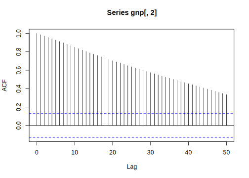
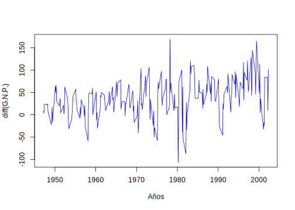
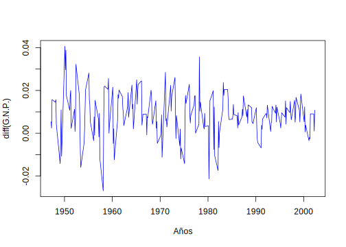
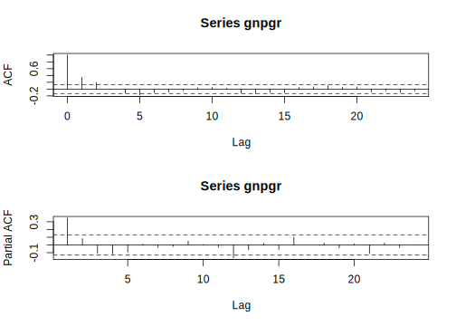
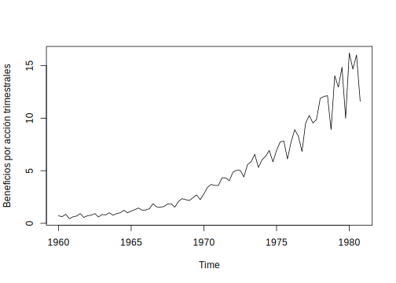
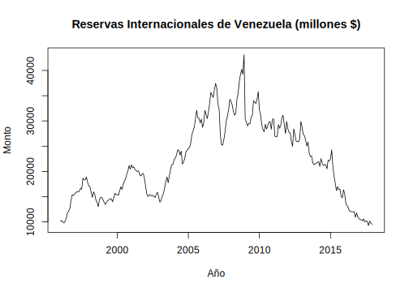

--- 
title: "Series de Tiempo en R"
subtitle: "Ciencia de los Datos Financieros"
author: "Synergy Vision"
date: "2018-10-08"
knit: "bookdown::render_book"
documentclass: krantz
bibliography: [book.bib, packages.bib]
biblio-style: apalike
link-citations: yes
colorlinks: yes
lot: yes
lof: yes
fontsize: 12pt
monofontoptions: "Scale=0.8"
keep_md: yes
site: bookdown::bookdown_site
description: ""
url: 'http\://synergy.vision/Series-de-Tiempo-en-R/'
github-repo: synergyvision/Series-de-Tiempo-en-R/
cover-image: images/cover.png
---

# Prefacio {-}

Placeholder


## ¿Por qué  leer este libro? {-}
## Estructura del libro {-}
## Información sobre los programas y convenciones {-}
## Prácticas interactivas con R {-}
## Agradecimientos {-}

<!--chapter:end:index.Rmd-->


# Acerca del Autor {-}

Este material es un esfuerzo de equipo en Synergy Vision, (<http://synergy.vision/nosotros/>).		 

El propósito de este material es ofrecer una experiencia de aprendizaje distinta y enfocada en el estudiante. El propósito es que realmente aprenda y practique con mucha intensidad. La idea es cambiar el modelo de clases magistrales y ofrecer una experiencia más centrada en el estudiante y menos centrado en el profesor. Para los temas más técnicos y avanzados es necesario trabajar de la mano con el estudiante y asistirlo en el proceso de aprendizaje con prácticas guiadas, material en línea e interactivo, videos, evaluación contínua de brechas y entendimiento, entre otros, para procurar el dominio de la materia.
  		  
Nuestro foco es la Ciencia de los Datos Financieros y para ello se desarrollará material sobre: **Probabilidad y Estadística Matemática en R**, **Programación Científica en R**, **Mercados**, **Inversiones y Trading**, **Datos y Modelos Financieros en R**, **Renta Fija**, **Inmunización de Carteras de Renta Fija**, **Teoría de Riesgo en R**, **Finanzas Cuantitativas**, **Ingeniería Financiera**, **Procesos Estocásticos en R**, **Series de Tiempo en R**, **Ciencia de los Datos**, **Ciencia de los Datos Financieros**, **Simulación en R**, **Desarrollo de Aplicaciones Interactivas en R**, **Minería de Datos**, **Aprendizaje Estadístico**, **Estadística Multivariante**, **Riesgo de Crédito**, **Riesgo de Liquidez**, **Riesgo de Mercado**, **Riesgo Operacional**, **Riesgo de Cambio**, **Análisis Técnico**, **Inversión Visual**, **Finanzas**, **Finanzas Corporativas**, **Valoración**, **Teoría de Portafolio**, entre otros.

Nuestra cuenta de Twitter es (https://twitter.com/bysynergyvision) y nuestros repositorios están en GitHub (https://github.com/synergyvision).
  		  
 **Somos Científicos de Datos Financieros**

<!--chapter:end:000-author.Rmd-->


# Introducción

Placeholder


## Conceptos financieros básicos
## Conceptos básicos 
## Ejemplos 
### Clasificación de las series de tiempo
## Componentes de una serie de tiempo
### El Modelo Aditivo de Componentes de Series de Tiempo
### El Modelo Multiplicativo de Componentes de Series de Tiempo

<!--chapter:end:100-introduction.Rmd-->


# Características de series de tiempo

Placeholder


## Medidas de dependencia para series de tiempo
## Estimación de la Tendencia
### Estimación de la tendencia en ausencia de estacionalidad
### Estimación de la tendencia y la estacionalidad
## Estimación de la tendencia por regresión clásica
### Regresión Clásica

<!--chapter:end:200-caracterisitcas-series-tiempo.Rmd-->


# Modelos de series de tiempo

Placeholder


## Modelos Estocásticos
### Procesos Estocásticos
### Momentos, Varianza, Covarianza y Correlación
### Variación de un proceso
### Martingalas
### Propiedad de Markov
## Modelos lineales
### Proceso de Ruido Blanco

<!--chapter:end:300-modelos-series-tiempo.Rmd-->


# Modelos AR

Placeholder


## Modelo AR(1)
## Modelo AR(2)
## Procesos AR(p)
## Función de Autocorrelación Parcial
## Criterios de Información
## Estimación de Parámetros.
## Predicciones con modelos AR
### Predicción de un paso
### Predicción de dos pasos
### Predicción de múltiples pasos

<!--chapter:end:301-modelos-AR.Rmd-->


# Modelos MA

Placeholder


## Propiedades de los modelos MA
### Estacionaridad
### Función de autocorrelación (ACF)
## Identificación del orden de un MA
## Estimación
## Predicciones usando modelos MA

<!--chapter:end:302-modelos-MA.Rmd-->


#  Modelos ARMA

Placeholder


## Propiedades de los modelos ARMA(p,q)
## Ecuaciones en Diferencias
### Función de Autocorrelación (ACF) para modelos ARMA
## Pronósticos
### Pronósticos para procesos ARMA

<!--chapter:end:303-modelos-ARMA.Rmd-->


# Estimación de parámetros

Placeholder


## Estimación
## Estimación por Máxima Verosimilitud y Mínimos Cuadrados {#sect-EMV}
## Estimación de mínimos cuadrados para modelos ARMA(p,q)

<!--chapter:end:304-estimacion-de-parametros.Rmd-->

# Modelos ARIMA

En este capítulo examinaremos el problema de encontrar un modelo apropiado para un conjunto determinado de observaciones $\{x_1,\ldots,x_n\}$ que no son necesariamente generados por una serie de tiempo estacionaria. Si los datos (a) no muestran desviaciones aparentes de la estacionariedad y (b) tienen una función de autocovarianza en rápida disminución, intentamos ajustar un modelo ARMA a los datos medios corregidos utilizando las técnicas desarrolladas en el capítulo de modelos ARMA. De lo contrario, buscamos primero una transformación de los datos que genere una nueva serie con las propiedades (a) y (b). Esto puede lograrse frecuentemente mediante la diferenciación, lo que nos lleva a considerar la clase de modelos ARIMA (siglas en inglés: autoregressive integrated moving-average).

En muchas situaciones, las series de tiempo pueden pensarse o ver como la composición de dos componentes, una componente de tendencia no estacionaria y una componente estacionaria de media cero. Por ejemplo, consideremos el modelo

\begin{equation}
x_t = \mu_t+y_t,
(\#eq:eq-modelo-base-1-diferencia)
\end{equation}

donde $\mu_t=\beta_0+\beta_1t$ y $y_t$ es estacionario. Si diferenciamos este proceso, obtenemos un proceso estacionario, en efecto

\begin{eqnarray*}
\nabla x_t &=& x_t-x_{t-1} = (\mu_t+y_t)-(\mu_{t-1}+y_{t-1}) \\
    &=& (\beta_0+\beta_1t+y_t)-(\beta_0+\beta_1(t-1)+y_{t-1}) \\
    &=& \beta_1 + y_t-y_{t-1} \\
    &=& \beta_1+\nabla y_t.
\end{eqnarray*}

El cual claramente es estacionario.

Otro modelo que lleva a la primera diferenciación es el caso en el cual $\mu_t$ en la ecuación \@ref(eq:eq-modelo-base-1-diferencia), es un proceso estocástico y que varía lentamente de acuerdo a un paseo laeatorio. Esto es,

$$\mu_t=\mu_{t-1}+v_t,$$

donde $v_t$ es estacionario. Tenemos entonces

$$x_t=\mu_{t-1}+v_t+y_t.$$

En este caso,

\begin{eqnarray*}
\nabla x_t &=& x_t-x_{t-1} \\
    &=& (\mu_{t-1}+v_t+y_t)-(\mu_{t-2}+v_{t-1}+y_{t-1}) \\
    &=& v_t+\nabla y_t,
\end{eqnarray*}

es estacionario. Si $\mu_t$ en \@ref(eq:eq-modelo-base-1-diferencia) es un polinomio de grado $k$, $\mu_t=\sum_{i=0}^k\beta_it^i$, entonces la serie diferenciada $\nabla^ky_t$ es estacinaia. Por ejemplo, sea $\mu_t=\beta_0+\beta_1t+\beta_2t^2$, luego

$$x_t=\mu_t+y_t = \beta_0+\beta_1t+\beta_2t^2+y_t.$$

Diferenciando una vez se tiene

\begin{eqnarray*}
\nabla x_t &=& (\mu_t+y_t)-(\mu_{t-1}+y_{t-1}) \\
    &=& (\beta_0+\beta_1t+\beta_2t^2+y_t) - (\beta_0+\beta_1(t-1)+\beta_2(t-1)^2+y_{t-1}) \\
    &=& \beta_0+\beta_1t+\beta_2t^2+y_t-\beta_0-\beta_1t-\beta_1-\beta_2(t^2-2t+1)-y_{t-1} \\
    &=& \beta_1+\beta_2+2\beta_2t+\nabla y_t.
\end{eqnarray*}

Volvemos a diferenciar

\begin{eqnarray*}
\nabla(\nabla x_t) &=& (\beta_1+\beta_2+2\beta_2t+(y_t-y_{t-1})) - (\beta_1+\beta_2+2\beta_2(t-1)+(y_{t-1}-y_{t-2})) \\
    &=& \beta_1+\beta_2+2\beta_2t+y_t-y_{t-1}-\beta_1-\beta_2-2\beta_2t+2\beta_2-y_{t-1}+y_{t-2} \\
    &=& 2\beta_2+\nabla(\nabla y_t) \\
    &=& 2\beta_2+\nabla^2y_t.
\end{eqnarray*}

El cual es estacionario. Los modelos estocásticos con tendencia llevan a diferenciaciones de orden superior. Por ejemplo, supongamos 

$$\mu_t=\mu_{t-1}+v_t\text{ y }v_t=v_{t-1}+e_t$$

donde $e_t$ es estacionario. Entonces $\nabla x_t = v_t+\nabla y_t$ no es estacionario, pero 

$$\nabla^2x_t = e_t+\nabla^2y_t,$$

si es estacionario.

Los modelos ARMA integrados o modelos ARIMA, es una extensión de los modelos ARMA que incluyen diferenciación. Formalmente, tenemos la siguiente definición.

\BeginKnitrBlock{definition}<div class="definition"><span class="definition" id="def:defi-modelo-ARIMA"><strong>(\#def:defi-modelo-ARIMA) </strong></span>Un proceso $x_t$ es un proceso ARIMA(p,d,q) si 

$$\nabla^dx_t = (1-B)^dx_t$$
  
es un proceso ARMA(p,q). En general, escribimos el modelo como 

\begin{equation}
  \phi(B)(1-B)^dx_t = \theta(B)w_t.
(\#eq:eq-modelo-ARIMA)
\end{equation}

Si $\mathbb{E}(\nabla^dx_t)=\mu$, escribimos el modelo como

$$\phi(B)(1-B)^dx_t=\delta+\theta(B)w_t,$$

donde $\delta=\mu(1-\phi_1-\cdots-\phi_p)$.</div>\EndKnitrBlock{definition}

----

Debido a la no estacionaridad, debemosser cuidadosos cuando realizamos predicciones.

## Construcción de modelos ARIMA

Hay algunos pasos básicos para ajustar modelos ARIMA a series de tiempo:

- Gráfico de los datos.

- Posible transformación de los datos (diferenciación, logaritmo, etc.).

- Identificación del orden de dependencia del modelo.

- Estimación del (los) parámetro(s).

- Diagnóstico.

- Elección del modelo.

Primero, como en todo análisis de datos, debemos realizar un gráfico de serie de tiempo de los datos e inspeccionar el mismo para ver cualquier anomalía. Si, por ejemplo, la variabilidad crece en el tiempo, será necesario que transformemos los datos para estabilizar la varianza. En este caso, las transformaciones de potencia de la clase Box-Cox resultan útiles. Por ejemplo, supongamos un proceso que evoluciona como un cambio porcentual bastante pequeño, como una inversión. Supongamos que

$$x_t=(1+p_t)x_{t-1},$$

donde $x_t$ es el valor de la inversión en tiempo $t$ y $p_t$ es el porcentaje de cambio del periodo $t-1$ al $t$, el cual puede ser negativo. Tomando logaritmo tenemos

$$\ln(x_t) = \ln(1+p_t)+\ln(x_{t-1})$$

o

$$\nabla\ln(x_t) = \ln(1+p_t).$$

Si el porcentaje de cambio $p_t$ se mantiene relativamente pequeño en magnitud, entonces $\ln(1+p_t)\approx p_t$ [^nota9] y entonces

[^nota9]: $\ln(1+p)=p-\frac{p^2}{2}+\frac{p^3}{3}-\cdots$ para $-1<p\leq1$. Si $p$ es un porcentaje de cambio pequeño, entonces los términos de orden superior en el desarrollo son despreciables.

$$\nabla\ln(x_t)\approx p_t,$$

será un proceso relativamente estable. A menudo $\nabla\ln(x_t)$ se llama el retorno o tasa de crecimiento. Después de una transformación apropiada de los datos, el siguiente paso es identificar los valores preliminares del orden autoregresivo $p$, el orden de diferenciación $d$ y el orden de promedio móvil $q$.

Ya hemos abordado en parte el problema de la elección del orden de diferenciación. El gráfico de la serie de tiempo nos ayudará a deterinar si hace falta una diferenciación. Si se requiere una diferenciación, entonces diferenciamos los datos una vez $(d=1)$, e inspeccionamos el gráfico de $\nabla x_t$. Si hace falta otra diferenciación, entonces volvemos a diferenciar $(d=2)$ e inspeccionamos nuevamente el gráfico, esta vez el de $\nabla^2x_t$. Debemos tener cuidado de no sobre diferenciar pues esto puede introducir dependencia donde no la hay. Por ejemplo, $x_t=w_t$ es no correlacionado, pero $\nabla x_t=w_t-w_{t-1}$ es un proceso $MA(1)$. Además del gráfico de la serie de tiempo, la ACF muestral nos puede ayudar a ver si es necesaria una diferenciación. Dado que el polinomio $\phi(z)(1-z)^d$ tiene raíz unitaria, la ACF muestral $\hat{\rho}(h)$, no decaerá a cero tan rápido cuando $h$ crece. Entonces, un lento decaimiento en $\hat{\rho}(h)$ es un indicativo de que se necesitará una diferenciación.

Una vez que hemos establecido el valor preliminar de $d$, el siguiente paso es ver la ACF y PACF muestrales de $\nabla^dx_t$ para el valor de $d$ elegido. Usando la tabla resumen para la elección de modelos ARMA (véase la tabla al final de la sección [Propiedades de los modelos ARMA(p,q)]) como guía, escogemos los valores preliminares de $p$ y $q$.

Dado que estamos trabajando con estimaciones, dos modelos que luzcan diferentes pueden ser de hecho bastante similares, por lo tanto, nodebemos preocuparnos, de momento, en ser muy precisos al ajustar un modelo. En este punto, unos pocos valores preliminares de $p,d$ y $q$ serán suficientes y nos permitirán iniciar las estimaciones de los parámetros. A continuación daremos un ejemplo de uso de los pasos previamente descritos.

\BeginKnitrBlock{example}\iffalse{-91-65-110-225-108-105-115-105-115-32-100-101-32-100-97-116-111-115-32-71-46-78-46-80-46-93-}\fi{}<div class="example"><span class="example" id="exm:ejem-gnp-data"><strong>(\#exm:ejem-gnp-data)  \iffalse (Análisis de datos G.N.P.) \fi{} </strong></span>Consideremos los datos del Producto Nacional Bruto trimestral de EE.UU en miles de millónes de dólares, desde el primer trimestre de 1947 hasta el tercer trimestre de 2002. Son $n=223$ observaciones, losdatos han sido ajustados estacionalmente. El archivo de datos es "gnp96.txt", y fueron obtenidos del *Federal Reserve Bank of St. Louis* (http://research.stlouisfed.org/). El gráfico \@ref(fig:fig-gnp-data) muestra la serie de tiempo correspondiente.</div>\EndKnitrBlock{example}


```r
# Lectura de los datos
gnp=read.table("data/gnp96.txt")
# Grafico de la serie
plot(gnp,type="l", xlab="Años",ylab="G.N.P.",col="blue")
```

<div class="figure">

<p class="caption">(\#fig:fig-gnp-data)Producto Nacional Bruto trimestral de EE.UU (en miles de millónes de dólares), desde el 1er trimestre de 1947 hasta el 3er trimestre de 2002.</p>
</div>

Dado que la serie presenta una fuerte tendencia creciente, no es claro si la varianza crece con el tiempo. Por lo tanto para propósito de demostrar como usar la ACF muestral, en la figura \@ref(fig:fig-acf-gnp) mostramos la misma. Como el decaimiento es lento, esto nos sugiere que una diferenciación es posible.


```r
# ACF muestral de GNP
acf(gnp[,2], 50)
```

<div class="figure">

<p class="caption">(\#fig:fig-acf-gnp)ACF muestral para la serie de datos G.N.P.</p>
</div>

La figura \@ref(fig:fig-gnp-dif-1) muestra la primera diferenciación, allí podemos observar que la variabilidad en la segunda mitad de datos es mayor que en la primera mitad. Además, parece que la tendencia creciente todavía está presente, porlo tanto, tomando en cuenta los pasos descritos al inicio de esta sección primero transformamos losdatos y luego diferenciamos, así obtenemos $y_t=\nabla\ln(x_t)$. 


```r
# Primera diferencia
gnpdif=diff(gnp[,2])
plot(gnp[2:223,1],gnpdif, type="l",xlab="Años",ylab="diff(G.N.P.)",
     col="blue")
```

<div class="figure">

<p class="caption">(\#fig:fig-gnp-dif-1)Primera diferenciación de la serie de tiempo G.N.P.</p>
</div>

La figura \@ref(fig:fig-gnp-log-dif-1) muestra la serie transformada y diferenciada, podemos ver allí que el proceso parece ser estable. Más aún, podemos interpretar los valores de $y_t$ como el porcentaje de crecimiento trimestral del Producto Nacional Bruto de EE.UU.


```r
# Transformacion y primera diferencia
gnpgr = diff(log(gnp[,2]))
plot(gnp[2:223,1],gnpgr,type = "l",xlab="Años",ylab="diff(G.N.P.)",
     col="blue")
```

<div class="figure">

<p class="caption">(\#fig:fig-gnp-log-dif-1)Serie de tiempo de G.N.P. transformada (log) y diferenciada una vez</p>
</div>

Graficamos ahora las ACF y PACF muestral de $y_t$. Observando las ACF y PACF parece que la ACF se corta en paso 2 y la PACF decae, lo que nos sugiere un modelo $MA(2)$ para la tasa de crecimiento del P.N.B., o un modelo ARIMA(0,1,2) para $y_t$. Pero en lugar de enfocarnos en un solo modelo, si detallamos las ACF y PACF muestral, parece sugerir que la ACF decrece y la PACF se corta en paso 1, lo que sugiere un modelo $AR(1)$ para la tasa de cambio o un modelo ARIMA(1,1,0) para $y_t$. Podemos decir entonces que un modelo ARIMA(1,1,2) es una primera elección de ajuste.


```r
# ACF y PACF de la transformacion
par(mfrow=c(2,1))
acf(gnpgr, 24)
pacf(gnpgr,24)
```

<div class="figure">

<p class="caption">(\#fig:fig-acf-pacf-gnp)ACF y PACF muestrales para las serie de tiempo G.N.P., transformada y diferenciada</p>
</div>

A modo de entrenamiento vamos a realizar primeramente los ajustes de los modelos $MA(2)$ y $AR(1)$ por separado. Para ello nos valemos de R, usaremos la función 'sarima' del paquete 'astsa'. Iniciamos con el modelo $AR(1)$.


```r
gnpgr.ar=arima(gnpgr, c(1, 0, 0)) # AR(1)
```

El modelo $AR(1)$ estimado es $x_t=\mu(1-\phi_1)+\phi_1x_{t-1}+\hat{w}_t$

\begin{equation}
x_t = 0.0083_{(0.001)}(1-0.3467)+0.3467_{(0.063)}x_{t-1}+\hat{w}_t
(\#eq:eq-modelo-AR1-gnp)
\end{equation}

donde $\hat{\sigma}_w=0.0095$ con 220 grados de libertad; note que la constante en \@ref(eq:eq-modelo-AR1-gnp) es $0.0083(1-0.3467)=0.005$. Los valores entre parentesis son los errores estándar estimados.

Ahora usando EMV fijamos un modelo $MA(2)$ para la tasa de crecimiento $x_t$, siendo el modelo estimado

\begin{equation}
x_t = 0.008_{(0.001)}+0.303_{(0.065)}\hat{w}_{t-1}+0204_{(0.064)}\hat{w}_{t-2}+\hat{w}_t
(\#eq:eq-modelo-MA2-gnp)
\end{equation}

donde $\hat{\sigma}_w=0.0094$ con 219 grados de libertad. Los valores entre parentesis corresponden a los errores estándar estimados. Aunque la constante es muy pequeña, su valor es significativo, no incluir una constante lleva a conclusiones erróneas sobre la naturaleza de la economía estadounidense. Si no  incluimos una constane, asumiríamos que la tasa de crecimiento trimestral promedio es cero, mientras que en realidad la tasa de crecimiento trimestral promedio del P.N.B. de EE.UU es de alrededor del 1% (véase la gráfica \@ref(fig:fig-gnp-data)).


```r
gnpgr.ma2=arima(gnpgr, c(0, 0, 2)) # MA(2)
# Psi-pesos
ARMAtoMA(ar=.3467, ma=0, 10) # prints psi-weights
```

```
##  [1] 3.467000e-01 1.202009e-01 4.167365e-02 1.444825e-02 5.009210e-03
##  [6] 1.736693e-03 6.021115e-04 2.087520e-04 7.237433e-05 2.509218e-05
```

----

El siguiente paso en el ajuste de modelos es el diagnóstico. Esta investigación incluye el análisis de residuales así como la comparación de modelos. De nuevo, el primer paso envuelve un gráfico de las innovaciones (o residuales) $x_t-\hat{x}_t^{t-1}$ o de las innovaciones estandarizadas

\begin{equation}
 e_t = (x_t-\hat{x}_t^{t-1})/\sqrt{\hat{P}_t^{t-1}}
(\#eq:eq-innovaciones-estandar)
\end{equation}

donde $\hat{x}_t^{t-1}$ es la predicción de un paso de $x_t$ basado en el modelo ajustado y $\hat{P}_t^{t-1}$ es varianza del error estimado de un paso. Si el modelo se ajusta bien, el residual estandarizado debe comportarse como una sucesión iid de media cero y varianza uno, así que debemos observar bien el gráfico de la serie de tiempo para ver si hay desviación evidente de esta suposición. Por ejemplo, es posible en el caso no-gaussiano tener un proceso no-correlacionado para el cual valores contiguos en tiempo sean altamente dependientes. Como ejemplo, podemos mencionar la familia de modelos GARCH que discutiremos en el capítulo siguiente.

Para determinar o investigar sobre la normaidad marginal nos valemos del histograma de los residuales, así visualmente podemos ver si el mismo se parece o ajusta a la curva de densidad normal. Además de esto, un gráfico de probabilidad normal o un gráfico de cuantiles (qq-plot) nos puede ayudar a identificar la desviación de la normalidad.

También podemos inspeccionar la autocorrelación muestral de los residuales $\hat{\rho}_e(h)$, para ver algún patrón o valores grandes. Recordemos que, para un ruido blanco, las autocorrelaciones muestrales son aproximadamente independientes y normalmente distribuidas con media cero y varianza $1/n$. Por consiguiente, una buena forma de inspeccionar la estructura de correlación de los residuales es graficar $\hat{\rho}_e(h)$ vs $h$ junto con las cotas de error $\pm2/\sqrt{n}$. Tome en cuenta, sin embargo, que los residuales de un modelo ajustado, no tendrán necesariamente las propiedades de un ruido blanco y la varianza de $\hat{\rho}_e(h)$ puede ser mucho menor que $1/n$.

Además de graficar $\hat{\rho}_e(h)$, podemos realizar una prueba de hipótesis general que tome en consideración las magnitudes de $\hat{\rho}_e(h)$ como grupo. Por ejemplo, puede ser el caso que individualmente cada $\hat{\rho}_e(h)$ sea pequeño en magnitud, digamos menr que $2/\sqrt{n}$ en magnitud, es decir $|\hat{\rho}_e(h)|<2/\sqrt{n}$, pero colectivamente, los valores sean grandes. El estadístico de Ljung-Box-Pierce dado por 

\begin{equation}
 Q = n(n+2)\sum_{h=1}^H\frac{\hat{\rho}_e^2(h)}{n-h}
 (\#eq:eq-estadistico-ljung-box-pierce)
\end{equation}

es útil para realizar esta prueba de hipótesis. El  valor $H$ en \@ref(eq:eq-estadistico-ljung-box-pierce) se elige de manera arbitraria, en general se usa $H=20$. Bajo la hipótesis nula de que el modelo es adecuado, asintóticamente, (cuando $n\to\infty$), $Q$ se distribuye como una chi-cuadrado con $H-p-q$ grados de libertad, esto es $Q\sim\chi_{H-p-q}^2$. Entonces, rechazamos la hipótesis nula a nivel $\alpha$ si el valor  de $Q$ es mayor que la $\chi_{H-p-q}^2(1-\alpha)$.

\BeginKnitrBlock{example}\iffalse{-91-68-105-97-103-110-243-115-116-105-99-111-32-112-97-114-97-32-108-97-32-116-97-115-97-32-100-101-32-99-114-101-99-105-109-105-101-110-116-111-32-100-101-108-32-80-46-78-46-66-93-}\fi{}<div class="example"><span class="example" id="exm:ejem-diagnostico-tasa-crecimiento-gnp"><strong>(\#exm:ejem-diagnostico-tasa-crecimiento-gnp)  \iffalse (Diagnóstico para la tasa de crecimiento del P.N.B) \fi{} </strong></span>Enfoquémonos en el modelo $MA(2)$ ajustado del ejemplo \@ref(exm:ejem-gnp-data), el análisis de los residuales de $AR(1)$ es similar. La figura \@ref(fig:fig-modelo-arima002-gnp) muestra el gráfico de los residuales estandarizados (parte superior), la ACF de los residuales (parte media izquierda) (Note que R incluye la correlación en paso cero que siempre es uno) y los valores del estadístico $Q$, dado en \@ref(eq:eq-estadistico-ljung-box-pierce) desde paso $H=1$ hasta $H=20$ (parte inferior). </div>\EndKnitrBlock{example}


```r
tsdiag(gnpgr.ma2,gof.lag=20)
```

<div class="figure">

<p class="caption">(\#fig:fig-diagnostico-residual-MA2-gnp)Diagnóstico de los residuales con el modelo MA(2) de la serie P.N.B.</p>
</div>

Observando el gráfico de los residuales estandarizados en \@ref(fig:fig-diagnostico-residual-MA2-gnp), no muestran un patrón obvio. Note que no hay valores atípicos pero si algunos pocos valores mayores que 3 desviaciones estándar. La ACF de los residuales no muestra una aparente desviación de la suposición del modelo, y el estadístico $Q$ no es significativo para los primeros 20 pasos calculados.

Finalmente la figura \@ref(fig:fig-histograma-qq-plot-residual-gnp) muestra un histograma de los residuales (parte superior) y un gráfico qq-plot de los residuales (parte inferior). En la misma podemos observar que los residuales están cercanos a la normalidad excepto para algunos valores extremos en la cola.


```r
par(mfrow=c(2,1))
hist(gnpgr.ma2$resid,br=12)
qqnorm(gnpgr.ma2$resid)
```

<div class="figure">

<p class="caption">(\#fig:fig-histograma-qq-plot-residual-gnp)Histograma de los residuales para P.N.B. (parte superior), y qq-plot de los residuales (parte inferior), para el modelo MA(2)</p>
</div>

Para concluir, realizamos la prueba de Shapiro-Wilk (referencia), la cual nos da un $p$-valor de 0.003, lo que indica que los residuales no son normal. Por lo tanto, el modelo parece ajustarse bien salvo que debemos usar una distribución con una cola más pesada que la distribución normal. El comando en R para la prueba de Shapiro-Wilk es


```r
shapiro.test(gnpgr.ma2$resid)
```

```
## 
## 	Shapiro-Wilk normality test
## 
## data:  gnpgr.ma2$resid
## W = 0.98029, p-value = 0.003416
```
----

Podemos hacer lo mismo ahora para el modelo ARIMA(1,1,2)

```r
gnpgr.arima=arima(gnpgr,order=c(1,1,2))
tsdiag(gnpgr.arima,gof.lag=20)
```

<div class="figure">

<p class="caption">(\#fig:fig-diagnostico-gnp-arima)Diagnóstico para el modelo ARIMA de B.N.P</p>
</div>

Nuevamente, observando el gráfico de los residuales estandarizados, estos no muestran un patrón obvio. Note que tampoco hay valores atípicos pero si algunos pocos valores mayores que 3 desviaciones estándar. La ACF de los residuales no muestra una aparente desviación de la suposición del modelo, y el estadístico $Q$ no es significativo para los primeros 20 pasos calculados.


```r
par(mfrow=c(2,1))
hist(gnpgr.arima$resid)
qqnorm(gnpgr.arima$resid)
```

<div class="figure">

<p class="caption">(\#fig:fig-histograma-qq-plot-residual-gnp-arima)Histograma de los residuales para P.N.B. (parte superior), y qq-plot de los residuales (parte inferior), para el modelo ARIMA(1,1,2)</p>
</div>

```r
shapiro.test(gnpgr.arima$resid)
```

```
## 
## 	Shapiro-Wilk normality test
## 
## data:  gnpgr.arima$resid
## W = 0.9779, p-value = 0.00149
```

La figura \@ref(fig:fig-histograma-qq-plot-residual-gnp-arima) muestra un histograma de los residuales (parte superior) y un gráfico qq-plot de los residuales (parte inferior). En la misma, de manera similar al modelo $MA(2)$ podemos observar que los residuales están cercanos a la normalidad excepto para algunos valores extremos en la cola. Por último, realizamos la prueba de Shapiro-Wilk, la cual nos da un $p$-valor de 0.001, lo que indica que los residuales no son normales. Por lo tanto, de nuevo, este modelo parece también ajustarse bien salvo que debemos usar una distribución con una cola más pesada que la distribución normal.

----

Como explicamos previamente, debemos tener cuidado con sobreajustar un modelo; no siempre es el caso que más es mejor. Sobreajustar nos lleva a estimadores menos preciso, y agregar más parámetros puede ajustar mejor los datos pero puede llevar a malas predicciones. Este resultado se ilustra en el ejemplo siguiente.

\BeginKnitrBlock{example}\iffalse{-91-85-110-32-112-114-111-98-108-101-109-97-32-100-101-32-115-111-98-114-101-97-106-117-115-116-101-93-}\fi{}<div class="example"><span class="example" id="exm:ejem-problema-sobreajuste"><strong>(\#exm:ejem-problema-sobreajuste)  \iffalse (Un problema de sobreajuste) \fi{} </strong></span>La figura \@ref(fig:fig-sobreajuste-poblacion-usa), muestra  la población de los EE.UU., según el censo oficial cada 10 años de 1910 hasta 1990 (puntos azules). Si usamos estos nueve puntos para predecir la población a futuro de los EE.UU. podemos usar un polinomio de grado 8 para ajustar las 9 observaciones; lo cual como se observa en la gráfica es perfecta. El modelo en este caso es 

$$x_t=\beta_0+\beta_1t+\beta_2t^2+\cdots+\beta_8t^8+w_t$$

El modelo fijado, el cual es graficado hasta el año 2010, (linea continua roja), pasa a través de los 9 puntos. El modelo predice que la población de los EE.UU. estará cercana a cero en el año 2000, y cruzará el cero en algún mes del año 2002, lo cual es falso.</div>\EndKnitrBlock{example}


```r
uspop=read.table("data/USPOP2.txt", header = TRUE)
fit.usp=lm(Pob~t+I(t^2)+I(t^3)+I(t^4)+I(t^5)+I(t^6)+I(t^7)+I(t^8),
           data=uspop)
plot(uspop,type="p",lty=19,col="blue",xlim=c(1910,2010))
lines(x = uspop$t, y=predict(fit.usp), col = "red", lwd = 2)
```

<!-- -->
----

El paso final en el ajuste de modelos es la elección del modelo. Esto es, debemos decidir que modelo mantendremos para la predicción. La técnica más popular es calcular los índices AIC, AICc y SIC (BIC), descritos en las definiciones \@ref(def:defi-AIC-2), \@ref(def:defi-AICc) y \@ref(def:defi-SIC).

\BeginKnitrBlock{example}\iffalse{-91-69-108-101-99-99-105-243-110-32-100-101-108-32-109-111-100-101-108-111-32-112-97-114-97-32-108-97-32-115-101-114-105-101-32-80-46-78-46-66-46-32-100-101-32-69-69-46-85-85-46-93-}\fi{}<div class="example"><span class="example" id="exm:ejem-eleccion-modelo-gnp"><strong>(\#exm:ejem-eleccion-modelo-gnp)  \iffalse (Elección del modelo para la serie P.N.B. de EE.UU.) \fi{} </strong></span>Volviendo al análisis del P.N.B. de EE.UU., visto en los ejemplos \@ref(exm:ejem-gnp-data) y \@ref(exm:ejem-diagnostico-tasa-crecimiento-gnp), recordemos que los modelos son AR(1), MA(2) y ARIMA(1,1,2). Para escoger el modelo final, comparemos los valores del AIC, AICc y SIC para los 3 modelos</div>\EndKnitrBlock{example}

```r
n=length(gnpgr)
# Modelos AR
kar=length(gnpgr.ar$coef)
sar=gnpgr.ar$sigma2
# Modelos MA
kma=length(gnpgr.ma2$coef)
sma=gnpgr.ma2$sigma2
# Modelo ARIMA
karima=length(gnpgr.arima$coef)
sarima=gnpgr.arima$sigma2
# AIC
log(sar)+(n+2*kar)/n
```

```
## [1] -8.294403
```

```r
log(sma)+(n+2*kma)/n
```

```
## [1] -8.297695
```

```r
log(sarima)+(n+2*karima)/n
```

```
## [1] -8.284722
```

```r
# AICc
log(sar)+(n+kar)/(n-kar-2)
```

```
## [1] -8.284898
```

```r
log(sma)+(n+kma)/(n-kma-2)
```

```
## [1] -8.287855
```

```r
log(sarima)+(n+karima)/(n-karima-2)
```

```
## [1] -8.274883
```

```r
# BIC (SIC)
log(sar)+kar*log(n)/n
```

```
## [1] -9.263748
```

```r
log(sma)+kma*log(n)/n
```

```
## [1] -9.251712
```

```r
log(sarima)+karima*log(n)/n
```

```
## [1] -9.23874
```
----


## Modelos SARIMA

En esta sección vamos a introducir diversas modificaciones a los modelos ARIMA para que se ajusten a comportamiento estacional y no-estacionario. A menudo, la dependencia del pasado tiende a ocurrir más fuertemente en múltiplos de algún paso estacinal $s$ oculto. Por ejemplo, con datos económicos mensuales, existe una fuerte componente anual con pasos que son múltiplos de $s=12$, debido a la fuerte conexión de todas las actividades al calendario anual. Los datos tomados trimestralmente exhibirán un período repetitivo para $s=4$. Los fenómenos naturales tales como temperatura, lluvia, etc., también presentan una fuerte componente correspondiente a la estación del año. Por consiguiente, la variabilidad natural de muchos fenómenos físicos, biológicos y procesos económicos tienden a comportarse según las fluctuaciones estacionales. Debido a esto, es apropiado introducir polinomios autorregresivo de promedio móvil que se identifiquen con los rezagos estacionales.

\BeginKnitrBlock{definition}<div class="definition"><span class="definition" id="def:defi-modelo-sarma"><strong>(\#def:defi-modelo-sarma) </strong></span>El **modelo autorregresivo de promedio móvil estacional puro** denotado $ARMA(P,Q)_s$ tiene la forma

\begin{equation}
\Phi_P(B^s)x_t=\Theta_Q(B^s)w_t,
(\#eq:eq-modelo-sarma)
\end{equation}

donde los operadores

\begin{equation}
\Phi_P(B^s) = 1-\Phi_1B^s-\Phi_2B^{2s}-\cdots-\Phi_PB^{Ps}
(\#eq:eq-operador-AR-estacional)
\end{equation}
  
y 

\begin{equation}
\Theta_Q(B^s) = 1+\Theta_1B^s+\Theta_2B^{2s}+\cdots+\Theta_QB^{Qs},
(\#eq:eq-operador-MA-estacional)
\end{equation}
  
son los *operadores autorreggresivo estacional* y de *promedio móvil estacional* de ordenes $P$ y $Q$ respectivamente, con período estacional $s$.

Análogo a las propiedades de los modelos $ARMA$ no-estacionales, el modelo $ARMA(P,Q)_s$ puro es *causal* sólo cuando las raíces de $\Phi_P(z^s)$ están fuera del círculo unitario y es *invertible* cuando las raíces de $\Theta_Q(z^s)$ están fuera del círculo unitario. </div>\EndKnitrBlock{definition}

----

\BeginKnitrBlock{example}\iffalse{-91-85-110-97-32-115-101-114-105-101-32-65-82-32-101-115-116-97-99-105-111-110-97-108-93-}\fi{}<div class="example"><span class="example" id="exm:ejem-serie-AR-estacional"><strong>(\#exm:ejem-serie-AR-estacional)  \iffalse (Una serie AR estacional) \fi{} </strong></span>Una serie autorregresiva estacional de primer orden que podría durar meses la podemos escribir como

$$(1-\Phi B^{12})x_t=w_t$$

o

$$x_t=\phi x_{t-12}+w_t.$$

Este modelo exhibe la serie $x_t$ en términos de saltos o rezagos múltiplos del periodo estacional anual $s=12$ meses. 

De la forma anterior se desprende cláramente que la estimación y el pronóstico para tal proceso sólo implica modificaciones directas del cso de rezago unitario que ya tratamos. En particular, la condición causal requiere $|\Phi|<1$.

Simulamos 3 años de datos de este modelo con $\Phi=0.9$ y mostramos las ACF y PACF teóricas del modelo. Véase la figura \@ref(fig:fig-modelo-AR1-estacional)</div>\EndKnitrBlock{example}


```r
set.seed(666)
phi=c(rep(0,11),0.9)
sAR=arima.sim(list(order=c(12,0,0),ar=phi),n=37)
sAR = ts(sAR, freq=12)
layout(matrix(c(1,1,2, 1,1,3), nc=2))
par(mar=c(3,3,2,1), mgp=c(1.6,.6,0))
plot(sAR, axes=FALSE, main='Serie AR(1) estacional', xlab="años", type='c')
Months = c("E","F","M","A","M","J","J","A","S","O","N","D")
points(sAR, pch=Months, cex=1.25, font=4, col=1:4)
axis(1, 1:4); abline(v=1:4, lty=2, col=gray(.7))
axis(2); box()
ACF = ARMAacf(ar=phi, ma=0, 100)
PACF = ARMAacf(ar=phi, ma=0, 100, pacf=TRUE)
plot(ACF,type="h", xlab="Rezago", ylim=c(-.1,1)); abline(h=0)
plot(PACF, type="h", xlab="Rezago", ylim=c(-.1,1)); abline(h=0)
```

<div class="figure">

<p class="caption">(\#fig:fig-modelo-AR1-estacional)Datos generados de un modelo estaconal AR(1), con s=12 y las funciones ACF y PACF del modelo x_t=0.9x_{t-12}+w_t</p>
</div>

----

Para un modelo $MA(1)$ estacional con $s=12$, $x_t=w_t+\Theta w_{t-12}$, es fácil verificar que 

\begin{eqnarray*}
  \gamma(0) &=& (1+\Theta^2)\sigma^2 \\
  \gamma(\pm12) &=& \Theta\sigma^2 \\
  \gamma(h) &=& 0 \text{, cualquier otro caso.}
\end{eqnarray*}

Entonces, la única correlación no cero, aparte del paso 0 es 

$$\rho(\pm12) = \Theta/(1+\Theta^2).$$

Para un modelo $AR(1)$ estacional con $s=12$, usando las técnicas para el modelo $AR(1)$ no-estacional, tenemos

\begin{eqnarray*}
  \gamma(0) &=& \sigma^2/(1-\Phi^2) \\
  \gamma(\pm12) &=& \sigma^2\Phi^k/(1-\Phi^2), k=1,2,\ldots \\
  \gamma(h) &=& 0 \text{, cualquier otro caso.}
\end{eqnarray*}

En este caso, las únicas correlaciones no cero son

$$\rho(\pm12) = \Phi^k, k=0,1,2,\ldots.$$
Estos resultados se pueden verificar usando el resultado general

$$\gamma(h) = \Phi\gamma(h-12)\text{, para }h\geq1.$$
Por ejemplo, cuando $h=1$, $\gamma(1)=\Phi\gamma(11)$, pero para $h=11$, se tiene que $\gamma(11)=\Phi\gamma(1)$, lo que implica que $\gamma(1)=\gamma(11)=0$. Adicional a estos resultados, la PACF tiene extensión análoga del modelo no-estacional al estacional. Estos resultados se observan en la figura \@ref(fig:fig-modelo-AR1-estacional).

Como un criterio de diagnóstico inicial, podemos usar las propiedades de una serie autorregresiva de promedio móvil estacional puro que se muestran en la tabla siguiente. Estas propiedades las podemos considerar como una generalización de las propiedades para modelos no estacionales que presentamos en la sección (*referencia*)


|   | AR(P)s  | MA(Q)s  | ARMA(P,Q)s  |
|---|:-:|:-:|:-:|
| ACF*  | Cola fuera en | Corte después | Cola fuera en |
|   | paso k, k=1,2,... | de paso Q  | paso k   |
| PACF*  | Corte después  |  Cola fuera en | Cola fuera en  |
|   | de paso P | paso k, k=1,2,... | paso k |

*Los valores en paso no-estacional $h\neq k$, para $k=1,2,\ldots$ son cero.

En general, podemos combinar los operadores no estacionales y estacionales en un solo modelo.

\BeginKnitrBlock{definition}<div class="definition"><span class="definition" id="def:defi-modelo-sarma-multiplicativo"><strong>(\#def:defi-modelo-sarma-multiplicativo) </strong></span>Un modelo **multiplicativo autorregresivo de promedio móvil estacional** denotado por $ARMA(p,q)\times(P,Q)_s$ tiene la forma 

\begin{equation}
\Phi_P(B^s)\phi(B)x_t = \Theta_Q(B^s)\theta(B)w_t
(\#eq:eq-sarma-multiplicativo)
\end{equation}</div>\EndKnitrBlock{definition}

----

Aunque las propiedades de diagnóstico en la tabla anterior no son estrictamente ciertas para el modelo general mixto, el comportamiento de las ACF y PACF tienden a mostrar patrones aproximados de la forma indicada. De hecho, para modelos mixtos, podemos ver una mezcla de las propiedades listadas en las tablas mencionadas.

Al ajustar tales modelos, nos centraremos primero en los componentes estacionales autorregresivo de promedio móvil estacional, lo que en general nos conduce a resultados más satisfactorios.

\BeginKnitrBlock{example}\iffalse{-91-85-110-32-109-111-100-101-108-111-32-101-115-116-97-99-105-111-110-97-108-32-109-105-120-116-111-93-}\fi{}<div class="example"><span class="example" id="exm:ejem-modelo-estacional-mixto"><strong>(\#exm:ejem-modelo-estacional-mixto)  \iffalse (Un modelo estacional mixto) \fi{} </strong></span>Consideremos un modelo $ARMA(0,1)\times(1,0)_{12}$
  
$$x_t = \Phi x_{t-12}+w_t+\theta w_{t-1},$$
  
donde $|\Phi|<1$ y $|\theta|<1$. Entonces, dado que $x_{t-12}, w_t$ y $w_{t-1}$ son no-correlacionados, y $x_t$ es estacionario $\gamma(0)=\Phi^2\gamma(0)+\sigma_w^2+\theta^2\\sigma_w^2$ o 

$$\gamma(0) = \frac{1+\theta^2}{1-\Phi^2}\sigma_w^2.$$
  
Además, multiplicando el modelo por $x_{t-h}, h>0$, y tomando valor esperado, tenemos $\gamma(1)=\Phi\gamma(11)+\theta\sigma_w^2$, y $\gamma(h)=\Phi\gamma(h-12)$ para $h\geq2$. Entonces, la ACF para este modelo es 

\begin{eqnarray*}
  \rho(12h) &=& \Phi^h, h=1,2,\ldots\\
  \rho(12h-1) &=& \rho(12h+1) = \frac{\theta}{1+\theta^2}\Phi^h, h=0,1,2,\ldots \\
  \rho(h) &=& 0 \text{, en otro caso.}
\end{eqnarray*}

Las ACF y PACF para este modelo, con $\Phi=0.8$ y $\theta=-0.5$ se muestran en la Figura \@ref(fig:fig-modelo-sarma-multiplicativo). Los comandos en $R$ para reproducir la Figura \@ref(fig:fig-modelo-sarma-multiplicativo) son los siguientes.</div>\EndKnitrBlock{example}


```r
phi = c(rep(0,11),.8)
ACF = ARMAacf(ar=phi, ma=-.5, 50)[-1] # [-1] remueve el rezago 0
PACF = ARMAacf(ar=phi, ma=-.5, 50, pacf=TRUE)
par(mfrow=c(1,2))
plot(ACF, type="h", xlab="Rezago", ylim=c(-.4,.8)); abline(h=0)
plot(PACF, type="h", xlab="Rezago", ylim=c(-.4,.8)); abline(h=0)
```

<div class="figure">

<p class="caption">(\#fig:fig-modelo-sarma-multiplicativo)ACF y PACF de un modelo ARMA estacional mixto</p>
</div>

----

La persistencia estacional ocurre cuando el proceso es casi periódico en la temporada. Por ejemplo, con promedios de temperaturas mensuales sobre los años, cada enero será aproximadamente igual, cada febrero será aproximadamente el mismo, y así sucesivamente. En este caso, podemos pensar que la temperatura promedio mensual $x_t$ es modelada como 

$$x_t = S_t+w+t,$$

donde $S_t$ es una componente estacional que varia poco de un año a otro de acuerdo a un paseo aleatorio

$$S_t = S_{t-12}+v_t.$$

En este modelo, $w_t$ y $v_t$ son ruidos blancos no-correlacionados. La tendencia de los datos que sigue este tipo de modelos se exhibe en la ACF muestral que es grande y decae muy lentamente en los rezagos $h=12k$ para $k=1,2,\ldots$. Si sustraemos el efecto de años sucesivos el uno del otro, encontramos que 

$$(1-B^{12})x_t = x_t-x_{t-12} = v_t+w_t-w_{t-12}.$$

Este modelo es un modelo $MA(1)_{12}$ estacionario y su ACF tendrá un pico solo en paso 12. En general, la diferenciación estacional puede ser indicada cuando la ACF decae lentamente en múltiplos de algún período estacional $s$, pero es despreciable entre los períodos.

\BeginKnitrBlock{definition}<div class="definition"><span class="definition" id="def:defi-diferencia-estacional-D"><strong>(\#def:defi-diferencia-estacional-D) </strong></span>La **diferencia estacional de orden $D$** se define como  

\begin{equation}
\nabla_s^Dx_t=(1-B^2)^Dx_t
(\#eq:eq-diferencia-estacional-D)
\end{equation}</div>\EndKnitrBlock{definition}

----

Normalmente, $D=1$, es suficiente para obtener estacionaridad estacional. incorporando estas ideas al modelo general nos lleva a la siguiente definición. 

\BeginKnitrBlock{definition}<div class="definition"><span class="definition" id="def:defi-modelo-sarima"><strong>(\#def:defi-modelo-sarima) </strong></span>Un modelo **autorregresivo integrado de promedio móvil estacional multiplicativo** o modelo $SARIMA$ está dado por 

\begin{equation}
\Phi_P(B^s)\phi(B)\nabla_s^D\nabla^dx_t = \delta+\Theta_Q(B^s)\theta(B)w_t,
(\#eq:eq-modelo-sarima)
\end{equation}
  
donde $w_t$ es un ruido blanco gaussiano. El modelo general es denotado como $ARIMA(p,d,q)\times(P,D,Q)_s$. Las componentes autorregresiva y de promedio móvil ordinarias son representadas por $\phi(B)$ y $\theta(B)$ de órdenes $p$ y $q$ respectivamente, y las componentes autorregresivas y de promedio móvil estacionales por $\Phi_P(B^s)$ y $\Theta_Q(B^s)$ de órdenes $P$ y $Q$, y las componentes de diferencias ordinarias y estacionales $\nabla^d=(1-B)^d$ y $\nabla_s^D=(1-B^s)^D$.</div>\EndKnitrBlock{definition}

----

\BeginKnitrBlock{example}\iffalse{-91-85-110-32-109-111-100-101-108-111-32-83-65-82-73-77-65-93-}\fi{}<div class="example"><span class="example" id="exm:ejem-modelo-sarima"><strong>(\#exm:ejem-modelo-sarima)  \iffalse (Un modelo SARIMA) \fi{} </strong></span>Consideremos el siguiente modelo, el cual a menudo provee una representación razonable para seires econométricas estacionales y no estacionarias. Mostramos la ecuación para el modelo, denotado por $ARIMA(0,1,1)\times(0,1,1)_{12}$ en la notación de la definición anterior (Definición \@ref(def:defi-modelo-sarima)), donde las fluctuaciones estacionales ocurren cada 12 meses. Entonces con $\delta=0$, el modelo \@ref(eq:eq-modelo-sarima) llega a ser 

$$\nabla_{12}\nabla x_t=\Theta(B^{12})\theta(B)w_t,$$
  
o

\begin{equation}
(1-B^{12})(1-B)x_t = (1+\Theta B^{12})(1+\theta B)w_t.
(\#eq:eq-modelo-sarima-p12)
\end{equation}
  
Expandiendo ambos lados de \@ref(eq:eq-modelo-sarima-p12), obtenemos la representación 

$$(1-B-B^{12}+B^{13})x_t = (1+\theta B+\Theta B^{12}+\Theta\theta B^{13})w_t,$$
  
o en la forma de ecuaciones en diferencias

$$x_t = x_{t-1}+x_{t-12}-x_{t-13}+w_t+\theta w_{t-1}+\Theta w_{t-12}+\Theta\theta w_{t-13}.$$
  
Note que la naturaleza multiplicativa del modelo implica que el coeficiente de $w_{t-13}$ es el producto de los coeficientes de $w_t$ y $w_{t-12}$, en lugar de un parámetro libre. El supuesto del modelo multiplicativo parece funcionar bien con muchos conjuntos  de datos de series de tiempo estacionales a la vez que reduce el número de parámetros que debemos estimar.</div>\EndKnitrBlock{example}

----

Seleccionar el modelo apropiado para un conjunto de datos dado entre todos los posibles modelos representados por la ecuación \@ref(eq:eq-modelo-sarima) es una tarea desalentadora, y generalmente pensamos primero en términos de encontrar operadores de diferencia que producen una serie más o menos estacionaria y luego en términos de encontrar un modelo autorregresivo de promedio móvil simple o un modelo ARMA multiplicativo estacional para adaptarlo a la serie de residuales resultante.

Primero aplicamos operaciones de diferenciación y luego construimos los residuos a partir de una serie de tamaño reducido. A continuación, evaluamos las ACF y PACF de estos residuos. Los picos que aparecen en estas funciones a menudo pueden eliminarse fjando o ajustando una componente autorregresiva o una componente de promedio móvil de acuerdo con las propiedades de las Tablas para las funciones ACF y PACF. Al considerar si el modelo es satisfactorio podemos aplicar las técnicas de diagnóstico discutidas en la Sección [Construcción de modelos ARIMA].

\BeginKnitrBlock{example}\iffalse{-91-80-97-115-97-106-101-114-111-115-32-97-233-114-101-111-115-93-}\fi{}<div class="example"><span class="example" id="exm:ejem-pasajeros-aereos"><strong>(\#exm:ejem-pasajeros-aereos)  \iffalse (Pasajeros aéreos) \fi{} </strong></span>Consideremos el conjunto de datos de $R$ "AirPassengers", que son los totales mensuales de pasajeros de lineas aereas internacionales de 1949 a 1960. En la Figura \@ref(fig:fig-serie-pasajeros-transformados) mostramos la serie de datos así como 3 transformaciones de los mismos. Primero una transformación logarítmica, luego una diferenciación de un paso sobre esta, y finalmente una diferenciación adicional de orden 12. Las instrucciones en $R$ son:</div>\EndKnitrBlock{example}


```r
x = AirPassengers
lx = log(x); dlx = diff(lx); ddlx = diff(dlx, 12)
plot.ts(cbind(x,lx,dlx,ddlx), main="")
```

<div class="figure">

<p class="caption">(\#fig:fig-serie-pasajeros-transformados)Serie de tiempo AirPassengers, x, (parte superior), el cual es los totales mensuales de pasajeros de lineas aéreas internacionales de 1949 a 1960; y los datos transformados lx=log x_t (segundo cuadro); dlx=diff(log x_t) (tercer cuadro) y ddlx=diff_12 diff(log x_t) (cuadro inferior)</p>
</div>

Observe que la serie original $x$ muestra tendencia y varianza crecientes; en $lx$ están los datos transformados logarítmicamente y en estso la varianza se estabiliza. Luego diferenciamos la serie transformada para eliminar la tendencia, y la guardamos en $dlx$. Se observa claramente la persistencia estacional (i.e., $dlx_t\approx dlx_{t-12}$) de modo que aplicamos una diferenciación de orden 12. Los datos transformados parecen ser estacionarios, así que estamos listos para fijar un modelo inicial a los mismos.

Las ACF y PACF muestrales de $ddlx (\nabla_{12}\nabla\log x_t)$ los mostramos en la Figura \@ref(fig:fig-acf-pacf-pasajeros).


```r
library(astsa)
```

```
## 
## Attaching package: 'astsa'
```

```
## The following object is masked _by_ '.GlobalEnv':
## 
##     gnp
```

```r
acf2(ddlx,50)
```

<div class="figure">

<p class="caption">(\#fig:fig-acf-pacf-pasajeros)ACF y PACF muestrales de ddlx</p>
</div>

```
##         ACF  PACF
##  [1,] -0.34 -0.34
##  [2,]  0.11 -0.01
##  [3,] -0.20 -0.19
##  [4,]  0.02 -0.13
##  [5,]  0.06  0.03
##  [6,]  0.03  0.03
##  [7,] -0.06 -0.06
##  [8,]  0.00 -0.02
##  [9,]  0.18  0.23
## [10,] -0.08  0.04
## [11,]  0.06  0.05
## [12,] -0.39 -0.34
## [13,]  0.15 -0.11
## [14,] -0.06 -0.08
## [15,]  0.15 -0.02
## [16,] -0.14 -0.14
## [17,]  0.07  0.03
## [18,]  0.02  0.11
## [19,] -0.01 -0.01
## [20,] -0.12 -0.17
## [21,]  0.04  0.13
## [22,] -0.09 -0.07
## [23,]  0.22  0.14
## [24,] -0.02 -0.07
## [25,] -0.10 -0.10
## [26,]  0.05 -0.01
## [27,] -0.03  0.04
## [28,]  0.05 -0.09
## [29,] -0.02  0.05
## [30,] -0.05  0.00
## [31,] -0.05 -0.10
## [32,]  0.20 -0.02
## [33,] -0.12  0.01
## [34,]  0.08 -0.02
## [35,] -0.15  0.02
## [36,] -0.01 -0.16
## [37,]  0.05 -0.03
## [38,]  0.03  0.01
## [39,] -0.02  0.05
## [40,] -0.03 -0.08
## [41,] -0.07 -0.17
## [42,]  0.10  0.07
## [43,] -0.09 -0.10
## [44,]  0.03 -0.06
## [45,] -0.04 -0.03
## [46,] -0.04 -0.12
## [47,]  0.11 -0.01
## [48,] -0.05 -0.05
## [49,]  0.11  0.09
## [50,] -0.02  0.13
```

*Componente estacional*: Parece que en la estacionalidad, la ACF se corta en paso $1s$ ($s=12$), mientras que la PACF se rezaga en pasos $1s,2s,3s,4s,\ldots$. Estos resultados implican un $SMA(1), P=0,Q=1$, en la componente estacional (s=12).

*Componente no-estacional*: Inspeccionando las ACf y PACF muestrales en los primeros pasos, parece que ambas colas decaen. Esto sugiere un modelo $ARMA(1,1)$, dentor de las estaciones, $p=q=1$. 

Entonces podemos empear con el modelo $ARIMA(1,1,1)\times(0,1,1)_{12}$ sobre la serie $lx$.


```r
sarima(lx, 1,1,1, 0,1,1,12)
```

```
## initial  value -3.085211 
## iter   2 value -3.225399
## iter   3 value -3.276697
## iter   4 value -3.276902
## iter   5 value -3.282134
## iter   6 value -3.282524
## iter   7 value -3.282990
## iter   8 value -3.286319
## iter   9 value -3.286413
## iter  10 value -3.288141
## iter  11 value -3.288262
## iter  12 value -3.288394
## iter  13 value -3.288768
## iter  14 value -3.288969
## iter  15 value -3.289089
## iter  16 value -3.289094
## iter  17 value -3.289100
## iter  17 value -3.289100
## iter  17 value -3.289100
## final  value -3.289100 
## converged
## initial  value -3.288388 
## iter   2 value -3.288459
## iter   3 value -3.288530
## iter   4 value -3.288649
## iter   5 value -3.288753
## iter   6 value -3.288781
## iter   7 value -3.288784
## iter   7 value -3.288784
## iter   7 value -3.288784
## final  value -3.288784 
## converged
```

<!-- -->

```
## $fit
## 
## Call:
## stats::arima(x = xdata, order = c(p, d, q), seasonal = list(order = c(P, D, 
##     Q), period = S), include.mean = !no.constant, optim.control = list(trace = trc, 
##     REPORT = 1, reltol = tol))
## 
## Coefficients:
##          ar1      ma1     sma1
##       0.1960  -0.5784  -0.5643
## s.e.  0.2475   0.2132   0.0747
## 
## sigma^2 estimated as 0.001341:  log likelihood = 244.95,  aic = -481.9
## 
## $degrees_of_freedom
## [1] 128
## 
## $ttable
##      Estimate     SE t.value p.value
## ar1    0.1960 0.2475  0.7921  0.4298
## ma1   -0.5784 0.2132 -2.7127  0.0076
## sma1  -0.5643 0.0747 -7.5544  0.0000
## 
## $AIC
## [1] -5.572601
## 
## $AICc
## [1] -5.556713
## 
## $BIC
## [1] -6.510729
```

Sin embargo, el parámetro $AR$ no es significativo, así que intentamos eliminando un parámetro de la parte dentro de las estaciones. En este caso probaremos con los modelos $ARIMA(0,1,1)\times(0,1,1)_{12}$ y $ARIMA(1,1,0)\times(0,1,1)_{12}$.


```r
sarima(lx, 0,1,1, 0,1,1,12)
```

```
## initial  value -3.086228 
## iter   2 value -3.267980
## iter   3 value -3.279950
## iter   4 value -3.285996
## iter   5 value -3.289332
## iter   6 value -3.289665
## iter   7 value -3.289672
## iter   8 value -3.289676
## iter   8 value -3.289676
## iter   8 value -3.289676
## final  value -3.289676 
## converged
## initial  value -3.286464 
## iter   2 value -3.286855
## iter   3 value -3.286872
## iter   4 value -3.286874
## iter   4 value -3.286874
## iter   4 value -3.286874
## final  value -3.286874 
## converged
```

<div class="figure">

<p class="caption">(\#fig:fig-residuales-pasajeros)Análisis de residuales para el modelo ARIMA(0,1,1)x(0,1,1)_12 ajustado a la serie lx de pasajeros aéreos</p>
</div>

```
## $fit
## 
## Call:
## stats::arima(x = xdata, order = c(p, d, q), seasonal = list(order = c(P, D, 
##     Q), period = S), include.mean = !no.constant, optim.control = list(trace = trc, 
##     REPORT = 1, reltol = tol))
## 
## Coefficients:
##           ma1     sma1
##       -0.4018  -0.5569
## s.e.   0.0896   0.0731
## 
## sigma^2 estimated as 0.001348:  log likelihood = 244.7,  aic = -483.4
## 
## $degrees_of_freedom
## [1] 129
## 
## $ttable
##      Estimate     SE t.value p.value
## ma1   -0.4018 0.0896 -4.4825       0
## sma1  -0.5569 0.0731 -7.6190       0
## 
## $AIC
## [1] -5.58133
## 
## $AICc
## [1] -5.56625
## 
## $BIC
## [1] -6.540082
```


```r
sarima(lx, 1,1,0, 0,1,1,12)
```

```
## initial  value -3.085211 
## iter   2 value -3.259459
## iter   3 value -3.262637
## iter   4 value -3.275171
## iter   5 value -3.277007
## iter   6 value -3.277205
## iter   7 value -3.277208
## iter   8 value -3.277209
## iter   8 value -3.277209
## iter   8 value -3.277209
## final  value -3.277209 
## converged
## initial  value -3.279535 
## iter   2 value -3.279580
## iter   3 value -3.279586
## iter   3 value -3.279586
## iter   3 value -3.279586
## final  value -3.279586 
## converged
```

<div class="figure">

<p class="caption">(\#fig:unnamed-chunk-5)Análisis de residuales para el modelo ARIMA(1,1,0)x(0,1,1)_12 ajustado a la serie lx de pasajeros aéreos</p>
</div>

```
## $fit
## 
## Call:
## stats::arima(x = xdata, order = c(p, d, q), seasonal = list(order = c(P, D, 
##     Q), period = S), include.mean = !no.constant, optim.control = list(trace = trc, 
##     REPORT = 1, reltol = tol))
## 
## Coefficients:
##           ar1     sma1
##       -0.3395  -0.5619
## s.e.   0.0822   0.0748
## 
## sigma^2 estimated as 0.001367:  log likelihood = 243.74,  aic = -481.49
## 
## $degrees_of_freedom
## [1] 129
## 
## $ttable
##      Estimate     SE t.value p.value
## ar1   -0.3395 0.0822 -4.1295   1e-04
## sma1  -0.5619 0.0748 -7.5109   0e+00
## 
## $AIC
## [1] -5.567081
## 
## $AICc
## [1] -5.552002
## 
## $BIC
## [1] -6.525834
```

Todos los criterios de información prefieren el modelo $ARIMA(0,1,1)\times(0,1,1)_{12}$. En la Figura \@ref(fig:fig-residuales-pasajeros) mostramos los diagnósticos para los residuales y excepto para uno o dos datos atípicos, el modelo parece ajustarse bien.

Finalmente, el pronóstico para 12 meses de los datos con la transformación logarítmica lo mostramo en la Figura \@ref(fig:fig-pronostico-pasajeros).


```r
sarima.for(lx, 12, 0,1,1, 0,1,1,12)
```

<div class="figure">

<p class="caption">(\#fig:fig-pronostico-pasajeros)Pronóstico de 12 meses usando el modelo ARIMA(0,1,1)x(0,1,1)_12 de los datos transformados de pasajeros aéreos</p>
</div>

```
## $pred
##           Jan      Feb      Mar      Apr      May      Jun      Jul
## 1961 6.110186 6.053775 6.171715 6.199300 6.232556 6.368779 6.507294
##           Aug      Sep      Oct      Nov      Dec
## 1961 6.502906 6.324698 6.209008 6.063487 6.168025
## 
## $se
##             Jan        Feb        Mar        Apr        May        Jun
## 1961 0.03671562 0.04278291 0.04809072 0.05286830 0.05724856 0.06131670
##             Jul        Aug        Sep        Oct        Nov        Dec
## 1961 0.06513124 0.06873441 0.07215787 0.07542612 0.07855851 0.08157070
```

----


<!--chapter:end:305-modelos-ARIMA.Rmd-->


# Modelos ARCH y GARCH

Placeholder


## Estructura de los Modelos
## Modelos ARCH
### Estimación de un Modelo ARCH(p)
### Predicción con modelos ARCH
## Modelos GARCH
### Estimación de un Modelo GARCH
### Predicción con modelos GARCH

<!--chapter:end:306-Modelos-ARCH-GARCH.Rmd-->


# Análisis Espectral

Placeholder


## Comportamiento Cíclico y Periodicidad
## La Densidad Espectral
## Periodograma y Transformada Discreta de Fourier
## Estimación Espectral No-paramétrica
## Procesos de Incremento Ortogonal sobre $[-\pi,\pi]$
## Integración con Respecto a un Proceso de Incremento Ortogonal
### Propiedades de la Integral Estocástica
## La Representación Espectral

<!--chapter:end:308-Analisis-espectral.Rmd-->

\cleardoublepage 

# (APPENDIX) Apéndice {-}


<!--chapter:end:400-apendice.Rmd-->

# Referencias {-}


<!--chapter:end:500-references.Rmd-->

