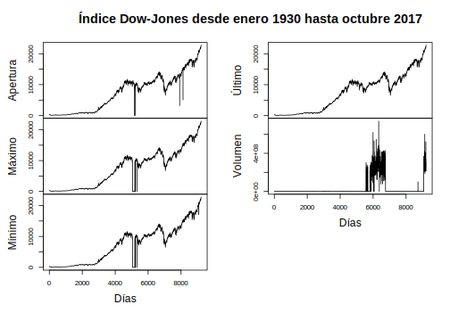

--- 
title: "Series de Tiempo en R"
subtitle: "Ciencia de los Datos Financieros"
author: "Synergy Vision"
date: "2018-10-17"
knit: "bookdown::render_book"
documentclass: krantz
bibliography: [book.bib, packages.bib]
biblio-style: apalike
link-citations: yes
colorlinks: yes
lot: yes
lof: yes
fontsize: 12pt
monofontoptions: "Scale=0.8"
keep_md: yes
site: bookdown::bookdown_site
description: ""
url: 'http\://synergy.vision/Series-de-Tiempo-en-R/'
github-repo: synergyvision/Series-de-Tiempo-en-R/
cover-image: images/cover.png
---

# Prefacio {-}

Placeholder


## ¿Por qué  leer este libro? {-}
## Estructura del libro {-}
## Información sobre los programas y convenciones {-}
## Prácticas interactivas con R {-}
## Agradecimientos {-}

<!--chapter:end:index.Rmd-->


# Acerca del Autor {-}

Este material es un esfuerzo de equipo en Synergy Vision, (<http://synergy.vision/nosotros/>).		 

El propósito de este material es ofrecer una experiencia de aprendizaje distinta y enfocada en el estudiante. El propósito es que realmente aprenda y practique con mucha intensidad. La idea es cambiar el modelo de clases magistrales y ofrecer una experiencia más centrada en el estudiante y menos centrado en el profesor. Para los temas más técnicos y avanzados es necesario trabajar de la mano con el estudiante y asistirlo en el proceso de aprendizaje con prácticas guiadas, material en línea e interactivo, videos, evaluación contínua de brechas y entendimiento, entre otros, para procurar el dominio de la materia.
  		  
Nuestro foco es la Ciencia de los Datos Financieros y para ello se desarrollará material sobre: **Probabilidad y Estadística Matemática en R**, **Programación Científica en R**, **Mercados**, **Inversiones y Trading**, **Datos y Modelos Financieros en R**, **Renta Fija**, **Inmunización de Carteras de Renta Fija**, **Teoría de Riesgo en R**, **Finanzas Cuantitativas**, **Ingeniería Financiera**, **Procesos Estocásticos en R**, **Series de Tiempo en R**, **Ciencia de los Datos**, **Ciencia de los Datos Financieros**, **Simulación en R**, **Desarrollo de Aplicaciones Interactivas en R**, **Minería de Datos**, **Aprendizaje Estadístico**, **Estadística Multivariante**, **Riesgo de Crédito**, **Riesgo de Liquidez**, **Riesgo de Mercado**, **Riesgo Operacional**, **Riesgo de Cambio**, **Análisis Técnico**, **Inversión Visual**, **Finanzas**, **Finanzas Corporativas**, **Valoración**, **Teoría de Portafolio**, entre otros.

Nuestra cuenta de Twitter es (https://twitter.com/bysynergyvision) y nuestros repositorios están en GitHub (https://github.com/synergyvision).
  		  
 **Somos Científicos de Datos Financieros**

<!--chapter:end:000-author.Rmd-->


# Introducción

Placeholder


## Conceptos financieros básicos
## Conceptos básicos 
## Ejemplos 
### Clasificación de las series de tiempo
## Componentes de una serie de tiempo
### El Modelo Aditivo de Componentes de Series de Tiempo
### El Modelo Multiplicativo de Componentes de Series de Tiempo

<!--chapter:end:100-introduction.Rmd-->


# Características de series de tiempo

Placeholder


## Medidas de dependencia para series de tiempo
## Estimación de la Tendencia
### Estimación de la tendencia en ausencia de estacionalidad
### Estimación de la tendencia y la estacionalidad
## Estimación de la tendencia por regresión clásica
### Regresión Clásica

<!--chapter:end:200-caracterisitcas-series-tiempo.Rmd-->


# Modelos de series de tiempo

Placeholder


## Modelos Estocásticos
### Procesos Estocásticos
### Momentos, Varianza, Covarianza y Correlación
### Variación de un proceso
### Martingalas
### Propiedad de Markov
## Modelos lineales
### Proceso de Ruido Blanco

<!--chapter:end:300-modelos-series-tiempo.Rmd-->


# Modelos AR

Placeholder


## Modelo AR(1)
## Modelo AR(2)
## Procesos AR(p)
## Función de Autocorrelación Parcial
## Criterios de Información
## Estimación de Parámetros.
## Predicciones con modelos AR
### Predicción de un paso
### Predicción de dos pasos
### Predicción de múltiples pasos

<!--chapter:end:301-modelos-AR.Rmd-->


# Modelos MA

Placeholder


## Propiedades de los modelos MA
### Estacionaridad
### Función de autocorrelación (ACF)
## Identificación del orden de un MA
## Estimación
## Predicciones usando modelos MA

<!--chapter:end:302-modelos-MA.Rmd-->


#  Modelos ARMA

Placeholder


## Propiedades de los modelos ARMA(p,q)
## Ecuaciones en Diferencias
### Función de Autocorrelación (ACF) para modelos ARMA
## Pronósticos
### Pronósticos para procesos ARMA

<!--chapter:end:303-modelos-ARMA.Rmd-->


# Estimación de parámetros

Placeholder


## Estimación
## Estimación por Máxima Verosimilitud y Mínimos Cuadrados {#sect-EMV}
## Estimación de mínimos cuadrados para modelos ARMA(p,q)

<!--chapter:end:304-estimacion-de-parametros.Rmd-->


# Modelos ARIMA

Placeholder


## Construcción de modelos ARIMA
## Modelos SARIMA

<!--chapter:end:305-modelos-ARIMA.Rmd-->


# Modelos ARCH y GARCH

Placeholder


## Estructura de los Modelos
## Modelos ARCH
### Estimación de un Modelo ARCH(p)
### Predicción con modelos ARCH
## Modelos GARCH
### Estimación de un Modelo GARCH
### Predicción con modelos GARCH

<!--chapter:end:306-Modelos-ARCH-GARCH.Rmd-->

# Modelos lineales estacionales y modelos no-estacionarios

## Modelos Estacionales

Algunas series en finanzas tales como los ingresos  trimestrales de los activos de una empresa presentan un cierto comportamiento cíclico o periódico. Tales tipos de series se denominan *series de tiempo estacionales*. En ciertas aplicaciones la estacionalidad la podemos considerar como algo secundario y por tanto la podemos remover, obteniendo una serie de tiempo estacionalmente ajustada la cula procedemos a estudiar. Sin embargo, en predicción de series financieras la estacionalidad es muy importante, tanto como otras características de los datos y por consiguiente la debemos considerar cuando hacemos el análisis de series de tiempo. En el capítulo [Modelos ARMA], en la sección [Modelos SARIMA] ya vimos un modelo estacional, el modelo SARIMA. Ahora veremos algunos modelos econométricos útiles para modelar series estacionales.

Para una serie de tiempo estacional $x_t$ con periodo estacinal $s$, la *diferenciación estacional* se define como 

\begin{equation}
\Delta sx_t = x_t-x_{t-s}.
(\#eq:eq-diferencia-estacional-s)
\end{equation}

La diferencia convencional $\Delta x_t=x_t-x_{t-1} = (1-B)x_t$ la llamaremos *diferenciación usual*. Consideremos ahora el caso especial de la siguiente serie estacional

\begin{equation}
(1-B^s)(1-B)x_t = (1-\theta B)(1-\Theta B^s)w_t,
(\#eq:eq-serie-estacional-s)
\end{equation}

donde $s$ es el período estacional de la serie, $w_t$ es un ruido blanco, $|\theta|<1$ y $|\Theta|<1$. Este modelo se conoce como el *modelo de aerolinea* (ver Box et. al (1994), Cap. 9). La parte autorregresiva $AR$ (lado izquierdo de \@ref(eq:eq-serie-estacional-s)) del modelo consta de diferencias estacionales y usuales, mientras que el promedio móvil, $MA$ (lado derecho de \@ref(eq:eq-serie-estacional-s)) involucra dos parámetros, $\theta$ y $\Theta$. Consideremos la parte $MA$,

$$w_t = (1-\theta B)(1-\Theta B^s)w_t = w_t-\theta w_{t-1}-\Theta w_{t-s}+\theta\Theta w_{t-s-1},$$

donde $w_t=(1-B^s)(1-B)x_t$. El proceso $w_t$ se denomina *modelo estacional multiplicativo MA*. En aplicaciones, un modelo estacional multiplicativo supone que la dinámica de las componentes regular y estacional de la serie son aproximadamente ortogonales.

## Modelos de memoria larga.

Algunas series de tiempo muestran marcadas correlaciones a rezagos grandes, nos referiremos a ellos como proceos de memoria larga. La *memoria larga* es una característica de muchas series de tiempo geofísicas. Los caudales en el río Nilo tienen correlación en rezagos grandes y Hurst (1951) demostró que esto afectaba la capacidad de diseño optima de una presa. Mudelsee (2007) demostró que la memoria larga es una propiedad hidrológica que puede conducir a sequías prolongadas o al agrupamiento temporal de inundaciones extremas. A una escala bastante diferente, Leland et. al (1993) encontraron que el tráfico de la red de área local (LAN) Ethernet parece ser estadísticamente autosimilar y un proceso de memoria larga. Demostraron que la naturaleza de la congestión producida por el tráfico autosimilar difiere drásticamente de la prevista por los modelos de tráfico utilizados en ese momento. Mandelbrot y sus compañeros de trabajo investigaron la relación entre la autosimilaridad y la memoria a largo plazo y desempeñaron un papel fundamental en el establecimiento de la geometría fractal como tema de estudio.

### Diferenciación fraccionada

Beran (1994) describió las características cualitativas de una trayectoria de muesteo típica (realización) de un proceso de memoria larga. Hay períodos relativmanete largos durante el cual las observaciones tienden a mantenerse a un nivel alto y periodos largos similares durante el cual las observaicones tienden a ser de bajo nivel. Puede parecer que hay tendencias o ciclos sobre períodos de tiempos cortos, pero no persisten y toda la serie parece estacionaria. Un criteio más objetivo es que la correlación muestral $r_k$ decaiga a cero a una tasa que es aproximadamente proporcional a $k^{-\lambda}$ para algún $0<\lambda<1$. Esto es notablemente más lento que la tasa de decaimiento de $r_k$ para realizaciones a partir de un proceso $AR(1)$, por ejemplo, el cual es aproximadamente proporcional a $\lambda^k$ para algún $0<\lambda<1$.

La definición matemática de un proceso estacionario con memoria larga, también conocido como dependencia o persistencia a largo plazo, se puede dar en términos de la función de autocorrelación.

\BeginKnitrBlock{definition}<div class="definition"><span class="definition" id="def:defi-proceso-memoria-larga"><strong>(\#def:defi-proceso-memoria-larga) </strong></span>Un *proceso estacionario con memoria larga* $x_t$ tiene una función de autocorrelación $\rho_k$ que satisface la condición

\begin{equation}
\lim_{k\to\infty}\rho_k=ck^{-\lambda}
(\#eq:eq-condicion-proceso-memoria-larga)
\end{equation}

para algún $c>0$ y $0<\lambda<1$. Cuanto más cerca está $\lambda$ de 0, más pronunciada es la memoria larga.</div>\EndKnitrBlock{definition}

---

El hidrólogo Harold Hurst halló que para muchos registros geofísicos, incluyendo los datos del río Nilo, el estadístico conocido como *rango reescalado* sobre un período $k$ es aproximadamente proporcional a $k^H$ para algún $H>1/2$. El parámetro de Hurst, $H$, se define como $H=1-\lambda/2$ y tiene rango $[1/2,1)$. Cuanto más cerca está $H$ de 1, más persistente es la serie. Si no hay efecto de memoria larga, entonces $H=1/2$.

\BeginKnitrBlock{definition}<div class="definition"><span class="definition" id="def:defi-modelo-diferencia-fraccional"><strong>(\#def:defi-modelo-diferencia-fraccional) </strong></span>Un modelo de diferencia fraccional de defiene como

\begin{equation}
(1-B)^dx_t=w_t,\quad -1/2<d>1/2,
(\#eq:eq-modelo-diferencia-fraccional)
\end{equation}

donde $\{w_t\}$ es un proceso de ruido blanco.</div>\EndKnitrBlock{definition}

---

Algunas de las propiedades para este modelo son las siguientes:

- Si $d<1/2$, entonces $x_t$ es un proceso débilmente estacionario con representación $MA$ infinita 
\begin{eqnarray*}
x_t &=& w_t = \sum_{i=1}^{\infty}\psi_iw_{t-i}\text{; con }\psi_k=\frac{d(d+1)\cdots(k-1+d)}{k!} \\
    &=& \frac{(k+d+1)!}{k!(d-1)!}
\end{eqnarray*}

- Si $d>1/2$, entonces $x_t$ es invertible con representación $AR$ infinita
\begin{eqnarray*}
x_t &=& \sum_{i=1}^{\infty}\pi_ix_{t-i}+w_t\text{, con }\pi_k=\frac{-d(1-d)\cdots(k-1-d)}{k!} \\
    &=& \frac{(k-d-1)!}{k!(-d-1)!}
\end{eqnarray*}

- Para $-1/2<d<1/2$, la ACF de $x_t$ es $$\rho_k=\frac{d(d+1)\cdots(k-1+d)}{(1-d)(2-d)\cdots(k-d)},\quad k=1,2,\ldots.$$ En particular $\rho_1=\frac{d}{1-d}$ y $$\rho_k\approx\frac{(-d)!}{(d-1)!}k^{2d-1}\text{, cuando }k\to n\infty.$$

- Para $-1/2<d<1/2$, la PACF de $x_t$ es $\phi_{kk}=\frac{d}{k-d}$ para $k=1,2,\ldots$.

- Para $-1/2<d<1/2$, la función de densidad epsectral $f(\omega)$ de $x_t$, que es la transformada de Fourier de la ACF de $x_t$ satisface

\begin{equation}
f(\omega)\sim\omega^{-2d},\quad \omega\to0
(\#eq:eq-densidad-espectral-proceso-memoria-larga)
\end{equation}

donde $\omega\in[0,2\pi]$ denota la frecuencia.

\BeginKnitrBlock{definition}<div class="definition"><span class="definition" id="def:defi-diferencia-fraccional-ARIMA"><strong>(\#def:defi-diferencia-fraccional-ARIMA) </strong></span>Un proceso de diferencia fraccional ARIMA, denotado $FARIMA(p,d,q)$ tiene la forma 

\begin{equation}
\phi(B)(1-B)^dx_t = \psi(B)w_t
(\#eq:eq-FARIMApdq)
\end{equation}

para algún $-1/2<d<1/2$. El rango $o<d<1/2$ da el proceso de memoria larga.</div>\EndKnitrBlock{definition}

---

Es útil introducir la serie fraccionadamente diferenciada $\{y_t\}$ y expresar la ecuación \@ref(eq:eq-FARIMApdq) como 

\begin{equation}
y_t = (1-B)^dx_t = [\phi(B)]^{-1}\psi(B)w_t,
(\#eq:eq-serie-fraccionada-diferenciada)
\end{equation}

porque esto sugiere un medio para adaptar un modelo $FARIMA$ a las series de tiempo.

Para un valor de prueba $d$, calculamos la serie fraccionadamente diferenciada $\{y_t\}$, ajustamos un modelo $ARIMA$ a $\{y_t\}$ y luego investigamos los residuos. El cálculo de las series fraccionadamente diferenciadas $\{y_t\}$ resulta de una expansión binomial formal de $(1-B)^d$ y está dada por

$$(1-B)^d = 1-dB+\frac{d(d-1)}{2!}B^2-\frac{d(d-1)(d-2)}{3!}B^3+\cdots$$

truncada para algún retardo convenientemente grande ($L$), que podríamos fijar razonablemente en 40. Por ejemplo, si $d=0.45$, entonces

\begin{eqnarray*}
y_t &=& x_t-0.45x_{t-1}+\frac{0.45(0.45-1)}{2!}x_{t-2}-\frac{0.45(0.45-1)(0.45-2)}{3!}x_{t-3}+\cdots\\
    &=& x_t-0.450x_{t-1}-0.12375x_{t-2}-0.0639375x_{t-3}-\cdots-0.001287312x_{t-40}.
\end{eqnarray*}

El código en $R$ para calcular los coeficientes es 


```r
cf=rep(40)
d=0.45
cf[1]=-d
for (i in 1:39) cf[i+1]=-cf[i]*(d-i)/(i+1)
```

Otra expresión equivalente para la ecuación \@ref(eq:eq-FARIMApdq), la cual resulta muy útil para simulación, es 

\begin{equation}
x_t = [\phi(B)]^{-1}\psi(B)(1-B)^{-d}w_t.
(\#eq:eq-FARIMA-simulacion)
\end{equation}

En simulación, el primer paso es calcular $(1-B)^{-d}w_t$. El operador $(1-B)^{-d}$ lo desarrollamos como

$$(1-B)^{-d} = 1-d(-B)+\frac{-d(-d-1)}{2!}B^2-\frac{-d(-d-1)(-d-2)}{3!}B^3+\cdots,$$

con la serie truncada en algún paso $L$ convenientemente largo. Las distribuciones de la serie independiente de ruido blanco la podemos elegir de modo que se adapten a la aplicación. Cabe destacar que en finanzas y telecomunicaciones las distirbuciones de colas pesadas a menudo son apropiadas. En particular una distribución $t$ con $\nu (>4)$ grados de libertad tiene curtosis $6/\nu-4$ y es también de cola pesada. Si, por ejemplo, $d=0.45$ y $L=40$, entonces

\begin{eqnarray*}
(1-B)^{-d}w_t &=& w_t+0.45w_{t-1}+0.32625w_{t-2}+0.2664375w_{t-3}+\cdots\\
              & & \cdots + 0.0657056w_{t-40}. 
\end{eqnarray*}

La función de autocorrelación $\rho_k$ de un proceso $FARIMA(0,d,0)$ tiende a 

$$\frac{\Gamma(1-d)}{\Gamma(d)}|k|^{2d-1},$$

para $n$ grande.

Un modelo $FARIMA(0,d,0)$ con $0<d<1/2$, está entre un modelo $AR(1)$ y un camino aleatorio no estacionario. En la práctica, para ajustar o simular , debemos truncar el modelo $FARIMA(0,d,0)$ en algún paso $L$. Entonces, este es equivalente a un modelo $AR(L)$, pero todos los coeficientes en el modelo $FARIMA(0,d,0)$ dependen un solo parámetro $d$.

### Ajuste de datos simulados

En el siguiente script, la función 'fraccdiff.sim' genera una realizaci'pon de un proceso $FARIMA$. El primer parámetro es la longitud de larealización, los parámetros $AR$ y $MA$ los podemos especificar usando la función 'c()' si hay más de uno para cada un de ellos, el siguiente parámetro es el valor de $d$.


```r
library(fracdiff)
set.seed(1)
fds.sim=fracdiff.sim(10000,ar=0.9,d=0.4)
x=fds.sim$series
fds.fit=fracdiff(x,nar = 1)
```

En el siguiente script, el primer 'for loop' calcula los coeficientes para los términos de rezago en las diferencias fraccionales usando el valor ajustado para $d$. El siguiente ciclo anidado calcula entonces la serie de tiempo fraccionadamente diferenciada. A continuación, se ajusta un modelo $AR$ a la serie diferenciada y se grafica la ACF de los residuales. Los residuales deben parecer una realización de un ruido blanco discreto.


```r
n <- length(x)
L <- 30
d <- fds.fit$d
fdc <- d
fdc[1] <- fdc
# Calculo de los coeficientes
for (k in 2:L) fdc[k] <- fdc[k-1] * (d+1-k) / k
y <- rep(0, L)
# Calculo de la serie fraccionadamente diferenciada
for (i in (L+1):n) {
  csm <- x[i]
  for (j in 1:L) csm <- csm + ((-1)^j) * fdc[j] * x[i-j]
  y[i] <- csm
}
y <- y[(L+1):n]
z.ar <- ar(y)
ns <- 1 + z.ar$order
z <- z.ar$res [ns:length(y)]
# Graficos
par(mfcol = c(2, 2))
plot(as.ts(x), ylab = "x", xlab="Tiempo", col="blue")
acf(x) ; acf(y) ; acf(z)
```

<!-- -->

La figura muestra una realización $\{x_t\}$ del proceso fraccionadamente diferenciado $FARIMA(1,0.4,0)$ (parte superior izquierda) con parámetro $AR$, $\phi=0.9$. Los valores estimados para $d$ y $\phi$ son 0.429 y 0.8839 respectivamente. En la parte superio derecha observamos la ACF para la realización $\{x_t\}$, y en la parte inferior izquierda la PACF para la serie fraccionadamente diferenciada $\{y_t\}$, como podemos notar, ambas funciones decaen lentamente, lo que indica la memoria larga. En la parte inferior derecha de la misma figura se mmuestra la ACF para los residuales de $y_t$. Con la función 'summary()' podemos ver los valores de los parámetros del modelo, así como algunos estadísticos.


```r
# Resumen
summary(fds.fit)
```

```
## 
## Call:
##   fracdiff(x = x, nar = 1) 
## 
## Coefficients:
##    Estimate Std. Error z value Pr(>|z|)    
## d  0.429045   0.014386   29.82   <2e-16 ***
## ar 0.883681   0.008772  100.74   <2e-16 ***
## ---
## Signif. codes:  0 '***' 0.001 '**' 0.01 '*' 0.05 '.' 0.1 ' ' 1
## sigma[eps] = 1.012294 
## [d.tol = 0.0001221, M = 100, h = 0.0001508]
## Log likelihood: -1.431e+04 ==> AIC = 28630.29 [3 deg.freedom]
```

### Evaluación de las pruebas de dependencia a largo plazo

A continuación mostraremos tre ejemplos donde evaluaremos las dependencias a largo plazo. El primer ejemplo es con los datos en el archivo "Nilemin.txt", el cual contiene los nivéles mínimos de agua ($mm$) del río Nilo para los años 622 a 1284, medidos en la Isla de Roda cerca del Cairo. El segundo ejemplo son los números de llegadas de paquetes (bits) en 4000 intervalos consecutivos de $10ms$ vistos en una Ethernet en las instalaciones de Bellcore Morristown Research and Engineering, el archivo es "LAN.txt". El último ejemplo son los datos del porcentaje mensual de la tasa preferencial del Banco de la Reserva Federal de los Estados Unidos, cortesía de la Junta de Gobernadores del Sistema de la Reserva Federal, desde enero de 1949 hasta noviembre de 2007. El archivo es "mprime.txt". Todos los archivos de datos fueron obtenidos de: <https://github.com/AtefOuni/ts/tree/master/Data>.

\BeginKnitrBlock{example}\iffalse{-91-78-105-118-233-108-101-115-32-109-237-110-105-109-111-32-100-101-108-32-114-237-111-32-78-105-108-111-93-}\fi{}<div class="example"><span class="example" id="exm:ejem-minimo-Nilo"><strong>(\#exm:ejem-minimo-Nilo)  \iffalse (Nivéles mínimo del río Nilo) \fi{} </strong></span>Para estos datos, es probable que haya una tendencia creciente durante el período de 600 años debido a los cambios climáticos o a los cambios en los canales alrededor de la Isla de Roda. Iniciamos el análisis estimando y removiendo la tendencia usando regresión lineal. Luego elegimos el valor de 'nar' inicial para aplicar la función 'fracdiff' sobre los residuales de la regresión. El valor estimado de $d$ con $nar=5$ es 0.3456 con un error estándar de 0.0295. El mejor modelo para la serie fraccionadamente diferenciada es un $AR(1)$ con parámetro $\phi=0.076$ y $d=0.3420$.</div>\EndKnitrBlock{example}


```r
Nilo=read.table("data/Nilemin.txt", header = T)
# Variables
Nivel=Nilo$Depth
n=length(Nivel)
tiempo=seq(1:n)
# Regresion linela para removver la tendencia
y=lm(Nivel~tiempo, Nilo)
summary(y)
```

```
## 
## Call:
## lm(formula = Nivel ~ tiempo, data = Nilo)
## 
## Residuals:
##     Min      1Q  Median      3Q     Max 
## -245.41  -56.97   -7.03   49.26  335.11 
## 
## Coefficients:
##              Estimate Std. Error t value Pr(>|t|)    
## (Intercept) 1.108e+03  6.672e+00 166.128  < 2e-16 ***
## tiempo      1.197e-01  1.741e-02   6.876 1.42e-11 ***
## ---
## Signif. codes:  0 '***' 0.001 '**' 0.01 '*' 0.05 '.' 0.1 ' ' 1
## 
## Residual standard error: 85.8 on 661 degrees of freedom
## Multiple R-squared:  0.06676,	Adjusted R-squared:  0.06535 
## F-statistic: 47.29 on 1 and 661 DF,  p-value: 1.423e-11
```

```r
reg=y$coefficients[1]+y$coefficients[2]*tiempo
Nilo.det=Nivel-reg
# Ajuste de la serie fraccionada diferenciada
Nilo.frac=fracdiff(Nilo.det, nar = 1)
summary(Nilo.frac)
```

```
## 
## Call:
##   fracdiff(x = Nilo.det, nar = 1) 
## 
## Coefficients:
##    Estimate Std. Error z value Pr(>|z|)    
## d   0.34204    0.02908  11.764   <2e-16 ***
## ar  0.07638    0.04911   1.555     0.12    
## ---
## Signif. codes:  0 '***' 0.001 '**' 0.01 '*' 0.05 '.' 0.1 ' ' 1
## sigma[eps] = 69.92234 
## [d.tol = 0.0001221, M = 100, h = 3.96e-05]
## Log likelihood: -3757 ==> AIC = 7520.48 [3 deg.freedom]
```

```r
# Simulacion de la serie fraccionada diferenciada
Nilo.sim=fracdiff.sim(n,ar=Nilo.frac$ar,d=Nilo.frac$d)
Nilo.sim.ts=Nilo.sim$series
# Modelo AR(1) para conseguir los residuales
Nilo.ar=ar(Nilo.sim.ts,order.max = 1)
Nilo.resid=Nilo.ar$resid[2:n]
```

En la gráfica siguiente se muestran los nivéles del río Nilo junto con la recta de regresión de tendencia (superior izquierda); la ACF de la serie de tiempo una vez removida la tendencia (superior derecha); la serie simulada con el proceso $FARIMA(1,d,0)$, con $d=0.342$ (medio izquierda); la ACF para la serie fraccionadamente diferenciada (medio izquierda); la ACF de los residuales del modelo $AR(1)$ (inferior izquierda) y la ACF de los residuales al cuadrado (inferior derecha).


```r
par(mfrow=c(3,2))
plot(tiempo,Nivel, type="l", col="blue", main="Nivel del río Nilo")
lines(tiempo,y$coefficients[1]+y$coefficients[2]*tiempo,col="red")
acf(Nilo.det, main="ACF de la serie con la tendencia removida")
plot(tiempo,Nilo.sim.ts, type="l", col="blue", ylab="Simulación", main="Serie fraccionada diferenciada")
acf(Nilo.sim.ts, main="ACF de la serie fraccionada diferenciada")
acf(Nilo.resid, main="ACF de los residuales")
acf(Nilo.resid^2, main="ACF de los residuales cuadrados")
```

<div class="figure">

<p class="caption">(\#fig:unnamed-chunk-6)Nivéles del río Nilo (serie de tiempo) y tendencia (superior izquierda); ACF de la serie de tiempo sin tendencia (superior derecha); serie simulada con un proceso $FARIMA(1,0.342,0)$ (medio izquierda); ACF para la serie fraccionadamente diferenciada (medio izquierda); ACF de los residuales del modelo $AR(1)$ (inferior izquierda) y la ACF de los residuales al cuadrado (inferior derecha)</p>
</div>

---

\BeginKnitrBlock{example}\iffalse{-91-68-97-116-111-115-32-100-101-32-69-116-104-101-114-110-101-116-32-101-110-32-66-101-108-108-99-111-114-101-93-}\fi{}<div class="example"><span class="example" id="exm:ejem-ethernet-bellcore"><strong>(\#exm:ejem-ethernet-bellcore)  \iffalse (Datos de Ethernet en Bellcore) \fi{} </strong></span>Al trazar el histograma de frecuencia de estos datos, nos damos cuenta que está notablemente sesgado, por lo que trabajamos con el logaritmo de uno más el número de bits. La ACF del log(bits) sugiere un modelo $FARIMA$ con un 'nar' mayor a 40. Usando $nar=48$, estimamos el modelo, el valor estimado para $d=0.3404$ y la serie fraccionadamente diferenciada no tiene correlación sustancial. Sin embargo, la función 'ar' fija un modelo $AR(26)$ a la serie, con un error estándar estimado de 2.10 el cual es ligeramente menor que 2.13 dado para el modelo $FARIMA$. Existe una autocrrelación notable en la serie de residuos cuadrados del modelo $AR(26)$, que es una característica de las series de tiempo con estallidos de actividad y que podemos modelar como un proceso $GARCH$.</div>\EndKnitrBlock{example}


```r
LAN=read.table("data/LAN.txt", header = T)
bits=LAN$bits
# Transformacion log(bits+1)
bits.t=log(bits+1)
# Histogramas
par(mfrow=c(1,2))
hist(bits)
hist(bits.t)
```

<!-- -->

```r
# Ajuste de un modelo FARIMA con d=48
bits.frac=fracdiff(bits.t,nar=48)
summary(bits.frac)
```

```
## 
## Call:
##   fracdiff(x = bits.t, nar = 48) 
## 
## Coefficients:
##        Estimate Std. Error z value Pr(>|z|)    
## d     0.3404813  0.0233127  14.605  < 2e-16 ***
## ar1  -0.0148508  0.0275781  -0.538 0.590232    
## ar2  -0.0961596  0.0197946  -4.858 1.19e-06 ***
## ar3  -0.0493055  0.0176442  -2.794 0.005199 ** 
## ar4   0.0167837  0.0171959   0.976 0.329049    
## ar5  -0.0106523  0.0162828  -0.654 0.512982    
## ar6  -0.0230067  0.0161581  -1.424 0.154489    
## ar7   0.0113776  0.0163584   0.696 0.486729    
## ar8   0.0568538  0.0162606   3.496 0.000472 ***
## ar9   0.0405608  0.0164081   2.472 0.013436 *  
## ar10  0.0489896  0.0162668   3.012 0.002598 ** 
## ar11  0.0560883  0.0161651   3.470 0.000521 ***
## ar12  0.0144855  0.0161796   0.895 0.370630    
## ar13  0.0491913  0.0162061   3.035 0.002402 ** 
## ar14  0.0460204  0.0160659   2.864 0.004177 ** 
## ar15  0.0399086  0.0160498   2.487 0.012899 *  
## ar16 -0.0039705  0.0161524  -0.246 0.805825    
## ar17 -0.0333139  0.0160881  -2.071 0.038386 *  
## ar18  0.0003386  0.0160481   0.021 0.983166    
## ar19  0.0003022  0.0160763   0.019 0.985001    
## ar20  0.0025804  0.0160814   0.160 0.872521    
## ar21 -0.0107361  0.0161908  -0.663 0.507265    
## ar22 -0.0004020  0.0159544  -0.025 0.979898    
## ar23 -0.0613019  0.0159822  -3.836 0.000125 ***
## ar24  0.0183999  0.0161150   1.142 0.253540    
## ar25 -0.0245225  0.0160008  -1.533 0.125378    
## ar26  0.0329974  0.0160214   2.060 0.039439 *  
## ar27 -0.0062424  0.0160164  -0.390 0.696719    
## ar28  0.0161387  0.0160478   1.006 0.314576    
## ar29 -0.0173780  0.0161130  -1.079 0.280807    
## ar30  0.0210730  0.0160533   1.313 0.189290    
## ar31 -0.0262005  0.0160503  -1.632 0.102597    
## ar32 -0.0012683  0.0159324  -0.080 0.936550    
## ar33 -0.0161564  0.0163686  -0.987 0.323626    
## ar34 -0.0079269  0.0160668  -0.493 0.621752    
## ar35 -0.0436958  0.0159488  -2.740 0.006148 ** 
## ar36 -0.0166445  0.0161027  -1.034 0.301302    
## ar37 -0.0087869  0.0160085  -0.549 0.583079    
## ar38 -0.0178358  0.0160632  -1.110 0.266846    
## ar39 -0.0206351  0.0160393  -1.287 0.198257    
## ar40 -0.0152764  0.0160439  -0.952 0.341016    
## ar41 -0.0222836  0.0160257  -1.390 0.164380    
## ar42  0.0352142  0.0160527   2.194 0.028260 *  
## ar43 -0.0186294  0.0160310  -1.162 0.245203    
## ar44 -0.0104739  0.0160729  -0.652 0.514625    
## ar45  0.0057522  0.0161186   0.357 0.721190    
## ar46 -0.0489269  0.0160671  -3.045 0.002326 ** 
## ar47 -0.0061030  0.0160594  -0.380 0.703926    
## ar48 -0.0141636  0.0160661  -0.882 0.378005    
## ---
## Signif. codes:  0 '***' 0.001 '**' 0.01 '*' 0.05 '.' 0.1 ' ' 1
## sigma[eps] = 2.073221 
## [d.tol = 0.0001221, M = 100, h = 9.055e-05]
## Log likelihood: -8593 ==> AIC = 17285 [50 deg.freedom]
```

```r
# simulacion del proceso FARIMA
bits.sim=fracdiff.sim(length(bits),ar=bits.frac$ar, d=bits.frac$d)
bits.ts=bits.sim$series
# Modelo AR(26) para conseguir los residuales
bits.ar=ar(bits.ts,order.max = 26)
bits.resid=bits.ar$resid
# Graficos
par(mfrow=c(3,2))
plot(bits.t, type="l", main = "Serie de tiempo transformada, log(bits+1)", xlab = "Tiempo", ylab = "x")
acf(bits.t, lag.max = 50, main="ACF de la serie log(bits+1)")
plot(bits.ts, type = "l", main = "Serie fraccionada diferenciada de log(bits+1)")
acf(bits.ts, main="ACF de la serie fraccionada diferenciada de log(bits+1)")
acf(bits.resid[27:4000], main="ACF de los residuales ")
acf(bits.resid[27:4000]^2, main="ACF de los residuales cuadrado")
```

<!-- -->

---

\BeginKnitrBlock{example}\iffalse{-91-84-97-115-97-32-100-101-32-112-114-101-115-116-97-109-111-32-98-97-110-99-97-114-105-111-93-}\fi{}<div class="example"><span class="example" id="exm:ejem-tasa-prestamo-bancario"><strong>(\#exm:ejem-tasa-prestamo-bancario)  \iffalse (Tasa de prestamo bancario) \fi{} </strong></span>La serie de tiempo es graficada en la parte superior de la figura \@ref(fig:fig-tasa-prestamo-bancario) y parece que podría ser la realización de un paseo al azar. También tiene un período de alta variabilidad. El correlograma muestras correlaciones muy altas con pasos pequeños y correlaciones sustanciales de hasta paso 28. Ni un paseo al azar ni un modelo con tendencia son modelos adecuados para simulación a largo plazo de las tasa de interés en una economía estable. En lugar de ello ajustamos un modelo $FARIMA$ que tiene la ventaja de ser estacionario.

La estimación de $d$ es casi 0, lo que implica que el decaimiento de las correlaciones a partir de un valor  inicial alto es más rápido que en el caso de un modelo $FARIMA$. El modelo $AR$ ajustado tiene un orden de 17 y no es del todo satisfactorio debido a la correlación estadísticamente significativa en el paso 1 de la serie de residuales. Las autocorrelaciones sustanciales de los residuales cuadrados del modelo $AR(17)$ sugieren que un modelo que se ajusta mejor es un modelo $GARCH$.</div>\EndKnitrBlock{example}


```r
TPB=read.table("data/mprime.txt",header = T)
tasa=TPB$Interest
plot(tasa, type = "l")
```

<!-- -->

```r
acf(tasa,lag.max = 40)
```

<!-- -->

---

En el capítulo [Modelos ARCH y GARCH] retomaremos estos 3 ejemplos y realizaremos los ajustes y simulación con modelos $GARCH$, de manera de observar las diferencias y lo apropiado de dichos modelos a estos datos.

### Simulación

Los modelos FARIMA son importantes para la simulación porque los modelos de memoria corta, que ignoran la evidencia de memoria larga, pueden llevar a una sobreestimación seria del rendimiento del sistema. Esto se ha demostrado de forma convincente en las escalas de los enrutadores de las redes de telecomunicaciones.

Los modelos realistas para la simulación normalmente necesitarán incorporar GARCH y distribuciones de cola pesada para la serie básica de ruido blanco. El procedimiento es ajustar un modelo GARCH a los residuos del modelo AR ajustado a las series fraccionadamente diferenciadas. Entonces los residuos del modelo GARCH y una distribución de probabilidad adecuada puede ser ajustada a los mismos. Una vez fijados los modelos, la simulación procede de la siguiente manera generando números aleatorios a partir del modelo de probabilidad ajustado ajustado a la Residuos de GARCH.

## Modelos de regresión


## Modelos no estacionarios:


## No estacionarios en Varianza


## No estacionarios en Media.


## Test de raíz unitaria.


<!--chapter:end:307-Modelos-estacionales-no-estacionarios.Rmd-->


# Análisis Espectral

Placeholder


## Comportamiento Cíclico y Periodicidad
## La Densidad Espectral
## Periodograma y Transformada Discreta de Fourier
## Estimación Espectral No-paramétrica
## Procesos de Incremento Ortogonal sobre $[-\pi,\pi]$
## Integración con Respecto a un Proceso de Incremento Ortogonal
### Propiedades de la Integral Estocástica
## La Representación Espectral

<!--chapter:end:308-Analisis-espectral.Rmd-->

\cleardoublepage 

# (APPENDIX) Apéndice {-}


<!--chapter:end:400-apendice.Rmd-->

# Referencias {-}


<!--chapter:end:500-references.Rmd-->

